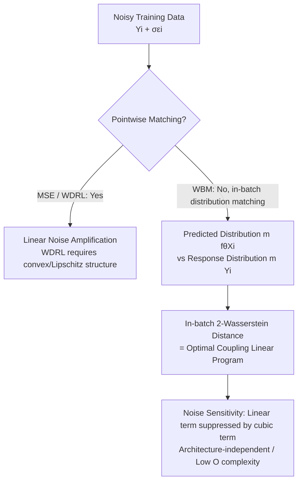

# Noise Tolerance of Distributionally Robust Learning

**Conference**: ICLR 2026  
**OpenReview**: [https://openreview.net/forum?id=mf35JXqWHS](https://openreview.net/forum?id=mf35JXqWHS)  
**Code**: The paper claims it is open-sourced ("Code available" in text, link not provided)  
**Area**: Learning Theory / Distributionally Robust Optimization / Noise-Robust Regression  
**Keywords**: Wasserstein Distance, Distributionally Robust Learning (WDRL), Additive Noise Robustness, Operator Learning, Noise Scale Analysis  

## TL;DR
This paper reveals that mainstream Wasserstein Distributionally Robust Learning (WDRL) provides no robustness gain against global additive noise when the regression function is non-convex or non-Lipschitz. Consequently, it proposes Wasserstein Batch Matching (WBM), which is independent of model architecture. WBM performs optimal transport matching between the predicted distribution and the response distribution within a batch. Theoretically, this suppresses the linear sensitivity of the loss to noise into cubic decay. Experiments on PDE operator learning and power grid time-series forecasting show that WBM outperforms MSE and various DRO methods with approximately 10x lower computational cost.

## Background & Motivation
**Background**: Real-world data is ubiquitous with noise—sensor noise, measurement errors, quantization errors, etc. To avoid expensive denoising pre-processing, several robust learning paradigms have been studied. Among them, Wasserstein Distributionally Robust Learning (WDRL) has received significant attention. It formulates training as a minimax problem seeking the worst-case distribution within a Wasserstein ball of radius $\delta$ centered at the empirical distribution, offering theoretical elegance and strong performance in linear regression, image classification, and adversarial defense.

**Limitations of Prior Work**: The popularity of WDRL is almost entirely built on **bounded data domains** (e.g., image classification), where the loss naturally satisfies Lipschitz continuity, allowing the minimax problem to be rewritten into a solvable dual form. However, to apply this dual form to regression tasks in unbounded domains, one must forcibly impose convexity or Lipschitz structural constraints on neural networks, which **sacrifices model expressivity**. Furthermore, it remains largely unexplored whether WDRL is truly robust against "global additive noise" (measurement/quantization noise affecting all samples, potentially heavy-tailed and unbounded).

**Key Challenge**: The robustness guarantees of WDRL depend on the convex/Lipschitz structure of the regression function. However, deep models capable of solving PDE operators are precisely those that do not satisfy these structures—**the models supported by theoretical guarantees are not strong enough, and the strong models lack guarantees**.

**Goal**: (1) Diagnose the failure of WDRL under non-convex/non-Lipschitz regression in the presence of global noise; (2) Propose a regression loss that is fully decoupled from model architecture and robust to additive (including heavy-tailed) noise, accompanied by theoretical characterization of the noise scale.

**Core Idea**: **[Distribution Alignment Instead of Pointwise Matching]** Since noise causes the observed response $Y_i+\sigma\varepsilon_i$ to deviate from the ground truth, forcibly matching features to noisy responses pointwise actually amplifies noise sensitivity. It is better to **relax the one-to-one correspondence** within a batch and instead require the predicted distribution and response distribution to align in the Wasserstein sense, thereby "averaging out" the noise.

## Method

### Overall Architecture
The method follows a two-step logic: first, **disprove**—by using the solvable dual form of WDRL $d_2$ as a direct loss to train a Convolutional Neural Operator (CNO) for Navier-Stokes, the paper shows it performs worse than ordinary MSE under heavy-tailed noise, demonstrating that its robustness relies on broken structural assumptions; second, **propose**—Wasserstein Batch Matching (WBM), which replaces the per-sample squared error of MSE with the 2-Wasserstein distance between the "in-batch predicted distribution vs. response distribution," proved robust via consistency propositions and noise scale analysis.

### Key Designs

**1. WDRL Failure Diagnosis: When structural assumptions fail, robustness disappears.** The minimax formulation of WDRL $\inf_\theta \sup_{W_2(\mu,\hat\mu)\le\delta}\mathbb{E}_\mu[\ell(Y,f_\theta(X))]$ is an infinite-dimensional problem. It can only be rewritten into the solvable dual form $d_2 = \inf_{\lambda\ge0}[\lambda\delta + \frac1n\sum_i \sup_{\xi}(\ell(\xi_1-f_\theta(\xi_2)) - \lambda\|Y_i-\xi_1\|_2^2 - \lambda\|X_i-\xi_2\|_2^2)]$ when $\ell_\theta$ is the finite maximum of concave functions or is Lipschitz continuous. A key observation of the paper is that satisfying these assumptions in unbounded regression requires constraining the network to be Lipschitz/convex; otherwise, the equality no longer holds, and the dual form is merely a "formal loss." The authors trained a CNO using $d_2$ to solve 2D Navier-Stokes and found WDRL performed significantly worse than MSE under heavy-tailed Cauchy noise and showed no improvement under Gaussian noise. This negative conclusion was previously overlooked because prior work focused on bounded image classification.

**2. Wasserstein Batch Matching: Converting pointwise regression to in-batch distribution optimal transport.** The goal of WBM is $\hat\theta_{\text{WBM}} \in \arg\min_\theta \sum_{p\ge1} W_2(m[(Y_i)_{i\in I_p}],\, m[(f_\theta(X_i))_{i\in I_p}])$. For each batch $I_p$, it compares the 2-Wasserstein distance between the empirical distribution of responses and the empirical distribution of predictions, rather than the fixed $i\leftrightarrow i$ squared difference in MSE. For empirical distributions, this Wasserstein distance reduces to a linear program $W_2 = \min_{P\in C}\langle P, M\rangle$, where the cost matrix $M=(\|Y_i-f_\theta(X_j)\|_2^2)_{i,j}$ represents pairwise distances, and $C$ is the set of coupling matrices. Intuitively (Fig. 3 in the paper), regression is no longer about "passing through every point" but finding the optimal transport map from the feature distribution to the response distribution, allowing proximal samples to "borrow" responses to cancel noise. Two engineering properties ensure it can train deep models: the loss is differentiable with respect to $\theta$ (Envelope Theorem, Bonnans-Shapiro), and each step only solves an $O(s)$ ($s=\dim(Y)$) linear program, **independent of the regression function structure**. This is computationally superior to WDRL, which is $O(s^3)$ in convex-concave cases and arbitrarily difficult in non-convex cases.

**3. Consistency Guarantees: Weak matching does not lose the true function.** Does relaxing the one-to-one correspondence lead to incorrect models? Proposition 4.1 provides a counter-guarantee: if $f$ is continuously differentiable, integrable, and its Fourier transform is compactly supported (band-limited), then even if sample points are shuffled by an unknown batch-preserving permutation $\phi$, minimizing $\sum_p W_2(m[(f(x_i))],\, m[(g(x_j))])$ in the noiseless limit **uniquely identifies $f$** within the class of band-limited functions co-monotonic with $f$. This indicates that WBM's "weak matching" only discards permutation degrees of freedom (recovered by the co-monotonicity constraint) without losing information about the function itself, making batch matching a reasonable relaxation rather than a degradation of MSE.

**4. Noise Scale Analysis: Linear sensitivity suppressed by cubic terms.** This is the theoretical core of WBM's robustness (Prop. 5.1). Assuming normalized responses and noise variance $\sigma^2$ for $\sigma\in(0,1)$, the first-order expansion of the WBM loss regarding noise is $\sum_{i,j}[(Y_i-f_\theta(X_j)) - (Y_i-f_\theta(X_j))^3]P_{i,j}\sigma\varepsilon_i + O(\sigma^2)$, whereas the corresponding term for MSE is $\frac{2\sigma}{\#I_p}\sum_i (Y_i-f_\theta(X_i))\varepsilon_i + O(\sigma^2)$. Comparison shows that when the error between prediction and response is less than 1, the linear sensitivity coefficient of WBM is **actively reduced by a cubic term $-(Y_i-f_\theta(X_j))^3$**. Thus, the first-order impact of noise on the loss is smaller than that of MSE—a dividend of "taking the infimum over all couplings." The authors further extend this to the level of SGD invariant measures (Cor. 5.2), characterizing the learned parameter bias $\bar\theta_\eta-\theta^\star = \eta(\nabla^2\ell_{\theta^\star})^{-1}\nabla^3\ell_{\theta^\star}A(\theta^\star)V(\theta^\star)+O(\eta^2)$, where $V(\theta^\star)=\mathbb{E}[(\nabla_\sigma\ell_{\theta^\star})^{\otimes2}]$ is directly determined by the loss sensitivity to noise. In contrast, WDRL gradient iterations involve a **non-centered bias term**, preventing convergence—explaining WDRL's lack of robustness from an optimization dynamics perspective.

## Key Experimental Results

Experiments use Mean Absolute Error (MAE) for evaluation. The primary baseline is MSE (WDRL was shown inferior to ERM in Section 3), with additional comparisons to divergence-based DRO (CVaR-DRO, Chi-Sq-DRO). Noise includes Gaussian and heavy-tailed Cauchy (infinite variance, $\sigma$ as scale parameter). Typically, 30% of data is corrupted, and results are averaged over 13 runs.

### Main Results

| Task | Model | Noise | Conclusion |
|------|------|------|------|
| Navier-Stokes Operator Learning | CNO | Cauchy (30% Train/Test) | MSE and WDRL errors are significantly large; **WBM is clearly robust** |
| Navier-Stokes Operator Learning | CNO | Gaussian | WBM consistently outperforms MSE; WDRL shows no improvement |
| Wave Equation Operator Learning | CNO | Gaussian (30% Train) | WBM outperforms MSE |
| Power Grid Load (ETDataset) | TSMixer | Cauchy / Gaussian | WBM outperforms MSE, **especially under Cauchy noise** |

### Ablation Study

| Comparison Dimension | Setting | Result |
|----------|------|------|
| vs Divergence-type DRO | CVaR-DRO / Chi-Sq-DRO | WBM has better accuracy and at least **10x lower** training cost |
| vs GCDRO | kNN Graph Construction | GCDRO performs poorly on high-dimensional data used here; not applicable |
| Computational Complexity | WBM $O(s)$ vs WDRL $O(s^3)$ (if convex-concave) | WBM is architecture-independent; WDRL is arbitrarily hard in non-convex cases |
| Distribution Shift Robustness | Train on low-noise / Test on noisy | WBM demonstrates robustness to deployment-time noise |

### Key Findings
- **WDRL is not robust under regression + global noise**: Under heavy-tailed noise, it performs worse than naive MSE, overturning the common perception of WDRL's robustness, due to the failure of Lipschitz/convex structures in unbounded regression.
- **WBM is particularly effective against heavy-tailed noise**: While MSE/WDRL fail under infinite-variance Cauchy noise, WBM remains stable, validating the theory of cubic term suppression.
- **Structure-independent + Low Cost**: WBM does not constrain network architecture and only solves a low-dimensional linear program per step, saving about 10x training overhead compared to divergence-type DRO; it can be used as a drop-in replacement for MSE.

## Highlights & Insights
- **"Disprove then Propose" narrative is clean and powerful**: Starting with a concrete CNO/Navier-Stokes experiment provides a counterexample to the community's default assumption about WDRL, leading naturally to WBM.
- **Attributing robustness to the "first-order coefficient of the loss w.r.t. noise"**: The noise scale analysis (linear vs. cubic terms) provides an interpretable and comparable metric for robustness, which is closer to real-world noise than indirect characterizations like "ball radius $\delta$."
- **Distribution matching instead of pointwise matching** is a simple but profound shift—essentially acknowledging that "pointwise identities of noisy labels are untrustworthy" and treating a batch as a point cloud for regression, echoing ideas in noisy-label learning and Noise2Noise.
- The differentiability with respect to $\theta$ and the solvability of the linear program make the method plug-and-play rather than just theoretical.

## Limitations & Future Work
- **Requires sufficient regularity of the underlying function** (band-limited/differentiable assumption in Prop. 4.1), which may be challenging for operator learning with discontinuities (e.g., shock waves).
- **Potential slight underfitting in low-noise scenarios**: Weak matching is suboptimal when responses are perfectly reliable—a fundamental tension between being robust to noise and precise on clean data.
- Currently only validates i.i.d. additive noise; robustness to **correlated or structured noise** remains for future work.
- The paper focuses on regression and does not touch classification; additionally, the in-batch matching's batch size becomes a new hyperparameter requiring tuning.

## Related Work & Insights
- **WDRL / Distributionally Robust Optimization** (Mohajerin Esfahani & Kuhn 2018; Shafieezadeh-Abadeh 2019; Gao 2024): The direct benchmark and "disproved" object of this paper, clarifying the structural prerequisites for its robustness.
- **Divergence-type DRO** (CVaR-DRO, Chi-Sq-DRO, Duchi & Namkoong 2021; GCDRO, Liu 2024): Experimental baselines where WBM leads in high dimensions and cost-efficiency.
- **Denoising/Filtering and Noise2Noise** (Lehtinen 2018): Traditional denoising requires low-noise data or explicit noise models; WBM trains directly from noisy data, aligning with the "learning noise from noise" philosophy.
- **Markov Chain characterization of constant step-size SGD** (Dieuleveut 2020): Used to analyze noise bias in parameters learned by WBM/MSE, mapping "loss scale" to "parameter scale."
- **Insight**: Relaxing "pointwise supervision" to "distribution-level supervision" is a universal strategy for label noise. Future work could explore classification, correlated noise, and combining batch matching with optimal transport acceleration (Sinkhorn) for larger batches.

## Rating
- Novelty: ⭐⭐⭐⭐ — Pointing out WDRL's lack of robustness in non-convex regression is a novel negative result; the distribution matching perspective and cubic suppression analysis are original.
- Experimental Thoroughness: ⭐⭐⭐ — Covers PDE operator learning and power grid time-series with Gaussian and heavy-tailed noise against multiple DROs, but limited to regression with relatively few datasets and lacking large-scale tables (mostly figures).
- Writing Quality: ⭐⭐⭐⭐ — The "disprove then propose" structure is clear; theoretical propositions are well-integrated with experiments.
- Value: ⭐⭐⭐⭐ — Corrects over-optimistic views of WDRL robustness and provides a structure-independent, low-cost, plug-and-play robust loss relevant to noisy scientific/engineering data modeling.

<!-- RELATED:START -->

## Related Papers

- [\[ICML 2026\] Learning Credal Ensembles via Distributionally Robust Optimization](../../ICML2026/learning_theory/learning_credal_ensembles_via_distributionally_robust_optimization.md)
- [\[ICLR 2026\] Towards Persistent Noise-Tolerant Active Learning of Regular Languages with Class Query](towards_persistent_noise-tolerant_active_learning_of_regular_languages_with_clas.md)
- [\[ICLR 2026\] Near Optimal Robust Federated Learning Against Data Poisoning Attack](near_optimal_robust_federated_learning_against_data_poisoning_attack.md)
- [\[ICLR 2026\] Robust Decision Making with Partially Calibrated Forecasts](robust_decision-making_with_partially_calibrated_forecasters.md)
- [\[ICLR 2026\] Bandit Learning in Matching Markets Robust to Adversarial Corruptions](bandit_learning_in_matching_markets_robust_to_adversarial_corruptions.md)

<!-- RELATED:END -->
