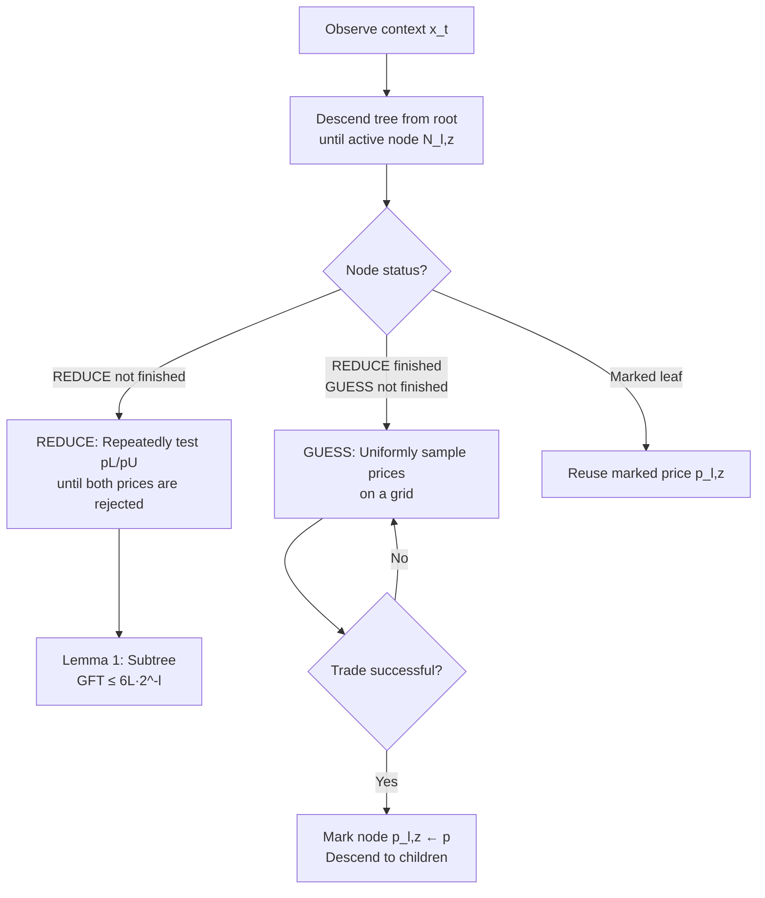

# Nonparametric Contextual Online Bilateral Trade

**Conference**: ICLR 2026  
**OpenReview**: [https://openreview.net/forum?id=3IA5XRwP27](https://openreview.net/forum?id=3IA5XRwP27)  
**Code**: Not open-sourced (Purely theoretical)  
**Area**: learning theory  
**Keywords**: Online learning, bilateral trade, contextual bandits, nonparametric, Lipschitz, regret bounds, one-bit feedback  

## TL;DR
Under the most stringent setting where buyer and seller valuations are arbitrary Lipschitz functions of the context, feedback is restricted to a single bit ("whether the trade occurred"), and strong budget balance is required, this paper proposes a pricing algorithm based on hierarchical tree partitioning. It achieves an $\tilde{O}(T^{(d-1)/d})$ regret bound and provides a matching lower bound to prove its optimality.

## Background & Motivation
**Background**: Online bilateral trade models scenarios where a platform faces a pair of buyers and sellers in each round. Without knowing their private valuations, the platform quotes a price $p_t$ to facilitate a trade. The trade occurs if the seller's ask $s_t \le p_t \le b_t$ (the buyer's bid), and the gain from trade (GFT) is $\mathrm{GFT}(p_t|s_t,b_t)=\mathbb{1}(s_t\le p_t\le b_t)(b_t-s_t)$. In real-world scenarios, platforms often observe $d$-dimensional contextual features $x_t$ regarding the item or the participants; Gaucher et al. (2025) recently introduced a feature-based version of this problem.

**Limitations of Prior Work**: Existing contextual works **only handle linear valuation models** $s_t=x_t^\top\theta$. Furthermore, to achieve no-regret under the weakest one-bit feedback, they often **relax the budget balance constraint** (allowing the platform to subsidize or take a cut). Once valuations are non-linear functions of the context, existing nonparametric contextual online learning methods generally fail.

**Key Challenge**: The GFT reward function has two characteristics that render classic methods ineffective: (1) it is **discontinuous** (a step function) with respect to both the price $p$ and the valuations $s,b$, making it impossible to apply standard Lipschitz loss zooming or chaining; (2) the reward to be maximized, $\mathrm{GFT}$, is **never observed**—whether a trade occurs or not, the valuations $s,b$ remain hidden, with the only feedback being the single bit $\mathbb{1}(s\le p\le b)$. If treated as a general Lipschitz reward, the lower bound would degrade to $\Omega(T^{(d+2)/(d+3)})$.

**Goal**: To provide the optimal regret bound under the triple constraints of **arbitrary $L$-Lipschitz valuations + one-bit feedback + strong budget balance** (quoting the same price to both parties in each round).

**Core Idea**: **[Nonparametric + Exploiting Geometric Structure]** Instead of treating GFT as a black-box Lipschitz function, the authors exploit its specific "step-function + noise-free" shape. By using a hierarchical tree with a branching factor of $2^d$ to refine contextual partitions and employing two subroutines at each node—"REDUCE" (forcing trade participants toward the diagonal) and "GUESS" (randomly sampling prices to hit a trade)—the discontinuous reward is converted into controllable regret.

## Method

### Overall Architecture
The algorithm maintains a tree that hierarchically partitions the $d$-dimensional contextual hypercube $[0,1]^d$. Each node at level $\ell$ corresponds to a small cubic region with side length $2^{-\ell}$, a branching factor of $2^d$, and a height $H=\lfloor\log_{2^d}T\rfloor$. Upon observing context $x_t$, the algorithm descends from the root until it reaches an "active node" (where all ancestors are marked but the node itself is not) or a leaf. It sequentially executes the REDUCE and GUESS subroutines on that node: REDUCE is responsible for compressing the potential GFT within the subtree to $O(L2^{-\ell})$, while GUESS aims to find a successful trade price and "mark" the node. Once a node is marked with a price $p_{\ell,z}$, subsequent contexts falling into its region reuse this price.

### Key Designs

**1. Hierarchical Tree Partitioning: Adaptive Refinement via Contextual Density** The algorithm organizes $[0,1]^d$ into a tree where node $N_{\ell,z}$ represents the region $\mathrm{Region}(N_{\ell,z})=[z_1,z_1+2^{-\ell}]\times\cdots\times[z_d,z_d+2^{-\ell}]$. This essentially adapts the concepts of adaptive zooming from Slivkins (2014) and chaining from Cesa-Bianchi et al. (2017) to bilateral trade: regions with more observed contexts are geometrically refined. Due to Lipschitz continuity, level $\ell$ maintains an $O(2^{-\ell})$ discretization of the mapping from context to optimal price. Since the optimal prices for all contexts within a node vary by at most $O(L2^{-\ell})$, finding one successful price in that region can approximately serve the entire area. Regret is decomposed by node $R_T=\sum_{\ell=0}^H\sum_{z\in Z_\ell}R_{\ell,z}$.

**2. REDUCE Subroutine: Intentionally Seeking Rejection to Force Valuations Near the Diagonal** This is the most counter-intuitive yet critical step. In an active node $N_{\ell,z}$, the algorithm selects two prices centered around the parent's marked price $\bar p$: $p_L=\Pi_{[0,1]}(\bar p-L2^{-(\ell-1)})$ and $p_U=\Pi_{[0,1]}(\bar p+L2^{-(\ell-1)})$. It repeatedly quotes $p_L$ until rejected, then $p_U$ until rejected. **Why seek rejection?** If an adversary makes both the low price $p_L$ and high price $p_U$ rejected by a buyer-seller pair, the Lipschitz constraint forces all valuations within that node's context region into a narrow band where $s\approx b$. Lemma 1 proves: after REDUCE terminates, $f_b(x)-f_s(x)\le 6L2^{-\ell}$ for any $x$ in the node. This clamps the potential GFT (and thus regret) for the entire subtree at $O(L2^{-\ell})$. The regret from REDUCE itself is small (Lemma 2: $R^{\mathrm{REDUCE}}_{\ell,z}\le 24L2^{-\ell}$).

**3. GUESS Subroutine: Randomized Pricing to Combat Discontinuity** After REDUCE, the algorithm **uniformly and randomly** quotes prices from a grid $P_{\ell,z}=[\bar p-L2^{-(\ell-1)},\bar p+L2^{-(\ell-1)}]_\epsilon$ until a trade occurs, at which point it marks the node. Randomization is key to bypassing GFT discontinuity: by Lipschitz continuity, the grid must contain a tradable price. With grid size $|P_\epsilon|=O(\epsilon^{-1}L2^{-\ell})$, the probability of hitting a trade for any GFT $\ge \epsilon$ is $\Omega(\epsilon 2^\ell/L)$, taking $O(L2^{-\ell}/\epsilon)$ rounds on average. Lemma 3 gives $R^{\mathrm{GUESS}}_{\ell,z}\le\epsilon\,\mathbb{E}[|T_{\ell,z}|]+\frac{24L^2 2^{-2\ell}}{\epsilon}$. Notably, the $2^{-2\ell}$ term (rather than $2^{-\ell}$) due to the REDUCE clamping allows for an improvement over the naive $\tilde O(T^{(d-2)/d})$ to the optimal rate. Setting $\epsilon=LT^{-1/d}$ yields Theorem 1: $R_T=O(L\log^2(T)\,T^{(d-1)/d})$.

**4. Multi-scale Extension: Operating without Known Lipschitz Constants** The above algorithm explicitly depends on $L$, which is often unknown. Section 4 introduces GeometricReduce / GeometricGuess, which maintains a sequence of geometrically increasing candidate Lipschitz constants $\tilde L^j_{\ell,z}=O(2^j)$. It climbs these scales logarithmically while randomly sampling. This ensures termination within $O(L2^{-\ell}/\epsilon)$ rounds when GFT $\ge \epsilon$ without wasting excessive rounds on scales that are too small. This adds only an $O(\log^2(T)L)$ factor to the regret, as shown in Theorem 2: $R_T=O(\log^2(T)^2 L^2 T^{(d-1)/d})$.

## Key Experimental Results
This is a **purely theoretical work without numerical experiments**. The core results are the regret upper bound and the matching lower bound.

### Main Results

| Setting | Feedback | Budget Balance | Known $L$ Required | Regret Bound |
|------|------|----------|----------------|--------|
| Ours (Thm 1) | One-bit | Strong BB | Yes | $O(L\log^2(T)\,T^{(d-1)/d})$ |
| Ours (Thm 2) | One-bit | Strong BB | No | $O(\log^2(T)^2 L^2 T^{(d-1)/d})$ |
| Ours (Thm 3 - Lower) | Full | Strong BB | — | $\Omega(L\,T^{(d-1)/d})$ (for $T>(4L)^d$) |
| Gaucher et al. 2025 (Linear) | Two-bit | Strong BB | — | $\tilde O(T^{2/3})$ |
| Gen. Lipschitz Reward Baseline | — | — | — | $\Omega(T^{(d+2)/(d+3)})$ |

### Key Findings
- **Optimal Upper and Lower Bounds**: Theorem 3 establishes an $\Omega(LT^{(d-1)/d})$ lower bound, which holds even under **full feedback**. This implies that decreasing feedback from full to one-bit does not lose an order of magnitude in this problem, and the proposed algorithm is optimal up to logarithmic factors.
- **Breaking General Lipschitz Lower Bounds**: While general Lipschitz functions have a lower bound of $\Omega(T^{(d+2)/(d+3)})$, this work exploits the step-function shape and noise-free structure of GFT to achieve $T^{(d-1)/d}$, which is strictly faster.
- **Lower Bound Proof Technique**: Combines Yao’s Minimax Principle (reducing worst-case stochastic performance to deterministic algorithms on distribution instances) with McShane’s Extension Theorem (ensuring Lipschitz functions on discrete sets can be extended to continuous domains).

## Highlights & Insights
- **The Counter-intuitive "Seeking Rejection" Design**: REDUCE deliberately uses rejected prices to utilize the adversary's constraints. If the adversary rejects both ends, the Lipschitz constraint forces them into a narrow diagonal band, thus clamping the potential regret of the entire subtree. This is a brilliant conversion of an "adversarial game" into "geometric constraints."
- **Randomization to Break Discontinuity**: When faced with rewards that are both discontinuous and unobservable, deterministic zooming fails. Uniformly sampling on an adaptive grid quantifies the "hit probability" as $\Omega(\epsilon 2^\ell/L)$, which is the key to bypassing discontinuity.
- **Feedback Degradation without Order Loss**: Since the lower bound holds under full feedback, the difficulty of the problem stems from the contextual dimension $d$ and the Lipschitz structure rather than feedback sparsity—one-bit is already "sufficient."

## Limitations & Future Work
- **Curse of Dimensionality**: The regret $T^{(d-1)/d}$ approaches linear quickly as $d$ increases, limiting practicality in high-dimensional contexts; this is an inherent cost of the nonparametric setting.
- **Purely Theoretical**: There are no numerical or real-market experiments to verify constant factors or performance at finite $T$.
- **Adversarial Oblivious Contexts + Deterministic Mappings**: The paper assumes valuations are deterministic Lipschitz functions of context (noise-free). In reality, valuations often have stochastic perturbations; the noisy nonparametric setting remains to be explored.
- **Beyond Strong Budget Balance**: Optimal rates for variants such as weak/global budget balance or profit maximization (rather than just GFT maximization) in nonparametric settings have yet to be characterized.

## Related Work & Insights
- **Online Bilateral Trade**: Cesa-Bianchi et al. (2024) pioneered the online version (i.i.d. valuations); Azar et al. (2022) and Bernasconi et al. (2024) studied adversarial/global budget balance; Gaucher et al. (2025) is the most direct predecessor (linear contexts, which this work generalizes to arbitrary Lipschitz).
- **Nonparametric Contextual Online Learning**: Started by Hazan & Megiddo (2007), with matching bounds closed by Rakhlin & Sridharan (2015) at $\tilde O(T^{(d-1)/d})$. The tree construction here draws from Slivkins’ (2014) zooming and Cesa-Bianchi et al.’s (2017) chaining.
- **Inspiration**: The "Hierarchical Tree + REDUCE Clamping + Randomized GUESS" framework has potential for migration to other markets where rewards are discontinuous and unobservable, such as second-price auctions or dynamic pricing. The idea of "seeking rejection to constrain the adversary" is worth considering in broader adversarial online learning.

## Rating
- **Novelty**: ⭐⭐⭐⭐⭐ The first to generalize contextual online bilateral trade to an arbitrary Lipschitz nonparametric setting, providing the optimal rate under the most demanding one-bit feedback + strong budget balance. The REDUCE design is highly original.
- **Experimental Thoroughness**: ⭐⭐⭐ A purely theoretical paper with matching bounds but no numerical verification (standard for theory papers, not a flaw but limits practical judgment).
- **Writing Quality**: ⭐⭐⭐⭐ Technical challenges, intuition, and lemma chains follow a logical progression. Figure 1 clarifies the geometric meaning of REDUCE well; high theoretical density makes it challenging for non-experts.
- **Value**: ⭐⭐⭐⭐ Solidly characterizes the optimal rates for nonparametric bilateral trade at the intersection of algorithmic game theory and online learning. Practical application is constrained by the curse of dimensionality.

<!-- RELATED:START -->

## Related Papers

- [\[ICLR 2026\] Variance-Dependent Regret Lower Bounds for Contextual Bandits](variance-dependent_regret_lower_bounds_for_contextual_bandits.md)
- [\[ICLR 2026\] Contextual Multi-Armed Bandits with Minimum Aggregated Revenue Constraints](contextual_multi-armed_bandits_with_minimum_aggregated_revenue_constraints.md)
- [\[ICLR 2026\] Semi-Parametric Contextual Pricing with General Smoothness](semi-parametric_contextual_pricing_with_general_smoothness.md)
- [\[ICLR 2026\] Queue Length Regret Bounds for Contextual Queueing Bandits](queue_length_regret_bounds_for_contextual_queueing_bandits.md)
- [\[ICLR 2026\] Diversified Multinomial Logit Contextual Bandits](diversified_multinomial_logit_contextual_bandits.md)

<!-- RELATED:END -->
