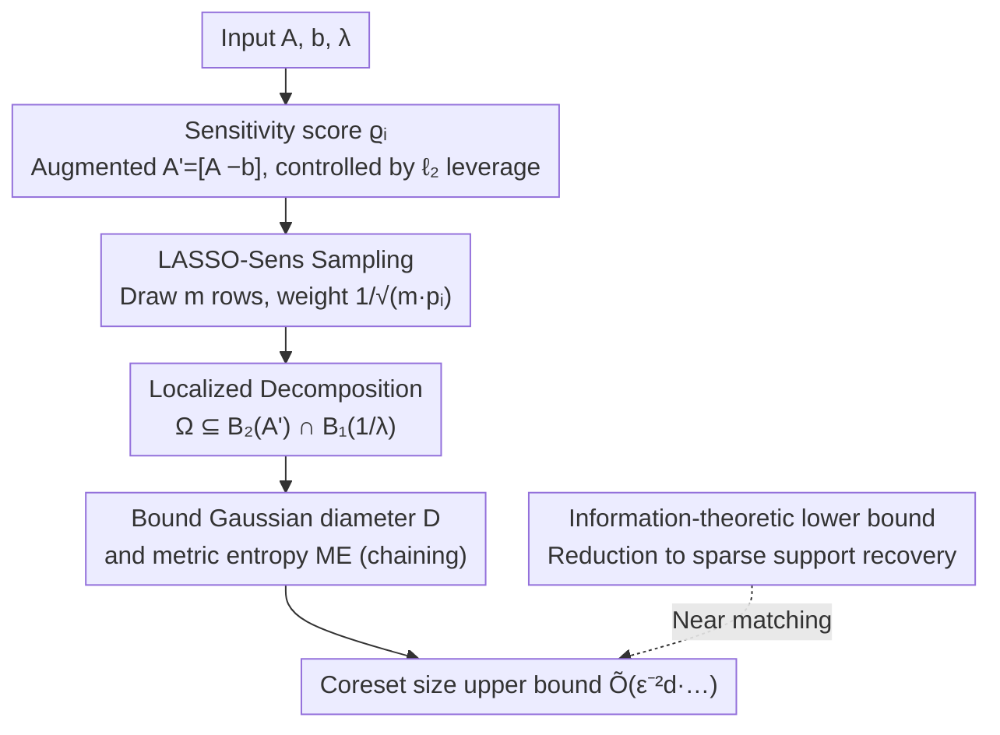

# On Coreset for LASSO Regression Problem with Sensitivity Sampling

**Conference**: ICLR 2026  
**OpenReview**: [https://openreview.net/forum?id=aUlHK31TAz](https://openreview.net/forum?id=aUlHK31TAz)  
**Code**: To be confirmed  
**Area**: Learning Theory / coreset / sparse regression  
**Keywords**: LASSO, coreset, sensitivity sampling, empirical processes, leverage score

## TL;DR
This paper provides the first sensitivity sampling-based coreset construction for **standard LASSO regression** (objective $\|Ax-b\|_2^2+\lambda\|x\|_1$). By **localized decomposition** of the complex function space induced by the $\ell_1$ penalty into a residual space and an $\ell_1$ penalty space, the authors tighten the coreset size from the original $\tilde O(Gd/\epsilon^2)$ to $\tilde O\!\big(\epsilon^{-2}d(\log^3 d\cdot\min\{1,\log d/\lambda^2\}+\log(1/\delta))\big)$, and provide a near-matching lower bound. Experimentally, it is 4–18 times faster than solving LASSO directly, processing an 8-million-sample dataset in just 15 minutes.

## Background & Motivation

**Background**: LASSO uses $\ell_1$ regularization to relax sparse regression into a convex problem, making it a standard tool for variable selection and compressed sensing. However, the runtime of solvers like coordinate descent or ISTA/FISTA is $O(nT\cdot\mathrm{poly}(d))$, which is **strongly dependent on the number of samples $n$**, leading to poor scalability on large-scale data. A natural acceleration strategy is the coreset—sampling a **weighted small subset** from $A, b$ such that it $(1\pm\epsilon)$-approximates the original objective for all $x$, and then running the solver only on this subset.

**Limitations of Prior Work**: There is mature sensitivity sampling / leverage score coreset theory for unregularized $\ell_p$ regression; ridge regression ($\ell_2$ penalty) also has results of $\tilde O(sd_\lambda(A)/\epsilon^2)$. However, **standard LASSO has lacked theoretical coreset results**. The closest work, Chhaya et al. (2020), avoids $\ell_1$ by replacing the penalty with $\lambda\|x\|_1^2=\lambda(\sum_i|x_i|)^2$ to apply ridge regression techniques—but this quadratic form introduces cross-terms between coordinates, destroying the sparsity intended by $\ell_1$, and the resulting non-zero entries are often much more numerous than in true LASSO.

**Key Challenge**: Directly applying the general sensitivity sampling framework to LASSO yields a coreset of size $\tilde O(Gd/\epsilon^2)$ based on standard generalization bounds (where $G$ is the total sensitivity and $d$ is the VC dimension), which is too large. The bottleneck lies in the fact that the function space of LASSO, $\Omega=\{x:h(x)+p(x)\le R\}$, is **coupled** by the residual term $h(x)=\|Ax-b\|_2^2$ and the $\ell_1$ penalty $p(x)=\lambda\|x\|_1$, resulting in extremely complex geometry. The non-smooth boundary of $\ell_1$ causes classic analyses using Bernstein inequalities and $\epsilon$-nets to provide very loose error bounds.

**Goal**: Design a sensitivity sampling coreset for standard LASSO with a size strictly smaller than $\tilde O(Gd)$, and provide a near-matching lower bound to prove the size is essentially tight.

**Key Insight**: Instead of performing brute-force empirical process analysis on the coupled complex space $\Omega$, the strategy is to **localize first and then decouple**—placing $\Omega$ inside the intersection of the residual unit ball and the $\ell_1$ unit ball. By bounding the Gaussian diameter and metric entropy of these two lower-complexity subspaces separately, a tighter sampling error bound can be achieved.

## Method

### Overall Architecture
This paper addresses the problem of "extracting a weighted small subset for LASSO with provable guarantees." The algorithm itself, **LASSO-Sens**, is concise: calculate a sensitivity score $\varrho_i$ for each row of the augmented matrix $A'=[A\ {-}b]$ (controlled by $\ell_2$ leverage scores), sample $m$ rows independently with probability $p_i=\min\{1,\alpha(\varrho_i+\tfrac1n)\}$, assign weights $1/\sqrt{mp_i}$ to selected rows, and finally solve LASSO using FISTA on these $m$ rows. The algorithm follows the standard sensitivity sampling routine; the **real contribution lies in answering "how large $m$ needs to be"**—which requires a suite of localized empirical process analyses.

The logic chain is: define and relax sensitivity scores (enabling sampling) → decompose the LASSO unit ball $\Omega$ into the intersection of the residual ball $B_2(A')$ and the $\ell_1$ penalty ball $B_1(1/\lambda)$ (breaking the coupling) → bound the Gaussian diameter $D$ and metric entropy $ME$ for the two low-complexity subspaces (using chaining + multi-scale $\epsilon$-nets) → derive the coreset upper bound required for sampling error $\mathcal E\le\epsilon$ → provide a near-matching lower bound via information-theoretic reduction.

### Key Designs

**1. Integrating LASSO into Sensitivity Sampling: Score Definition + Augmented Rewrite + Leverage Score Bound**

To make sampling executable, a sensitivity score reflecting the importance of each row must be provided. This paper defines the score for the $i$-th row as its worst-case contribution ratio to the LASSO objective:

$$\varrho_i=\sup_{x\in\mathbb{R}^d}\frac{\|(Ax-b)_i\|_2^2+\frac{\lambda}{n}\|x\|_1}{\|Ax-b\|_2^2+\lambda\|x\|_1}.$$

The penalty term is averaged as $\frac{\lambda}{n}\|x\|_1$ in the numerator to ensure the regularization term lets each row participate in sampling **equally**, preventing certain rows from being systematically ignored due to regularization. To leverage mature tools from unregularized regression, the authors perform a key equivalent rewrite: let $A'=[A\ {-}b]\in\mathbb{R}^{n\times(d+1)}$ and $x'=[x\ 1]$, such that $\min_x\|Ax-b\|_2^2+\lambda\|x\|_1$ becomes the constrained optimization $\min_{x'_{d+1}=1}\|A'x'\|_2^2+\lambda\|x'\|_1$, and the scores are rewritten relative to $A'$. The value of this step is proving that $\varrho_i$ can be controlled by the $\ell_2$ leverage score $\tau_i$ of the $i$-th row of $A'$ plus an additional $1/n$ term, allowing sampling probabilities $p_i\ge\min\{1,\alpha(\tau_{i,2}(A')+\tfrac1n)\}$ to be calculated using standard leverage score computations, thus connecting LASSO—a non-smooth problem with $\ell_1$—to the established sensitivity sampling pipeline.

**2. Localized Empirical Process: Decomposing Coupled Unit Balls into Residual and $\ell_1$ Intersections**

Direct empirical process analysis on the LASSO unit ball $\Omega=\{x:\|A'x\|_2^2+\lambda\|x\|_1=1\}$ results in loose error bounds due to the geometric complexity of the coupling—this was the root cause of the large coresets in Chhaya et al. The breakthrough here is **localization and decoupling**: first proving (Lemma 2) that the unit ball is contained within a looser but separable set,

$$\Omega\subseteq L\subseteq L_{A'}=B_2(A')\cap B_1\!\big(\tfrac1\lambda\big),$$

where $B_2(A')=\{x:\|A'x\|_2^2\le1\}$ is the **unit ball of the residual space** and $B_1(\tfrac1\lambda)=\{x:\|x\|_1\le\tfrac1\lambda\}$ is the **unit ball of the $\ell_1$ penalty space**. Consequently, the two previously entangled terms are split into two subspaces, each with **lower individual complexity and more regular geometry (both are convex sets)**, allowing for separate analysis. The sampling error is defined as

$$\mathcal E=\sup_{x'\in\Omega}\big|\,\|SA'x'\|_{w,2}^2-\|A'x'\|_2^2\,\big|,$$

with the goal of constraining it to $\epsilon$. Using symmetrization techniques, the authors reduce the higher-order moments of $\mathcal E$ to a weighted Gaussian process (Lemma 1), enabling the application of Gaussian complexity tools to the decoupled subspaces.

**3. Bounding Gaussian Diameter and Metric Entropy via Chaining for a Tight Coreset Upper Bound**

After decoupling, controlling the sampling error reduces to bounding two quantities of the Gaussian process: the **Gaussian diameter $D$** and the **metric entropy $ME$**. The authors use a pseudo-metric $d_X(y,y')$ to measure the intrinsic geometry of the process and prove (Lemma 3) that the diameter on $L_M=\{Mx:x\in L_{A'}\}$ (where $M=SA'$) satisfies

$$D(L_M)\le O\!\big(\tau\sqrt{\log d/\lambda}\big),$$

where $\tau=\sup|A'_{i:}x'|^2$ is the maximum row contribution (maximum weighted $\ell_2$ leverage score). For metric entropy, the authors employ **chaining**: constructing a sequence of multi-scale $t$-nets to approximate the convex structure of $L_M$ layer by layer, then controlling $\mathbb E|\mathcal E|^l$ via the covering numbers of these nets, ultimately expressing the moment bound as $\mathbb E[|\mathcal E|^l]\le(CME)^l(ME/D)+O(\sqrt l D)^l$. Substituting the upper bounds for $D$ and $ME$ and optimizing the order $l$ ensures $\mathbb E[|\mathcal E|^l]\le\epsilon^l$, leading to the coreset size in the main theorem (Theorem 7):

$$m=\tilde O\!\left(\frac{d(\log d)^3}{\epsilon^2}\cdot\min\Big\{1,\frac{\log d}{\lambda^2}\Big\}+\frac{d}{\epsilon^2}\log\frac1\delta\right).$$

The elegance of this bound lies in the $\min\{1,\log d/\lambda^2\}$ term: as $\lambda\to0$ or $\lambda\to\infty$, it degrades to a clean $\tilde O(d/\epsilon^2)$, which is of the same order as the optimal size for unregularized regression, completely eliminating the problematic $G$ (total sensitivity) from the general bound.

**4. Information-Theoretic Lower Bound: Proving Near-Optimality via Reduction to Sparse Support Recovery**

An upper bound alone is insufficient—this paper also establishes a lower bound for the size. Using information-theoretic methods, the authors reduce "obtaining a $(1+\epsilon)$-approximate solution from a coreset" to the **problem of support recovery of a sparse vector**: to recover the support of a sparse $x^*$, a coreset must access a sufficient number of rows. Under normalized input $\|A\|_2\le1,\|b\|_2\le1$ (required due to the lack of scale invariance in the LASSO objective), the lower bound is:

$$m=\begin{cases}\Omega\!\big(\frac{\log d}{\lambda^2\epsilon^2}\big), & \lambda=\Omega(1/\sqrt d),\\[4pt]\Omega\!\big(\frac{d}{\epsilon^2}\log d\big), & \lambda=O(1/\sqrt d).\end{cases}$$

In the interval $\lambda=O(1/\sqrt d)$, where non-zero entries may be numerous, the lower bound $\Omega(\frac{d}{\epsilon^2}\log d)$ differs from the upper bound only by polylog factors in the dimension $d$—meaning the coreset size in this interval **cannot be significantly improved**, theoretically closing the gap between the upper and lower bounds.

### Loss & Training
This paper does not involve model training in the traditional sense; it focuses on "constructing a coreset → solving on the coreset." The evaluation loss follows the LASSO objective $f(x)=\|Ax-b\|_2^2+\lambda\|x\|_1$, where lower is better; FISTA is still used for solving on the coreset. Key hyperparameters are the oversampling factor $\alpha=\tilde O\big(\frac1{\epsilon^2}(\log(d\log(1/\delta))(\ln d)^2\min\{1,\log d/\lambda^2\}+\log\frac1\delta)\big)$ and the coreset size $m$.

## Key Experimental Results

### Main Results
Experiments were conducted on 4 datasets (Synthetic $n{=}10{,}000,d{=}200$; mediamill $n{=}30{,}993,d{=}120$; CTs $n{=}53{,}500,d{=}386$; mnist8m $n{=}8.1\mathrm{M},d{=}784$), comparing **LASSO** (full FISTA), the proposed **LASSO-Sens**, and the baseline **LASSO-Uniform** (uniform sampling). The table below shows results for CTs at $\lambda=0.5$ (lower loss and time are better; sparsity is the number of non-zero entries):

| Coreset Size | LASSO-Sens loss | LASSO-Uniform loss | LASSO-Sens Time (s) | Full LASSO Time (s) |
|---|---|---|---|---|
| 5d | 25.43±0.17 | 30.39±6.19 | 13.75 | 505.65 |
| 10d | 25.34±0.03 | 25.94±0.42 | 20.84 | 505.65 |
| 20d | 25.32±0.02 | 25.46±0.13 | 113.34 | 505.65 |

The full LASSO loss is 25.28; LASSO-Sens approaches this at 5d and is significantly more stable than uniform sampling at small coreset sizes (uniform sampling at 1d/2d has higher loss and variance, e.g., 61.58±22.86 at 1d).

### Speedup & Scalability

| Scenario | Observation |
|---|---|
| Synthetic / mediamill / CTs | LASSO-Sens is ≥4x faster than full LASSO, up to 18x on CTs |
| mnist8m (8.1M samples) | LASSO-Sens yields a feasible solution in 15 mins; full LASSO fails after 48h |
| Sparsity (at 10d) | LASSO-Sens sparsity is highly close to full LASSO (CTs: 336 vs 325) |

### Key Findings
- **Sensitivity > Uniform**: On small coresets (1d~5d) and large data (mnist8m), sensitivity sampling is consistently superior to uniform sampling in accuracy and sparsity, validating the value of "importance sampling by row" over "indiscriminate sampling."
- **Rapid Convergence with Coreset Size**: At $\lambda=0.5$ and $\lambda=10$, the LASSO-Sens loss quickly matches the exact solution as size increases, echoing the tight bound of $\tilde O(d/\epsilon^2)$ as $\lambda\to0/\infty$ in the theory.
- **Sparsity Preservation**: By adhering to standard $\ell_1$ (unlike Chhaya's $\|x\|_1^2$), the number of non-zero entries remains close to the exact LASSO, ensuring that sparsity is not lost due to subsampling.

## Highlights & Insights
- **"Localization + Decoupling" as the Core Strategy**: Placing the coupled complex unit ball $\Omega$ inside the intersection of two lower-complexity convex sets (residual ball ∩ $\ell_1$ ball) and applying Gaussian complexity tools separately is a transferable idea—highly likely applicable to other "residual + non-smooth regularizer" coreset problems (like elastic net).
- **Matching Upper and Lower Bounds**: Beyond providing an upper bound, the paper uses an information-theoretic reduction to sparse support recovery to establish a near-matching lower bound, clarify whether the size is optimal, which reflects high theoretical rigor.
- **Elegant Degradation of $\min\{1,\log d/\lambda^2\}$**: A single factor characterizes the behavior of $\lambda$ at both extremes returning to a clean $\tilde O(d/\epsilon^2)$, pinpointing that the "extra cost" of $\ell_1$ regularization is precisely located in the intermediate $\lambda$ range.
- **Adherence to Standard $\ell_1$**: Unlike the compromise of swapping to $\|x\|_1^2$, the authors confront the non-smoothness of $\ell_1$ directly, which is why the experiments preserve sparsity—a direct practical benefit of "theoretical correctness."

## Limitations & Future Work
- Directions acknowledged by authors: Extending the method to **elastic net** and regressions with more complex regularizers.
- Observed limitations: ① Lower bounds only tightly match upper bounds in the $\lambda=O(1/\sqrt d)$ interval; optimality in the intermediate $\lambda$ range is not fully closed; ② Upper bounds contain polylog factors like $(\log d)^3$, leaving a gap from a "true optimal constant"; ③ Experiments were limited to 4 datasets and a single MATLAB/FISTA solver, and the sensitivity scores themselves require leverage score calculations, whose preprocessing overhead needs consideration for ultra-large $d$.
- Improvement ideas: Whether the leverage score approximation and sampling can be merged into a single-pass streaming process to further reduce preprocessing costs.

## Related Work & Insights
- **vs. Chhaya et al. (2020)**: They replaced LASSO’s $\|x\|_1$ with $\|x\|_1^2$ to apply ridge regression coresets (size $\tilde O(sd_\lambda(A)/\epsilon^2)$) at the cost of cross-terms destroying sparsity; this paper tackles standard $\ell_1$ directly with size $\tilde O(\epsilon^{-2}d(\log^3d\min\{1,\log d/\lambda^2\}+\log(1/\delta)))$ and preserves sparsity.
- **vs. General Sensitivity Sampling (Braverman et al. 2016)**: The general framework gives $\tilde O(Gd/\epsilon^2)$, depending on total sensitivity $G$; this paper uses localized empirical processes to eliminate the $G$ term, obtaining a tighter bound depending only on $d$ and $\lambda$.
- **vs. Unregularized $\ell_p$ Regression Coreset (Woodruff & Yasuda 2023/2024; Munteanu & Omlor 2024)**: These use chaining for a tight framework in unregularized cases; this work inherits chaining tools but uniquely handles the non-smooth coupling of the $\ell_1$ penalty, applying the technique to standard LASSO for the first time.

## Rating
- Novelty: ⭐⭐⭐⭐⭐ First sensitivity sampling coreset for standard LASSO; localized decoupling is a novel approach.
- Experimental Thoroughness: ⭐⭐⭐⭐ 4 datasets + multiple $\lambda$ + 8M sample scale; adequately covered but uses a single solver.
- Writing Quality: ⭐⭐⭐⭐ Clear narrative of tight bounds; complete proof chain provided (details in appendix).
- Value: ⭐⭐⭐⭐ Theoretically closes the bound gap; practically accelerates large-scale LASSO by 4–18x, delivering both theoretical and engineering significance.

<!-- RELATED:START -->

## Related Papers

- [\[ICLR 2026\] Data-Aware and Scalable Sensitivity Analysis for Decision Tree Ensembles](data-aware_and_scalable_sensitivity_analysis_for_decision_tree_ensembles.md)
- [\[ICLR 2026\] Stable Coresets: Unleashing the Power of Uniform Sampling](stable_coresets_unleashing_the_power_of_uniform_sampling.md)
- [\[ICLR 2026\] Splat Regression Models](splat_regression_models.md)
- [\[ICLR 2026\] Better Bounds for the Distributed Experts Problem](better_bounds_for_the_distributed_experts_problem.md)
- [\[ICLR 2026\] Sampling Complexity of TD and PPO in RKHS](sampling_complexity_of_td_and_ppo_in_rkhs.md)

<!-- RELATED:END -->
