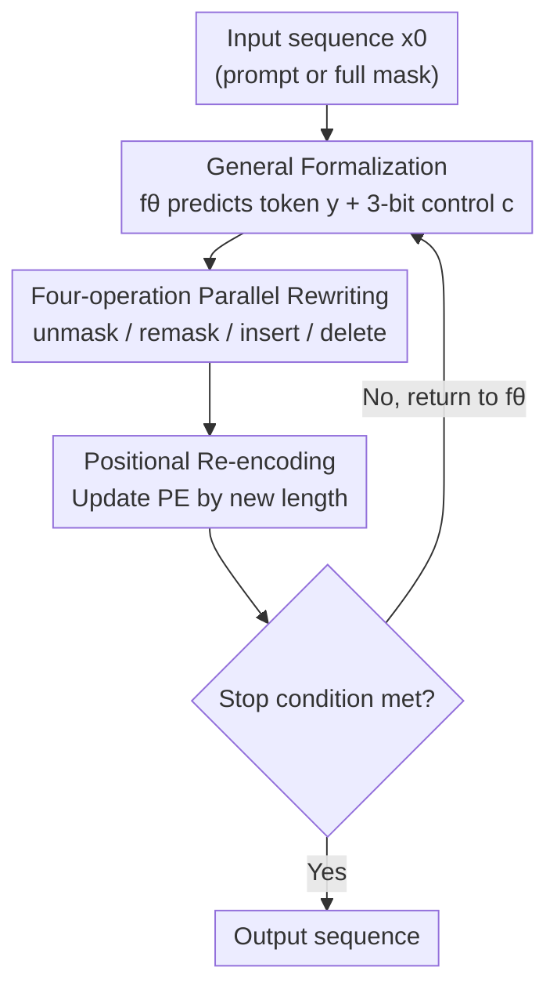

# On Powerful Ways to Generate: Autoregression, Diffusion, and Beyond

**Conference**: ICLR 2026  
**OpenReview**: [https://openreview.net/forum?id=PKidr9Ruli](https://openreview.net/forum?id=PKidr9Ruli)  
**Code**: TBD  
**Area**: Learning Theory / Expressivity of Generative Models  
**Keywords**: Masked Diffusion Models, Autoregression, Computability, PRAM, any-process generation

## TL;DR
This paper rigorously characterizes the capability boundaries of "Autoregressive Models (ARM) vs. Masked Diffusion Models (MDM)" using computability theory. It proves that while MDM's parallelism offers exponential speedups, its "any-order" flexibility does not allow it to solve more problems than ARM. Thus, the authors propose **any-process generation** (adding remask, insert, and delete operations beyond unmasking), proving theoretically and experimentally that it can solve harder reasoning and structured generation tasks that both ARM and standard MDM fail to handle.

## Background & Motivation

**Background**: Current large models are almost entirely built on Autoregressive Models (ARM)—generating tokens sequentially from left to right, embedding the inductive bias of "language unfolding uni-directionally in time" into the architecture. Recently, Masked Diffusion Models (MDM) have emerged as strong alternatives: starting from a fully masked sequence, they can unmask multiple tokens in **any order and in parallel**. Large-scale instances (e.g., Gemini Diffusion, LLaDA) have achieved performance comparable to AR LLMs while showing empirical advantages in "order-sensitive" tasks like reverse poetry completion and Sudoku, with decoding speeds up to 10× faster.

**Limitations of Prior Work**: Despite the empirical success of MDM, its **computational power and fundamental limitations remain poorly understood**. Does any-order generation bring "qualitative" capabilities or just "speed"? Faced with truly difficult reasoning tasks (requiring loops of backtracking, rewriting, and search-verify-correct), is MDM as powerless as ARM? Previously, these questions remained at an intuitive level.

**Key Challenge**: Many objects in nature (code, proteins, DNA, graph structures) **are not constructed linearly along a unidirectional time axis**. Code must satisfy global constraints like bracket matching and type correctness at every intermediate state; biological sequences are generated through structure-aware editing like "domain swapping, binding site insertion, and segment recombination." ARM forces these processes into left-to-right sequences, requiring the capability of "global foresight of future tokens," which exactly exceeds the expressivity of constant-depth Transformers ($\mathsf{TC}^0$).

**Goal**: (1) Provide a rigorous answer on how to formally compare different generation methods; (2) Identify a generation paradigm that is **provably stronger** than next-token generation.

**Key Insight**: Study the "generation process" as a **computational mechanism independent of specific architectures**—using parallel computing models (PRAM) and complexity classes (P / NC / PSPACE / $\mathsf{TC}^0$) to characterize the problem classes solvable by ARM and MDM, thereby turning "which is stronger" into a provable proposition.

**Core Idea**: Beyond the sole "unmask" operation of MDM, incorporate three additional learnable operations around mask tokens: **remask (reverting decoded tokens to masks), insert (inserting masks at arbitrary positions), and delete (removing masks)**. This grants the model capabilities for self-correction, variable-length editing, and adaptive parallelism, breaking the fundamental "once written, never changed" shackle of ARM and standard MDM.

## Method

### Overall Architecture

The paper follows two main threads: first, a **theoretical characterization** comparing ARM and MDM within a unified computability framework leading to three conclusions; second, the proposal of a new paradigm, **Any-Process MDM (AP-MDM)**, based on these findings.

The three theoretical conclusions serve as the pillars of motivation: MDM is equivalent to PRAM, solving problems with optimal parallel time complexity and offering exponential speedups over ARM for simple parallelizable problems (Theorem 1); however, MDM's context length $S(n)$ dictates that it can solve problems at most within $\tilde O(S^3(n))$ serial time, making it unscalable for tasks like NP-hard problems (Theorem 2); furthermore, after controlling for "tokens generated per step" and "encoder/decoder architecture," **any-order generation itself does not solve more problems than ARM** (Theorem 3)—as any-order computation can be rearranged to be completed equivalently from left to right.

On the method side, AP-MDM abstracts generation into the iteration of two functions: a **learnable Transformer** $f_\theta$ predicts "what tokens to write" $y_t$ and "what operations to perform at each position" via control signals $c_t$ on the input sequence $x_t$; a **non-parametric transition function** $g$ takes $(x_t, y_t, c_t)$ to execute the four operations, producing the next sequence $x_{t+1}$ which may vary in length. Generation is the repeated iteration $x_{t} = (g \circ f_\theta)^t(x_0)$ until flexible stopping conditions are met (EOS generated or sequence convergence). Unlike standard MDM, it has no restrictions on mask ratios, decoding steps, sequence length, or stopping conditions; $x_0$ can even be a prompt without masks (degenerating into ARM).

### Key Designs

**1. Theoretical Characterization: Reducing "Generation Methods" to Computability to Measure MDM's Power and Ceiling**

This is the foundation of the paper, answering "why MDM works and where it stops." The authors map MDM to Parallel Random Access Machines (PRAM): for any PRAM program with $T(n)$ parallel time and $P(n)$ processors, there exists an MDM that, by padding input to $S(n)=O(P(n)\cdot T(n))$, reproduces its output in $O(T(n))$ decoding steps, i.e., $\mathrm{PRAM}(P(n),T(n)) \subseteq \mathrm{MDM}(O(P(n)T(n)), O(T(n)))$ (Theorem 1). This shows MDM is not only Turing-complete like ARM but also solves problems with **optimal parallel time**—e.g., graph connectivity in $O(\log n)$ steps, Dyck-$k$ and other CFGs in $O(\log^2 n)$ steps, achieving exponential speedup over ARM's linear serial complexity.

However, the cost is that context length must grow with the **total parallel work** $O(T(n)\cdot P(n))$. Thus, Theorem 2 provides the ceiling: $\mathrm{MDM}(S(n)) \subseteq \mathrm{PRAM}(1, \tilde O(S^3(n)))$, meaning an MDM with length $S(n)$ cannot solve problems requiring more than $\tilde O(S^3(n))$ serial time, making tasks beyond P (like NP-hard) practically infeasible as they would require super-polynomial length. **The root cause is that once a token is decoded, it is irreversible**—every memory write is permanently fixed, forcing space to expand with computation time. Finally, Theorem 3 shatters the intuition that "any-order is stronger": once step-wise token count and architecture are controlled, anything an any-order MDM can compute can be replicated by a left-to-right, one-token-per-step Masked-ARM with constant additional layers, as attention is naturally adept at fetching information from any position and rearranging it internally.

**2. General Formalization of Any-Process Generation: Decoupling Generation into "Learned Prediction + Non-parametric Execution"**

To address the "irreversibility" bottleneck, the authors design a sufficiently general generation framework. $f_\theta: \bar\Sigma^* \to \bar\Sigma^* \times \Sigma^* \times C^*$ returns a triple $(x_k, y_k, c_k)$ on input $x_k$: $y_k$ contains candidate tokens of the same length as the input, and $c_k$ is the control code for each position. Note that $f_\theta$ includes the input $x_k$ in the output so that $g$ knows which positions were originally masked. $g: \bar\Sigma^* \times \Sigma^* \times C^* \to \bar\Sigma^*$ is a **non-parametric, potentially non-deterministic** transition function that consumes the triple and outputs a variable-length $x_{k+1}$.

This decoupling—where $f_\theta$ handles prediction and $g$ handles execution—is key: all rewriting logic is placed in the non-parametric $g$, while $f_\theta$ only needs to predict a few extra control signals with almost no architectural changes. It relaxes all constraints on mask ratios, decoding steps, and stopping conditions—AO-MDM (standard Any-Order MDM) is simply a special case where "control signals are always unmask and length is invariant." This flexibility is exactly what standard MDM lacks due to fixed steps and lengths.

**3. Instantiation of Four Token Operations: 3-bit Control Codes Driving unmask / remask / insert / delete**

This is the core for grounding the general framework. Each position $i$ at step $t$ is assigned a 3-bit control vector $c_{t,i}=(c_{t,i}[1], c_{t,i}[2], c_{t,i}[3])\in\{0,1\}^3$ for rewriting, insertion, and deletion respectively. **Rewriting** uses the first bit: if $c_{t,i}[1]=1$, position $i$ reverts to a mask regardless of its state; otherwise, it is unmasked as usual—

$$\mathrm{remask}_{x_{t,i},c_{t,i}}(y)=\begin{cases} M & c_{t,i}[1]=1 \\ y & x_{t,i}=M,\ c_{t,i}[1]=0 \\ x_{t,i} & \text{otherwise}\end{cases}$$

Remask allows the model to erase failed branches and backtrack, potentially expanding computation exponentially along $S(n)$ to achieve test-time scaling, with decoding order and parallelism learned from data. **Variable-length editing** uses the second and third bits: if $c_{t,i}[2]=1$, a mask is inserted after position $i$ (each mask can generate more masks, allowing exponential sequence growth); if $c_{t,i}[3]=1$ and the bit was originally a mask, it is deleted (releasing space and saving FLOPs during light computation phases). The three operations are executed compositely: $s_{t,i}=\mathrm{insert}\circ\mathrm{delete}\circ\mathrm{remask}(y_{t,i})$.

These are all designed around mask tokens, recycling the already strong unmasking capability of MDM, making them easier to pre-train/fine-tune compared to harder operations like "inverting uniform noise." Architecturally, it requires zero changes beyond adding 3 linear heads for control logits; all three operations can be learned end-to-end from text corpora using self-supervised objectives or fine-tuned from existing large diffusion models—distinguishing it from recurrent Transformers, which are expressive but extremely hard to train due to lack of intermediate supervision.

**4. Positional Re-encoding and Provable Capability Leap: Translating "Variable Length" into Structural Information**

Since insert/delete changes sequence length, **positional encodings (PE)** are updated according to the new positions at each step. This step might seem like an engineering detail, but it is the key to AP-MDM's expressivity advantage—the movement of positions itself carries meaningful structural information, allowing the model to represent complex processes that ARM cannot.

With rewriting and variable-length editing, theoretical guarantees leap forward: Theorem 4 proves that AP-MDM can reproduce any $S(n)$-memory PRAM program using $O(S(n))$ context and $O(T(n))$ steps, reaching **optimal parallel time + optimal space** complexity—an exponential improvement over standard MDM which must expand according to total work $O(P(n)T(n))$. This allows solving PSPACE (not just P) problems within polynomial length, enabling many NP-hard tasks to be solved via test-time scaling. Theorem 5 proves that for $k\ge 2$, there exists a stochastic AP-MDM whose generation distribution support exactly equals the two-sided Dyck-$k$ language, while any fixed ARM has a length threshold beyond which it cannot guarantee coverage of all strings in the language (as generating Dyck is equivalent to recognizing it, which is beyond $\mathsf{TC}^0$). Theorem 6 conversely proves that **AP-MDM is hard to simulate by ARM**: position shifts triggered by insert/delete force the ARM to internally reconstruct the entire edit trajectory to determine the current token at each position (formalized as the PRESERVE problem), which is computationally difficult for constant-depth Transformers.

### Loss & Training

The three operations are trained end-to-end with self-supervised objectives (the unmask loss and remask loss are defined separately, see §C.2 of the original paper; ⚠️ refer to the original text for specific forms). Training can occur via pre-training on text corpora, supervised fine-tuning on data with "explicit generation processes" (like code revision history), or direct fine-tuning from existing large diffusion models. Training dynamics on Sudoku show that the model quickly learns to "fill the easiest positions first" (unmask loss drops rapidly), while "learning the order" (where to fill next) is harder to converge.

## Key Experimental Results

### Main Results

| Task | Method | Training Samples / Params | Accuracy |
|------|------|------|------|
| Sudoku (NP-complete) | ARM (Ordered) | 1.8M / 42M | 87.18% |
| Sudoku | AO-MDM (Top-K prob. margin) | 1.8M / 6M | 89.49% |
| Sudoku | **AP-MDM** | **100 / 1.2M** | **99.28%** |
| Parity (Any length) | ARM (Train $n=2\dots 100$) | Orders of magnitude more | Fails to generalize |
| Parity | **AP-MDM (Train $n=2$ only, ~200 params)** | — | **100%** |

On Sudoku, AP-MDM uses only **100** training instances and **1.2M** parameters to outperform ARM and AO-MDM which use **1.8M** instances and **5× parameters**—because allowing multi-step computation makes each step easier to learn, significantly improving sample efficiency. On Parity, a task "extraordinarily difficult for LLMs," AP-MDM learns an "elimination algorithm" (scan first two bits, delete all 0s, delete pairs of 1s, repeat) and achieves 100% generalization to any length by only training on length 2, whereas ARM collapses outside the training length.

### Ablation Study

| Task | Graph Scale (Nodes) | ARM Accuracy | AP-MDM Accuracy |
|------|------|------|------|
| Graph Edit (Min-cut to disconnect s-t) | 4 | 90.32% | 100% |
| | 5 | 43.04% | 100% |
| | 6 | 0.30% | 100% |
| | 7~10 | N/A | 99.92%~100% |

The graph generation task requires the model to iteratively edit the graph structure (BFS for path → augment/modify → repeat → delete min-cut edges). AP-MDM maintains near-perfection as graph size increases, while ARM rapidly fails when trying to simulate the same edit process—empirically validating Theorem 6 that "AP-MDM is hard to simulate by ARM."

### Key Findings
- **Rewritability = Scalability**: Backtracking/error correction via remask is core to AP-MDM solving NP-hard tasks; removing it reverts to the $\tilde O(S^3)$ ceiling of MDM.
- **Variable Length = Structural**: insert/delete + positional re-encoding allow generation of non-linear objects like two-sided Dyck-$k$, DNA splicing, and graph editing, which ARM cannot handle due to global foresight requirements.
- **Difficulty of Simulation as an Advantage**: Positional shifts introduced by edit operations prevent ARM from efficient simulation, implying that if "generation process data" (code revisions, proof drafts, molecular formation) becomes available, AP-MDM is the appropriate training target.

## Highlights & Insights
- **Studying generation paradigms as independent computational mechanisms**: This is the most "Aha!" perspective—instead of getting bogged down in Transformer details, it uses PRAM/complexity classes to measure the gap between AR, any-order, and any-process capabilities, making conclusions provable rather than just based on benchmarks.
- **Counter-intuitive conclusion: "Any-order $\neq$ Stronger" (Theorem 3)**: This corrects the community's naive expectation that diffusion language models are "stronger because they are flexible," precisely attributing the benefit to "parallelism" rather than "any-order," providing a clear direction for future design.
- **Three operations with zero architectural changes**: Using only 3 additional linear heads makes this highly transferable; one can fine-tune remask/insert/delete capabilities directly onto existing large diffusion models with a low engineering barrier.
- **The "irreversibility of tokens" diagnosis**: Unifying the scaling bottlenecks of ARM and MDM under "written once, never changed" and then prescribing remask/delete provides a very clean causal chain.

## Limitations & Future Work
- The encoder architecture must re-encode the entire sequence at each step and cannot use KV cache, resulting in higher step-wise FLOPs than decoder-only ARM; while the authors argue this trade-off is not theoretically inevitable, it persists in the current implementation.
- Experiments are focused on **structurally clear synthetic tasks** (Sudoku / parity / Dyck / graph editing) and have not yet been validated on natural language or large-scale code/scientific corpora; "generation process data" is currently mostly laboriously constructed.
- Multiple capabilities are **existence proofs** ("there exists an AP-MDM"), and there remains a gap between this and "whether such a construction can be stably learned from data"; Sudoku training dynamics also show "learning the order" is difficult.
- Stopping criteria and the design of the non-deterministic $g$ remain somewhat heuristic; the paper admits the specific instantiation of $g$ and $c_t$ in (4) is sufficient but not necessarily the optimal design.

## Related Work & Insights
- **vs. Standard MDM (AO-MDM)**: AO-MDM only has unmasking with fixed length/steps and is a special case of AP-MDM; this paper proves its any-order flexibility doesn't solve more than ARM, whereas AP-MDM crosses the P→PSPACE boundary via remask/insert/delete.
- **vs. ARM / CoT**: ARM is Turing-complete but tokens are irreversible, limited by $\tilde O(S^3)$ serial complexity and $\mathsf{TC}^0$ global foresight bottlenecks; AP-MDM retains parallel acceleration while achieving optimal space complexity.
- **vs. Recurrent Transformers (e.g., Universal Transformer)**: Both seek stronger expressivity, but recurrence is extremely hard to train without intermediate supervision; AP-MDM's operations can be learned end-to-end via self-supervision, making it training-friendly.
- **vs. Existing remask / editing work**: Ideas of remasking and editing have been explored sporadically in various parallel/contemporary works; the difference here is the **first systematic guidance on "what operation designs yield provable computational gains"** and its practical implications.

## Rating
- Novelty: ⭐⭐⭐⭐⭐ Abstracting generation paradigms as computability problems and providing 6 theorems is highly original.
- Experimental Thoroughness: ⭐⭐⭐⭐ Solid results on synthetic tasks (Sudoku/parity/Dyck/graph) that echo the theory, but lacks large-scale natural language validation.
- Writing Quality: ⭐⭐⭐⭐⭐ Excellent blend of theory and intuition, clear diagrams, and readable abstract complexity conclusions.
- Value: ⭐⭐⭐⭐⭐ Provides provable design principles for next-generation LLM generation mechanisms beyond next-token prediction; high directional significance.

<!-- RELATED:START -->

## Related Papers

- [\[ICLR 2026\] Information Estimation with Discrete Diffusion](information_estimation_with_discrete_diffusion.md)
- [\[ICLR 2026\] Polynomial Convergence of Riemannian Diffusion Models](polynomial_convergence_of_riemannian_diffusion_models.md)
- [\[ICLR 2026\] Beyond Spectra: Eigenvector Overlaps in Loss Geometry](beyond_spectra_eigenvector_overlaps_in_loss_geometry.md)
- [\[ICLR 2026\] Computing Equilibrium beyond Unilateral Deviation](computing_equilibrium_beyond_unilateral_deviation.md)
- [\[ICLR 2026\] Quantum Machine Learning Advantages Beyond Hardness of Evaluation](quantum_machine_learning_advantages_beyond_hardness_of_evaluation.md)

<!-- RELATED:END -->
