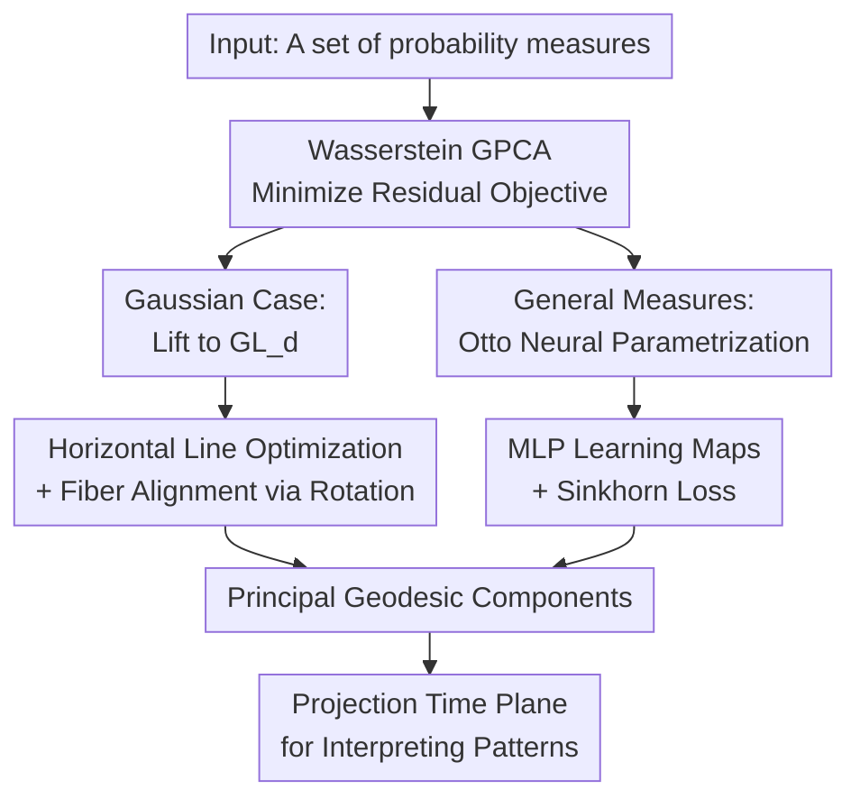

# On the Wasserstein Geodesic Principal Component Analysis of probability measures

**Conference**: ICLR 2026  
**OpenReview**: [https://openreview.net/forum?id=OJupg4mDjS](https://openreview.net/forum?id=OJupg4mDjS)  
**Code**: Gaussian experiments https://github.com/alebrigant/bures-wasserstein-gpca; General measure implementation https://github.com/nvesseron  
**Area**: Learning Theory / Wasserstein Geometry  
**Keywords**: Wasserstein space, Measure PCA, Geodesic PCA, Optimal Transport, Riemannian Geometry

## TL;DR
This paper advances Principal Component Analysis (PCA) on sets of probability measures from tangent space approximations to true Wasserstein geodesic optimization. For Gaussian measures, it utilizes Bures-Wasserstein geometry lifted to the space of invertible matrices; for general absolutely continuous measures, it employs Otto parametrization and neural networks to learn principal geodesics, demonstrating a superior capability to characterize distribution variation patterns in curved spaces compared to Tangent PCA (TPCA).

## Background & Motivation
**Background**: When data points themselves are probability distributions, a naive approach treats density functions as vectors in $L^2$ space for standard PCA. While formally convenient, this ignores the geometric structure of distributions: differences are often not point-wise density subtractions but rather the movement of mass. Thus, the $W_2$ Wasserstein distance from optimal transport naturally serves as the core tool for comparing measures.

**Limitations of Prior Work**: Existing Wasserstein PCA methods mostly adopt Tangent PCA (TPCA): a reference distribution (e.g., the Wasserstein barycenter) is selected, all measures are mapped to its tangent space, and PCA is performed in this linear space. While computationally efficient and well-behaved for 1D distributions, tangent space linearization flattens the curved Wasserstein space for high-dimensional measures. When data is far from the reference or near the boundary of the SPD (Symmetric Positive Definite) cone, TPCA distorts distance relationships, and principal directions may reflect artifacts of the linearization.

**Key Challenge**: True Geodesic PCA (GPCA) seeks a geodesic directly on the manifold that minimizes the squared Wasserstein projection residuals. This definition is geometrically sound but significantly harder than TPCA: geodesics are non-linear, and projection times must be optimized simultaneously. In Wasserstein space, one must additionally ensure the curve remains a valid Wasserstein geodesic. The challenge lies in preserving the authenticity of Wasserstein geometry while maintaining a computable and interpretable parametrization.

**Goal**: The paper addresses two levels of problems. First, for centered Gaussian distributions, can Bures-Wasserstein geometry be used to compute GPCA exactly without tangent approximations? Second, for general absolutely continuous measures, can a trainable neural network parametrization be provided to learn principal geodesics directly from samples?

**Key Insight**: The authors leverage the "lifting" perspective from Otto-Wasserstein geometry: the complex Wasserstein space is viewed as the quotient of a higher-level mapping space. Moving along an appropriate horizontal straight line in the upper space projects down to a Wasserstein geodesic. Thus, the difficult geodesic search in measure space is transformed into linear segments, vector fields, and orthogonal constraints in the upper space.

**Core Idea**: Utilizing fiber bundle representations of Otto / Bures-Wasserstein, "principal geodesics in measure space" are lifted to "horizontal lines in the upper space," solved via matrix optimization and MLP parametrization for exact GPCA.

## Method

### Overall Architecture
The method implements the same geometric concept in two instances. For centered Gaussians, measures are represented by covariance matrices $\Sigma$, and the geometry reduces to Bures-Wasserstein on SPD matrices; the authors lift $\Sigma$ to an invertible matrix $A$ such that $\Sigma=AA^\top$. For general measures, they lift the measure to a map $\phi$ that pushes a reference measure $\rho$ to the target, representing a geodesic via $\phi+t\nabla f\circ\phi$.

The objective for the first principal component is a geodesic $\mu(t)$ that minimizes the sum of squared Wasserstein residuals:

$$
\inf_{t\mapsto \mu(t)\ \text{geodesic}} \sum_{i=1}^n \inf_{t_i} W_2^2(\mu(t_i), \nu_i).
$$

Subsequent components minimize similar residuals under the constraint of orthogonal intersection with previous geodesics. Unlike Euclidean PCA, residual minimization and variance maximization are not equivalent in curved spaces.

### Key Designs
**1. Bures-Wasserstein Lifting: Gaussian GPCA as Horizontal Line Search**
For centered non-degenerate Gaussians, each distribution is identified by $\Sigma\in S_{++}^d$. Bures-Wasserstein geometry is obtained via the projection $\pi:A\mapsto AA^\top$ from $GL_d$. A single $\Sigma$ corresponds to a fiber $\Sigma^{1/2}O_d$. The core benefit is that Wasserstein geodesics in the SPD space project from horizontal straight lines $\Sigma(t)=\pi(A+tX)=(A+tX)(A+tX)^\top$ in the upper space, where $X$ must satisfy the horizontal condition $X^\top A-A^\top X=0$.

**2. Orthogonal Principal Geodesics: Intersection Points and Velocity Constraints**
In GPCA, orthogonality must occur at the intersection. In the Gaussian case, the second horizontal line starts from a point $A_2=A_1+t^*X_1$ on the first line. The second velocity $X_2$ must be horizontal at $A_2$, have unit norm, and satisfy $\langle X_2,X_1\rangle=0$. This ensures the two geodesics intersect orthogonally in the Bures-Wasserstein metric without forcing the intersection to be the barycenter.

**3. Otto Neural Parametrization: Samplable Geodesics via $\phi$ and $\nabla f$**
For general measures, the authors fix a reference measure $\rho$ and use a diffeomorphism $\phi$ to push $\rho$ to a base measure $\phi_\#\rho$. Moving along the horizontal vector field $\nabla f\circ\phi$ yields the geodesic $\mu(t)=(id+t\nabla f)_\#(\phi_\#\rho)$. Two MLPs, $\phi_\theta$ and $f_\psi$, are used. Samples are generated as $z=(id+t\nabla f_\psi)\circ\phi_\theta(x)$ for $x\sim\rho$.

**4. Sinkhorn Training Objective: Differentiable Mini-batch Optimization**
As closed-form distances are unavailable for general measures, each $\nu_i$ is represented by a sample batch. The geodesic $\mu_{\theta, \psi}(t_i)$ is represented by points transformed from $\rho$, and the Sinkhorn divergence $S_\varepsilon$ is used to approximate $W_2^2$. Training optimizes $\phi_\theta$, $f_\psi$, and individual projection times $t_i$.

### Loss & Training
The objective for the first principal component is:

$$
L(f,\phi,t_1,\ldots,t_n)=\sum_{i=1}^n W_2^2((id+t_i\nabla f)_\#(\phi_\#\rho),\nu_i).
$$

During training, $W_2^2$ is replaced with Sinkhorn divergence. For the second component, additional regularization terms $L_2 + \lambda_I I + \lambda_O O$ are added, where $I$ encourages intersection in the upper space and $O$ enforces $L^2(\rho)$ orthogonality of the horizontal vector fields.

## Key Experimental Results

### Main Results
The experiments utilize synthetic and real distribution sets to compare GPCA with TPCA.

| Scenario | Data / Setting | Ours | Baseline | Key Findings |
|------|-------------|----------|----------|----------|
| Random 2D Gaussian | 100 trials, $n=50$ | Gaussian GPCA | TPCA | GPCA improvement over TPCA is <1% on average, suggesting TPCA is a good approximation for sparse random data. |
| Co-directional Covariance | Fixed directions, varied eigenvalues | Gaussian GPCA | TPCA | Both are equivalent, reducing to linear PCA in $(a,b)$ coordinates. |
| Fixed Eigenvalues, Varied Rotation | $n=20$, angles distributed near SPD boundary | Gaussian GPCA | TPCA | Near the boundary, GPCA objective improves significantly (~40%) over TPCA. |
| Weather Covariance | Precipitation/wind histograms by state | Gaussian GPCA | N/A | First two GPCA components reveal clustering of weather patterns across states. |
| MNIST Geodesics | Color/shape geodesics | GPCAGEN | Ground Truth | Successfully recovers orthogonal geodesics corresponding to digit shape and color. |
| ModelNet40 | 100 lamp/chair point clouds | GPCAGEN | TPCA | GPCAGEN components distinguish lamp types clearly; TPCA exhibits artifacts. |

### Ablation Study
The paper employs geometric counter-examples to analyze necessary designs.

| Configuration | Metric | Observation |
|-------------|----------|------|
| TPCA Linearization | GPCA Objective Value | Sufficient for random Gaussians but distorts distance relationships in high-curvature regions. |
| Near SPD Boundary | Cost Improvement | The closer to the boundary, the larger the GPCA improvement over TPCA due to manifold curvature. |
| Point Cloud Sampling | Visual Quality | TPCA on discrete measures leads to holes; GPCAGEN yields continuous, natural samples along the geodesic. |
| Outlier Detection | Chair vs Car/Plane score | Projection residuals from the first two components effectively identify outlier point clouds. |

### Key Findings
- GPCA and TPCA provide similar results in flat regions of the manifold, but GPCA is significantly more accurate in high-curvature regions or near the boundaries of the SPD cone.
- The optimal GPCA geodesic does not necessarily pass through the Wasserstein barycenter, illustrating a fundamental difference from Euclidean PCA centering.
- GPCAGEN enables sampling along the continuous principal geodesic, which is superior for interpreting variations in point clouds and image color distributions.

## Highlights & Insights
- The lifting of Wasserstein GPCA to horizontal lines in fiber bundles elegantly transforms a measure-space optimization into an upper-space vector field problem.
- The Gaussian case serves as a precise geometric laboratory to determine when TPCA's linearization error becomes unacceptable.
- The Otto parametrization avoids the expressive constraints of Input Convex Neural Networks (ICNNs) by using diffeomorphism monitoring, offering a more flexible modeling approach.
- Using projection times $(t_1, t_2)$ as low-dimensional coordinates provides a natural interface for clustering and visualization of complex distribution sets.

## Limitations & Future Work
- General measure versions currently lacks large-scale quantitative benchmarks compared to traditional representation learning.
- Hessian eigenvalue estimation for diffeomorphism monitoring is computationally expensive in high dimensions.
- Higher-order components rely on regularization rather than hard constraints, which may lead to local minima in orthogonality.
- Theoretical convergence and guarantees for GPCA on high-dimensional non-Gaussian manifolds remain largely unexplored.

## Related Work & Insights
- **vs Tangent PCA**: TPCA is a first-order approximation; Ours is a direct manifold optimization.
- **vs 1D Wasserstein GPCA**: 1D cases are simpler due to isometric structures; Ours addresses high-dimensional measures.
- **vs Neural OT**: Unlike methods focused on a single map, Ours learns a family of maps representing an entire principal geodesic.
- **Impact for Representation Learning**: For data that are naturally measures (point clouds, histograms), principal geodesics provide coordinates more aligned with the physical transport of mass than latent-space PCA.

## Rating
- Novelty: ⭐⭐⭐⭐⭐ 
- Experimental Thoroughness: ⭐⭐⭐⭐☆ 
- Writing Quality: ⭐⭐⭐⭐⭐ 
- Value: ⭐⭐⭐⭐☆ 

<!-- RELATED:START -->

## Related Papers

- [\[ICLR 2026\] Slicing Wasserstein over Wasserstein via Functional Optimal Transport](slicing_wasserstein_over_wasserstein_via_functional_optimal_transport.md)
- [\[ICLR 2026\] Probability Distributions Computed by Autoregressive Transformers](probability_distributions_computed_by_autoregressive_transformers.md)
- [\[ICLR 2026\] Revisiting Tree-Sliced Wasserstein Distance through the Lens of the Fermat–Weber Problem](revisiting_tree-sliced_wasserstein_distance_through_the_lens_of_the_fermatweber_.md)
- [\[ICLR 2026\] Complexity Analysis of Normalizing Constant Estimation: from Jarzynski Equality to Annealed Importance Sampling and Beyond](complexity_analysis_of_normalizing_constant_estimation_from_jarzynski_equality_t.md)
- [\[ICLR 2026\] High-dimensional Analysis of Synthetic Data Selection](high-dimensional_analysis_of_synthetic_data_selection.md)

<!-- RELATED:END -->
