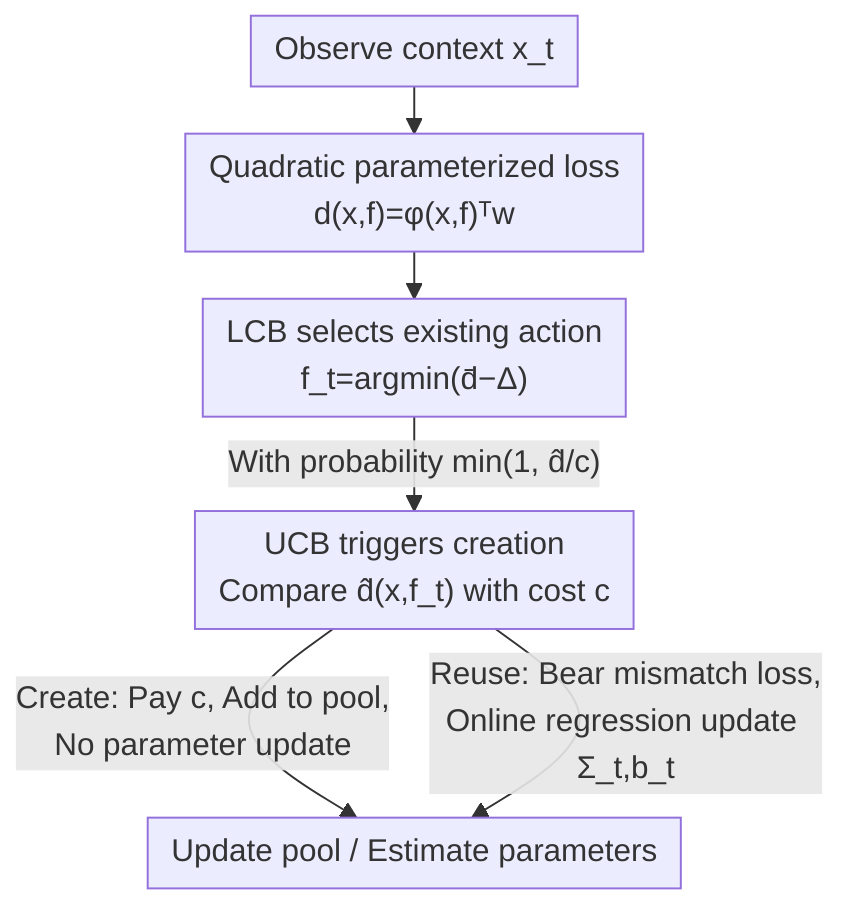

# Online Decision Making with Generative Action Sets

**Conference**: ICLR 2026  
**OpenReview**: [https://openreview.net/forum?id=J8hn5LzNOE](https://openreview.net/forum?id=J8hn5LzNOE)  
**Code**: To be confirmed  
**Area**: Online Learning Theory / Sequential Decision Making / Bandits  
**Keywords**: Online Decision Making, Expandable Action Space, Double Optimism, Regret Bound, create-to-reuse

## TL;DR
This paper investigates a class of online decision problems where action sets can be "generated at a cost and reused permanently." It proposes a "Double Optimism" algorithm that uses LCB to select existing actions and UCB to decide whether to generate a new action. It proves that the algorithm achieves an optimal regret of $O(T^{\frac{d}{d+2}}d^{\frac{d}{d+2}} + d\sqrt{T\log T})$, providing the first sublinear regret bound for scenarios with dynamically expanding action spaces.

## Background & Motivation

**Background**: Traditional online decision-making / bandit frameworks assume a **fixed** action set. The key challenge is the classic exploration-exploitation trade-off—allocating trials between "actions with empirically high rewards" and "insufficiently explored actions" to minimize cumulative regret.

**Limitations of Prior Work**: Generative AI introduces a new paradigm—agents can **dynamically create new actions** during runtime. For instance, in a medical Q&A system, an agent can reuse standard answers from an existing FAQ library or spend money (e.g., expert review, customized generation, which may cost hundreds of dollars per entry) to create a brand-new answer tailored to the current question. Once created and verified, this answer becomes a permanently reusable asset. Traditional bandit frameworks cannot characterize the scenario where "creation incurs a one-time cost, followed by free reuse."

**Key Challenge**: This setting upgrades the classic binary trade-off to a **triangular trade-off**: exploitation (using known good actions), exploration (learning the true returns of uncertain actions), and **creation** (generating new actions to meet current needs and expand future capabilities). More critically, the agent has no prior experience with actions not yet generated and cannot create actions arbitrarily—each creation must target the current context $x_t$ and incur a fixed cost $c$.

**Goal**: To learn the optimal "dual-decision" sequence in this expandable action space—deciding **which action to select** and **when to generate a new action**—while providing a regret bound with theoretical guarantees.

**Key Insight**: The authors note that while this problem is structurally similar to Online Facility Location (OFL: opening new facilities vs. assigning to existing ones), OFL assumes distance metrics are known and automatically assigns requests to the nearest facility. In this work, the distance parameters (a weight matrix in the semantic dimension) are **unknown** and must be learned online, and action selection requires active decision-making under uncertainty. This necessitates a new algorithm to balance the three-way trade-off.

**Core Idea**: A "Double Optimism" principle is used to address the three challenges: **LCB (Lower Confidence Bound)** is used to compare existing actions, simultaneously performing exploitation of high-reward actions and exploration of uncertain ones; **UCB (Upper Confidence Bound)** loss is compared against the fixed cost $c$ to trigger generation with an appropriate probability. This ensures the agent is neither overly hesitant nor excessively profligate in creation.

## Method

### Overall Architecture

The system maintains a **context pool** $S_t$: each previously added context $f$ serves as a key corresponding to a customized action produced by a generative oracle $A(\cdot)$. **The key constraint is that the algorithm only operates in the context representation space**—it makes decisions by comparing context keys and cannot directly access actions $A(x_t)$ that have not yet been generated.

The workflow for each round $t$ is: observe a new context $x_t \in \mathbb{R}^d$ (e.g., a semantic embedding of a patient's question) → estimate the mismatch loss and its uncertainty for each existing key $f$ in the pool → select the optimal candidate key $f_t$ using LCB loss → compare $f_t$'s UCB loss against the creation cost $c$ to decide, with a certain probability, whether to "pay cost $c$ to generate a new action" or "reuse $f_t$ and bear the mismatch loss." If reused, it uses the observed loss to update estimation parameters $\Sigma_t, b_t$ online; if created, $x_t$ is added to the pool, and parameters remain unchanged.

The mismatch loss is modeled as a quadratic form in the context space (Assumption 3.1):
$$d(x, f) := (x - f)^\top W (x - f) = \phi(x, f)^\top w$$
where $W \in \mathcal{S}^d_+$ is an unknown positive semi-definite matrix, $\phi(x, f) := \mathrm{Vec}[(x-f)(x-f)^\top]$, and $w := \mathrm{Vec}(W)$. This rewrites the quadratic form as a $d^2$-dimensional linear regression for online least-squares estimation. $d(x_t, x_t)=0$ indicates zero mismatch for an action "tailored to $x_t$," while the loss measures the excess cost of not having a customized action.

### Key Designs

**1. Create-to-reuse problem modeling: Formalizing "paying to create, reusing permanently"**

This is the primary contribution and the foundation for all subsequent designs. It addresses the limitation that traditional online learning operates on a fixed action set and cannot characterize action generation. The authors abstract the problem as: in each round, the agent observes context $x_t$ and chooses between: (a) paying a fixed cost $c$ to generate a perfectly matched action via oracle $A(x_t)$ (mismatch loss 0) and adding $x_t$ permanently to the pool; (b) selecting an existing key $f$ from the pool, reusing its action, and bearing a noisy mismatch loss $l_t = d(x_t, f) + N_t$.

This modeling has two key features: first, generation is only possible via a context-driven oracle $A(x_t)$, with the algorithm acting as a **decision layer** above the oracle; second, created actions are reusable at no additional cost. This leads to a triangular trade-off requiring "wise decisions on when to pay for expansion and when to rely on existing actions."

**2. LCB for Action Selection: Optimistically picking the most promising candidate under uncertainty**

To address the challenge of simultaneously exploring and exploiting existing actions, the algorithm calculates a predicted loss $\bar d_t(x_t, f) = \phi(x_t, f)^\top \Sigma_{t-1}^{-1} b_{t-1}$ and an uncertainty radius $\Delta_t(x_t, f) = \alpha\sqrt{\phi(x_t, f)^\top \Sigma_{t-1}^{-1}\phi(x_t, f)}$ for each key $f$. It then identifies $f_t$ as the one minimizing the **LCB loss**:
$$f_t := \arg\min_{f \in S_t}\ \check d_t(x_t, f)$$

Using LCB ensures that actions with higher uncertainty (larger $\Delta_t$) have lower LCB values, making them more likely to be selected for trial. This internalizes exploration into the selection rule. At this stage, the agent has not yet decided whether to actually reuse $f_t$; it is merely the "best existing option" to be compared in the next step.

**3. UCB for Triggering Creation: Using upper-bound loss to decide pool expansion**

To address the "when to create" challenge, the algorithm compares the **UCB loss** $\hat d_t(x_t, f_t) = \bar d_t + \Delta_t$ of $f_t$ against the creation cost $c$, triggering creation with a stochastic probability:
$$Z_t \sim \mathrm{Ber}\!\left(\min\Big\{1,\ \tfrac{1}{c}\,\hat d_t(x_t, f_t)\Big\}\right)$$
When $Z_t = 1$, a new action is generated. The intuition is that if the (optimistically estimated) mismatch loss of the best existing action is high relative to the creation cost, it is worth paying for a new one. UCB is used to avoid excessive hesitation due to potential loss underestimation. This probabilistic trigger also helps bound the cumulative expected loss before a new key is added to a specific context region.

LCB (for selection) lowers the loss estimate of selected actions, while UCB (for creation) raises it. These opposite directions serve distinct roles: LCB facilitates "exploration/exploitation among existing actions," while UCB facilitates "deciding if existing actions are good enough." This is the **Double Optimism** referenced in the title.

**4. Computational Complexity Optimization: Reducing from $O(d^4 T^2)$ to practical approximations**

The original algorithm requires computing $d^2$-dimensional matrix-vector products for every key in each round, with a worst-case complexity of $O(d^4 T^2)$. Since the expected number of new contexts is $O(T^{\frac{d}{d+2}})$, the expected complexity converges to $O(T^{\frac{2d+2}{d+2}})$. As $d$ increases for sentence embeddings, $O(d^4)$ becomes impractical. The authors provide two approximations: (a) a squared linear model $(\theta^\top(x-f))^2$ (equivalent to $W=\theta\theta^\top$), reducing complexity to $O(d^2)$; (b) a neural network $d(x, f; \Theta)$, reducing complexity to $O(D^2)$ where $D$ is the number of parameters.

### Loss & Training

The "training" consists of online least squares: after each **reuse**, parameters are updated using the observed loss $l_t$:
$$\Sigma_t := \Sigma_{t-1} + \phi(x_t, f_t)\phi(x_t, f_t)^\top,\qquad b_t := b_{t-1} + l_t\cdot\phi(x_t, f_t)$$
The weight vector is estimated as $\hat w = \Sigma_t^{-1} b_t$. During **creation**, no mismatch observation is generated, so parameters are not updated. Initialization uses $\Sigma_0 = \lambda I_{d^2}$, $b_0 = \vec 0$, and $S_1 = \{\vec 1_d : A(\vec 1_d)\}$.

## Key Experimental Results

### Regret Definition and Main Results

Performance is measured by **Expected Regret**. Let $\mathrm{OPT}_h$ be the hindsight optimum (selecting from the final pool for each round) and $\mathrm{OPT}_o$ be the omniscient optimum (knowing the sequence $\{x_t\}$ in advance), where $\mathrm{OPT}_o \le \mathrm{OPT}_h$. Regret is defined as $\mathrm{REG} := \mathbb{E}[\mathrm{ALG} - \mathrm{OPT}_h]$.

Main Theorem:

| Conclusion | Rate | Description |
|------|------|------|
| Upper Regret Bound (Thm 5.4) | $O(T^{\frac{d}{d+2}}d^{\frac{d}{d+2}} + d\sqrt{T\log T})$ | First sublinear regret bound for expanding action spaces |
| Lower Regret Bound (Thm 5.5) | $\Omega(T^{\frac{d}{d+2}})$ | Matches the upper bound's main term w.r.t. $T$, proving optimality |

Steps for the upper bound: (1) Lemma B.1 uses fine-grid covering to prove $\mathrm{OPT}_o = O(T^{\frac{d}{d+2}}d^{\frac{d}{d+2}})$; (2) Lemma B.3 bounds $\mathrm{ALG}$ by a constant competitive ratio of $\mathrm{OPT}_o$ plus cumulative prediction error; (3) Lemma B.8 uses online linear regression to prove excess risk $\mathbb{E}[\sum_t \Delta_t] = O(d\sqrt{T\log T})$. The lower bound leverages the $\Omega(K^{-2/d})$ bound for $K$-nearest neighbors.

### Ablation Study: Verifying Regret Rates

Using $d=2, 3, 4$, $T=10000$, and $N=10$ epochs, contexts are sampled from a uniform L2-normalized distribution with noise $N_t\sim\mathcal{N}(0, 0.05)$. Regret is calculated against $\mathrm{OPT}_o$ (approximated via K-means++). The slope of the log-log plot represents the power of $T$, theoretically $\frac{d}{d+2}$.

| Dimension $d$ | Measured Slope | Theoretical $\frac{d}{d+2}$ | $R^2$ |
|---------|---------|---------------------|-------|
| 2 | 0.447 | 0.500 | 0.982 |
| 3 | 0.576 | 0.600 | 0.976 |
| 4 | 0.676 | 0.667 | 0.983 |

The measured slopes closely match theoretical values, validating the regret bounds.

### Main Results: Real-world Medical Q&A Data

Two datasets were used: private maternal health data (839 queries, 12 pre-written FAQs) and public Medical Q&A (47,457 NIH pairs). Queries were embedded using OpenAI `text-embedding-3-small`. Mismatch loss is defined as $(1 - \cos\text{ similarity})$ between customized actions. Baseline: fixed probability $p$ for generation in each round.

### Key Findings
- **Superiority over Fixed Probability Baseline**: In the generation cost vs. mismatch loss trade-off, the proposed method consistently shifts towards the bottom-left (lower mismatch for the same generation ratio, or lower cost for the same mismatch).
- **Adaptability to Data Structure**: On maternal data, ~30% of questions are similar to existing FAQs—the algorithm approaches zero mismatch while only generating for 70% of queries, demonstrating an ability to distinguish when to reuse versus create.
- **Smooth Strategy Interpolation**: By adjusting creation cost $c \in [0, 100]$, the method smoothly transitions between "pure reuse" and "always create."
- Compared to the status quo (never generate), strategically adding a small number of targeted FAQs reduces mismatch loss by approximately 25%.

## Highlights & Insights
- **Double Optimism as a Core Innovation**: Using LCB for selection (encouraging exploration) and UCB for creation decisions (avoiding hesitation) decouples the two sets of trade-offs. This principle is transferable to any problem involving learning from existing options while deciding whether to introduce new ones.
- **Abstraction of Generative Action Space**: Operating only on context keys avoids the "zero information on ungenerated actions" problem. This "decision layer atop a generative oracle" paradigm is highly relevant for LLM agents with dynamic skill expansion.
- **Bridging Theory and Practice**: The authors provide practical $O(d^2)$ and $O(D^2)$ approximations to the theoretical $O(d^4)$ algorithm, clearly distinguishing between rate verification on synthetic data and trade-off verification on real data.

## Limitations & Future Work
- **Strong Quadratic Loss Assumption**: Theory relies on $d(x, f) = (x-f)^\top W(x-f)$, which may not hold for real mismatch losses.
- **Dimension Dependence in Lower Bound**: The $\Omega(T^{\frac{d}{d+2}})$ lower bound does not cover the dependence on $d$; the optimality of $d^{\frac{d}{d+2}}$ in the upper bound remains an open question.
- **High-dimensional Empirical Gap**: Due to the NP-hardness of calculating $\mathrm{OPT}_o$, regret rate verification was limited to $d \le 4$.
- **Idealized Generative Oracle**: The assumption of zero mismatch for customized actions ignores potential generation noise or quality variance.

## Related Work & Insights
- **vs. Contextual Bandits**: Traditional bandits use a fixed action set for a binary trade-off; this work expands it to a triangular trade-off (exploitation/exploration/creation) via costly expansion.
- **vs. Online Facility Location (OFL)**: While structurally similar, OFL assumes known distances and automatic assignment. This work requires online learning of unknown distance parameters and active decision-making under uncertainty.

## Rating
- Novelty: ⭐⭐⭐⭐⭐ First formalization of the "pay-to-create, reuse-permanently" problem; self-consistent Double Optimism principle.
- Experimental Thoroughness: ⭐⭐⭐⭐ Synthetic rate verification plus real-world trade-off analysis, though high-dim baselines are limited.
- Writing Quality: ⭐⭐⭐⭐⭐ Logical progression from motivation to theory and experiments; clear proof sketches.
- Value: ⭐⭐⭐⭐⭐ Provides the first theoretical framework with optimal regret guarantees for generative agents with dynamic tool/action sets.

<!-- RELATED:START -->

## Related Papers

- [\[ICLR 2026\] Robust Decision Making with Partially Calibrated Forecasts](robust_decision-making_with_partially_calibrated_forecasters.md)
- [\[ICLR 2026\] Online Decision-Focused Learning](online_decision-focused_learning.md)
- [\[ICLR 2026\] Testing Most Influential Sets](testing_most_influential_sets.md)
- [\[ICLR 2026\] Conformalized Decision Risk Assessment](conformalized_decision_risk_assessment.md)
- [\[ICLR 2026\] DAK-UCB: Diversity-Aware Prompt Routing for LLMs and Generative Models](dak-ucb_diversity-aware_prompt_routing_for_llms_and_generative_models.md)

<!-- RELATED:END -->
