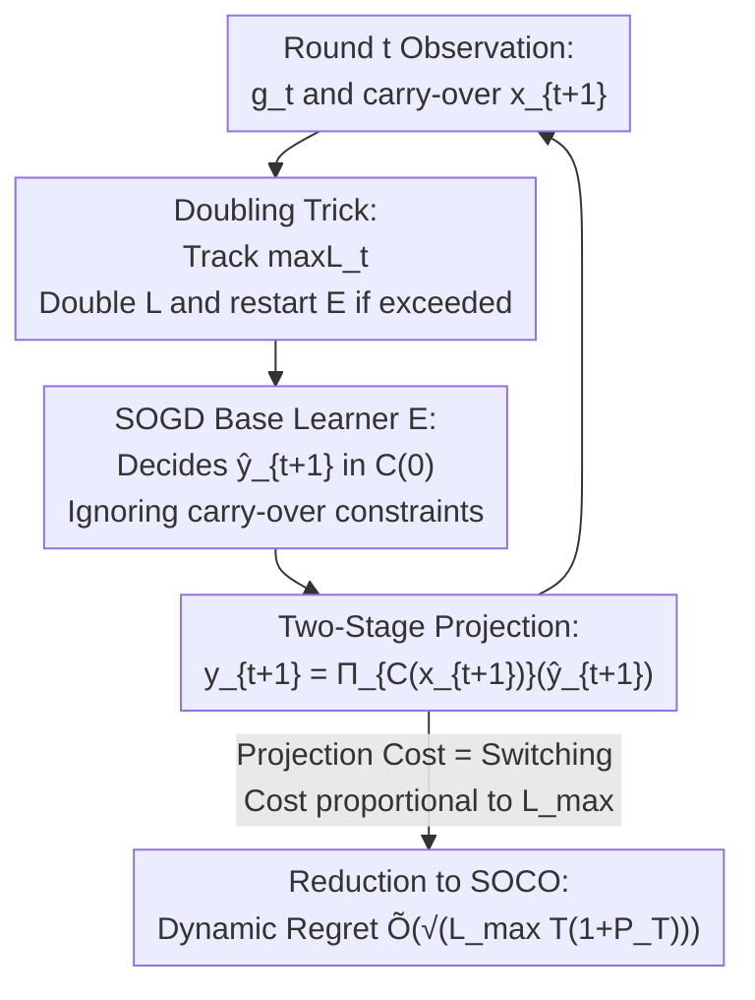

# Online Inventory Optimization in Non-Stationary Environment

**Conference**: ICLR 2026  
**OpenReview**: [https://openreview.net/forum?id=mkl9iIXIr2](https://openreview.net/forum?id=mkl9iIXIr2)  
**Code**: TBD  
**Area**: Learning Theory / Online Convex Optimization  
**Keywords**: Online Inventory Optimization, Dynamic Regret, Online Convex Optimization, Smoothed Online Optimization, Switching Cost

## TL;DR
This paper proposes a "two-stage projection + doubling trick" algorithm for Online Inventory Optimization (OIO) under non-stationary demand. By transforming the inventory carry-over constraint into a switching cost proportional to the sell-out period, the authors reduce OIO to Smoothed Online Convex Optimization (SOCO). They provide the first near-optimal dynamic regret bound of $\tilde{O}(\sqrt{L_{\max}T(1+P_T)})$ along with a matching lower bound of $\Omega(\sqrt{L_{\max}T})$.

## Background & Motivation

**Background**: Inventory management is a core problem in supply chains. When demand models are unknown, the mainstream approach models "periodic replenishment + carry-over inventory" systems as Online Convex Optimization (OCO): in each round, the decision-maker sets a target inventory level $y_t$, then the environment reveals a convex loss (e.g., newsvendor loss $\ell_t(y)=|y-d_t|$) and a subgradient $g_t$. Hihat et al. (2023) formalized this framework as Online Inventory Optimization (OIO) and proposed the MaxCOSD algorithm, proving sublinear **static regret**.

**Limitations of Prior Work**: Existing OIO algorithms almost exclusively guarantee **static regret**—comparing against a fixed optimal level $u$, i.e., $\sum_t\ell_t(y_t)-\min_{u}\sum_t\ell_t(u)$. However, in non-stationary environments with fluctuating demand, a "fixed level" reference is unreasonable. The authors provide a clear example: in a single-item system where demand $d_t=Dt/T$ grows linearly, the optimal total loss for a fixed level under newsvendor loss is $O(DT)$, while the time-varying reference $u_t=d_t$ yields a total loss of $0$. This means even an algorithm with $O(\sqrt{T})$ static regret might suffer $\Omega(T)$ regret relative to a truly time-varying reference.

**Key Challenge**: To evaluate algorithms in non-stationary environments, one should use **dynamic regret** $R_T(u_1,\dots,u_T)=\sum_t\ell_t(y_t)-\sum_t\ell_t(u_t)$, which allows the reference sequence $u_1,\dots,u_T$ to change every round. Standard OCO already has mature two-layer structures (meta + base learner) that achieve $O(\sqrt{(1+P_T)T})$ dynamic regret, where $P_T=\sum_{t\ge 2}\|u_{t-1}-u_t\|_1$ is the path length. However, OIO introduces an **inventory carry-over constraint**: the level $y_t$ cannot be less than the remaining inventory $x_t$ from the previous round, whereas the reference $u_t$ is not subject to this constraint. Thus, the feasible set for $u_t$ is always a superset of the feasible set for $y_t$. Standard OCO algorithms only provide guarantees for "references within the same feasible set"; applying them directly results in $O(T)$ regret due to the gap between $\hat{u}_t$ and $u_t$. Worse, naively plugging MaxCOSD as a base learner into a two-layer structure leads to **self-contradiction**: the meta-learner's $y_t$ might be larger than a base learner's output $y_t^a$. If demand is low, the carry-over inventory $x_{t+1}$ might exceed $y_t^a$, violating the base learner's own "$x_t\le y_{t-1}$" assumption and causing theoretical guarantees to collapse.

**Goal**: Construct an algorithm under carry-over constraints and warehouse capacity (linear sum) constraints that achieves a dynamic regret of $\tilde{O}(\sqrt{L_{\max}T(1+P_T)})$ **without prior knowledge of $L_{\max}$ and $P_T$**. Additionally, improve the static regret from the state-of-the-art $O(L_{\max}\sqrt{T})$ to $\tilde{O}(\sqrt{L_{\max}T})$ (saving a factor of $\sqrt{L_{\max}}$).

**Core Idea**: Utilize a **two-stage projection**—the base learner freely decides $\hat{y}_{t+1}$ within the feasible set $C(0)$ (containing only capacity constraints), which is then projected onto the feasible set $C(x_{t+1})$ (containing carry-over constraints) to obtain the actual order $y_t$. The authors prove that the cost of this projection is exactly a **switching cost proportional to the sell-out period $L_{\max}$**, thereby cleanly reducing OIO to Smoothed Online Convex Optimization (SOCO).

## Method

### Overall Architecture

Problem Setup (Alg. 1): For $N$ items, the inventory vector takes values in a convex set $C\subset\mathbb{R}^N_{\ge 0}$. In each round $t$: ① Replenish to the target level $y_t$ decided in the previous round; ② The environment reveals the carry-over inventory $x_{t+1}$ (where $x^i_{t+1}=\max(0,y^i_t-d^i_t)\le y^i_t$) and subgradient $g_t\in\partial\ell_t(y_t)$; ③ The decision-maker sets the next level $y_{t+1}\in C(x_{t+1})$. The feasible set is defined as:
$$C(x):=\Big\{y\in[0,D]^N \;\Big|\; y^i\ge x^i\ \forall i,\ \textstyle\sum_{i}y^i\le D\Big\},$$
which is limited by the carry-over lower bound $y^i\ge x^i$ and the linear warehouse capacity constraint $\sum_i y^i\le D$. Subgradients are bounded $\|g_t\|_2\le G$. Note an engineering detail: the stockout penalty $p\max(0,d_t-y_t)$ of the newsvendor loss is linear in $y_t$, so **the subgradient can be calculated just by observing whether a stockout occurred, without needing the true demand volume**—making the algorithm applicable in retail scenarios with "lost sales/unobservable demand."

Mechanism (Alg. 2): The pipeline is concise. Every round, $g_t$ is fed to a base learner $E$, which outputs a decision $\hat{y}_{t+1}\in C(0)$ considering only capacity constraints. This is then projected to the carry-over feasible set: $y_{t+1}=\Pi_{C(x_{t+1})}(\hat{y}_{t+1})$. Parallel to this, the algorithm tracks the current "cycle length" $\max L_t$. If it exceeds the current parameter $L$, $L$ is doubled and the base learner is restarted. The analysis framework is: the **two-stage projection** ensures the regret of real decisions is controlled by the base learner's regret (Lemma 1), with a penalty of a switching cost proportional to cycle length; the **doubling trick** adaptively calibrates this switching cost without knowing $L_{\max}$; finally, selecting a SOCO-oriented base learner (SOGD) achieves near-optimal dynamic regret without knowing $P_T$.

### Key Designs

**1. Two-Stage Projection: Decoupling Inventory Carry-over Constraints from the Base Learner**

The root cause of failure in naive two-layer structures is that the base learner's output is "contaminated" by carry-over constraints, breaking the internal assumption $x_t\le y_{t-1}$. This paper allows the base learner $E$ to **completely ignore carry-over inventory**, making decisions $\hat{y}_{t+1}$ only within the capacity-constrained set $C(0)=\{y\in[0,D]^N\mid\sum_i y^i\le D\}$. Carry-over constraints are addressed in the second stage via $y_{t+1}=\Pi_{C(x_{t+1})}(\hat{y}_{t+1})$. The key difference: unlike MaxCOSD's cyclic update where $y_t$ only updates if a candidate is feasible, this method **allows the true level $y_t$ to change even if the base learner's decision $\hat{y}_t$ is infeasible**—the base learner remains independent of carry-over inventory, preserving its theoretical guarantees.

**2. OIO↔SOCO Reduction: Projection Cost as Switching Cost Proportional to Cycle Length (Lemma 1)**

After decoupling, the question remains: how to compensate for the regret difference between the actual order $y_t$ and the base learner's $\hat{y}_t$? The authors introduce the "cycle" concept: for item $i$, a cycle is a continuous period where $\hat{y}^i_t$ cannot be realized due to high carry-over $x^i_t$ (i.e., $y^i_t > \hat{y}^i_t$). The cycle length is denoted $L^i_t$. A core lemma shows:
$$\sum_{t=1}^{T}\langle g_t,\,y_t-\hat{y}_t\rangle \;\le\; 2G\sum_{t=1}^{T}\Big(\max_{i\in[N]}L^i_t\Big)\,\|\hat{y}_t-\hat{y}_{t+1}\|_1 .$$
Essentially, the extra regret of real decisions compared to the base learner is bounded by a **switching cost** term with a coefficient proportional to the current cycle length $L^*_t=\max_i L^i_t$. Thus, the total dynamic regret becomes:
$$R_T\le\sum_{t=1}^T\big(\langle g_t,\hat{y}_t-u_t\rangle+2GL^*_t\|\hat{y}_t-\hat{y}_{t+1}\|_1\big),$$
where the right side is exactly the **dynamic regret of a SOCO problem**: the base learner chooses $\hat{y}_t\in C(0)$, incurring loss $\langle g_t,\hat{y}_t\rangle$ and switching cost $2GL^*_{t-1}\|\hat{y}_{t-1}-\hat{y}_t\|_1$. This step is the "pivot" of the paper—it translates OIO-specific time-varying carry-over constraints into well-studied switching costs in SOCO. The differences from standard SOCO are that $L^*_t$ is time-varying and **delay-observable** (cycle length is known only after it ends), and the switching cost uses the $\ell_1$ norm instead of $\ell_2$.

**3. Doubling Trick for Unknown Switching Cost: Capping Cycle Length by Sell-Out Period $L_{\max}$**

Since $L^*_t$ is unknown beforehand and delay-observable, it cannot be used directly to set learning rates. This paper uses a doubling trick: maintain a parameter $L$ and track the maximum observed cycle length $\max L_t$ (requiring $O(N)$ memory). Once $\max L_t > L$, let $L \leftarrow 2L$ and restart the base learner with the new parameter. This is justified by a key environmental characterization—the **sell-out period** $L_{\max}$ (Definition 1):
$$L_{\max}:=\min\Big\{L\in[T]\ \Big|\ \textstyle\sum_{s=t}^{\min(t+L-1,T+1)}d^i_s\ge D,\ \forall t\in[T],\,\forall i\in[N]\Big\},$$
Intuitively, at least $D$ units of each item are sold within any continuous $L_{\max}$ rounds. For static demand $d^i$, $L_{\max}=\lceil D/d^i\rceil$. Lemma 2 proves: **no cycle length exceeds $L_{\max}$**—as carry-over inventory must be consumed within one sell-out period. Thus, the doubling trick triggers at most $O(\log L_{\max})$ times, and $L$ stabilizes at $O(L_{\max})$. Theorem 2 concludes: if the base learner's regret can be decomposed into $L^\alpha R(T)$ with switching cost $\le O(L^{-\beta})$, then Alg. 2 regret $\le C(\alpha)R^{E(2L_{\max},T)}+\Delta(L_{\max},\beta)$, where the doubling overhead $\Delta$ is $O(L_{\max}\log L_{\max})$ (for $\beta=1$), which is negligible for sufficiently large $T$.

**4. SOGD Base Learner + Matching Lower Bound: Near-Optimal Regret without knowing $P_T$**

Finally, a specific base learner is chosen. Simple Online Gradient Descent (OGD, Alg. 3) with an $L$-parameterized learning rate $\eta=\sqrt{\tfrac{2D(3D+P_T)}{G^2(\sqrt{N}L+1/2)T}}$ yields $O(\sqrt{L_{\max}(1+P_T)T}+L_{\max}\log L_{\max})$ (Theorem 3), but requires knowing $P_T$ in advance. Instead, this paper adopts **Smoothed Online Gradient Descent (SOGD)** (Alg. 5) from Zhang et al. (2022a): a meta-algorithm uses a Discounted-Normal-Predictor to adaptively aggregate multiple OGD experts with different learning rates. This achieves $R_T\le O(\sqrt{L_{\max}(1+P_T)T\log T}+L_{\max}\log L_{\max})$ (Theorem 4) without $P_T$ as a prior, at the cost of a $\log T$ factor in per-round computation. Complementing this, the paper **provides the first $\Omega(GD\sqrt{L_{\max}T})$ lower bound for OIO** (Theorem 5). The matching upper and lower bounds prove $\tilde{O}(\sqrt{L_{\max}T})$ is near-optimal, answering the open question from Hihat et al. (2023) and confirming the optimality of the $\sqrt{L}$ factor in SOCO (Corollary 1).

## Key Experimental Results

This is a **purely theoretical work**; no numerical experiments were conducted. "Key data" refers to the comparison of regret bounds against existing work.

### Main Results: Regret Comparison

The table compares literature results, converting demand parameters to the $L_{\max}$ metric (S/M denotes Single/Multi-item; NV/O/F denotes Newsvendor/Obsolete/Fixed cost loss).

| Work | Regret Type | Upper Bound | Lower Bound | Items | Capacity | Demand |
|------|-------------|-------------|-------------|-------|----------|--------|
| Huh & Rusmevichientong (2009) | Static | $O(L_{\max}\sqrt{T})$ | — | S | Interval | i.i.d. |
| Zhang et al. (2018a) | Static | $O(L_{\max}\sqrt{T})$ | $\Omega(\sqrt{T})$ | S | Interval | i.i.d. |
| Agrawal & Jia (2022) | Static | $\tilde{O}(\sqrt{T}+L_{\max})$ | — | S | Interval | i.i.d. |
| Hihat et al. (2023) | Static | $O(L_{\max}\sqrt{T})$ | — | M | Convex | non-i.i.d. |
| **Ours** | **Static** | $\tilde{O}(\sqrt{L_{\max}T})$ | $\Omega(\sqrt{L_{\max}T})$ | M | Linear | non-i.i.d. |
| **Ours** | **Dynamic** | $\tilde{O}(\sqrt{L_{\max}(1+P_T)T})$ | $\Omega(\sqrt{(1+P_T)T})$ | M | Linear | non-i.i.d. |

### Results for different base learners

| Base learner | Dynamic Regret Upper Bound | $P_T$ Prior Needed? | Computation/Round |
|--------------|---------------------------|---------------------|-------------------|
| OGD (Alg. 3, Theorem 3) | $O(\sqrt{L_{\max}(1+P_T)T}+L_{\max}\log L_{\max})$ | Yes | $O(1)$ |
| SOGD (Alg. 5, Theorem 4) | $O(\sqrt{L_{\max}(1+P_T)T\log T}+L_{\max}\log L_{\max})$ | No | $O(\log T)$ |

### Key Findings
- **Static Regret Improved by $\sqrt{L_{\max}}$**: Prior works generally achieved $O(L_{\max}\sqrt{T})$; this work achieves $\tilde{O}(\sqrt{L_{\max}T})$, reducing the dependence on $L_{\max}$ from linear to square root, and proving optimality with an $\Omega(\sqrt{L_{\max}T})$ lower bound.
- **First Dynamic Regret Guarantee**: Under linear capacity constraints, no previous work provided OIO algorithms with theoretical guarantees in non-stationary environments. The $\tilde{O}(\sqrt{L_{\max}(1+P_T)T})$ bound fills this gap.
- **Impossibility of Sublinear Regret when $L_{\max}=\Omega(T)$**: The lower bound analysis shows that if the sell-out period is as long as $\Omega(T)$ (demand remains extremely low permanently), sublinear regret is unattainable—defining the solvable boundary of the "non-stationary" problem.

## Highlights & Insights
- **Translating "Constraint Difference" to "Switching Cost"**: Lemma 1 is the most elegant contribution—addressing the fact that OIO's $y_t$ and reference $u_t$ reside in different feasible sets by quantifying the difference as a switching cost proportional to cycle length. This reduction strategy can be transferred to other online decision problems with state constraints.
- **Appropriate Environmental Metric $L_{\max}$**: This metric only restricts demand fluctuations during the "window that determines $L_{\max}$" and does not restrict them elsewhere—providing an analytical handle without over-limiting non-stationarity, more fitting for inventory semantics than metrics like demand variance.
- **Symmetry of Lower Bounds**: Because OIO and SOCO are connected via reduction, the OIO lower bound also proves the optimality of the $\sqrt{L}$ factor in SOCO—a structural observation where one domain's lower bound constrains another.
- **Subgradients only require "Stockout" observations**: By leveraging the linearity of newsvendor loss, the algorithm updates without knowing the true demand volume, directly addressing the reality of unobservable demand in retail.

## Limitations & Future Work
- **Lead Time and Fixed Costs**: The model does not account for delays between ordering and arrival or fixed ordering costs. While these are studied under i.i.d. demand, extensions to non-stationary environments remain open.
- **Reliance on Linear Capacity Constraints**: Capacity constraints are restricted to linear sums $\sum_i y^i\le D$. While earlier work allowed general convex constraints, this restriction was key for Lemma 5/6. Generalizing this is left for future work.
- **$\log T$ Computational Overhead**: To achieve low dynamic regret, SOGD's meta-algorithm requires $O(T\log T)$ per round, which is more expensive than OGD.
- **Logarithmic Factors in Regret**: The dynamic regret bound contains a $\sqrt{\log T}$ factor not strictly matched by the lower bound; removing this factor is a potential research direction.

## Related Work & Insights
- **vs. MaxCOSD (Hihat et al., 2023)**: The preceding work on the same OIO setup used cyclic updates that only achieved $O(L_{\max}\sqrt{T})$ static regret. This paper permits updates even when candidates are infeasible, improving static regret and providing the first dynamic results, albeit by narrowing general convex constraints to linear ones.
- **vs. Standard Two-Layer Dynamic Regret (Ader, Zhang et al., 2018b)**: Standard OCO structures fail in OIP because carry-over inventory breaks base learner assumptions. This paper's two-stage projection + SOCO reduction bypasses this contradiction.
- **vs. SOCO Series (Lin et al., 2011; Zhang et al., 2021/2022a)**: This paper reuses SOGD as a base learner after reduction and, in turn, uses OIO results to prove the optimality of SOCO parameters.

## Rating
- Novelty: ⭐⭐⭐⭐⭐ First near-optimal dynamic regret bound for OIO + first $\Omega(\sqrt{L_{\max}T})$ lower bound; elegant reduction to SOCO.
- Experimental Thoroughness: ⭐⭐⭐ Purely theoretical; no numerical experiments, but theoretical "thoroughness" via matching bounds is high.
- Writing Quality: ⭐⭐⭐⭐ Motivations are introduced with clear counter-examples; the reduction logical path (Lemma 1→2→Theorem 2→4) is well-structured.
- Value: ⭐⭐⭐⭐ Resolves the open question from Hihat et al. (2023) and significantly advances online learning theory for non-stationary inventory management.

<!-- RELATED:START -->

## Related Papers

- [\[ICLR 2026\] Discounted Online Convex Optimization: Uniform Regret Across a Continuous Interval](discounted_online_convex_optimization_uniform_regret_across_a_continuous_interva.md)
- [\[ICLR 2026\] Scalable Random Wavelet Features: Efficient Non-Stationary Kernel Approximation with Convergence Guarantees](scalable_random_wavelet_features_efficient_non-stationary_kernel_approximation_w.md)
- [\[ICLR 2026\] Towards a Theoretical Understanding of In-Context Learning: Stability and Non-i.i.d. Generalisation](towards_a_theoretical_understanding_of_in-context_learning_stability_and_non-iid.md)
- [\[ICLR 2026\] Non-Asymptotic Analysis of (Sticky) Track-and-Stop](non-asymptotic_analysis_of_sticky_track-and-stop.md)
- [\[ICLR 2026\] Online Decision-Focused Learning](online_decision-focused_learning.md)

<!-- RELATED:END -->
