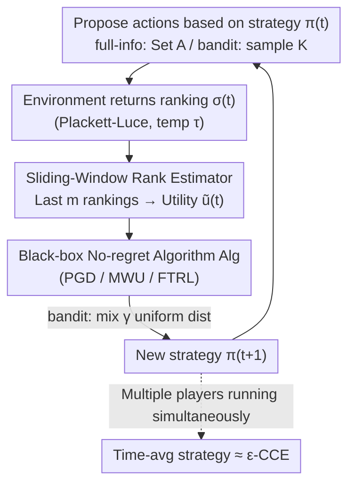

# Online Learning and Equilibrium Computation with Ranking Feedback

**Conference**: ICLR 2026  
**OpenReview**: [https://openreview.net/forum?id=lg6H2oJPky](https://openreview.net/forum?id=lg6H2oJPky)  
**Code**: TBD  
**Area**: Online Learning / Game Theory / Learning Theory  
**Keywords**: Online Learning, Ranking Feedback, No-regret Learning, Coarse Correlated Equilibrium, Plackett-Luce Model

## TL;DR
This paper generalizes the classic "numerical utility feedback" online learning to scenarios where only **action rankings** are observed. It first proves when sublinear regret is impossible in adversarial environments under pure ranking feedback, then constructs a modular algorithm that "estimates utility from rankings + feeds into an arbitrary black-box no-regret algorithm." Under the assumption of limited utility variation, it achieves sublinear regret and further guarantees convergence to an approximate Coarse Correlated Equilibrium (CCE) in multi-player repeated games. Finally, it validates the approach with an online LLM routing experiment.

## Background & Motivation

**Background**: Online learning is the standard model for sequential decision-making in arbitrary or even adversarial environments. In each round, an agent provides a mixed strategy, takes an action, and receives feedback from the environment—typically in **numerical** form, such as a utility vector $u^{(t)}\in[-1,1]^A$ in the full-information setting or a scalar utility $u^{(t)}(a^{(t)})$ for a sampled action in the bandit setting. Once the feedback is numerical, algorithms like PGD / MWU / FTRL can guarantee that external regret grows sublinearly over time (no-regret). Furthermore, if all players in a game run no-regret algorithms, their time-average strategies converge to a Coarse Correlated Equilibrium (CCE).

**Limitations of Prior Work**: In reality, "numerical utilities" are often unavailable. When feedback comes from humans, it is much easier to have someone **compare/rank** candidates than to provide calibrated numerical scores (as evidenced by the success of RLHF). Even if well-defined numerical utilities exist, they may be invisible to the learner for privacy or security reasons. For example, a recommendation platform recommends products to a continuous stream of customers; customers might be willing to rank items but reluctant to reveal their true valuations—the platform only receives a **ranking**. However, the fundamental limits and algorithmic solutions for online learning under ranking feedback have remained blank.

**Key Challenge**: Ranking is a **lossy, nonlinear** observation of utility. In ranking models like Plackett-Luce, a smaller temperature $\tau$ makes the ranking more deterministic, reflecting only "who is better" and losing information on the magnitude of utility differences; a larger $\tau$ makes the ranking closer to uniform sampling, similarly decoupling it from true utility. Combined with an adversarial environment where utility vectors can change arbitrarily fast, it may be impossible to estimate utilities accurately from a sequence of rankings alone—implying that no-regret might not be achievable.

**Goal**: The problem is split into two sub-questions: (1) In non-stochastic/adversarial environments, **when is it impossible** to achieve sublinear regret with pure ranking feedback? (2) When it is possible, how can an algorithm be constructed that provides both regret minimization and equilibrium approximation guarantees?

**Key Insight**: The authors categorize feedback into two types based on "how the ranking is generated": rankings based on **current instantaneous utility** (InstUtil Rank, corresponding to one-time/memoryless users) and rankings based on **time-average utility** (AvgUtil Rank, corresponding to long-term users with memory). Analysis is performed for both full-information and bandit settings.

**Core Idea**: First, hardness instances are used to delineate feasibility boundaries (under which feedback types and $\tau$ failure is inevitable). Then, under the mild assumption of "sublinear total utility variation," a **sliding-window rank estimator** is used to translate rankings back into numerical utilities, which are then fed into any existing no-regret algorithm as a **black box**. This reduces the ranking feedback problem to the already solved numerical feedback problem.

## Method

### Overall Architecture

The work is divided into two parts: **negative results** answering "when is it impossible," and **positive algorithms** answering "how to do it when possible." The negative part constructs adversarial utility sequences to prove that InstUtil Rank cannot achieve sublinear regret for any $\tau\le O(1)$, and AvgUtil Rank also fails when $\tau$ is sufficiently small. This necessitates a mild assumption—sublinear total utility variation (Assumption 4.2)—under which the problem becomes solvable.

The positive algorithm is a **modular pipeline per round**. The core is decoupling "ranking $\to$ utility" estimation from "utility $\to$ strategy" updates. In each round, the agent proposes a multiset of actions $o^{(t)}$ based on the current strategy $\pi^{(t)}$ (proposing the entire set $A$ in full-information, or sampling $K$ actions independently with replacement according to $\pi^{(t)}$ in bandit). The environment returns a ranking $\sigma^{(t)}$. A **sliding-window rank estimator** (Algorithm 1) uses the rankings from the most recent $m$ rounds to estimate numerical utilities $\tilde u^{(t)}$. This estimate is fed as "pseudo-numerical feedback" into **any numeric no-regret black-box algorithm** Alg (e.g., PGD / MWU / FTRL), which outputs the strategy for the next round. In the bandit setting, a $\gamma$ proportion of a uniform distribution is mixed in to ensure exploration. This mechanism ensures the final regret is bounded by "the regret of the ideal numerical algorithm + estimation error."

### Key Designs

**1. Feasibility Boundary: Using Adversarial Instances to Mark Failure**

This is the root of why additional assumptions are needed. The authors construct hardness instances proving that under **InstUtil Rank**, for any $0<\tau\le O(1)$, there exists a utility sequence such that the expected regret of any algorithm is $\Omega(T)$ (both in full-information and bandit). The proof involves creating two utility sequences that **induce the same expected ranking** under InstUtil, making them indistinguishable to the algorithm; thus, being no-regret on one sequence forces linear regret on the other. For **AvgUtil Rank**, an $\tilde\Omega(T)$ lower bound exists when $\tau\le O(1/(T\log T))$. These hardness results stem from "utilities changing too fast," leading to the key assumption—**sublinear total variation**:

$$P^{(T)} := \sum_{t=2}^{T}\left\lVert u^{(t)}-u^{(t-1)}\right\rVert \le O(T^q),\quad q<1. \tag{4.2}$$

Notably, in games where opponents run common no-regret algorithms like FTRL, this assumption is automatically satisfied.

**2. Sliding-Window Rank Estimator: Inverting Logistic from Pairwise Comparisons**

The challenge is that Plackett-Luce is **non-convex** with respect to utilities, making direct maximum likelihood estimation unstable and hard to bound. The authors' approach (Algorithm 1) uses the most recent $m$ rankings $\{\sigma^{(s)}\}_{s=t-m+1}^{t}$ to **decompose each ranking of length $K$ into pairwise comparisons**. The probability of one action being ranked ahead of another follows the logistic form $\Pr[a_i\succ a_j]=1/(1+e^{-(u(a_i)-u(a_j))/\tau})$. Utilizing the monotonic invertibility of the logistic map, the "empirical estimation error of ranking probabilities" can be inverted back to "utility estimation error." The high-probability error bound (Theorem 5.1) is roughly:

$$\left\lVert \tilde u^{(t)}-u^{(t)}\right\rVert_\infty \le \tau\big(e^{1/\tau}+1\big)^2\frac{1}{p}\sqrt{\frac{\log(4|A|/\delta)}{m'}} + \sum_{s=t-m'+1}^{t-1}\left\lVert u^{(s+1)}-u^{(s)}\right\rVert_\infty,$$

Treating $\delta, p, \tau$ as constants, the cumulative estimation error is bounded by $O\!\big(T/\sqrt{m'}+m'P^{(T)}\big)$—as long as $P^{(T)}$ is sublinear, the cumulative error is sublinear. This bound also reveals an intuitive phenomenon: as $\tau\to0^+$, rankings become deterministic and lose information about utility differences; as $\tau\to+\infty$, rankings become uniform and independent of utility. Both cases cause the bound to diverge, implying an "information-rich" intermediate temperature.

**3. Black-Box Reduction: Feeding Estimated Utilities into No-Regret Oracles**

With $\tilde u^{(t)}$ available, the authors do not redesign learning algorithms but treat it as "pseudo-numerical feedback" for **any existing numeric no-regret oracle** Alg. In full-information, the entire action set is proposed ($p=1$), using Algorithm 2, where regret is split into "ideal numerical algorithm regret + estimation error":

$$R^{(T),\text{external}} \le R^{(T),\text{external}}\!\big(\text{Alg},\{\tilde u^{(t)}\}\bag)+O\!\Big(P^{(T)\,1/3}T^{2/3}(\log\tfrac{T}{\delta})^{1/3}\Big).$$

In the bandit setting, only proposed actions can be evaluated. The agent's "utility" is the average utility of proposed actions, corresponding to the regret definition:

$$R^{(T)} := \max_{\hat\pi\in\Delta_A}\sum_{t=1}^{T}\Big(\langle u^{(t)},\hat\pi\rangle - \tfrac{1}{K}\textstyle\sum_{a\in o^{(t)}}u^{(t)}(a)\Big). \tag{3.1}$$

To ensure every action is explored, the next strategy is a convex combination of the oracle output and a uniform distribution: $\pi^{(t+1)}=(1-\gamma)\,\text{Alg}(\{\tilde u^{(s)}\})+\gamma\,\mathbf 1(A)/|A|$. This leads to a bandit regret with an additional $O\big(P^{(T)\,1/5}T^{4/5}\log\frac{T}{\delta}\big)$ term.

**4. Stability for AvgUtil and Equilibrium Convergence**

AvgUtil is more subtle because rankings are based on **cumulative average utility**. The authors require the oracle to satisfy a stability Assumption 6.1 (Lipschitz continuity of output w.r.t. cumulative utility). In this case, full-information sublinear regret is achievable without the sublinear variation assumption. For the bandit setting, an **epoch-based** approach is used to estimate differences within blocks, balancing bias and variance. Finally, when all players run the proposed algorithm, the time-average joint strategy is an $\epsilon$-CCE, where $\epsilon:=\max_i\frac{1}{T}R^{(T),\text{external}}_i$. As long as each player's regret is sublinear, $\epsilon\to0$.

## Key Experimental Results

The paper is primarily theoretical, with experiments focused on an **online LLM routing** application: a service provider has multiple LLMs (e.g., GPT-4o for creativity, GPT-5 for coding). Selecting a model for a user is modeled as online learning with ranking feedback—sampling $K$ models per round to generate candidate responses. The user provides a **ranking** of responses rather than scores.

### Main Results (Online LLM Routing)

| Setting | Data / Models | Feedback | Observation |
|------|------------|------|------|
| Algorithm 3, AvgUtil + bandit | HH-RLHF prompts; Qwen3-32B / Phi-4 / GPT-4o / Llama-3.1-70B; DeBERTa reward model | Rankings (induced by reward vectors) | Average regret decreases monotonically over $t$, quickly approaching the performance of the best fixed model in hindsight. |

### Sensitivity to Temperature and Proposals

| Variable | Values | Phenomenon |
|------|------|------|
| Temperature $\tau$ | 0.5 / 1.0 / 2.0 | Average regret decreases in all cases; curves differ slightly, confirming an "information-rich" intermediate temperature. |
| Proposals $K$ | 2 / 3 / 4 | Larger $K$ provides more information per round, leading to faster convergence and lower final average regret. |

### Key Findings
- **Monotonic decrease in average regret** directly validates the theory: under limited utility variation, pure ranking feedback is sufficient for a router to approach the best fixed model.
- The effects of $\tau$ and $K$ are consistent with the estimation error bounds—extreme temperatures lose information, and more proposals improve accuracy.

## Highlights & Insights
- **Paradigm of "Boundaries Before Algorithms"**: Instead of just giving an upper bound, the paper first clarifies "when it is impossible" using adversarial instances, then introduces minimal assumptions (sublinear variation) to close the gap.
- **Estimation via Pairwise Logistic Inversion**: Bypassing the non-convexity of Plackett-Luce by decomposing rankings into pairwise comparisons and using logistic invertibility is a reusable technique for lossy ordinal feedback.
- **Black-Box Modularity**: Reducing the ranking problem to a numerical feedback problem allows any existing progress in numerical online learning to be migrated to the ranking feedback scenario at zero cost.
- **Bidirectional Degradation of Temperature**: Both $\tau\to0^+$ (too deterministic) and $\tau\to+\infty$ (too random) degrade estimation, suggesting an "information-theoretic sweet spot" for ordinal feedback.

## Limitations & Future Work
- **Dependence on Sublinear Total Variation**: InstUtil and small-$\tau$ AvgUtil are inherently unsolvable in adversarial settings without this assumption; the approach may fail in highly non-stationary environments.
- **Loose Regret Bounds**: Bounds such as $O(T^{2/3})$ or $O(T^{4/5})$ are still far from $\sqrt T$; whether these are optimal remains unknown.
- **Assumption of PL Model and Known $\tau$**: The estimator relies on the Plackett-Luce structure and (implicitly) $\tau$. Real-world human rankings might not follow PL, and robust estimation with unknown $\tau$ is an open problem.
- **Light Empirical Evaluation**: Only one LLM routing example and synthetic experiments are provided, lacking real human ranking data or comparisons with other dueling/preference learning baselines.

## Related Work & Insights
- **vs. Adversarial Dueling Bandits**: While both use comparison feedback, this paper uses the standard external regret definition and generalizes simple comparisons to rankings of length $K$.
- **vs. Maran et al. (2024)**: That work focused on stochastic environments ($\tau\to0^+$). This paper generalizes to adversarial settings, and its AvgUtil-bandit lower bound actually **strengthens** their results.
- **vs. RLHF**: RLHF micro-tunes models based on human preferences/rankings. This paper provides the feasibility boundaries and algorithmic theory for such ordinal feedback in an online setting.

## Rating
- Novelty: ⭐⭐⭐⭐⭐ First systematic characterization of feasibility boundaries, black-box algorithms, and equilibrium guarantees for online learning with ranking feedback.
- Experimental Thoroughness: ⭐⭐⭐ Solid theory, but empirical results are limited to an LLM routing example and synthetic tests.
- Writing Quality: ⭐⭐⭐⭐ Clear structure with a well-defined mapping between hardness and positive results.
- Value: ⭐⭐⭐⭐⭐ Bridges the gap between numerical and ordinal feedback in online learning, with guidance for RLHF and matching platforms.

<!-- RELATED:START -->

## Related Papers

- [\[ICLR 2026\] Online Conformal Prediction with Adversarial Semi-bandit Feedback via Regret Minimization](online_conformal_prediction_with_adversarial_semi-bandit_feedback_via_regret_min.md)
- [\[ICLR 2026\] Differentially Private Equilibrium Finding in Polymatrix Games](differentially_private_equilibrium_finding_in_polymatrix_games.md)
- [\[ICLR 2026\] Online Decision-Focused Learning](online_decision-focused_learning.md)
- [\[ICLR 2026\] Toward Practical Equilibrium Propagation: Brain-Inspired Recurrent Neural Network with Feedback Regulation and Residual Connections](toward_practical_equilibrium_propagation_brain-inspired_recurrent_neural_network.md)
- [\[ICLR 2026\] Enabling Fine-Tuning of Direct Feedback Alignment via Feedback-Weight Matching](enabling_fine-tuning_of_direct_feedback_alignment_via_feedback-weight_matching.md)

<!-- RELATED:END -->
