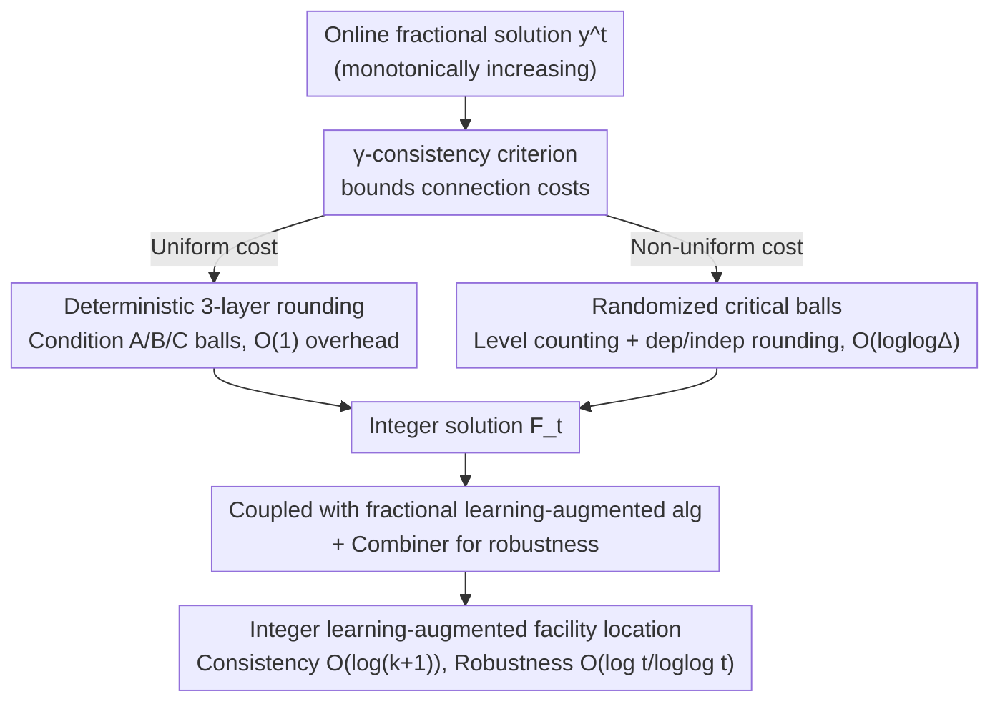

# Online Rounding and Learning Augmented Algorithms for Facility Location

**Conference**: ICLR 2026  
**OpenReview**: [https://openreview.net/forum?id=euOVJEhflG](https://openreview.net/forum?id=euOVJEhflG)  
**Code**: None (Pure theory paper)  
**Area**: Learning Augmented Algorithms / Online Algorithms / Clustering Theory  
**Keywords**: Facility location, online rounding, learning augmented algorithms, competitive ratio, metric space

## TL;DR
This paper provides the **first online rounding algorithms** for the metric facility location problem—rounding an online maintained fractional solution on the fly into an integer solution. For the uniform opening cost case, a deterministic algorithm incurs only an $O(1)$ constant factor loss; for the non-uniform case, a randomized algorithm incurs an expected $O(\log\log\Delta)$ factor loss ($\Delta$ is the aspect ratio of the metric). This yields the first integer algorithm for learning-augmented facility location under multiple predictions, pushing the consistency/robustness bounds to near-tight results that match the fractional version.

## Background & Motivation
**Background**: Clustering is a core problem in unsupervised learning. Recently, significant research has focused on the **online** version, where points to be clustered (clients) arrive sequentially rather than all at once. Facility location is a Lagrangian relaxation of $k$-median: instead of limiting the number of centers to $k$, an arbitrary number of **facilities** can be opened. Each facility incurs an opening cost $c(v)$, plus a connection cost for each client to its nearest opened facility, with the goal of minimizing the sum of both. Compared to $k$-median, it is more "robust" in online scenarios: opening extra facilities does not lose competitiveness, producing stable clusters for downstream ML models.

**Limitations of Prior Work**: Online facility location has been extensively studied since Meyerson (2001). Recently, the "Machine Learning advice" paradigm has been introduced—the algorithm receives predictions about the clustering solution at each step, aiming for **good performance when the prediction is accurate (consistency) and reasonable performance when it is poor (robustness)**. The issue is: while the **fractional version** ($y_v \in [0,1]$) has near-tight bounds, the **integer version** ($y_v \in \{0, 1\}$) suitable for real-world deployment has remained much weaker. The best existing integer results (Almanza et al. 2021) incur an $O(\log\log n)$ overhead compared to the optimal fractional solution and require **all predictions to be given before any client arrives**.

**Key Challenge**: "Rounding" a fractional solution into an integer solution is a mature technique in **offline** settings but is extremely difficult **online**. Once a facility is opened, it cannot be closed ($F_1 \subseteq F_2 \subseteq \cdots$ is monotonic). As the fractional solution grows over time, irrevocable integer decisions must be made with incomplete information. In non-metric facility location, online rounding is essentially equivalent to set cover, which inevitably loses a logarithmic factor.

**Goal**: (1) Provide online rounding algorithms for metric facility location to minimize the fractional-to-integer loss; (2) Use them to "translate" fractional learning-augmented results into integer versions, eliminating the $O(\log\log n)$ overhead and the requirement for pre-given predictions.

**Key Insight**: The authors observe that **metric structure (triangle inequality) is an underutilized resource**. Non-metric facility location must incur logarithmic loss because it lacks geometric structure; however, in the metric case, there are strong constraints between "near-field fractional mass" and "existence of nearby opened facilities." This allows rounding decisions to be organized via ball coverage, compressing the loss to sub-logarithmic or even constant levels.

**Core Idea**: The paper abstracts rounding quality into a local geometric condition called **$\gamma$-consistency**. As long as any ball $B(v, R)$ containing $\geq 1/2$ fractional mass has an opened facility within distance $\gamma R$, connection costs are automatically controlled. The remaining task is to ensure that "too many facilities are not opened." This decomposes a global optimization problem into two separately provable local conditions.

## Method

### Overall Architecture
The problem is: given an **online, monotonically increasing** fractional facility location solution $y^t = (y^t_v)$, round it on the fly into an integer facility set $F_t$ as each client arrives, such that the total cost of $F_t$ is only a small factor larger than the fractional solution. The pipeline is composed of three stages: **formalizing rounding quality into the $\gamma$-consistency criterion** (fixing connection costs); **designing two specific rounding algorithms for different cost models** (deterministic three-layer coverage for uniform costs, randomized critical balls for non-uniform costs); and **coupling the rounding with existing fractional learning-augmented algorithms** using a combiner for robustness.

A profound conclusion of the paper is: **the difficulty of online facility location lies in "computing a good fractional solution," rather than "rounding it"**—rounding only loses $O(1)$ (uniform) or $O(\log\log\Delta)$ (non-uniform), meaning the gap between fractional and integer is nearly non-existent.

### Key Designs

**1. $\gamma$-consistency: Compressing rounding quality into a local geometric condition**

Directly proving "integer total cost $\leq$ constant $\times$ fractional total cost" is difficult because opening and connection costs are entangled. The authors isolate the **connection cost** using a local criterion. An integer set $F_t$ is $\gamma$-consistent for $y^t$ if: for any ball $B = B_t(v, R)$, if the fractional mass $y^t(B) = \sum_{u \in B} y^t_u \geq 1/2$, then $F_t$ contains an opened facility within distance $\gamma R$ of $v$.

This works because it implies a bound on connection costs (Lemma 1):

$$\sum_{u\in V_t}\min_{v\in F_t}d(u,v)\ \leq\ 2\gamma\cdot\sum_{u\in V_t}\sum_{v\in V_t}d(u,v)\,x^t_{uv}.$$

The intuition is: if a client $u$ has fractional connection cost $\beta$, then the ball $B(u, 2\beta)$ must contain $\geq 1/2$ fractional mass. Thus, $\gamma$-consistency ensures $u$ has an opened facility within $2\gamma\beta$. **This simplifies the problem to two tasks**: (a) maintaining small constant $\gamma$-consistency; (b) ensuring the number of facilities does not explode.

**2. Uniform Cost: Deterministic three-layer coverage rounding with O(1) loss**

When all opening costs are identical (normalized to 1), the authors provide a **deterministic** algorithm (Theorem 2). The core is maintaining **4-consistency**: if a ball $B_t(v, R)$ has mass $\geq 1/2$ and the nearest facility is $> 4R$ away, a facility is opened at $v$. To avoid opening too many, a **three-layer coverage** mechanism processes nested balls from largest to smallest radius:

- **Level-1 (Condition A)**: Mass $\geq 1/2$ and nearest facility $> 4R$.
- **Level-2 (Condition B)**: Inside a Level-1 ball, smaller radius, mass $\geq 1/4$, nearest facility $> 3r$.
- **Level-3 (Condition C)**: Inside a Level-2 ball, smaller radius, mass $\geq 1/8$, nearest facility $> 2\rho$.

Crucially, Level-3 balls within a single Level-2 ball are **pairwise disjoint** (Lemma 3), meaning a Level-2 ball triggers at most **3** Level-3 facilities (Lemma 4). By amortizing facility counts against new fractional mass, the number of facilities is bounded by $\leq 36 \cdot \sum_v y_v$ (Theorem 7), and connection costs are bounded by 8x (Theorem 8), leading to $O(1)$ overhead.

**3. Non-uniform Cost: Randomized critical ball rounding with O(log log Δ) loss**

With arbitrary opening costs, amortization fails. The authors use a **randomized** algorithm (Theorem 9) where expected opening cost is $O(\log\log\Delta)$ times the fractional cost ($\Delta$ is the aspect ratio). 

First, a **deterministic step** opens any facility with $y^t_v \geq 1/2$. Others use a **level counter** $\ell(v)$ recording randomized rounding attempts. **Critical balls** are defined to ensure they do not overlap excessively. The level of a ball $\ell(B)$ is the minimum level threshold to accumulate $1/4$ mass. Two rounding modes are used: **dependent rounding** (opening a facility in low-level sets with probability proportional to $y^t_u$) and **independent rounding**. The expected level is $O(\log\log\Delta)$, ensuring the opening cost overhead is sub-logarithmic, while $\gamma$-consistency remains **deterministically** satisfied.

**4. Learning Augmented: Combining for tight consistency and robustness**

The rounding algorithms serve as building blocks. Under multiple predictions, each client arrival yields $k$ advice vectors $y_v(1), \dots, y_v(k)$. The goal is to compete with $\text{dynamic}_t$, the solution selecting the best advice at each step. By applying the rounding to the fractional algorithms of Anand et al. (2022), the authors achieve integer solutions with consistency $O(\log(k+1))$ and robustness $O(\tfrac{\log t}{\log\log t})$. Robustness is guaranteed by a **combiner** that simultaneously tracks the proposed algorithm and a no-prediction online algorithm, choosing the better of the two.

## Key Experimental Results

> Note: This is a **pure theory paper** and does not contain numerical experiments. The tables below summarize theoretical guarantees.

### Main Results: Rounding Overhead

| Setting | Algorithm Type | Integer / Fractional Cost Ratio | Tightness |
|---------|----------------|---------------------------------|-----------|
| Uniform Opening Cost | Deterministic | $O(1)$ (Opening $\leq 36\times$, Connection $\leq 8\times$) | — |
| Non-uniform Opening Cost | Randomized | $O(\log\log\Delta)$ (Expected) | Asymptotically tight (App. D) |

### Learning-Augmented Facility Location: Comparison

| Work | Integer / Fractional | Overhead | Consistency | Pre-given Predictions? |
|------|-----------------------|----------|-------------|------------------------|
| Almanza et al. (2021) | Integer (Uniform) | $O(\log\log n)$ | — | Yes (Required) |
| Anand et al. (2022) | Fractional | — | $O(\log(k+1))$ | No |
| **Ours (Uniform)** | **Integer** | **$O(1)$** | $O(\log(k+1))$ | **No** |
| **Ours (Non-uniform)** | **Integer (First)** | $O(\log\log\Delta)$ | $O(\log\log\Delta \cdot \log(k+1))$ | **No** |

### Key Findings
- **Difficulty lies in fractional solutions**: Rounding only loses $O(1)$ or $O(\log\log\Delta)$, suggesting the primary challenge of online facility location is computing a good fractional solution.
- **Metric structure is a key lever**: While non-metric rounding inevitably incurs logarithmic loss (set cover), the triangle inequality and ball coverage reduce this to constant or sub-logarithmic terms.
- **Uniform vs. Non-uniform divide**: Uniform cases allows cost amortization to nearby mass, enabling deterministic $O(1)$ results. Non-uniform cases require randomization and level counting, with $O(\log\log\Delta)$ proven as a fundamental barrier.

## Highlights & Insights
- **$\gamma$-consistency as a reusable abstraction**: Shifting focus from global cost ratios to a local ball-facility distance condition simplifies connection cost analysis to Lemma 1.
- **Elegance of Three-Layer Coverage**: The disjointness proof for Level-3 balls within Level-2 balls provides a rigorous way to curb facility proliferation using elementary triangle inequalities.
- **Structural Insight**: The conclusion that "rounding is almost free" redirects community attention toward improving fractional algorithms.
- **Independence of Rounding**: The rounding algorithms are modular and can be plugged into any algorithm that generates a good fractional solution, not limited to ML-advice settings.

## Limitations & Future Work
- **The $\log\log\Delta$ gap**: Constant-factor online rounding for non-uniform facility location remains an open problem.
- **Reliance on Fractional Solvers**: The learning-augmented results rely on the quality of the fractional solutions from Anand et al. (2022).
- **Purely Theoretical**: There is no numerical validation of the constant $36$ or the practical performance of the $\log\log$ factors on real datasets.
- **Aspect Ratio Dependency**: The non-uniform bound depends on $\Delta$ (or $n$), which may degrade in pathologically spread-out metrics.

## Related Work & Insights
- **vs. Almanza et al. (2021)**: They provide an integer learning-augmented algorithm for the uniform case but with $O(\log\log n)$ overhead and pre-given predictions. Ours improves this to $O(1)$ and enables true online operation.
- **vs. Anand et al. (2022)**: They solve fractional online covering (including facility location). This paper provides the missing link to translate those fractional results into integer ones.
- **vs. Non-metric Rounding**: Those works suffer logarithmic loss due to the equivalence to set cover. This paper highlights the value of the metric geometry.
- **vs. Online Matching Rounding**: While online rounding has recently flourished in matching (packing) problems, this paper extends those paradigms to covering problems like facility location.

## Rating
- Novelty: ⭐⭐⭐⭐⭐ First online rounding for metric facility location; first non-uniform integer learning augmentation.
- Experimental Thoroughness: ⭐⭐⭐ Pure theory, but includes lower bound proofs showing asymptotic tightness.
- Writing Quality: ⭐⭐⭐⭐ Clear decomposition of the three-layer coverage and $\gamma$-consistency mechanism.
- Value: ⭐⭐⭐⭐⭐ "Difficulty is in fractional" is a path-breaking structural insight.

<!-- RELATED:START -->

## Related Papers

- [\[ICLR 2026\] Decision-Theoretic Approaches for Improved Learning-Augmented Algorithms](decision-theoretic_approaches_for_improved_learning-augmented_algorithms.md)
- [\[ICLR 2026\] Better Learning-Augmented Spanning Tree Algorithms via Metric Forest Completion](better_learning-augmented_spanning_tree_algorithms_via_metric_forest_completion.md)
- [\[ICML 2026\] Parsimonious Learning-Augmented Online Metric Matching](../../ICML2026/learning_theory/parsimonious_learning-augmented_online_metric_matching.md)
- [\[ICLR 2026\] ATLAS: Alibaba Dataset and Benchmark for Learning-Augmented Scheduling](atlas_alibaba_dataset_and_benchmark_for_learning-augmented_scheduling.md)
- [\[NeurIPS 2025\] Learning-Augmented Online Bipartite Fractional Matching](../../NeurIPS2025/learning_theory/learning-augmented_online_bipartite_fractional_matching.md)

<!-- RELATED:END -->
