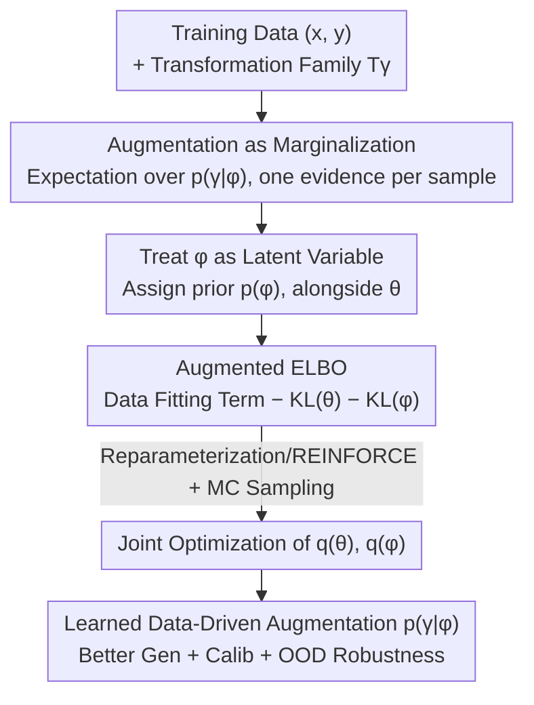

# Optimizing Data Augmentation through Bayesian Model Selection

**Conference**: ICLR 2026  
**OpenReview**: [https://openreview.net/forum?id=ofYuPZ0sK0](https://openreview.net/forum?id=ofYuPZ0sK0)  
**Code**: To be confirmed  
**Area**: Learning Theory / Bayesian Methods / Variational Inference  
**Keywords**: Data Augmentation, Bayesian Model Selection, Variational Inference, ELBO, PAC-Bayes, Calibration

## TL;DR
This paper proposes OPTIMA, which treats data augmentation (DA) parameters as model hyperparameters and reformulates the "augmentation strategy selection" as a Bayesian model selection problem. By utilizing a tractable augmented ELBO, it jointly optimizes augmentation parameters and model parameters within a single training loop, eliminating the expensive cost of repeated training required by grid search or Bayesian optimization while simultaneously improving generalization, calibration, and OOD robustness across vision and NLP tasks.

## Background & Motivation
**Background**: Data augmentation (DA) is a standard component of modern deep learning. Applying label-preserving transformations (rotation, translation, flipping, Mixup, word substitution, etc.) to samples during training is equivalent to a form of regularization, allowing over-parameterized networks to better estimate expected risk and improve generalization. However, once a transformation is selected, its "parameters" (e.g., the range of rotation angles) must still be determined.

**Limitations of Prior Work**: The quality of augmentation parameters directly determines the gain, and incorrect choices can be harmful—for example, rotating a '9' into a '6' on MNIST damages training. In practice, these parameters are often chosen via trial-and-error or tuned on a validation set using grid search/Bayesian optimization, the latter of which requires numerous full training runs and is extremely costly. AutoAugment uses reinforcement learning for searching, while other works utilize density matching, differentiable policy search, or bilevel optimization, generally relying on complex search pipelines and heuristics.

**Key Challenge**: First, there is a lack of a principled, training-free framework for "selecting augmentation parameters." Second, **naïve augmentation double-counts evidence**. Treating each augmented copy $\{(T_\gamma(x_i), y_i)\}$ as an independent sample is equivalent to raising the likelihood $p(y_i\mid x_i,\theta)$ to the $K$-th power, which artificially shrinks posterior uncertainty, destroys calibration, and negates the inherent advantages of Bayesian methods.

**Goal**: To find a unified framework that can learn augmentation parameters in a data-driven manner without undermining uncertainty quantification, supported by rigorous theoretical guarantees.

**Key Insight**: The authors adopt a probabilistic perspective on DA—augmentation parameters $\phi$ are treated as (hyper)parameters of the model. "Selecting the optimal augmentation" thus becomes selecting the model with the highest marginal likelihood (model evidence), which is a **Bayesian model selection** problem.

**Core Idea**: Define augmentation as "marginalizing over transformations" rather than "duplicating data." This leads to a tractable augmented ELBO that allows for the joint optimization of augmentation parameters $\phi$ and model parameters $\theta$ in a single training run.

## Method

### Overall Architecture
OPTIMA (OPTImizing Marginalized Augmentations) addresses the problem of "automatically learning optimal augmentation distributions during training without destroying posterior calibration." The core concept is to rewrite augmentation from "generating more training samples" to "taking the expectation over the transformation distribution." First, a **transformation-augmented likelihood** is defined, marginalizing each original sample under the augmentation distribution $p(\gamma\mid\phi)$ so that it still contributes only one unit of evidence. Next, a prior is assigned to the augmentation parameters $\phi$, treating them as latent variables alongside $\theta$. Finally, an **augmented ELBO** is derived via variational inference, and $q(\theta)$ and $q(\phi)$ are jointly optimized using reparameterization + Monte Carlo gradients. The entire process requires no separate validation set training cycles and adds negligible computational overhead.

### Key Designs

**1. Augmentation as Marginalization: Replacing Data Duplication with Expectation**

To address the fundamental pain point where "naïve augmentation double-counts evidence and shrinks uncertainty," OPTIMA defines the augmented likelihood as an expectation over the transformation distribution rather than sample replication:

$$p(y\mid x,\theta,\phi) = \mathbb{E}_{p(\gamma\mid\phi)}\big[\,p(y\mid T_\gamma(x),\theta)\,\big]$$

Thus, regardless of how many transformations are sampled for each original sample, it contributes to the data likelihood only **once**, unlike naïve augmentation which raises $p(y_i\mid x_i,\theta)$ to the $K$-th power. The likelihood of the entire dataset is $p(\mathcal{D}\mid\theta,\phi)=\prod_{i=1}^N \mathbb{E}_{p(\gamma\mid\phi)}[p(y_i\mid T_\gamma(x_i),\theta)]$. This seemingly simple change—placing the expectation inside the log—is the source of all subsequent calibration advantages. Theoretically (Theorem 4.12), naïve augmentation shrinks the posterior covariance to $\Sigma_{\text{naïve}}\approx\frac1K\Sigma_{\text{true}}$, meaning predictive uncertainty is underestimated by a factor of approximately $\sqrt K$, leading to overconfidence that is particularly fatal for OOD inputs. Marginalization maintains the correct uncertainty.

**2. Bayesian Model Selection: Turning "Augmentation Selection" into "Marginal Likelihood Maximization"**

To address the issue of augmentation parameters relying on trial-and-error or expensive validation, OPTIMA assigns a prior $p(\phi)$ to the augmentation parameters $\phi$, making it a latent variable alongside the model parameters $\theta$. The joint distribution is written as $p(\mathcal{D},\theta,\phi,\gamma)=p(\theta)p(\phi)p(\gamma\mid\phi)p(\mathcal{D}\mid\theta,\phi)$. Consequently, "selecting the optimal augmentation" is naturally equivalent to "selecting the $\phi$ that maximizes the marginal likelihood (model evidence) $\log p(\mathcal{D}\mid X,\phi)$," which is a standard Bayesian model selection problem. Unlike previous approaches that treat augmentation parameters as fixed values and tune them via an outer black-box search, this internalizes model selection as inference over latent variables. From an Empirical Bayes perspective (Theorem 4.14), the mode/mean of $q(\phi)$ obtained by maximizing the objective is a prior-regularized Empirical Bayes point estimate, automatically selecting the augmentation strategy that "best explains the data."

**3. Augmented ELBO: Joint Optimization in a Single Training Loop**

Since the marginal likelihood $\mathcal{L}:=\log p(\mathcal{D})$ is intractable, the authors introduce a factored variational distribution $q(\theta,\phi)=q(\theta)q(\phi)$ and use Jensen's inequality to derive an optimizable lower bound:

$$\mathcal{L}\ge \mathbb{E}_{q(\theta)q(\phi)p(\gamma\mid\phi)}\!\Big[\sum_{i=1}^N \log p(y_i\mid T_\gamma(x_i),\theta)\Big] - \mathrm{KL}(q(\theta)\Vert p(\theta)) - \mathrm{KL}(q(\phi)\Vert p(\phi))$$

It consists of a data-fitting term plus two KL regularization terms (constraining $\theta$ and $\phi$ respectively). During optimization, stochastic gradient ascent is performed on both $q(\theta)$ and $q(\phi)$. Continuous transformations (e.g., geometric transforms, Mixup's $\alpha$) are sampled and backpropagated using the reparameterization trick. For discrete transformations (e.g., token dropout in NLP) which are non-differentiable, the score-function (REINFORCE) gradient is used. Monte Carlo estimation requires only 1 transformation per sample per iteration, resulting in **almost zero additional overhead** compared to fixed augmentation—this is key to its 4–8x computational savings compared to Bayesian optimization.

**4. Theoretical Guarantees: Quantifying the Benefits of Marginalization**

Another contribution of OPTIMA is its multi-perspective theoretical analysis, answering "why marginalization is better." **Variational Approximation Quality** (Proposition 4.1): The Jensen gap is controlled by the variance of the augmentation distribution and model sensitivity. If $f(\gamma)=\log p(y\mid T_\gamma(x),\theta)$ is $L$-Lipschitz and $\gamma$ has a sub-Gaussian variance proxy $\sigma^2$, then the gap $\le L^2\sigma^2/2$, implying that sensitive models should use more conservative (low-variance) augmentations (Corollary 4.2). **Generalization Guarantees** (Theorem 4.5): Within the PAC-Bayes framework, the OPTIMA bound is strictly tighter than that of naïve augmentation, with a gap $\Delta=\mathbb{E}_q[\frac1N\sum_i\Delta_\phi(x_i,y_i)]\ge0$, where $\Delta_\phi=\log\mathbb{E}_{p(\gamma\mid\phi)}p(y_i\mid T_\gamma(x_i),\theta)-\mathbb{E}_{p(\gamma\mid\phi)}\log p(\cdot)$ is exactly the gap introduced by Jensen's inequality; as long as the likelihood varies with $\gamma$, $\Delta > 0$. **Invariance** (Theorem 4.8): Expanding the squared difference of the output expectation under transformations to the second order reveals that the second-order term $\propto \delta^\top\nabla^2 f_\theta{}^\top\nabla^2 f_\theta\,\delta$ acts as a regularizer that penalizes high curvature and smoothes decision boundaries. These theories are not merely decorative; they directly guide practice—for instance, more augmentation variance should be allocated to directions where the model is approximately invariant (Corollary 4.10).

## Key Experimental Results

### Main Results
OPTIMA was validated on regression, CIFAR10, ImageNet, and SST-5, compared against fixed/no augmentation and Bayesian Optimization (BO).

| Dataset | Setting | Metric | OPTIMA | Comparison |
|--------|------|------|--------|------|
| ImageNet (Non-Bayesian ResNet-50, Mixup) | Clean Acc | ↑ | 76.8% | Mixup 76.1% |
| ImageNet-C (Same as above) | Corrupted Acc | ↑ | 41.6% | Mixup 40.1% |
| CIFAR10 (Bayesian ResNet-18, Mixup) | Test Acc | ↑ | 95.03% | BO 93.43% |
| CIFAR10-C (OOD) | mAcc | ↑ | 78.52% | BO 72.44% |
| CIFAR10-C (OOD) | OOD AUROC | ↑ | 0.680 | BO 0.652 |
| CIFAR10 | Training Time | ↓ | $T$ | BO $\sim4\times T$ |

On ImageNet + Bayesian ResNet-50 (last-layer stochastic), OPTIMA-Mixup reduced ECE from 0.043 to 0.031 and mECE from 0.062 to 0.045, showing significant calibration improvement while maintaining accuracy; on AugMix, clean Acc rose from 74.71% to 75.33%, and mCE fell from 61.45 to 60.68.

### Discrete Augmentation: SST-5 NLP Case
To demonstrate that it is not limited to continuous/geometric transformations, the authors fine-tuned DistilBERT on SST-5 (5-class fine-grained sentiment) using token dropout as augmentation (Bernouli mask, optimized via REINFORCE with $p_{\text{drop}}=p_{\max}\sigma(s)$).

| Configuration | Accuracy | NLL | ECE |
|------|----------|-----|-----|
| No Aug | 0.516 | 1.240 | 0.190 |
| Fixed $p_{\text{drop}}=0.0625$ | 0.516 | 1.162 | 0.143 |
| OPTIMA ($\mu=0.1$, learned 0.0625) | 0.524 | 1.161 | 0.142 |
| BO-Fixed $p_{\text{drop}}=0.3$ | 0.521 | 1.086 | 0.043 |
| OPTIMA ($\mu=0.3$, learned 0.3) | 0.524 | 1.086 | 0.046 |

### Key Findings
- **Calibration is the major selling point**: While accuracy gains are often small (differences on SST-5 are within noise), OPTIMA consistently achieves lower NLL and better calibration—confirming that benefits stem from marginal likelihood optimization/marginalization rather than merely tuning dropout correctly.
- **Matches BO with lower compute**: On SST-5, OPTIMA matches the performance of BO (which used ~8x compute) in a single training run; on CIFAR10, it exceeds BO's OOD performance in $1/4$ of the time.
- **Adaptive evolution of augmentation distributions**: In synthetic regression, the learned $\sigma$ expanded from 0.10 to approximately 0.18 over training, indicating OPTIMA dynamically adjusts augmentation intensity according to the data (echoing Corollary 4.2 / 4.15).
- **Trade-offs**: On CIFAR10, while OPTIMA improves clean Acc, ECE increases slightly (0.047 vs BO 0.010), indicating a remaining trade-off between clean calibration and OOD robustness.

## Highlights & Insights
- **A Single Likelihood Rewrite Connects Method and Theory**: Rewriting augmentation from "data duplication" to "expectation over transformations" is the foundation of the method and simultaneously explains generalization (tighter PAC-Bayes bound), calibration (no posterior shrinkage), and invariance (second-order curvature regularization). This one change is exceptionally elegant in its multi-faceted impact.
- **Dimensionality Reduction of "Augmentation Tuning" to In-Training Inference**: Traditionally, augmentation parameter search is an expensive outer loop; here it is absorbed into a single forward-backward pass of the ELBO with near-zero overhead.. This "internalizing outer optimization" paradigm is transferable to learning other hyperparameters like dropout rates or noise intensity.
- **Unified Handling of Discrete Augmentation via REINFORCE**: Using reparameterization for continuous and score-function for discrete transformations shows the framework is agnostic to the form of the augmentation family, leaving the door open for NLP, time-series, and multi-modal applications.

## Limitations & Future Work
- The authors acknowledge that the main experiments focused on vision, with NLP only validating simple token dropout; more expressive, compositional transformations (NLP syntactic transforms, time-series, multimodal) remain unexplored.
- Theorem 4.12 assumes the posterior is locally Gaussian and full-rank, which may not hold for over-parameterized models. The authors state this is intended to provide "behavioral insights" and more general proofs are needed.
- PAC-Bayes bounds could be tighter, and the characterization of "marginalization benefits" could be more granular.
- Personal Observation: Accuracy gains are generally small and sometimes accompanied by slight degradation in clean calibration; the true value of OPTIMA lies more in "uncertainty/OOD safety" scenarios than in pushing SOTA accuracy. Furthermore, once augmentation variance becomes a learnable hyperparameter, the direct validation of the several assumptions (comparable KL, accurately estimated transformation likelihoods) on large-scale models is still missing.

## Related Work & Insights
- **vs AutoAugment / Differentiable Policy Search / Bilevel Optimization**: These rely on reinforcement learning, density matching, or bilevel optimization to search for policies in an outer loop, involving complex pipelines, strong relaxations, and high costs. OPTIMA internalizes the search as variational inference over latent variables $\phi$ within the ELBO, completing it in a single training run.
- **vs Probabilistic DA with Fixed/Unoptimized Distributions** (Izmailov / Kapoor / Nabarro, etc.): These utilize Jensen lower bounds, Dirichlet likelihoods, or label smoothing to analyze augmentation, but parameters are typically fixed. OPTIMA **simultaneously optimizes** parameters within a joint Bayesian model.
- **vs Learning Invariance via Marginal Likelihood** (van der Wilk / Immer): This line of work learns invariance under Gaussian Processes/Laplace approximations but lacks generalization guarantees. OPTIMA makes the augmentation distribution a core component of the likelihood and adds new theories like PAC-Bayes generalization bounds.

## Rating
- Novelty: ⭐⭐⭐⭐⭐ Cleanly reframes data augmentation optimization as Bayesian model selection and unifies method and theory via a marginalized likelihood.
- Experimental Thoroughness: ⭐⭐⭐⭐ Coverage of regression/CIFAR/ImageNet/SST-5 with BO comparisons is good, but accuracy gains are small and larger-scale/more discrete augmentation validation is lacking.
- Writing Quality: ⭐⭐⭐⭐ Clear connection between theory and method; many theorems, though proofs are moved to the appendix, keeping the main text as an overview.
- Value: ⭐⭐⭐⭐ Highly useful for applications requiring reliable calibration/OOD robustness; the "internalization of outer search" paradigm is highly transferable.

<!-- RELATED:START -->

## Related Papers

- [\[ICLR 2026\] High-dimensional Analysis of Synthetic Data Selection](high-dimensional_analysis_of_synthetic_data_selection.md)
- [\[ICLR 2026\] Pseudo-Non-Linear Data Augmentation: A Constrained Energy Minimization Viewpoint](pseudo-non-linear_data_augmentation_a_constrained_energy_minimization_viewpoint.md)
- [\[ICLR 2026\] Almost Bayesian: Dynamics of SGD Through Singular Learning Theory](almost_bayesian_dynamics_of_sgd_through_singular_learning_theory.md)
- [\[ICLR 2026\] Robust Amortized Bayesian Inference with Self-Consistency Losses on Unlabeled Data](robust_amortized_bayesian_inference_with_self-consistency_losses_on_unlabeled_da.md)
- [\[ICLR 2026\] Resurfacing the Instance-only Dependent Label Noise Model through Loss Correction](resurfacing_the_instance-only_dependent_label_noise_model_through_loss_correctio.md)

<!-- RELATED:END -->
