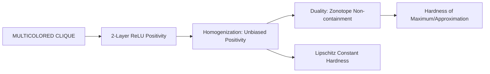

# Parameterized Hardness of Zonotope Containment and Neural Network Verification

**Conference**: ICLR 2026  
**OpenReview**: [https://openreview.net/forum?id=y8N45EEW05](https://openreview.net/forum?id=y8N45EEW05)  
**Code**: None (Theoretical paper)  
**Area**: Learning Theory / Computational Complexity / Neural Network Verification  
**Keywords**: Parameterized Complexity, W[1]-hard, ReLU Network Verification, Zonotope Containment, Lipschitz Constant, Exponential Time Hypothesis

## TL;DR
This paper proves that a series of verification-related problems, including the positivity/surjectivity of 2-layer ReLU networks, zonotope non-containment, and Lipschitz constant computation, are all W[1]-hard when the input dimension $d$ is taken as the parameter. This rules out fixed-parameter tractability under the Exponential Time Hypothesis (ETH) and demonstrates that naive "linear region enumeration" algorithms are essentially optimal in their dependence on $d$.

## Background & Motivation

**Background**: Neural networks with ReLU activations are increasingly used in safety-critical scenarios (autonomous driving, control). Consequently, "verification"—determining whether the network output necessarily falls within a target set $Y$ given an input set $X$—has become a core task. Several classic problems (network verification, Lipschitz constant estimation, zonotope containment) have long been proven to be (co)NP-hard.

**Limitations of Prior Work**: NP-hardness only indicates that problems are difficult in the worst case. It does not answer a more refined question: since input data in practice is often assumed to lie on a low-dimensional manifold, do these problems become solvable (i.e., Fixed-Parameter Tractable, FPT) when the **input dimension $d$ is small**? This is the focus of parameterized complexity. It is known that checking "injectivity" for 2-layer ReLU networks can be done in $(d+1)^d \cdot n^{O(1)}$ time (FPT w.r.t. $d$), which gave hope that low-dimensional cases might be tractable.

**Key Challenge**: However, the parameterized complexity of network "positivity/surjectivity" and Lipschitz constants was left as an open problem by Froese et al. at COLT '25—whether they are FPT like injectivity or essentially explode exponentially with $d$ remained unknown. If the latter is true, the intuition that the "low-dimensional hypothesis can save the day" would be invalid.

**Goal**: To clarify the parameterized complexity of this family of problems with respect to the parameter $d$, answer the open questions by Froese et al., and provide lower bounds on running time under ETH.

**Key Insight**: All these problems can be solved in $n^{O(d)} \cdot \mathrm{poly}(N)$ time using "brute-force" methods (e.g., enumerating zonotope vertices or network linear regions), placing them in the complexity class XP. The authors' task is to provide a reduction where the **input dimension grows linearly with the clique size**, thereby proving they are W[1]-hard.

**Core Idea**: Construct a 2-layer ReLU network from a MULTICOLORED CLIQUE instance such that the input dimension equals the number of colors $k$ (plus 1), making the existence of a $k$-clique equivalent to the network achieving a positive output. Then, using "homogenization" to remove biases and the "ReLU network $\leftrightarrow$ zonotope" duality, propagate this hardness result across the entire family of problems.

## Method

### Overall Architecture

This is a pure computational complexity paper. Rather than a "method pipeline," its "method" is a **parameterized reduction chain**: starting from the W[1]-hard MULTICOLORED CLIQUE, a single reduction path connects the entire family of verification problems. The overall logic is:

The input is a MULTICOLORED CLIQUE instance (graph $G=(V=V_1 \dot\cup \cdots \dot\cup V_k, E)$). The output is a 2-layer ReLU network $f:\mathbb{R}^{k} \to \mathbb{R}$ whose maximum value satisfies:

$$\max_{x \in \mathbb{R}^k} f(x) = k + \binom{k}{2} \iff G \text{ contains a } k\text{-clique},$$

otherwise $\max f \le k + \binom{k}{2} - 1$. Since the input dimension $d = k$ (or $k+1$ after homogenization) grows only **linearly** with the clique size, the W[1]-hardness and ETH lower bounds of CLIQUE are transferred to the network problems.

### Key Designs

**1. Dimension-Controlled MULTICOLORED CLIQUE Reduction: Encoding Cliques via Spike and Penalty Functions**

Standard NP-hardness reductions allow the input dimension to grow indefinitely. To prove W[1]-hardness, the parameter of the reduced instance (here $d$) must be bounded by a function of the source parameter (clique size $k$). Each input coordinate $x_c$ is assigned to a color $c$, making $d=k$. Unique labels $\omega_{c,i} \in \mathbb{N}$ are assigned to nodes, and Sidon sets ensure edge labels $\omega_{r,i,l,j} := \omega_{r,i} + \omega_{l,i}$ are unique. Two sets of piecewise linear functions are constructed: **spike functions** $s_{r,l}$ for edges (peaking at edge labels) and **penalty functions** $p_c$ for nodes (peaking at node labels). Summing them creates a function where $f$ approaches the upper bound only if all penalties and spikes are positive simultaneously, which corresponds exactly to a $k$-clique.

**2. Homogenization: Converting Biased Hardness to Unbiased Networks**

The initial reduction relies on biases. However, downstream results (especially zonotope duality) only hold for **positive-homogeneous**, unbiased networks. The authors introduce **homogenization** (Definition 4.1): an extra input $y$ is added, biases $b$ in the first layer are replaced by $y \cdot b$, and output biases are replaced by $|y| \cdot b$. This yields an unbiased network that recovers the original function at the $y=1$ slice. This proves that "surjectivity" of 2-layer ReLU networks is also W[1]-hard, as surjectivity for positive-homogeneous functions is equivalent to the existence of a positive output point (given the existence of negative points).

**3. ReLU Network and Zonotope Duality: Transferring Hardness to Zonotope Non-containment**

There is a duality between positive-homogeneous convex CPWL functions $\mathbb{R}^d \to \mathbb{R}$ and polytopes in $\mathbb{R}^d$. An unbiased 2-layer network $g(x)$ can be decomposed into two zonotopes $Z_+$ and $Z_-$. The condition $Z_+ \subseteq Z_-$ holds if and only if $g \le 0$ everywhere. Thus, **2-layer ReLU positivity $\iff$ zonotope non-containment**. This proves that ZONOTOPE NON-CONTAINMENT is W[1]-hard w.r.t. $d$, implying that $O(n^{d-1} \cdot \mathrm{poly}(N))$ algorithms are essentially optimal.

**4. Lipschitz Hardness and Positive Results: Scaling and ICNNs**

The authors prove $L_p(f) = \max_{\|x\|_p \le 1} |f(x)|$ for positive-homogeneous functions. By scaling coordinates, the maximum value hardness is transferred to the Lipschitz constant. Thus, **2-layer ReLU $L_p$-Lipschitz computation is both NP-hard and W[1]-hard** for all $p \in (0, \infty]$. For **Input Convex Neural Networks (ICNNs)**, the authors provide a "positive" exit: the $L_1$-Lipschitz constant is computable in polynomial time, and the $L_\infty$-Lipschitz constant is FPT in $O(2^d \, \mathrm{poly}(N))$. They also provide a randomized FPT-approximation for zonotope norm-maximization using subspace embeddings.

## Key Experimental Results

### Main Results

| Problem (Parameter $d = $ input dim) | Conclusion (Ours) | Brute-force Complexity | ETH Lower Bound |
|:---|:---|:---|:---|
| 2-layer ReLU Positivity (=Surjectivity) | W[1]-hard (even unbiased) | $O(n^{d} \cdot \mathrm{poly}(N))$ | No $\rho(d)N^{o(d)}$ |
| Approx. 2-layer ReLU Max (any factor) | W[1]-hard | $O(n^{d} \cdot \mathrm{poly}(N))$ | No $\rho(d)N^{o(d)}$ |
| Zero-check for 3-layer ReLU | W[1]-hard | $O(n^{2d} \cdot \mathrm{poly}(N))$ | No $\rho(d)N^{o(d)}$ |
| Zonotope Non-Containment | W[1]-hard | $O(n^{d-1} \cdot \mathrm{poly}(N))$ | No $\rho(d)N^{o(d)}$ |
| 2-layer $L_p$-Lipschitz, $p \in (0, \infty]$ | NP-hard + W[1]-hard | $O(n^{d} \cdot \mathrm{poly}(N))$ | No $\rho(d)N^{o(d)}$ |
| Approx. 3-layer $L_p$-Lipschitz | W[1]-hard | $O(n^{2d} \cdot \mathrm{poly}(N))$ | No $\rho(d)N^{o(d)}$ |

### Key Findings
- **Linear Dimension Control is Essential**: The proof requires $d$ to be strictly linear w.r.t. $k$ to establish W[1]-hardness rather than just NP-hardness.
- **Homogenization is the Key Toggle**: Removing biases is a technical requirement for zonotope duality and Lipschitz scaling; without it, hardness cannot be propagated.
- **Hardness Persists with Sparse Weights**: The construction uses only a constant number of neurons with polynomially bounded weights, warning that weight sparsity alone cannot bypass the hardness.
- **2-layer vs. 3-layer Gap**: Checking if a network is identically zero is polynomial for 2 layers but W[1]-hard for 3 layers.

## Highlights & Insights
- The **spike/penalty construction** allows a perfect geometric match between the combinatorial goal (clique) and the network's maximum value.
- **Homogenization** serves as a clever tool to lift affine constructions into the homogeneous/dual world for free.
- The **duality** links machine learning verification, computational geometry, and robotics under a single W[1]-hardness result.
- The **tractability boundaries** provide practical guidance: since general cases are hard, one must use restricted architectures like ICNNs or heuristics that limit the number of linear regions.

## Limitations & Future Work
- The results are **worst-case**: practical networks might not trigger these instances, and the constants in the exponent might be improvable.
- Solvability relies on strong structural assumptions (e.g., ICNNs); it is unclear which natural architectures satisfy these.
- Open questions remain: whether zonotope norm-maximization for $p \in (1, \infty)$ is FPT, the complexity of $L_0$ for 2-layer ReLU, and whether 2-layer positivity is in W[1].

## Related Work & Insights
- **vs. Froese et al. (COLT '25)**: They established NP-hardness for positivity and an FPT algorithm for injectivity; this paper answers their open question by proving positivity is W[1]-hard.
- **vs. Virmaux & Scaman (2018)**: They proved NP-hardness for 2-layer $L_2$-Lipschitz; this paper generalizes this to all $p$ and strengthens it to W[1]-hardness.
- **vs. Shenmaier (2018)**: This paper generalizes zonotope norm-maximization results and proves W[1]-hardness for general cases.

## Rating
- Novelty: ⭐⭐⭐⭐⭐ (Solves COLT '25 open problems and provides the strongest hardness results in the field.)
- Experimental Thoroughness: ⭐⭐⭐⭐⭐ (Pure theory paper; the reduction chain is complete and exhaustive.)
- Writing Quality: ⭐⭐⭐⭐ (Clear structure, though highly dense and requiring complexity background.)
- Value: ⭐⭐⭐⭐⭐ (Impacts verification, geometry, and robotics; provides theoretical justification for heuristics.)

<!-- RELATED:START -->

## Related Papers

- [\[ICLR 2026\] Tractability via Low Dimensionality: The Parameterized Complexity of Training Quantized Neural Networks](tractability_via_low_dimensionality_the_parameterized_complexity_of_training_qua.md)
- [\[ICLR 2026\] Training-Free Determination of Network Width via Neural Tangent Kernel](training-free_determination_of_network_width_via_neural_tangent_kernel.md)
- [\[ICLR 2026\] Quantum Machine Learning Advantages Beyond Hardness of Evaluation](quantum_machine_learning_advantages_beyond_hardness_of_evaluation.md)
- [\[ICLR 2026\] Subquadratic Algorithms and Hardness for Attention with Any Temperature](subquadratic_algorithms_and_hardness_for_attention_with_any_temperature.md)
- [\[ICLR 2026\] DeepWeightFlow: Re-Basined Flow Matching for Generating Neural Network Weights](deepweightflow_re-basined_flow_matching_for_generating_neural_network_weights.md)

<!-- RELATED:END -->
## Related Papers

- [\[ICLR 2026\] Training-Free Determination of Network Width via Neural Tangent Kernel](training-free_determination_of_network_width_via_neural_tangent_kernel.md)
- [\[ICLR 2026\] Tractability via Low Dimensionality: The Parameterized Complexity of Training Quantized Neural Networks](tractability_via_low_dimensionality_the_parameterized_complexity_of_training_qua.md)
- [\[ICLR 2026\] DeepWeightFlow: Re-Basined Flow Matching for Generating Neural Network Weights](deepweightflow_re-basined_flow_matching_for_generating_neural_network_weights.md)
- [\[ICLR 2026\] Subquadratic Algorithms and Hardness for Attention with Any Temperature](subquadratic_algorithms_and_hardness_for_attention_with_any_temperature.md)
- [\[ICLR 2026\] Toward Practical Equilibrium Propagation: Brain-Inspired Recurrent Neural Network with Feedback Regulation and Residual Connections](toward_practical_equilibrium_propagation_brain-inspired_recurrent_neural_network.md)

<!-- RELATED:END -->
