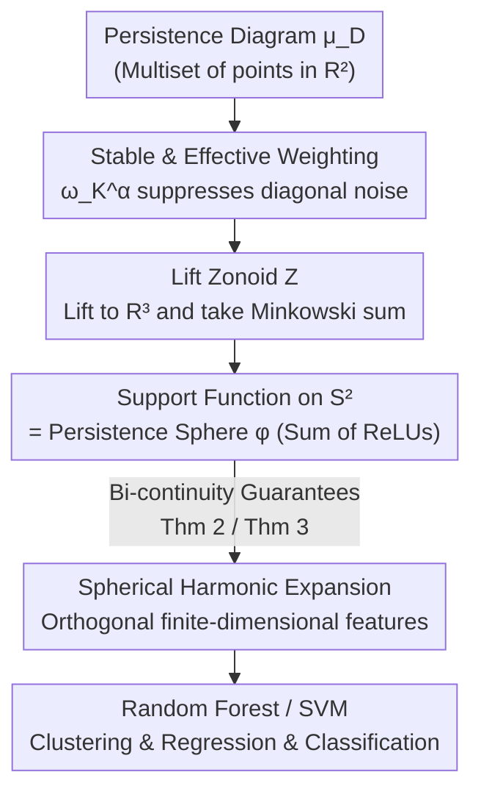

# Persistence Spheres: Bi-Continuous Representations of Persistence Diagrams

**Conference**: ICLR 2026  
**OpenReview**: [https://openreview.net/forum?id=eITU6vjnIa](https://openreview.net/forum?id=eITU6vjnIa)  
**Area**: Learning Theory / Topological Data Analysis  
**Keywords**: Persistent Homology, Persistence Diagrams, Vectorized Representation, Bi-continuity, 1-Wasserstein Stability

## TL;DR
This paper proposes **Persistence Spheres (PS)**: by constructing a "lift zonoid" from a weighted persistence diagram and taking its support function on the unit sphere $S^2$, a functional representation is obtained that is **Lipschitz continuous** with respect to the 1-Wasserstein distance and possesses a **continuous inverse** on its image. This "bi-continuity" is extremely rare in persistence diagram vectorization methods. Experimentally, it matches or outperforms baselines like persistence images, landscapes, and sliced Wasserstein kernels in clustering, regression, and classification tasks.

## Background & Motivation

**Background**: Topological Data Analysis (TDA) uses persistent homology to characterize the "shape" of data—recording the scales at which topological features like connected components, loops, and voids appear (birth) and disappear (death). The results are compressed into a **persistence diagram (PD)**, a multiset of points in the plane $\mathbb{R}^2_{x<y}$. To integrate PDs into downstream machine learning, the standard approach is to **vectorize** the PD into vectors or functions in a linear space, which are then fed into classical models like Random Forests or SVMs. Representative methods include persistence images (PI), persistence landscapes (PL), persistence splines (PSpl), and sliced Wasserstein kernels (SWK).

**Limitations of Prior Work**: The natural metric between PDs is the 1-Wasserstein distance $W_1$ based on partial optimal transport, which induces a highly **nonlinear** geometry on the PD space—even calculating an "average" requires computing a Wasserstein barycenter, which is computationally expensive and may not yield a unique solution. Most existing vectorization methods only guarantee **forward stability** (similar PDs → similar vectors), but **not the inverse**: similar representation vectors do not necessarily imply similar PDs. That is, most embeddings lose "inverse continuity," and similarity in the feature space cannot be translated back to similarity at the diagram level.

**Key Challenge**: It is theoretically known (Carrière & Bauer, 2019) that a **bi-Lipschitz** embedding of the Wasserstein space into a general Hilbert space is impossible. Thus, researchers typically settle for one-way stability. Previous works offering stronger guarantees (e.g., Bate & Garcia Pulido, 2024) often restrict PDs to a maximum of $n$ points.

**Goal**: Construct a functional representation that holds for any PD without restricting the number of points, while achieving the "bi-continuity" property of **forward Lipschitz continuity + inverse continuity**.

**Key Insight**: The authors leverage tools from convex geometry: **lift zonoids** and **support functions**. The support function operator $A\mapsto h_A$ is injective and linear, and there exists an isometric relationship between the support function and the Hausdorff distance: $\max_{v\in S^2}|h_A(v)-h_B(v)|=d_H(A,B)$. This isometric bridge allows the transport geometry of PDs to be translated into controllable distances in a function space.

**Core Idea**: Map a weighted PD to its lift zonoid (a convex polytope) and use the support function of this convex body on $S^2$ as the representation; if the weight function is chosen to be both "stable and effective," both forward Lipschitz and inverse continuity can be proven.

## Method

### Overall Architecture
Persistence Spheres transform a "persistence diagram" step-by-step into a "scalar function $\varphi:S^2\to\mathbb{R}$ on the sphere $S^2$," which is then expanded into a feature vector for classifiers. The construction chain is: **Weight** each point of the PD by its distance to the diagonal (points closer to the diagonal $\Delta$ are weighted towards 0 as they represent noise) → **Lift** the weighted discrete measure to $\mathbb{R}^3$ to construct a **lift zonoid** (each point corresponds to a segment from the origin to $(1,p)$, taking the Minkowski sum of all segments) → Take the **support function restricted to $S^2$** as the Persistence Sphere → Use **spherical harmonic expansion** to discretize the spherical function into finite-dimensional orthogonal features.

The key mathematical advantage is that the linearity of the support function and its isometry with the Hausdorff distance allow the $W_1$ distance between PDs to be bounded by the $L^p$ distance between Persistence Spheres, ensuring forward stability (Theorem 2) and inverse continuity (Theorem 3).

### Key Designs

**1. Lift Zonoids + Support Functions: Transforming PDs into a Sum of ReLUs on the Sphere**

To translate "diagram-level similarity" into "function-level similarity," the authors do not apply kernels or pixelation directly. Instead, they lift the PD to $\mathbb{R}^3$ to form a convex body. For a discrete measure $\mu=\sum_i a_i\delta_{p_i}$ ($p_i\in\mathbb{R}^2$), its lift zonoid is defined as the Minkowski sum $Z_\mu=\bigoplus_i a_i[0,(1,p_i)]$, where each point $p$ is lifted to a segment from the origin to $(1,p)\in\mathbb{R}^3$. This construction is **linear**: $\lambda_1\mu_1+\lambda_2\mu_2\mapsto\lambda_1 Z_{\mu_1}\oplus\lambda_2 Z_{\mu_2}$. The support function $h_{Z_\mu}(x)=\max_{a\in Z_\mu}\langle x,a\rangle$ restricted to $S^2$ is the Persistence Sphere. Since the support function of a single segment $[0,(1,p)]$ is exactly $v\mapsto\mathrm{ReLU}(\langle v,(1,p)\rangle)$, the Persistence Sphere for a whole PD has a clean explicit formula:

$$\varphi^\omega_{\mu_D}(v)=h_{Z_{\mu^\omega_D}}(v)=\sum_{p\in D}\omega(p)\,a_p\,\mathrm{ReLU}(\langle v,(1,p)\rangle).$$

It is essentially the output of a single-hidden-layer ReLU network on the sphere, where PD points are neurons, $(1,p)$ are weights, and $\omega(p)a_p$ are coefficients. This path was chosen because the support function operator $A\mapsto h_A$ is **both linear and injective**, and satisfies $\max_{v\in S^2}|h_A(v)-h_B(v)|=d_H(A,B)$, which serves as the anchor for all subsequent continuity theorems.

**2. Stable and Effective Weighting $\omega_K^\alpha$: Suppressing Diagonal Noise without Breaking Continuity**

Simply adopting the prior weighting $\omega(p)=y-x$ (Gotovac Dogaš & Mandarić, 2025) is problematic: Remark 2 provides a counterexample where for $D_n=\{(n^2,n^2+\tfrac1n)\}$, $W_1(D_n,\varnothing)=\tfrac1n\to0$, but the Hausdorff distance of the zonoids $d_H\ge\tfrac{\sqrt2}{n}n^2\to\infty$, making the forward mapping **unstable**. The root cause is that this weight grows too fast far from the origin. This paper establishes two technical constraints (Definition 12 "Stable Weighting" + Definition 13 "Effective Weighting"): stable weighting requires $\Gamma_\omega(p):=\omega(p)(1,p)$ to be $C$-Lipschitz and satisfy $\|\Gamma_\omega(p)\|_2\le C'\|p-\Delta\|_\infty$; effective weighting controls weight decay at infinity to ensure no loss of persistence mass. The preferred weight function is:

$$\omega_K^\alpha(p)=\frac{2}{\pi}\arctan\!\Big(\frac{\lambda(p)^\alpha}{K^\alpha}\Big),\qquad \lambda(p)=\frac{y-x}{2\,\|(1,p)\|_2},$$

which is a stable weight for all $K>0, \alpha\ge1$, and an effective weight when $\alpha=1$. The parameters have clear physical meanings: $\lambda(p)$ measures the relative height to the diagonal, $K$ acts as a noise threshold, and $\alpha$ controls decay steepness (Appendix B). This design is the toggle for the theory—without proper weighting, neither of the following theorems holds.

**3. Bi-continuity Theorems: Forward Lipschitz + Inverse Continuity**

This is the theoretical core. Forward (Theorem 2): For a stable weight $\omega$,

$$d_H(Z_{\mu^\omega_D},Z_{\mu^\omega_{D'}})\le \sqrt2\,\max\{C,C'\}\,W_1(\mu_D,\mu_{D'}),$$

meaning as PDs get closer, their zonoids (and thus Persistence Spheres) get closer—ensuring **stability**. Inverse (Theorem 3): For an effective weight, if $d_H(Z_{\mu^\omega_{D_n}},Z_{\mu^\omega_D})\to0$, then $W_1(\mu_{D_n},\mu_D)\to0$—ensuring **geometric fidelity**. Using Proposition 1's isometry, this yields Corollary 1: there exists a constant $C_p$ such that $\|\varphi^\omega_{\mu_D}-\varphi^\omega_{\mu_{D'}}\|_p\le C_p W_1(\mu_D,\mu_{D'})$, and if $\|\varphi^\omega_{\mu_D}-\varphi^\omega_{\mu_{D_n}}\|_\infty\to0$, then $W_1(\mu_{D_n},\mu_D)\to0$. This "bi-continuity" binds the Wasserstein geometry to the functional representation.

**4. Spherical Harmonics: Finite-Dimensional Orthogonal Features**

Persistence Spheres are continuous functions on $S^2$. To use them with Random Forests/SVMs, they must be discretized. The authors use **spherical harmonic expansion** (implemented via pyshtools). By sampling on a Driscoll–Healy grid with $2N_\theta$ latitudinal and $4N_\theta$ longitudinal nodes, they obtain **orthogonal** feature vectors of dimension approximately $N_\theta^2/2$. Unlike PI or PL, the domain $S^2$ is fixed and compact, avoiding train/test information leakage and simplifying hyperparameter tuning.

### Loss & Training
The approach is a representation method rather than an end-to-end model. Persistence Spheres act as feature extractors for PS/PI/PSpl/PL combined with Random Forests (estimators $\in\{100,200\}$) or SVMs for SWK (regularization $C$ grid search). Hyperparameters for PS are weighting parameters $K\in\{0,10^{-4},\dots,0.5\}$, $\alpha\in\{1,3,5\}$, and grid resolution $2N_\theta\in\{30,\dots,70\}$, selected via 3-fold cross-validation.

## Key Experimental Results

### Main Results
Performance was compared across 12 cases in clustering (FDA simulation, Rand Index, 200 repetitions), regression ($R^2$), and classification (Accuracy), covering functional data, time series, graphs, meshes, and point clouds.

| Task | Dataset | PS (Ours) | PI | PL | PSpl | SWK |
|------|--------|-----------|----|----|------|-----|
| Clustering | FDA σ=10 | **0.845** | 0.786 | 0.753 | 0.556 | 0.762 |
| Clustering | FDA σ=15 | **0.806** | 0.730 | 0.676 | 0.538 | 0.696 |
| Clustering | FDA σ=30 | **0.688** | 0.621 | 0.542 | 0.518 | 0.578 |
| Regression| Eyeglasses | 0.966† | 0.922 | 0.955† | **0.971†** | 0.971† |
| Regression| Tecator | **0.969†** | 0.900 | 0.954† | 0.970† | 0.953 |
| Classification| Growth | **0.850†** | 0.743† | 0.768 | 0.807† | 0.768 |
| Classification| NOx | **0.869†** | 0.780 | 0.789 | 0.823† | 0.840† |
| Classification| DYN SYS | 0.829† | 0.419 | **0.840†** | 0.829† | 0.828† |
| Classification| Human Poses | **0.640†** | 0.530† | 0.405 | 0.510 | 0.345 |
| Classification| McGill 3D | 0.544† | 0.461 | **0.678†** | 0.561† | 0.567† |

(† indicates 95% confidence interval overlaps with the best method; bold indicates row best. SWK is not applicable to unsupervised rows.)

### Ablation Study

| Configuration | Phenomenon | Conclusion |
|------|------|------|
| Stable + Effective $\omega_K^\alpha$ | Both stability & inverse continuity hold | Default; best performance |
| $\omega(p)=y-x$ (Prior) | $W_1\to0$ but $d_H\to\infty$ in counterexample | Unstable; lower performance (App. E) |
| Fidelity Simulation (App. B.2) | PS and SW show highest fidelity to $W_1$ | Validates bi-continuity value |

### Key Findings
- PS excels in **unsupervised clustering** (rank 1 in all three FDA noise levels), confirming that geometric fidelity via "inverse continuity" is critical when no labels are available.
- PSpl is strong in supervised tasks but lags in unsupervised scenarios, suggesting supervised performance does not always correlate with geometric fidelity.
- PI performance is hindered by hard-to-choose parameter ranges and slow Random Forest training.
- On McGill 3D Shapes, PS and PI exhibited high variance; decreasing dimensionality ($2N_\theta=14$) mitigated this.

## Highlights & Insights
- **Support Function as a Bridge**: The isometry $\max_{S^2}|h_A-h_B|=d_H(A,B)$ equates the Hausdorff distance of convex bodies to the $L^\infty$ distance of functions.
- **PS as a Single-Hidden-Layer ReLU Network**: The explicit formula $\sum_p\omega(p)a_p\,\mathrm{ReLU}(\langle v,(1,p)\rangle)$ makes PS naturally compatible with differentiable topology layers and suggests PDs can be recovered from spherical scalar fields using ReLU network optimization.
- **Counterexample-Driven Design**: Remark 2 identifies why the naive weight $y-x$ is unstable, leading to the axioms for stable/effective weighting.

## Limitations & Future Work
- Bi-continuity is **qualitative/asymptotic**: The inverse guarantee implies "convergence implies convergence" without a quantitative Lipschitz modulus.
- Dimension depends on spherical harmonic grid resolution; high-fidelity requires large $N_\theta$, which can be problematic for small/high-variance datasets like McGill 3D.
- Construction is restricted to $S^2$ (planar PDs lifted to $\mathbb{R}^3$); extending to bi-parameter persistence requires signed measures.
- Only tested with Random Forests/SVMs; the benefit of PS as a differentiable loss or topology layer in end-to-end deep networks remains to be explored.

## Related Work & Insights
- **vs Persistence Image/Landscape**: These functional vectorizations only guarantee forward stability and require data-wide support selection (potential leakage). PS has a fixed domain $S^2$ and inverse continuity.
- **vs Gotovac Dogaš & Mandarić (2025)**: This work builds on their framework but corrects the instability of the $\omega=y-x$ weight.
- **vs Bate & Garcia Pulido (2024)**: While those methods require a point limit to achieve strong guarantees, PS holds for an **arbitrary number of points**.
- **vs Sliced Wasserstein Kernel**: SWK has high fidelity to $W_1$ but lacks an explicit inverse; PS provides an explicit, invertible construction with comparable fidelity.

## Rating
- Novelty: ⭐⭐⭐⭐⭐ First function-based representation achieving bi-continuity for $W_1$ without point number restrictions.
- Experimental Thoroughness: ⭐⭐⭐⭐ Covers various tasks and 5 baselines, though end-to-end topology layer validation is missing.
- Writing Quality: ⭐⭐⭐⭐ Rigorous math and clear counterexample-driven logic, though it requires background in convex geometry.
- Value: ⭐⭐⭐⭐ Bi-continuity paves the way for differentiable losses and diagram recovery.

<!-- RELATED:START -->

## Related Papers

- [\[ICLR 2026\] Bi-Criteria Metric Distortion](bi-criteria_metric_distortion.md)
- [\[ICLR 2026\] Bi-Lipschitz Autoencoder With Injectivity Guarantee](bi-lipschitz_autoencoder_with_injectivity_guarantee.md)
- [\[ICLR 2026\] Discounted Online Convex Optimization: Uniform Regret Across a Continuous Interval](discounted_online_convex_optimization_uniform_regret_across_a_continuous_interva.md)
- [\[ICML 2026\] Finite-Width Neural Tangent Kernels from Feynman Diagrams](../../ICML2026/learning_theory/finite-width_neural_tangent_kernels_from_feynman_diagrams.md)
- [\[ICLR 2026\] FACT: a first-principles alternative to the Neural Feature Ansatz for how networks learn representations](fact_a_first-principles_alternative_to_the_neural_feature_ansatz_for_how_network.md)

<!-- RELATED:END -->
