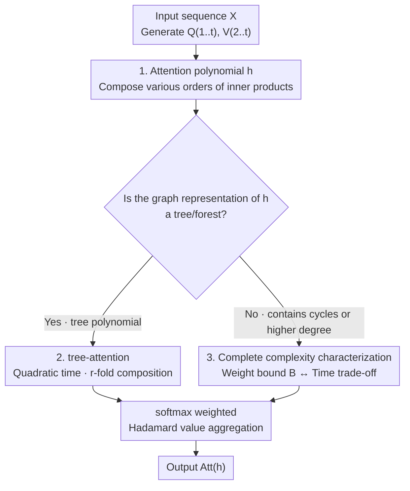

# Poly-attention: a general scheme for higher-order self-attention

**Conference**: ICLR 2026  
**OpenReview**: [https://openreview.net/forum?id=amivrmQyvQ](https://openreview.net/forum?id=amivrmQyvQ)  
**Code**: TBD  
**Area**: Learning Theory / Attention Mechanisms / Computational Complexity  
**Keywords**: Higher-order attention, Function composition, Fine-grained complexity, Expressivity, tree-attention

## TL;DR
This paper proposes poly-attention—a class of higher-order self-attention mechanisms unified by an "attention polynomial" $h$ (where self-attention, tensor attention, and Strassen attention are special cases). It provides tight characterizations of the time complexity for exact/approximate computation and the expressivity of each mechanism. Consequently, it identifies a new mechanism, tree-attention, which performs arbitrary $r$-fold function composition in quadratic time, whereas all previous mechanisms capable of composition required super-quadratic time.

## Background & Motivation
**Background**: The core of the Transformer is self-attention, which captures **pairwise correlations** between tokens via $\mathrm{Att}_i=\frac{\sum_j \exp(\frac1d\langle Q_i,K_j\rangle)V_j}{\sum_j \exp(\frac1d\langle Q_i,K_j\rangle)}$. It can be computed exactly in $n^{2+o(1)}$ time and approximated entry-wise in near-linear time $n^{1+o(1)}$ when weights are bounded.

**Limitations of Prior Work**: Numerous theoretical and experimental studies demonstrate that self-attention is **structurally unable** to complete tasks requiring ternary or higher correlations—such as Match3 (identifying three related tokens), Parity, Dyck-1, and **function composition** (e.g., "Sam lives in Toronto, Toronto is in Canada, where is Sam?", which requires chaining "Person→City" and "City→Country" mappings). Peng et al. proved that a single-layer single-head self-attention cannot even perform 2-fold composition and may require nearly $n$ heads.

**Key Challenge**: To enhance expressivity, two existing paths exist—3-tensor attention (lifting the inner product to a triple product $\langle a,b,c\rangle=\sum_\ell a[\ell]b[\ell]c[\ell]$) and Strassen attention (using the sum of three pairwise inner products). Both can perform 2-fold composition but at the **cost of super-quadratic time**: tensor attention requires $n^{3+o(1)}$, and Strassen attention requires $n^{\omega+o(1)}$ ($\omega\le 2.37$, often degrading to $\approx 2.81$ or $3$ in practice), even with fast matrix multiplication. Neither can perform 3-fold composition. Thus, a fundamental "expressivity ↔ runtime" trade-off exists, and prior mechanisms were studied in isolation without a unified perspective.

**Goal**: (1) Provide a unified framework encompassing all these mechanisms; (2) Systematically characterize the exact/approximate complexity and solvable tasks within the framework; (3) Identify a "best of both worlds" mechanism on the trade-off curve.

**Key Insight**: Abstract an attention score as the evaluation of an **attention polynomial** $h(x_1,\dots,x_t)$, where each monomial corresponds to a higher-order inner product of vectors. The "graph structure" of $h$ directly determines the mechanism's complexity. Searching this unified space reveals that if the graph of $h$ is a **tree or forest**, the corresponding tree-attention can perform arbitrary-order function composition in quadratic time.

## Method

### Overall Architecture
Poly-attention replaces the self-attention scoring term $\langle Q_i,K_j\rangle$ with the evaluation result of a user-specified **attention polynomial** $h(x_1,\dots,x_t)$. Given input $X\in\mathbb R^{n\times d}$, weight matrices generate $t$ query-key matrices $Q^{(1)},\dots,Q^{(t)}$ and $t-1$ value matrices $V^{(2)},\dots,V^{(t)}$. The $\ell_1$-th row of the output matrix is a weighted aggregation over the remaining $t-1$ indices $\ell_2,\dots,\ell_t$:

$$\mathrm{Att}^{(h)}_{\ell_1}=\frac{\sum_{\ell_2,\dots,\ell_t\in[n]}\exp\!\big(\tfrac1d\,h(Q^{(1)}_{\ell_1},\dots,Q^{(t)}_{\ell_t})\big)\;V^{(2)}_{\ell_2}\odot\cdots\odot V^{(t)}_{\ell_t}}{\sum_{\ell_2,\dots,\ell_t\in[n]}\exp\!\big(\tfrac1d\,h(Q^{(1)}_{\ell_1},\dots,Q^{(t)}_{\ell_t})\big)}$$

where $\odot$ denotes the element-wise (Hadamard) product. A mechanism is completely determined by $h$. Thus, the logic of the paper is: **Select $h$ → Check if the graph representation of $h$ is a tree → Determine exact/approximate complexity and solvable tasks from the graph structure**. This main thread places isolated mechanisms onto a single map and points to tree-attention as the optimal compromise.

> The proof techniques for expressivity and runtime lower bounds (Design 4) serve as the theoretical foundation for the branch decisions in the diagram above, spanning both tree and non-tree paths; they are not a stage in the pipeline itself.

### Key Designs

**1. Attention Polynomial and Poly-attention Unified Framework: Parameterizing "higher-order attention" as a polynomial**

The challenge was that self-attention, tensor attention, and Strassen attention were previously defined and analyzed separately. This paper unifies them using an **attention polynomial** $h(x_1,\dots,x_t)$: $h$ must be multi-linear, with coefficients in $\{0,1\}$, and each monomial's degree between $2$ and $k$. Each monomial $x_{j_1}\cdots x_{j_k}$ translates to a $k$-th order inner product $\langle Y_{j_1},\dots,Y_{j_k}\rangle$, and $h$ is the sum of these products. Three existing mechanisms are special cases (Lemma 2.3): self-attention is $h(x_1,x_2)=x_1x_2$; $t$-tensor attention is $h=x_1x_2\cdots x_t$; Strassen attention is $h(x_1,x_2,x_3)=x_1x_2+x_2x_3+x_3x_1$. The value of this abstraction is that two structural properties of $h$—the **degree $k$** (highest inner product order) and the **graph representation** (variables as vertices, monomials $x_ix_j$ as edges, defined only for degree-2 terms)—become "knobs" for reading complexity and expressivity.

**2. tree-attention: Arbitrary $r$-fold function composition in quadratic time**

This is the central result. Existing mechanisms capable of function composition (Tensor, Strassen) require super-quadratic time and are limited to 2-fold composition. The paper first uses a minimal polynomial $h_2(x_1,x_2,x_3)=x_1x_2+x_2x_3$ as a benchmark—it can simulate 2-fold composition with a single head, and $\mathrm{Att}^{(h_2)}$ can be calculated exactly in $O(n^2)$ time (Theorem 3.1). By taking a path polynomial $h_r=x_1x_2+x_2x_3+\cdots+x_rx_{r+1}$, poly-attention can simulate $r$-fold composition, requiring only $O(r^3 n^2)$ for exact calculation (Theorem 3.4). More generally, the authors characterize that **all poly-attentions capable of exact quadratic-time calculation are precisely tree-attentions**: when $h$ is a degree-2 polynomial and its graph representation is a tree or forest (termed a tree polynomial), $\mathrm{Att}^{(h)}$ can be calculated exactly in $n^{2+o(1)}$; the approximation bound $B=o(\sqrt{\log n})$ is identical to self-attention (Theorem 3.5). A tree of depth $q$ can perform $(q-1)$-fold composition. In contrast, self-attention cannot perform 2-fold, and Tensor/Strassen cannot perform 3-fold, while tree-attention handles arbitrary $r$ for the **same cost as self-attention**—this is why the authors claim it is "best of all worlds," and its algorithm relies on standard matrix multiplication without impractical constants $\omega$.

**3. Complete Complexity Characterization: A tight trade-off between expressivity, weight bound $B$, and runtime**

For **non-tree** polynomials (degree $>2$ or cyclic graphs), the paper proves that their poly-attention necessarily requires super-quadratic time but still provides tight approximate characterizations (Theorem 3.6): if the query-key matrix entry bound $B=o((\log n)^{1/k})$, then an entry-wise $1/\mathrm{poly}(n)$ approximation can be calculated in near-linear time; if $B=\Omega((\log n)^{1/k})$, super-quadratic time is required under standard complexity assumptions. This generalizes the isolated findings of Alman & Song for self-attention/tensor attention to **any** attention polynomial. Key improvement: the approximation bound is tightened from the intuitive $o((\log n)^{1/t})$ to $o((\log n)^{1/k})$—a significant relaxation when the number of variables $t$ is much larger than the degree $k$ (e.g., $t=20, k=2$ for tree-attention). The intuitive conclusion: **the higher the expressivity ($h$ degree/order, task complexity), the smaller the weight bound $B$ must be to achieve fast approximation**.

**4. Expressivity and Lower Bound Proof Techniques: Root-finding capability + communication / fine-grained complexity bounds**

To make the complexity characterization "tight," corresponding lower bounds are required. For expressivity, a generalization of the "sum-of-squares" approach by Kozachinskiy et al. is used: design a test polynomial $c$ that is $0$ at correct outputs and large elsewhere, allowing softmax to select $0$. The difficulty lies in expressing $c$ using existing monomials in $h$. The paper also defines a generalization of Match3 called **polynomial root-finding** (finding $y_1,\dots,y_t$ such that $p=0$ for a polynomial $p$ over set $S$) and proves that for any $p$, there exists $h$ such that a 2-layer poly-attention can find the solution (Theorem 3.7). For lower bounds: expressivity lower bounds use communication complexity, reducing function composition to myopic pointer jumping (known to require large communication), proving Strassen/Tensor attention requires $H>n^{1-o(1)}$ heads for 3-fold composition (Theorem 3.3). Runtime lower bounds use fine-grained complexity—utilizing the **Max-2SAT conjecture** for Strassen attention via a distributed PCP framework to prove that faster algorithms are unlikely.

### Loss & Training
This is a theoretical work; no new loss functions are proposed. In experiments, all models (tree-attention and self-attention) are trained identically to learn function composition tasks, comparing convergence speed and accuracy.

## Key Experimental Results

### Main Results
Comparison of exact/approximate complexity and expressivity across mechanisms (Synthesized from Tables 1 and 2, $d=O(\log n)$):

| Mechanism | Exact Time | Approx. Weight Bound $B$ | 2-fold Comp. | 3/$r$-fold Comp. |
|-----------|------------|--------------------------|--------------|------------------|
| Self-attention | $n^{2+o(1)}$ | $o(\sqrt{\log n})$ | No | No |
| $t$-Tensor attention | $n^{t+o(1)}$ | $o((\log n)^{1/t})$ | Yes | No |
| Strassen attention | $n^{\omega+o(1)}$ | $o(\sqrt{\log n})$ | Yes | No |
| **Tree (Ours)** | $n^{2+o(1)}$ | $o(\sqrt{\log n})$ | Yes | **Yes** |
| **Poly (Ours)** | $n^{t+o(1)}$ | $o((\log n)^{1/k})$ | Yes | Yes |

Tree-attention is the only "all green + quadratic time" row, enhancing expressivity to arbitrary-order composition within **the same time and weight bounds** as self-attention.

### Ablation Study
Empirical validation on function composition and COGS compositional generalization datasets (sequence length 51):

| Configuration | Task | Key Findings |
|---------------|------|--------------|
| 1-layer 1-head self-attention | Learn $f_2(f_1(x))$ | Failure to learn (consistent with Peng et al. theory) |
| 2-layer 1-head self-attention | Same as above | Learnable, but slow convergence |
| 1-layer 1-head tree-attention | Same as above | Learnable with **significantly fewer epochs** |
| tree vs self | COGS generalization | Higher accuracy for tree-attention at equal epochs |
| tree vs self | Inference time | tree-attention is approx. **1.3×** self-attention; small constant |

### Key Findings
- **Theory-Experiment Alignment**: 1-layer 1-head self-attention indeed fails to learn function composition, while tree-attention succeeds and converges faster, validating the expressivity gap.
- **Critical Approx. Bound Improvement**: Tightening the bound from $o((\log n)^{1/t})$ to $o((\log n)^{1/k})$ is the technical reason tree-attention (large $t$, $k=2$) achieves both high expressivity and near-linear approximation.
- **Controllable Constants**: Experiments show the quadratic time does not hide large constants (~1.3×), indicating potential for practical deployment.

## Highlights & Insights
- **"Mechanism Design = Polynomial Design"**: Unifying higher-order attention into a polynomial abstraction allows complexity to be read directly from the graph structure, a clean abstraction that maps isolated mechanisms.
- **Graph Structure ↔ Complexity Mapping**: tree/forest ⇒ quadratic time, cycles ⇒ sub-cubic $n^\omega$, high degree ⇒ super-quadratic. This "visual complexity" mapping is highly heuristic for designing operators that balance expressivity and computation.
- **Advanced Lower Bound Tools**: Utilizing the Max-2SAT conjecture and distributed PCP instead of SETH to support lower bounds involving matrix multiplication indices represents a methodological innovation in fine-grained complexity.
- **Transferable Strategies**: The choice of tree polynomial can be based on expected logical structures in data (path = function composition, general tree = tree-structured composition), providing a principled method for task-specific operator design.

## Limitations & Future Work
- Experimental scale is small (sequence length 51, 1-layer 1-head, synthetic + COGS). Verification in large language model (LLM) pre-training is still an open question.
- Complexity characterizations are conditional on fine-grained complexity conjectures (SETH, Max-2SAT).
- Expressivity analysis focuses on function composition and root-finding; performance on other composites proposed by Peng et al. remains unexplored.
- Approximation algorithms depend on small weight bounds $B$; whether real model weights reside in this range requires empirical verification.

## Related Work & Insights
- **vs Self-attention (Vaswani 2017)**: Ours is a strict generalization ($h=x_1x_2$). It provides arbitrary-order composition in identical quadratic time, filling a structural expressivity gap.
- **vs $t$-Tensor / Higher-order Attention (Clift 2020; Sanford 2024)**: Tensor attention uses a single high-order inner product $x_1\cdots x_t$, requiring $n^t$ time and failing at 3-fold composition; tree-attention uses degree-2 path/tree polynomials in quadratic time and supports arbitrary $r$.
- **vs Strassen Attention (Kozachinskiy 2025)**: Strassen is a cyclic degree-2 case requiring $n^\omega$ time for 2-fold composition only. Our framework includes it and provides the first near-linear approximation algorithm.
- **vs Alman & Song Complexity Work**: This paper generalizes their isolated findings to **all** attention polynomials and tightens the approximation bound from $o((\log n)^{1/t})$ to $o((\log n)^{1/k})$.

## Rating
- Novelty: ⭐⭐⭐⭐⭐ Unifying all higher-order attentions via polynomials and finding tree-attention.
- Experimental Thoroughness: ⭐⭐⭐ Strong theory, but empirical validation is limited to small synthetic tasks.
- Writing Quality: ⭐⭐⭐⭐ Clear structure and refined presentation of trade-offs.
- Value: ⭐⭐⭐⭐⭐ Provides a principled answer to "how to enhance attention expressivity without sacrificing computation speed."

<!-- RELATED:START -->

## Related Papers

- [\[ICLR 2026\] Subquadratic Algorithms and Hardness for Attention with Any Temperature](subquadratic_algorithms_and_hardness_for_attention_with_any_temperature.md)
- [\[ICLR 2026\] Critical Attention Scaling in Long-Context Transformers](critical_attention_scaling_in_long-context_transformers.md)
- [\[ICLR 2026\] On learning linear dynamical systems in context with attention layers](on_learning_linear_dynamical_systems_in_context_with_attention_layers.md)
- [\[ICLR 2026\] The Effect of Attention Head Count on Transformer Approximation](the_effect_of_attention_head_count_on_transformer_approximation.md)
- [\[ICLR 2026\] High-Dimensional Analysis of Single-Layer Attention for Sparse-Token Classification](high-dimensional_analysis_of_single-layer_attention_for_sparse-token_classificat.md)

<!-- RELATED:END -->
