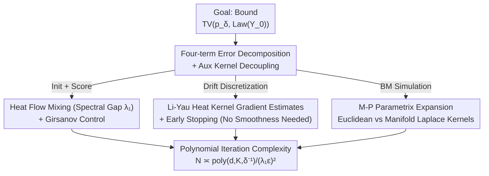

# Polynomial Convergence of Riemannian Diffusion Models

**Conference**: ICLR 2026  
**OpenReview**: [https://openreview.net/forum?id=lL0FR3UPhZ](https://openreview.net/forum?id=lL0FR3UPhZ)  
**Code**: None (Pure theoretical analysis)  
**Area**: Learning Theory / Diffusion Model Convergence  
**Keywords**: Riemannian Diffusion Models, Convergence Analysis, Total Variation Distance, Heat Kernel, Discretization Error

## TL;DR
This work proves that Riemannian Score-based Generative Models (RSGMs) on manifolds require only **polynomial-scale** step counts to achieve accurate sampling under **Total Variation (TV) distance**. It relaxes the restrictive guarantees of De Bortoli et al. (2022)—which previously required "exponentially small steps + $L_\infty$ score precision + smooth strictly positive data distribution"—to "polynomial steps + $L_2$ score precision + arbitrary data distribution."

## Background & Motivation
**Background**: Convergence theory for diffusion models in Euclidean space $\mathbb{R}^d$ is fairly mature. Works such as Chen et al. (2023), Benton et al. (2024), and Li et al. (2024) have proven that DDPM-type discrete samplers converge under TV distance with polynomial iterations, assuming **$L_2$ score estimation error** and weak data assumptions. These results provide solid theoretical support for why diffusion models can sample from complex multimodal distributions.

**Limitations of Prior Work**: Many scientific data types naturally reside not in Euclidean space but on manifolds—such as orientations in $SO(3)$, directions on a sphere, torus angles, joint poses, or symmetric positive definite (SPD) matrices. To adapt diffusion models to manifolds, constraints must be embedded into the forward/backward processes. The RSGM by De Bortoli et al. (2022) was the pioneering work providing non-asymptotic convergence rates. However, their Wasserstein distance guarantee has three major drawbacks: ① it requires **exponentially small step sizes**, leading to iteration complexity that explodes exponentially with certain manifold parameters; ② it requires **$L_\infty$ score estimation precision**, which is unachievable in deep learning; and ③ it requires the data distribution on a compact manifold to be **smooth and strictly positive**.

**Key Challenge**: The transition kernel of Brownian motion on a manifold **cannot be exactly simulated by any discrete-time process** (the fundamental difference from Euclidean space, where Euclidean Brownian motion is exactly Gaussian with variance $t_k-t_{k-1}$). This "Brownian motion simulation error" forced previous researchers to use exponentially small steps to suppress the error.

**Goal**: Is it possible to achieve **polynomial iteration complexity** for manifold diffusion models under **$L_2$ score precision** and **mild geometric assumptions**? Simultaneously, can the requirements for smoothness/positivity of the data distribution be discarded?

**Key Insight**: The author notes that modern Euclidean analysis (e.g., stochastic localization in Benton et al. 2024, Li-Yau style gradient estimates) achieves polynomial convergence by finely decomposing discretization errors. If the manifold-specific "Brownian motion simulation error" can be isolated and controlled using heavy machinery from geometric analysis (Li-Yau heat kernel estimates, parametrix expansion), one might avoid exponential explosion.

**Core Idea**: Use a **localized auxiliary kernel** to decouple the "drift discretization error" from the "Brownian motion simulation error," then control both to polynomial scales using **Li-Yau heat kernel gradient estimates** and **Minakshisundaram-Pleijel parametrix expansion**.

## Method

### Overall Architecture
This paper does not propose a new algorithm but provides a new discrete-time analysis for the RSGM sampler (Algorithm 1) of De Bortoli et al. (2022). The forward process of RSGM is a drift-free geometric Brownian motion $dX_t = U_{X_t}\circ dW_t$ (where $\circ$ denotes Stratonovich integration and $U_x$ is an orthonormal frame at $x$), whose transition density satisfies the heat equation $\partial_t p_t = \tfrac{1}{2}\Delta_M p_t$. The reverse SDE is:

$$dY_\tau = \nabla\log p_\tau(Y_\tau)\,d\tau + U_{Y_\tau}\circ dW_\tau,\quad \tau = T-t.$$

During discretization, each step samples a Gaussian increment $G_k=U_k\xi_k$ in the tangent space $T_{Y_k}M$, constructs the tangential update $\Delta_k = h\,\hat{s}_{t_k}(Y_k)+\sqrt{h}\,G_k$, and projects it back to the manifold via the exponential map $\exp_{Y_k}$. If $\|\Delta_k\|>h^{1/4}$ (exceeding the injectivity radius), the sample is rejected and resampled from a uniform distribution $\mu$.

The goal of the analysis is to bound the TV distance between the output distribution $Y_0$ and the early-stopped target $p_\delta$ (the approximation of $p_0$ with early-stopping time $\delta>0$). **The core approach is to decompose the total error into four terms**:

$$\underbrace{\text{Initialization Error}}_{\text{TV}(p_N,\mu)} + \underbrace{\text{Score Error}}_{\varepsilon_{\text{score}}} + \underbrace{\text{Drift Discretization Error}}_{\text{Frozen Drift}} + \underbrace{\text{BM Simulation Error}}_{\text{Manifold-specific}}.$$

The first two terms use established tools (heat flow mixing rates + Girsanov). The third term adapts Euclidean analysis. **The real obstacle is the fourth term**. The soul of the framework lies in using a **localized auxiliary kernel** $\hat K^{\text{aux}}_k$—which serves only the proof and does not appear in the algorithm—as a bridge to decouple and solve the third and fourth terms.

### Key Designs

**1. Four-term Error Decomposition + Localized Auxiliary Kernel: Isolating Manifold-specific Challenges**

Directly applying Euclidean analysis hits a geometric barrier: the frozen drift $\hat{s}_{t_k}(Y_{t_k})$ is a vector in the tangent space $T_{Y_k}M$, **defined only at the fixed point $Y_k$**. However, once Brownian motion evolves continuously on the manifold, it leaves $Y_k$, rendering the frozen drift meaningless. The author resolves this via **localization**: first, take a smooth cutoff function $\eta$ ($\eta|_{[0,1]}\equiv 1$, $\eta|_{[4,\infty)}\equiv 0$), define radii $\omega := c_\omega/(Kd^4)$ and $\eta_\omega(r)=\eta(4r^2/\omega^2)$, and then "transport" the frozen drift into a vector field across the manifold:

$$S_{t,x}(y) = (d\exp_x)_{\log_x y}\big(\eta_\omega(\rho(x,y))\cdot \hat{s}_t(x)\big)\in T_yM.$$

Intuitively, $S_{t,x}(\cdot)$ "copies" the velocity field $\hat{s}_t(x)$ as a constant vector field in normal coordinates; $d\exp_x$ identifies $T_yM$ with $T_xM$, and the cutoff $\eta_\omega$ keeps the discussion within the injectivity radius to avoid the cut locus. This defines the **auxiliary kernel** $\hat K^{\text{aux}}_k$, corresponding to a reverse SDE where the score is frozen as a constant vector field but Brownian motion remains continuous. $\hat K^{\text{aux}}_k$ acts as a watershed: the difference between $\hat K^{\text{aux}}_k$ and the true kernel $K_k$ is the drift discretization error, while the difference between $\hat K^{\text{aux}}_k$ and the algorithmic kernel $\hat K_k$ is the BM simulation error.

**2. Li-Yau Heat Kernel Gradient Estimates + Early Stopping: Controlling Score Norms Without Smoothness/Positivity**

The drift discretization error requires estimating $\mathbb{E}\|\nabla\log p_t(Y_t)-S^\star_{t_k,Y_{t_k}}(Y_t)\|^2$, involving time derivatives. Since $\partial_\tau\log p_t = -\tfrac{1}{2}\Delta_M p_t$ under reverse time, this involves spatial derivatives up to the **third order**. Fortunately, after simplifying via Itô/Stratonovich calculus, a key property from Euclidean analysis holds on manifolds: **the third-order derivatives of $\log p_t$ cancel out**, leaving only first and second orders. These can be bounded with high probability using **Li-Yau estimates** (Li & Yau, 1986). Crucially, combining Li-Yau with **early stopping** (stopping at $t=\delta>0$ instead of $0$) allows the author to **avoid assuming $p_0$ is smooth or strictly positive**. The polynomial bound for drift discretization becomes:

$$\sum_{k=1}^N\int_{t_{k-1}}^{t_k}\mathbb{E}\|\nabla\log p_t(Y_t)-S^\star_{t_k,Y_{t_k}}(Y_t)\|^2\,dt \le \frac{Cd^6K^8}{\delta^3}h^2N.$$

**3. Minakshisundaram-Pleijel Parametrix: Quantifying Brownian Motion Simulation Error**

This is the most difficult manifold-specific part. Based on Pinsker's inequality, the simulation error is converted into a chain decomposition of KL divergence:

$$\text{TV}(p^{\text{aux}}_0, q^\star_0) \le \sqrt{2\,\text{KL}(p^{\text{aux}}_0\,\|\,q^\star_0)} \le \sqrt{2\sum_{k=1}^N \text{KL}\big(p^{\text{aux}}_k \hat K^{\text{aux}}_k\,\big\|\,p^{\text{aux}}_k \hat K_k\big)}.$$

The Fokker-Planck equation shows these kernels are solutions to heat equations with the **Euclidean Laplacian** and **Manifold Laplace-Beltrami operator**, respectively. The author uses **Minakshisundaram-Pleijel (M-P) parametrix theory** (Berline et al., 2003) to quantify this gap.

## Key Experimental Results

> This is a **purely theoretical work; no numerical experiments were conducted**. The following table summarizes the theoretical guarantees.

### Main Results: Comparison with Existing Convergence Guarantees (Paper Table 1)

| Work | Space | Metric | Iteration Complexity | Data Distribution Assumption |
|------|------|------|------------|--------------|
| Benton et al. (2024) | Euclidean | TV | $\tilde O(d/\varepsilon^2)$ | Bounded moments |
| Li et al. (2024) | Euclidean | TV | $\tilde O(\text{poly}(d)/\varepsilon)$ | Bounded support |
| Li & Yan (2025) | Euclidean | TV | $\tilde O(d/\varepsilon)$ | Bounded moments |
| De Bortoli et al. (2022) | **Manifold** | $W_p$ | $\tilde O\big(\exp(O(d))/\varepsilon^{-1/\lambda_1}\big)$ | Smooth, strictly positive |
| **Ours** | **Manifold** | **TV** | $\tilde O\big(\text{poly}(d)/(\lambda_1^2\varepsilon^2)\big)$ | **None (Early stopping only)** |

### Key Findings
- **Transition from Exponential to Polynomial**: Compared to De Bortoli et al. (2022), which required exponential complexity in $d$ under $W_p$, this work achieves polynomial complexity under TV, marking a qualitative shift.
- **BM Simulation Error is the Main Difficulty**: While other terms can be handled with standard tools, the inability to perfectly simulate manifold BM required the parametrix machinery.
- **Minimal Data Assumptions**: Early stopping + Li-Yau removes the need for smoothness/positivity, meaning the theory covers real-world data on low-dimensional submanifolds or with sharp peaks.
- **Spectral Gap $\lambda_1$ Dictates Speed**: Complexity depends on $1/\lambda_1^2$, showing that manifold connectivity/geometry directly influences sampling efficiency.

## Highlights & Insights
- **The Localized Auxiliary Kernel is Elegant**: Using an "analytically-only" kernel to decouple manifold-specific errors is a technique transferable to other manifold stochastic processes.
- **Third-order Derivative Cancellation**: The fact that this Euclidean identity survives manifold calculus suggests that much of the convergence framework is geometry-independent.
- **Early Stopping Replaces Positivity**: Shifting the "analytical burden" from data assumptions to geometric tools (Li-Yau) is a sophisticated choice.

## Limitations & Future Work
- **Unoptimized Polynomial Orders**: The author focuses on clarity rather than optimizing degrees (e.g., $d^6K^8/\delta^3$).
- **Random Samplers Only**: The analysis targets DDPM-style random samplers; deterministic samplers like DDIM require separate study.
- **Unconditional Sampling**: Conditional sampling (inverse problems) remains for future work.
- **Bounded Geometry Assumption**: Assumptions on injectivity radius and curvature exclude some pathological manifolds.

## Related Work & Insights
- **vs. De Bortoli et al. (2022)**: This work analyzes the **same algorithm** but replaces $W_p$ with TV and drops the exponential step requirement.
- **vs. Benton et al. (2024) / Li et al. (2024)**: It adopts their localization ideas but addresses the manifold simulation barrier that Euclidean analysis ignores.
- **vs. Cheng et al. (2022, 2023)**: They analyze time-homogeneous SDEs (Langevin/EM); this work addresses the **time-inhomogeneous reverse process** of diffusion models.

## Rating
- Novelty: ⭐⭐⭐⭐⭐ 
- Experimental Thoroughness: ⭐⭐⭐ 
- Writing Quality: ⭐⭐⭐⭐ 
- Value: ⭐⭐⭐⭐⭐ 

<!-- RELATED:START -->

## Related Papers

- [\[ICLR 2026\] A Sharp KL Convergence Analysis for Diffusion Models under Minimal Assumptions](a_sharp_kl_convergence_analysis_for_diffusion_models_under_minimal_assumptions.md)
- [\[ICLR 2026\] On the Interpolation Effect of Score Smoothing in Diffusion Models](on_the_interpolation_effect_of_score_smoothing_in_diffusion_models.md)
- [\[ICLR 2026\] Quotient-Space Diffusion Models](quotient-space_diffusion_models.md)
- [\[ICLR 2026\] Provable Separations between Memorization and Generalization in Diffusion Models](provable_separations_between_memorization_and_generalization_in_diffusion_models.md)
- [\[ICLR 2026\] Finite-Time Convergence Analysis of ODE-based Generative Models for Stochastic Interpolants](finite-time_convergence_analysis_of_ode-based_generative_models_for_stochastic_i.md)

<!-- RELATED:END -->
