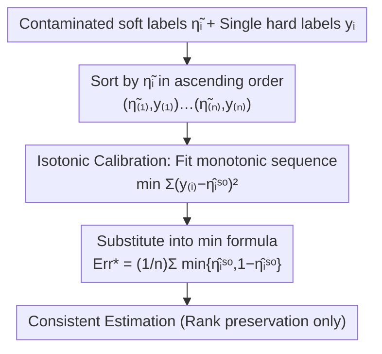

# Practical Estimation of the Optimal Classification Error with Soft Labels and Calibration

**Conference**: ICLR 2026  
**OpenReview**: [https://openreview.net/forum?id=1Q85tfZaOa](https://openreview.net/forum?id=1Q85tfZaOa)  
**Code**: https://github.com/RyotaUshio/bayes-error-estimation  
**Area**: Learning Theory / Bayes Error Estimation / Statistical Consistency  
**Keywords**: Bayes Error, Soft Labels, Calibration, Isotonic Regression, Bias Analysis

## TL;DR
This paper makes two contributions to binary Bayes error (optimal error rate) estimation: first, it provides a much tighter bias bound that adaptively accelerates based on the "separability" of the two class distributions; second, it proposes applying isotonic calibration before the estimation formula when soft labels are contaminated, achieving statistical consistency as long as the "order" of soft labels remains intact.

## Background & Motivation
**Background**: When benchmarking, new methods are often compared to the SOTA error rate. However, any model's error rate has a lower bound determined by the data distribution itself—the Bayes error $\mathrm{Err}^* = \inf_h \mathrm{Err}(h)$. Knowing this bound is valuable: if the SOTA is already close to the lower bound, further optimization may be unnecessary (saving compute, money, and carbon), and test scores approaching or exceeding this bound often signal overfitting or leakage. In binary classification, Bayes error estimation methods are divided into two categories: estimation from "instance-label pairs" and the newer approach of estimation from soft labels $\eta_i := P(y=1\mid x=x_i)$.

**Limitations of Prior Work**: The soft label method by Ishida et al. (2023) is elegant as it is **instance-free** (it does not require the input $x$ itself, thus avoiding the curse of dimensionality and being applicable to privacy-sensitive scenarios like healthcare). However, it has two weaknesses. First, true clean soft labels are only known to an oracle; in practice, they are approximated by the average of $m$ hard labels $\hat\eta_i = \frac1m\sum_j y_i^{(j)}$. The previously provided bias bound is $\tilde O(1/\sqrt m)$, which is almost meaningless when $m$ is small (e.g., CIFAR-10H has only ~50 annotations per image); notably, this bound counter-intuitively increases with the number of samples $n$. Second, soft labels can be distorted due to "annotation distribution shift" or subjectivity of human/LLM annotators—for instance, CIFAR-10H was annotated **after** image downsampling, leading to higher uncertainty. Directly substituting these soft labels into the estimator yields unrealistically high Bayes errors (sometimes even higher than the measured error of a ViT).

**Key Challenge**: The theoretical guarantees (bias bounds) for the soft label method are too loose, and they do not address the realistic scenario where "soft labels themselves are contaminated"; previous works mentioned the shift problem but offered no solution.

**Goal**: (1) To refine and tighten the bias bound of the hard-label approximation estimator; (2) To formalize the new problem of "estimating Bayes error from contaminated soft labels" and provide a guaranteed algorithm.

**Key Insight**: Bias magnitude is strongly correlated with "separability"—samples far from the decision boundary $\eta=0.5$ contribute almost no bias. To handle contamination, instead of recovering the exact numerical values of soft labels, it is better to rely only on their "order," which is precisely what isotonic calibration guarantees.

**Core Idea**: Rewrite the bias bound from a "separation-adaptive" perspective (a mixture of the fast rate $1/m$ and the slow rate $1/\sqrt m$) and use isotonic calibration to transform the weak assumption of "rank preservation" into statistical consistency.

## Method

### Overall Architecture
This paper is not an engineering pipeline but rather two theoretical lines revolving around the same plug-and-play estimator:
$$\widehat{\mathrm{Err}^*}(\eta_{1:n}) = \frac1n\sum_{i=1}^n \min\{\eta_i,\,1-\eta_i\}$$
This formula stems from $\mathrm{Err}^* = \mathbb{E}_{x}\big[\min\{\eta(x),1-\eta(x)\}\big]$ (Cover, 1968), replacing the expectation with the sample mean. It is unbiased and consistent for clean soft labels.

**The First Path (Section 2)**: When provided with the average of $m$ hard labels $\hat\eta_i$ instead of clean $\eta_i$, the **bias** introduced by this approximation must be characterized. It is proved that the bias decay rate varies with class separability, and a computable bound is provided that only requires an "upper bound of the Bayes error."

**The Second Path (Section 3)**: When provided with "contaminated soft labels" $\tilde\eta_i$ distorted by an unknown monotonic transformation, a three-step processing flow is used: first, **calibrate** the contaminated soft labels back to usable probabilities, then substitute them into the estimation formula. This paper argues that "being calibrated is not enough" and identifies isotonic calibration as the key to providing a consistent estimate. The process for the second path is as follows:

Both paths share the **instance-free** advantage: they never touch the input $x$, using only soft labels (plus one hard label per instance for calibration).

### Key Designs

**1. Soft Label Plug-and-Play Estimator: Writing Bayes Error as an Estimable Sample Mean**
The entire work is built on the identity $\mathrm{Err}^* = \mathbb{E}_x[\min\{\eta(x),1-\eta(x)\}]$. Its advantage is transforming an abstract object like the "optimal classifier" into a simple statistic $\widehat{\mathrm{Err}^*}(\eta_{1:n})$ calculated by point-wise $\min$ operations and averaging, which is unbiased and consistent at a rate of $\tilde O(1/\sqrt n)$. Crucially, it is **instance-free**, making it immune to the curse of dimensionality and naturally suitable for privacy scenarios where raw data $\{x_i\}$ is unavailable. All improvements in this paper focus on "where soft labels come from and their accuracy" rather than modifying the formula itself.

**2. Separation-Adaptive Bias Bound: Bias Decay as a Mixture of $1/m$ and $1/\sqrt m$**
To address the loose bounds of using the hard-label average $\hat\eta_i$, Theorem 1 provides:
$$-\mathbb{E}_x\Big[\min\Big\{\tfrac{L_{\mathrm{Err}}(\eta(x))}{m},\ \sqrt{\tfrac{\pi}{2m}}\Big\}\Big]\ \le\ \mathbb{E}\big[\widehat{\mathrm{Err}^*}(\hat\eta_{1:n})\big]-\mathrm{Err}^*\ \le\ 0,$$
where $L_{\mathrm{Err}}(q)=\frac{q(1-q)}{|2q-1|}$ (for $q\ne0.5$), which diverges at $q\to0.5$ and approaches zero as $q$ nears 0 or 1. This indicates that samples near the decision boundary ($\eta\approx0.5$) contribute large bias and follow the slow rate $1/\sqrt m$, while samples far from the boundary contribute almost nothing and follow the fast rate $1/m$. The overall bias is a weighted mixture of both based on "class separability." Two direct benefits: the bound **no longer contains $n$** (removing the counter-intuitive term from previous bounds) and is strictly superior to prior results (Proposition 1). Corollary 1 further shows: if $|\eta(x)-0.5|\ge c$ holds almost everywhere (met by perfect separability + label noise, where $c=|\nu-0.5|$), the bias decays at the fast rate $O(1/m)$—since real datasets are often well-separated, this fast rate often holds in practice.

**3. Computable Bias Bound $B(E,m)$: Computable given a Bayes error upper bound**
While Theorem 1 is tight, its numerical value requires distribution details (like the expectation of $L_{\mathrm{Err}}$), which are unavailable in practice. Corollary 2 relaxes this into a computable quantity dependent only on an "upper bound of the Bayes error $E$" (e.g., using the test error rate of a SOTA model as $E$):
$$B(E,m)=\inf_{t\in(0,1/2)}\frac{t(1-t)}{1-2t}\Big[\frac1m+\min\big\{1,\tfrac{E}{t}\big\}\sqrt{\tfrac{\pi}{2m}}\Big].$$
This can be solved numerically without any distribution information. On binarized CIFAR-10 ($n=10000, m\approx50, E=0.0005$ from ViT), prior bounds suggested a potential bias of $0.557$, whereas this bound proves the bias does not exceed $0.00276$—**over 200 times tighter**, bringing the estimator from "unusable" to "reliable."

**4. Calibration $\neq$ Accuracy, Isotonic is Key: Replacing Clean Labels with Rank Preservation**
For the second path, one might naturally try "calibrating $\tilde\eta_i$ to be well-calibrated before estimation." However, Example 2 shows this is insufficient: for two disjoint distributions with mixing rate $\theta=0.5$ (true Bayes error is 0), a constant predictor $\hat\eta_i\equiv0.5$ is **perfectly calibrated** but yields an absurd estimate of $\min\{0.5,0.5\}=0.5$. Calibration only means $c(x)=\mathbb{E}[y\mid c(x)]$, which is a necessary but not sufficient condition for $c(x)=P(y=1\mid x)$. This paper utilizes **isotonic calibration**: reordering $(\tilde\eta_i,y_i)$ by $\tilde\eta_i$ and fitting a monotonic sequence $\hat\eta^{\mathrm{iso}}$ using isotonic regression to minimize $\frac1n\sum(y_{(i)}-\hat\eta^{\mathrm{iso}}_{(i)})^2$. Theorem 2 proves that if there exists a monotonically increasing function $f$ such that $\tilde\eta_i=f(\eta_i)$ (contamination changes "values" but not "order"), then with high probability:
$$\big|\widehat{\mathrm{Err}^*}(\hat\eta^{\mathrm{iso}}_{1:n})-\mathrm{Err}^*\big|le C\Big(\tfrac1{n^{1/3}}+\sqrt{\tfrac{\log(1/\delta)}{n}}\Big).$$
This relaxes the strong "clean soft labels $\eta_i$" requirement to "soft label rank preservation." Theorem 3 further allows additive noise $\tilde\eta_i=f(\eta_i)+\varepsilon_i$ ($f'\ge c>0, \mathrm{Var}(\varepsilon_i)\le\sigma^2$), where the error bound adds an $O(\sigma)$ term; the randomness from hard-label averages precisely corresponds to $\sigma=\frac1{2\sqrt m}$. Isotonic regression is robust as it avoids parametric assumptions on contamination, though it fails if $f$ is too "flat" (derivative becomes arbitrarily small).

### Loss & Training
No model training is required. The core computations are isotonic regression (solved via the PAVA algorithm) and $\min$ averaging. The only "tuning" is the choice of calibration algorithm (e.g., bin count $b$ for histogram binning).

## Key Experimental Results

### Main Results
Bayes error was estimated on synthetic data, CIFAR-10, and Fashion-MNIST, comparing "direct substitution of contaminated labels" against various calibration algorithms (error bars represent 95% bootstrap confidence intervals).

| Dataset | Corrupted (Direct) | After Calibration (Isotonic etc.) | Reference Line |
| :--- | :--- | :--- | :--- |
| Synthetic (True $\approx$ Known) | Severe Overestimation | Pulled to reasonable range | True Bayes Error |
| CIFAR-10 | Much higher than ViT 0.05% | Close to ViT test error | ViT 0.05% dashed line |
| Fashion-MNIST | Clear Overestimation | Isotonic/Beta*/Platt reasonable; Hist-25 fails (high) | ResNet-18 test error |

Conclusion: The "lack of confidence" in contaminated soft labels severely overestimates Bayes error; all calibration methods improve results significantly, but histogram binning is sensitive to the number of bins, confirming the need to choose the right calibration algorithm.

### Bias Bound Comparison / FeeBee Ranking

| Comparison Item | Ours | Prior (Ishida 2023) |
| :--- | :--- | :--- |
| CIFAR-10 Bias Upper Bound ($n{=}10^4,m{=}50,E{=}0.0005$) | $\le 0.00276$ | $\le 0.557$ (~200× looser) |
| Bound contains $n$ | No (does not increase with $n$) | Yes, increases with $n$ |

In the FeeBee framework (injecting synthetic noise and measuring if the estimator tracks changes in Bayes error), ranking across 6 real datasets showed: Isotonic and Platt were almost always in the top tier; Hist-* performed well only with tuned bins; Beta* was significantly worse on most datasets.

### Key Findings
- **Separation determines convergence speed**: On well-separated data, bias follows the fast rate $O(1/m)$, only degrading to $O(1/\sqrt m)$ in the worst case. This explains why previous worst-case bounds were overly pessimistic.
- **Calibrated $\neq$ Accurate**: A perfectly calibrated constant predictor can give entirely incorrect Bayes error estimates; the "shape inductive bias" of the calibration algorithm is critical.
- **Isotonic vs. Beta**: Although beta calibration is the "correct" parametric calibrator in synthetic settings, it performs poorly elsewhere, suggesting that non-parametric, rank-based isotonic regression is more stable.
- **Surprising Strength of Platt**: Platt scaling assumes Gaussian mixture inputs (unbounded), yet soft labels are bounded in $[0,1]$. Despite the mismatched assumption, it provides accurate estimates; the authors leave this as an open question.
- **ICLR Review Data**: The authors constructed a dataset of $n=32,829$ ICLR 2017–2025 review records (normalized weighted average scores as contaminated soft labels, accept/reject as hard labels) to estimate the "probability of an ideal reviewer mis-rejecting a good paper/mis-accepting a bad paper" as a proxy for task difficulty.

## Highlights & Insights
- **Reading Bias from Distribution Geometry**: By using $L_{\mathrm{Err}}$, a function that diverges at 0.5 and flattens at the ends, the paper intuitively characterizes that "points near the boundary are the culprits for bias," which is more informative than simply reporting a $1/\sqrt m$ rate.
- **Computable Bound $B(E,m)$**: Practitioners can calculate bias bounds using existing SOTA error rates, making the theory a highly accessible tool.
- **Argument for "Calibration is Not Enough"**: Example 2 clarifies the fundamental gap between calibration and posterior probabilities, elevating the choice of calibration algorithm to a design problem with guarantees.
- **Instance-free + Rank-only**: Both assumptions are extremely weak (no $x$ needed, no exact soft label values needed), allowing the method to be applied to real-world medical, privacy, or LLM-labeling scenarios.

## Limitations & Future Work
- The entire work is limited to **binary classification**; multi-class Bayes error estimation is a major future direction.
- Theorem 3 requires the contamination function $f$ to have a positive lower bound on its derivative ($f'\ge c$). It fails for "very flat" $f$, and it is unclear how much accuracy is lost when this is violated (though synthetic experiments suggest it often works well).
- Calibration requires one **hard label** $y_i$ per instance to fit the mapping; it is not applicable to pure soft labels without any hard labels.
- The effectiveness of Platt scaling despite mismatched assumptions lacks theoretical explanation.

## Related Work & Insights
- **vs. Ishida et al. (2023)**: Directly builds on this work. While the predecessor proposed the estimator and a $\tilde O(1/\sqrt m)$ bound, this paper tightens the bound (approx. 200×), removes $n$-dependence, and solves the contamination problem, relaxing the assumption from "clean labels" to "rank preservation."
- **vs. Instance-Label Pair Methods (Fukunaga-Hostetler, Berisha, etc.)**: Those methods require access to $x$, suffer from the curse of dimensionality, and are unusable in privacy scenarios. This paper avoids these by remaining instance-free.
- **vs. Histogram Binning / Beta / Platt**: This paper benchmarks these calibrators within the estimation framework, proving that isotonic calibration (non-parametric, rank-based) uniquely offers statistical consistency guarantees.

## Rating
- Novelty: ⭐⭐⭐⭐ Combines separation-adaptive bias analysis and isotonic consistency into one estimator.
- Experimental Thoroughness: ⭐⭐⭐⭐ Synthetic + 4 real datasets + FeeBee ranking + ICLR review dataset.
- Writing Quality: ⭐⭐⭐⭐ Logical progression from theorems to corollaries with illustrative counterexamples.
- Value: ⭐⭐⭐⭐ Provides a practical, computable tool to determine if it is worth pursuing further SOTA improvements.

<!-- RELATED:START -->

## Related Papers

- [\[ICLR 2026\] Minimax-Optimal Aggregation for Density Ratio Estimation](minimax-optimal_aggregation_for_density_ratio_estimation.md)
- [\[ICLR 2026\] Know When to Abstain: Optimal Selective Classification with Likelihood Ratios](know_when_to_abstain_optimal_selective_classification_with_likelihood_ratios.md)
- [\[ICLR 2026\] An Efficient, Provably Optimal Algorithm for the 0-1 Loss Linear Classification Problem](an_efficient_provably_optimal_algorithm_for_the_0-1_loss_linear_classification_p.md)
- [\[ICLR 2026\] Information Estimation with Discrete Diffusion](information_estimation_with_discrete_diffusion.md)
- [\[ICLR 2026\] Conformal Prediction for Long-Tailed Classification](conformal_prediction_for_long-tailed_classification.md)

<!-- RELATED:END -->
