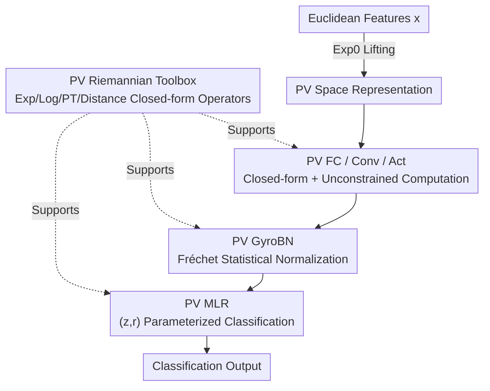

# Proper Velocity Neural Networks

**Conference**: ICLR 2026  
**OpenReview**: [https://openreview.net/forum?id=UDIYU1X3vC](https://openreview.net/forum?id=UDIYU1X3vC)  
**Code**: https://github.com/NickyoyoSu/PVNN  
**Area**: Geometric Deep Learning / Hyperbolic Neural Networks  
**Keywords**: Hyperbolic Geometry, Proper Velocity, Riemannian Operators, GyroBN, Representation Learning

## TL;DR
This paper introduces the "Proper Velocity (PV)" space, originating from special relativity, into machine learning. It completes the full Riemannian toolbox for PV (closed-form solutions for exponential/logarithmic maps, parallel transport, and geodesic distance) and constructs core layers including MLR, fully connected, convolutional, activation, and batch normalization. The resulting Proper Velocity Neural Network (PVNN) is numerically stable and outperforms Poincaré and Hyperboloid (Lorentz) models on strongly hyperbolic data.

## Background & Motivation
**Background**: Due to its exponential representation capacity, hyperbolic geometry is naturally suited for hierarchical or tree-like data and has been widely used in computer vision, knowledge graphs, NLP, graph learning, and genomics. Recent research has shifted from learning hyperbolic embeddings to directly building Hyperbolic Neural Networks (HNNs). The choice of hyperbolic model is a core design decision; currently, almost all work is built on the **Poincaré ball** or the **Hyperboloid (Lorentz) model** because they offer established Riemannian or gyrovector operators.

**Limitations of Prior Work**: Both models are **constrained spaces**. The Poincaré ball requires $\|x\|^2 < -1/K$; once embeddings approach the boundary, numerical calculations become unstable and gradients tend to vanish. The Hyperboloid model requires points to lie strictly on the surface $x_t^2-\|x_s\|^2 = 1/K$; under large-scale operations, points easily drift off the manifold, producing NaN/Inf or even gradient explosions. In other words, the constraints themselves are both the source of the geometric structure and the root of numerical instability.

**Key Challenge**: The "negative curvature structure" required for hyperbolic modeling and the "numerical stability" required for engineering are at odds in constrained models—the more the representation is pushed toward the boundary (to utilize hyperbolic capacity), the more likely it is to hit a numerical cliff.

**Goal**: Find an **unconstrained** representation space that is equivalent to hyperbolic geometry and implement a complete set of neural network layers within it.

**Key Insight**: The authors notice the **Proper Velocity (PV) space** $\mathrm{PV}^n_K = \mathbb{R}^n$ from special relativity, used to describe relativistic velocity addition. Algebraically, it constitutes a gyrovector space (isomorphic to the Möbius gyrovector space of the Poincaré ball), but it covers the entire $\mathbb{R}^n$ without boundary constraints. While mature in relativistic physics, its Riemannian operators (exponential/logarithmic maps, parallel transport) are almost non-existent in machine learning.

**Core Idea**: Replace constrained Poincaré/Lorentz models with the unconstrained PV space. First, derive the complete closed-form Riemannian operators for PV, then build a suite of PV neural network layers to inherently avoid boundary numerical instability.

## Method

### Overall Architecture
The construction of PVNN follows a pipeline of "building the foundation before the walls": Euclidean features are lifted into the PV space via $\mathrm{Exp}_0$ (since PV is unconstrained, Euclidean coordinates can also be used directly as PV coordinates); PV versions of MLR, FC, Conv, Act, and GyroBN layers are then stacked; and classification scores are output. The feasibility of the entire pipeline rests on a single cornerstone—the **PV space closed-form Riemannian toolbox**, which defines operations like "point-to-hyperplane distance" and "mean/variance" for upper-level structures.

The key technical leverage: The authors prove a **Riemannian isometry** (not just an algebraic gyro-isomorphism) between the PV space and the Poincaré ball. Consequently, existing closed-form operators from the Poincaré ball can be "transported" to the PV space via isometry, avoiding derivation from scratch.

### Key Designs

**1. PV Riemannian Toolbox: "Borrowing" Operators from the Poincaré Ball via Isometry**

To build a network on any manifold, one must know how to calculate exponential maps, logarithmic maps, parallel transport, and geodesic distances. These have not been derived for the PV space in ML. This paper first establishes the mapping $\pi_{\mathrm{PV}\to P}: x \mapsto \frac{\beta_x}{1+\beta_x}x$ (where $\beta_x = \frac{1}{\sqrt{1-K\|x\|^2}}$ is the relativistic beta factor) and its inverse. It proves they are not only gyro-preserving (gyrovector isomorphism) but also a **Riemannian isometry** (Thm. 4.2)—preserving the inner product pointwise. With isometry, closed-form operators from the Poincaré ball are pulled back to PV, obtaining closed-form expressions for PV $\mathrm{Exp}_x$, $\mathrm{Log}_x$, parallel transport $\mathrm{PT}_{x\to y}$, and distance $d(x,y)$. At the origin, these simplify further, e.g., $\mathrm{Exp}_0(v) = \frac{1}{\sqrt{-K}}\sinh(\sqrt{-K}\|v\|)\frac{v}{\|v\|}$. This step is the "foundation" of the paper: it equips a physical velocity space with the full suite of Riemannian operations needed for neural networks, and since PV is unconstrained, these operators remain stable even under large-norm inputs.

**2. PV MLR: Degrading the Classification Layer to Matrix Multiplication via $(z_k, r_k)$ Parameterization**

Each logit in Euclidean MLR can be viewed as a "signed distance from a point to a hyperplane." Porting this to PV requires a PV hyperplane $H_{a,p}$ and point-to-hyperplane distance (Thm. 5.1). However, a direct port has three drawbacks: the hyperplane parameter $p_k$ is over-parameterized, the gyroaddition $-p_k \oplus_U x$ in the expression is computationally complex, and constrained parameters require expensive Riemannian optimization. Borrowing from Shimizu et al., the authors rewrite parameters as $p_k = \mathrm{Exp}_0(r_k z_k/\|z_k\|)$ and $a_k = \mathrm{PT}_{0\to p_k}(z_k)$, where $z_k \in \mathbb{R}^n$ and $r_k \in \mathbb{R}$ are unconstrained free parameters. After reparameterization, the score for class $k$ simplifies to:

$$v_k(x) = \frac{\|z_k\|}{\sqrt{-K}}\sinh^{-1}\!\left(\frac{\cosh(\sqrt{-K}r_k)}{\sqrt{-K}}\|z_k\|\langle x, z_k\rangle - \sinh(\sqrt{-K}r_k)\sqrt{1-K\|x\|^2}\right).$$

The key benefit is that this formula depends only on the inner product $\langle x, z_k \rangle$—a single matrix multiplication can compute all class scores for a batch, avoiding intermediate $b\times C\times n$ tensors (which cause OOM in high dimensions). Furthermore, as $K\to 0^-$, $v_k(x)\to \langle x,z_k\rangle + b_k$, cleanly reverting to Euclidean MLR, indicating it is a geometric generalization of the Euclidean classification layer.

**3. PV FC / Conv / Activation: Closed-form FC + "Direct Activation" in Unconstrained Space**

Each dimension of a Euclidean FC layer $y=Ax+b$ can similarly be written as a "signed distance to a hyperplane passing through the origin and orthogonal to the output axis." Expressing the left side as PV point-to-hyperplane distance and the right side using $v_k(x)$, the PV FC layer has a closed-form solution (Thm. 5.3): $y_k = \frac{1}{\sqrt{-K}}\sinh(\sqrt{-K}v_k(x))$, which can embed activation $\sigma$ as $y_k = \frac{1}{\sqrt{-K}}\sinh(\sqrt{-K}\sigma(v_k(x)))$. Convolution reduces to "PV Concatenation + PV FC"—since PV is unconstrained, PV concatenation is equivalent to Euclidean concatenation, so concatenating points within a receptive field and passing them through an FC constitutes a PV convolution. Activation is even simpler: Poincaré networks must go through the tangent space via $x\mapsto\mathrm{Exp}_0(\sigma(\mathrm{Log}_0(x)))$, whereas PV, being unconstrained, allows **applying Euclidean activation directly in the PV space** $x\mapsto\sigma(x)$, saving a pair of exponential/logarithmic maps and increasing efficiency. This suite of layers reflects the engineering dividends of an "unconstrained" space.

**4. PV GyroBN: Batch Normalization using Fréchet Statistics with Homogeneity Guarantees**

Euclidean BN operations (mean subtraction, bias addition, scaling) correspond to gyro-subtraction, gyro-addition, and gyro-multiplication on manifolds. This paper extends the GyroBN framework to PV: given a batch of activations $\{x_i\}$, it calculates the Fréchet mean $\mu$ and Fréchet variance $v^2$ (minimizing the sum of squared geodesic distances on PV), then performs:

$$\tilde{x}_i \leftarrow \underbrace{\beta \oplus_U}_{\text{Bias}}\Big(\underbrace{\tfrac{s}{\sqrt{v^2+\epsilon}}\otimes_U}_{\text{Scaling}}\big(\underbrace{-\mu \oplus_U x_i}_{\text{Centering}}\big)\Big).$$

The PV Fréchet mean can be solved by mapping to the Poincaré ball using isometry, applying existing algorithms, and mapping back. The authors also prove a **Homogeneity Theorem** (Thm. 5.4): gyro-translation commutes with the Fréchet mean, and gyro-scaling is linear with respect to dispersion by $t^2$. This explains the effect: after centering, the batch mean moves to origin 0; after biasing, it moves to $\beta$; and after scaling, the variance becomes $s^2$. Compared to manifold BN versions that are merely "cobbled together with Riemannian operators without statistical normalization guarantees," PV GyroBN **theoretically guarantees** the normalization of sample statistics.

### Loss & Training
No specialized loss functions are used; standard objectives for each task are followed (e.g., cross-entropy for classification). The curvature $K$ is fixed and shared in most experiments (e.g., across all layers in genomic tasks). Parameters like $(z_k, r_k)$ are unconstrained Euclidean free parameters, requiring only standard optimizers rather than Riemannian optimizers.

## Key Experimental Results

Experiments focus on four areas: numerical stability, image classification (CIFAR), graph node classification, and genomic sequence learning.

### Numerical Stability (FP32, K=−1, n=16)

| Probe | Metric | PV | Poincaré | Hyperboloid |
|------|------|----|----------|--------|
| Scalar gyro-multiplication $r\otimes x$ (r to 1000) | Failure Rate (NaN/Inf) | 0% | 0% | Fails from r≥20, 100% at r=200 |
| Round-trip error $\|\mathrm{Log}_0(\mathrm{Exp}_0(v))-v\|$ | FP32 | $2.1\times10^{-7}$ | $2.1\times10^{-4}$ | $1.0\times10^{0}$ |
| Gradient magnitude range | $\|\nabla x\|$ | $[1.1e\text{-}4, 2.1e\text{-}6]$ Stable | $[1.1e\text{-}11, 7.6e\text{-}13]$ Vanishing | $[0, \mathrm{NaN}]$ Exploding |

PV shows zero failures or violations in FP32 (violation is N/A due to lack of constraints). The round-trip error is 3 orders of magnitude smaller than Poincaré, and gradients fall within a safe range—directly validating the numerical advantages of the unconstrained space.

### Main Results: Image Classification and Graph Learning

| Task | Dataset | Ours (PVNN) | Strongest Hyperbolic Baseline |
|------|--------|-----------|--------------|
| Image Classification (ResNet-18) | CIFAR-100 | **78.20** (PV MLR w/o Exp0) | 77.96 (Lorentz MLR) |
| Graph Node Classification | Airport (δ=1) | **97.96** | 88.40 (HNN++) |
| Graph Node Classification | Disease (δ=0) | **81.15** | 80.57 (HNN++) |
| Graph Node Classification | PubMed (δ=3.5) | **74.33** | 73.68 (HNN++) |
| Graph Node Classification | Cora (δ=11, Weakly Hyperbolic) | 51.42 | 53.34 (Lorentz LNN) |
| Genomics (MCC) | SINEs | **93.78** | 85.45 (HCNN-S) |
| Genomics (MCC) | LINEs | **81.83** | 76.12 (HCNN-S) |

PV MLR leads in CIFAR-100 (where gains are greatest at complex decision boundaries). In graph learning, it is optimal across three strongly hyperbolic datasets (Disease/Airport/PubMed), with Airport outperforming the strongest baseline by 5.86 points. Only on the **weakly hyperbolic** Cora does it fall behind the Hyperboloid model—confirming that PV is most effective on strongly hyperbolic data. In genomic tasks, PVCNN is dominant, outperforming HCNN-S by approximately 9 MCC points on SINEs.

### Ablation Study

| Configuration | Disease | Airport | Description |
|------|---------|---------|------|
| PVNN (Riemannian PV FC) | 81.24 | 97.93 | Full |
| PVNN+TFC (Tangent space FC) | 80.86 | 86.99 | Replaced with tangent FC; significant drop in strong hyperbolic cases |
| PVNN+GyroBN | 81.24 | 99.03 | Fréchet Normalization |
| PVNN+TBN (Tangent space BN) | 80.67 | 98.71 | Replaced with tangent BN; worse across datasets |

### Key Findings
- **Riemannian Layers > Tangent Space Approximation**: Performing FC/BN truly on the PV manifold is significantly better than tangent space approximations (TFC/TBN) on strongly hyperbolic data, verifying that the "Riemannian construction" rather than "tangent space shortcuts" is the source of gain.
- **Fréchet Iteration as Accuracy/Speed Trade-off**: More Fréchet mean iterations yield higher accuracy (99.03 on Airport with 10 iterations), but Tangent/Euclidean approximations are about 2× faster with similar accuracy; choice can be made based on needs.
- **PV Geometry Dominates Only When "Hyperbolic Enough"**: PV is inferior to the Hyperboloid model on the weakly hyperbolic Cora, suggesting its sweet spot is data with strong hierarchical structures.
- **Minimal Impact of Exp0 Lifting**: Because PV is unconstrained, using Euclidean coordinates directly as PV coordinates yields similar results to lifting via Exp0 (w/o Exp0 was slightly better in image classification).

## Highlights & Insights
- **"Translating" Physics Velocity Space into an ML Tool**: The most significant insight is using the PV space from special relativity as the carrying geometry for neural networks and proving its Riemannian isometry with the Poincaré ball—allowing existing operators to be transported without derivation.
- **Unconstrained = Free Lunch for Numerical Stability**: Boundary constraints provide hyperbolic structure but also numerical cliffs. Switching to unconstrained PV allows direct activation, Euclidean-equivalent concatenation, and stable gradients.
- **$(z,r)$ Reparameterization Reduces Manifold Classification to Matrix Multiplication**: This avoids Riemannian optimization and simplifies $b\times C\times n$ tensors to inner products, making hyperbolic layers practical for large-scale training.

## Limitations & Future Work
- **Sweet Spot Limited by Data Hyperbolicity**: PV underperforms on weakly hyperbolic data (Cora), indicating it is not "better everywhere" but requires strong hierarchical structure.
- **Fréchet Mean Requires Iterative Solving**: The most accurate GyroBN relies on iterative Fréchet statistics, which is slower than tangent/Euclidean approximations, adding overhead on large strongly hyperbolic graphs.
- **Only Basic Architectures Validated**: The authors only implemented MLR, FC, Conv, Act, and BN, without extending to advanced structures like ResNets or Transformers (listed as future work). Performance on large-scale deep learning is yet to be fully verified.
- **Mostly Fixed Curvature**: Curvature $K$ is mostly fixed in experiments; interactions between learnable or layer-wise curvature and this geometry have not been deeply explored.

## Related Work & Insights
- **vs. Poincaré Ball HNN/HNN++ (Ganea / Shimizu)**: These rely on Möbius operators within a bounded ball, suffering from numerical instability and gradient vanishing near the boundary. This work replaces them with unconstrained PV and proves isometry to preserve capacity while avoiding instability.
- **vs. Hyperboloid/Lorentz Networks (Chen 2022 / Bdeir 2024 LNN/HCNN)**: The Hyperboloid model is prone to drifting off the manifold or NaN/explosions during large-scale operations. PV remains stable in FP32 and outperforms these models on strong hyperbolic graph and genomic tasks.
- **vs. Manifold BN (Brooks / Lou / Early GyroBN)**: Early manifold normalization often lacked theoretical guarantees for "truly normalizing sample statistics." PV GyroBN provides proof of exact mean/variance normalization via the homogeneity theorem.

## Rating
- Novelty: ⭐⭐⭐⭐⭐ First systematic introduction of the relativistic PV space to representation learning with a complete Riemannian toolbox and layer family.
- Experimental Thoroughness: ⭐⭐⭐⭐ Covers numerical, vision, graph, and genomic tasks with detailed ablations, though lacks large-scale and advanced architecture validation.
- Writing Quality: ⭐⭐⭐⭐ Clear theoretical derivation and consistent motivation, though formula-dense with a high entry barrier.
- Value: ⭐⭐⭐⭐ Provides a new, numerically stable geometric option for HNNs; the methodology is transferable to other manifolds.

<!-- RELATED:START -->

## Related Papers

- [\[ICLR 2026\] Reducing Symmetry Increase in Equivariant Neural Networks](reducing_symmetry_increase_in_equivariant_neural_networks.md)
- [\[ICLR 2026\] The Logical Expressiveness of Topological Neural Networks](the_logical_expressiveness_of_topological_neural_networks.md)
- [\[ICLR 2026\] From Neural Networks to Logical Theories: The Correspondence between Fibring Modal Logics and Fibring Neural Networks](from_neural_networks_to_logical_theories_the_correspondence_between_fibring_moda.md)
- [\[ICLR 2026\] Some Neural Networks Inherently Preserve Subspace Clustering Structure](some_neural_networks_inherently_preserve_subspace_clustering_structure.md)
- [\[ICLR 2026\] Random Spiking Neural Networks are Stable and Spectrally Simple](random_spiking_neural_networks_are_stable_and_spectrally_simple.md)

<!-- RELATED:END -->
