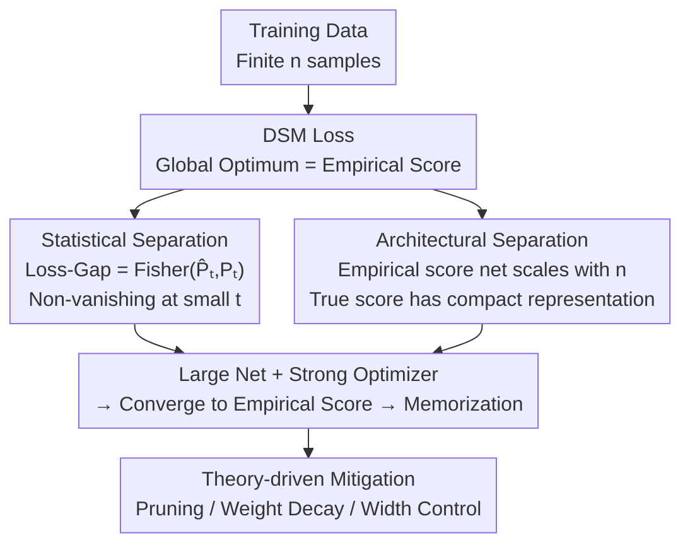

# Provable Separations between Memorization and Generalization in Diffusion Models

**Conference**: ICLR 2026  
**OpenReview**: [https://openreview.net/forum?id=42gfTZzyvV](https://openreview.net/forum?id=42gfTZzyvV)  
**Code**: TBD  
**Area**: Diffusion Models / Learning Theory  
**Keywords**: Diffusion Models, Memorization, Denoising Score Matching, Fisher Divergence, Network Approximation

## TL;DR
This paper proves from two complementary perspectives, "statistical estimation" and "network approximation," that memorization in diffusion models (reproducing training samples rather than generalizing) fundamentally stems from two provable "separations" between the true score function and the empirical score function: the true score does not minimize the denoising score matching loss, and the empirical score requires a network that scales with the number of samples to approximate. Based on this, a pruning mitigation method for DiT is proposed.

## Background & Motivation
**Background**: Diffusion models rely on estimating the score function $\nabla\log p_t$ for reverse denoising sampling. The training objective is the denoising score matching (DSM) loss. They are SOTA generators for tasks involving images, molecules, and time series.

**Limitations of Prior Work**: However, diffusion models suffer from "memorization"—replicated training samples instead of generating new ones—which compromises creativity and introduces privacy and copyright risks. Numerous empirical studies have observed that memorization is related to data duplication, network capacity, and training pipelines, proposing heuristic mitigations like deduplication, modified objectives, or altered sampling. However, a principled explanation for "why these methods work" is lacking.

**Key Challenge**: Most existing theoretical analyses are **asymptotic** (where the number of samples $n$ grows proportionally with the dimension $d$), failing to explain why memorization emerges in **practical finite-sample** scenarios. The root of the problem lies in the fact that training uses the empirical distribution $\widehat{P}_{\text{data}}$ instead of the true distribution $P_{\text{data}}$. The empirical score function $\nabla\log\widehat{p}_t$ is precisely the **global minimum** of the DSM loss—a sufficiently powerful optimizer naturally pulls the network toward this solution that leads to memorization.

**Goal**: To "disentangle" memorization and generalization within practical non-asymptotic, finite-sample regimes and provide actionable mitigation strategies. Specifically, the problem is split into two sub-questions: (1) What is the **statistical** difference between the true and empirical scores? (2) What is the difference in their **network representation complexity**?

**Core Idea**: Characterize memorization using "dual-separation." From the estimation side, it is proven that the true score does not minimize the DSM loss (there is a non-negligible Loss-Gap). From the approximation side, it is proven that the empirical score requires a network scaling with $n$, while the true score has a compact representation. Together, these separations explain "why large networks + strong optimizers = memorization" and directly point toward mitigation methods such as pruning, weight decay, and width control.

## Method

### Overall Architecture
This paper is not a training pipeline but a set of theoretical analyses centered on "true score $\nabla\log p_t$ vs. empirical score $\nabla\log\widehat{p}_t$," plus a theory-derived mitigation algorithm. The logical thread is: first, show on the **estimation side** that the empirical score (the source of memorization) is the optimal solution for the DSM loss, and the true score deviates from it by a non-vanishing Loss-Gap. Next, show on the **approximation side** that the empirical score is difficult to represent (network size grows with $n$), while the true score is easy to represent (compact). The overlay of these two separations provides the complete causal chain: "Large network + Strong optimizer → Convergence to empirical score → Memorization." Finally, following the observation that the true score is more Lipschitz and compact, a pruning method that restricts network capacity is proposed to pull the model from the empirical score back toward the true score.

Data assumptions are unified as **sub-Gaussian Hölder densities** ($p(x)=\exp(-C\|x\|_2^2/2)\cdot f(x)$, where $f$ is $\beta$-Hölder and has a positive lower bound), instantiated by well-separated mixture distributions $P_{\text{data}}=\frac{1}{K}\sum_k P^{(k)}$ to provide computable lower bounds.

### Key Designs

**1. Statistical Separation: The True Score Does Not Minimize the Denoising Score Matching Loss**

This addresses the pain point of "where exactly the source of memorization lies in the training objective." The paper defines a per-timestep loss difference $\text{Loss-Gap}_t=\frac{1}{n}\sum_i\left(\ell_t(x_i,\nabla\log p_t)-\ell_t(x_i,\nabla\log\widehat{p}_t)\right)$, which is the DSM loss at the true score minus the loss at the empirical score. The critical first step (Proposition 4.1) equates this seemingly complex quantity to a **Fisher divergence**:

$$\text{Loss-Gap}_t=\text{Fisher}(\widehat{P}_t,P_t)=\mathbb{E}_{X\sim\widehat{P}_t}\big[\|\nabla\log\widehat{p}_t(X)-\nabla\log p_t(X)\|_2^2\big].$$

Note that this expectation is taken under the **empirical distribution** $\widehat{P}_t$, not the true distribution—this is the opposite direction of standard generalization bounds (which evaluate under $P_t$), so existing generalization analyses cannot be directly applied. The second step (Theorem 4.3) provides a **lower bound** under the mixture model + separation assumption $\Delta_{\min}=\Theta(\sqrt{d})$: when $\log n=O(d)$, for all $t$ in a small-$t$ interval,

$$\mathbb{E}_D[\text{Loss-Gap}_t]=\Omega\!\big(d\,\sigma_t^{-2}+\mathrm{tr}(\Sigma)\big).$$

The $d\sigma_t^{-2}$ term comes from Gaussian noise injected during the forward process, and the $\mathrm{tr}(\Sigma)$ term comes from intra-component variance. The intuitive meaning is that with polynomial sample sizes, the Loss-Gap **does not vanish** in the small-$t$ interval; the larger the variance and the higher the dimension, the larger the gap (because samples are sparser and $\widehat{P}_t$ is further from $P_t$). Although it vanishes as $n\to\infty$, the convergence rate $n^{-1/d}$ is hindered by the curse of dimensionality. The conclusion is counter-intuitive but explanatory: the true score is not the DSM optimum, and strong optimizers (Adam/AdamW) actively push a sufficiently expressive network toward the empirical score, causing memorization—this is the provable source of memorization at the objective level.

**2. Architectural Separation: True Scores Have Compact Representations, Empirical Scores Require Networks Scaling with Sample Size**

The first separation only shows that "strong optimizers want to learn the empirical score," but it leaves a question: does the network **have the capacity** to learn the empirical score? This design addresses representation complexity. Using a feedforward ReLU network $\mathcal{F}(W,L,N)$ (width, depth, non-zero parameters), the paper provides approximation guarantees (Theorem 5.1): there exist networks $s_1, s_2$ that approximate the empirical and true scores with errors $\epsilon/\sigma_t^4$ and $\epsilon/\sigma_t^2$, respectively, but with distinct configurations:

$$W_1=\widetilde{O}(n\log^3\epsilon^{-1}),\;N_1=\widetilde{O}(n\log^4\epsilon^{-1});\qquad W_2=\widetilde{O}(\epsilon^{-\frac{d}{2\beta}}\log^7\epsilon^{-1}),\;N_2=\widetilde{O}(\epsilon^{-\frac{d}{2\beta}}\log^9\epsilon^{-1}).$$

The key comparison is that the network width $W_1$ and parameter count $N_1$ needed to approximate the empirical score are **linearly proportional to the sample size $n$** (because the empirical score corresponds to a Gaussian mixture with $n$ components), whereas the network for the true score depends only on $\epsilon^{-d/(2\beta)}$ and is **independent of $n$**. This separation has two elegant corollaries: (a) **Sample duplication exacerbates memorization**—if $m$ samples are duplicates of the other $n-m$, the effective data scale drops to $n-m$, making the empirical score easier to represent and learn, theoretically explaining the "duplication → memorization" observed by Somepalli et al. (b) **Sensitivity to $t$ differs**—$\widehat{P}_{\text{data}}$ corresponding to the empirical score has no smooth density and is highly irregular and difficult to represent as $t\to 0$, whereas the true score remains regular due to the sub-Gaussian Hölder assumption. This explains why large networks and small $t$ lead to memorization.

**3. From Separation to Mitigation: Lipschitz Comparison-Driven Pruning/Weight Decay**

The first two separations are not just diagnostic; they point directly to treatments. The paper calculates the Hessian of the scores (the second derivative of the log-density) $\nabla^2\log p_t(x_t)=-\frac{1}{\sigma_t^2}I+\frac{\alpha_t^2}{\sigma_t^4}\mathrm{Cov}[X_0|X_t=x_t]$ and compares their Lipschitz coefficients: the Lipschitz upper bound for the empirical score is $\Omega(\sigma_t^{-4}\cdot\min_{i\neq j}\|x_i-x_j\|_2^2)$ (explodes at small $t$), while for the true score (e.g., Gaussian $\mathcal{N}(\mu,\Sigma)$), $\|\nabla^2\log p_t\|_2=\frac{1}{\sigma_t^2+\alpha_t^2\lambda_{\min}(\Sigma)}=O(1)$, which is mild for any $t$. This means: **by restricting the smoothness/capacity of the network, it becomes difficult to represent the highly irregular empirical score, forcing the network to transition back toward the true score**. Accordingly: (a) **Weight decay** directly controls the Lipschitz constant by penalizing the weight Frobenius norm. (b) **One-time pruning** (Algorithm 1) for trained DiT: identify the least contributing attention heads based on importance scores in the small-$t$ interval (sampling $\mathcal{T}=\text{Beta}(0.8,2)$ to bias toward small $t$), prune a ratio $\eta$ (experimentally 20%), and fine-tune. This forces the remaining heads to reconstruct data with lower capacity, encouraging the learning of the true score over overfitting the empirical score. This is plug-and-play and requires no retraining.

### Loss & Training
The analysis target is the DSM loss for continuous-time diffusion $\widehat{L}(s)=\int_{t_0}^{T}\frac{1}{n}\sum_i\ell_t(x_i,s)\,dt$, where $\ell_t(x_i,s)=\mathbb{E}_{X_t|X_0=x_i}\big[\|-\frac{X_t-\alpha_t x_i}{\sigma_t^2}-s(X_t,t)\|_2^2\big]$, with $\alpha_t=e^{-t/2}$, $\sigma_t^2=1-e^{-t}$, and $t_0$ as the early stopping time to prevent score explosion. Actionable knobs for mitigation include appropriate network width, weight decay rates, and pruning biased toward small $t$ (pruning rate $\eta$, fine-tuning steps $M$).

## Key Experimental Results

### Main Results
A DiT was trained on 5,000 randomly selected samples from CIFAR-10, with a pruning rate $\eta=20\%$, compared against the original model and random pruning (mean ± std over 5 runs):

| Model | Precision ↑ | Recall ↑ | Memorization Fraction (%) ↓ | FID ↓ |
|------|------------|---------|----------------|-------|
| Original | 0.39±0.01 | 0.08±0.01 | 73.82±1.12 | 15.47±0.28 |
| **Ours (Pruned)** | 0.33±0.02 | **0.12±0.01** | 68.58±0.77 | **15.07±0.33** |
| Random Pruning | 0.30±0.02 | 0.09±0.01 | **66.87±0.94** | 17.14±0.25 |

Both pruning methods reduce memorization, but our method achieves the highest **Recall** (better diversity/coverage) while maintaining a **competitive FID**. Random pruning has the lowest memorization fraction, but FID significantly worsens. The slight drop in Precision is expected, as high memorization "inflates" Precision by replicating training samples.

### Ablation Study
Factor analysis on Gaussian mixture data ($K=8$):

| Configuration | Phenomenon | Description |
|------|------|------|
| Network Scale 24K→44M | Memorization fraction increases monotonically with scale | Larger networks memorize more, validating architectural separation. |
| Sample Size 1K→100K | Memorization fraction decreases as $n$ increases | More samples are harder to duplicate. |
| Dimension $d$ 8→64 | Memorization is lower in high dimensions | Data is harder to copy. |
| Width + Weight Decay (n=3.2K) | Moderate width + appropriate weight decay → suppressed memorization, improved log-likelihood | With small samples, wide nets/light weight decay lead to high memorization. |

### Key Findings
- **Sample size, network scale, and dimension together determine memorization**: Large net + small sample + low dimension = easiest to memorize, corresponding one-to-one with the dual-separation theory.
- **Weight decay is a double-edged sword**: With sufficient samples (n=10K), strong weight decay is harmful (suppresses generalization); with insufficient samples (n=3.2K), appropriate weight decay + suitable width are needed to both prevent memorization and improve generalization—mitigation depends on sample/capacity ratios.
- 2D visualization ($K=4$) demonstrates the phase transition from underfitting → partial generalization → memorization as scale increases.

## Highlights & Insights
- **Equating Loss-Gap to Fisher divergence** is the pivot of the paper: a quantity that was difficult to calculate and entangled with loss evaluation on empirical points is cleanly translated into Fisher divergence, for which many tools exist. The direction is the opposite of standard generalization bounds—this "asymmetry" insight makes the lower bound analysis feasible.
- **"Duplication → Effective sample size drop → Empirical score easier to represent → Easier to memorize"** is an elegant theoretical explanation, giving a first-principles basis to a pure empirical observation (deduplication mitigates memorization) via network approximation complexity.
- **Diagnosis and treatment are homologous**: The same Lipschitz/capacity comparison both explains why memorization occurs and directly derives three practical methods—controlling width, weight decay, and pruning small-$t$ importance heads. The chain from theory to method is very complete and transferable to any score-based generative model.

## Limitations & Future Work
- The authors acknowledge that the theory only covers sub-Gaussian mixtures and has **not been extended to heavy-tailed distributions**; the pruning method was **not fully validated on larger datasets/models** due to computational constraints.
- Limitations observed: The core lower bound depends on a well-separated assumption $\Delta_{\min}=\Theta(\sqrt{d})$ and $\log n=O(d)$; its validity on highly overlapping real-world data manifolds remains questionable. The memorization criterion (nearest neighbor distance ratio $\le 1/9$) is a Euclidean heuristic and might miss memorization that is perceptually similar but pixel-wise different. The memorization fraction of 5,000 samples on CIFAR-10 is naturally high (73.82%), which differs from the low-memorization regime of real-world large-scale training.
- Future work: Extend separation theory to conditional diffusion/text-to-image (where memorization is more critical) and combine "small-$t$ importance pruning" with orthogonal methods like text trigger token exclusion.

## Related Work & Insights
- **vs. Buchanan et al. (2025, On the edge of memorization)**: They demonstrate a sharp phase transition from generalization to memorization as capacity increases using a specific denoiser parameterized by Gaussian mixtures under well-separated assumptions. This paper holds for **general sub-Gaussian distributions** and additionally provides **architectural separation** on the network approximation side, followed by mitigation methods.
- **vs. Statistical Physics/Asymptotic Analysis (Biroli et al. 2024, George et al. 2025, Bonnaire et al. 2025)**: They mostly analyze phase transitions and learning curves in the asymptotic limit where $n, d$ grow proportionally or under random feature denoisers. This paper provides **non-asymptotic, finite-sample** analysis, which is closer to practical training.
- **vs. Pruning/Neuron Localization Mitigations (Hintersdorf et al. 2024, Chavhan et al. 2024)**: They perform pruning by locating "neurons responsible for memorization." The pruning in this paper is directly driven by Theorems 4.3/5.1 (pruning low-contribution attention heads in the small-$t$ interval to suppress capacity); the motivation stems from provable capacity-memorization relationships rather than pure heuristics.

## Rating
- Novelty: ⭐⭐⭐⭐⭐ First to provide dual provable "statistical + architectural" separations for memorization in finite samples; the characterization of Loss-Gap as Fisher divergence is clever.
- Experimental Thoroughness: ⭐⭐⭐⭐ Solid factor analysis on Gaussian mixtures and validation on CIFAR-10, but small in scale and lacks validation on large models/data.
- Writing Quality: ⭐⭐⭐⭐⭐ The theoretical thread (estimation → approximation → Lipschitz → mitigation) is well-structured; assumptions and theorems are clearly stated.
- Value: ⭐⭐⭐⭐⭐ Provides a first-principles explanation for memorization and directly translates theory into plug-and-play mitigation, carrying practical significance for privacy and copyright security in diffusion models.

<!-- RELATED:START -->

## Related Papers

- [\[ICLR 2026\] On the Interpolation Effect of Score Smoothing in Diffusion Models](on_the_interpolation_effect_of_score_smoothing_in_diffusion_models.md)
- [\[ICLR 2026\] Quotient-Space Diffusion Models](quotient-space_diffusion_models.md)
- [\[ICLR 2026\] Polynomial Convergence of Riemannian Diffusion Models](polynomial_convergence_of_riemannian_diffusion_models.md)
- [\[ICLR 2026\] Implicit Regularisation in Diffusion Models: An Algorithm-Dependent Generalisation Analysis](implicit_regularisation_in_diffusion_models_an_algorithm-dependent_generalisatio.md)
- [\[ICLR 2026\] Diffusion Language Models are Provably Optimal Parallel Samplers](diffusion_language_models_are_provably_optimal_parallel_samplers.md)

<!-- RELATED:END -->
