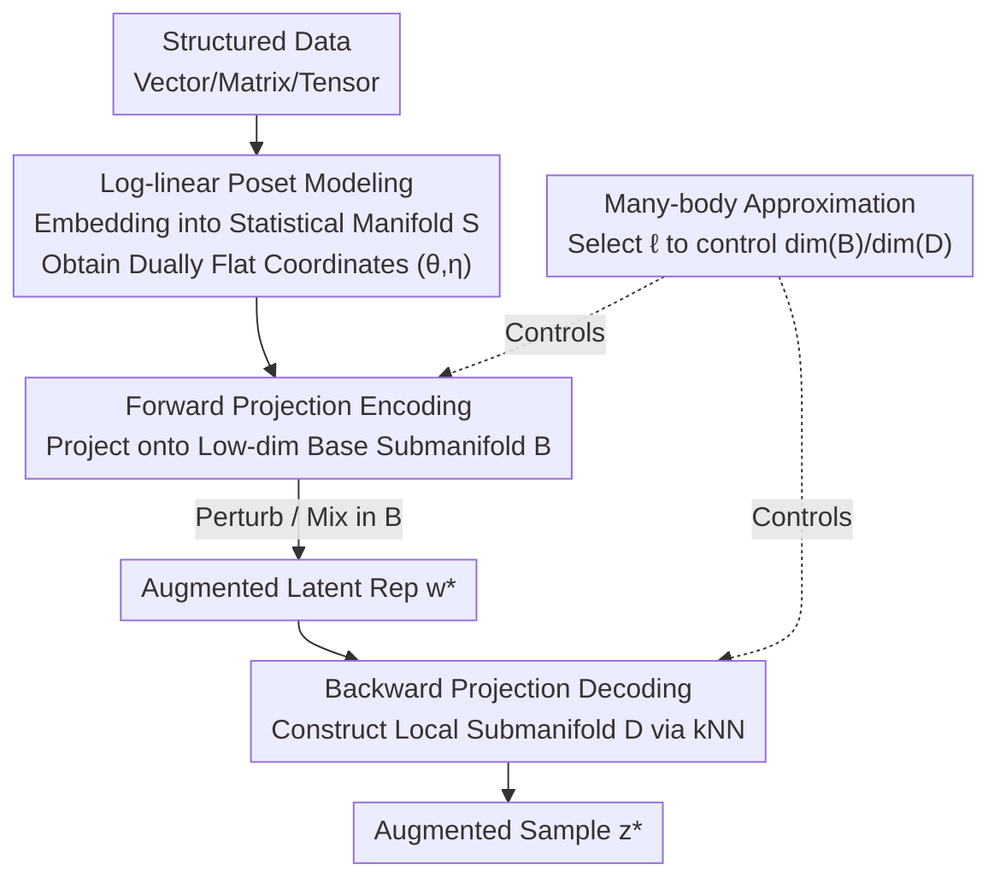

# Pseudo-Non-Linear Data Augmentation: A Constrained Energy Minimization Viewpoint

**Conference**: ICLR 2026  
**OpenReview**: [https://openreview.net/forum?id=p9A1oyktVB](https://openreview.net/forum?id=p9A1oyktVB)  
**Code**: TBD  
**Area**: Learning Theory / Information Geometry / Data Augmentation  
**Keywords**: Information Geometry, Energy Models, Poset Log-Linear Models, Projection Theory, Learning-free Data Augmentation

## TL;DR
Starting from information geometry and energy models, this paper embeds data onto a dually flat statistical manifold and mimics an autoencoder via "forward projection encoding + backward projection decoding." It proposes PNL, a **training-free, controllable, and cross-modal** data augmentation method that achieves comparable or superior accuracy to generative/classical augmentation on multiple downstream classification tasks while significantly reducing variance.

## Background & Motivation
**Background**: Recent data augmentation methods heavily rely on generative models (VAEs, GANs, Diffusion Models) to synthesize new samples by learning a latent space to represent data and performing sampling/interpolation within it.

**Limitations of Prior Work**: Generative augmentation faces three fundamental contradictions. First, the "paradox"—data augmentation is most needed when training data is scarce, yet this is precisely when pre-trained foundation models are unavailable, and training a generative model from scratch encounters data insufficiency again. Second, **computational overhead**—effective augmentation often requires generating samples of the same magnitude as the original dataset, making large-scale sampling from deep generative models costly. Third, **poor interpretability and controllability**—even if generation quality is high, it is difficult to understand the transformations the augmented samples undergo, making fine-grained control hard in high-risk scenarios.

**Key Challenge**: Classical learning-free methods (like PCA or SVD for linear dimensionality reduction) are transparent and controllable but fail at the **inverse problem**—without a learned decoder, it is difficult to reconstruct high-dimensional data from low-dimensional representations. While manifold learning (t-SNE, Isomap, UMAP) provides nonlinear generalizations, recovering an invertible low-dimensional manifold almost always requires learning mechanisms, sacrificing interpretability. Thus, a long-term trade-off exists between "controllable transparency" and "nonlinear expressive power + invertible decoding."

**Goal**: To construct an augmentation algorithm that is learning-free, efficient, controllable, and cross-modal while retaining nonlinear expressive power and invertible decoding capabilities.

**Key Insight**: The authors observe that the projection theory of **dually flat statistical manifolds** in information geometry naturally possesses a duality: it is "linear in intrinsic coordinates but nonlinear in the ambient space." Both forward and backward projections can be formulated as convex optimizations and solved efficiently using first-order methods. By modeling data as discrete probability distributions on partially ordered sets (log-linear models), this geometric structure can be explicitly established without training any generators.

**Core Idea**: Replacing "generative models" with "poset log-linear models + dual projections" for encoding-decoding to construct a geometry-aware, explicitly controllable latent space. Since the projection is linear in intrinsic coordinates but nonlinear in the ambient space, it is termed **pseudo-non-linear (PNL) data augmentation**.

## Method

### Overall Architecture
The method mimics an autoencoder in its structure: given a dataset, each sample is first **embedded** into a statistical manifold $S$ (becoming a discrete probability distribution on a poset). It is then encoded into a low-dimensional base submanifold $B \subseteq S$ via **forward projection** to obtain a latent representation. Simple augmentation operations (perturbation or linear mixing) are performed within $B$ to generate a new latent representation $w^*$. Finally, **backward projection** decodes it back to the data space to obtain the augmented sample $z^*$. The key is that embedding, forward projection, and backward projection are all geometric/convex optimization operations without any networks requiring training.

The pipeline is established in four steps: ① Model structured data (vectors/matrices/tensors) as a **real-valued poset**, where the partial order captures relationships between features; ② Embed the real-valued poset into a discrete probability distribution $p_\theta$ on $S$ via $\varphi$, where the probability of each element is the "energy" of that feature; ③ Calculate dually flat coordinates $(\theta, \eta)$ for $p_\theta$ using the poset log-linear model; ④ Complete the encoding-augmentation-decoding cycle on this geometry.

### Key Designs

**1. Poset Log-Linear Model: Embedding arbitrary structured data into dually flat manifolds**

This step directly addresses the need to "construct a geometry-aware latent space without learning." The authors associate each data element $x$ with an element of a poset $\Omega$. The partial order $\leq$ is defined by the natural structure of the data or prior knowledge (e.g., a $D$-dimensional vector corresponds to the natural order of $\Omega=[D]$; tensor indices use element-wise $\leq$). A log-linear model recursively defines natural parameters: $\log p(x) = \sum_{y \leq x}\theta(y)$. This constitutes an exponential family, hence all discrete distributions on $\Omega$ forms a $(|\Omega|-1)$-dimensional **dually flat statistical manifold** $S$, equipped with dual coordinates $(\theta, \eta)$, a Riemann metric $g=\nabla^2\psi(\theta)$, and Bregman divergence. Intuitively, $\theta(x)$ specifies the energy of feature $x$, while the poset structure specifies the coupling between energies of different features. Unlike PCA/SVD which only find an Euclidean linear subspace, the geometry here is determined by the poset structure and embedding $\varphi$, allowing the encoding of arbitrary prior feature relationships, which is the source of "controllability."

**2. Forward Projection Encoding: Dimensionality reduction via dual projection**

While the embedding $\varphi$ preserves dimensionality, reduction is achieved through projection theory. A key property of dually flat manifolds is that for any point $p\in S$, there exists a **unique** point on an e-flat (or m-flat) submanifold $B\subseteq S$ that minimizes the dual Bregman divergence (i.e., KL divergence $D_{KL}(p,q)$). This is the m-projection, solvable efficiently via convex optimization. Thus, encoding is defined as $\mathrm{Enc} := \mathrm{Proj}_B \circ \varphi: \Omega_R \to B$, compressing samples onto a low-dimensional base submanifold $B$ ($\dim(B)\ll\dim(S)$). Since the projection is unique and smooth when $B$ is flat, the encoding is well-defined and stable; minimizing KL divergence is equivalent to energy minimization, ensuring that "energy-wise least important" information is discarded—hence the title "Constrained Energy Minimization."

**3. Backward Projection Decoding: Using the dataset as anchors for inversion**

The encoding $\mathrm{Enc}(\cdot)$ is not invertible; mathematically, no perfect decoder exists (even for simple linear projections in Euclidean space). The authors' solution is based on the observation that "similar data have similar projections": given a latent point $w^*\in B$, they first find its $k$-nearest neighbors $N$ in the set of projections of existing samples $\{w_i=\mathrm{Proj}_B(z_i')\}$. These neighbors' pre-images $z_i'$ are used to construct a **local data submanifold** $D$, and $w^*$ is projected onto $D$ to obtain the inverse image $z'^* := \mathrm{Proj}_D(w^*)$. The construction of $D$ is flexible: for instance, given the nearest neighbor $z_{i^\star}'$, one can define an e-flat $D$ by fixing certain $\theta$ coordinate values, explicitly controlling the degrees of freedom in reconstruction. Decoding is $\mathrm{Dec} := \varphi^{-1}\circ \mathrm{Proj}_B^{-1}: B\to\Omega_R$. This backward projection is data-centric, geometrically intuitive, and theoretically guaranteed to minimize divergence when projecting to $D$—avoiding the need for trained decoders in manifold learning while preserving invertibility.

**4. Submanifold Design via Many-Body Approximation: Explicitly regulating information retention and freedom via $\ell$**

A dual trade-off exists in selecting the dimensions of $B$ and $D$: a larger $\dim(B)$ retains more information forward and aids reconstruction backward, but if $\dim(B)\approx\dim(S)$, the augmentation step suffers from the curse of dimensionality; a larger $\dim(D)$ increases backward degrees of freedom for augmentation, but if $\dim(D)\approx\dim(S)$, the backward projection is unconstrained and produces noise. The authors provide a principled design using **many-body approximation**: an $\ell$-body approximation retains only $\ell$-th order modal interactions. The base submanifold is defined as:

$$M_\ell := \{\theta \in \mathbb{R}^{\dim(S)} \mid \theta_x = 0 \text{ for all non } \ell\text{-body parameters } x\in\Omega\}$$

This sets all modal interactions higher than order $\ell$ to zero. The local data submanifold is constructed as its "dual"—fixing each $\ell$-body parameter to the average of neighbors and freeing the rest:

$$M_\ell^*(N) := \Big\{\theta \in \mathbb{R}^{\dim(S)} \mid \theta_x = \tfrac{1}{k}\sum_{i^*\in N}\big(\theta(z_{i^*}')\big)_x \text{ for all } \ell\text{-body parameters } x\Big\}$$

This ensures the physical meaning of each latent dimension is clear (the $\ell$-th dimension corresponds to the $\ell$-th order interaction), allowing precise control over "what to keep and what to release" by choosing $\ell$. For example, for MNIST, $B=M_1, D=M_1^*$ preserves shape information; for CIFAR, after reshaping color images into high-order tensors, $B=M_5, D=M_4^*$ preserves both fine-grained shape and color relationships. Furthermore, under many-body approximation, the gradient of the convex optimization has a closed-form solution, making the projection solvable in polynomial time over $B$ non-fixed variables—this is the source of "efficiency."

### A Complete Example: Augmentation on a Positive Tensor
Consider a color image (3rd-order tensor $T\in\mathbb{R}^{I_1\times I_2\times I_3}$): indices $v=(i_1,i_2,i_3)$ define a natural poset via element-wise $\leq$. The normalized positive tensor $P'_v = P_v / \sum_w P_w$ becomes a distribution on $S$. Forward projection to $B=M_5$ (dim(B)=1410) yields latent representation $w_i$. Linear mixing of a sample pair in $B$ produces $w^*$. Backward projection finds the kNN of $w^*$ and projects it onto $D=M_4^*$ (dim(D)=2334) to get $z'^*$, which is mapped back to the augmented image $z^*$ using the inverse of the average scaling ratio among neighbors as $\varphi^{-1}$. Results show that an ostrich image preserves fine-grained shape-color relationships like eye/beak color and background flowers, while coarse, shapeless background colors drift—corresponding to the information selected to be kept/released by the $\ell=5/4$ design.

## Key Experimental Results

### Main Results
Downstream classification was conducted across multiple modalities: image (MNIST, CIFAR-10), audio (Speech Commands), and tabular (Connectionist Bench, Taiwanese Bankruptcy, Wine Quality). Augmentation size was 20% of the original training set. Classifiers used ResNet-18 / M5 / MLP, evaluated on 20 bootstrap test subsets.

| Training Set | MNIST | CIFAR-10 | Speech Cmd | Connect. Bench | Taiwan. Bank. | Wine Quality |
|--------|-------|----------|-----------|----------------|---------------|--------------|
| OG (Original) | 97.98±0.19 | 88.57±0.57 | 84.48±0.50 | 88.10±8.58 | 96.54±0.56 | 55.00±1.69 |
| OG+STD | 97.98±0.24 | **89.89±0.44** | 82.98±0.50 | 85.24±7.66 | 96.17±0.57 | 57.85±1.81 |
| **OG+PNL (Ours)** | 97.91±0.21 | 88.07±0.46 | **84.35±0.37** | **93.81±4.54** | 96.53±0.47 | **59.03±1.74** |
| OG+AE | 97.97±0.25 | 88.36±0.46 | 83.13±0.32 | 82.86±7.59 | 95.92±0.62 | 57.23±1.67 |
| OG+MU (mixup) | 96.45±0.23 | 86.60±0.49 | 81.85±0.61 | 89.29±4.97 | 96.55±0.68 | 57.76±1.67 |
| OG+MMU (manifold mixup) | 97.52±0.30 | 88.02±0.39 | 83.06±0.54 | 91.19±5.06 | 96.44±0.53 | 58.70±1.74 |

PNL consistently outperforms other learning-based/learning-free baselines on all datasets except images. Image is the only exception—where all non-STD augmentations underperform OG/STD. The authors interpret this as STD (crop, flip, rotate, affine) explicitly forcing the classifier to learn rotation/translation/color invariance, while other augmentations act more like general regularizers.

### Key Findings
- **Significant Variance Reduction is a Core Selling Point**: In Connectionist Bench (only 208 samples, 60 features), OG/STD/AE shown high accuracy standard deviations (7.6%~8.6%), while PNL reduced it to **4.54%**, the lowest among all methods. This low-variance trend appeared consistently across all datasets, indicating more stable generalization in small-sample regimes.
- **Energy Verification** (Synthetic Data): The degree of modal interactive retention can be intuitively controlled by choosing the submanifold order; even if 1-body capacity is insufficient for strong interactions, it captures the essence within its capacity in the "minimum energy" sense.
- **Geometric Advantage**: Interpolation within the base submanifold (energy-aware) consistently results in lower interaction energy compared to ambient space interpolation, suggesting that interpolation under this geometry is "more energy-efficient" and natural.
- **Controllability** (MNIST/CIFAR): Selective retention of shape or shape+color information is achieved through deliberate tensor reshaping and many-body approximation, proving that designing $\ell$ allows for fine-grained control of augmentation results.

## Highlights & Insights
- **Dual Projections in Information Geometry as Encoder-Decoders**: Projections are linear in intrinsic coordinates but nonlinear in the ambient space, providing both nonlinear expressive power and convex solvability. This bypasses the dilemma between "poor controllability of generative models" and "irreversibility of linear reduction."
- **kNN-constructed Local Data Submanifold for Inversion**: Based on the observation that "the dataset itself is the inverse of the projection," the non-invertible encoding is approximated by data-centric backward projection with theoretical guarantees of minimum divergence. This transforms the inverse problem of manifold learning into a geometric projection task.
- **$\ell$-body and its dual $M_\ell^*$ provide interpretable latent dimensions**: Each dimension corresponds to a clear modal interaction order. Feature relationships can be managed by reshaping tensors, making the method highly transferable—this "energy decomposition + many-body approximation" can be applied to any structured data (time series, tables, tensors) that can be modeled as a poset.
- The entire process is training-free with closed-form gradients for convex optimization, making it more viable than generative augmentation in small-data or high-risk scenarios.

## Limitations & Future Work
- **No modeling of permutation invariance**: The framework relies on specifying a partial order on the index set and cannot naturally capture invariance under index permutation, potentially introducing unnecessary bias in graph data; however, this bias is explicitly visible and correctable.
- **Limited gain in image modality**: PNL underperforms standard geometric augmentation on MNIST/CIFAR-10, suggesting that for modalities with strong natural spatial invariance, explicit geometric transformations remain more effective. The advantage of PNL lies in small-sample tabular and audio data.
- **Dependence on Poset and Embedding Design**: Performance heavily depends on the manual selection of poset structure $\Omega$, embedding $\varphi$, and order $\ell$, lacking an automated selection mechanism. Different modalities require specialized reshaping and submanifold designs.
- **Scalability concerns**: $\dim(S)$ expands with tensor scale. Despite polynomial-time projection, the actual overhead and kNN search costs for large-scale high-order tensors require more systematic evaluation.

## Related Work & Insights
- **vs. Generative Augmentation (VAE/GAN/Diffusion, AE baseline)**: These methods learn a latent space and sample from it, hindered by the "train-before-augment" paradox, computational cost, and poor interpretability. This work is learning-free, utilizes convex optimization, has clear physical meanings for latent dimensions, and offers better accuracy and lower variance on tabular/audio data.
- **vs. Linear Dimensionality Reduction (PCA/SVD)**: Classical learning-free methods only find Euclidean linear subspaces and face difficulty in the inverse problem. This work uses nonlinear projections on dually flat manifolds + data-centric backward projection to be both nonlinear and invertible.
- **vs. Mixup / Manifold Mixup**: Mixup performs heuristic mixing in the original space, limiting its application; manifold mixup uses the latent space learned by the downstream task, sacrificing interpretability. This work performs mixing in an explicit geometric latent space, offering transparency, controllability, and lower variance.

## Rating
- Novelty: ⭐⭐⭐⭐⭐ Combining information geometry dual projections + poset log-linear models into a learning-free augmenter is a highly original perspective.
- Experimental Thoroughness: ⭐⭐⭐⭐ Coverage across image/audio/tabular modalities with energy/controllability verification, though lacking comparisons against large-scale models or stronger generative baselines.
- Writing Quality: ⭐⭐⭐⭐ Theoretical exposition is clear and diagrams are well-placed, though the barrier to entry for information geometry is high and some derivations rely on the appendix.
- Value: ⭐⭐⭐⭐ Provides a controllable, low-variance, training-free augmentation solution practical for small-sample or high-risk scenarios.

<!-- RELATED:START -->

## Related Papers

- [\[ICLR 2026\] Optimizing Data Augmentation through Bayesian Model Selection](optimizing_data_augmentation_through_bayesian_model_selection.md)
- [\[ICLR 2026\] Data-to-Energy Stochastic Dynamics](data-to-energy_stochastic_dynamics.md)
- [\[ICLR 2026\] Oracle-Efficient Hybrid Online Learning with Constrained Adversaries](oracle-efficient_hybrid_learning_with_constrained_adversaries.md)
- [\[ICLR 2026\] Online Inventory Optimization in Non-Stationary Environment](online_inventory_optimization_in_non-stationary_environment.md)
- [\[ICLR 2026\] Online Conformal Prediction with Adversarial Semi-bandit Feedback via Regret Minimization](online_conformal_prediction_with_adversarial_semi-bandit_feedback_via_regret_min.md)

<!-- RELATED:END -->
