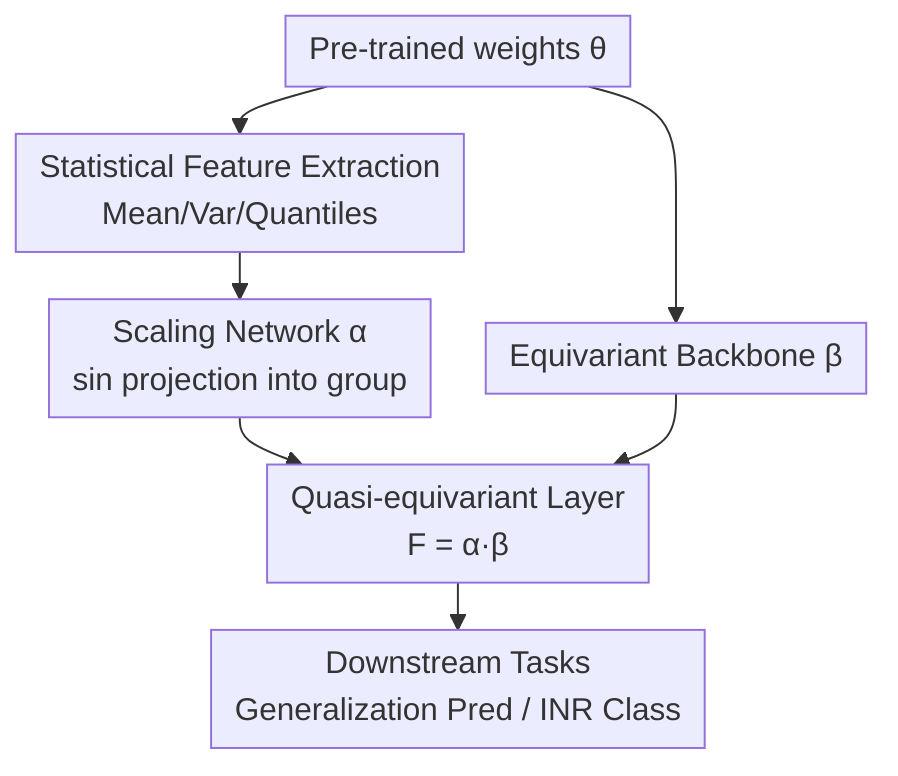

# Quasi-Equivariant Metanetworks

**Conference**: ICLR 2026  
**OpenReview**: [https://openreview.net/forum?id=XMiDpi2mWY](https://openreview.net/forum?id=XMiDpi2mWY)  
**Code**: To be confirmed  
**Area**: Learning Theory / Weight Space Learning / Equivariant Networks  
**Keywords**: Metanetworks, Functional Equivalence, Maximal Symmetry Group, Quasi-Equivariant, Weight Space Learning

## TL;DR
To address the issue that "metanetworks become sparse and limited in expressivity when strictly equivariant," this paper proposes **quasi-equivariance**: relaxing the requirement "output follows the same group transformation as the input" to "output follows a **data-dependent** group transformation," thereby liberating expressivity while strictly preserving functional equivalence. This is implemented as a learnable group-valued scaling layer $\alpha(\theta)$ layered on an existing equivariant backbone $\beta(\theta)$. With only 3–5% additional parameters, it achieves consistent performance gains on benchmarks such as CNN/Transformer generalization prediction and INR classification.

## Background & Motivation
**Background**: Metanetworks are a class of networks that take "neural network weights" as input to directly perform downstream tasks—predicting the generalization capability of a pre-trained model, classifying Implicit Neural Representations (INRs), performing model editing, etc. Their key constraint stems from **functional equivalence (FE)**: the parameter space is merely a proxy for the function class, where $\theta \mapsto f(\cdot;\theta)$ is not injective. Multiple different sets of weights can implement the **same function** (e.g., permuting two hidden neurons in an MLP and adjusting subsequent edges leaves the function invariant). Thus, a good metanetwork $F$ should depend on the "functional identity" behind the weights rather than a specific parameterization.

**Limitations of Prior Work**: Existing approaches typically enforce this invariance via **strict equivariance**—imposing $F(g\theta)=gF(\theta)$ on the metanetwork to make it naturally insensitive to architectural symmetries like permutations, scaling, and sign flips. However, strict equivariance is a hard constraint: it requires element-wise symmetry conservation at the weight level, often forcing the network into **sparse, parameter-constrained, and relatively weak** forms. In other words, model expressivity is sacrificed to "respect symmetry."

**Key Challenge**: What truly must be preserved is not the weights themselves, but the **function** implemented by those weights—i.e., the equivalence class $[\theta]$ defined by the parameters. Strict equivariance is only a **sufficient** condition for preserving functional equivalence, not a necessary one. Mistaking "sufficient" for "necessary" leads to a needless sacrifice in expressivity.

**Goal**: To find a constraint family that is more relaxed than strict equivariance but still guarantees "same function → same output functional identity," and can be implemented as a differentiable, stackable network layer with low parameter overhead.

**Key Insight**: The authors start from the observation of the **maximal symmetry group**—if a group $G$ can characterize all functional equivalences ($[\theta]=G\theta$) excluding a measure-zero set, then "preserving functional identity" can be entirely expressed via group actions, providing room for relaxation.

**Core Idea**: Relaxing the strict "same $g$" of equivariance to a "data-dependent $g'(g,\theta)$"—as long as $g'$ remains within the group $G$, the output stays within the same equivalence class as the original function. The functional identity remains intact, but the mapping itself gains significant freedom.

## Method

### Overall Architecture
The method solves how to construct a metanetwork layer that preserves functional equivalence without being bottlenecked by strict equivariance. This paper proposes representing the metanetwork as the product of two components—an existing **equivariant backbone** $\beta$ and a **learnable group-valued scaling** $\alpha$:

$$F(\theta) = \alpha(\theta)\,\beta(\theta), \qquad \alpha:\Theta \to G,\ \ \beta:\Theta \to \Theta \text{ is equivariant}.$$

Intuitively, $\beta$ is responsible for "organizing weights into a symmetrically coordinated representation," while $\alpha$ **decides an on-the-fly group element** to multiply based on the statistical features of the specific weights. Since $\alpha(\theta)$ is always an element of $G$, $F(g\theta)$ and $F(\theta)$ differ only by a group action, thus preserving functional identity—this is the essence of "quasi-equivariance." The pipeline extracts statistical features from weights, feeds them into a small scaling network to obtain $\alpha$, while passing weights through the equivariant backbone $\beta$. Their product forms the quasi-equivariant layer output for downstream tasks.

### Key Designs

**1. Quasi-equivariance: Relaxing Strict Equivariance to Data-Dependent Group Actions**

Strict equivariance requires $F(g\theta)=gF(\theta)$—if the input undergoes $g$, the output must undergo the **same** $g$. This paper relaxes it to: for any $g\in G, \theta\in\Theta$, there exists a $g'=g'(g,\theta)\in G$ such that

$$F(g\theta) = g'(g,\theta)\,F(\theta).$$

Crucially, $g'$ can **depend on both** $g$ and $\theta$. This does not destroy functional identity because, given $G$ is a **maximal symmetry group**, $[\theta]=[\bar\theta]$ is equivalent to $\bar\theta=g\theta$ for some $g$; thus $F(\bar\theta)=F(g\theta)=g'F(\theta)$, and both sides fall into $[F(\theta)]$. Furthermore, using maximality, quasi-equivariance is shown to be not just sufficient, but **necessary and sufficient** for "preserving function identity"—strict equivariance is merely a special case ($g'\equiv g$). This answers the question: "Is strict equivariance really necessary for metanetworks?" No. Note that **invariance** has no "quasi" version—scalar outputs must remain strictly $F(g\theta)=F(\theta)$. Quasi-equivariance is applied to intermediate layers, followed by a standard invariant layer.

**2. $\alpha \cdot \beta$ Decomposition: Layering Learnable Group Scaling on Equivariant Backbones**

To construct such $F$, the paper provides a **constructive** sufficient form: let $\beta:\Theta\to\Theta$ be a standard equivariant mapping (reusing existing networks like Monomial-NFN or Transformer-NFN), and let $\alpha:\Theta\to G$ be a mapping that outputs **group elements**. Defining $F(\theta)=\alpha(\theta)\beta(\theta)$ makes $F$ naturally quasi-equivariant. This design is **modular**: the heavy lifting of symmetry is handled by $\beta$, while all new degrees of freedom are concentrated in $\alpha$, which is a thin scaling layer with minimal parameter overhead.

**3. Learning Only Continuous Components: Projection via sin**

The group $G$ often contains both discrete and continuous components. The key observation is that **discrete components cannot be learned continuously**. For example, in an FFN, the symmetry group is the product of monomial matrices (one non-zero positive element per row/column). A monomial group decomposes as:

$$G_n = \mathbb{R}_{>0}^{\,n} \rtimes P_n,$$

where $\mathbb{R}_{>0}^n$ represents positive diagonal scaling and $P_n$ represents permutation matrices. Since $\Theta=\mathbb{R}^d$ is connected, its continuous image must be connected. As $P_n$ is discrete, any continuous $\alpha:\Theta\to P_n$ **must be a constant**—the permutation component cannot vary with input and can be ignored. Thus, $\alpha$ operates on the continuous positive diagonal scaling: mapping $\theta$ to an $n$-dimensional vector, applying $\sin$, multiplying by a small $\epsilon>0$, and adding a vector of ones to get $1_n+\epsilon\sin(\cdot)\in\mathbb{R}_{>0}^n$. For multi-head attention, the continuous component is the general linear group $GL(d_h)$, constructed similarly as $I_n+\epsilon\sin(\gamma(\theta))$. The authors avoid $\exp$ as it is slower and numerically unstable.

**4. Statistical Feature Driven Scaling Network**

$\alpha$ does not take all weights as input (which would cause parameter explosion). Instead, it extracts **statistical features**—mean, variance, and quantiles—per layer and feeds these low-dimensional features into a small "scaling network" to output the scaling vectors or matrices. This "statistical features → small MLP → group scale" design is the core of parameter efficiency, adding only ~3.89%–5.27% parameters to standard NFNs.

## Key Experimental Results

### Main Results
Quasi-equivariant layers were embedded into existing backbones (*Quasi*) and compared against original and parameter-increased (Large) versions. The core conclusion is that **minimal parameter increments yield gains superior to simply increasing model size**.

Predicting CNN Generalization (Small CNN Zoo, Kendall’s $\tau$):

| Method | No Aug | U[1,10] | U[1,10³] | Param Increase |
|------|--------|---------|----------|----------|
| HNP | 0.926 | 0.913 | 0.891 | — |
| Monomial-NFN | 0.922 | 0.920 | 0.920 | — |
| Monomial-NFN large | 0.923 | 0.920 | 0.919 | +68.65% |
| **Monomial-NFN Quasi (Ours)** | **0.926** | **0.924** | **0.923** | **+3.89%** |

INR Image Classification (Accuracy %):

| Method | MNIST | CIFAR-10 | FashionMNIST | Param Increase |
|------|-------|----------|--------------|----------|
| Monomial-NFN | 68.43 | 34.23 | 61.15 | — |
| Monomial-NFN tuned | 68.87 | 34.26 | 61.44 | ≈+3% |
| **Monomial-NFN Quasi (Ours)** | **70.21** | **35.32** | **62.11** | ≈+3% |

### Ablation Study
The paper primarily uses the **"Large Version" vs. "Quasi-equivariant Version"** as the critical control experiment to determine if gains come from parameters or the mechanism:

| Comparison | Typical Performance | Note |
|------|---------|------|
| Original Backbone | Baseline | Monomial-NFN / Transformer-NFN |
| Large Version | Slight improvement | Small gains despite +57%–68% parameters |
| **Quasi-equivariant Layer** | Significant/Stable improvement | Outperforms "Large" with only ~3%–5% parameters |

### Key Findings
- **Gains from mechanism, not stacking**: Increasing backbone parameters marginally improves performance, while the quasi-equivariant layer surpasses it with one-tenth of the parameter increment.
- **Robustness to group actions**: Under strong $U[1,10^4]$ scaling augmentation, STATNet and HNP performance collapses, whereas Monomial-NFN Quasi remains stable at 0.924.
- **Cross-Architecture Generality**: The framework applies to both FFN/CNN (monomial groups) and Transformers ($GL$ groups).

## Highlights & Insights
- **"Making constraints dependent" is a clever maneuver**: Moving from $F(g\theta)=gF(\theta)$ to $F(g\theta)=g'(g,\theta)F(\theta)$ upgrades a "sufficient condition" to a "necessary and sufficient" one for preserving function identity.
- **Connectivity argument**: Using "the continuous image of a connected set is connected" to prove that permutation components must be constant elegantly narrows the design space for $\alpha$ to continuous subgroups.
- **sin·ε + Identity projection**: The $I_n+\epsilon\sin(\gamma(\theta))$ trick provides a lightweight way to ensure outputs stay within $\mathbb{R}_{>0}^n$ or $GL(n)$ without the instability of matrix exponentials.

## Limitations & Future Work
- Currently primarily implemented for **linear architectures**; extension to graph-structured metanetworks is not yet explored.
- Whether the symmetry group of an FFN is **truly maximal** for all widths remains an open theoretical question; strict proofs only exist for specific cases.
- Ablations are relatively sparse (lack of component-wise removal for statistical features vs. scaling nets), and $\epsilon$ sensitivity is not systematically reported.

## Related Work & Insights
- **vs. Strictly Equivariant Metanetworks (NFNs)**: NFNs enforce strict symmetry but are sparse and limited. This work uses them as backbones $\beta$ and adds $\alpha$ to recover expressivity.
- **vs. Relaxed Equivariance (Kaba & Ravanbakhsh 2023)**: They require $g'\in gG_x$ (where $G_x$ is the stabilizer). This is essentially a **special case** of the more general $g'(g,\theta)$ framework proposed here.
- **vs. Approximate Equivariance**: Unlike works that allow "$\varphi(gx)\approx g\varphi(x)$" (introducing symmetry errors), this work **exactly** preserves functional identity but relaxes the requirement for the transformation to be the "same $g$."

## Rating
- Novelty: ⭐⭐⭐⭐⭐ 
- Experimental Thoroughness: ⭐⭐⭐⭐ 
- Writing Quality: ⭐⭐⭐⭐ 
- Value: ⭐⭐⭐⭐ 

<!-- RELATED:START -->

## Related Papers

- [\[ICLR 2026\] On Universality of Deep Equivariant Networks](on_universality_of_deep_equivariant_networks.md)
- [\[ICLR 2026\] Reducing Symmetry Increase in Equivariant Neural Networks](reducing_symmetry_increase_in_equivariant_neural_networks.md)
- [\[ICLR 2026\] To Augment or Not to Augment? Diagnosing Distributional Symmetry Breaking](to_augment_or_not_to_augment_diagnosing_distributional_symmetry_breaking.md)
- [\[ICLR 2026\] Characterizing Pattern Matching and Its Limits on Compositional Task Structures](characterizing_pattern_matching_and_its_limits_on_compositional_task_structures.md)
- [\[ICLR 2026\] UniCon: Unified Framework for Efficient Contrastive Alignment via Kernels](unicon_unified_framework_for_efficient_contrastive_alignment_via_kernels.md)

<!-- RELATED:END -->
