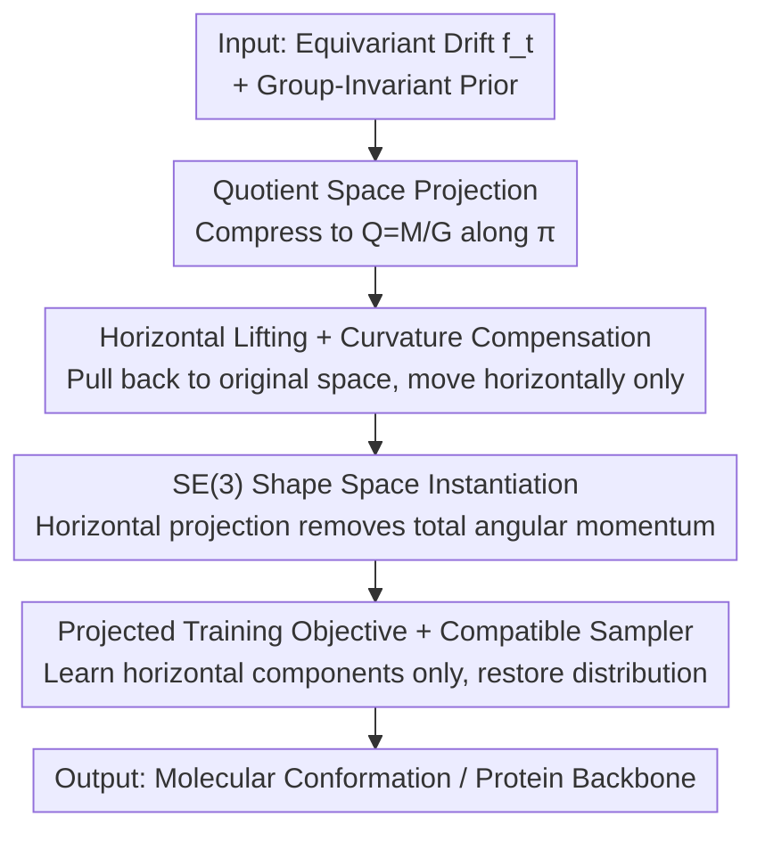

# Quotient-Space Diffusion Models

**Conference**: ICLR 2026  
**OpenReview**: [https://openreview.net/forum?id=3JPAkwSVc4](https://openreview.net/forum?id=3JPAkwSVc4)  
**Code**: Reproduced based on https://github.com/shenoynikhil/ETFlow (No official repository listed)  
**Area**: Diffusion Models / Geometric Deep Learning / Generative Model Theory  
**Keywords**: Quotient Space, Equivariant Diffusion, SE(3) Symmetry, Horizontal Lifting, Molecular Structure Generation

## TL;DR
This paper proposes "Quotient-Space Diffusion Models," which project traditional equivariant diffusion processes onto a quotient space to eliminate symmetric redundancy and then horizontally lift them back to the original space. This allows the model output within equivalence classes to be arbitrary (reducing learning difficulty) while ensuring the sampling restores the correct symmetric target distribution via a curvature compensation term. It consistently outperforms equivariant diffusion and alignment-based simplification methods in molecular conformation and protein backbone generation.

## Background & Motivation

**Background**: Diffusion models have become a mainstream approach for high-dimensional distribution modeling, showing significant success in scientific scenarios such as molecular 3D structures, protein backbones, and electronic structures. These systems generally possess **symmetries**: for instance, the physical properties of a molecule remain unchanged under global translation and rotation (rigid body motion, forming the SE(3) group), and such states should be regarded as the "same state." The standard approach is to make the target distribution group-invariant, typically realized via random group action augmentation or group-invariant priors combined with equivariant networks.

**Limitations of Prior Work**: While these equivariant diffusion methods ensure distribution symmetry, they **fail to utilize symmetry to reduce learning difficulty**. Neural networks are still required to learn "specific equivalent motions"—such as translating or rotating a molecule as a rigid body to a particular orientation—which do not change the essential state (the shape) of the system. Models waste computational capacity learning these redundant degrees of freedom.

**Defects in Existing Simplification Attempts**: Milestone works like GeoDiff and AlphaFold 3 recognize this and propose using **alignment** to reduce the degrees of freedom of target samples. However, this paper points out (Sec. 3.4) that alignment changes the learning objective, making it inconsistent with the objective required for the sampling process, thus **distorting the generated distribution**—a problem that even patches like those in Boltz-1 cannot fully resolve.

**Key Challenge**: Existing methods fail to simultaneously "leverage symmetry to reduce learning difficulty" and "guarantee sampling restores the correct distribution"—equivariant diffusion ensures the distribution but does not reduce the load, while alignment methods reduce the load but destroy the distribution.

**Core Idea**: Define the diffusion process directly on the **quotient space** (a precise mathematical construction treating an entire equivalence class as a single point). Diffusion on the quotient space naturally removes symmetric redundancy and represents the "essential state" of the system (e.g., "shape space" for molecules). Operating on the quotient space reduces the learning burden while ensuring the correct distribution; however, since quotient spaces are too abstract for direct simulation, the process is "horizontally lifted" back to the original space, making the implementation as simple as original diffusion.

## Method

### Overall Architecture

The methodology follows a derivation chain of "projection, lifting, and instantiation." The starting point is an ordinary diffusion process where the drift term $f_t$ is group-equivariant and the prior $p_{\text{prior}}$ is group-invariant. The goal is to obtain an equivalent process that **moves only between equivalence classes and not within them**, ensuring the generated distribution is identical to the original process.

The first step (Thm 1) projects the original process along the natural projection $\pi: M \to Q=M/G$ onto the quotient space, yielding a diffusion equation on $Q$. Since quotient spaces cannot be represented by Euclidean vectors, the second step (Thm 2) uses "horizontal lifting" to pull the quotient space process back to the original space $M$, resulting in an equivalent process containing **only horizontal movements**, which can be simulated identically to the original process. The third step (Thm 4) provides **explicit expressions** for the horizontal projection $P$ and the curvature compensation term $\tilde h$ for the representative $\mathbb{R}^{3N}/\mathrm{SE}(3)$ (shape space). The projection essentially removes the total angular momentum of the point cloud, leaving only deformation. Finally, this is applied to training (optimizing only the projected components) and sampling (projecting the velocity field for both ODEs and SDEs).

### Key Designs

**1. Quotient Space Projection: "Quotienting out" symmetric redundancy**

To address the issue where "equivariant diffusion forces the model to learn redundant degrees of freedom," this paper changes the setting entirely. The group action defines an equivalence relation on the state space $M$: $x\sim x'\iff \exists g\in G,\, g\cdot x=x'$. The quotient space $Q:=M/G$ treats each equivalence class as a point, forming a precise construction of the "essential changes of the system without redundancy" (the shape space in molecular terms). Theorem 1 proves that projecting the original equivariant diffusion $dx_t=f_t(x_t)\,dt+\sigma_t\,dw_t$ via $\pi$ onto $Q$ results in a well-defined diffusion process:

$$dy_t = \Big[(\pi_* f_t)(y_t) - \tfrac{\sigma_t^2}{2}\,h(y_t)\Big]dt + \sigma_t\,d\omega_t,\qquad y_0\sim \pi_\# p_{\text{prior}}.$$

Here $\pi_* f_t$ is the push-forward vector field on $Q$, and $\omega_t$ is the Wiener process on $Q$. Notably, an additional term $h(y_t)$—the **mean curvature vector field**—appears. Because the quotient space compresses an entire equivalence class into a point, the process must compensate for the "rate of change of the volume of the equivalence class along the direction of motion." This step ensures that any motion strictly within the equivalence class (vertical direction) is redundant and can be discarded.

**2. Horizontal Lifting + Curvature Compensation: Pulling abstract quotient processes back to original space without harming the distribution**

While clean, quotient spaces are "too abstract to be simulated with Euclidean vectors." This paper brings it back to the original space using "horizontal/vertical decomposition." At each point $x$, the tangent space decomposes as $T_xM=V_x\oplus H_x$, where the vertical space $V_x:=\ker \pi_{*x}$ corresponds to internal motion within the equivalence class (meaningless), and the horizontal space $H_x:=V_x^\perp$ corresponds to essential motion. Any tangent vector uniquely decomposes as $v=v^V+v^H$; let $P_x(v):=v^H$ denote the horizontal projection. Theorem 2 gives the explicit form of the horizontal lift of the quotient process $y_t$:

$$d\tilde x_t = \Big[P_{\tilde x_t}\big(f_t(\tilde x_t)\big) - \tfrac{\sigma_t^2}{2}\,\tilde h(\tilde x_t)\Big]dt + \sigma_t\,d\tilde w_t,\qquad \tilde x_0\sim p_{\text{prior}}.$$

Crucially, this lifting process is **not** simply projecting the original vector field and noise. The curvature term $\tilde h$ (the horizontal lift of $h$) must be retained, as it compensates for the fact that the lifting process cannot change the mass distribution within an equivalence class. Corollary 3 proves two benefits: (1) The terminal state $\tilde x_1$ of the lifted process has the **exact same distribution** as the original terminal state $x_1$ ($p_{\tilde x_1}=p_{x_1}=p_{\text{target}}$), ensuring sampling correctness; (2) When $\sigma_t\equiv 0$ and starting from the same point, the trajectory of the lifted process is **shorter** because it only moves between equivalence classes without the "detours" within classes required by equivariant diffusion. (Figure 1: In a rotationally symmetric system, Ours follows a straight radial path, while equivariant diffusion follows a jagged curve).

**3. SE(3) Shape Space Instantiation: Horizontal Projection = Removing Total Angular Momentum**

To be applicable, the abstract framework must provide calculable formulas for specific groups. For molecules, $M$ is $\mathbb{R}^{3N}$ (coordinates of $N$ atoms), and $G=\mathrm{SE}(3)=T(3)\rtimes \mathrm{SO}(3)$. Since the translation group $T(3)$ is non-compact and lacks translation-invariant distributions, the paper uses the center-of-mass-free subspace $\mathbb{R}^{3N}_{\text{CoM}}$ to quotient out $T(3)$, then quotients out the $\mathrm{SO}(3)$ action to obtain the shape space $Q:=\mathbb{R}^{3N}_{\text{CoM}\circ}/\mathrm{SO}(3)$. Theorem 4 provides the closed-form horizontal projection: for center-of-mass-free $x=[\vec x^{(n)}]_n$ and momentum-free $v=[\vec v^{(n)}]_n$,

$$P_x(v)=\Big[\vec v^{(n)} - \Big(K(x)^{-1}\sum_{n'}\vec x^{(n')}\times\vec v^{(n')}\Big)\times \vec x^{(n)}\Big]_n,\quad K(x):=\sum_n \|\vec x^{(n)}\|^2 I - \sum_n \vec x^{(n)}\vec x^{(n)\top}.$$

The physical meaning is clear: vertical vectors correspond to infinitesimal $\mathrm{SO}(3)$ actions (rigid body rotation with total angular momentum), while horizontal vectors correspond to motion with **zero total angular momentum**. Thus, $P_x(v)$ **subtracts the total angular momentum of $v$, leaving only deformation**—analogous to the standard treatment of "subtracting total linear momentum (center of mass)" for $T(3)$ symmetry. Combined with the explicit $\tilde h$ correction term, the entire lifting process deforms the point cloud without rigid body motion.

**4. Projected Training Objective + Compatible Sampler: Reducing load and ensuring distribution**

With the linear horizontal projection $P_x$, the training objective only needs to project the output of the denoising model $D_\theta$:

$$L(\theta):=\mathbb{E}_{p(t)}\,w(t)\,\mathbb{E}_{p(x_1,x_t)}\big\|P_{x_t}\big(D_\theta(x_t,t)-x_1\big)\big\|^2.$$

Since $P_{x_t}$ is a linear projection, the loss for $D_\theta$ and $D_\theta+v^V$ (where $v^V$ is any vertical vector) is identical—meaning **the model's output in the vertical space (internal motion/total angular momentum) is completely unconstrained and does not need to be learned**. This mirrors AF3 alignment in reducing noise but differs by having a **compatible sampler**: ODE sampling $\frac{dx_t}{dt}=P_{x_t}(v_\theta(x_t,t))$ and SDE sampling

$$dx_t=P_{x_t}\big(v_\theta+\eta_t s_\theta\big)\,dt+\eta_t\,\tilde h(x_t)\,dt+\sqrt{2\eta_t}\,P_{x_t}\,dw_t,$$

both simply add a projection (plus the $\tilde h$ term for SDE) to standard samplers. Cor. 3 guarantees the recovery of the correct distribution. In contrast, alignment in GeoDiff/AF3 makes the learning objective $E[A_{x_t}(x_1)|x_t]$ deviate from the required $E[x_1|x_t]$ for the sampler, causing distribution distortion.

### Loss & Training
Training utilizes the projected loss in Eq. (11). The framework is flexible: it can be used with equivariant models or "general models + data augmentation." For sampling, both ODE and SDE are available; the SDE allows a trade-off between "designability" and "diversity" via the noise scale $\gamma$.

## Key Experimental Results

### Main Results: Molecular Conformation Generation (GEOM-QM9 / GEOM-DRUGS)

Using the ET-Flow architecture, quotient-space diffusion is compared with equivariant diffusion and alignment methods (Higher Coverage is better, lower AMR is better):

| Dataset | Method | Recall-Cov(%)↑ | Recall-AMR(Å)↓ | Precision-Cov(%)↑ | Precision-AMR(Å)↓ |
|--------|------|------|------|------|------|
| GEOM-QM9 | ET-Flow(SO(3)) | 95.98 | 0.076 | 92.10 | 0.110 |
| GEOM-QM9 | + GeoDiff Align | 95.71 | 0.085 | 95.20 | 0.098 |
| GEOM-QM9 | + AF3 Align | 92.67 | 0.131 | 84.38 | 0.205 |
| GEOM-QM9 | **+ Ours** | **96.40** | **0.069** | **93.30** | **0.096** |
| GEOM-DRUGS | ET-Flow(SO(3)) Repr. | 74.91 | 0.541 | 60.33 | 0.724 |
| GEOM-DRUGS | + GeoDiff Align | 75.11 | 0.545 | 59.58 | 0.734 |
| GEOM-DRUGS | + AF3 Align | 71.66 | 0.572 | 52.21 | 0.828 |
| GEOM-DRUGS | **+ Ours** | **78.50** | **0.477** | **67.35** | **0.635** |

Ours consistently improves upon vanilla ET-Flow and outperforms the strong baseline MCF on GEOM-QM9. Meanwhile, alignment methods often **decrease performance**, validating that "incompatibility between learning objectives and samplers harms distribution."

### Main Results: Protein Backbone Generation (Proteína, Unconditional)

| Sampling | Method | Designability(%)↑ | FPSD↓(PDB) | fJSD↓(PDB) |
|------|------|------|------|------|
| SDE γ=0.35 | Proteína M_FS^small (60M) | 96.0 | 386.5 | 1.73 |
| SDE γ=0.35 | **+ Ours** | **97.6** | **274.7** | **1.55** |
| ODE | Proteína M_FS (200M) | 19.6 | 85.4 | 0.09 |
| ODE | M_FS^small + AF3 Align | 3.8 | 229.0 | 0.36 |
| ODE | **M_FS^small + Ours** | 15.6 | **69.9** | 0.11 |

Across all settings, Ours outperforms vanilla Proteína, while AF3 alignment significantly degrades distributional metrics. Notably, **the 60M small model with Ours outperforms the 200M large model** in most metrics.

### Key Findings
- Alignment methods (GeoDiff/AF3) damage the final distribution due to sampler incompatibility, especially in distributional evaluations like protein generation.
- "Load reduction" yields significant parameter efficiency: the 60M model using quotient-space diffusion surpasses the 200M model.
- Appendix results verify that quotient-space diffusion **converges faster** because the model no longer needs to learn correspondences in the vertical space.

## Highlights & Insights
- **Elevating symmetry handling to geometric principles**: While previous work used engineering patches (augmentation/alignment), this research provides the first principled framework that is both load-reducing and distribution-preserving using quotient spaces and horizontal lifting, formalizing the goals of GeoDiff and AlphaFold.
- **Curvature compensation $\tilde h$ is the key**: While intuitively "projecting out redundancy" seems sufficient, the compensation term is vital because quotient space compression changes volume; this term ensures distribution fidelity while allowing for "load reduction."
- **Physical interpretability**: In the SE(3) case, horizontal projection equates to "removing total angular momentum," which is physically consistent with "removing the center of mass," bridging abstract differential geometry with operations familiar to engineers.
- **Transferability**: The framework does not require the quotient space to be embeddable in the original space and applies to any manifold with isometric group actions, theoretically extending to other scientific generation tasks (crystals, flow fields, etc.).

## Limitations & Future Work
- Instantiation and experiments are limited to $\mathbb{R}^{3N}/\mathrm{SE}(3)$ (rigid symmetry). Explicit formulae for $P$ and $\tilde h$ for other groups (discrete symmetry, space groups, permutation symmetry) remain to be derived.
- The framework assumes "isometric group actions and smooth quotient manifolds," which requires excluding degenerate cases; numerical robustness to near-degenerate configurations is not deeply explored.
- SDE sampling adds complexity via $\tilde h$ and step-wise projection, incurring slight overhead; primarily focuses on quality rather than systematic inference speed comparison.

## Related Work & Insights
- **vs Equivariant Diffusion (e.g., EDM/GeoDiff equivariant versions)**: They use group-invariant priors + equivariant networks to ensure symmetry, but the model still learns redundant correspondences. Ours projects these degrees of freedom out, allowing arbitrary vertical output, leading to faster convergence and shorter trajectories.
- **vs GeoDiff Alignment**: GeoDiff uses $A_{x_t}(x_1)$ to align targets to the $x_t$ orientation to reduce variance, but $E[A_{x_t}(x_1)|x_t]\neq E[x_1|x_t]$, causing distribution distortion. Ours is inherently compatible via linear projection and the correction term.
- **vs AlphaFold 3 / Boltz-1 Alignment**: AF3 aligns samples to model outputs to allow arbitrary orientation (load reduction), but this arbitrary orientation propagates through $v_\theta$, failing to guarantee target distribution recovery. Boltz-1's alignment patch effectively reverts to GeoDiff, still failing to preserve distribution. This work is the first to achieve all three: "Removal of equivalent degrees of freedom + Variance reduction + Sampler compatibility" (Table 1).

## Rating
- **Novelty**: ⭐⭐⭐⭐⭐ Establishes the first principled framework using quotient spaces and horizontal lifting for "load-reducing and distribution-preserving" symmetric generation.
- **Experimental Thoroughness**: ⭐⭐⭐⭐ Covers molecular and protein tasks across multiple architectures/samplers; however, instantiation is limited to SE(3).
- **Writing Quality**: ⭐⭐⭐⭐ Clear derivation chain, though differential geometry prerequisites are high.
- **Value**: ⭐⭐⭐⭐⭐ Significant theoretical unity and practical value (e.g., small models surpassing large ones).

<!-- RELATED:START -->

## Related Papers

- [\[ICLR 2026\] On the Interpolation Effect of Score Smoothing in Diffusion Models](on_the_interpolation_effect_of_score_smoothing_in_diffusion_models.md)
- [\[ICLR 2026\] On the Expressiveness of State Space Models via Temporal Logics](on_the_expressiveness_of_state_space_models_via_temporal_logics.md)
- [\[ICLR 2026\] Provable Separations between Memorization and Generalization in Diffusion Models](provable_separations_between_memorization_and_generalization_in_diffusion_models.md)
- [\[ICLR 2026\] Polynomial Convergence of Riemannian Diffusion Models](polynomial_convergence_of_riemannian_diffusion_models.md)
- [\[ICLR 2026\] Diffusion Language Models are Provably Optimal Parallel Samplers](diffusion_language_models_are_provably_optimal_parallel_samplers.md)

<!-- RELATED:END -->
