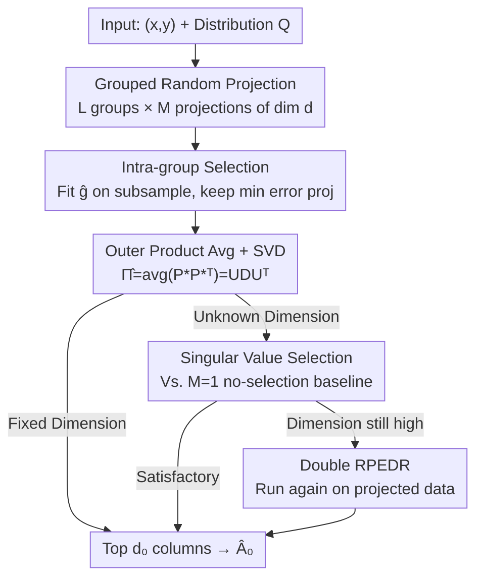

# Random-Projection Ensemble Dimension Reduction

**Conference**: ICLR 2026  
**OpenReview**: [https://openreview.net/forum?id=1Cl84lwpdv](https://openreview.net/forum?id=1Cl84lwpdv)  
**Area**: Learning Theory / Sufficient Dimension Reduction  
**Keywords**: Random Projection Ensemble, Sufficient Dimension Reduction, Central Mean Subspace, SVD Aggregation, Convergence Rate

## TL;DR
This paper proposes RPEDR—a high-dimensional regression dimension reduction framework based on random projection ensembles. It divides a large number of low-dimensional random projections into disjoint groups, retains the best projection per group based on empirical regression error, and then aggregates these selected projections via SVD. Theoretically, the estimation error decreases with the number of groups $L$ at a rate no slower than $L^{-1/2}$. Experimentally, it achieves the best performance in 15 out of 18 simulation settings.

## Background & Motivation
**Background**: In regression, the goal is to characterize the relationship between a $p$-dimensional predictor $X$ and a response $Y$. In modern datasets, $p$ is often large, even exceeding the sample size $n$. Classical methods face the curse of dimensionality—Ordinary Least Squares (OLS) fails when $p > n$ due to singular sample covariance, and non-parametric methods require sample sizes that explode exponentially with $p$. **Sufficient Dimension Reduction (SDR)** offers a solution by finding a function $f:\mathbb{R}^p\to\mathbb{R}^d$ ($d<p$) such that $X$ and $Y$ are conditionally independent given $f(X)$. In practice, $f$ is often restricted to be linear, yielding more interpretable representations. This work focuses on its linear version—**Central Mean Subspace (CMS)**, the smallest subspace $S(A_0)$ spanned by $A_0$ such that the conditional mean $\eta(x)=\mathbb{E}(Y\mid X=x)$ can be written as $g(A_0^\top x)$.

**Limitations of Prior Work**: Mainstream SDR methods (inverse regression methods like SIR, SAVE, pHd, DR, or others like MAVE, gKDR, drMARS) have specific niches but either become unstable or intractable in extreme settings such as high sparsity, high dimensionality, or $p > n$. Conversely, while random projection is a natural tool for dimension reduction, Johnson–Lindenstrauss theory only ensures approximate distance preservation; a **single random projection almost certainly fails** to capture the regression relationship, as shown in the paper's toy example where a randomly chosen 2D projection loses nearly all information between $X$ and $Y$.

**Key Challenge**: Random projections are computationally cheap and flexible for $p > n$ cases, but the quality of a single projection is not guaranteed. Conversely, obtaining high-quality directions cannot rely on traditional SDR moment estimates that might be singular or explode. Is it possible to tame the low cost and high variance of random projections into a theoretically guaranteed estimator through a "multiple projections, selection, and aggregation" strategy?

**Goal**: (1) Design an SDR framework where the projection distribution and base regressor are user-customizable; (2) Provide a data-driven mechanism to determine the reduction dimension; (3) Prove error convergence theoretically relative to the ensemble size and validate this on simulation and real-world data.

**Key Insight**: The authors adapt the random projection ensemble approach used by Cannings & Samworth (2017) for **classification** to the context of **regression/SDR**. The key observation is that by "selecting the projection with the minimum empirical error" among a set, and repeating this across multiple groups, the selected projections will concentrate around the true direction $A_0$. Thus, the average of their outer products (followed by SVD) can reveal the true subspace.

**Core Idea**: Use "grouped random projections + intra-group selection + outer product averaging + SVD decomposition" instead of inverse regression moment estimation to recover the CMS, while using SVD singular values as a "measure of direction importance" to guide dimension selection.

## Method

### Overall Architecture
The RPEDR workflow: Inputs are $n$ pairs of observations $((x_i,y_i))_{i=1}^n$, projection dimension $d$, projection distribution $Q$, number of groups $L$, group size $M$, sub-sample size $n_1$, and base regressor $\hat g$. Outputs are a $p\times p$ direction matrix $U$ and a singular value vector $\mathrm{diag}(D)$, providing the estimate $\hat A_0$ and (optionally) the dimension $\hat d_0$.

The three-step process (Algorithm 1): First, independently sample $L\cdot M$ projection matrices $P_{\ell,m}\in\mathbb{R}^ {p\times d}$ from $Q$, divided into $L$ disjoint groups of size $M$. Within each group, apply each projection to the covariates, fit the base regressor on sub-sample $N_1$, calculate the mean square error on the complement, and retain the projection $P_{\ell,\ast}$ with the minimum error. Finally, average the outer products of the $L$ selected projections to form $\hat\Pi=\frac1L\sum_\ell P_{\ell,\ast}P_{\ell,\ast}^\top$ and perform SVD on $\hat\Pi$ to obtain $U,D$. Additionally, Algorithm 2 uses singular values for data-driven dimension selection $\hat d_0$, and Algorithm 3 (double RPEDR) runs Algorithm 1 a second time when further dimension compression is needed.

### Key Designs

**1. Grouped Random Projection + Intra-group Selection: Transforming high-variance projections into a stable "good direction factory"**

A single random projection is almost certainly poor, but "picking the best in a group" reliably captures a decent direction. The framework splits $L\cdot M$ projections into $L$ disjoint groups of size $M$. Within each group, sample splitting is used (fit on $N_1$, evaluate on complement) to calculate the MSE $\hat R_{\ell,m}=\frac{1}{n-n_1}\sum_{i\in N_1^c}\big(y_i-\hat h_{\ell,m}(x_i)\big)^2$. The winner $P_{\ell,\ast}=P_{\ell,m_\ell^\ast}$ is selected. This ensures that each group contributes one "winner," preserving the flexibility of random projections for $p > n$ while pulling the quality towards $A_0$ through competition. Grouping (rather than global top-$L$ selection) ensures that the $L$ winners are approximately independent, which is crucial for the $L^{-1/2}$ convergence rate.

**2. Outer Product Averaging + SVD Aggregation: Letting singular values indicate "which direction is more important"**

How to fuse different selected projection directions into a single subspace estimate? Ours averages their outer products into $\hat\Pi=\frac1L\sum_{\ell=1}^L P_{\ell,\ast}P_{\ell,\ast}^\top$, then performs SVD $\hat\Pi=UDU^\top$. The columns of $U$ are reduction directions sorted by importance, and the singular values $D$ quantify the relative importance of each direction. True signal directions are repeatedly selected and superimposed, causing their corresponding singular values to increase and singular vectors to approach $A_0$. In the toy example, $\lvert U_1^\top A_0\rvert=0.996$, almost perfectly capturing the 1D signal. This step compresses "a pile of projections" into "an orthogonal basis with importance scales."

**3. Singular Value Dimension Selection: Using a "no-selection baseline" to judge real signals**

When $d_0$ is unknown (Algorithm 2), the idea is to compare the singular values $D_j$ from Algorithm 1 with the per-component median of singular values obtained when no selection is performed ($M=1$). By re-sampling $R$ times to get the baseline $D_j^{(r)}$, the metric $T_j=\frac1R\sum_{r=1}^R \mathbf 1\{D_j^{(r)}\le D_j\}$ is calculated. The output is $\hat d_0=\max\{j:T_\ell>1/2\ \forall \ell\le j\}$. The intuition is that a direction should be kept only if it is more likely to be selected than "pure noise." Median is used over mean to handle potential outliers from heavy-tailed $Q$ (like Cauchy). Since projections are rescaled such that $\mathrm{trace}(\hat\Pi)=d$, selecting larger singular values naturally penalizes further dimensions, creating an inherent "budget constraint."

**4. Double RPEDR: Re-merging signals scattered across coordinate axes**

When the number of covariates contributing to $S(A_0)$ exceeds the user-desired $\check d_0$, a single application tends to pick out individual coordinate axes of relevant covariates rather than synthesizing them into the minimum number of directions (e.g., a signal $\frac{1}{\sqrt2}(X_1+X_2)$ might be split into two dimensions). Algorithm 3 treats the first pass as a "screening": it gets $\hat A_0$ and $\hat d_0$ via Algorithm 1+2; if $\hat d_0>\check d_0$, it projects the data onto $z_i=\hat A_0^\top x_i$ and runs Algorithm 1 again. This second pass combines signals and prunes irrelevant directions within the already-reduced low-dimensional space.

### Loss & Training
There is no trainable parameter or loss function; "training" consists of running the algorithm. Default recommendations: a 50–50 mixture of Gaussian and Cauchy columns for the projection distribution $Q=\frac12 Q_N^{\otimes d}+\frac12 Q_C^{\otimes d}$ (robust to unknown sparsity), $L=200$ groups, group size $M=10p$, projection dimension $d=\min\{\lceil p^{1/2}\rceil,10\}$, split $n_1=\lceil 2n/3\rceil$, and base regressor $\hat g=\hat g_{\mathrm{MARS}}$. Projection columns are normalized to unit norm $P_j\overset{d}{=}Z/\lVert Z\rVert$.

### Theory
The core is Theorem 1, which characterizes the gap between the output with finite $L$ and the "infinite simulation version ($L=\infty$)." Let $\Pi_\infty:=\mathbb E(P_{\ell,\ast}P_{\ell,\ast}^\top)$ be the expectation of $\hat\Pi$ (with respect to projection and splitting randomness), and $\hat A_0^\infty$ be the top $d_0$ singular vectors of $\Pi_\infty$, then:

$$\mathbb E\, d_F\big(S(\hat A_0^L),S(A_0)\big)\le 2d_0^{1/2}\,\lVert \Pi_\infty-A_0A_0^\top\rVert_{\mathrm{op}}+\frac{2(2\pi)^{1/2}d_0^{1/2}\,dp}{L^{1/2}}.$$

Here $d_F$ is the distance between subspaces (scaled equivalent to sin-theta distance), defined as $d_F^2(S(\hat A_0),S(A_0))=\frac12\lVert \hat A_0\hat A_0^\top-A_0A_0^\top\rVert_F^2$. The second term decays at $L^{-1/2}$, representing the "simulation error" reducible by increasing $L$. The first term is the inherent error under infinite simulation, depending on $M,d$, the base regressor, and the distribution—it is small when selected projections are close to $A_0$ on average.

## Key Experimental Results

### Main Results
Under known $d_0$, sin-theta distance (lower is better) was compared against SIR, pHd, MAVE, DR, gKDR, and drMARS. RPE denotes the single application (Algorithm 1), and RPE2 is the double application (Algorithm 3).

| Setting | Metric | RPE / RPE2 Performance | Comparators |
|------|---------|------------------|----------|
| Simulation (18 settings total) | sin-theta distance | Best in 15/18, 2nd in others | SIR/pHd/MAVE/DR/gKDR/drMARS |
| Real Data (10 scenarios) | sin-theta distance | Best in 6/10, 2nd in others | Same as above |
| $p>n$ Extreme Settings | Tractability | Remains effective | Some comparators become intractable |

### Ablation Study
Analysis of projection distribution and group size $L$ (Model 1, $p=20$, varying sparsity $q$):

| Configuration | Key Observation | Explanation |
|------|---------|------|
| Gaussian Projections | Constant performance | Rotation invariant, insensitive to sparsity |
| Cauchy Projections | Best under sparse ($q=2$), worse under dense ($q=20$) | Heavy tails favor sparsity, hurt density |
| 50–50 Mixture | Stable under both | Recommended default when sparsity is unknown |
| Increasing $L$ | sin-theta decays at $L^{-1/2}$ | Consistent with Theorem 1 |

### Key Findings
- **Group size $L$ is the "budget for precision"**: Error decays as $L^{-1/2}$, as predicted by Theory (Theorem 1) and confirmed by simulation (Figure 9).
- **Projection distribution should match sparsity**: Cauchy excels for sparse signals; Gaussian is robust due to rotation invariance but inferior to Cauchy under sparsity. The 50-50 mixture is a robust compromise.
- **Singular values "report" the dimension**: Algorithm 2 accurately recovers $\hat d_0=d_0$ in Models 2/3. In Model 1a, where a 1D signal is split into 2D, double RPEDR (Algorithm 3) successfully corrects this.
- **$p>n$ Friendly**: The framework remains functional while traditional inverse regression methods fail due to covariance singularity.

## Highlights & Insights
- **"Grouped selection" is the key to turning randomness into a guarantee**: By splitting into disjoint groups rather than picking a global top-$L$, the selected projections remain approximately independent—the statistical prerequisite for the $L^{-1/2}$ rate.
- **Dual-use singular values**: They serve as both the importance measure for aggregated directions and the driver for dimension selection (via comparison with the baseline), avoiding extra tuning.
- **Highly pluggable framework**: The projection distribution and base regressor are interchangeable interfaces, making "random projection ensemble" a generic template applicable to classification, sparse PCA, etc.
- **Double pass = Screen then Merge**: Decoupling "recovering directions" and "compressing to minimum dimension" is a clever solution for signals split across multiple axes.

## Limitations & Future Work
- **Computation scales with $L\cdot M\cdot d$**: Each direction requires fitting and evaluating a base regressor. With $M=10p$, the total number of projections is large for high $p$.
- **Dependence on CMS existence and uniqueness**: While standard, this limits the target to linear central mean subspaces; it does not directly cover general non-linear SDR.
- **First term in theoretical bound doesn't improve with $L$**: The inherent error $\lVert\Pi_\infty-A_0A_0^\top\rVert_{\mathrm{op}}$ depends on $M, d$, the regressor, and the distribution. The paper provides empirical recommendations rather than a tight theoretical characterization of this term.

## Related Work & Insights
- **vs Cannings & Samworth (2017)**: They used ensembles for **classification** (aggregating classifier outputs). This work migrates the concept to **regression/SDR**, using outer product averaging and SVD to recover subspaces and select dimensions.
- **vs Inverse Regression (SIR/SAVE/pHd/DR)**: These rely on estimating moments like $\mathrm{Cov}(X\mid Y)$, which fail when $p > n$. This framework uses random projections and empirical error, remaining valid when $p > n$.
- **vs MAVE/gKDR/drMARS**: These use optimization or kernel estimators. This work provides an alternative "ensemble" route.
- **vs Johnson–Lindenstrauss Projections**: JL only ensures approximate distance preservation; this work uses "grouped selection + aggregation" to upgrade random projection into a tool for recovering dimension reduction subspaces.

## Rating
- Novelty: ⭐⭐⭐⭐⭐ Migrating RP ensembles to SDR with SVD-based selection is a clean and original path.
- Experimental Thoroughness: ⭐⭐⭐⭐⭐ 18 simulations + 10 real-world datasets with systematic ablations.
- Writing Quality: ⭐⭐⭐⭐ Clear structure across algorithms, theory, and practice.
- Value: ⭐⭐⭐⭐ Generic, pluggable, and $p > n$ friendly with ready-to-use default configurations.

<!-- RELATED:START -->

## Related Papers

- [\[ICLR 2026\] Random Spiking Neural Networks are Stable and Spectrally Simple](random_spiking_neural_networks_are_stable_and_spectrally_simple.md)
- [\[ICLR 2026\] Random Label Prediction Heads for Studying Memorization in Deep Neural Networks](random_label_prediction_heads_for_studying_memorization_in_deep_neural_networks.md)
- [\[ICLR 2026\] Why We Need New Benchmarks for Local Intrinsic Dimension Estimation](why_we_need_new_benchmarks_for_local_intrinsic_dimension_estimation.md)
- [\[ICLR 2026\] Dimension-Free Decision Calibration for Nonlinear Loss Functions](dimension-free_decision_calibration_for_nonlinear_loss_functions.md)
- [\[ICLR 2026\] Scalable Random Wavelet Features: Efficient Non-Stationary Kernel Approximation with Convergence Guarantees](scalable_random_wavelet_features_efficient_non-stationary_kernel_approximation_w.md)

<!-- RELATED:END -->
