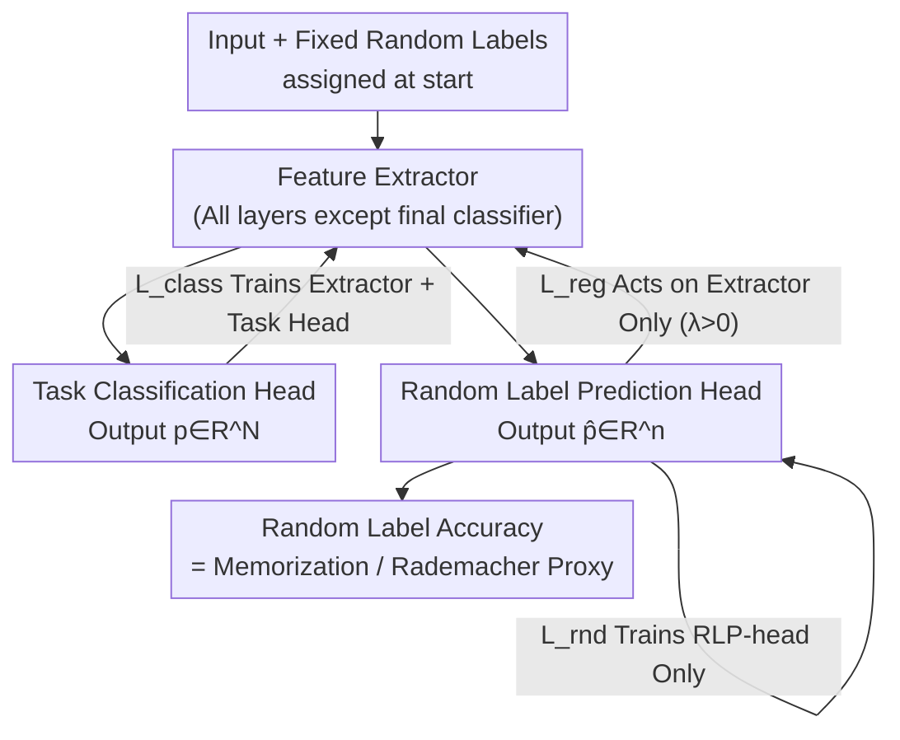

# Random Label Prediction Heads for Studying Memorization in Deep Neural Networks

**Conference**: ICLR 2026  
**OpenReview**: [https://openreview.net/forum?id=qBknFL81JO](https://openreview.net/forum?id=qBknFL81JO)  
**Code**: https://github.com/MarlonBecker/RandomLabelHeads  
**Area**: Learning Theory / Generalization and Memorization  
**Keywords**: Memorization, Rademacher Complexity, Generalization, Regularization, Probing

## TL;DR
A "random label prediction head" (RLP-head) is attached in parallel to the original task head to predict randomly assigned labels for each sample. The accuracy of this head serves as an empirical proxy for Rademacher complexity to measure memorization. Based on this, a regularization term is designed to suppress memorization. Results show that "reducing memorization" improves generalization on sufficiently sampled datasets but hurts it on under-sampled ones, directly challenging the traditional assumption that "overfitting equals memorization."

## Background & Motivation
**Background**: Modern deep networks are heavily over-parameterized and naturally prone to overfitting. Standard techniques to mitigate overfitting include data augmentation, explicit regularization (dropout, weight decay), and scaling data. However, these methods primarily address "engineering generalization problems" and provide little mechanistic insight into "how overfitting actually occurs."

**Limitations of Prior Work**: The famous experiment by Zhang et al. (2021) demonstrated that modern architectures can achieve 100% training accuracy on completely random labels—in which case high accuracy stems solely from per-sample memorization. Theoretically, training on random labels with SGD approximates Rademacher complexity, a core quantity for deriving generalization bounds in the PAC framework. However, **training the entire network directly on random labels** has two fatal flaws: first, it only reveals the "capacity to memorize" without explaining how memorization interacts with generalization in real tasks; second, it disrupts normal training, making it impossible to both measure and suppress memorization simultaneously.

**Key Challenge**: Rademacher complexity is theoretically elegant for providing generalization bounds, but it involves a supremum operator over the hypothesis class, making **exact calculation computationally infeasible** for real deep models. Existing approximations via "training on random labels" destroy the normal task, creating an "either-or" dilemma.

**Goal**: (1) Identify a metric that measures per-sample memorization in real-time during normal training without interfering with the primary task; (2) Locate where memorization occurs within the network layers; (3) Design a regularization term based on this metric to "tune" memorization intensity and study the true relationship between memorization and generalization.

**Key Insight**: Instead of training the entire network to fit random labels, the authors attach a **small, parallel random label prediction head** after the feature extractor. This way, the original classification head remains unaffected by random labels, while the RLP-head acts as a "probe" to read out how much per-sample information persists in the current representation.

**Core Idea**: Use the accuracy of a parallel random label prediction head as an empirical proxy for Rademacher complexity (i.e., memorization). By "penalizing the correct prediction" of this head and backpropagating to the feature extractor, one can both measure and regulate memorization without destroying the main task.

## Method

### Overall Architecture
The method introduces minimal changes to a standard classification network by splitting it into a "feature extractor + task classification head" and then **paralleling** an RLP-head after the feature extractor. Each training sample is assigned a fixed random label at the start of training (the range $n$ can be set arbitrarily, independent of the true class count $N$). During the forward pass, the network simultaneously outputs the task prediction vector $p \in \mathbb{R}^N$ and the random label prediction vector $\hat{p} \in \mathbb{R}^n$.

The key lies in the gradient flow of the three losses: the task loss $L_{class}$ trains both the feature extractor and the task head as usual; the random label loss $L_{rnd}$ trains **only** the RLP-head (gradients do not flow back to the feature extractor), ensuring main task performance is not contaminated; the regularization loss $L_{reg}$ is calculated on the RLP-head but its gradients flow **only** to the feature extractor. When the regularization coefficient $\lambda=0$, the RLP-head is a pure observer probe; when $\lambda>0$, the RLP-head and feature extractor form an adversarial pair—the head tries to fit random labels, while the feature extractor is forced to produce "less per-sample specific" representations to prevent it, thereby suppressing memorization.

### Key Designs

**1. RLP-head: Parallel Probe with Zero Interference**
Training the whole network on random labels destroys the task. This approach places an RLP-head after the feature extractor (typically after the penultimate layer). The penultimate layer activations are the final product of feature extraction, making them ideal for probing per-sample information. Standard cross-entropy is used for both heads:

$$L_{class} = -\sum_{i=1}^{N}\delta_{iy}\log(p_i) = -\log(p_y), \qquad L_{rnd} = -\sum_{i=1}^{n}\delta_{i\hat{y}}\log(\hat{p}_i) = -\log(\hat{p}_{\hat{y}})$$

Since the gradient of $L_{rnd}$ is truncated at the RLP-head, the main task performance remains unaffected.

**2. Random Label Accuracy: Empirical Proxy for Rademacher Complexity**
The theoretical (empirical) Rademacher complexity for binary classification is:

$$\hat{R}_S(\mathcal{H}) = \mathbb{E}_\sigma\left[\sup_{h\in\mathcal{H}}\frac{1}{m}\sum_{i=1}^{m}\sigma_i h(x_i)\right]$$

The authors use **random label accuracy** as a multi-class empirical proxy. Higher accuracy indicates the extractor has captured more per-sample information (higher effective complexity). Validation experiments showed: (1) At epoch 0, the RLP-head cannot fit random labels, proving signals come from the extractor's learned features; (2) Accuracy increases with depth, showing per-sample info becomes memorizable after abstraction; (3) Dropout, weight decay, and label smoothing all lower this accuracy.

**3. RLP Regularization: Adversarial Suppression of Memorization**
To suppress memorization, the authors modify cross-entropy into a regularization loss:

$$L_{reg} = \sum_{i=1}^{n}\delta_{i\hat{y}}\log(1-\hat{p}_i) = \log(1-\hat{p}_{\hat{y}})$$

Two changes are made: first, the **sign is flipped** to prevent fitting; second, $\hat{p}_i$ is replaced with $1-\hat{p}_i$ inside the log, which sharply increases the penalty when $\hat{p}_{\hat{y}}\approx 1$ (high confidence correct prediction of a random label). This is used to **actively tune** memorization.

### Loss & Training
Total loss: $L = L_{class} + L_{rnd} + \lambda L_{reg}$. Gradient truncation ensures: $L_{class}$ trains extractor + task head, $L_{rnd}$ trains only RLP-head, and $\lambda L_{reg}$ trains only the extractor. $\lambda$ is the core hyperparameter, varied from $0$ to $10^5$.

## Key Experimental Results

### Main Results
Verified on ViT-B/32 + ImageNet and WideResNet-16-4 + CIFAR-100. A counter-intuitive result emerged: suppressing memorization had opposite effects on generalization.

| Setup | Train Acc after suppression | Test Acc Change | Conclusion |
|------|------|------|------|
| ViT-B/32 @ ImageNet | Decreased (Narrowed gap) | 67.0% → 68.5% ($\lambda=10^4$, +1.5%) | Matches theory: Less mem → Less overfitting → Better generalization |
| WRN-16-4 @ CIFAR-100 | Nearly unchanged | Decreased even with small $\lambda$ | Contradicts theory: Less mem hurts generalization |

### Ablation Study

| Configuration / Analysis | Key Phenomenon | Explanation |
|------|---------|------|
| Frozen vs Default RLP-head | Frozen head fails to fit at epoch 0 | Proves signal comes from extractor, not head capacity |
| Per-layer RLP-head | ~0% at Layer 1, ~80% at deep layers | Memorization location: Deep features remain per-sample specialized |
| Dropout / Weight Decay | All suppress RLP accuracy | Metric correctly reflects model complexity |
| Reduced ImageNet (100%→5%) | Smaller data → Higher mem, but suppression **no longer** helps test acc | Supports "memorization is beneficial under under-sampling" |
| Label Noise Injection | Suppression consistently helps test acc | Noisy labels fit only via memorization; removing it is beneficial |

### Key Findings
- **"Reducing Memorization" is not monotonically beneficial**: On well-sampled ImageNet, suppression forces the network to learn shared features, improving generalization; on under-sampled CIFAR-100, the "shared features" forced by the network are often spurious features due to insufficient sampling, so memorization actually helps.
- **Memorization has spatial locations and can migrate**: Regulating only the last layer causes the network to "push" per-sample features to earlier layers.
- **Label noise is a clean control group**: Since noisy labels can only be fitted via memorization and provide no generalization benefit, regularization consistently improves performance here.

## Highlights & Insights
- Transforming abstract Rademacher complexity into a "cheap, non-disruptive probe" is brilliant; decoupling measurement and training via gradient truncation is efficient.
- Making "suppressing memorization" a controllable causal knob (via $\lambda$) rather than a black-box trick allows for rigorous experimental study.
- The discovery of "memorization migration" suggests that representation constraints at one point may be compensated for elsewhere by the network.

## Limitations & Future Work
- The "frozen" validation is computationally expensive and cannot be used for actual regularization.
- The hypothesis that "under-sampling makes memorization beneficial" is supported by evidence but lacks a formal theoretical characterization or an operational standard for "sufficient sampling."
- Experiments are limited to image classification with ViT/WRN; robustness of designs like random label count $n$ needs more discussion.

## Related Work & Insights
- **vs. Zhang et al. (2021)**: They use the whole network to fit random labels to expose capacity. Ours uses a parallel probe to measure/tune memorization during normal training.
- **vs. Maini et al. (2023)**: They show memorization is local. Ours provides a unified per-layer probe and identifies memorization migration.
- **vs. Feldman (2019)**: Argues memorization benefits generalization in long-tail/sparse regions. Ours provides controllable verification of this via regularization on ImageNet subsets and noisy labels.

## Rating
- Novelty: ⭐⭐⭐⭐⭐ Practical realization of Rademacher complexity.
- Experimental Thoroughness: ⭐⭐⭐⭐ Strong controls, though restricted to classification.
- Writing Quality: ⭐⭐⭐⭐⭐ Clear logic from theoretical motivation to counter-intuitive findings.
- Value: ⭐⭐⭐⭐⭐ Provides a toolset for studying memorization and challenges common wisdom.

<!-- RELATED:START -->

## Related Papers

- [\[ICLR 2026\] Random Spiking Neural Networks are Stable and Spectrally Simple](random_spiking_neural_networks_are_stable_and_spectrally_simple.md)
- [\[ICLR 2026\] On Universality of Deep Equivariant Networks](on_universality_of_deep_equivariant_networks.md)
- [\[ICLR 2026\] Provable Separations between Memorization and Generalization in Diffusion Models](provable_separations_between_memorization_and_generalization_in_diffusion_models.md)
- [\[ICLR 2026\] From Neural Networks to Logical Theories: The Correspondence between Fibring Modal Logics and Fibring Neural Networks](from_neural_networks_to_logical_theories_the_correspondence_between_fibring_moda.md)
- [\[ICLR 2026\] Implicit bias produces neural scaling laws in learning curves, from perceptrons to deep networks](implicit_bias_produces_neural_scaling_laws_in_learning_curves_from_perceptrons_t.md)

<!-- RELATED:END -->
