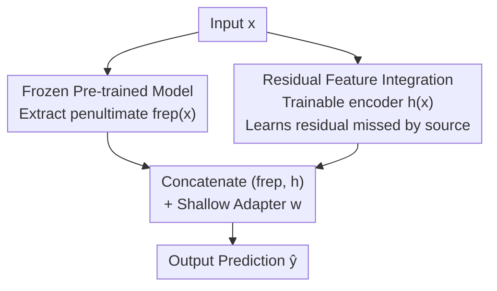

# Residual Feature Integration is Sufficient to Prevent Negative Transfer

**Conference**: ICLR 2026  
**OpenReview**: [https://openreview.net/forum?id=b1ITgc4J4M](https://openreview.net/forum?id=b1ITgc4J4M)  
**Code**: TBD  
**Area**: Transfer Learning Theory / Representation Learning  
**Keywords**: Negative Transfer, Residual Connections, Transfer Learning, Non-parametric Regression, Convergence Rates

## TL;DR
This paper proposes REFINE: concatenating frozen pre-trained source features $f_{rep}(x)$ with a residual encoder $h(x)$ trained on the target domain, followed by a shallow adapter. Theoretically analyzed through non-parametric regression, this minimalist architecture **provably prevents negative transfer**—the worst-case performance is no worse than training from scratch, while the convergence rate smoothly approaches near-parametric rates when source features are useful. Its robustness is validated on image, text, and tabular benchmarks, as well as cross-modal tasks in single-cell spatial omics.

## Background & Motivation

**Background**: Transfer learning is a core paradigm in modern machine learning, transferring representations learned from source domains (large-scale pre-trained models) to target tasks. Common approaches include linear probing (training a linear layer on frozen features), adapters (training a shallow network on frozen features), knowledge distillation, and parameter-efficient fine-tuning like LoRA.

**Limitations of Prior Work**: These methods suffer from a long-standing issue—**negative transfer**: when source and target distributions are mismatched, using source features can perform worse than training from scratch on target data. This is particularly dangerous in high-risk scenarios like medical imaging (e.g., ImageNet → Medical Imaging). Existing mitigations are mostly empirical, such as estimating source-target similarity or using adversarial gating like DANN-Gate, which often lack theoretical guarantees or require access to source data.

**Key Challenge**: Current methods either rely heavily on source features $f_{rep}(x)$ (failing if they are misaligned) or abandon them to learn from scratch (losing transfer benefits). The fundamental problem is that **no method has provably achieved a lossless switch between leveraging good source features and automatically reverting to training from scratch when they are poor**, and almost no theory has guaranteed the prevention of negative transfer until now.

**Goal**: To design an architecture such that (i) it leverages transfer knowledge and outperforms training from scratch when $f_{rep}$ is aligned with the target distribution; (ii) it reverts to a performance no worse than training from scratch and better than source-only models when $f_{rep}$ is misaligned. This must be backed by rigorous theoretical guarantees.

**Key Insight**: The authors leverage "residual connections" from ResNet/Gradient Boosting. Originally designed to alleviate optimization difficulties in deep networks, this component has not been used to combat negative transfer. By paralleling a **trainable residual path** $h(x)$ alongside the frozen source features to capture target-specific signals missed by the source, the performance is not throttled regardless of source feature quality.

**Core Idea**: In one sentence—**parallelize a residual encoder trained on the target domain with frozen source features and let the learner decide the level of trust in the source**, thereby guaranteeing no negative transfer in the worst case.

## Method

### Overall Architecture

REFINE (Residual Feature Integration) addresses the dilemma of wanting to use source features while fearing their potential negative impact. Its implementation is simple: features $f_{rep}(x)\in\mathbb{R}^p$ are extracted from the penultimate layer of a frozen pre-trained model $f$ (**not updated**), while a lightweight residual feature encoder $h(x)\in\mathbb{R}^q$ is trained on the target domain. These are concatenated as $(f_{rep}(x),\,h(x))$, followed by a shallow adapter (linear or small network) $w$ for prediction. Only $h$ and $w$ are updated during training.

The intuition is that $f_{rep}(x)$ encodes most transferable signals, while the residual path $h(x)$ specifically compensates for missing target-specific information. Since $f_{rep}$ provides a "baseline," learning the target function from the joint representation $(f_{rep}, h)$ uses a simpler function class than learning from $x$ or $h(x)$ alone, which leads to improved convergence rates.

The feed-forward structure of the pipeline is as follows:

Formally, the model is denoted as $g(x) = v^\top f_{rep}(x) + u\,h(x)$, where $v$ is a linear probe on $f_{rep}$ and $h$ is a (truncated) ReLU residual network, with $|u|\le1,\|v|\le1$. Training involves empirical risk minimization of the square loss over the function class $\mathcal{G}_{d,p}(W,L,B;f_{rep})$.

### Key Designs

**1. Residual Feature Integration Structure: Compensating Source Feature Gaps via Parallel Paths**

This design directly targets the bottleneck where misaligned source features cause negative transfer. Traditional linear probes or adapters are **sequential**; once $f_{rep}$ loses target-specific information during the frozen forward pass, it cannot be recovered downstream. REFINE uses a **parallel** structure: adding a trainable path $h(x)$ alongside $f_{rep}(x)$ allows the model to utilize $g(x)=v^\top f_{rep}(x)+u\,h(x)$. Crucially, $h$ learns the **residual** $f^*(x)-v^\top f_{rep}(x)$ rather than the entire target function. If the source features are excellent, the residual is small and $h$ does little work; if the source features are poor, the residual encompasses the entire target function, and $h$ reverts to learning from the raw input. This residual path acts as a "safety valve." The modification is architecture-agnostic, requires no source data access, and has adjustable parameter costs (trainable parameters are $\approx 4.88\%$ of the source model).

**2. Provable No-Negative-Transfer Guarantee: Convergence Rates from Non-parametric to Near-parametric**

This is the primary contribution, turning the "safety valve" intuition into a rigorous theorem. Analyzing under a non-parametric regression framework where the ground truth $f^*$ is $\beta$-Hölder smooth and $h$ is a ReLU network, the paper defines the optimal linear probe $v^* = \arg\min_v \mathbb{E}[(v^\top f_{rep}(X)-f^*(X))^2]$. The source feature quality is measured by the residual Hölder norm $\rho^* := \|v^{*\top}f_{rep}-f^*\|_{C^\beta}$. Theorem 4.1 provides the generalization error upper bound:

$$\mathbb{E}[R_{P^t}(\hat g)-R_{P^t}(f^*)] \le C\Big\{\rho^{2d/(2\beta+d)}\log n + \rho^{*2}\rho^{-4\beta/(2\beta+d)}\,n^{-2\beta/(2\beta+d)} + \frac{p\log n}{n}\Big\}.$$

The bound splits into a **parametric term** $p\log n/n$ for learning $v^*$ and a **non-parametric term** (standard minimax rate $n^{-2\beta/(2\beta+d)}$) modulated by $\rho$ and $\rho^*$. Corollary 4.4 provides the **No Negative Transfer Guarantee**: the excess risk of REFINE is no worse than the minimum of "training from scratch" and "linear probing on $f_{rep}$." This is the first theoretical result to guarantee the prevention of negative transfer.

**3. Multi-modal Extension during Adaptation: Injecting Missing Modalities via Residual Paths**

The authors identify a neglected form of negative transfer: **modalities missing during source pre-training that only appear during adaptation**. Conventional PEFT cannot recover information the model never learned. REFINE's residual structure naturally handles this—letting $h(x)$ encode the missing modality and integrating it with frozen source features. Using single-cell spatial omics as an example, foundation models like scGPT are pre-trained on dissociated RNA and lack spatial coordinates. LinearProbing/Adapters on scGPT features show significant negative transfer (F1 0.24–0.29 with 1000 cells vs. 0.47 for a GNN from scratch). REFINE, by adding a spatial residual encoder, reaches F1 $\approx 0.52$ at 1000 cells and $>0.70$ at 3000 cells, demonstrating the ability to "plug in" new modalities without retraining the source model.

### Loss & Training

The training objective is empirical risk minimization under square loss $\hat g=\arg\min_{g\in\mathcal{G}}\frac1n\sum_i (g(X_i)-Y_i)^2$, updating only $h$ and the adapter $w$ while freezing $f_{rep}$. Experiments use SGD (learning rate 0.01, momentum 0.9) with 60 pre-training epochs and 30 fine-tuning epochs. Network capacity is controlled via $\rho$ to achieve a bias-variance trade-off.

## Key Experimental Results

### Main Results: Single-Source Transfer under Natural Distribution Shift (Table 1)

REFINE consistently achieves competitive or superior results, especially where label spaces differ significantly or style drifts are large.

| Transfer Task | Metric | NoTrans | Strongest Baseline | REFINE |
| :--- | :--- | :--- | :--- | :--- |
| CIFAR100→10 | Acc | 56.58 | 43.22 (DANN-Gate) | **54.40** |
| CIFAR10→100 | Acc | 18.32 | 7.01 (LinearProbe) | **18.59** |
| CIFAR10→STL | Acc | 48.69 | 50.76 (LoRA) | **53.42** |
| Clipart→Sketch | Acc | 18.88 | 18.34 (LinearProbe) | **20.34** |
| USPS→MNIST | Acc | 62.07 | 66.99 (LinearProbe) | **70.05** |
| Books→Kitchen | Acc | 71.66 | 71.34 (Adapter) | **72.72** |
| DVD→Electronics | Acc | 68.52 | 66.90 (DANN-Gate) | **70.34** |

LinearProbe/Adapter/LoRA/DANN-Gate show severe negative transfer in CIFAR100→10 and CIFAR10→100 (dropping to 5–38%), while REFINE consistently matches or exceeds the NoTrans baseline.

### Ablation Study: Stress Tests on Noise, Perturbation, and Imbalance (Table 2, CIFAR-10 + CNN)

| Setting | Metric | NoTrans | Adaptive Baseline Rep. | REFINE |
| :--- | :--- | :--- | :--- | :--- |
| 40% Label Flip | Acc | 56.05 | 65.78 (Adapter) | **66.23** |
| 80% Label Flip | Acc | 56.57 | 22.92 (LoRA) | **56.58** |
| Semantic Confusion | Acc | 56.53 | 49.96 (LoRA) | **58.65** |
| Class Imbalance | Acc | 56.44 | 53.21 (LoRA) | **56.54** |

### Key Findings

- **80% extreme noise is the watershed**: Baselines collapse ($<25\%$), while REFINE stays near NoTrans (56.58%), validating the theoretical guarantee of reverting to training from scratch when source features are harmful.
- **Structural advantage over capacity**: Increasing adapter complexity does not solve negative transfer. REFINE's advantage stems from the **parallel residual structure**, not parameter count (using only 4.88% trainable parameters).
- **Unique cross-modal capability**: In spatial omics, only REFINE successfully integrates missing spatial modalities, improving F1 from 0.24 to over 0.70.

## Highlights & Insights

- **Residual Connections as Anti-Negative Transfer Mechanisms**: Reinterprets a standard optimization tool as a "safety valve" that lets the learner decide source reliability.
- **Rigorous "Lossless" Guarantee**: Proves that the method is no worse than training from scratch in the worst case, and approaches parametric rates in the best case.
- **"Learning the Difference" Reduces Complexity**: By learning $f^*-v^\top f_{rep}$, the residual path complexity scales with the "gap" in source knowledge rather than the full task complexity.
- **Practical Modal Expansion**: Offers a way to "plug in" new modalities to frozen foundation models, which is highly valuable given the cost of retraining.

## Limitations & Future Work

- **Theoretical Scope**: Analyses are restricted to square loss and non-parametric regression; the tightness of bounds under complex classification losses remains to be verified.
- **Hyperparameter $\rho$ Dependency**: Optimal rates require tuning $\rho$ near $\rho^*$, which is unknown in practice. Automatic tuning remains an open problem.
- **Sample Requirements for the Residual Path**: Training $h$ still requires sufficient target samples; performance gains are limited when data is extremely scarce.

## Related Work & Insights

- **vs LinearProbe / Adapter**: These are sequential architectures; $f_{rep}$'s information loss is fatal. REFINE's parallel path recovers this information.
- **vs LoRA (PEFT)**: LoRA modifies internal weights and requires model access; REFINE is metadata-agnostic and more flexible for multi-source scenarios.
- **vs DANN-Gate**: DANN-Gate is empirical and requires source data access; REFINE is theoretical and does not.

## Rating
- Novelty: ⭐⭐⭐⭐⭐ Reinterprets residuals for provable anti-negative transfer.
- Experimental Thoroughness: ⭐⭐⭐⭐ Broad coverage across modalities, though mostly mid-scale benchmarks.
- Writing Quality: ⭐⭐⭐⭐⭐ Clear connection between theory and intuition.
- Value: ⭐⭐⭐⭐⭐ Highly practical and architecture-agnostic for safety-critical transfer learning.

<!-- RELATED:START -->

## Related Papers

- [\[ICLR 2026\] Transfer Learning in Infinite Width Feature Learning Networks](transfer_learning_in_infinite_width_feature_learning_networks.md)
- [\[ICLR 2026\] Understanding the Mechanisms of Fast Hyperparameter Transfer](understanding_the_mechanisms_of_fast_hyperparameter_transfer.md)
- [\[ICLR 2026\] Toward Practical Equilibrium Propagation: Brain-Inspired Recurrent Neural Network with Feedback Regulation and Residual Connections](toward_practical_equilibrium_propagation_brain-inspired_recurrent_neural_network.md)
- [\[ICLR 2026\] Price of Quality: Sufficient Conditions for Sparse Recovery using Mixed-Quality Data](price_of_quality_sufficient_conditions_for_sparse_recovery_using_mixed-quality_d.md)
- [\[ICLR 2026\] Feature Compression is the Root Cause of Adversarial Fragility in Neural Networks](feature_compression_is_the_root_cause_of_adversarial_fragility_in_neural_network.md)

<!-- RELATED:END -->
