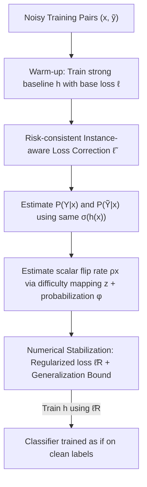

# Resurfacing the Instance-only Dependent Label Noise Model through Loss Correction

**Conference**: ICLR 2026  
**OpenReview**: [https://openreview.net/forum?id=tuvkrivvbG](https://openreview.net/forum?id=tuvkrivvbG)  
**Code**: https://github.com/mustafaaydn/NDX  
**Area**: Learning Theory / Learning with Noisy Labels  
**Keywords**: Label Noise, Loss Correction, Risk Consistency, Instance-dependent Noise, Generalization Bounds

## TL;DR
This paper re-enables the "instance-only dependent, label-independent" noise model (IDN). Based on risk consistency, it designs an instance-aware corrected loss $\tilde{\ell}$ for any classification-calibrated loss. This approach strictly bridges "Empirical Risk Minimization (ERM) on noisy labels" to "True Risk Minimization on clean labels." Unlike prior methods, it only requires estimating a scalar flip rate $\rho_x$ per sample instead of a full transition matrix. Generalization capabilities are validated across image, audio, and tabular data using both neural networks and Gradient Boosted Trees.

## Background & Motivation
**Background**: In supervised classification, labeling errors are inevitable, leading models to overfit and generalize poorly. A major machine-agnostic approach is **loss correction**: modifying an inherently non-robust loss (e.g., logistic, hinge) into a new loss that is robust to label noise. Its advantage lies in requiring only a few lines of code and nearly zero additional computation compared to modifying the entire training mechanism.

**Limitations of Prior Work**: Label noise transitions are typically modeled in four categories: RCN (uniform flipping independent of $X, Y$), CCN (dependent only on class $Y$), IDN (dependent only on instance $X$), and ILDN (dependent on both $X, Y$). While CCN is widely studied, the assumption that flipping depends only on the class and not the specific sample is unrealistic. When shifting to more natural instance-dependent noise, the community almost by default adopts **ILDN** (conditioned on both $X$ and $Y$). ILDN requires estimating a full transition matrix per sample, which entails high parameter counts, estimation difficulty, and heavy computation.

**Key Challenge**: While "instance-dependent noise" almost always refers to ILDN in recent literature, the genuinely "instance-only dependent" **IDN** has been neglected. The assumption behind IDN is reasonable: $Y$ itself is an aggregate statistic of $X$; given $X$, $Y$ provides no extra information about the flip rate. Although having fewer parameters might seem to risk underfitting, the authors empirically find that IDN is not weaker than ILDN but significantly more efficient. Historically, only Bylander (1998) and Du & Cai (2015) utilized IDN, and both were limited to linear learners.

**Goal**: (1) Generalize the IDN noise model from linear machines to arbitrary learners; (2) Provide a practical, computationally efficient method to estimate $\rho_x$ per sample; (3) Connect it to the principle of risk consistency to derive a noise-robust surrogate loss.

**Key Insight**: Start from the ultimate goal of machine learning: generalization. Learning with noise requires "training on noisy data while generalizing well on clean data." This can be precisely formulated as a **risk consistency** equality (Eq. 1):
$$\mathbb{E}_{X,\tilde{Y}}\!\left[\tilde{\ell}(h(X),\tilde{Y})\right] = \mathbb{E}_{X,Y}\!\left[\ell_{01}(h(X),Y)\right].$$
The left side is the observable noisy risk, while the right side is the desired clean 0-1 risk. Designing $\tilde{\ell}$ to satisfy this equation is equivalent to "training on noisy labels as if training on clean labels."

**Core Idea**: Use the scalar flip rate $\rho_x$ from IDN instead of the transition matrix from ILDN to fill the unknowns in the risk consistency equation, thereby correcting any classification-calibrated base loss into a noise-tolerant surrogate loss.

## Method

### Overall Architecture
The method (named **NDX** by the authors) aims to solve the following: given a classification-calibrated base loss $\ell$ (e.g., logistic loss $\ell_{\log}(h(x),y)=\log(1+e^{-y\cdot h(x)})$), construct a corrected loss $\tilde{\ell}$ such that minimizing $\tilde{\ell}$ on noisy labels is equivalent to minimizing the 0-1 risk on clean labels. The logic chain (Eq. 2) is:
$$R_{\ell_{01}}(h)\xleftarrow{\text{Classification Calibration}}R_{\ell}(h)\xleftarrow{\text{Ours: Designed }\tilde{\ell}}\tilde{R}_{\tilde{\ell}}(h)\xleftarrow{\text{LLN}}\widehat{\tilde{R}}_{\tilde{\ell}}(h).$$
The far right is the calculable "empirical noisy risk," and the far left is the "true clean 0-1 risk." The three arrows are connected by the Law of Large Numbers (LLN), the design of $\tilde{\ell}$ in this paper, and the classification calibration of the base loss.

The overall approach is a serial pipeline: Perform warm-up rounds with the base loss to form a strong baseline for $\mathbb{P}(Y\mid x)$ → Use the same sigmoid $\sigma(h(x))$ to simultaneously estimate both label probabilities → Estimate the scalar flip rate $\rho_x$ per sample using a "difficulty mapping + probabilization" → Substitute these three estimates into the corrected loss $\tilde{\ell}$ → Replace $\tilde{\ell}$ with a numerically stable regularized version $\tilde{\ell}_R$ (since the denominator may approach 0) for training, and provide generalization bound guarantees.

### Key Designs

**1. Risk-consistent Instance-aware Loss Correction: Hard-wiring Noisy Empirical Risk to Clean True Risk**

This step directly addresses the pain point that losses like logistic or hinge are not noise-tolerant even when noise is uniform. Instead of manually crafting a robust-looking loss, the authors derive the closed-form solution for $\tilde{\ell}$ from the risk consistency equation (Proposition 1, Eq. 3):
$$\tilde{\ell}(h(x),\tilde{y}) = \frac{\mathbb{P}(Y{=}\tilde{y}\mid x)\big(\mathbb{P}(\tilde{Y}{=}{-}\tilde{y}\mid x)-\rho_x\big)\ell(h(x),\tilde{y}) - \mathbb{P}(Y{=}{-}\tilde{y}\mid x)\rho_x\,\ell(h(x),-\tilde{y})}{\mathbb{P}(\tilde{Y}{=}\tilde{y}\mid x)\,\mathbb{P}(\tilde{Y}{=}{-}\tilde{y}\mid x)-\rho_x}.$$
Proposition 1 guarantees $\tilde{R}_{\tilde{\ell}}(h)=R_{\ell}(h)$, meaning the expectation of $\tilde{\ell}$ over noisy labels exactly equals the expectation of the base loss $\ell$ over clean labels. Compared to the most relevant works, the key difference is the **expectation over the latent variable $Y$**. The authors point out that Natarajan et al. (2013) missed this step and did not achieve true risk consistency, while Patrini et al. (2017) included the expectation but based it on CCN, requiring anchor points and an independent training phase. The corrected loss contains three unknowns: $\mathbb{P}(Y\mid x)$, $\mathbb{P}(\tilde{Y}\mid x)$, and $\rho_x$. The following three designs estimate them sequentially.

**2. Dual Modeling with One Sigmoid: Eliminating Detached Two-stage Training**

While $\mathbb{P}(\tilde{Y}\mid x)$ could be estimated by a separate model due to direct $(x,\tilde{y})$ supervision, $\mathbb{P}(Y\mid x)$ has no clean labels available. The authors observe that the scorer $h$ itself models $\mathbb{P}(Y\mid x)$, thus setting $\mathbb{P}(Y{=}z\mid x)\approx\sigma(z\cdot h(x))=(1+e^{-z\cdot h(x)})^{-1}$. The rationale is that after convergence, the machine should learn the clean label probabilities; furthermore, since clean samples dominate early training, **a few warm-up rounds using only the uncorrected base loss $\ell$** establish a strong baseline for $\mathbb{P}(Y\mid x)$. Although $\mathbb{P}(\tilde{Y}\mid x)$ could be trained separately, such two-stage training is time-consuming and performs worse (Appendix A.4). Consequently, the authors **also use the same $\sigma(h(x))$ to approximate $\mathbb{P}(\tilde{Y}\mid x)$**—since $h$ is trained on noisy labels, it acts as an imitator of the annotator's behavior, naturally modeling the noisy label distribution. After substitution, the corrected loss (Eq. 4) leaves only $\rho_x$ as an unknown.

**3. Scalar Modeling of Instance-independent Flip Rate $\rho_x$: One Number Replaces a Whole Matrix**

This is the core advantage of IDN over ILDN. Since $\rho_x=\mathbb{P}(Y\neq\tilde{Y}\mid X{=}x)$ is conditioned only on $X$ and is independent of the true label $Y$, **only one scalar is estimated per sample instead of a transition matrix**. Because it does not depend on the true label, $\rho_x$ can even be estimated unsupervised, offering high flexibility. The authors formalize it as a function of difficulty (Definition 1): $\rho_x=\phi(z(x))$, where $z:\mathcal{X}\to\mathbb{R}$ is a "difficulty mapping" (the harder the sample, the higher the flip probability), and $\phi:\mathbb{R}\to[0,1]$ is a monotonically increasing probabilization function, with the requirement $\mathbb{E}_X[\phi(z(x))]<0.5$ to ensure signal outweighs noise. Multiple implementations for $z(x)$ are provided: offline unsupervised methods like clustering or representation learning (reconstruction error from sparse autoencoders), and online methods like distance-to-boundary or ensemble distribution. For $\phi$, $\beta$-logistic $(1+e^{-\beta z})^{-1}$, exponential PDF, or Gaussian CDF can be used. The empirically best combination is **"distance-to-boundary" + $\beta$-logistic**. For linear $h$, distance is $|h(x)|/\|w\|_2$; for non-linear models, **$|h(x)|$ is used directly as a proxy for distance** (based on the observation by Li et al. (2019) that the last layer of a perfect classifier solves an SVM and embeddings should be linearly separable). Since $h(x)$ is already computed during training, this proxy adds almost zero overhead and works for non-neural models like LightGBM. Theoretically, the "boundary-consistent noise" of Menon et al. (2018) justifies this (Theorem 1): under $\rho_{\max}<\tfrac12$, an explicit excess AUROC risk bound exists:
$$R_{\text{rank}}(h)-R^*_{\text{rank}}\le\frac{\tilde{\pi}(1-\tilde{\pi})}{\pi(1-\pi)}\cdot\frac{1}{1-2\rho_{\max}}\cdot\big(\tilde{R}_{\text{rank}}(h)-\tilde{R}^*_{\text{rank}}\big),$$
showing that modeling $\rho_x$ using distance-to-boundary is theoretically grounded.

**4. Numerical Stabilization $\tilde{\ell}_R$: Resurcuing the Exploding Denominator with a Generalization Bound**

The denominator in Eq. 3 cannot be mathematically bounded and may approach 0 for some samples, leading to exploding losses and gradients. The authors use a regularization trick approximating division by subtraction, proposing the stable version $\tilde{\ell}_R$ (Eq. 5):
$$\tilde{\ell}_R(h(x),\tilde{y}) := \tilde{\ell}_{\text{numerator}} - \lambda\,\tilde{\ell}_{\text{denominator}},$$
where $\lambda>0$ is a hyperparameter. Although this strictly breaks risk consistency, the authors prove that generalization is preserved under sufficient conditions for $\lambda$: first, they prove a Lipschitz constant $\tilde{L}_R$ for $\tilde{\ell}_R$ (Lemma 1), then provide a high-probability generalization bound (Proposition 2, Eq. 6): with probability at least $1-\delta$,
$$R_{\ell}(h)\le\widehat{\tilde{R}}_{\tilde{\ell}_R}(h)+2\tilde{L}_R\,\widehat{\mathfrak{R}}_S(\mathcal{H})+3\tilde{\ell}_\infty\sqrt{\frac{\log(2/\delta)}{2|S|}},$$
where $\widehat{\mathfrak{R}}_S(\mathcal{H})$ is the empirical Rademacher complexity. While the practical utility of this bound is limited, it serves as a theoretical "sanity check": it shows that substituting the unstable Eq. 4 with the stable $\tilde{\ell}_R$ still maintains learning guarantees for approximating the true risk via noisy ERM.

### Loss & Training
The base loss is consistently set as the logistic loss $\ell_{\log}$. Training workflow: Warm-up for several rounds with $\ell_{\log}$ to form a strong $\mathbb{P}(Y\mid x)$ baseline, then switch to the regularized corrected loss $\tilde{\ell}_R$ while estimating the flip rate online using $\rho_x=\sigma(-\beta|h(x)|)$. Since $\tilde{\ell}_R$ is twice-differentiable with respect to $h(x)$, gradients and Hessians are available, allowing it to be used as a custom objective function for LightGBM, making it machine-agnostic.

## Key Experimental Results

### Main Results
Synthetic noise was applied to Image (CIFAR-10), Audio (Speakers time-series), and Tabular data (Adult/Diabetes/Heart/Splice/Segmentation). Real noise was tested using Clothing1M (approx. 1M noisy pairs, 10k clean test pairs, with clean training/validation sets discarded). Multi-class data were decomposed into binary sub-tasks with noise rates of 28% (medium) and 44% (high).

| Domain / Dataset | Learner | Noise Rate | NDX Performance | Note |
|--------|------|------|------|------|
| CIFAR-10 (5 subsets) | 6-layer CNN | 28% / 44% | Best or comparable overall | Stable at 44% noise where others collapse |
| Speakers (5 subsets) | MLP | 28% / 44% | Top-2 in all subsets | Adapts directly to audio without image priors |
| Heart (Tabular) | LightGBM | 44% | >10% absolute gain over 2nd place | Benefits from GBM's tabular advantage + machine-agnosticism |
| Clothing1M (Real) | 6-layer CNN | Natural | Best or comparable to baselines | Does not use any clean training/validation data |

Baselines include Normal (pure logistic), BCN, UB, DMI, Peer, APL, PTD, BLTM, GCE, Coteaching+, Forward/Backward, and PLC.

### Ablation Study

| Configuration | Conclusion |
|------|------|
| One sigmoid for both vs. separate $\mathbb{P}(\tilde{Y}\mid x)$ | Separate training (two-stage) is slower and performs worse (Appendix A.4). |
| $z$ as distance-to-boundary, $\phi$ as $\beta$-logistic | The best empirical combination used in main experiments. |
| $|h(x)|$ as distance proxy for non-linear models | Zero overhead and effective for non-NN models like LightGBM. |
| Warm-up rounds | Affects initial $\mathbb{P}(Y\mid x)$ baseline quality (analyzed in Appendix A.5). |

### Key Findings
- NDX's main selling point is **stability**: it exhibits low variance across subsets and noise rates, maintaining signals even at 44% noise where other methods often collapse to 50% accuracy.
- IDN (scalar $\rho_x$) is empirically **not weaker than ILDN (matrix)** while being significantly more computationally efficient, supporting the "Resurfacing IDN" thesis.
- The machine-agnostic nature of loss correction is a major benefit: the same theory seamlessly transfers from neural networks to GBTs, capturing the natural advantages of GBMs in the tabular domain.

## Highlights & Insights
- **Deriving loss from risk consistency rather than heuristics**: Starting from the "desired equality" to derive the closed-form $\tilde{\ell}$ provides a clean logical loop and clarifies the essential difference from prior works like Natarajan et al.
- **Dimensionality reduction dividend: "One scalar instead of a matrix"**: Modeling IDN via $\rho_x$ collapses the transition matrix into a single value per sample and allows for flexible unsupervised estimation.
- **Efficient $|h(x)|$ proxy for boundary distance**: Leveraging the observation that the last layer acts as an SVM, the distance (which usually requires iterative perturbations like DeepFool) is replaced by $|h(x)|$. This is a zero-cost trick transferable to other "difficulty-aware" tasks.
- **Intuitive behavior at limits**: As $\rho_x\to0$, $\tilde{\ell}\to\ell$. When $\tilde{y}\cdot h(x)\to-\infty$ (machine strongly disagrees with the label), $\tilde{\ell}\to 0$. This means when encountering an "obviously mislabeled" sample, the loss stops forcing the machine to agree with the label and instead trusts the machine's prediction.

## Limitations & Future Work
- **Limited to binary classification**: The current theory and method are built on $\mathcal{Y}=\{\pm1\}$. Multi-class data must be manually split into binary tasks, and a natural multi-class extension is not provided.
- **Practical utility of generalization bounds**: The authors admit Proposition 2 is primarily a "sanity check" and does not directly guide hyperparameter selection.
- **$\rho_x$ modeling mismatch**: Synthetic noise is injected via the instance-dependent method of Xia et al. (2020), which differs from the distance-to-boundary model used—suggesting robustness but also that $\rho_x$ selection remains empirical.
- **Future Directions**: Making the difficulty mapping $z$ and probabilization $\phi$ learnable/adaptive; exploring scalar IDN forms for multi-class settings.

## Related Work & Insights
- **vs Natarajan et al. (2013, UB)**: Both use loss correction, but UB misses the expectation over latent $Y$, fails risk consistency, and assumes CCN with known rates. NDX fixes the expectation and uses IDN.
- **vs Patrini et al. (2017, Forward/Backward)**: Both use expectations for risk consistency, but Patrini depends on CCN and requires anchor points and a separate training phase. NDX uses IDN scalars, online estimation, and no anchor points.
- **vs Bylander (1998) / Du & Cai (2015, BCN)**: These only used IDN for linear machines. NDX generalizes IDN to arbitrary non-linear learners and formalizes multiple efficient estimation methods for $\rho_x$.
- **vs ILDN mainstream (PTD, BLTM, etc.)**: These estimate sample-wise transition matrices, often requiring three-stage training or distillation. NDX demonstrates that scalar IDN is equally effective and more efficient.

## Rating
- Novelty: ⭐⭐⭐⭐ "Resurfacing" the neglected IDN and generalizing it to arbitrary learners via risk consistency is a fresh perspective.
- Experimental Thoroughness: ⭐⭐⭐⭐ Covers 4 domains, 2 types of learners, 12+ baselines, though binary-only limited the breadth.
- Writing Quality: ⭐⭐⭐⭐ Clear logic chain (Eq. 2), well-defined propositions, and intuitive limit analysis.
- Value: ⭐⭐⭐⭐ High practical utility: machine-agnostic, low code overhead, and efficient scalar modeling.

<!-- RELATED:START -->

## Related Papers

- [\[ICLR 2026\] Optimizing Data Augmentation through Bayesian Model Selection](optimizing_data_augmentation_through_bayesian_model_selection.md)
- [\[ICLR 2026\] Learning Shrinks the Hard Tail: Training-Dependent Inference Scaling in a Solvable Linear Model](learning_shrinks_the_hard_tail_trainingdependent_inference_scaling_in_a_solvable.md)
- [\[ICLR 2026\] Variance-Dependent Regret Lower Bounds for Contextual Bandits](variance-dependent_regret_lower_bounds_for_contextual_bandits.md)
- [\[ICLR 2026\] Noise Tolerance of Distributionally Robust Learning](noise_tolerance_of_distributionally_robust_learning.md)
- [\[ICLR 2026\] Strong Correlations Induce Cause Only Predictions in Transformer Training](strong_correlations_induce_cause_only_predictions_in_transformer_training.md)

<!-- RELATED:END -->
