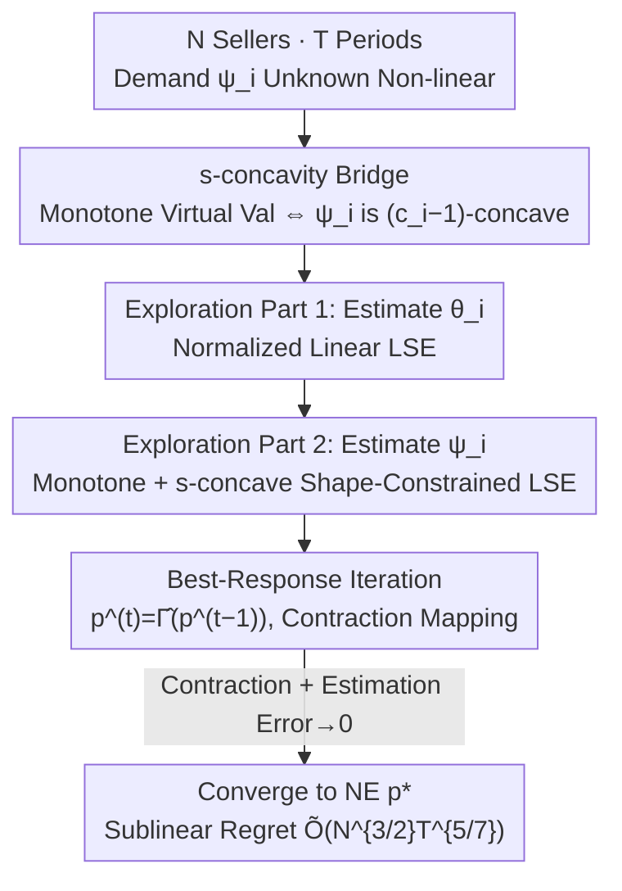

# Revenue Maximization under Sequential Price Competition via the Estimation of s-Concave Demand Functions

**Conference**: ICLR 2026  
**OpenReview**: [https://openreview.net/forum?id=rrdXjkCWze](https://openreview.net/forum?id=rrdXjkCWze)  
**Area**: Learning Theory / Dynamic Pricing / Online Learning  
**Keywords**: Sequential Price Competition, Nash Equilibrium, Shape-Constrained Estimation, s-concavity, Regret Bound

## TL;DR
This paper investigates the competition among multiple sellers repeatedly setting prices over $T$ periods. By employing a "semi-parametric least squares + shape constraint" approach to estimate each seller's unknown non-linear demand function, the authors propose the SPE-BR strategy. They prove that prices converge to the Nash Equilibrium at a rate of $\tilde O(N^{3/4}T^{-1/7})$ with an individual regret of $\tilde O(N^{3/2}T^{5/7})$, while unifying the existence of equilibrium under the shape constraint of s-concavity.

## Background & Motivation

**Background**: Competitive dynamic pricing is a core problem in revenue management, where multiple sellers adjust prices, observe competitors, and maximize cumulative revenue. Theoretically, Nash Equilibrium (NE) describes a steady state where no player wants to unilaterally change their price. Existing sequential pricing learning algorithms achieve low regret and converge to NE but primarily rely on **linear demand** assumptions (e.g., Li et al. 2024 achieved optimal $\sqrt T$ regret under asymmetric linear demand) or restrict non-linear demand to a **fixed parametric family** (e.g., Goyal et al. 2023).

**Limitations of Prior Work**: Real-world demand response to price is non-linear, and competition further amplifies this non-linearity. Linear models and fixed parametric families are too rigid: they either fail to fit real demand curves or require prior knowledge of the functional form and hyperparameter tuning (e.g., bandwidth selection for kernel methods). More critically, sellers in competitive scenarios **cannot perform controlled experiments**—competitors will not freeze their prices to allow one seller to test price sensitivity in isolation.

**Key Challenge**: To achieve a unification between "unknown and non-linear demand functions" and "provable convergence to NE with regret bounds." The existence and uniqueness of NE typically depend on the monotonicity of the "virtual valuation function," often guaranteed by assuming log-concavity of demand. Conversely, non-parametrically estimating an unknown non-linear function requires some smoothness or shape constraints to control estimation error. These two theoretical ends often use disparate assumptions, lacking a bridge.

**Goal**: (i) Design a **parameter-free** pricing strategy under a sufficiently flexible non-linear demand model; (ii) Ensure price convergence to the NE achievable under full information; (iii) Provide **sublinear regret** against a dynamic benchmark.

**Key Insight**: The authors model each seller's mean demand as a **monotone single-index model** $\mathbb{E}[y_i\mid p] = \psi_i(\langle\theta_i, p\rangle)$, where $\theta_i$ consists of own-price sensitivity $-\beta_i$ and cross-price coefficients $\gamma_i$ for competitors. The link function $\psi_i$ is monotonic and **s-concave**. The key observation is that the "monotonicity of virtual valuation" required for NE existence is exactly equivalent to $\psi_i$ satisfying a certain s-concavity condition—**bridging the equilibrium condition in game theory and the shape constraint in statistics using the same $s$**.

**Core Idea**: Use "s-concave shape constraints" as both a sufficient condition for NE existence and a regularization method for non-parametric estimation, leading to a fully data-driven, parameter-free "semi-parametric estimation then best-response iteration" algorithm.

## Method

### Overall Architecture

Assume $N$ sellers repeatedly price over $T$ periods. In each period $t$, all sellers **simultaneously** set prices $p^{(t)}=(p_1^{(t)},\dots,p_N^{(t)})$ (public), and then each seller $i$ observes only their own demand $y_i^{(t)}=\psi_i(\langle\theta_i,p^{(t)}\rangle)+\varepsilon_i^{(t)}$ (private demand). Sellers know neither their own $(\theta_i,\psi_i)$ nor their competitors' demand models. The goal is to maximize cumulative revenue or, equivalently, minimize regret $\mathrm{Reg}_i(T)$ relative to the "hindsight optimal fixed competitor prices" benchmark.

The **SPE-BR (Semi-Parametric Estimation then Best-Response)** algorithm partitions the time horizon into two segments:

- **Exploration phase** (length $\tau\propto T^\xi$, $\xi\in(0,1)$, shared by all sellers): Collect $\{(p^{(t)},y_i^{(t)})\}$ via random sampling, estimate $\theta_i$ then $\psi_i$ in two sub-steps, and obtain estimates for the demand model and revenue function $\widehat{\mathrm{rev}}_i$.
- **Exploitation phase** (remaining $T-\tau$ periods): In each period, sellers substitute the public competitor prices from the previous period into their estimated revenue function and take the **best response** $p_i^{(t)}=\arg\max_{p_i}\widehat{\mathrm{rev}}_i(p_i\mid p_{-i}^{(t-1)})$, effectively iterating the estimated best-response operator $\hat\Gamma$. If $\hat\Gamma$ is a contraction mapping and estimation error vanishes with exploration data, the price sequence converges geometrically to the NE $p^*$.

### Key Designs

**1. s-concavity Bridge: Translating Equilibrium Conditions into Estimable Shape Constraints**

NE is the fixed point of the best-response operator $\Gamma$. Its existence and uniqueness depend on the monotone virtual valuation function $\varphi_i(u)=u+\psi_i(u)/\psi_i'(u)$ having a positive lower bound on its derivative, i.e., $\varphi_i'(u)\ge c_i>0$ (a generalization of the log-concavity assumption used in single-seller literature). Since $\varphi_i$ contains the ratio of derivatives of $\psi_i$, imposing shape constraints directly on it is difficult. The core Proposition 3.5 provides a clean equivalence:

$$\varphi_i'(u)\ge c_i \iff \psi_i \text{ is } (c_i-1)\text{-concave}.$$

Here, s-concavity is defined via $\psi((1-\lambda)u_0+\lambda u_1)\ge M_s(\psi(u_0)$, $\psi(u_1);\lambda)$, where $s=1$ is standard concavity and $s=0$ is log-concavity, with classes nested as $\mathcal F_s\subset\mathcal F_0\subset\mathcal F_r$ ($r<0<s$). This equivalence allows the "monotone virtual valuation" required by game theory to be translated into the "$(c_i-1)$-concave" shape constraint for $\psi_i$ in statistics—ensuring both NE existence and a regularization path for non-parametric estimation.

**2. Two-Stage Semi-Parametric Estimation: Normalized Linear LSE then Shape-Constrained LSE**

The single-index model $\psi_i(\langle\theta_i,p\rangle)$ decomposes the unknown into a parameter direction $\theta_i$ and an unknown 1D link $\psi_i$. The exploration phase is split:
First sub-period $\mathcal T_i^{(1)}$: Estimate direction via $\hat\theta_i=\arg\min_\theta\sum_{t\in\mathcal T_i^{(1)}}(y_i^{(t)}-\langle\theta,p^{(t)}-\bar p\rangle)^2$, then normalize to $\tilde\theta_i=\hat\theta_i/\|\hat\theta_i\|_2$. This linear estimate is consistent when exploration prices follow an elliptically symmetric distribution.
Second sub-period $\mathcal T_i^{(2)}$: Estimate the link function by solving the shape-constrained least squares:

$$\hat\phi_{i}\in\arg\min_{\phi\,\text{monotone + concave}}\sum_{t\in\mathcal T_i^{(2)}}\big(y_i^{(t)}-h_{s_i}(\phi(w_i^{(t)}))\big)^2,\qquad \hat\psi_i=h_{s_i}\circ\hat\phi_i,$$

where $s_i=c_i-1$ and $h_{s_i}$ is a known monotone transformation. This means the s-concave $\psi_i$ is parameterized as "known transform $\circ$ unknown concave $\phi$," requiring only the estimation of a monotone concave $\phi$—a well-studied object in shape-constrained regression that is **naturally parameter-free**.

**3. Best-Response Iteration + Contraction: Decomposing Regret**

In the exploitation phase, sellers solve the first-order condition to find the best response $\Gamma_i(p_{-i})=\Pi_{\mathcal P_i}\,g_i(\langle\gamma_i,p_{-i}\rangle)/\beta_i$, where $g_i(u)=u-\varphi_i^{-1}(u)$. The collective operator $\Gamma$ is proven to be a contraction mapping under Assumption 3.6 with contraction constant:

$$L_\Gamma=\sup_{i}\|g_i'\|_\infty\,\|\gamma_i\|_1/\beta_i<1.$$

This implies that the influence of competitors' prices on one's own best response is smaller than own-price sensitivity. Using the triangle inequality, regret is decomposed:

$$\mathbb E\|p^{(T)}-p^*\|\lesssim \underbrace{L_\Gamma^{T-1}\,\mathbb E\|p^{(0)}-p^*\|}_{\text{Geometric decay of initial bias}}+\underbrace{\mathbb E\|\Gamma-\hat\Gamma\|_\infty}_{\text{Vanishes as exploration data increases}}.$$

**4. Sup-norm Concentration for s-concave LSE: Trading Statistical Error for Regret Rates**

Regret analysis requires **uniform (sup-norm)** convergence because regret must be controlled across all prices. The paper provides a technical contribution by establishing sup-norm concentration inequalities for a broad class of shape-constrained non-parametric LSEs (including s-concave). Optimizing the exploration ratio $\xi$ results in $\xi^*=5/7$, yielding:

$$\mathrm{Reg}_i(T)=O\!\big(N^{3/2}T^{5/7}(\log T)^{2/5}\big),\qquad \mathbb E\|p^{(T)}-p^*\|_2=O\!\big(N^{3/4}T^{-1/7}(\log T)^{1/5}\big).$$

### Loss & Training
The estimation involves two least squares problems: a center-normalized linear LSE for direction and a "monotone + concave" LSE for the link. The exploration length $\tau\propto T^{\xi}$ with optimal $\xi^*=5/7$. The sub-period ratio $\kappa_i$ is determined by an implicit equation that does not affect the convergence rate.

## Key Experimental Results

The experiments involve Monte Carlo simulations with synthetic data to verify theoretical rates. Settings: $N\in\{2,4,6\}$, price domain $\mathcal P=[0,3]^N$, 0-concave (log-concave) link, contraction constants $L_\Gamma\approx 0, 0.5, 1$, and $T$ up to 3200.

### Main Results

| Setting | Demand Model | Indiv. Regret Rate | NE Conv. Rate | Tuning |
|------|----------|------------|-----------|------|
| Li et al. 2024 | Linear (s=0 special case) | $\tilde O(\sqrt T)$ | Converges | No |
| Fan et al. 2024 ($N=1$) | Kernel Estimate Link | $\tilde O(T^{5/7})$ | — | Bandwidth |
| **Ours: SPE-BR** | Monotone Single-Index + s-concave | $\tilde O(N^{3/2}T^{5/7})$ | $\tilde O(N^{3/4}T^{-1/7})$ | **No** |

### Key Findings
- **Empirical regret rates are consistently faster** than the theoretical upper bounds.
- **Robustness to $s_i$ misspecification**: Even if $s_i$ is set to a smaller value (provided the contraction condition holds), the regret and NE convergence rates remain unchanged.
- **No Algorithmic Collusion**: When all sellers use the same learning algorithm, they converge to a pure-strategy NE without coordinated price increases.

## Highlights & Insights
- **Unified s-concavity**: The bridge between game-theoretic equilibrium conditions and statistical shape constraints via $s$ is the most significant insight of the paper.
- **Parameter-free**: Unlike kernel methods, the constraints come from the model structure (monotone + concave), making the process data-driven and robust.
- **Regret Decomposition Template**: The "contraction + estimation error" framework is reusable for any online learning problem involving the iteration of a fixed-point operator.
- **Exclusion of Collusion**: Provides theoretical evidence that this class of learning algorithms does not spontaneously lead to price-fixing.

## Limitations & Future Work
- **Shared Exploration Phase**: Theoretical results assume sellers use the same exploration length; independent settings require joint consistency results not yet fully available in sup-norm concentration.
- **Known $s_i$**: In practice, $s_i$ might be unknown; online estimation of the shape parameter remains an open problem.
- **Data Partitioning**: The two-stage estimation splits data between $\theta$ and $\psi$; joint estimation could potentially improve constants.
- **Explore-then-Commit**: The algorithm still follows a split structure; future work could explore continuous learning while avoiding "incomplete learning" issues.

## Related Work & Insights
- **vs Li et al. (2024)**: They achieve $\sqrt T$ in the **linear** case. Ours generalizes the link $\psi_i$ to s-concave at the cost of increasing regret to $T^{5/7}$ for broader non-linear applicability.
- **vs Fan et al. (2024)**: Match their $T^{5/7}$ rate for $N=1$ but replace kernel methods (requiring bandwidth tuning) with parameter-free shape constraints while extending to $N$ sellers.
- **vs Shape-Constrained Literature**: Extends results from $L_2$ or in-probability convergence to non-asymptotic sup-norm concentration for s-concave LSE.

## Rating
- Novelty: ⭐⭐⭐⭐⭐ Bridge between s-concavity and equilibrium is elegant.
- Experimental Thoroughness: ⭐⭐⭐ Synthetic validation only (acceptable for theory).
- Writing Quality: ⭐⭐⭐⭐ Clear structure, though notation-heavy.
- Value: ⭐⭐⭐⭐ Provides a robust framework for non-linear competitive pricing.

<!-- RELATED:START -->

## Related Papers

- [\[ICLR 2026\] Revisiting Active Sequential Prediction-Powered Mean Estimation](revisiting_active_sequential_prediction-powered_mean_estimation.md)
- [\[ICML 2026\] Revenue Guarantees of No-Swap-Regret Dynamics in First Price Auctions](../../ICML2026/learning_theory/revenue_guarantees_of_no-swap-regret_dynamics_in_first_price_auctions.md)
- [\[ICLR 2026\] The Price of Robustness: Stable Classifiers Need Overparameterization](the_price_of_robustness_stable_classifiers_need_overparameterization.md)
- [\[ICLR 2026\] Prediction with Expert Advice under Local Differential Privacy](prediction_with_expert_advice_under_local_differential_privacy.md)
- [\[ICLR 2026\] Poisson Midpoint Method for Log-Concave Sampling: Beyond the Strong Error Lower Bounds](poisson_midpoint_method_for_log_concave_sampling_beyond_the_strong_error_lower_b.md)

<!-- RELATED:END -->
