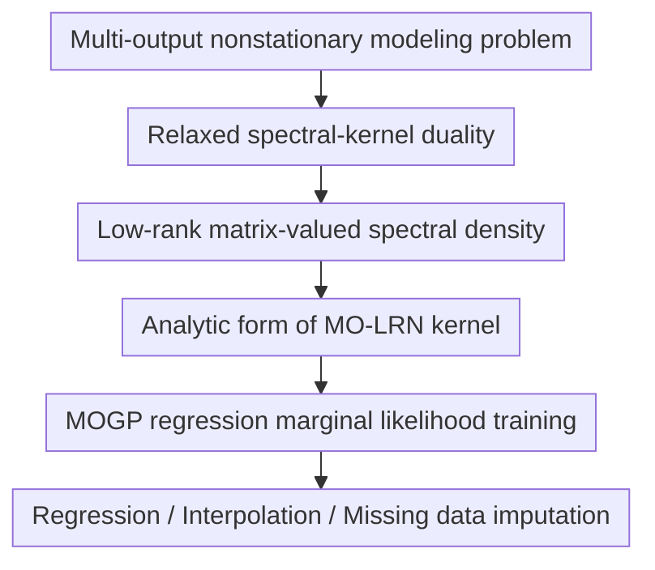

# Revisiting Nonstationary Kernel Design for Multi-Output Gaussian Processes

**Conference**: ICLR2026  
**OpenReview**: [https://openreview.net/forum?id=vFfujX5Ygn](https://openreview.net/forum?id=vFfujX5Ygn)  
**Code**: https://github.com/KrnteXu/MO-LRN  
**Area**: Gaussian processes / probabilistic ML  
**Keywords**: Multi-output Gaussian processes, nonstationary kernels, spectral-kernel duality, low-rank spectral density, uncertainty modeling

## TL;DR
This paper revisits nonstationary kernel design for multi-output Gaussian processes (MOGPs) from the spectral domain. It proposes a more general multi-output spectral-kernel duality and constructs the MO-LRN kernel using a low-rank matrix-valued spectral density. This approach significantly improves performance in regression, interpolation, and missing data imputation while maintaining linear parameter scaling.

## Background & Motivation
**Background**: Gaussian Processes (GPs) encode prior assumptions into models via kernels. Multi-output Gaussian Processes (MOGPs) jointly model multiple correlated outputs. Compared to treating each output as an independent GP, the matrix-valued kernel $K(x_1,x_2)=[k_{ij}(x_1,x_2)]$ of an MOGP can simultaneously describe the individual variation patterns of each output and the covariance relationships between different outputs. Consequently, they are widely used in sensor sequences, medical monitoring, traffic prediction, and uncertainty quantification.

**Limitations of Prior Work**: Many classic MOGP kernels still lean towards stationarity assumptions, where covariance is primarily determined by $x_1-x_2$. This is often insufficient for real-world data: a single output may exhibit different periodicities or noise intensities over various periods, and the correlation between different outputs may vary with input locations. Among existing nonstationary multi-output kernels, MOHSM is a representative method that designs a matrix-valued spectral density in the spectral domain and maps it back to a kernel using Kakihara's theorem. However, the authors point out that the spectral density in MOHSM is constrained by existing duality relations, resulting in a large number of parameters that can still only express a narrow class of locally stationary structures.

**Key Challenge**: From a spectral perspective, an ideal nonstationary MOGP kernel requires a sufficiently flexible matrix-valued bivariate spectral density $P(\omega_1,\omega_2)$. Modeling each output pair $(i,j)$ individually provides high expressivity but causes parameters to grow at $O(V^2)$ with the number of outputs $V$. Conversely, compressing parameters using strong structural assumptions, like in LMC or MOHSM, makes training feasible but sacrifices spectral density flexibility. This paper addresses the conflict between "spectral expressivity" and "multi-output parameter scaling."

**Goal**: The authors decompose the problem into two steps. First, they re-prove a more relaxed multi-output spectral-kernel duality, allowing any matrix-valued bivariate spectral density satisfying Hermitian symmetry to correspond to a valid nonstationary MOGP kernel. Second, they find a trainable parametrization within this expanded design space to avoid placing independent Gaussian mixtures for every output pair, reducing parameter growth from $O(DV^2Q)$ to $O(DVQ)$.

**Key Insight**: Inspired by the single-output nonstationary kernel NG-SM: instead of assembling local windows in the kernel space, it is better to place a sufficiently dense bivariate Gaussian mixture in the spectral domain and derive the kernel via duality. This paper generalizes this idea to multi-output scenarios. Rather than a brute-force "one spectral density per output pair" approach, it treats output dimensions as latent embeddings in a low-dimensional spectral factor space, using inner products to determine spectral interactions between different outputs.

**Core Idea**: A new multi-output spectral-kernel duality is used to open a larger design space for nonstationary kernels. Low-rank spectral factors $P_{ij}(\omega_1,\omega_2)=r_i^H r_j$ are employed to replace pair-wise parametrization, resulting in the MO-LRN kernel that models nonstationarity while scaling linearly.

## Method

### Overall Architecture
The method in this paper is not a deep network pipeline but a theoretical-parametrization workflow for "designing kernels from the spectral domain." Overall, the authors analyze why MOHSM is limited, propose the Advanced Kakihara Theorem as a new spectral-kernel duality, construct a low-rank matrix-valued spectral density in the spectral domain, and analytically map it to the MO-LRN kernel for MOGP regression. The training stage follows standard GP procedures, learning kernel hyperparameters by maximizing the marginal log-likelihood.

### Key Designs
**1. Relaxed spectral-kernel duality: Releasing the design space from structural assumptions**

The issue with MOHSM is not a lack of nonstationarity but its dependence on a duality relation that constrains the spectral density into a restricted form. The paper returns to the Universal Bochner Theorem of the single-output NG-SM: a single-output nonstationary kernel can be generated by a bivariate spectral density $p(\omega_1,\omega_2)$ via an integral containing $\omega_1$ and $\omega_2$. NG-SM approximates this density with bivariate Gaussian mixtures, theoretically approximating a wide range of continuous kernels.

For the multi-output case, the authors propose the Advanced Kakihara Theorem: a family of matrix-valued kernels $\{k_{ij}(x_1,x_2)\}_{i,j=1}^V$ is valid if and only if it can be written as an integral of a matrix-valued Lebesgue-Stieltjes bimeasure. Intuitively, each kernel element $k_{ij}$ is determined by the corresponding spectral entry $P_{ij}(\omega_1,\omega_2)$, as long as the matrix-valued spectral density satisfies the Hermitian symmetry condition $P_{ij}(\omega_1,\omega_2)=P_{ji}(\omega_1,\omega_2)$. The significance is direct: multi-output nonstationary kernels do not need to be fixed as "stationary kernels multiplied by local windows"; they can originate from more general matrix-valued bivariate spectral densities.

**2. Low-rank matrix-valued spectral density: Replacing pair-wise parametrization with output spectral embeddings**

The core compression of MO-LRN comes from $P_{ij}(\omega_1,\omega_2)=r_i^H r_j$. Here, $r_i$ is a spectral latent vector for output $i$ containing $Q$ components. Interactions between two outputs are generated by the inner product of their respective spectral embeddings rather than stored as independent parameters. This structure resembles matrix factorization or latent factor models: individual spectral features are stored in $r_i$, and cross-output correlations are determined by the relative positions of $r_i$ and $r_j$ in the latent space.

Each component $r_i^{(q)}$ is not a simple scalar but a weighted bivariate Gaussian density with parameters including weight $w_i^{(q)}$, two frequency means $\mu_{i1}^{(q)}, \mu_{i2}^{(q)}$, two diagonal covariance blocks $\Sigma_{i1}^{(q)}, \Sigma_{i2}^{(q)}$, and a correlation coefficient $\rho_i^{(q)}$ between $\omega_1$ and $\omega_2$. When corresponding components of two outputs are multiplied, they still form a new bivariate Gaussian mixture term:

$$
P_{ij}(\omega_1,\omega_2)=r_i^H r_j=\sum_{q=1}^{Q} z_{ij}^{(q)}\mathcal{N}\left(\begin{bmatrix}\omega_1\\\omega_2\end{bmatrix}; m_{ij}^{(q)}, S_{ij}^{(q)}\right).
$$

This achieves three things: first, $P_{ij}$ remains a bivariate Gaussian mixture compatible with the spectral-kernel duality; second, Hermitian symmetry is naturally guaranteed by the inner product structure; and third, parameters grow with the number of outputs $V$ rather than $V^2$.

**3. Analytic MO-LRN kernel: Mapping spectral Gaussian mixtures to real-valued covariance functions**

To obtain a real-valued kernel, the authors symmetrize the spectral density: $P_{ij}(\omega_1,\omega_2)=\frac{1}{2}(P_{ij}(\omega_1,\omega_2)+P_{ij}(-\omega_1,-\omega_2))$. Substituting each Gaussian mixture term into the new duality integral yields the explicit form of the MO-LRN kernel. The resulting formula is a weighted sum of four types of cosine-exponential terms: two terms depend simultaneously on the absolute positions of $x_1$ and $x_2$ to express nonstationary variations, while the other two depend on $x_1-x_2$ to retain stationary patterns.

This is critical because many nonstationary kernels lose global stationary structures while focusing on local changes. By including both absolute position and relative distance terms, MO-LRN can fit input-dependent changes across different intervals without losing the ability to represent traditional patterns like periodicity and smoothness.

**4. GP Marginal Likelihood Training: Embedding the new kernel into standard MOGP workflows**

Once $K(X,X)$ is obtained, the training process involves no black-box modules. For inputs $X=[x_1,\ldots,x_N]^\top$ and multi-output observations $y=\mathrm{vec}(F)$, the model assumes

$$
y=\mathrm{vec}(F)+\epsilon,\quad \mathrm{vec}(F)\sim\mathcal{N}(0,K(X,X)),\quad \epsilon\sim\mathcal{N}(0,\Sigma_n),
$$

where the noise covariance $\Sigma_n=I_N\otimes\mathrm{diag}(\sigma_1^2,\ldots,\sigma_V^2)$ allows each output to have its own observation noise. Hyperparameters are learned by maximizing the marginal log-likelihood:

$$
\log p(y|\theta)=-\frac{1}{2}y^\top(K+\Sigma_n)^{-1}y-\frac{1}{2}\log|K+\Sigma_n|-\frac{N}{2}\log 2\pi.
$$

### Loss & Training
The paper uses the standard negative marginal log-likelihood for MOGP as the optimization target:

$$
\mathcal{L}(\theta)=\frac{1}{2}y^\top(K_\theta+\Sigma_n)^{-1}y+\frac{1}{2}\log|K_\theta+\Sigma_n|+\frac{N}{2}\log 2\pi.
$$

In experiments, MO-LRN hyperparameters include the number of mixtures $Q$, weights, means, scales, correlation coefficients of the output spectral factors, and output noise. For synthetic data, $Q=2$ was used with Adam (learning rate 0.10, 500 iterations). For ETT, $Q=4$ (learning rate 0.02, 4000 iterations). For Air Quality data, $Q=4$ (learning rate 0.01, 4000 iterations). Unlike MOHSM, MO-LRN does not require an additional shift-point count $P$, leading to lower parameter counts and training times.

## Key Experimental Results

### Main Results
The paper covers three experiment types: synthetic MOGP regression, ETT real-world multivariate regression, and interpolation/missing data imputation on air quality data. The table below shows the Overall metrics for ETT (mean and standard deviation over 5 runs, lower is better).

| Model | Is Nonstationary | Overall MAE | Overall NMAE | Overall RMSE | Overall NLPD |
|------|------------|-------------|--------------|--------------|--------------|
| CONV | No | 0.390 ± 0.073 | 0.409 ± 0.058 | 0.453 ± 0.020 | 0.661 ± 0.069 |
| LMC-SM | No | 0.364 ± 0.014 | 0.422 ± 0.016 | 0.453 ± 0.045 | 0.573 ± 0.031 |
| MOHSM | Yes | 0.325 ± 0.001 | 0.375 ± 0.001 | 0.440 ± 0.002 | 0.792 ± 0.018 |
| MOSM | No | 0.314 ± 0.014 | 0.365 ± 0.016 | 0.431 ± 0.017 | 0.533 ± 0.043 |
| LMC-NGSM | Yes | 0.256 ± 0.011 | 0.296 ± 0.013 | 0.350 ± 0.013 | 0.382 ± 0.133 |
| MO-LRN | Yes | **0.201 ± 0.006** | **0.232 ± 0.007** | **0.295 ± 0.008** | **0.166 ± 0.031** |

### Ablation Study
| Analysis Item | Result | Description |
|--------|------|------|
| Parameter Complexity | MO-LRN is $O(DQV)$, MOHSM is $O(PDQV)$ | Low-rank factors avoid pair-wise modeling and shift-point layers. |
| Synthetic Efficiency | MO-LRN: MAE 0.0959 / 21.3s / 26 params | Demonstrates that the low-rank design is easier to optimize and more efficient. |
| Sensitivity to $Q$ | Increasing $Q$ slightly improves NMAE but significantly increases runtime | $Q=4$ represents a reasonable trade-off. |

### Key Findings
- MO-LRN reduces both point prediction errors and probabilistic prediction errors on ETT, indicating more reasonable uncertainty quantification (NLPD drops from 0.382 to 0.166 compared to LMC-NGSM).
- Nonstationarity is a crucial factor. Even LMC-NGSM generally outperforms stationary kernels, showing that benefits come from input-dependent variations rather than just multi-output correlations.
- MOHSM is unstable despite being theoretically advanced; the authors attribute this to redundant parameterization and restricted spectral shapes.

## Highlights & Insights
- The biggest highlight is returning kernel design to the spectral domain and identifying that constraints stem from the spectral-kernel duality itself.
- Low-rank spectral density is a natural yet effective trade-off, utilizing the latent factor idea common in multi-task learning while maintaining probabilistic structure.
- MO-LRN's nonstationarity is derived directly from the shape of $P(\omega_1,\omega_2)$ rather than through discrete windowing, avoiding the optimization difficulties of shift-point mixtures.

## Limitations & Future Work
- Low-rank design sacrifices some degrees of freedom; non-diagonal spectral terms are not entirely "free," though better than MOHSM.
- GP inference is still limited by kernel matrix inversion/decomposition. Scaling to larger datasets would require integration with sparse GPs or structured linear algebra.
- Experiments focused on 1D time inputs. Stability under higher-dimensional inputs ($D > 1$) requires further verification.
- Air quality results show that while overall performance is best, it is not the top performer for every single variable, suggesting some outputs might be constrained by the shared low-rank structure.

## Related Work & Insights
- **vs NG-SM**: Generalizes the single-output bivariate spectral mixture idea to matrix-valued spectral densities for MOGPs.
- **vs MOHSM**: Replaces restricted duality and shift-point windowing with a more flexible low-rank spectral factor approach.
- **vs LMC-NGSM**: Moves beyond the LMC structure by jointly modeling cross-output correlations and nonstationarity within the same spectral object.

## Rating
- Novelty: ⭐⭐⭐⭐⭐ 
- Experimental Thoroughness: ⭐⭐⭐⭐ 
- Writing Quality: ⭐⭐⭐⭐ 
- Value: ⭐⭐⭐⭐⭐ 

<!-- RELATED:START -->

## Related Papers

- [\[ICLR 2026\] Diffusion Bridge Variational Inference for Deep Gaussian Processes](diffusion_bridge_variational_inference_for_deep_gaussian_processes.md)
- [\[ICLR 2026\] Robust Generalized Schrödinger Bridge via Sparse Variational Gaussian Processes](robust_generalized_schrodinger_bridge_via_sparse_variational_gaussian_processes.md)
- [\[ICLR 2026\] A Unification of Discrete, Gaussian, and Simplicial Diffusion](a_unification_of_discrete_gaussian_and_simplicial_diffusion.md)
- [\[ICLR 2026\] Subspace Kernel Learning on Tensor Sequences](subspace_kernel_learning_on_tensor_sequences.md)
- [\[ICLR 2026\] Transformers as Unsupervised Learning Algorithms: A study on Gaussian Mixtures](transformers_as_unsupervised_learning_algorithms_a_study_on_gaussian_mixtures.md)

<!-- RELATED:END -->
