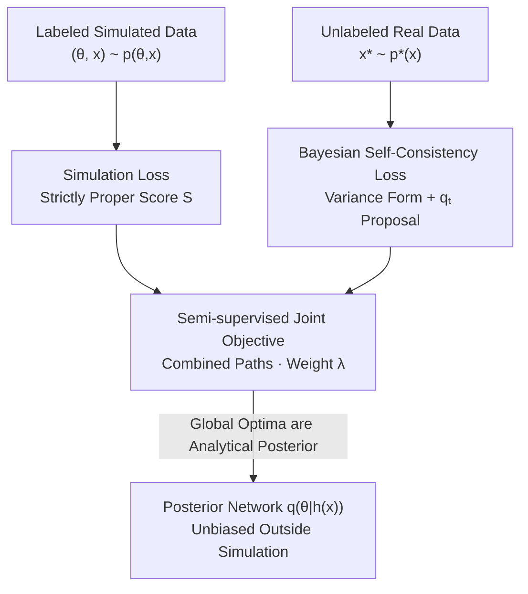

# Robust Amortized Bayesian Inference with Self-Consistency Losses on Unlabeled Data

**Conference**: ICLR 2026  
**OpenReview**: [https://openreview.net/forum?id=E1dANKwo4I](https://openreview.net/forum?id=E1dANKwo4I)  
**Code**: https://github.com/bayesflow-org/self-consistency-real  
**Area**: Learning Theory / Amortized Bayesian Inference / Simulation-Based Inference  
**Keywords**: Amortized Bayesian Inference, Self-Consistency Loss, Semi-supervised, Robustness to Model Mismatch, Strictly Proper Loss

## TL;DR
To address the catastrophic failure of Amortized Bayesian Inference (ABI) on real observations not covered by training simulations, this paper reformulates Bayesian self-consistency (the marginal likelihood identity of Bayes' rule) into a strictly proper loss that does not require ground-truth parameter labels. This allows semi-supervised training on **unlabeled real data**, where only 4 unlabeled samples can yield accurate, unbiased posteriors even far from the training distribution.

## Background & Motivation
**Background**: Amortized Bayesian Inference (ABI) utilizes generative neural networks (typically normalizing flows) to learn a one-time mapping from "observations $x \to$ posterior $p(\theta\mid x)$." During training, large batches of $(\theta, x)$ pairs (labeled simulated data) are sampled from a probabilistic model $p(\theta, x)$. Once trained, the model provides near-instantaneous posteriors for any new observation, performing orders of magnitude faster than MCMC/HMC. It is particularly suitable for Big Data, intractable likelihoods, and scenarios requiring repeated fitting of thousands of datasets.

**Limitations of Prior Work**: The Achilles' heel of ABI is its total dependence on the simulated distribution seen during training. Once a real observation $x^*$ falls into a region not covered by $p(\theta,x)$ (due to model mismatch or distribution shift), the posterior approximation $q(\theta\mid h(x^*))$ can **arbitrarily deviate** from the true analytical posterior. A 10-D normal mean toy problem demonstrates that standard NPE collapses to zero variance when $\mu_{\text{obs}}\ge 2$, providing overconfident, incorrect answers.

**Key Challenge**: While neural posterior estimation is asymptotically perfect under **infinite simulations**, its **pre-asymptotic** (finite-sample) behavior is extremely poor. Simply increasing simulation samples cannot fix this if the simulator itself does not cover the real data region. Furthermore, while real data is accessible, it lacks corresponding **ground-truth parameters $\theta^*$**, making it unusable for traditional supervised ABI.

**Goal**: Enable ABI to utilize "unlabeled real observations" to correct posteriors outside simulation coverage without sacrificing inference speed, changing inference targets, or requiring ground-truth parameters.

**Key Insight**: Bayes' rule contains a symmetry often ignored by sampling methods—the marginal likelihood $p(x)$ is independent of the parameter $\theta$. For any set $\theta^{(1)},\dots,\theta^{(L)}$,
$$p(x) = \frac{p(x\mid\theta^{(1)})\,p(\theta^{(1)})}{p(\theta^{(1)}\mid x)} = \cdots = \frac{p(x\mid\theta^{(L)})\,p(\theta^{(L)})}{p(\theta^{(L)}\mid x)}.$$
This identity **can be calculated given a likelihood without needing $\theta^*$**. If the posterior approximation $q$ is accurate, this ratio should be constant; its fluctuations serve as a proxy for approximation error.

**Core Idea**: Reformulate the self-consistency condition (that the marginal likelihood should be constant across $\theta$) into a strictly proper loss valid for **unlabeled real data**. This is combined with the standard simulation loss for semi-supervised training. The density information of real data pulls the posterior toward the analytical posterior. Since the global optimum for both losses is the same analytical posterior, there is "no trade-off."

## Method

### Overall Architecture
The method splits the ABI training objective into two paths sharing a single posterior network $q(\theta\mid h(x))$ (optionally with a summary network $h$ to extract sufficient statistics). The **supervised path** uses labeled data $\{(\theta_n, x_n)\}$ from the simulator to feed standard simulation losses (e.g., maximum likelihood for normalizing flows), ensuring accuracy within the simulation coverage. The **unsupervised path** uses unlabeled real observations $\{x_m^*\}$ from any source to feed the Bayesian self-consistency loss, enforcing Bayes' rule on the real data distribution. The losses are combined with a weight $\lambda$:

$$(q^*, h^*) = \arg\min_{q,h}\; \underbrace{\mathbb{E}_{(\theta,x)\sim p(\theta,x)}\big[S(q(\theta\mid h(x)), \theta)\big]}_{\text{Simulation Loss (Supervised)}} + \lambda\cdot \underbrace{\mathbb{E}_{x^*\sim p^*(x)}\Big[C\big(\tfrac{p(x^*\mid\theta)\,p(\theta)}{q(\theta\mid h(x^*))}\big)\Big]}_{\text{Self-Consistency Loss (Unsupervised)}}.$$

Here, $S$ is a strictly proper score, and $C$ is a self-consistency score acting on the Bayesian consistency ratio. Crucially, the self-consistency loss term does not involve the ground-truth $\theta$, utilizing only the unlabeled observation $x^*$, the prior $p(\theta)$, and the (known or estimated) likelihood $p(x^*\mid\theta)$.

### Key Designs

**1. Bayesian Self-Consistency Loss: Turning Bayes' Symmetry into a Trainable Signal**
Standard supervised losses fail outside simulation coverage because real data lacks ground-truth labels. This design leverages the identity that marginal likelihood $p(x)$ is independent of $\theta$. By setting $C$ as the **variance of the log self-consistency ratio**:
$$C\Big(\frac{p(x^*\mid\theta)\,p(\theta)}{q(\theta\mid h(x^*))}\Big) = \mathrm{Var}_{\theta\sim p_C(\theta)}\big[\log p(x^*\mid\theta) + \log p(\theta) - \log q(\theta\mid h(x^*))\big].$$
If the posterior is accurate, the term in brackets equals the constant $\log p(x^*)$ for all $\theta$, resulting in zero variance. Deviations increase the variance. Theoretically, minimizing this variance is equivalent to minimizing the KL divergence between the true and approximate posterior (Köthe, 2023). This is feasible for ABI because neural density estimators (like normalizing flows) provide **efficient closed-form density values for $q(\theta\mid x)$**, which sampling methods lack.

**2. Proposal Distribution as Current Posterior: Focusing on High-Density Regions**
The proposal distribution $p_C(\theta)$ in the variance loss could theoretically be any distribution, but in practice, variance must be estimated with finite $\theta$ samples. The largest contributions to the self-consistency ratio occur in the high-density regions of the approximate posterior. Therefore, all experiments use the **current approximate posterior $q_t(\theta\mid h(x^*))$** at training step $t$ as $p_C(\theta)$. This ensures samples fall where correction is most needed, providing effective gradients even with small batch sizes.

**3. Strict Propriety Guarantees "No Trade-off": Converging to the Same Posterior**
Adding a regularization term for real data usually forces a compromise between simulation fit and real data fit. The authors prove this is not the case here via three propositions. Proposition 1: If $C$ reaches its global minimum if and only if its argument is constant almost everywhere on the posterior support, then $C$ is a **strictly proper loss**. Proposition 2 confirms the variance loss meets this. Proposition 3 is the key corollary: the sum of strictly proper losses remains strictly proper, and this holds **for any $p^*(x)$**. regardless of model mismatch, the global minimum of the semi-supervised objective remains the same analytical posterior.

This distinguishes the method from existing robust ABI approaches (adversarial regularization, post-hoc correction, generalized Bayes, DANN/MMD-NPE), which explicitly or implicitly modify the statistical model or target distribution, introducing a trade-off. Self-consistency directly targets the analytical posterior of the specified model.

**4. Extension to Likelihood Estimation and Joint Learning (NPLE)**
When the likelihood $p(x\mid\theta)$ is intractable, Proposition 4 extends self-consistency to **estimated likelihoods** $q(x\mid\theta)$. However, the paper identifies a degeneracy trap: if both posterior and likelihood are **simultaneously unknown**, strict propriety is lost. Any pair satisfying $q(\theta\mid x)\propto q(x\mid\theta)p(\theta)$ could minimize the loss while remaining far from the truth. The solution is to couple the self-consistency loss with another loss (e.g., maximum likelihood) to jointly learn both networks (NPLE).

### Loss & Training
The objective is approximated using $N$ simulated samples and $M$ real samples:
$$(q^*, h^*) = \arg\min_{q,h}\; \frac{1}{N}\sum_{n=1}^{N} S(q(\theta_n\mid h(x_n)), \theta_n) + \lambda\cdot\frac{1}{M}\sum_{m=1}^{M} C\Big(\frac{p(x_m^*\mid\theta_m)\,p(\theta_m)}{q(\theta_m\mid h(x_m^*))}\Big).$$
Normalizing flows use maximum likelihood for the simulation loss. A major limitation acknowledged by the authors is that free-form flow matching or score-based diffusion models are difficult to use because the variance loss requires frequent **fast density evaluations**, which these models cannot provide without expensive numerical integration.

## Key Experimental Results

### Main Results
In an AR(1) model for European air traffic (15 countries, 5 parameters, simulation budget $N=1024$), the self-consistency loss was evaluated on real data from $M$ countries. Absolute bias of posterior mean/SD and Wasserstein distances were reported against Stan/MCMC. Average mean bias across 15 countries:

| Parameter | NPE | NPE+SC (M=4) | NPE+SC (M=8) | NPE+SC (M=15) |
|------|-----|-----|-----|-----|
| $\alpha$ Mean Bias | 0.079 ± 0.019 | 0.003 ± 0.009 | 0.014 ± 0.013 | **0.002 ± 0.001** |
| $\beta$ Mean Bias | 0.153 ± 0.024 | 0.012 ± 0.026 | 0.031 ± 0.023 | **0.001 ± 0.002** |
| $\gamma$ Mean Bias | 0.087 ± 0.045 | 0.048 ± 0.037 | 0.006 ± 0.026 | **0.002 ± 0.003** |
| $\delta$ Mean Bias | 0.053 ± 0.033 | 0.046 ± 0.033 | 0.042 ± 0.023 | **0.003 ± 0.004** |

With the self-consistency loss, all parameters and metrics improved significantly; at $M=15$, bias was reduced to a fraction of the standard NPE.

### Ablation Study
| Configuration | Key Finding |
|------|---------|
| Standard NPE | Collapses to zero variance for OOD observations ($\mu_{\text{obs}}\ge 2$). |
| NPE+SC | Remains nearly perfect for $\mu_{\text{obs}}>3$, even far from training data. |
| Sample Size M | Just 4 unlabeled samples provide significant gains over NPE. |
| Dimensionality D | Nearly perfect for $D\le10$; significantly improved for $D=100$. |
| Estimated Likelihood | Improvement persists, but with higher bias (especially in SD) than known likelihood. |
| vs DANN / MMD | Domain adaptation methods fail under prior mismatch; NPE+SC remains robust. |

### Key Findings
- **High Sample Efficiency**: Only 4 unlabeled real observations (vs. 1024 labeled simulations) yield massive robustness gains by providing "density alignment" rather than "sample fitting."
- **Extrapolation Capability**: Posteriors remain accurate even far from both labeled and unlabeled training data, as the loss constrains the global structure of Bayes' rule.
- **Superiority over UDA**: Unlike NPE-DANN or NPE-MMD, which target modified distributions, NPE+SC targets the analytical posterior, making it robust to prior mismatch.

## Highlights & Insights
- **Leveraging a Forgotten Symmetry**: By turning the marginal likelihood identity into a loss, the authors exploit a property MCMC cannot use (due to a lack of closed-form densities) but ABI computes efficiently.
- **"Not a Regularizer"**: Most robustness methods trade off accuracy for stability. By proving strict propriety, this work ensures the joint loss converges to the same optimal target, removing the trade-off.
- **Quantifying Unlabeled Data**: The paper provides a path to use real data even without parameter labels, provided the likelihood is available or can be approximated.

## Limitations & Future Work
- **Density Evaluation Constraints**: The need for fast density evaluation during training currently excludes free-form Flow Matching and Diffusion models due to the cost of numerical integration.
- **Likelihood Degeneracy**: Robustness is lower when the likelihood is jointly estimated, as the strict propriety of the joint objective is not guaranteed without further constraints.
- **High-Dimensional Scaling**: While improved, performance at $D=100$ is not as "perfect" as in lower dimensions, suggesting scaling challenges for extremely high-dimensional parameter spaces.

## Related Work & Insights
- **vs Schmitt et al. (2024)**: That work used self-consistency to improve simulation efficiency; this work extends it to **unsupervised training on real data** to solve the simulation gap.
- **vs Wehenkel et al. (2024)**: While both use real data, Wehenkel requires a calibration set with ground-truth $\theta^*$ (fully supervised), whereas this method is semi-supervised (unlabeled).
- **vs Domain Adaptation (DANN/MMD)**: These methods align features to a target that is often not the analytical posterior; NPE+SC maintains the original Bayesian target and remains robust to prior mismatch.

## Rating
- **Novelty**: ⭐⭐⭐⭐⭐ Converts a fundamental Bayesian identity into a strictly proper loss for unlabeled real data, pioneering "Semi-Supervised ABI."
- **Experimental Thoroughness**: ⭐⭐⭐⭐ Covers various domains and baselines, though scaling to high-dimensional black-box simulators could be explored further.
- **Writing Quality**: ⭐⭐⭐⭐⭐ Clear theoretical propositions and honest discussion of the degeneracy traps.
- **Value**: ⭐⭐⭐⭐⭐ Directly addresses the robustness bottleneck for real-world ABI deployment with high efficiency and no loss of inference speed.

<!-- RELATED:START -->

## Related Papers

- [\[ICML 2026\] Realizable Bayes-Consistency for General Metric Losses](../../ICML2026/learning_theory/realizable_bayes-consistency_for_general_metric_losses.md)
- [\[ICLR 2026\] Optimizing Data Augmentation through Bayesian Model Selection](optimizing_data_augmentation_through_bayesian_model_selection.md)
- [\[ICLR 2026\] Near Optimal Robust Federated Learning Against Data Poisoning Attack](near_optimal_robust_federated_learning_against_data_poisoning_attack.md)
- [\[ICLR 2026\] Variational Inference for Cyclic Learning](variational_inference_for_cyclic_learning.md)
- [\[ICLR 2026\] Poly-attention: a general scheme for higher-order self-attention](poly-attention_a_general_scheme_for_higher-order_self-attention.md)

<!-- RELATED:END -->
