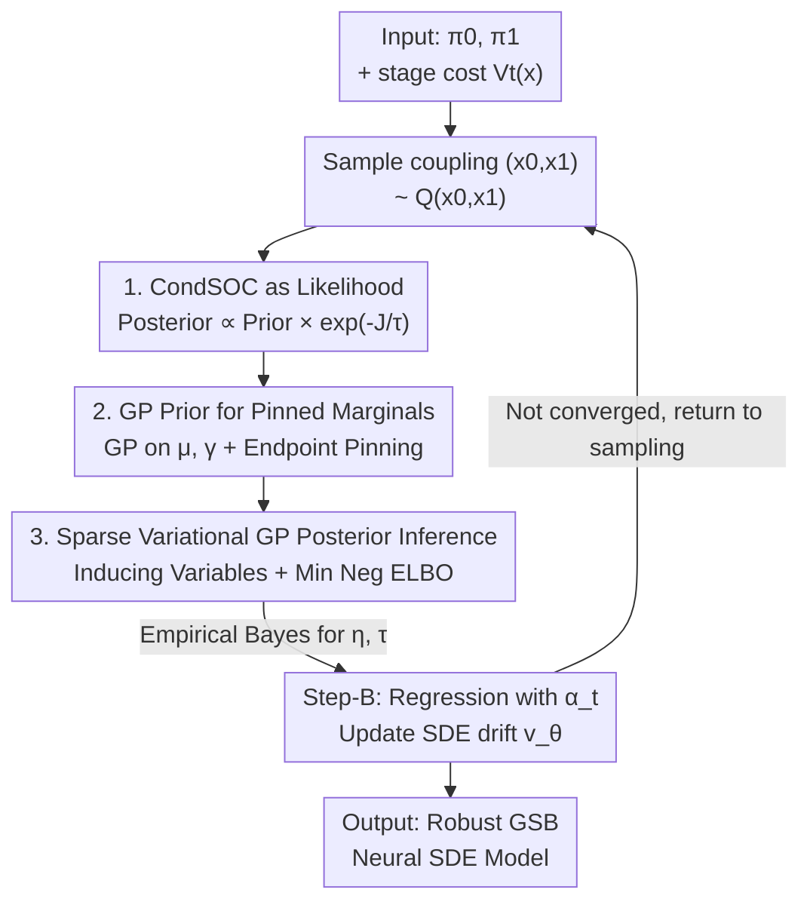

# Robust Generalized Schrödinger Bridge via Sparse Variational Gaussian Processes

**Conference**: ICLR 2026  
**OpenReview**: [https://openreview.net/forum?id=3a2QuEzveq](https://openreview.net/forum?id=3a2QuEzveq)  
**Code**: None  
**Area**: Generative Modeling / Probabilistic Inference / Schrödinger Bridge  
**Keywords**: Generalized Schrödinger Bridge, Sparse Variational Gaussian Processes, Conditional Stochastic Optimal Control, Robust Path Modeling, Bayesian Inference

## TL;DR
To address the issue of noisy stage costs in Generalized Schrödinger Bridge (GSB), this paper transforms the deterministic "pinned marginal path" optimization in GSBM into Bayesian inference. By imposing Gaussian Process (GP) priors on the mean and standard deviation functions of the path and treating the CondSOC objective as a (noisy) likelihood, the posterior path is inferred via sparse variational free energy. This approach yields solutions more robust than GSBM in noisy crowd navigation and image translation tasks.

## Background & Motivation

**Background**: The Schrödinger Bridge (SB) seeks an SDE path between two distributions $\pi_0$ and $\pi_1$ that is closest to a reference measure. Recently, it has resurged in generative tasks such as unsupervised image translation and particle/crowd modeling. The Generalized SB (GSB) introduces an additional **stage cost** $V_t(x)$ (e.g., obstacles/congestion penalties in crowd navigation or latent space preservation costs in image translation), allowing task-specific priors to be injected into probabilistic paths. The current state-of-the-art solver is GSBM, which formulates SB as "minimum kinetic energy + conditional flow matching" and solves a Conditional Stochastic Optimal Control (CondSOC) subproblem to incorporate the stage cost.

**Limitations of Prior Work**: In the CondSOC step, GSBM parameterizes the mean and standard deviation functions of the pinned marginal $P_t(x\mid x_0,x_1)=\mathcal{N}(x;\mu_t,\gamma_t^2 I)$ using splines and performs a **deterministic point estimation**. This leads to two issues: first, spline modeling lacks flexibility—increasing expressivity requires higher-order splines (e.g., cubic splines), which are numerically unstable; alternatively, using path integral resampling for non-Gaussian paths is computationally prohibitive and theoretically flawed. Second, and more importantly for this work, GSBM treats the stage cost as a **noise-free deterministic quantity**, whereas in reality, it is often noisy or uncertain (e.g., LiDAR projection errors, inaccurate VAE reconstruction costs, or intermittent obstacles).

**Key Challenge**: Treating an **inherently uncertain** stage cost as a fully trustworthy deterministic target for point estimation causes the resulting path to overfit noise, leading to a lack of robustness. Simultaneously improving path flexibility while explicitly handling uncertainty requires a unified framework.

**Goal**: Without altering the overall bipartite alternating framework of GSBM (Step-A optimizing pinned marginals, Step-B updating the neural SDE), upgrade the CondSOC step from "deterministic point estimation" to "Bayesian posterior inference" to make solutions both more flexible and robust to noise.

**Key Insight**: Reinterpret the CondSOC objective $J(P_\bullet;V_\bullet)$ as a (stochastic) **likelihood function** and impose a **Gaussian Process (GP) prior** on the pinned marginal path $P_\bullet$. GPs naturally satisfy the dual requirements of flexible functional modeling and Bayesian uncertainty handling.

**Core Idea**: Replace the "spline + deterministic point estimation" in GSBM with "GP prior + CondSOC likelihood → Sparse Variational Inference for the posterior path," resulting in GP-GSBM, a Generalized Schrödinger Bridge algorithm robust to noisy stage costs.

## Method

### Overall Architecture

GP-GSBM fully inherits the two-step alternating cycle of GSBM/DSBM: Iteratively (Step-A) find the optimal pinned marginal $P_t(x\mid x_0,x_1)$ for each coupling $(x_0,x_1)$, then (Step-B) regress the neural SDE drift $v_\theta$ using $\|\alpha_t-v_\theta\|^2$. This paper **only modifies Step-A**: where GSBM performs deterministic spline optimization for $\mu_t,\gamma_t$ (point estimation $\arg\min_{P_\bullet} J(P_\bullet;V_\bullet)$), this work adopts a Bayesian framework.

The transformation involves three layers. The first is **reinterpreting the objective**: treat the CondSOC objective $J$ as a likelihood $\exp(-J/\tau)$ and pair $P_\bullet$ with a prior $P_{\text{prior}}(P_\bullet)$. The goal shifts from finding a point estimate to finding the posterior $P_{\text{post}}(P_\bullet)\propto P_{\text{prior}}(P_\bullet)\cdot\exp(-J(P_\bullet;V_\bullet)/\tau)$. The second is **assigning GP priors to the path**: place independent GP priors on the mean function $\mu_\bullet$ and the (unconstrained) standard deviation function $\tilde\gamma_\bullet$, enforcing endpoint pinning $\mu_0=x_0,\mu_1=x_1,\gamma_0=\gamma_1=0$. The third is **sparse variational inference**: since the posterior is intractable, Titsias’ sparse variational free energy is used to approximate the posterior via inducing variables at a set of inducing time points $Z$. This is learned by minimizing the negative ELBO, while kernel hyperparameters $\eta$ and likelihood temperature $\tau$ are selected via empirical Bayes (evidence maximization).

### Key Designs

**1. Treating CondSOC Objective as Likelihood for Posterior Inference**

This step directly addresses the issue where GSBM overfits noise by treating noisy stage costs as deterministic. GSBM solves $\arg\min_{P_\bullet} J(P_\bullet;V_\bullet)$, where $J=\int_0^1 \mathbb{E}_{P_t}[\tfrac12\|\alpha_t\|^2+V_t(x_t)]\,dt$, treating $P_\bullet$ as a deterministic optimization variable. Ours instead treats $P_\bullet$ as a random variable with prior $P_{\text{prior}}(P_\bullet)$ and exponentiates the objective into a likelihood to obtain a "regularized path GSBM":

$$\arg\min_{P_\bullet} J(P_\bullet;V_\bullet)-\tau\log P_{\text{prior}}(P_\bullet)\equiv\arg\max_{P_\bullet} \underbrace{P_{\text{prior}}(P_\bullet)}_{\text{Prior}}\cdot\underbrace{\exp(-J/\tau)}_{\text{Likelihood}}$$

This represents the MAP solution; this paper goes further by directly targeting the posterior $P_{\text{post}}(P_\bullet)\propto P_{\text{prior}}(P_\bullet)\cdot\exp(-J(P_\bullet;V_\bullet)/\tau)$. The benefit is that when $V$ is noisy, the likelihood is not fully trustworthy, and the posterior automatically balances "prior preference" and "data likelihood" based on uncertainty, unlike point estimation which fully trusts the objective $J$. The coefficient $\tau$ controls this balance and is learned via empirical Bayes.

**2. Gaussian Process Priors with Endpoint Constraints**

The optimization variables for CondSOC are the mean and standard deviation functions of the pinned Gaussian marginal $P_t=\mathcal{N}(x;\mu_t,\gamma_t^2 I)$. We impose independent (dimension-wise decomposed) GP priors on $\mu_\bullet$ and the unconstrained $\tilde\gamma_\bullet$:

$$P_{\text{prior}}(P_\bullet)=\prod_{j=1}^{d}\mathrm{GP}(\mu^j_\bullet)\cdot\mathrm{GP}(\tilde\gamma_\bullet)$$

Standard deviation is parameterized as $\gamma_t=\sigma\sqrt{t(1-t)}\log(1+e^{\tilde\gamma_t})$ to ensure positivity and naturally satisfy $\gamma_0=\gamma_1=0$. For the mean, endpoint pinning $\mu_0=x_0,\mu_1=x_1$ is achieved via "conditional GPs" (conditioning on $\mu_0,\mu_1$). The resulting process is still a GP, with mean/covariance given by standard kernel conditioning formulas. A key design choice: the prior mean for $\mu_t$ is the **linear interpolation** $m^\mu_t=(1-t)x_0+tx_1$, and the prior mean for $\tilde\gamma$ is set such that $\gamma_t=\sigma\sqrt{t(1-t)}$—equivalent to the **solution of the original SB problem in DSBM**. Thus, the prior encodes the preference "move in a straight line if no obstacles exist," and the stage cost only pushes the path away when necessary. This is precisely what GSBM lacks: since it only optimizes cost without this straight-line preference, it is easily misled by stochastic obstacles.

**3. Sparse Variational Free Energy for GP Posterior Inference**

Since $P_{\text{post}}$ is intractable, sparse variational GP is used: $n$ equally spaced **inducing time points** $Z=(t_1,\dots,t_n)$ are chosen. A Gaussian $Q(\mu_Z)=\mathcal{N}(C^\mu,S^\mu)$ is learned for the inducing variables, while $Q(\mu_\bullet\mid\mu_Z)$ is set equal to the prior conditional process. This ensures $Q(\mu_\bullet)$ has a closed-form solution and the posterior path remains a GP. In terms of parameter count, if the number of inducing points matches the number of spline knots, Ours is on the **same order** as GSBM, with roughly twice the inducing variables. Learning proceeds by minimizing the negative ELBO:

$$\min_{\Lambda,\eta,\tau}\ \mathbb{E}_{Q(P_\bullet)}[J(P_\bullet;V_\bullet)/\tau]+\mathrm{KL}\big(Q(P_{Z,Z'})\,\|\,P_{\text{prior}}(P_{Z,Z'})\big)$$

The first term is estimated via reparameterized Monte-Carlo sampling, and the second is a closed-form KL divergence between Gaussians. Optimization of $\Lambda$ narrows the posterior approximation gap, while optimization of $(\eta,\tau)$ corresponds to **empirical Bayes/evidence maximization** for model selection. This allows $\tau$ to be learned automatically: in deterministic scenarios, the model learns a small $\tau \approx 0.1$ (trusting the likelihood), while in stochastic obstacle scenarios, it learns a large $\tau \approx 1.0$ (trusting the straight-line prior for robustness).

### Loss & Training
The GP-GSBM algorithm (Alg. 1) per iteration: ① Sample a batch from the current coupling $Q(x_0,x_1)$; ② Solve the ELBO in Eq. (21) to obtain variational parameters $\Lambda$ and model parameters $(\eta,\tau)$; ③ Sample $(\mu_t,\gamma_t)$ from the posterior GP $Q(P_\bullet)$, then sample $x_t\sim\mathcal{N}(\mu_t,\gamma_t^2 I)$ and compute $\alpha_t$; ④ Update the SDE drift network $\theta\leftarrow\theta-\beta\nabla_\theta\|\alpha_t-v_\theta(t,x_t)\|^2$. Defaults: $n=15$ (Stunnel) / $n=30$ (LiDAR), squared exponential kernel.

## Key Experimental Results

### Main Results
Baselines: GSBM (deterministic stage cost), DSBM (ignores stage cost), Stream-level GP (linear velocity GP prior, difficult to include stage cost). Metrics: CondSOC objective (lower is better), Wasserstein distance to $\pi_1$ in parentheses.

Crowd Navigation on LiDAR Surfaces (CondSOC, mean of 10 runs):

| Scenario | DSBM | GSBM | Stream-level GP | GP-GSBM (Ours) |
| :--- | :--- | :--- | :--- | :--- |
| Noise-free | 7747.0 (0.04) | 6199.3 (0.04) | 7012.6 (0.15) | **5925.0 (0.03)** |
| Noisy Obs. | 12686.9 (0.04) | 8506.1 (0.04) | 12679.1 (0.16) | **8300.0 (0.04)** |

Unsupervised AFHQ Dog→Cat Translation (FID, lower is better):

| DSBM | GSBM | Stream-level GP | GP-GSBM (Ours) |
| :--- | :--- | :--- | :--- |
| 14.16 | 12.39 | 18.77 | **10.21** |

In both noisy and noise-free scenarios, GP-GSBM achieves the lowest CondSOC. The image translation FID is also significantly better than GSBM, validating that treating stage costs (e.g., VAE latent space SLERP reconstruction cost $V_t$, which is inherently noisy) as a likelihood improves robustness.

### Ablation Study
Stunnel / GMM Crowd Navigation (CondSOC, mean of 10 runs), where "Uncertain" refers to obstacles randomly toggling with $p=0.5$:

| Problem | Scenario | DSBM | GSBM | GP-GSBM (Ours) |
| :--- | :--- | :--- | :--- | :--- |
| Stunnel | Deterministic | 18628.8 | 492.94 | **488.78** |
| Stunnel | Uncertain | 9549.2 | 502.20 | **452.30** |
| GMM | Deterministic | 19824.2 | 97.4 | **85.3** |
| GMM | Uncertain | 13232.4 | 101.6 | **89.2** |

Ablation on Kernel and Inducing Points (Stunnel & LiDAR, CondSOC):

| Configuration | Metric | Notes |
| :--- | :--- | :--- |
| RBF Kernel (Default) | Stunnel 488.78 / LiDAR 5925.0 | Most stable setting |
| Polynomial Kernel | Stunnel 556.50 / LiDAR 6604.8 | Slightly worse than RBF |
| Inducing Points $n$ | See Fig. 3 | Performance robust to $n$ as long as $n$ is not too small |

### Key Findings
- **Superiority in Uncertain Scenarios**: When obstacles toggle randomly, GSBM's CondSOC increases (confused by noise), while GP-GSBM learns a large $\tau\approx1.0$ to favor the straight-line prior, resulting in a lower loss—a direct benefit of "objective as likelihood."
- **Automatic $\tau$ Adaptation**: The model learns $\tau\approx0.1$ for deterministic Stunnel and $\tau\approx1.0$ for uncertain scenes via empirical Bayes, eliminating manual tuning.
- **Uncertainty Visualization**: The posterior standard deviation in uncertain scenarios is noticeably larger, qualitatively confirming the model captures stage cost uncertainty.
- **Acceptable Overhead**: On LiDAR, GP-GSBM takes 1.70s per ELBO iteration vs 1.61s for GSBM (on RTX-4090). The overhead from kernel inversion ($O(n^3)$) is manageable since $n \le 30$.

## Highlights & Insights
- **"Deterministic Optimization → Bayesian Inference" is a reusable paradigm**: In any scenario where a task-specific target is minimized but is inherently noisy, applying "target-as-likelihood + prior + variational posterior" provides automatic robustness and uncertainty quantification.
- **DSBM-equivalent Prior is Ingenious**: Setting the GP prior mean to the linear interpolation $\sigma\sqrt{t(1-t)}$ embeds the physical prior "walk straight if possible," giving the model a strong baseline for free.
- **Sparse Variational GP ensures Scalability**: Using inducing variables keeps the parameter count on the same order as GSBM (approx. 2×), making this Bayesian upgrade practical.

## Limitations & Future Work
- Complexity: Kernel inversion makes the computational cost higher than GSBM; while heuristics are provided, more principled complexity reduction is future work. $O(n^2 d)$ may still be high for very high dimensions.
- Path Modeling: The pinned marginal remains locked to **Gaussian** distributions ($P_t=\mathcal{N}(\mu_t,\gamma_t^2 I)$), so it does not resolve the need for "non-Gaussian paths"—it simply finds a posterior over Gaussian paths.
- Scale: Experiments are confined to low-dimensional navigation and $64\times 64$ AFHQ translation; large-scale high-resolution generation remains unverified.
- Improvements: Learning inducing point locations (fixed as equally spaced here) or using structured sparse kernels to mitigate $O(n^3)$.

## Related Work & Insights
- **vs GSBM (Liu et al., 2024)**: GSBM uses deterministic spline optimization for CondSOC point estimation, treating stage costs as noise-free. Ours uses GP + sparse variational inference for the posterior, treating cost as a noisy likelihood. This "deterministic vs. Bayesian" shift provides robustness in stochastic/noisy environments.
- **vs Stream-level GP (Wei & Ma, 2025)**: They use linear interpolation velocity as a conditional GP prior in CFM. Ours treats the CondSOC objective as a likelihood for variational posterior inference. The key advantage of Ours is the **systematic inclusion of stage costs** (obstacles), which Stream-level GP cannot handle without manual point labeling.
- **vs Flow matching with GP prior (Kollovieh et al., 2025)**: They use GP as an additional prior on $\pi_0$ for time-series generation. This differs fundamentally from our use of GP priors to model the pinned marginal path.

## Rating
- Novelty: ⭐⭐⭐⭐ Recasting GSBM's deterministic CondSOC as sparse variational GP inference is a clear and well-motivated shift for noisy costs.
- Experimental Thoroughness: ⭐⭐⭐ Covers navigation and image translation with noise/uncertainty ablations, but scale is limited.
- Writing Quality: ⭐⭐⭐⭐ Complete derivations, clear distinction from GSBM, and unified narrative via the UBA framework.
- Value: ⭐⭐⭐⭐ The "deterministic objective → Bayesian posterior" paradigm and the DSBM-based prior choice have significant transfer value for the bridge matching and generative modeling communities.

<!-- RELATED:START -->

## Related Papers

- [\[ICLR 2026\] Diffusion Bridge Variational Inference for Deep Gaussian Processes](diffusion_bridge_variational_inference_for_deep_gaussian_processes.md)
- [\[ICLR 2026\] Tight Bounds for Schrödinger Potential Estimation in Unpaired Data Translation](tight_bounds_for_schrodinger_potential_estimation_in_unpaired_data_translation.md)
- [\[ICLR 2026\] Revisiting Nonstationary Kernel Design for Multi-Output Gaussian Processes](revisiting_nonstationary_kernel_design_for_multi-output_gaussian_processes.md)
- [\[ICLR 2026\] Variational Inference for Cyclic Learning](variational_inference_for_cyclic_learning.md)
- [\[ICLR 2026\] Variational Deep Learning via Implicit Regularization](variational_deep_learning_via_implicit_regularization.md)

<!-- RELATED:END -->
