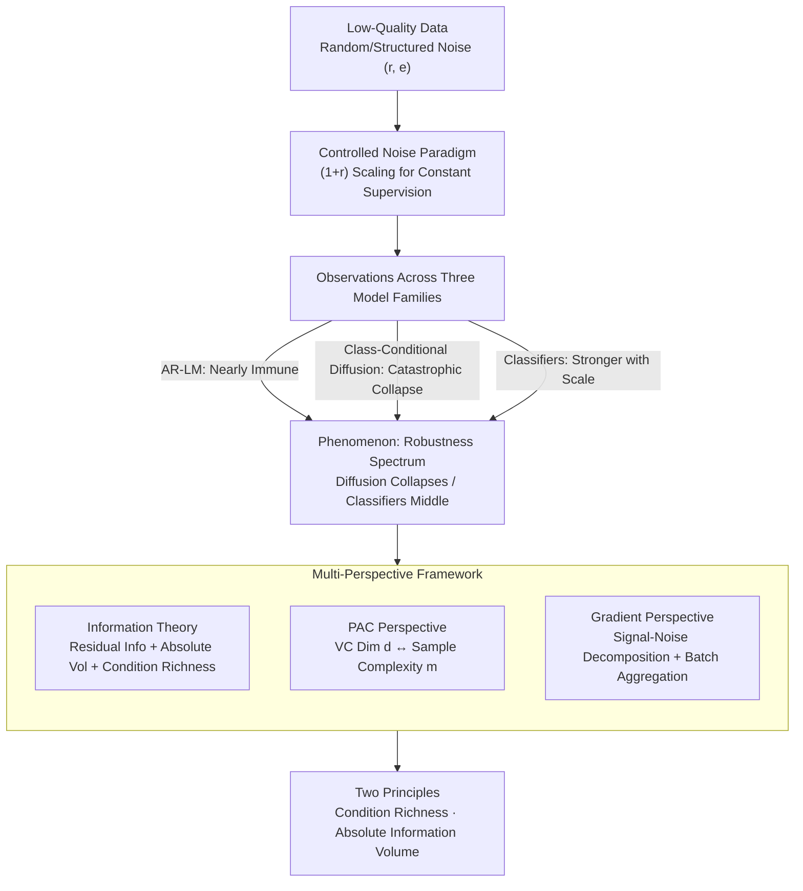

# Robustness of Probabilistic Models to Low-Quality Data: A Multi-Perspective Analysis

**Conference**: ICLR 2026  
**OpenReview**: [https://openreview.net/forum?id=ZFZhV7Snf4](https://openreview.net/forum?id=ZFZhV7Snf4)  
**Area**: Learning Theory / Noise Robustness Analysis  
**Keywords**: Low-quality data, Noise robustness, Information theory, PAC learning, Gradient dynamics

## TL;DR
This paper discovers through controlled noise experiments that robustness to low-quality data varies significantly across probabilistic models (autoregressive LMs are nearly immune, class-conditional diffusion models collapse catastrophically, and classifiers sit in the middle, strengthening with data scale). These differences are unified via information theory, PAC learning, and gradient dynamics into two principles: **Richness of Conditional Information** and **Absolute Information Volume of training data**.

## Background & Motivation

**Background**: Modern deep models are trained on massive, inevitably noisy datasets. While discriminative models (classifiers) have documented resilience to label noise—leading to robust losses and correction schemes—recent attention has shifted to the fragility of generative models, resulting in specific "patches" for noisy labels in diffusion models and contaminated contexts in LMs.

**Limitations of Prior Work**: Existing research focus on **fixing individual vulnerabilities of specific architectures**—designing specific losses or correction mechanisms for a single model type. However, a fundamental question remains unanswered: Why do the most powerful AI models reside at opposite ends of the robustness spectrum? Autoregressive LMs and large-scale classifiers are remarkably resilient to pollution, while class-conditional diffusion models collapse under identical noise levels. This stark contrast lacks a unified explanation.

**Key Challenge**: Prior studies treat robustness as an "inherent architectural property." This paper suspects that robustness is not determined by the architecture itself but by the **information structure of the task**—specifically, the information asymmetry between input (condition) and output (target).

**Goal**: (1) Quantify robustness differences across autoregressive LMs, class-conditional diffusion, and image classification via controlled experiments; (2) Develop a theoretical framework to unify these differences, answering what information attributes drive robustness, why it is a necessary condition for generalization, and how the optimization process mechanically achieves this resilience.

**Key Insight**: Instead of chasing SOTA on benchmarks, a quantifiable noise injection protocol is designed to precisely control the ratio of errors while preserving correct supervision, thereby **isolating robustness as an intrinsic property**. The phenomena are then dissected through three complementary theoretical lenses.

**Core Idea**: Robustness = Condition Richness × Absolute Information Volume. Richer conditions further constrain the function to be learned (lower effective VC dimension, fewer samples required); larger absolute information volume allows correct signals to overwhelm statistical noise during gradient aggregation.

## Method

### Overall Architecture

Rather than proposing a new model, this paper establishes an analytical pipeline: "**Controlled Noise Experiments → Multi-Perspective Theoretical Analysis → Two Principles**." The process involves first quantifying robustness differences across three model families using a unified noise injection protocol, followed by explanations using information theory, PAC, and gradient lenses, finally converging on two fundamental principles.

The experimental "isolation design" is key: noise is injected at ratio $r$ (ratio of erroneous data to clean data, $r \in [0.1, 1.0]$), corresponding to an effective error rate $e = r/(1+r)$ up to 50%. Simultaneously, total training computation is scaled by $(1+r)$ to ensure the **amount of correct supervision remains constant**—ensuring any performance degradation is attributed solely to the noise, not a reduction in clean data.

### Key Designs

**1. Controlled Noise Paradigm: Isolating "Intrinsic Robustness"**

To compare "intrinsic" tolerance to noise, the trap of confounding noise with "reduced clean data" must be avoided. This experiment severs that link: random noise is injected at ratio $r$ (e.g., replacing target tokens or labels), while **total training steps are scaled by $(1+r)$** so that exposure to correct samples remains constant across all settings. Variants include a **Fixed Budget** paradigm (no extra computation) and a **Structured Noise** paradigm (using "partially trained models" as noisy teachers to generate non-random flaws) to validate the "Condition Richness" hypothesis under realistic distributions.

**2. Information Theory Perspective: Residual Information, Volume, and Richness**

Three metrics form the backbone of this explanation. First, **Residual Information** answers how much signal remains after contamination: under a uniform error model with $n$ classes and error probability $p_e$, the relative information loss is:

$$\frac{\text{information loss}}{H(y)}=\frac{-(1-p_e)\log_2(1-p_e)-p_e\log_2 p_e+p_e\log_2(n-1)}{\log_2 n}$$

The insight is that signals persist as long as observed and true labels are not statistically independent. Second, **Absolute Information Volume** (total info from input distribution $p(z)$ and instructions $p(y|z)$) is the primary driver. Even corrupted images contribute to $p(z)$ feature learning; in ImageNet-1000, 1.28M samples provide enough volume for correct signals to "crush" conflicting gradients. Third, **Condition Richness**: when rich conditions constrain sparse targets (LMs using context to predict the next token), models are resilient. Conversely, class-conditional diffusion $p(\text{image}|\text{label})$ uses sparse labels to generate high-information images, making it fragile when that low-information condition is polluted.

**3. PAC Perspective: Formalizing d and m**

Information theory provides intuition; PAC formalizes it as a necessary condition for generalization. The sample complexity lower bound is:

$$m\ge c_0\left(\frac{1}{\epsilon}\log\frac{1}{\delta}+\frac{d}{\epsilon}\log\frac{1}{\epsilon}\right)$$

This connects the principles: **Absolute Information Volume** ↔ total samples $m$. ImageNet-1000 maintains $m$ well above the threshold for stable knowledge even when polluted, while smaller subsets like ImageNet-10 lack this buffer. **Condition Richness** ↔ effective VC dimension $d$. Rich conditions (e.g., $p(\text{label}|\text{image})$) simplify the learning problem, allowing for a lower effective $d$. Sparse conditions (e.g., $p(\text{image}|\text{label})$) require the model to learn complex mappings like high-dimensional score functions, driving $d$ higher. Thus, diffusion models' high $d$ demands massive $m$, making them hypersensitive to noise.

**4. Gradient Perspective: Signal-Noise Decomposition**

This perspective explains the microscopic mechanism. Total batch gradient is decomposed as:

$$g_{\text{total}}=g_{\text{correct\_signal}}+\sum_j g_{\text{noise\_component}_j}$$

Correct sample gradients are coherent and point toward the true data manifold, while noise gradients are approximately orthogonal and random. At initialization, clean–clean gradients show a cosine similarity of $+0.52$ (highly coherent), while corrupt–corrupt and clean–corrupt are $\approx +0.001$ (near-orthogonal). Consequently, increasing the batch size allows coherent signals to **accumulate linearly** while random noise **partially cancels out**, systematically improving the Signal-to-Noise Ratio (SNR).

## Key Experimental Results

### Main Results

Robustness differences across model families at 50% effective error rate:

| Model / Task | Metric | Clean Baseline | 50% Error Rate | Change |
|--------|------|------|----------|------|
| GPT-2 / OpenWebText | Test NLL | 2.87 | 3.59 | +0.72 (Resilient) |
| Cond. Diffusion / CIFAR-10 | Gen-Cond Consistency | 94.08% | 40.63% | −56.81% (Collapse) |
| Cond. Diffusion / CIFAR-100 | Gen-Cond Consistency | 65.24% | 17.00% | −48.24% (Collapse) |
| ViT / ImageNet-1000 | Accuracy | 73.78% | 74.78% | ~Immune (Slight Incr) |

Seq2Seq experiments verifying "Condition Richness" (sparse vs. rich conditions with 50% noise):

| Task | Condition Length (99.9th) | Relative NLL Increase |
|------|------|------|
| WMT 2014 Translation (Sparse) | 153 tokens | +31.5% |
| CNN/DailyMail Summary (Rich) | 2343 tokens | +17.9% |

### Ablation Study

Gradient coherence analysis (Initialization per-example gradients):

| Configuration | Metric | Value | Note |
|------|---------|------|------|
| Clean vs Clean | Avg Cosine Sim | +0.52 | Strong coherence |
| Corrupt vs Corrupt | Avg Cosine Sim | +0.001 | Near-orthogonal |
| 25% Pollution | SNR (batch 4 → 8) | 7.31× → 8.34× | Batch size improves SNR |
| 50% Pollution | SNR (batch 4 → 8) | 2.96× → 3.83× | Critical at high noise |

### Key Findings
- **Robustness is a product of task information structure, not architecture**: For the same 50% noise, survival depends on condition richness and absolute information volume, not the model name.
- **Diffusion loss is "association," not "image quality"**: FID remains stable; the collapse occurs in image-label consistency.
- **Gradient aggregation has actionable consequences**: When high-noise training is unstable, increasing batch size (up to 12×) restores convergence.
- **Dataset immunity is "Volume Overwhelming"**: ImageNet-1000's clean samples exceed the required complexity $m$, preventing noise from pushing the dataset below the critical threshold.

## Highlights & Insights
- **Unified principles for three anomalies**: The axes of "Condition Richness ($d$)" and "Absolute Volume ($m$)" explain resilient LMs, collapsing diffusion, and scale-dependent classifiers.
- **Converging perspectives**: Information theory (intuition), PAC (formalism), and Gradients (mechanism) provide consistent "what/why/how" explanations.
- **Isolationist experimental design**: Scaling computation by $(1+r)$ to fix correct supervision is a methodological highlight for isolating pure noise effects from data reduction.
- **Transferable Criterion**: One can predict a task's vulnerability to label noise by assessing the condition-to-target information ratio and the total sample volume relative to task complexity.

## Limitations & Future Work
- **Computational overhead**: The paradigm requires extra training steps; while validated by a fixed-budget control, "slight improvements" in ImageNet-1000 are partially attributed to more compute.
- **Idealized noise models**: Experiments primarily use uniform random noise. Real-world noise is often systematic or class-correlated.
- **Qualitative Theory**: Concepts like effective VC dimension $d$ in deep networks remain heuristic, and residual information assumes uniform errors.
- **Future Directions**: Extending analysis to real noise distributions and developing quantitative "robustness indicators" (e.g., condition-to-target mutual information ratios).

## Related Work & Insights
- **vs. Robust Losses (Menon et al.)**: Prior work fixes discriminative models; this paper explains the **origin** of fragility across families rather than providing specific engineering patches.
- **vs. Diffusion Patching (Na et al., 2023)**: While others patch noisy labels in diffusion, this paper explains **why** they are inherently fragile via the "sparse condition → high VC dimension" logic.
- **vs. Big Data Empirical Observation (Jia et al., 2021)**: This study provides a **mechanistic explanation** for how massive data drowns out noise via absolute information volume and gradient aggregation.

## Rating
- Novelty: ⭐⭐⭐⭐ 
- Experimental Thoroughness: ⭐⭐⭐⭐ 
- Writing Quality: ⭐⭐⭐⭐ 
- Value: ⭐⭐⭐⭐ 

<!-- RELATED:START -->

## Related Papers

- [\[ICLR 2026\] Price of Quality: Sufficient Conditions for Sparse Recovery using Mixed-Quality Data](price_of_quality_sufficient_conditions_for_sparse_recovery_using_mixed-quality_d.md)
- [\[ICLR 2026\] A Generalized Geometric Theoretical Framework of Centroid Discriminant Analysis for Linear Classification of Multi-dimensional Data](a_generalized_geometric_theoretical_framework_of_centroid_discriminant_analysis_.md)
- [\[ICLR 2026\] High-dimensional Analysis of Synthetic Data Selection](high-dimensional_analysis_of_synthetic_data_selection.md)
- [\[ICLR 2026\] Does the Data Processing Inequality Reflect Practice? On the Utility of Low-Level Tasks](does_the_data_processing_inequality_reflect_practice_on_the_utility_of_low-level.md)
- [\[ICLR 2026\] Data-Aware and Scalable Sensitivity Analysis for Decision Tree Ensembles](data-aware_and_scalable_sensitivity_analysis_for_decision_tree_ensembles.md)

<!-- RELATED:END -->
