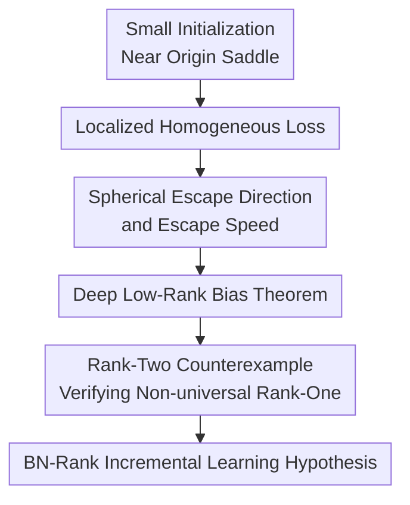

# Saddle-To-Saddle Dynamics in Deep ReLU Networks: Low-Rank Bias in the First Saddle Escape

**Conference**: ICLR 2026  
**OpenReview**: [https://openreview.net/forum?id=B4zcoLvjw0](https://openreview.net/forum?id=B4zcoLvjw0)  
**Code**: None  
**Area**: Learning Theory / Deep Network Training Dynamics  
**Keywords**: Saddle-to-Saddle Dynamics, ReLU Networks, Low-Rank Bias, Bottleneck Rank, Small Initialization  

## TL;DR
Starting from the local dynamics of deep ReLU networks near the origin saddle point under small initialization, this paper characterizes the optimal direction of the first gradient descent escape. It proves that deep weights and activations develop an approximate rank-one bias that strengthens with depth. It further uses a counterexample to show that the first layer of a ReLU network does not strictly require a rank-one structure, unlike deep linear networks.

## Background & Motivation
**Background**: A major divide in deep network training theory is between the lazy/kernel regime and the rich/active regime. The former can be explained via linearization around initialization (NTK or quasi-convex perspectives); the latter involves feature learning, sparsification, and low-rank bias, though its dynamics are significantly more complex, especially as depth increases where mean-field limits may not easily provide interpretable training paths.

**Limitations of Prior Work**: Small initialization is a quintessential way to enter the active regime. Parameters start near zero, and network output is negligible; gradient descent stays near the origin for a period before abruptly moving along an "escape direction." While saddle-to-saddle or condensation theories exist for linear and shallow ReLU networks, deep ReLU networks involve non-smooth activations, inter-layer homogeneity, and high-dimensional activations, meaning one cannot simply apply Hessian eigenvectors or rank-one conclusions from deep linear networks.

**Key Challenge**: If the first escape is viewed as an implicit bias of early training, the question is not "whether the gradient can decrease," but "among all directions that decrease the loss fastest, which functional structure does the network prefer." Deep linear networks suggest a gradual increase in matrix rank; however, empirical phenomena in deep ReLU networks resemble a bottleneck structure where early layers may retain high-dimensional representations while a large number of subsequent layers compress into low-rank channels.

**Goal**: The paper addresses three specific questions. First, how to localize the loss of a ReLU network near the origin under small initialization, and how to define the escape direction and speed. Second, whether the optimal escape direction forces deep weights and activations toward rank-one and whether this bias strengthens with depth. Third, whether this rank-one narrative holds for all layers or if ReLU nonlinearity allows the first few layers to maintain higher-rank structures.

**Key Insight**: Instead of analyzing the full training process, the authors focus on the segment "initially leaving the origin saddle point." Since the output is small near the origin, the loss can be approximated by a first-order term $L_0(\theta)=\mathrm{Tr}[G^\top Y_\theta]$. Because bias-free ReLU networks are $L$-homogeneous with respect to parameters, this local loss possesses a clear spherical projected gradient flow structure. Thus, the escape direction can be defined as a KKT point of the local loss on a sphere of fixed norm.

**Core Idea**: The paper uses spherical optimization of the homogeneous local loss to characterize the first saddle escape and proves that the optimal escape direction for deep ReLU networks naturally forms a "semi-bottleneck" structure: high-rank possible in early layers, and approximately rank-one and more linear in deeper layers.

## Method

### Overall Architecture
The paper does not propose a new training algorithm but establishes a theoretical framework for analyzing the early training of deep ReLU networks under small initialization. Given a training set $X$ and the gradient of the loss at zero output $G=\nabla C(0)$, the authors replace the true loss near the origin with a localized first-order loss $L_0(\theta)=\mathrm{Tr}[G^\top Y_\theta]$. Utilizing the $L$-homogeneity of ReLU networks, gradient flow is decomposed into "parameter norm growth" and "normalized direction seeking a descent direction on the sphere." The paper then studies the optimal escape direction (fastest descent on the sphere) and proves that deeper matrices and activations are necessarily approximately low-rank.

The logic treats early training as a "direction selection problem." If the normalized parameter $\bar\theta$ converges to a point satisfying $\nabla L_0(\rho)=-s\rho$ on the sphere, the original parameters will increase rapidly along this ray. Larger $s$ implies faster escape. Therefore, the optimal escape direction is the direction that minimizes $L_0$ on the fixed-norm sphere, maximizing escape speed.

### Key Designs
**1. Homogeneous Localization: Recasting non-smooth training as an escape problem**

A deep ReLU network at the origin is not a standard strict saddle point; due to non-smoothness, traditional Hessian eigenvectors cannot directly describe the escape. The first step involves using the fact that output is small to write:

$$
L(\theta)=C(Y_\theta)=C(0)+\mathrm{Tr}[G^\top Y_\theta]+O(\|Y_\theta\|_F^2),
$$

where $G=\nabla C(0)$. Dropping constant and higher-order terms, the local loss $L_0(\theta)=\mathrm{Tr}[G^\top Y_\theta]$ preserves the primary descent signal. Bias-free ReLU networks satisfy positive homogeneity: scaling all weights by $\lambda$ scales the output by $\lambda^L$, hence $L_0(\lambda\theta)=\lambda^L L_0(\theta)$. This allows gradient flow to be split into the dynamics of the norm $\|\theta\|$ and the direction $\bar\theta=\theta/\|\theta\|$.

**2. Escape Speed: Replacing Hessian Eigenvectors with Spherical Optimization**

The escape direction is defined as a direction $\rho$ on the sphere of radius $\sqrt{L}$ satisfying:

$$
\nabla L_0(\rho)=-s\rho,
$$

with $s>0$ as the escape speed. If parameters align with $\rho$, the local gradient flow moves along this ray. For $L\neq 2$, the norm satisfies:

$$
\|\theta(t)\|=\left(\|\theta(t_0)\|^{2-L}+(2-L)Ls(t-t_0)\right)^{1/(2-L)},
$$

while $L=2$ shows exponential growth. This explains the long plateau followed by a sudden drop in small-init training: the norm and output are tiny until the direction aligns, at which point the norm explodes along the negative local loss direction.

**3. Deep Low-Rank Bias: Rank-one layers propagate and strengthen with depth**

The main theorem states that under the optimal escape direction $\theta^\star$, sufficiently deep layers satisfy three types of approximate rank-one/linear properties. For the $\ell$-th layer weight $W_\ell$ and activation $Z_\ell^\sigma$, the energy ratio of non-leading singular values satisfies:

$$
\frac{\sum_{i\ge 2}s_i^2(W_\ell)}{\sum_{i\ge 1}s_i^2(W_\ell)},\quad
\frac{\sum_{i\ge 2}s_i^2(Z_\ell^\sigma)}{\sum_{i\ge 1}s_i^2(Z_\ell^\sigma)},\quad
\frac{\|Z_\ell^\sigma-Z_\ell\|_F^2}{\|Z_\ell\|_F^2}
\le O(\ell^{-1/2}),
$$

 This implies the leading singular value gains a significant advantage (on the order of $\ell^{1/4}$). The third ratio measures the impact of ReLU truncation; its decrease suggests deep pre-activations become non-negative, and ReLU acts as an identity mapping within the bottleneck.

**4. Non-universal Rank-one: Locating the difference between ReLU and Linear networks**

The authors construct a counterexample to show that the optimal escape direction is not necessarily rank-one in all layers. In a 2D unit circle with $N=8$ points and alternating gradient signs, a depth-3 bias-free ReLU MLP is analyzed. If all weights were rank-one, the best escape speed is $s_1=\sqrt{2}-1\approx 0.414$. However, a construction with a rank-two first layer and rank-one subsequent layers achieves $s_2=1/2$. This proves that ReLU's gating allows early layers to combine multiple half-spaces for faster descent while deeper layers remain compressed.

### Main Results

| Result | Object | Conclusion | Significance |
|------|------|------|------|
| Theorem 3.1 | Optimal Escape Direction | Non-leading singular value energy ratio for deep $W_\ell, Z_\ell^\sigma$ is $O(\ell^{-1/2})$. | First escape naturally creates low-rank/linear bottlenecks that strengthen with depth. |
| Proposition 3.2 | Escape Speed vs Depth | Increasing depth does not decrease optimal speed; rank-one transmission can be constructed. | Explains why deep layers are prone to rank-one structures. |
| Proposition 3.3 | Sub-network post-low-rank | If a layer's input is nearly non-negative rank-one, subsequent layers under optimal escape are forced to be rank-one. | Provides the mechanism for low-rank propagation. |
| Proposition 3.4 | Fast Escape Points | At least $(1-p)L$ activation layers are approximately rank-one. | Guarantees low-rank starting points exist in deep nets. |
| Example 1 | Unit Circle Alternating Gradient | Rank-one bound $\approx 0.414$; rank-two construction reaches $0.5$. | Proves early-layer high-rank is a valid optimal strategy. |

### Ablation Study

| Configuration | Key Metric | Description |
|------|---------|------|
| MNIST, 6-layer MLP, small init | Post-saddle escape, layers show a single dominant singular value, most evident in layers 4-6. | Supports the theorem that deep low-rank bias is stronger. |
| MNIST, Late Training | A second dominant singular value appears in later stages. | Supports the hypothesis of incremental BN-rank increase post-saddle-to-saddle. |
| CIFAR-10, 6-layer MLP | Singular value evolution shows similar deep low-rank structures. | Confirms the phenomenon is not limited to MNIST. |
| Depth 4 vs Depth 6 | 6-layer networks have clearer plateaus and low-rank phases. | Suggests depth and small init are both needed for visible saddle-to-saddle structures. |
| Toy example, Width | Success rate of finding rank-two escape directions increases with width. | Supports that wide nets are more likely to contain and amplify optimal escape "circuits." |

### Key Findings
- The first escape is not arbitrarily low-rank but has positional structure: deeper layers are closer to rank-one and ReLU acts more like identity.
- Deep ReLU networks differ from deep linear networks: the optimal escape need not be rank-one at every layer; early layers can retain high rank for piecewise linear gating.
- The emergence of secondary singular values in later training matches the "BN-rank 1 first, then incremental increase" narrative.
- Depth modifies visible dynamics; deeper ReLU networks more easily form clear bottlenecks and multiple plateaus during saddle escapes.

## Highlights & Insights
- Recasting non-smooth training near the origin as a spherical escape problem is the core modeling contribution, avoiding Hessian dependence while capturing direction selection.
- The theorem provides a depth-dependent bias rather than a blanket statement, which better characterizes the "semi-bottleneck" structure of ReLU networks.
- The rank-two counterexample proves that early-layer high-rank is an optimal strategy, not noise, due to ReLU's gating capacity.
- This work links saddle-to-saddle dynamics to BN-rank, providing a complexity measure better suited for ReLU networks than standard matrix rank.

## Limitations & Future Work
- The theory mainly characterizes the *first* escape; it does not yet prove the full trajectory visits a sequence of increasing BN-rank saddles.
- Results target the *optimal* escape direction; while finite-width gradient descent empirically follows it, a rigorous proof for general cases is still needed.
- Analysis relies on bias-free MLPs and small initialization, leaving a gap for modern architectures (ResNets, Attention, Normalization).
- The relationship between low-rank dynamics and generalization/robustness is not yet directly established.

## Related Work & Insights
- **vs. Deep Linear Saddle-to-Saddle**: In linear nets, escapes are typically rank-one across all layers. This work shows ReLU networks admit a more complex "BN-rank" structure where early layers behave differently.
- **vs. Shallow ReLU Condensation**: Shallow theories focus on neuron groups; this work focuses on layer-wise propagation of low-rank channels in deep architectures.
- **vs. Mean-field Theory**: Mean-field describes the active regime but often lacks interpretable paths; the saddle-to-saddle regime here yields more readable structural conclusions.
- **Insight**: Researchers tracking feature learning should monitor singular values and ReLU truncation ratios across layers, as they reveal which "saddle stage" the network occupies.

## Rating
- Novelty: ⭐⭐⭐⭐⭐ 
- Experimental Thoroughness: ⭐⭐⭐⭐☆ 
- Writing Quality: ⭐⭐⭐⭐☆ 
- Value: ⭐⭐⭐⭐⭐ 

<!-- RELATED:START -->

<!-- RELATED:END -->

## Related Papers

- [\[ICLR 2026\] Characterizing the Discrete Geometry of ReLU Networks](characterizing_the_discrete_geometry_of_relu_networks.md)
- [\[ICLR 2026\] On Universality of Deep Equivariant Networks](on_universality_of_deep_equivariant_networks.md)
- [\[ICLR 2026\] Implicit bias produces neural scaling laws in learning curves, from perceptrons to deep networks](implicit_bias_produces_neural_scaling_laws_in_learning_curves_from_perceptrons_t.md)
- [\[ICLR 2026\] Gradient Descent Dynamics of Rank-One Matrix Denoising](gradient_descent_dynamics_of_rank-one_matrix_denoising.md)
- [\[ICLR 2026\] On the Convergence of Two-Layer Kolmogorov-Arnold Networks with First-Layer Training](on_the_convergence_of_two-layer_kolmogorov-arnold_networks_with_first-layer_trai.md)

<!-- RELATED:END -->
