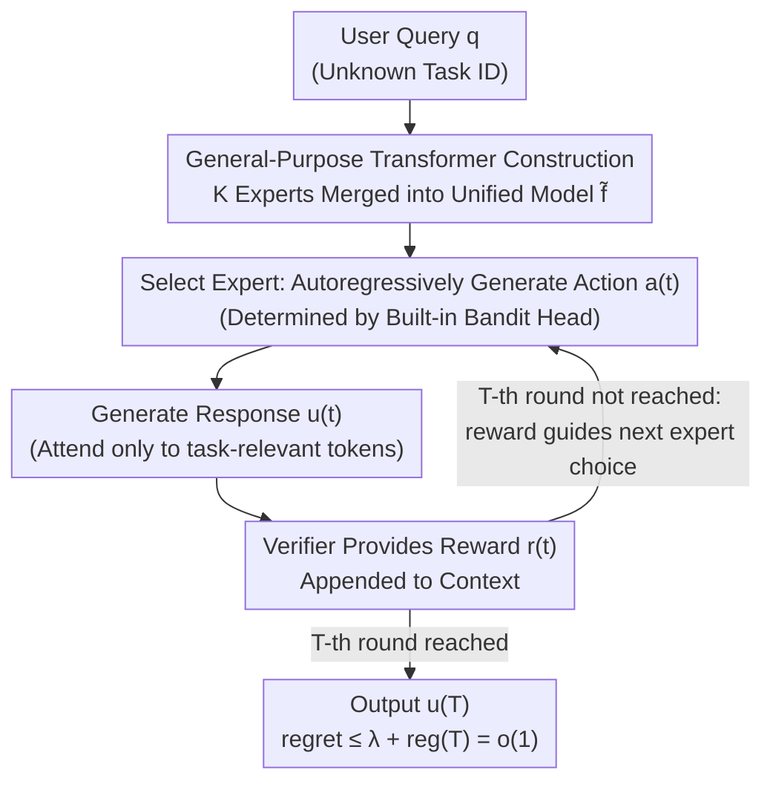

# Sample Complexity and Representation Ability of Test-time Scaling Paradigms

**Conference**: ICLR 2026  
**OpenReview**: [https://openreview.net/forum?id=RJDIX75TEE](https://openreview.net/forum?id=RJDIX75TEE)  
**Code**: https://github.com/LithiumDA/Representation-Ability-of-Test-time-Scaling  
**Area**: Learning Theory / LLM Inference / Test-time Scaling  
**Keywords**: Sample Complexity, Self-consistency, best-of-n, Self-correction, Transformer Expressivity

## TL;DR
This paper theoretically characterizes the efficiency of three test-time scaling strategies: it proves that self-consistency requires $\Theta(1/\Delta^2)$ samples while best-of-n requires only $\Theta(1/\Delta)$ samples ($\Delta$ being the probability gap between the correct and sub-optimal answers). It also constructively proves that self-correction with verifier feedback allows a single Transformer to simulate "online learning over multiple experts" at test time, extending Transformer expressivity theory from single-task to multi-task settings.

## Background & Motivation
**Background**: Test-time scaling (increasing computation during inference) has become a mainstream route for enhancing LLM performance on complex tasks, giving rise to reasoning models like o1 and DeepSeek-R1. Common practices fall into two categories: repeated sampling followed by selection (e.g., self-consistency voting for the most frequent answer, best-of-n selecting the highest reward answer) and self-correction (where the model iteratively refines its output based on feedback).

**Limitations of Prior Work**: While these methods show strong empirical results, theoretical understanding lags behind. Two fundamental questions remain unanswered: (1) How many samples are required to reliably select the correct answer via repeated sampling? What is the gap between self-consistency and best-of-n? (2) Why is self-correction "effective," and how does it fundamentally differ from repeated sampling?

**Key Challenge**: All attempts in repeated sampling are i.i.d.—more sampling simply repeats the same distribution, with the accuracy ceiling locked by the distribution itself. In contrast, outputs in self-correction are **not** i.i.d., as subsequent rounds depend on previous verifier feedback. This dependency structure is a major hurdle for theoretical analysis but also the root of how self-correction improves over iterations. Concurrently, existing Transformer expressivity theory mostly focuses on whether a model can represent a fixed task, whereas real LLMs must handle multiple unknown tasks at test time; multi-task expressivity remains largely uncharacterized.

**Goal**: To decompose the problem into two sub-problems: providing the **precise sample complexity** (including matching upper and lower bounds) for self-consistency and best-of-n, and characterizing the **multi-task expressivity** of self-correction.

**Key Insight**: Utilize a probability gap $\Delta$ to uniformly characterize the difficulty of repeated sampling, revealing an essential separation of $\Theta(1/\Delta^2)$ vs $\Theta(1/\Delta)$. Then, re-interpret self-correction as "test-time online learning/regret minimization over a set of experts" and prove its expressivity through a universal Transformer construction independent of internal expert parameters.

## Method

### Overall Architecture
The paper is a theoretical analysis divided into two independent lines corresponding to the two introductory questions. The first line analyzes **repeated sampling**: the difficulty of "selecting the correct answer" is reduced to a scalar—the probability gap $\Delta := p(o^*) - \max_{o \neq o^*} p(o)$, where $p(o)$ is the probability of generating answer $o$ after marginalizing over all reasoning paths, and $o^*$ is the correct answer. Under the setting $\Delta > 0$ (where the most likely answer is correct), the paper provides matching upper and lower bounds for the sample complexity of self-consistency and best-of-n, yielding a separation of $\Theta(1/\Delta^2)$ and $\Theta(1/\Delta)$.

The second line analyzes the expressivity of **self-correction**. The authors propose a "General-Purpose Transformer" meta-construction that concatenates $K$ task-specific expert Transformers into a single unified Transformer. This model, paired with verifier feedback, can autoregressively "select expert $\to$ generate response $\to$ receive reward $\to$ update context" according to the protocol in Algorithm 1. This essentially executes a regret minimization (bandit) algorithm over the expert pool, eventually converging to the optimal expert with $o(1)$ regret. The following diagram illustrates the test-time online learning loop for the self-correction line:

Importantly, the "select/generate/feedback" loop occurs entirely within the **internal computations of a single unified Transformer**, without explicitly querying external experts—this is the key to the expressivity result.

### Key Designs

**1. Sample Complexity Separation via Probability Gap $\Delta$**

This design addresses the question of "which sampling method is more sample-efficient." The authors compress the difficulty into a single metric $\Delta$, which measures the probability margin between the correct and the next-best answer in the marginalized distribution. For self-consistency (Theorem 3.1), success occurs with $1-\delta$ probability when $n \geq C\log(O/\delta)/\Delta^2$ (where $O=|\mathcal{O}|$ is the answer space size), and hard instances exist that fail with constant probability when $n \leq c/\Delta^2$, confirming a complexity of $\Theta(1/\Delta^2)$. For best-of-n (Theorem 3.2), assuming the reward is maximized only at the correct answer, $n \geq C\log(1/\delta)/\Delta$ is sufficient for success, while $n \leq c/\Delta$ leads to failure on hard instances, yielding $\Theta(1/\Delta)$.

The separation stems from mechanistic differences: self-consistency relies on **counting votes**, requiring the empirical frequency of the correct answer to be distinguished from noise (statistical fluctuations of Bernoulli proportions), which naturally leads to a quadratic $1/\Delta^2$ dependence. Best-of-n, equipped with a reward scorer that identifies the correct answer, succeeds as long as the correct answer is **sampled at least once**, resulting in a linear $1/\Delta$ sample requirement. This theoretically explains why "best-of-n is generally more accurate than self-consistency" in practice.

**2. General-Purpose Transformer: Lossless Integration of Multiple Experts**

This design targets the "lack of multi-task expressivity characterization in Transformers." The authors define a General-Purpose Transformer $\phi$ of type $(t_1, t_2)$: it maps any set of $K$ expert Transformers (with hidden dimension $d$ and depth $L$) into a single unified Transformer with hidden dimension $t_1 \cdot d + t_2$ and depth $L + O(1)$, **independently** of the experts' internal parameters. The core mechanism involves "selective attention" to implement implicit function calling: when the vocabularies of $K$ experts are disjoint (Proposition 4.2), the unified model uses the end-of-input token to infer the current task $\kappa$ and only attends to tokens belonging to $V_\kappa$, equivalent to calling expert $f_\kappa$. When experts share vocabularies (Proposition 4.4), indicator tokens $\Omega$ are used to define task boundaries, achieving "attention only to task-relevant segments."

The type parameters $(O(K), O(\log N_{\max}))$ are essential: the dependence on $K$ arises because the model must retain the capability to call any of the $K$ experts without prior task knowledge, necessitating the encoding of all expert features. $\log N_{\max}$ comes from positional encoding—to construct $N_{\max}$ approximately orthogonal vectors, the embedding dimension must be at least $\log N_{\max}$. This construction is significant as it provides a general mechanism for a single architecture to provably represent multiple tasks simultaneously.

**3. Self-Correction = Test-time Online Learning with $o(1)$ Regret**

This design answers "why self-correction is useful and its fundamental difference from repeated sampling." The authors define a regret-minimization Transformer (Definition 4.6), which autoregressively selects actions $a_t \sim p_f(\cdot \mid a_1, R_1, \dots, a_{t-1}, R_{t-1})$ in an action space $\mathcal{A}$ based on rewards $r$, ensuring simple regret $\max_{a^*} r(a^*) - \mathbb{E}[r(a_T)] \leq \mathrm{reg}(T) = o(1)$. This allows the Transformer to implement bandit algorithms like UCB or Thompson sampling.

The main result, Theorem 4.7, combines this with the general-purpose construction: given $K$ experts (where one expert $f_{k^*}$ achieves $\lambda$-suboptimal reward) and a regret-minimization Transformer $f_0$, there exists a unified Transformer $\tilde f = \phi(f_0, f_1, \dots, f_K)$. When run via the Algorithm 1 protocol, it satisfies $\max_{u^*} r(q, u^*) - \mathbb{E}[r(q, u^{(T)})] \leq \lambda + \mathrm{reg}(T)$. This means the unified model can **learn for itself** at test time which expert is most suitable. This distinguishes it from repeated sampling: while sampling attempts are identical and fixed, self-correction updates its attempts based on verifier feedback, allowing the probability of generating the correct answer to increase as inference progresses.

### Mechanism Example
Consider the PDE solving example (also Figure 1): a user provides a partial differential equation. The unified Transformer $\tilde f$ first autoregressively selects an action (e.g., "Select Expert 6"), then executes the corresponding solver (e.g., spectral method). The verifier provides the negative solving error as a reward feedback. In the next round, the model selects a potentially better expert (e.g., finite element method) based on history. Over $T$ rounds, the regret is reduced to $o(1)$, outputting the solution with minimum error. The entire "trial-and-error" learning process occurs within a single Transformer.

## Key Experimental Results

Experiments consist of **synthetic validation** to support the theory.

### Main Results

*First Group (Expressivity of Self-correction)*: A synthetic task is constructed—a prompt concatenates a 4-variable 20-clause 3-SAT instance and a string of $\{a,b\}$. If the 3-SAT is satisfiable, the string is copied; otherwise, it is reversed. The training distribution is 9:1 (Sat:Unsat) while the test set is 1:1, creating a distribution shift to induce correction.

| Model | Without Self-correction | With Self-correction |
|------|-----------|-----------|
| GPT-nano | 1.23% | 2.56% |
| GPT-micro | 63.19% | 93.09% |
| GPT-mini | 63.19% | 98.57% |
| Gopher-44M | 63.19% | 99.15% |

Without correction, accuracy plateaus at 63.19%. With verifier signals, sufficiently large models (GPT-mini, Gopher-44M) approach perfection, validating that effective self-correction requires additional model capacity.

*Second Group (Sample Complexity Separation)*: On AIME 24 & 25 mathematical reasoning benchmarks, using Qwen3-1.7B/4B and Llama-3.2-3B-Instruct as candidates and Qwen3-32B as the verifier:

| Model | Self-consistency (64 samples) | Best-of-n (4 samples) | Self-correction (4 samples) |
|------|---------------------------|--------------------|--------------------------|
| Qwen3-1.7B | 58.33% | 59.68% | 79.29% |
| Qwen3-4B | 78.33% | 80.58% | 81.19% |
| Llama-3.2-3B-Instruct | 1.67% | 4.84% | 24.52% |

**Best-of-n with only 4 samples outperforms self-consistency with 64 samples**, directly verifying the $\Theta(1/\Delta)$ vs $\Theta(1/\Delta^2)$ gap. Self-correction (also 4 samples) leads further.

### Key Findings
- The benefits of self-correction are highly dependent on model capacity: GPT-nano fails to correct, while larger models approach full accuracy—expressivity is a "threshold" rather than a "gradient."
- Best-of-n's sample efficiency advantage is significant: 4 samples can outperform 64 samples in self-consistency, consistent with the theoretical linear vs. quadratic separation of $\Delta$.
- Weak models (Llama-3.2-3B) benefit most from verification-based strategies, indicating verifier feedback is crucial for models with flatter distributions.

## Highlights & Insights
- Using a single scalar $\Delta$ (probability gap) to characterize repeated sampling difficulty is the key abstraction that translates empirical observations into provable $\Theta(1/\Delta)$ vs $\Theta(1/\Delta^2)$ rates.
- The "General-Purpose Transformer" is a reusable tool: merging multiple experts into one independently of internal parameters provides a template for multi-task expressivity beyond self-correction.
- Re-interpreting self-correction as test-time online learning/regret minimization provides a unified theoretical perspective for In-Context RL and verifier-based scaling—its superiority over repeated sampling stems from breaking the i.i.d. assumption.

## Limitations & Future Work
- The expressivity result is an **existence construction**: it proves such a Transformer *exists* but does not guarantee that trained LLMs learn this specific structure. The construction is also more theoretical than an efficient implementation.
- Regret guarantees rely on strong assumptions: an ideal verifier (reward maximized only for the correct answer) and the existence of a regret-minimization Transformer. Results may degrade with noisy verifiers or reward hacking.
- Sample complexity analysis assumes $\Delta > 0$ (most likely answer is correct). When the model is biased ($\Delta \leq 0$), self-consistency naturally fails; the theory does not cover systematic model errors.
- Experiments are focused on synthetic 3-SAT and small-scale AIME validations. Cross-task difficulty or comparisons across larger sample budgets should be interpreted cautiously.

## Related Work & Insights
- **vs. Progressive Sharpening / Generation-verification gap (Huang et al. 2024a; Song et al. 2024b)**: Those works use sharpening or gaps to qualitatively describe self-improvement; Ours provides **explicit sample complexity rates** and **specific architectural constructions**, making capabilities and limits more quantifiable.
- **vs. Verifier-based RL Theory (Setlur et al. 2025)**: They argue for verifier methods from an RL perspective; Ours provides fine-grained $\Delta$ separation **within repeated sampling** (SC vs BoN) and unifies self-correction into a bandit framework.
- **vs. Transformer Expressivity Classics (Yun et al. 2020; Feng et al. 2023)**: Prior work focuses on single-task universal approximation or CoT; Ours proposes general-purpose expressivity, extending theory to "single architecture, multiple tasks."

## Rating
- Novelty: ⭐⭐⭐⭐⭐ First to provide matching sample complexity separation for SC vs BoN and to characterize self-correction as multi-task online learning.
- Experimental Thoroughness: ⭐⭐⭐ Synthetic tasks + small-scale AIME are sufficient to support theory but fall short of large-scale empirical studies.
- Writing Quality: ⭐⭐⭐⭐ Theorems and intuition are well-integrated; the $\Delta$ abstraction and Algorithm 1 make abstract theory readable.
- Value: ⭐⭐⭐⭐⭐ Provides a provable basis for strategy selection in test-time scaling and explains why self-correction works.

<!-- RELATED:START -->

<!-- Paper links go here if applicable -->

<!-- RELATED:END -->

## Related Papers

- [\[ICLR 2026\] Mitigating the Curse of Detail: Scaling Arguments for Feature Learning and Sample Complexity](mitigating_the_curse_of_detail_scaling_arguments_for_feature_learning_and_sample.md)
- [\[ICLR 2026\] Expressive Power of Implicit Models: Rich Equilibria and Test-Time Scaling](expressive_power_of_implicit_models_rich_equilibria_and_test-time_scaling.md)
- [\[ICLR 2026\] Test-Time Verification via Optimal Transport: Coverage, ROC, & Sub-Optimality](test-time_verification_via_optimal_transport_coverage_roc_sub-optimality.md)
- [\[ICLR 2026\] How hard is learning to cut? Trade-offs and sample complexity](how_hard_is_learning_to_cut_trade-offs_and_sample_complexity.md)
- [\[ICLR 2026\] Near-Optimal Sample Complexity Bounds for Constrained Average-Reward MDPs](near-optimal_sample_complexity_bounds_for_constrained_average-reward_mdps.md)

<!-- RELATED:END -->
