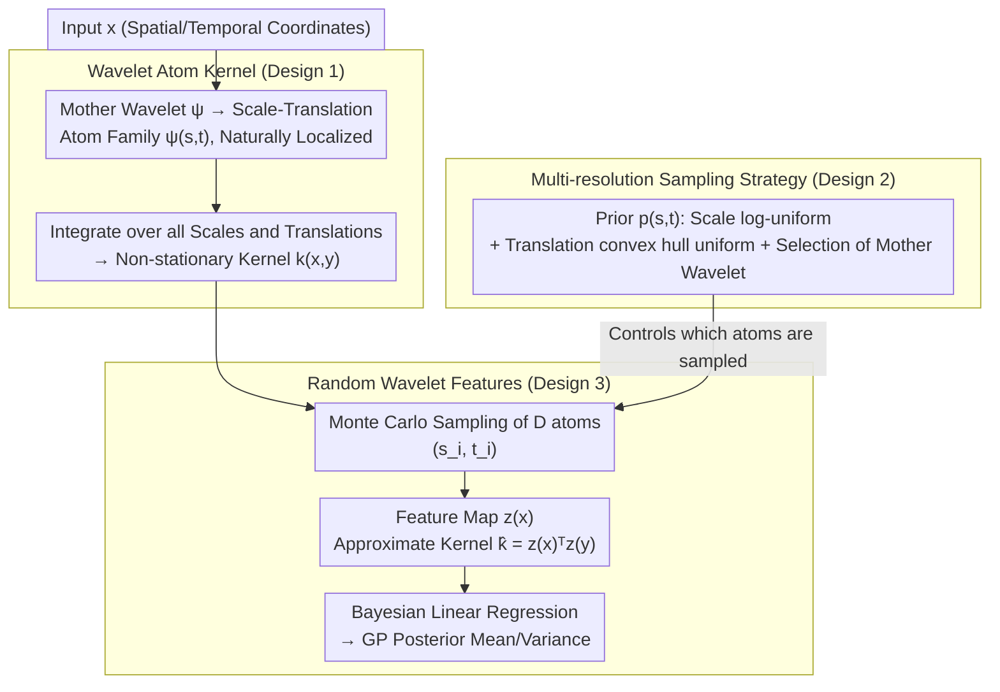

# Scalable Random Wavelet Features: Efficient Non-Stationary Kernel Approximation with Convergence Guarantees

## Meta Information
- **Conference**: ICLR 2026
- **arXiv**: [2602.00987](https://arxiv.org/abs/2602.00987)
- **Code**: Not released
- **Area**: Others
- **Keywords**: kernel methods, random features, wavelets, non-stationary, Gaussian processes, multi-resolution

## TL;DR
The paper proposes Random Wavelet Features (RWF), which construct scalable non-stationary kernel approximations by randomly sampling from wavelet families. This approach retains the linear time complexity of random features while providing guarantees for positive definiteness, unbiasedness, and uniform convergence.

## Background & Motivation
- **The GP Dilemma**: Expressiveness vs. Efficiency. Exact GP computation is $O(N^3)$ and typically relies on stationary kernels.
- **Random Fourier Features (RFF)**: Approximates stationary kernels as linear models based on Bochner’s theorem with $O(ND^2)$ training, but is inherently limited to stationary kernels.
- **Challenges in Non-stationary Modeling**: Keywords in domains like geospatial and speech have statistical properties that change with location. Methods like Deep GP and Spectral Mixture kernels can model non-stationarity but are computationally expensive.
- **Key Challenge**: A lack of a random feature framework that is as scalable as RFF while natively capturing non-stationarity.

## Method

### Overall Architecture
The Core Idea of RWF is to replace the global sinusoidal bases in RFF—which cover the entire space and only recognize $x-y$—with wavelet atoms localized in both space and frequency. The pipeline consists of three layers: first, defining a non-stationary kernel using a family of scale-translation wavelet atoms (where kernel values drift with position and no longer depend solely on $\mathbf{x}-\mathbf{y}$); second, determining which scales and locations these atoms cover using a multi-resolution prior $p(s,\mathbf{t})$; finally, sampling $D$ atoms from this prior via Monte Carlo to compress the infinite-dimensional integral kernel into a finite-dimensional feature map. This reduces kernel regression to ordinary Bayesian linear regression. The process only requires computing features once for $D$ random wavelet atoms, thus preserving the $O(ND^2)$ linear time complexity while gaining the ability to model non-stationarity.

### Key Designs

**1. Wavelet Atom Kernel: Defining Non-stationary Kernels with Local Bases**

The root of RFF's restriction to stationarity is that the Fourier basis $e^{i\omega^\top x}$ is homogeneous across the entire space, making correlations depend only on $x-y$. RWF instead uses an atom family generated from a mother wavelet $\psi:\mathbb{R}^d\to\mathbb{R}$ as $\psi_{s,\mathbf{t}}(\mathbf{x}) = s^{-d/2}\psi\big((\mathbf{x}-\mathbf{t})/s\big)$. Each atom is controlled by a scale $s$ and translation $\mathbf{t}$, naturally localizing it in a specific spatial position and frequency band. The non-stationary kernel is obtained by integrating over all scales and translations:

$$k(\mathbf{x},\mathbf{y}) = \int_0^\infty\!\int_{\mathbb{R}^d}\psi_{s,\mathbf{t}}(\mathbf{x})\,\psi_{s,\mathbf{t}}(\mathbf{y})\,p(s,\mathbf{t})\,d\mathbf{t}\,ds$$

where $p(s,\mathbf{t})$ is the sampling density over scale and translation. Because atoms drift with position, the kernel value no longer depends solely on $\mathbf{x}-\mathbf{y}$, natively supporting non-stationarity. The integral construction as an inner product $\psi_{s,\mathbf{t}}(\mathbf{x})\psi_{s,\mathbf{t}}(\mathbf{y})$ provides the structural foundation for positive definiteness and unbiasedness in subsequent approximations.

**2. Multi-resolution Sampling Strategy: Controlling Wavelet Coverage via Priors**

Once the atom kernel is defined, feature quality depends on how $(s,\mathbf{t})$ are sampled and the choice of the mother wavelet—addressed by $p(s,\mathbf{t})$. The scale $s$ follows a log-uniform distribution to ensure balanced coverage of fine and coarse wavelets across orders of magnitude. This allows fine atoms to capture local abrupt changes while coarse atoms model long-range trends. Translation $\mathbf{t}$ is sampled uniformly over the data's convex hull to ensure atoms cover the input support. Mother wavelets are chosen based on signal characteristics: Morlet for oscillatory signals in time-frequency analysis, Daubechies for sharp transitions, and Mexican Hat for impulse detection. Thus, $p(s,\mathbf{t})$ acts as both a sampler and a prior that adapts the feature family to the data's non-stationary structure.

**3. Random Wavelet Features: Compressing Integral Kernels via Monte Carlo**

The integral kernel above cannot be computed directly. RWF uses Monte Carlo sampling to independently draw $D$ sets of $(s_i,\mathbf{t}_i)$ from the prior $p(s,\mathbf{t})$ to construct a feature map $z(\mathbf{x}) = \frac{1}{\sqrt{D}}[\psi_{s_1,\mathbf{t}_1}(\mathbf{x}),\ldots,\psi_{s_D,\mathbf{t}_D}(\mathbf{x})]^\top$. The kernel is approximated as $\hat{k}(\mathbf{x},\mathbf{y}) = z(\mathbf{x})^\top z(\mathbf{y})$. This step transforms kernel regression into a linear model over explicit finite-dimensional features, reducing GP inference to Bayesian linear regression with closed-form solutions for the posterior covariance $\mathbf{S}_{\mathbf{w}} = (\mathbf{I}_D + \sigma^{-2}\mathbf{Z}^\top\mathbf{Z})^{-1}$ and mean $\mathbf{m}_{\mathbf{w}} = \sigma^{-2}\mathbf{S}_{\mathbf{w}}\mathbf{Z}^\top\mathbf{y}$.

The following table compares the complexity of RWF with mainstream methods, showing it is as efficient as RFF while gaining non-stationary modeling capabilities:

| Method | Training Complexity | Prediction Complexity |
|------|-----------|-----------|
| Exact GP | $O(N^3)$ | $O(N^2)$ |
| SVGP | $O(NM^2)$ / step (iterative) | $O(M^2)$ |
| RFF-GP | $O(ND^2)$ (one-pass) | $O(D^2)$ |
| **RWF-GP** | $O(ND^2)$ (one-pass) | $O(D^2)$ |

## Theoretical Guarantees

### Theorem 4.1 (Positive Definiteness)
The kernel $k(\mathbf{x}, \mathbf{y})$ constructed by RWF is positive definite for any non-negative measure $p(s, \mathbf{t})$.

### Lemma 4.1 (Unbiasedness)
$\mathbb{E}[\hat{k}(\mathbf{x}, \mathbf{y})] = k(\mathbf{x}, \mathbf{y})$ for all $\mathbf{x}, \mathbf{y} \in \mathcal{X}$.

### Uniform Convergence Guarantee
$$\Pr\left[\sup_{\mathbf{x}, \mathbf{y} \in \mathcal{X}} |\hat{k}(\mathbf{x}, \mathbf{y}) - k(\mathbf{x}, \mathbf{y})| > \epsilon\right] \leq \mathcal{O}\left(\exp(-D\epsilon^2 / B^4)\right)$$

This implies that $D = O(B^4 / \epsilon^2)$ features are sufficient to guarantee an $\epsilon$-accurate uniform approximation.

## Key Experimental Results

### Main Results: Regression Tasks

| Method | Synthetic Non-stationary | Speech Data | Large-scale Regression |
|------|-----------|---------|-----------|
| RFF-GP | Underfits local structure | High RMSE | Fast but inaccurate |
| SVGP | Moderate | Moderate | Moderate speed/accuracy |
| Deep GP | Best | Best | Slow but accurate |
| **RWF-GP** | **Close to Deep GP** | **Close to Deep GP** | **Fast and accurate** |

> RWF-GP is close to Deep GP in accuracy and close to RFF-GP in speed.

### Ablation Study: Impact of Feature Number

| Feature Count $D$ | RFF RMSE | RWF RMSE |
|-----------|----------|----------|
| 50 | 0.85 | 0.62 |
| 100 | 0.78 | 0.45 |
| 500 | 0.72 | 0.31 |
| 1000 | 0.70 | 0.28 |

> RWF consistently outperforms RFF at the same feature count, with more significant improvements as $D$ increases due to the localized advantages of wavelets.

### Key Findings
1. RWF significantly outperforms RFF on non-stationary signals without increasing computational complexity.
2. The multi-resolution structure allows fine wavelets to capture local events while coarse wavelets model long-range trends.
3. Different wavelet families suit different data characteristics (e.g., Morlet for oscillations, Mexican Hat for impulses).
4. Accuracy is comparable to Deep GP but an order of magnitude faster.

## Highlights & Insights
- **Fills Theoretical Gap**: Provides the first complete theoretical chain from positive definiteness to unbiasedness and uniform convergence for wavelet-based random features.
- **Conceptual Elegance**: Extends RFF (global sinusoidal bases → stationary kernels) to RWF (local wavelet bases → non-stationary kernels) as a natural generalization.
- **Practical Efficiency**: Maintains $O(ND^2)$ training while gaining non-stationary modeling capabilities.
- **Multi-resolution Flexibility**: Adapts to different data characteristics by adjusting $p(s, \mathbf{t})$.

## Limitations & Future Work
- Selection of mother wavelets and sampling distributions still requires some hyperparameter tuning.
- Isotropic scaling might be limited in high-dimensional anisotropic problems.
- For certain non-stationary patterns (e.g., abrupt change points), a fixed wavelet family might lack sufficient flexibility.
- Theoretical upper bounds on expressiveness exist compared to end-to-end learnable Deep GPs.

## Related Work
- **Random Fourier Features**: Pioneering work by Rahimi & Recht (2007) and subsequent extensions to adaptive and structured sampling.
- **Wavelet Kernels**: Wavelet SVM by Zhang et al. (2004) and fixed wavelet basis Bayesian regression by Guo et al. (2024).
- **Non-stationary GP**: Deep GP (Damianou et al., 2013), Spectral Mixture Kernels (Wilson & Adams, 2013).
- **Scalable GP**: KISS-GP (Wilson & Nickisch, 2015), Deep Kernel Learning (Wilson et al., 2016).

## Rating
- Novelty: ⭐⭐⭐⭐ — A natural but effective combination of wavelets and random features.
- Theoretical Depth: ⭐⭐⭐⭐⭐ — Comprehensive coverage of positive definiteness, unbiasedness, variance bounds, and uniform convergence.
- Experimental Thoroughness: ⭐⭐⭐⭐ — Covers synthetic, speech, and large-scale regression, though more real-world applications could be included.
- Value: ⭐⭐⭐⭐ — Directly applicable to scenarios requiring non-stationary modeling with scalability requirements.

<!-- RELATED:START -->

## Related Papers

- [\[ICLR 2026\] Online Inventory Optimization in Non-Stationary Environment](online_inventory_optimization_in_non-stationary_environment.md)
- [\[ICML 2026\] Conditional KRR: Injecting Unpenalized Features into Kernel Methods with Applications to Kernel Thresholding](../../ICML2026/learning_theory/conditional_krr_injecting_unpenalized_features_into_kernel_methods_with_applicat.md)
- [\[ICLR 2026\] Random-Projection Ensemble Dimension Reduction](random-projection_ensemble_dimension_reduction.md)
- [\[ICLR 2026\] Random Spiking Neural Networks are Stable and Spectrally Simple](random_spiking_neural_networks_are_stable_and_spectrally_simple.md)
- [\[ICLR 2026\] Data-Aware and Scalable Sensitivity Analysis for Decision Tree Ensembles](data-aware_and_scalable_sensitivity_analysis_for_decision_tree_ensembles.md)

<!-- RELATED:END -->
