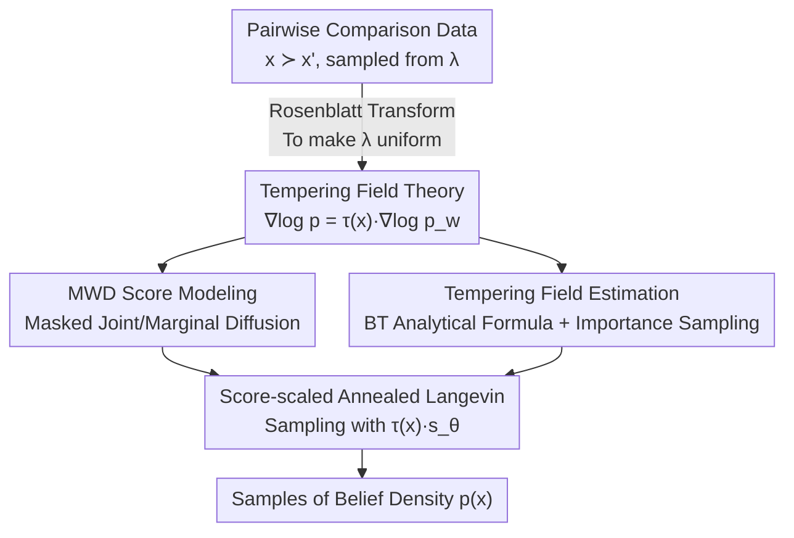

# Score-Based Density Estimation from Pairwise Comparisons

**Conference**: ICLR 2026  
**OpenReview**: [https://openreview.net/forum?id=hYojmwkXwQ](https://openreview.net/forum?id=hYojmwkXwQ)  
**Code**: https://github.com/petrus-mikkola/pairwise2diffusion  
**Area**: Learning Theory / Probabilistic Methods / Score Matching / Expert Knowledge Acquisition  
**Keywords**: Pairwise comparisons, Score matching, Diffusion models, Tempering fields, Random utility models

## TL;DR
This paper proves an exact **pointwise collinear** relationship between the "score of the target belief density" and the "score of the observable winner marginal density." They are connected by a position-dependent "tempering field" $\tau(x)$. This transforms the difficult problem of learning density from sparse pairwise comparisons $x \succ x'$ into a solvable workflow: learning the winner density with a score model, estimating a tempering field, and "de-tempering." The method learns complex multi-modal belief densities using only hundreds to thousands of pairwise comparisons.

## Background & Motivation
**Background**: Using normalizing flows or diffusion models to learn complex densities from samples $x \sim p(x)$ is well-established, effectively capturing high-dimensional natural images. However, in many real-world scenarios, samples from $p(x)$ are unavailable. Instead, one only has access to an expert's **preference comparisons** between pairs: given $x$ and $x'$ (sampled from a distribution $\lambda$ unrelated to $p$), the expert indicates which is more probable or better, resulting in triplets $(x, x', x \succ x')$. This is the core setting for "prior elicitation" in statistics, as well as quantifying the probabilistic knowledge of LLMs or learning from human feedback.

**Limitations of Prior Work**: Pairwise comparisons only reflect the ordinal relationship of "which density is higher" and do not directly provide the density itself, making the recovery of $p(x)$ an inherently underdetermined problem. Mikkola et al. (2024) provided the first solution using normalizing flows to learn density from comparisons and rankings, **empirically** observing that $p(x)$ appears to be a **constant tempered** version of the winner distribution: $p(x) \approx [p_w(x)]^{\tau}$. However, this link was heuristic and lacked theoretical characterization; furthermore, flow-based methods require extra regularization to prevent "probability mass escape" and rely on more demanding multiple-item rankings for optimal accuracy.

**Key Challenge**: Constant tempering $p \approx p_w^\tau$ is **mathematically invalid**—a global constant $\tau$ cannot align the shapes of two densities at all positions simultaneously. It only provides an approximation, which is the root cause for limited accuracy in flow methods and the overestimation of low-density regions.

**Goal**: (1) Provide an exact relationship between $p(x)$ and the observable **winner marginal density** (MWD) $p_w(x)$; (2) Design a practical density estimation algorithm based on this relationship using only **pairwise comparisons** (the easiest and most reliable form of feedback).

**Key Insight**: Instead of viewing the relationship as "approximate tempering at the density level," the authors re-examine it at the **score level**. For a constant-tempered density $p \propto q^\tau$, the scores satisfy $\nabla \log p = \tau \nabla \log q$ (strict collinearity). By generalizing this to a "local, pointwise" tempering, an **exact** relationship can be derived.

**Core Idea**: Connect the two scores using a **position-dependent tempering field** $\tau(x)$ (instead of a constant $\tau$): $\nabla \log p(x) = \tau(x)\, \nabla \log p_w(x)$. The score of the winner density is solved via score matching, the tempering field is estimated using an analytical formula from the Bradley–Terry model, and samples are drawn from $p(x)$ using "score-scaled Annealed Langevin Dynamics."

## Method

### Overall Architecture
The objective is to recover the expert's belief density $p(x)$ given only pairwise comparison data $\mathcal{D} = \{[x_i, x_i'] \mid x_i \succ x_i'\}$. The core insight is to decouple the recovery of $p$ into two solvable tasks: **learning the score of an observable proxy density (MWD $p_w$)** and **multiplying it by a field $\tau(x)$ that "de-tempers" the proxy score into the target score**. This is justified by the proof that $\nabla \log p(x) = \tau(x)\nabla \log p_w(x)$.

Specifically, assuming the expert's choice follows a Random Utility Model (RUM) with utility $u(x) = \log p(x)$, where candidates are sampled independently from $\lambda(x)$, the density of the selected points is the **Winner Marginal Density (MWD)** $p_w(x) = \int p_{x\succ x'}(x,x')\,dx'$. The pipeline is: (1) Use a masked diffusion model to simultaneously learn the joint winner-loser distribution and its marginal MWD score; (2) Estimate the tempering field $\tau(x)$ using analytical formulas under the Bradley–Terry model combined with importance sampling; (3) Perform Annealed Langevin Dynamics using the scaled score $\tau(x)s_\theta(x,\sigma)$ to sample from $p(x)$. To handle non-uniform $\lambda$, a Rosenblatt transform reparameterizes the space to be uniform; the diffusion model is trained in the transformed space, and samples are transformed back.

### Key Designs

**1. Tempering Field: Upgrading from "Density-level Constant Tempering" to "Score-level Pointwise Collinearity"**

This design directly addresses the failure of constant tempering $p \approx p_w^\tau$. The authors define: if $\tau: \mathcal{X} \to (0,\infty)$ allows the scores of two densities to satisfy 
$$\nabla \log p(x) = \tau(x)\, \nabla \log p_w(x)$$ 
almost everywhere, then $\tau$ is a **tempering field** between $p$ and $p_w$. This implies that the score vectors are **collinear** at every position, with the scaling coefficient varying spatially. The key contribution is proving that for two classes of RUMs (Bradley–Terry and Exponential RUMs), such a tempering field **exists and has a closed form**. For a Bradley–Terry model with $W \sim \mathrm{Gumbel}(0,s)$ (Theorem 3.1):
$$\tau(x) = s\left(\frac{\int_\mathcal{X} \frac{1}{1+r_s(x,x')}\,dx'}{\int_\mathcal{X} \frac{r_s(x,x')}{(1+r_s(x,x'))^2}\,dx'}\right),\qquad r_s(x,x') := p^{1/s}(x')\,p^{-1/s}(x),$$
where $r_s$ is the ratio of the $1/s$-tempered density at two inputs. This relationship is powerful because it reduces the underdetermined problem of learning density from comparisons to learning an observable $p_w$ score and a scalar field; **$p$ can be exactly recovered if $\tau(x)$ is known**.

**2. Masked MWD Score Modeling: Learning Joint and Marginal Densities with One Network**

To utilize the relationship above, an estimate of $\nabla \log[p_w(x) * \mathcal{N}(0,\sigma^2 I)]$ is required. The challenge is that MWD is a marginal of the joint density $p_{x\succ x'}(x,x')$. Training only on winner points wastes information from the losers (which indicate where winners are less likely). The authors parameterize the score network as $s_\theta(x, x', \sigma, \text{joint}, \text{temp})$ using conditional flags: when `joint=1`, the network takes both $x,x'$ to model the joint score $\nabla\log p_{x\succ x'}$; when `joint=0`, the loser $x'$ is masked with noise, and the network models the marginal MWD score $\nabla\log p_w(x)$. During training, the **loser is randomly masked with a probability of 0.5**, allowing a single network via Denoising Score Matching (DSM) to learn both joint and marginal distributions.

**3. Tempering Field Estimation: Density Ratios via MLE and Importance Sampling**

The tempering field formula (Eq. 6) is advantageous because it depends only on the **belief density ratio** $r(x,x') := p(x')/p(x)$ and the RUM noise level $s$, **independent of the normalization constant**. This allows for direct estimation via Maximum Likelihood. The authors parameterize a network $r_\theta$ to maximize the Bradley–Terry likelihood with the loss:
$$\mathcal{L}(\theta) \propto \mathrm{Softplus}\!\left(\log r_\theta(x,x')/s\right),$$
where $x$ and $x'$ are the winner and loser, respectively. The integrals in the field formula are estimated via **importance sampling**, using the trained MWD diffusion model as the importance sampler.

**4. Score-scaled Annealed Langevin Sampling: Direct Sampling of Belief Density**

With the MWD score network $s_\theta(x,\sigma)$ and the estimated tempering field $\tau(x)$, sampling from $p(x)$ is performed by replacing the score in Annealed Langevin Dynamics (ALD) with $\tau(x)s_\theta(x,\sigma)$. The tempering field relationship ensures that as $\sigma \to 0$, this process is equivalent to sampling directly from $p(x)$.

### Loss & Training
- **MWD Network**: Denoising Score Matching $\mathcal{L}(\theta)=\mathbb{E}_{x}\mathbb{E}_{\sigma}\mathbb{E}_{\tilde x}\,\ell(\sigma)\|\nabla_{\tilde x}\log p_\sigma(\tilde x|x)-s_\theta(\tilde x,\sigma)\|^2$. During training, the loser is replaced by $\mathcal{N}(0,\sigma_t^2 I)$ noise with 0.5 probability to enable joint/marginal hybrid training.
- **Density Ratio Network**: Softplus-based Bradley–Terry likelihood with $\ell_2$ regularization.
- **Sampling**: Scaled ALD along a decreasing noise schedule $\sigma_{\max} \dots \sigma_{\min}$.

## Key Experimental Results

Setup: Perform $1000d$ pairwise comparisons for $d$-dimensional targets (significantly fewer samples than typical diffusion training). Metrics include Wasserstein distance and Mean Marginal Total Variation (MMTV). Baseline: flow-based method from Mikkola et al. (2024).

### Main Results

| Target Distribution $p(x)$ | Wasserstein flow | Wasserstein score–$\tau(x)$ | MMTV flow | MMTV score–$\tau(x)$ |
|---|---|---|---|---|
| Onemoon2D | 1.37 | **0.37** | 0.54 | **0.22** |
| Twomoons2D | 1.29 | **0.44** | 0.53 | **0.14** |
| Ring2D | 0.87 | **0.39** | 0.40 | **0.26** |
| Gaussian4D | 6.12 | **1.40** | 0.72 | **0.44** |
| Mixturegaussians4D | 3.75 | **1.09** | 0.53 | **0.22** |
| Stargaussian6D | 2.25 | **1.28** | 0.19 | **0.16** |

In low-dimensional tasks with uniform sampling, the score-based method significantly outperforms the flow-based method, reducing Wasserstein distance by at least 50% and MMTV by at least 25%. Visualizations show the flow-based method severely overestimates low-density regions, while the proposed method is almost perfect.

### Ablation Study

| Configuration | Performance | Description |
|---|---|---|
| score–$\tau(x)$ (Full Field) | Best in most tasks | Pointwise tempering allows alignment of density shapes |
| score–$\tau^\star$ (Constant) | Slightly worse than $\tau(x)$ | Still outperforms flow, validating the score-based approach |
| flow (Baseline) | Worst | Constant tempering + flow leads to overestimation of low-density areas |

### Key Findings
- **Modeling the full tempering field $\tau(x)$ is generally superior to the optimal constant $\tau^\star$**, though even the constant-tempered score model outperforms flow methods, suggesting that the "score perspective + joint-masked modeling" is inherently more robust.
- **Flow methods suffer from systematic failure** by overestimating low-density centers (e.g., the center of a Ring2D), as constant tempering cannot sufficiently downweight these areas.
- **Failure Mode**: In high-dimensional Gaussian sampling, MMTV can degrade if the tempering field is overestimated, leading to overly concentrated marginals.

## Highlights & Insights
- **Perspective Shift from Density Approximation to Score Identity**: Constant tempering $p\approx p_w^\tau$ is always an approximation, but at the score level, allowing for pointwise scaling yields an **exact identity** $\nabla\log p=\tau(x)\nabla\log p_w$. 
- **Normalization-independent Field Estimation**: The closed-form tempering field depends only on density ratios, bypassing the notorious difficulty of estimating partition functions from comparison data.
- **Unified Masked Modeling**: Using a single network to handle joint, marginal, and tempered scores via masking is a highly reusable trick for multi-task score modeling.
- **Self-contained Workflow**: Using the MWD diffusion model as its own importance sampler for the field estimation creates a cohesive and efficient pipeline.

## Limitations & Future Work
- **Limitations**: (1) The scaled ALD is non-exact for $\sigma > 0$; (2) Field estimation is sensitive to the noise level $s$ and regularization of the ratio network; (3) Sampling is slower than flow-based methods as it requires numerical ODE/SDE solvers.
- **Sampling Bias**: If the support of $p$ is much smaller than $\lambda$, comparisons in high-density regions become rare, making learning difficult in high dimensions. Active learning is suggested as a solution.
- **Theoretical Scope**: Closed-form fields are currently proven only for Bradley–Terry and Exponential RUMs.

## Related Work & Insights
- **vs. Mikkola et al. (2024)**: Their method relies on flow-based constant tempering which requires multiple-item rankings for accuracy. This paper provides an **exact pointwise theory**, uses score models, and achieves higher accuracy with simpler pairwise data.
- **vs. Standard Score/Diffusion Models**: Conventional models learn from direct samples of $p$. This work learns from an **observable proxy $p_w$** and uses a tempering field to map back to the latent $p$.
- **vs. Reinforcement Learning from Human Feedback (RLHF)**: While RLHF treats preferences as reward signals, this paper explicitly characterizes the "implicit preference distribution" as a probability density, providing a theoretical interface for probabilistic reward modeling.

## Rating
- Novelty: ⭐⭐⭐⭐⭐ Upgrading "constant tempering heuristics" to "pointwise field identities" is a significant theoretical contribution.
- Experimental Thoroughness: ⭐⭐⭐⭐ Extensive 2D–16D tests, though missing large-scale human expert experiments.
- Writing Quality: ⭐⭐⭐⭐⭐ Clear, logical progression from theory to algorithm.
- Value: ⭐⭐⭐⭐ Provides a grounded framework for prior elicitation and preference-driven generative model fine-tuning.

<!-- RELATED:START -->

## Related Papers

- [\[ICLR 2026\] A Minimum Variance Path Principle for Accurate and Stable Score-Based Density Ratio Estimation](a_minimum_variance_path_principle_for_accurate_and_stable_score-based_density_ra.md)
- [\[ICLR 2026\] Minimax-Optimal Aggregation for Density Ratio Estimation](minimax-optimal_aggregation_for_density_ratio_estimation.md)
- [\[ICLR 2026\] On the Interpolation Effect of Score Smoothing in Diffusion Models](on_the_interpolation_effect_of_score_smoothing_in_diffusion_models.md)
- [\[ICLR 2026\] Convergence Dynamics of Over-Parameterized Score Matching for a Single Gaussian](convergence_dynamics_of_over-parameterized_score_matching_for_a_single_gaussian.md)
- [\[ICLR 2026\] Information Estimation with Discrete Diffusion](information_estimation_with_discrete_diffusion.md)

<!-- RELATED:END -->
