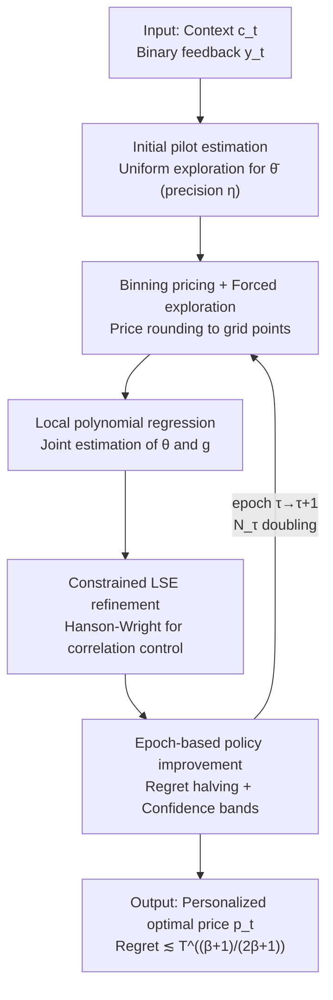

# Semi-Parametric Contextual Pricing with General Smoothness

**Conference**: ICLR 2026  
**OpenReview**: [https://openreview.net/forum?id=HhdNIrn7WJ](https://openreview.net/forum?id=HhdNIrn7WJ)  
**Code**: None  
**Area**: Learning Theory / Online Learning / Dynamic Pricing  
**Keywords**: Contextual Pricing, Semi-parametric Estimation, $\beta$-Hölder Smoothness, Local Polynomial Regression, Regret Upper Bound

## TL;DR
For the dynamic pricing problem with "context + unknown noise distribution," this paper combines "local polynomial regression + constrained least squares + sub-linear forced exploration" to construct a unified algorithm, LPSP, that holds for any smoothness $\beta \ge 1$. It achieves a regret upper bound of $\tilde O(T^{\frac{\beta+1}{2\beta+1}})$, unifying and improving upon previously isolated results of $\tilde O(T^{2/3})$ for $\beta=1$ and $\tilde O(T^{3/5})$ for $\beta=2$.

## Background & Motivation

**Background**: In dynamic pricing, "semi-parametric" modeling is receiving increasing attention. Each user arrives with a context vector $c_t \in \mathbb{R}^d$, and their private valuation is $u_t = c_t^\top \theta_* + \xi_t$, where $\theta_*$ is an unknown linear parameter and $\xi_t$ is i.i.d. noise. After the seller sets a price $p_t$, only a binary transaction signal $y_t = \mathbb{1}\{u_t \ge p_t\}$ is observed, yielding revenue $p_t y_t$. Let the noise tail distribution be $g(z) := \mathbb{P}(\xi_t \ge z) = 1 - F_\Xi(z)$; the expected demand is exactly $D(p) = g(p - c_t^\top \theta_*)$, and the conditional revenue is $R(c_t, p) = p \, g(p - c_t^\top \theta_*)$. This combination of "parametric linear utility + non-parametric unknown noise" is more flexible than fully parametric models and more controllable than fully non-parametric models, serving as a manifestation of single-index models in pricing.

**Limitations of Prior Work**: The regularity (smoothness $\beta$) of $g(\cdot)$ directly determines the difficulty of demand identification and decision-making, but previous results were **fragmented**. Tullii et al. (2024) provided $\tilde O(T^{2/3})$ under first-order smoothness ($\beta=1$, Lipschitz), while Wang & Chen (2025) provided $\tilde O(T^{3/5})$ under second-order smoothness ($\beta=2$). These two sets of algorithms and analyses were not interconnected. The only work attempting to handle general $\beta \in [1, +\infty)$, Fan et al. (2024), gave $\tilde O(T^{\frac{2\beta+1}{4\beta-1}})$, which **neither recovers** Wang & Chen's $T^{3/5}$ **nor avoids degrading into linear regret** when $\beta=1$.

**Key Challenge**: To exploit high-order smoothness (large $\beta$) to reduce non-parametric estimation error, one must use high-degree local polynomials to fit $g$. However, as the degree $\ell = \lfloor \beta \rfloor$ increases, perturbations in parameter estimation $\theta - \theta_0$ are **amplified** through the high-order terms of the polynomial, leaving a term of magnitude $O(\eta)$ (where $\eta$ is pilot estimation precision) in the error decomposition. This accumulates to $O(T\eta) = O(T^{\frac{3\beta+1}{4\beta+2}})$, significantly higher than the target $O(T^{\frac{\beta+1}{2\beta+1}})$. Additionally, to maintain well-conditioned local design matrices, Wang & Chen used **linear-time** forced exploration, which is barely acceptable for $\beta=2$ but explodes to a cost of $T^{\frac{2\beta-1}{2\beta+1}}$ as $\beta$ grows, ruining the regret.

**Goal**: To find a **unified** algorithm and analysis that achieves the optimal regret form for all $\beta \ge 1$, recovers known optima at $\beta=1, 2$, and smoothly transitions to the parametric $\tilde O(\sqrt T)$ as $\beta \to \infty$.

**Key Insight**: The authors observe that the tight bound for non-contextual pricing is exactly $\tilde \Theta(T^{\frac{\beta+1}{2\beta+1}})$ (Wang et al. 2021). If the same exponent can be achieved in the contextual setting, it implies that—under the strong uni-modality assumption—contextual semi-parametric pricing is **no more difficult** than its non-contextual counterpart. This is a strong and clean objective worth designing a unified framework for.

**Core Idea**: Integrate "parametric part $\theta_*$" and "non-parametric part $g$" into a **joint local polynomial regression + constrained least squares** for simultaneous estimation. This is coupled with a **sub-linear length forced exploration** to ensure well-conditioned local design matrices, and the epoch-based policy improvement oracle from Wang & Chen to handle distribution drift. The four components form the LPSP algorithm, which achieves $\tilde O(T^{\frac{\beta+1}{2\beta+1}})$ for general $\beta$.

## Method

### Overall Architecture

LPSP (Local Polynomial regression-based Semi-parametric Pricing) follows a structure of "one-time initialization + multi-epoch cycles." The algorithm first uses a period of uniform exploration to obtain a pilot estimate $\bar \theta$ (precision $\eta = T^{-\frac{\beta+1}{4\beta+2}}$), then enters double-length epochs $N_\tau = 2^\tau N_0$. Within each epoch: ① Prices are offered using the random policy $\pi^{(\tau-1)}$ from the previous epoch, with a subset of prices **rounded** to binning grid points for forced exploration; ② Joint semi-parametric estimation (local polynomial + constrained LSE) is performed on the current epoch's data to construct a global estimate $\hat g_\tau$ and confidence band $\mathrm{CB}_\tau$; ③ $(\hat g_\tau, \mathrm{CB}_\tau)$ are fed into a policy improvement oracle $\mathcal{A}$ to obtain the new policy $\pi^{(\tau)}$. The design ensures that the "stationary distribution condition" of Theorem 9 holds within each epoch to control regret from non-rounded prices.

### Key Designs

**1. Piloted Local Polynomial Regression: Exploiting high-order smoothness with degree $\ell = \lfloor \beta \rfloor$**

To utilize $\beta$-order smoothness, the unknown link function $g$ must be locally fitted with high-order polynomials. The algorithm partitions the value-price gap axis $[-V, V]$ into $M = \lceil 1/h \rceil$ bins $I_j$ with width $h = n^{-\frac{1}{2\beta+1}}$. Samples are assigned to bins based on the pilot $\bar \theta_0$. Within each bin $I_j$, for any candidate $\theta$, an $\ell = \lfloor \beta \rfloor$ degree polynomial fits $\hat g_j(x \mid \theta) = U_j(x, \theta)^\top \Lambda_j(\theta)^{-1} \sum_{i \in T_j} y_i U_j(x_i, \theta)$, where $U_j(x, \theta) = (1, \Delta_j, \dots, \Delta_j^{\ell})^\top$ and $\Lambda_j$ is the local Gram matrix. Proposition 6 provides a deterministic error decomposition **requiring no assumptions on data collection**: fitting error = "pilot bias term $v_j(x, \theta)^\top \delta_j(\theta)$" + "noise variance term" + "bias term $O(h^\beta(1 + \sqrt{n_j} \|U_j\|_{\Lambda_j^{-1}}))$".

**2. Constrained LSE Refinement: Reducing $O(\eta)$ to $\eta^{\frac{2\beta}{\beta+1}}$ via Hanson-Wright**

To eliminate the critical pilot bias, the authors use the local fit $\hat g_j(\cdot \mid \theta)$ to **refine the parameters**:
$$\hat\theta_j \in \arg\min_{\|\theta - \bar\theta_0\| \le \eta} \sum_{i \in T_j} \big(y_i - \hat g_j(x_i \mid \theta)\big)^2.$$
The challenge lies in **complex sample correlation**: all samples in $T_j$ are used for both $\hat \theta_j$ and $\hat g_j$, and the nonlinear square loss breaks martingale structures. The key observation is that this joint LSE can be **reduced to a quadratic form concentration of observation noise**, handled cleanly by the **Hanson-Wright inequality**. This improves the error from $O(\eta)$ to $O(n^{-\frac{\beta}{2\beta+1}})$, which is the core step in pulling the regret back to $\tilde O(T^{\frac{\beta+1}{2\beta+1}})$. 

**3. Sub-linear Forced Exploration: Maintaining well-conditioned matrices via $\sqrt{n}$ price rounding**

For the LSE error bounds to hold, the local normalized design matrix minimum eigenvalue must satisfy $\lambda_{\min} \gtrsim \sqrt{n_j}$. Without "contextual diversity" assumptions, natural contexts cannot guarantee this. The authors use **price rounding**: an exploration schedule $T_{\exp} = \{k^2 : k \ge 1\}$ is maintained. When bin $I_j$ is hit for the $L_j$-th time and falls on $T_{\exp}$, the price is rounded such that the piloted utility falls exactly on one of the $\ell$-grid points of $I_j$. This reduces total exploration cost to $\tilde O(T^{\frac{\beta+1}{2\beta+1}})$, a significant improvement over the linear costs in prior work which failed for $\beta > 2$.

**4. Epoch-based Policy Improvement: Controlling policy-induced distribution drift**

To handle the non-stationarity of adaptive policies, the paper adopts the oracle $\mathcal{A}$ from Wang & Chen (2025). It takes the current policy $\pi$, estimate $\hat g$, and confidence band $\mathrm{CB}$, ensuring the new policy's expected regret is at most $1/4$ of the previous regret plus an error term proportional to $\mathbb{E}[\mathrm{CB}]$. Within the doubling epoch framework, this halves the regret generated by non-rounded prices across epochs.

### Loss & Training

The core optimization is the constrained LSE: $\hat\theta_j \in \arg\min_{\|\theta - \bar\theta_0\| \le \eta} \sum_{i \in T_j} (y_i - \hat g_j(x_i \mid \theta))^2$. The pilot stage uses standard OLS: $\bar\theta \leftarrow \arg\min_\theta t^{-1} \sum_t (p_{\max} y_t - c_t^\top \theta)^2$. Key hyperparameters include pilot precision $\eta$, bin count $M_\tau \approx N_\tau^{1/(2\beta + 1)}$, and covariance regularization $\zeta \asymp T^{\frac{\beta+1}{2\beta+1}}$.

## Key Experimental Results

### Main Results: Unified Regret Upper Bound

Theorem 13: Under Assumptions 1–4, for $\beta \ge 1$,
$$\mathrm{Regret}(T) \lesssim d^4 \log^{5/2}(T) \, T^{\frac{\beta+1}{2\beta+1}} + \mathrm{Poly}(d^\beta, \log T).$$

| Smoothness $\beta$ | Ours $T^{\frac{\beta+1}{2\beta+1}}$ | Prev. SOTA | Relationship |
| :--- | :--- | :--- | :--- |
| $\beta=1$ | $T^{2/3}$ | Tullii 2024: $\tilde\Theta(T^{2/3})$ | Recovers, no strong uni-modality needed |
| $\beta=2$ | $T^{3/5}$ | Wang & Chen 2025: $\tilde\Theta(T^{3/5})$ | Recovers and fixes analysis gaps |
| General $\beta \ge 1$ | $T^{\frac{\beta+1}{2\beta+1}}$ | Fan 2024: $T^{\frac{2\beta+1}{4\beta-1}}$ | Smaller exponent; Fan degrades at $\beta=1$ |
| $\beta \to \infty$ | $\to T^{1/2}$ | Javanmard 2019: $\tilde\Theta(\sqrt T)$ | Smooth transition to parametric rate |

### Key Findings
- **Exploration schedule is decisive**: Switching from linear $n_{\tau,j}$ to a square-root schedule $\sqrt{n_{\tau,j}}$ is the only reason the regret does not degrade for large $\beta$.
- **$\beta=1$ is a free lunch**: Here $\ell=0$ and the pilot bias disappears; strong uni-modality is not even required, and the optimism principle (UCB) alone is optimal.
- **$d^4$ is an analytical artifact**: The $d^4$ term arises from self-normalization arguments and union bounds; empirically, the dependency on $d$ is expected to be much better.

## Highlights & Insights
- **Unified framework**: Using $\beta$ as a continuous dial, the algorithm unifies results from $\beta=1$ to $\beta \to \infty$, turning isolated papers into a continuous curve.
- **Reduction of joint LSE to quadratic form**: Handling the correlation where the same samples determine both parameters and functions is a clever trick applicable to other semi-parametric problems.
- **Context is no harder than non-context**: Proving the same order as the non-contextual tight bound under strong uni-modality cleanly characterizes the zero marginal cost of including context in this problem.

## Limitations & Future Work
- **Strong uni-modality (A) remains**: Only the stationary subroutine depends on this, but the paper has not yet completely removed it.
- **Non-adaptivity to $\beta$**: The algorithm requires $\beta$ as input. Future work might use self-similarity assumptions to achieve adaptivity.
- **Heavy $d$ dependency**: The $d^4$ term and the burn-in period are viewed as analytical artifacts requiring more refined future analysis.

## Related Work & Insights
- **vs. Wang & Chen (2025)**: Both use constrained LSE, but Wang & Chen were restricted to $\beta=2$ with linear exploration and required derivative lower bounds. This work generalizes to any $\ell = \lfloor \beta \rfloor$ and uses sub-linear exploration.
- **vs. Fan et al. (2024)**: Fan achieved $T^{\frac{2\beta+1}{4\beta-1}}$; this work achieves a smaller exponent $\frac{\beta+1}{2\beta+1}$ and avoids degradation at $\beta=1$.

## Rating
- Novelty: ⭐⭐⭐⭐⭐ 
- Experimental Thoroughness: ⭐⭐ (Theoretical work with minimal simulation)
- Writing Quality: ⭐⭐⭐⭐ 
- Value: ⭐⭐⭐⭐ 

<!-- RELATED:START -->

## Related Papers

- [\[ICLR 2026\] Efficient Best-of-Both-Worlds Algorithms for Contextual Combinatorial Semi-Bandits](efficient_best-of-both-worlds_algorithms_for_contextual_combinatorial_semi-bandi.md)
- [\[ICLR 2026\] Nonparametric Contextual Online Bilateral Trade](nonparametric_contextual_online_bilateral_trade.md)
- [\[ICLR 2026\] Variance-Dependent Regret Lower Bounds for Contextual Bandits](variance-dependent_regret_lower_bounds_for_contextual_bandits.md)
- [\[ICLR 2026\] On Smoothness Bounds for Non-Clairvoyant Scheduling with Predictions](on_smoothness_bounds_for_non-clairvoyant_scheduling_with_predictions.md)
- [\[ICLR 2026\] Queue Length Regret Bounds for Contextual Queueing Bandits](queue_length_regret_bounds_for_contextual_queueing_bandits.md)

<!-- RELATED:END -->
