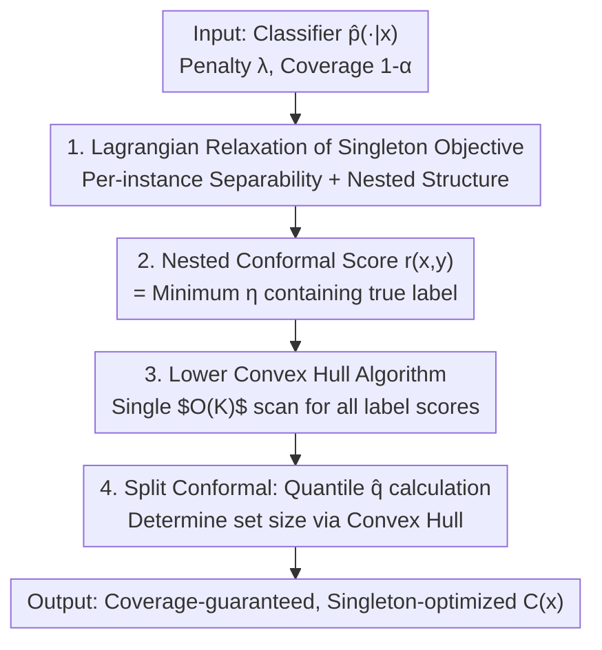

# Singleton-Optimized Conformal Prediction

**Conference**: ICLR 2026  
**OpenReview**: [https://openreview.net/forum?id=mO3nEGibLA](https://openreview.net/forum?id=mO3nEGibLA)  
**Code**: Yes (provided via GitHub repository in the Reproducibility Statement)  
**Area**: Learning Theory / Conformal Prediction  
**Keywords**: Conformal prediction, nonconformity scores, singleton sets, convex hull, Lagrangian relaxation

## TL;DR
To address the pain point where conformal prediction sets are often too large and require manual intervention, this paper proposes SOCOP, a nonconformity score that directly optimizes the **probability of singleton sets** (rather than mean length). By geometrizing the per-sample Lagrangian subproblem as finding the "lower convex hull of $K$ points in 2D," the scores are computed in $O(K)$ time. This approach reduces the non-singleton rate by up to 20% in image classification and LLM multiple-choice tasks with almost no increase in mean set size.

## Background & Motivation
**Background**: Conformal prediction is a distribution-free framework that provides **marginal coverage guarantees** $P\{Y \in C(X)\} \ge 1-\alpha$ based solely on the data exchangeability assumption. Given probabilities $\hat p(\cdot|x)$ from a pre-trained classifier, a nonconformity score quantifies "how much a sample-label pair deviates from the training distribution." By taking a quantile on a calibration set, one constructs a prediction set $C(x) \subseteq \mathcal{Y}$ with coverage guarantees for each test sample.

**Limitations of Prior Work**: Coverage is only a baseline; the **utility of the set depends on its efficiency**. Legitimate sets containing all labels are trivial and uninformative. The mainstream efficiency metric is **mean size** $\mathbb{E}_X[|C(X)|]$. Methods from LAS (Least Ambiguous Sets), APS, and RAPS to direct length optimization focus on minimizing this mean size.

**Key Challenge**: Mean size is not the ideal efficiency metric. Downstream applications typically require an **unambiguous decision**, i.e., a **singleton set** containing only one label. A set with size $\ge 2$ often triggers additional manual review or workflow changes, incurring "excess cost." The mean size metric fails to distinguish between the critical step of "size 1 vs. 2" and "size 50 vs. 51." While Vovk et al. (2005) conceptualized minimizing the "non-singleton probability" $P_X[|C(X)|>1]$ as the M-criterion, a practical conformal prediction method optimizing this objective has been missing.

**Goal**: To fill this gap by constructing a conformal prediction method that **jointly optimizes the singleton objective and mean length** under coverage constraints, while maintaining computational efficiency even for large $K$.

**Key Insight**: Instead of directly solving a constrained optimization problem over the discrete and discontinuous space of all prediction sets, the authors use the **Lagrangian relaxation** of the problem as a springboard to derive nonconformity scores. By exploiting per-instance separability, they found that optimal sets follow a "top-$j$ labels" structure which grows nestedly with the penalty parameter.

**Core Idea**: Using a linear combination of "singleton objective + length" as motivation, the authors derive a **nonconformity score based on nested conformal prediction** and solve for it geometrically as a "lower convex hull" problem, achieving $O(K)$ complexity.

## Method

### Overall Architecture
SOCOP takes a pre-trained probabilistic classifier $\hat p(\cdot|x)$, a penalty parameter $\lambda \ge 0$, and a target coverage $1-\alpha$ as input. It outputs prediction sets that satisfy marginal coverage and are **maximized for singletons**. The process involves four steps: ① Formulating the optimization of "non-singleton probability + mean length" under coverage constraints, applying Lagrangian relaxation, and proving **per-instance separability**; ② Solving for the optimal set per sample, showing it consists of "top-$j$ labels" that **grow nestedly** with the dual variable $\eta$, which defines the nonconformity score $r(x,y)$; ③ Geometrizing the re-calculation of optimal set sizes for every $\eta$ as a **lower convex hull of $K+1$ points**, allowing all label scores to be computed in a **single $O(K)$ scan**; ④ Applying split conformal prediction to find the quantile $\hat q$ and identifying the optimal set size along the convex hull.

### Key Designs

**1. Lagrangian Relaxation and Separability: Decoupling Discrete Optimization into Scalar Problems**

Minimizing non-singleton probability directly is intractable because it is defined over the discrete space $\mathcal{M}$ of all measurable prediction sets. The authors define the primal problem:

$$\min_{C\in\mathcal{M}}\; F_\lambda(C) := P_X[|C(X)|>1] + \lambda\,\mathbb{E}_X[|C(X)|]\quad \text{s.t.}\;\; P(Y\in C(X)) \ge 1-\alpha,$$

where $\lambda \ge 0$ balances "singleton priority" vs "length priority." Introducing the dual variable $\eta \ge 0$ leads to the Lagrangian $L_\lambda(C,\eta)=\int_\mathcal{X}\ell_{p(\cdot|x),\lambda}(C(x);\eta)\,P_X(dx)+\eta(1-\alpha)$, where the **per-instance loss** is:

$$\ell_{p(\cdot|x),\lambda}(C(x);\eta)=\mathbb{I}(|C(x)|>1)+\lambda|C(x)|-\eta\!\!\sum_{y\in C(x)}\! p(y|x).$$

The key observation is that minimizing $L_\lambda$ is **separable across $x$**. This reduces a complex functional optimization into a simpler subproblem: "finding an optimal subset $S_{\eta, \gamma}$ for a single probability vector $\gamma$."

**2. Nested Structure and Nonconformity Scores: The "Minimum $\eta$ to Include True Label"**

For a probability vector (sorted as $\gamma_{y_1}\ge\gamma_{y_2}\ge\cdots$), the optimal set $S_{\eta,\gamma}$ has two properties: (Lemma 2.1) it must be a **top-$j$ labels** set $F_j$; (Lemma 2.2) it **grows nestedly** with the dual variable, i.e., $\eta_1<\eta_2 \Rightarrow S_{\eta_1,\gamma}\subseteq S_{\eta_2,\gamma}$. This nested property satisfies the requirement for nested conformal prediction. The nonconformity score is thus defined as the **minimum cost required for the true label to enter the set**:

$$r(x,y) := \inf\{\tau \ge 0 : y \in S_{\tau,\hat p(\cdot|x),\lambda}\}.$$

Intuitively, $\eta$ is the "price" per unit of coverage relative to the size penalty. Two extremes are provably recovered: $\lambda\to\infty$ yields LAS (score $1/\hat p(y|x)$), and $\lambda=0$ yields a pure singleton solution.

**3. Lower Convex Hull Algorithm: $O(K)$ Computation for All Labels**

Calculating the score for each $\tau$ would be $O(K^2)$ naively. The core trick involves mapping each set size $k$ to a point $P_k = (\Gamma_k, g_k)$ in 2D space, where $\Gamma_k = \sum_{i=1}^k \gamma_{y_i}$ is the cumulative probability and $g_k = \mathbb{I}(k>1) + \lambda k$ is the cost. Theorem 2.5 proves that the **optimal set sizes correspond to the indices of the lower convex hull vertices**, and the **transition points of optimal size correspond to the edge slopes** $\eta_i = (g_{v_i} - g_{v_{i-1}}) / (\Gamma_{v_i} - \Gamma_{v_{i-1}})$. Consequently, $r(x,y)$ is found by scanning the slopes of the lower convex hull in $O(K)$ time.

### Loss & Training
SOCOP is a **model-agnostic wrapper** and does not require model training. The hyperparameter $\lambda$ is selected on an independent tuning set by identifying the "knee point" of the (mean size, $P(\text{size}>1)$) trade-off curve using the Kneedle algorithm. The framework can be generalized to control $P_X[|C(X)|>k_0]$ by modifying $g_k = \mathbb{I}(k>k_0) + \lambda k$.

## Key Experimental Results

### Main Results
On ImageNet-Val (1−α=0.95), all methods satisfy the coverage guarantee. SOCOP reduces the non-singleton rate from 0.466 (LAS) to **0.370** (approx. 20% reduction) on ResNet152-v2, while the mean size only increases from 2.274 to 2.477.

| Model / Method | Coverage | Mean Size | P(size>1) |
|------|------|------|------|
| ResNet152-v2 · RAPS | 0.950 | 3.158 | 0.603 |
| ResNet152-v2 · Least Ambiguous Sets | 0.950 | **2.274** | 0.466 |
| ResNet152-v2 · SOCOP (ours) | 0.950 | 2.477 | **0.370** |
| ViT-h-14 · Least Ambiguous Sets | 0.950 | **1.291** | 0.224 |
| ViT-h-14 · SOCOP (ours) | 0.950 | 1.356 | **0.175** |

On TissueMNIST, the non-singleton rate drops from 0.788 to **0.638**. On MMLU (LLM multiple-choice), it drops from 0.675 to **0.587**.

### Ablation Study
Adaptivity experiments (measured by Size-Stratified Coverage Violation, SSCV) show SOCOP achieves low conditional coverage violation:

| Method (ResNet152-v2) | Mean Size | P(size>1) | SSCV |
|------|------|------|------|
| Least Ambiguous Sets | **2.279** | 0.467 | 0.197 |
| RAPS | 8.568 | 0.448 | 0.031 |
| SOCOP (ours) | 3.372 | **0.304** | 0.039 |

While RAPS has slightly lower SSCV, its mean size is significantly larger (8.6 vs 3.4).

### Key Findings
- **$\lambda$ smoothly interpolates two extremes**: As $\lambda$ moves from $0$ to $\infty$, the method transitions from pure singleton solutions to LAS.
- **Minimal shift in size distribution**: SOCOP compresses more mass into singletons at the cost of a few slightly larger sets.
- **Better gains on harder data**: Gains are more pronounced on ImageNet-V2 (distribution shift) compared to ImageNet-Val.

## Highlights & Insights
- **Geometric Translation**: Mapping "discrete set optimization" to a "2D lower convex hull" is an elegant step that makes the computation efficient ($O(K)$) and the dual variables interpretable as "prices."
- **Provable Theoretical Continuity**: The fact that SOCOP recovers LAS and pure singleton solutions at its limits proves it is a theoretically grounded path rather than an ad-hoc heuristic.
- **Metric Redefinition**: Shifting focus from $\mathbb{E}|C|$ to $P(|C| > 1)$ reflects the actual downstream cost for human-in-the-loop systems.

## Limitations & Future Work
- **Marginal vs. Conditional Coverage**: The scores are derived from a marginal objective; extending them to conditional-aware objectives (e.g., Gibbs et al. 2025) is a future direction.
- **Tuning Set Dependency**: Requires an independent subset to select $\lambda$, which reduces data efficiency.
- **Split Conformal Bound**: Currently implemented with split conformal; extensions to Mondrian or label-conditional variants are needed.
- **Reliance on $\hat p$ Quality**: Efficient singleton sets depend on well-calibrated classifier probabilities.

## Related Work & Insights
- **vs Least Ambiguous Sets (2019)**: LAS optimizes expected length; SOCOP reduces non-singleton rate significantly with minimal size cost.
- **vs RAPS (2021)**: SOCOP provides much smaller average sizes while maintaining competitive adaptivity (SSCV).
- **vs M-criterion (2005)**: This work finally provides a practical, efficient algorithm for the concept introduced by Vovk in 2005.

## Rating
- Novelty: ⭐⭐⭐⭐⭐ Elegant translation of singleton optimization to 2D geometry.
- Experimental Thoroughness: ⭐⭐⭐⭐ Covers various domains and adaptivity metrics.
- Writing Quality: ⭐⭐⭐⭐⭐ Excellent derivation and clear logic.
- Value: ⭐⭐⭐⭐⭐ Highly practical for real-world decision-making workflows.

<!-- RELATED:START -->

## Related Papers

- [\[ICLR 2026\] Conformal Prediction for Long-Tailed Classification](conformal_prediction_for_long-tailed_classification.md)
- [\[ICLR 2026\] Distribution-informed Online Conformal Prediction](distribution-informed_online_conformal_prediction.md)
- [\[ICLR 2026\] Online Conformal Prediction with Adversarial Semi-bandit Feedback via Regret Minimization](online_conformal_prediction_with_adversarial_semi-bandit_feedback_via_regret_min.md)
- [\[ICLR 2026\] Adaptive Conformal Prediction via Mixture-of-Experts Gating Similarity](adaptive_conformal_prediction_via_mixture-of-experts_gating_similarity.md)
- [\[ICML 2026\] Enhancing Conformal Prediction via Class Similarity](../../ICML2026/learning_theory/enhancing_conformal_prediction_via_class_similarity.md)

<!-- RELATED:END -->
