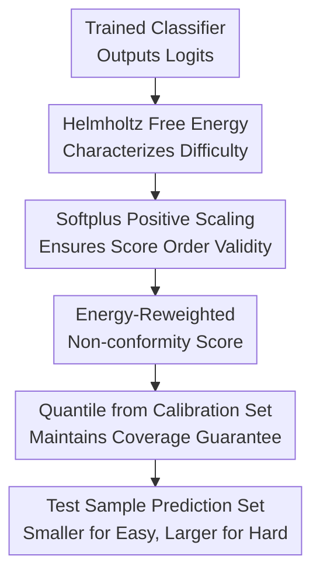

# Softmax is not Enough (for Adaptive Conformal Classification)

**Conference**: ICLR2026  
**OpenReview**: [https://openreview.net/forum?id=zCwTMRtASZ](https://openreview.net/forum?id=zCwTMRtASZ)  
**Code**: https://github.com/navidattar/Energy-Based-Conformal-Classification  
**Area**: Learning Theory / Uncertainty Quantization / Adaptive Conformal Classification  
**Keywords**: Adaptive Conformal Classification, Non-conformity Score, Helmholtz Free Energy, Logit Uncertainty, OOD Reliability  

## TL;DR
This paper points out that adaptive conformal classification relying solely on softmax probabilities inherits the overconfidence issues of deep classifiers. It proposes using Helmholtz free energy in the logit space for sample-level reweighting of non-conformity scores, enhancing the distinctness of prediction sets for easy, hard, and OOD inputs while maintaining conformal coverage guarantees.

## Background & Motivation
**Background**: Conformal Prediction (CP) in classification tasks often employs the split conformal framework: training a classifier on a training set, calculating non-conformity scores $S(x,y)$ on a calibration set, determining the empirical quantile $\hat q_{1-\alpha}$, and finally outputting a label set satisfying $S(x,y) \le \hat q_{1-\alpha}$. As long as calibration and test samples are exchangeable, the prediction set satisfies $P(Y \in C(X)) \ge 1-\alpha$.

**Limitations of Prior Work**: Truly useful prediction sets in classification must be both efficient and adaptive: simple samples should yield small sets, while difficult or unfamiliar samples should yield larger sets to express uncertainty. Adaptive scores such as APS, RAPS, and SAPS attempt to achieve this by utilizing softmax probability rankings, but their inputs remain primarily derived from softmax outputs.

**Key Challenge**: Softmax probabilities appear to represent confidence but do not necessarily provide a reliable characterization of the model's familiarity with the input. Modern neural networks may assign high softmax confidence to misclassified samples, long-tail minority classes, or even OOD inputs. While temperature scaling improves in-distribution calibration, it cannot truly compensate for epistemic uncertainty. Consequently, although CP coverage guarantees still hold, the shape of the prediction sets may be dishonest: sets for simple samples are disproportionately large, while sets for difficult or OOD samples may be too small.

**Goal**: The authors aim to solve a specific problem: whether signals that better reflect sample difficulty than softmax can be extracted from existing deep classifiers and integrated into the non-conformity scores of conformal classification without retraining models or introducing ensembles/extra uncertainty models.

**Key Insight**: The observation is that softmax compresses the overall magnitude of logits into normalized probabilities, smoothing out information regarding whether an input is "similar to the training distribution." The pre-softmax logit space retains the model's judgment of the input's overall energy. Helmholtz free energy can be calculated directly from logits and corresponds to the negative log-likelihood of the model's implicit input density from an energy-based model perspective.

**Core Idea**: Use Helmholtz free energy as a proxy for sample difficulty and epistemic uncertainty to perform positive sample-level scaling of existing adaptive non-conformity scores. This ensures that incorrect labels for easy samples exceed the threshold faster, while labels for difficult or OOD samples are more likely to remain in the set.

## Method

### Overall Architecture
This paper does not reinvent conformal prediction or train a new uncertainty model; instead, it replaces the component of how scores perceive sample difficulty within the existing conformal classification pipeline. Given a pre-trained classifier, the authors calculate the Helmholtz free energy from logits, transform it into a positive scaling factor via softplus, and multiply it by base non-conformity scores like APS, RAPS, or SAPS. Calibration and testing proceed according to standard split conformal prediction procedures.

Formally, base conformal classification computes $S(x,y)$ for each candidate label $y$ and uses a calibrated threshold to determine inclusion in the set. This paper modifies the score to:

$$
S_{\text{Energy-Based}}(x,y) = S(x,y) \cdot \frac{1}{\beta}\log(1+e^{-\beta F(x)}),
$$

where $F(x)$ is the Helmholtz free energy derived from logits and $\beta$ controls the sharpness of the softplus. This scaling factor depends only on the sample $x$ and not the candidate label $y$, preserving the intuition of label rankings within a sample. However, it alters the distribution of scores across different samples in the calibration set, ensuring the final threshold and the effective threshold for each test sample incorporate difficulty information.

### Key Designs
**1. Reverting from Softmax Probabilities to Logit Energy: Retaining Familiarity Signals**

Standard classifiers output logits $f(x)=(f_1(x),\ldots,f_K(x))$, which softmax normalizes into $\hat\pi(y|x)$. This transformation is suitable for class ranking but poor for distinguishing whether the model is truly familiar with the input. The paper interprets the classifier as an energy-based model, defining joint energy $E(x,y)=-f_y(x)$, allowing the Gibbs-Boltzmann distribution to represent softmax conditional probabilities.

The critical pivot is the Helmholtz free energy obtained after marginalizing labels:

$$
F(x;f)=-\tau \log \sum_{k=1}^{K}\exp\left(\frac{f_k(x)}{\tau}\right).
$$

Negative free energy $-F(x)$ is essentially the log-sum-exp of logits, approximating the overall magnitude of the maximum logit. Simple, in-distribution samples typically have higher negative free energy; difficult or OOD samples have lower values. Using CIFAR-100, the authors show that two samples with softmax confidences near $1.0$ and $0.998$ can have true label ranks of $1$ and $27$, respectively; softmax shows little difference, while negative energy clearly separates them.

**2. Positive Scaling via Softplus: Integrating Difficulty into Adaptive Scores without Breaking Validity**

The coverage guarantee of CP depends on the exchangeability of calibration and test scores, not a specific score form. As long as the new score is a deterministic function of samples and labels, and exchangeability holds, the coverage guarantee is maintained. Thus, the authors keep the split conformal wrapper but multiply the base score $S(x,y)$ by a positive sample-level factor $G(x)$.

The positivity requirement is crucial. Using $-F(x)$ directly could result in negative values for extremely uncertain samples, reversing the ranking semantics of the non-conformity score. The authors use $G(x)=\frac{1}{\beta}\log(1+e^{-\beta F(x)})$ to solve this: when negative free energy is positive and large, softplus approximates its magnitude; when negative, the factor approaches zero smoothly. This preserves energy signals without collapsing the conformal semantics where "lower scores mean more conformity."

**3. Interpreting Reweighting as Sample-Adaptive Thresholds: Tightening for Easy, Relaxing for Difficult**

From the perspective of prediction sets, using $S_G(x,y)=G(x)S(x,y)$ and the new quantile $\hat q^{(G)}_{1-\alpha}$ is equivalent to using the original score $S(x,y)$ with a sample-specific effective threshold:

$$
\theta(x)=\frac{\hat q^{(G)}_{1-\alpha}}{G(x)}.
$$

For simple samples, $G(x)$ is large and $\theta(x)$ is small, causing incorrect labels to be excluded more easily as $S(x,y)>\theta(x)$, thus shrinking the set. For difficult or OOD samples, $G(x)$ is small and $\theta(x)$ is large, retaining more candidate labels to express uncertainty through set expansion.

**4. Balancing Coverage across Scenarios: Energy Signals as Multi-role Reliability Proxies**

On balanced data, energy helps identify "easiness" where softmax is saturated but logit magnitudes differ, significantly shrinking average sets under high confidence requirements. On long-tailed data, models are more familiar with majority classes; the energy-based score becomes more conservative for minority classes, counteracting the overconfidence seen in standard softmax scores.

In OOD scenarios where exchangeability is violated, the authors propose a code of conduct for reliable conformal classifiers: output empty or large sets rather than small, confident-looking ones. Energy-based reweighting maps low negative free energy to smaller scaling factors, allowing more labels into the set to warn the user of unfamiliarity via set size.

## Key Experimental Results

### Main Results
The authors evaluate APS, RAPS, SAPS and their energy-based variants on CIFAR-100, ImageNet, and Places365 with target error rates $\alpha\in\{0.01, 0.025, 0.05, 0.1\}$. Primary metrics include empirical coverage and average prediction set size. Below are results from balanced data:

| Dataset / Model | Method | $\alpha$ | Coverage | Set Size w/o Energy | Set Size w/ Energy | Gain |
|--------|------|------|------|------|------|------|
| CIFAR-100 / ResNet-56 | APS | 0.025 | 0.975 vs 0.974 | 13.29 | 11.48 | Smaller, coverage maintained |
| CIFAR-100 / ResNet-56 | RAPS | 0.05 | 0.95 vs 0.95 | 8.17 | 6.18 | Significantly smaller |
| CIFAR-100 / ResNet-56 | SAPS | 0.01 | 0.99 vs 0.99 | 29.80 | 22.90 | High gain at strict $\alpha$ |
| ImageNet / ResNet-50 | APS | 0.01 | 0.99 vs 0.99 | 39.08 | 32.93 | Higher efficiency |
| Places365 / ResNet-50 | RAPS | 0.025 | 0.976 vs 0.975 | 26.34 | 22.35 | Smaller, similar coverage |
| Places365 / ResNet-50 | SAPS | 0.05 | 0.95 vs 0.95 | 14.11 | 12.51 | Consistent improvement |

On CIFAR-100-LT (long-tailed), energy-based scores significantly reduce set sizes. For $\lambda=0.005$, APS set size drops from $17.22$ to $13.30$ at $\alpha=0.05$.

### Ablation Study
The ablation compares energy against entropy for reweighting. Results on ImageNet show that while energy reduces or maintains set size, entropy often increases it.

| Configuration | Dataset / Model | $\alpha$ | Set Size | Description |
|------|------|------|------|------|
| APS baseline | ImageNet / ResNet-50 | 0.05 | 4.007 | Standard softmax adaptive score |
| APS w/ Energy | ImageNet / ResNet-50 | 0.05 | 3.842 | Smaller, same coverage scale |
| APS w/ Entropy | ImageNet / ResNet-50 | 0.05 | 4.990 | Entropy reweighting increases size |
| RAPS baseline | ImageNet / ResNet-50 | 0.05 | 4.222 | Standard RAPS |
| RAPS w/ Energy | ImageNet / ResNet-50 | 0.05 | 3.889 | Energy brings efficiency gain |

OOD experiments demonstrate that energy-based APS expands sets on unfamiliar inputs (CIFAR-100 trained vs. Places365 OOD), expanding from $6.18$ to $86.76$ at $\alpha=0.1$.

### Key Findings
- Energy-based reweighting gains are most prominent under high-confidence requirements where softmax saturates.
- Negative free energy serves as a stable difficulty signal across ranks.
- In OOD scenarios, energy-based scores prioritize avoiding "false confidence" over "small sets."
- Efficiency gains do not come at the cost of deteriorating conditional coverage (CovGap, SSCV).
- Statistical significance tests ($p < 0.05$) confirm set size improvements are robust across datasets.

## Highlights & Insights
- The method avoids "re-calibrating" softmax by bypassing it for raw logit energy. Softmax only sees relative probabilities, whereas free energy preserves logit magnitude to distinguish familiarity.
- Lightweight design: No ensembles, MC dropout, or auxiliary models are required. Access to logits is the only requirement, making it a universal plugin for APS/RAPS/SAPS.
- Dual interpretation: The method is grounded in conformal exchangeability theory while offering an intuitive view as a sample-dependent threshold $\theta(x)$.
- Reliable OOD behavior: By expanding sets for unfamiliar inputs, it effectively warns users, which is more critical in deployment than mere set efficiency.

## Limitations & Future Work
- Dependence on logit access: Cannot be used for black-box APIs providing only probabilities.
- Model-inherent limits: If the base model assigns high logits to OOD regions, free energy will still underestimate uncertainty.
- Set size vs. Abstention: APS energy-based sets can expand to nearly all classes for OOD; future work could combine this with explicit rejection (abstention) mechanisms.
- Hyperparameter tuning: $T$ and $\tau$ require tuning. While $\beta$ is robust, the energy temperature $\tau$ still impacts the strength of the reweighting.

## Related Work & Insights
- **vs APS / RAPS / SAPS**: These methods utilize softmax-based cumulative probabilities or ranks. This paper provides a general enhancement to this family of scores via energy reweighting.
- **vs Temperature Scaling**: Temperature scaling only improves in-distribution calibration, whereas energy signals from logit magnitude capture epistemic uncertainty and input density.
- **vs Normalized CP**: Traditional normalized CP uses difficulty estimators to scale residuals. This paper ports that concept to deep classification using Helmholtz free energy as a zero-cost difficulty estimator.
- **vs Entropy Reweighting**: Entropy is a function of the softmax distribution and saturates in high-confidence regions. Experiments show entropy reweighting is less stable and often less efficient than energy.

## Rating
- **Novelty**: ⭐⭐⭐⭐☆ Integrating free energy into adaptive conformal scores is a concise solution to the softmax saturation problem.
- **Experimental Thoroughness**: ⭐⭐⭐⭐☆ Strong validation across balanced, long-tail, and OOD scenarios with rigorous statistical testing.
- **Writing Quality**: ⭐⭐⭐⭐☆ Clear transition from theory to mechanism; individual OOD charts are slightly dense but informative.
- **Value**: ⭐⭐⭐⭐⭐ High practical value as a training-free, lightweight enhancement for improved prediction set adaptiveness in existing systems.

<!-- RELATED:START -->

## Related Papers

- [\[ICLR 2026\] Conformal Prediction for Long-Tailed Classification](conformal_prediction_for_long-tailed_classification.md)
- [\[ICLR 2026\] Adaptive Conformal Prediction via Mixture-of-Experts Gating Similarity](adaptive_conformal_prediction_via_mixture-of-experts_gating_similarity.md)
- [\[ICLR 2026\] The Softmax Bottleneck Does Not Limit the Probabilities of the Most Likely Tokens](the_softmax_bottleneck_does_not_limit_the_probabilities_of_the_most_likely_token.md)
- [\[ICLR 2026\] Softmax Transformers are Turing-Complete](softmax_transformers_are_turing-complete.md)
- [\[ICLR 2026\] Distribution-informed Online Conformal Prediction](distribution-informed_online_conformal_prediction.md)

<!-- RELATED:END -->
