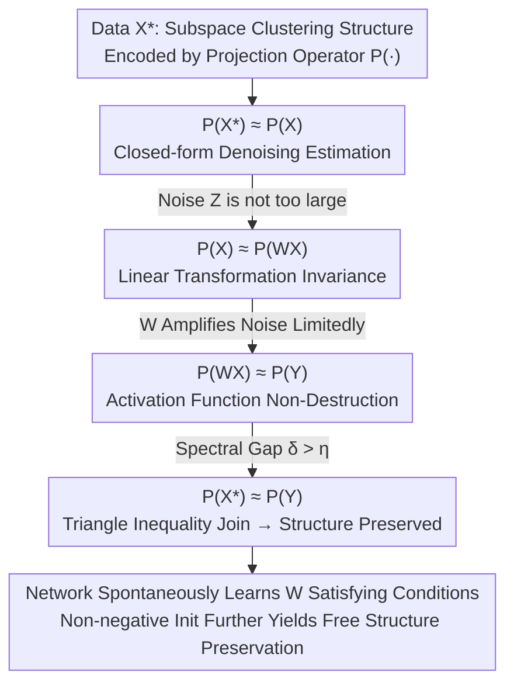

# Some Neural Networks Inherently Preserve Subspace Clustering Structure

**Conference**: ICLR 2026  
**OpenReview**: [https://openreview.net/forum?id=Pjcz6ik78E](https://openreview.net/forum?id=Pjcz6ik78E)  
**Area**: Learning Theory  
**Keywords**: Subspace clustering, ReLU, Perturbation theory, Davis-Kahan, Representation learning

## TL;DR
This paper uses perturbation theory to prove that when data possesses a "union-of-subspaces (UoS)" structure, single-layer (and even multi-layer) networks with activations such as ReLU **preserve** this clustering structure exactly, provided a spectral gap condition is met. Furthermore, networks spontaneously learn weights $W$ satisfying this condition during standard training **without any explicit regularization**—implying that such networks are effectively "performing clustering via a closed-form solution."

## Background & Motivation
**Background**: It is a long-standing consensus that neural networks excel at clustering and representation learning. Observations (e.g., Papyan's neural collapse, Arora et al.) have consistently shown that intermediate embeddings preserve or even enhance the clustering structure of data. However, this has largely remained at the level of "conjecture + empirical observation" without rigorous characterization.

**Limitations of Prior Work**: A major obstacle in deep learning theory is the difficulty of analyzing high-dimensional nonlinear transformations. While activation functions (sigmoid/tanh/ReLU) provide the nonlinearity required for hierarchical feature learning, they make the loss surface and optimization dynamics opaque. Interpretability methods (feature attribution, mechanistic interpretability) often fail to capture the **structural** properties of the network—such as "why the clustering structure is not disrupted."

**Key Challenge**: Activation functions are simultaneously the source of expressivity and a hurdle for theoretical analysis. Intuitively, ReLU zeros out negative values of $WX$, which could potentially destroy the original clean subspace structure (as random $W$ does in Figure 1). Yet, in practice, networks do not destroy it. The conditions under which "preservation" occurs, and why it happens, have remained unclear.

**Goal**: (i) Provide **sufficient conditions** for a layer to pass the input subspace clustering structure through to the output; (ii) provide an **upper bound** quantifying the "degree of preservation"; (iii) explain why networks satisfy these conditions even without explicit constraints.

**Key Insight**: Instead of analyzing "clustering accuracy," the authors encode the clustering structure into a **projection operator matrix** $P(\cdot)$. Thus, whether the "structure is preserved" becomes equivalent to whether the input and output projection matrices are sufficiently close. This transforms the problem into a **matrix perturbation** problem solvable via the Davis-Kahan $\sin(\Theta)$ theorem.

**Core Idea**: The "structure preservation of ReLU layers" is decomposed into a three-stage perturbation chain: Data $\to$ Denoising, Linear Transformation Invariance, and Activation Function Non-Destruction. The deviation of the projection matrix is controlled at each stage using spectral gap bounds and combined via the triangle inequality. Numerical experiments demonstrate that gradient descent **spontaneously** learns $W$ into regions that satisfy these conditions.

## Method

### Overall Architecture
The "method" is a theoretical characterization. The core object is the data matrix $X^\star\in\mathbb{R}^{m\times n}$, where each column falls into one of $K$ low-dimensional subspaces (UoS model, with Euclidean clustering as a 1D special case). The observed data is a noisy version $X=X^\star+Z$. The output of a single-layer network is $Y=\sigma(WX)$, where $\sigma(\cdot)=\max(0,\cdot)$ is ReLU.

The key transformation: The clustering structure is **encoded as a matrix** using an operator $P(\cdot)$ that projects onto the principal row space (dimension $r=\sum_k r_k$). An entry $(i,j)$ of $P(X^\star)$ is non-zero if and only if columns $i$ and $j$ belong to the same cluster. Thus, "structure preservation" is precisely translated into the proximity of $P(X^\star)$ and $P(Y)$. The main theorem (Theorem 3.1) proves that as long as a **spectral gap $\delta$** exceeds a threshold $\eta$ determined by noise, $\|P(X^\star)-P(Y)\|_\infty<\epsilon/2$ holds, and the clustering structure is preserved.

The proof follows a chain of projection matrices, where each segment's deviation is controlled by a lemma + Davis-Kahan theorem, finally combined using the triangle inequality:

### Key Designs

**1. Encoding Clustering Structure as a Matrix via Projection Operators: Turning "Structure Preservation" into "Matrix Proximity"**

Directly recovering the subspace basis $V$ is difficult because a single subspace has infinitely many bases, most of which lack block-sparse structures. The authors avoid "learning the basis" and instead learn the **operator $P(\cdot)$ projecting onto the row space**. Let $\bar V$ be an orthogonal basis block matrix spanning the same space as $V$. Under the condition $r<n$ (information-theoretic identifiability, sum of subspace dimensions less than sample size), the projection operator is unique: $P(X^\star)=\bar V^{\mathsf T}\bar V$. The non-zero support pattern of $P(X^\star)$ corresponds one-to-one with cluster partitions. Therefore, "learning $P(X^\star)$" is equivalent to "learning the clusters." More elegantly, the uniqueness of the projection operator allows $P(X^\star)$ to be directly estimated from noisy $P(X)$. This step cleanly transforms a structural problem of a nonlinear network into a **matrix perturbation** problem.

**2. Three-Stage Perturbation Chain + Davis-Kahan: Decomposing ReLU Preservation into Segmentally Controllable Deviations**

The main theorem is split into three lemmas corresponding to the three stages in the diagram:
- **Lemma 4.1 (Denoising)**: If the spectral gap $\delta_1>\sqrt{27r}\,\|Z\|/\epsilon$, then $\|P(X)-P(X^\star)\|_\infty<\epsilon/8$. The core of the proof writes the Frobenius norm of the projection difference as $2\|\sin^2(\Theta)\|_F^2$, bounded by $\sqrt 2\|Z\|_F/\delta_1$ using the Davis-Kahan $\sin(\Theta)$ theorem. Intuitively, this requires that the noise is not too large relative to the signal for clusters to be separable.
- **Lemma 4.2 (Linear Invariance)**: As long as $\mathrm{rank}(W)\ge r$, then $P(X^\star)=P(WX^\star)$, meaning any linear transformation does not change the row space projection. Adding noise terms yields $\|P(X)-P(WX)\|_\infty<\epsilon/4$. This shows that "linear transformation" inherently preserves structure.
- **Lemma 4.3 (Activation Non-Destruction)**: If $\delta_3>\sqrt{27r}\,\|Y-WX\|/\epsilon$, then $\|P(Y)-P(WX)\|_\infty\le\epsilon/8$. Here, $\|Y-WX\|$ measures how many negative values of $WX$ were zeroed out by ReLU. If $WX$ is mostly non-negative, $\sigma(WX)=WX$, and the deviation is small.

Combining the three stages via the triangle inequality yields Theorem 3.1. The unified condition for the chain is the spectral gap $\delta>\eta:=\frac{\sqrt{27r}}{\epsilon}\max(\|Z\|,\|WZ\|,\|Y-WX\|)$, where $\delta$ can be interpreted as the similarity between the principal subspaces of two adjacent matrices. ⚠️ Note: Coefficients like $\epsilon/8$, $\epsilon/4$, $\epsilon/2$ should follow the original text.

**3. Spontaneous Learning of Structure-Preserving $W$ Without Regularization: The Most Counter-Intuitive Discovery**

There are four "actors" in the theorem: data and noise (uncontrollable), activation function $\sigma$ (optional), and weight $W$ (learned). The authors emphasize that for any $\sigma$, it is **easy** to construct a $W$ that violates the conditions—for example, by making $WX$ have many negative values zeroed by ReLU, destroying the structure (random $W$ in Fig 1). A natural thought is to add regularization (penalizing $W$ or negative terms of $WX$) to force the network to satisfy the conditions. However, the startling conclusion of this paper is: **such regularization is not needed**. Training a single-hidden-layer ReLU autoencoder (80 neurons, Frobenius reconstruction loss) on synthetic UoS data shows that as training epochs progress, the frequency of $\delta>\eta$ increases and the projection distance decreases—the network learns $W$ into the region satisfying Theorem 3.1 on its own without any explicit mechanism. This conclusion extends to multi-layer networks: using a union bound for $L$ layers ($\epsilon$ divided by $L$), a 5-layer ReLU network similarly evolves from "random weights destroying structure" to "layer-wise structure preservation."

**4. Non-Negative Initialization: Turning Theory into a Free Engineering Trick**

From the conditions in Lemma 4.3, for ReLU, as long as $WX>0$, then $\sigma(WX)=WX$, and the condition is automatically satisfied. $WX>0$ holds trivially if $X>0$ and $W>0$. In reality, many datasets are inherently non-negative—pixel intensities, network hop counts, biomedical features (age, heart rate, blood pressure, etc.), single-cell sequencing, multi-omics, etc. Thus, by simply **initializing $W$ to be non-negative**, the clustering structure is automatically preserved from the start of training. Experiments (Fig 2-Right, noise at 0.5, $W$ initialized in unit interval) show that this initialization **perfectly preserves** the clustering structure and represents a local optimum of the learning process (zero gradient, positive Hessian determinant), leading to faster convergence and better accuracy. This translates an abstract theorem into actionable advice for initialization, feature encoding, and regularization.

### A Complete Example
Walking through the proof chain with synthetic data: take $K=4$ subspaces of dimension 4 ($r_k=4$, so $r=16$), $m=400$, $n_k=100$ per cluster, total $n=400>r$ satisfying identifiability. Start with clean $X^\star$ and add Gaussian noise with variance $s^2$ to get $X$. Early in training, $W$ is random, $\|Y-WX\|$ is large (many negatives zeroed), $\delta<\eta$, and $P(Y)$ is far from $P(X^\star)$—structure is destroyed. As training progresses, the network learns $W$ such that $WX$ tends to be non-negative, $Y\approx WX$, the three deviations shrink simultaneously, the frequency of $\delta>\eta$ rises, and $P(Y)$ approaches $P(X^\star)$, recovering the clustering structure. Scanning across noise $s^2$ shows this bound "degrades gracefully with noise."

## Key Experimental Results

The goal of the experiments is not to push clustering accuracy (all models are chosen to be near-perfect) but to use **projection distance** to reveal whether the network "is using a closed-form solution for clustering."

### Main Results

| Experimental Setup | Phenomenon | Explanation |
|----------|------|------|
| Single-layer ReLU Autoencoder (Synthetic UoS) | Frequency of $\delta>\eta$ degrades gracefully with noise (Fig 2-Left, 100 trials/point) | Condition probability is quantifiable; bound is robust |
| Single-layer ReLU, $s^2=0.1$ (Fig 2-Center) | Projection distance decreases with epochs | Network spontaneously learns structure-preserving $W$ |
| Non-negative initialization $W>0$, $s^2=0.5$ (Fig 2-Right) | Projection distance $\approx 0$, perfect preservation | Local optimum of learning; superior to standard initialization |
| 5-layer Feedforward ReLU (Fig 3) | Projection distance decreases per layer; cluster accuracy increases | Deep networks also preserve structure layer-wise |

### Ablation Study

| Configuration | Structure Preserved? | Key Finding |
|------|-----------|---------|
| ReLU (FFN / 5-layer / LSTM) | Yes | Projection distance decreases consistently |
| GELU / SiLU (5-layer FFN, Fig 4) | Yes | Preservation is not exclusive to ReLU |
| 3-layer LSTM + ReLU (Fig 4) | Yes | Holds for non-feedforward structures |
| 3-layer CNN (Fig 5 Top) | No | Convolution does not preserve the original clustering structure |
| 4-layer Transformer (Fig 5 Bottom) | No | Attention does not preserve the original clustering structure |
| 12 Real Datasets (MNIST/CIFAR-10/EMNIST/SVHN, etc.) | Yes (for ReLU networks) | ACC/NMI/ARI near-perfect; relies on closed-form projection mechanism |

### Key Findings
- **Structure preservation is a property of the "linear transform + pointwise activation" class, not unique to ReLU**: GELU, SiLU, and LSTM all preserve it, indicating the mechanism is Lemma 4.2 (Linear Invariance) + Lemma 4.3 (Pointwise Activation Low Deviation).
- **CNNs / Transformers do not preserve original clustering structure, but they still cluster correctly**: The authors clarify that these models still achieve high clustering accuracy but use **other mechanisms** (not the closed-form projection solution), resulting in large projection distances. This inversely supports that ReLU-type networks are indeed "learning the closed-form solution."
- **Non-negative data + non-negative initialization is the "sweet spot"**: $X>0, W>0 \Rightarrow WX>0 \Rightarrow \sigma(WX)=WX$. Conditions are trivially met, and structure is preserved from the first step for free.

## Highlights & Insights
- **First exact, falsifiable conditions for the "network preserves clustering" conjecture**: The core tactic of using projection operators to objectify "structure" into a matrix turns vague geometric intuition into a verifiable inequality $\|P(X^\star)-P(Y)\|_\infty<\epsilon/2$.
- **"Spontaneous satisfaction of conditions" is more intriguing than the theorem itself**: The theorem states "if conditions are met, structure is preserved." The real surprise is that standard SGD under no regularization converges $W$ to a local optimum satisfying the conditions—suggesting clustering preservation is an implicit bias of these networks, connecting to neural collapse and flat minima.
- **Transferable engineering insights**: Non-negative initialization can be directly applied to domains dominated by non-negative features (medical tables, single-cell, remote sensing pixels) for more stable and faster representation learning. "Projection distance" can also serve as a **diagnostic metric** to determine if an architecture is using the closed-form clustering solution.

## Limitations & Future Work
- **Spectral gap assumption may not be universal**: The theorem relies on the $\delta>\eta$ spectral gap condition. The authors acknowledge real-world data might not satisfy this everywhere; it provides a clean explainable mechanism of "perturbation stability $\leftrightarrow$ clustering preservation" rather than a universal guarantee.
- **Theory only covers "linear + pointwise activation"**: Complex transformations like convolution and attention are not directly covered by Theorem 3.1, and experiments confirm they do not preserve original structures—however, the paper does not provide an alternative theory for these transformations.
- **Caveat on metric interpretation**: Projection distance measures "structure preservation," not clustering performance. Comparing projection distances across architectures does not equal comparing clustering quality (CNN/Transformer have large distances but still cluster well).
- **Future Directions**: Making the union bound $\epsilon/L$ decay tighter to cover deeper networks; exploring conditions or diagnostics for structure preservation in CNNs/Attention; end-to-end validation of non-negative initialization on large-scale real-world tasks.

## Related Work & Insights
- **vs. Neural Collapse / Empirical Observations (Papyan, Arora et al.)**: While prior works observed and described that embeddings preserve/strengthen clustering, this work formalizes it as a perturbation theorem with spectral gap conditions and quantitative bounds, upgrading "phenomena" to "mechanism."
- **vs. Implicit Bias / Flat Minima (Soudry, Ding et al.)**: Those works attribute structure preservation to optimization dynamics. This paper provides a complementary, purely structural explanation—preservation is equivalent to learning a closed-form projection solution for subspace clustering.
- **vs. Subspace Clustering / Generalized PCA (Elhamifar-Vidal, Vidal et al.)**: Classical SC sets closed-form projection as an explicit algorithmic goal; this paper argues that ReLU networks implicitly approximate this same closed-form solution.

## Rating
- Novelty: ⭐⭐⭐⭐⭐ First precise sufficient conditions + quantitative bounds for the "clustering preservation" conjecture; clean perspective (Projection Operator + Davis-Kahan).
- Experimental Thoroughness: ⭐⭐⭐⭐ Sufficient validation across synthetic data, various activations/architectures, and 12 real datasets, though primarily confirmatory with no large-scale tasks.
- Writing Quality: ⭐⭐⭐⭐⭐ Clear three-stage chain structure; Fig 1 is intuitive; theory and practice are well-integrated.
- Value: ⭐⭐⭐⭐ Deepens understanding of network clustering mechanisms and provides actionable suggestions like non-negative initialization.

<!-- RELATED:START -->

## Related Papers

- [\[ICLR 2026\] A Derandomization Framework for Structure Discovery: Applications in Neural Networks and Beyond](a_derandomization_framework_for_structure_discovery_applications_in_neural_netwo.md)
- [\[ICLR 2026\] Transformers Are Inherently Succinct](transformers_are_inherently_succinct.md)
- [\[ICLR 2026\] Proper Velocity Neural Networks](proper_velocity_neural_networks.md)
- [\[ICLR 2026\] The Logical Expressiveness of Topological Neural Networks](the_logical_expressiveness_of_topological_neural_networks.md)
- [\[ICLR 2026\] From Neural Networks to Logical Theories: The Correspondence between Fibring Modal Logics and Fibring Neural Networks](from_neural_networks_to_logical_theories_the_correspondence_between_fibring_moda.md)

<!-- RELATED:END -->
