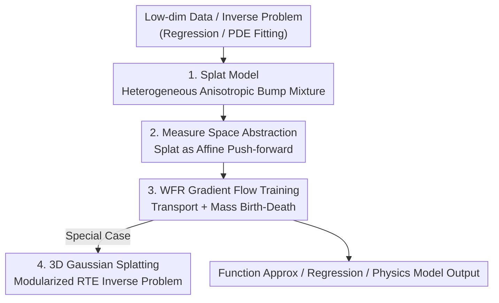

# Splat Regression Models

**Conference**: ICLR 2026  
**OpenReview**: [https://openreview.net/forum?id=rubeJmT1XM](https://openreview.net/forum?id=rubeJmT1XM)  
**Area**: Learning Theory / Function Approximation  
**Keywords**: Function Approximation, Gaussian Splatting, Wasserstein-Fisher-Rao Gradient Flow, Physics-Informed Modeling, Non-parametric Regression

## TL;DR
This paper proposes Splat Regression Models—a class of function approximators that represent output as a weighted mixture of "heterogeneous, anisotropic bump functions (splats)," optimized via Wasserstein-Fisher-Rao gradient flow in measure space. The framework incorporates the popular 3D Gaussian Splatting as a special case and outperforms KAN/MLP by $10\sim100\times$ in terms of error across low-dimensional approximation, regression, and physics-informed fitting tasks using significantly fewer parameters.

## Background & Motivation

**Background**: Major turning points in deep learning are often accompanied by suitable architectures—CNN/ResNet for image classification, U-Net for segmentation and generation, and Transformers for language modeling. However, for low-dimensional problems at the intersection of scientific computing and machine learning (function approximation, regression, physics-informed PDE fitting), a "suitable architecture" has yet to emerge. Current mainstream methods rely either on MLPs (with sine/RBF positional encodings) or the recently introduced Kolmogorov-Arnold Networks (KAN).

**Limitations of Prior Work**: MLP-based methods are slow and difficult to tune for low-dimensional multi-scale problems—Physics-Informed Neural Networks (PINNs) suffer from notorious failure modes requiring extensive manual tuning, and point-wise evaluation of MLPs to render entire spatial domains is computationally expensive. While positional encodings help, they are only "moderately successful." Meanwhile, 3D Gaussian Splatting has achieved great success in novel view synthesis in computer graphics, but it is largely treated as a collection of heuristics (splat initialization, noise injection, pruning/moving strategies), lacking a unified theory to define the inverse problem, the model, and the optimization algorithm.

**Key Challenge**: The success of Gaussian Splatting stems from the modeling concept of "spatially local, adaptively scalable, and oriented basis functions." However, this concept is confined to novel view synthesis in graphics. No one has abstracted it into a general function approximation framework or translated its training heuristics into principled optimization algorithms.

**Goal**: (1) Abstract splat modeling into a general class of regression/approximation models and prove its structural properties and universal approximation capabilities; (2) Provide principled, gradient-based training algorithms; (3) Replicate 3D Gaussian Splatting as an instance of this framework to clarify its modular structure; (4) Validate its performance on representative low-dimensional problems.

**Key Insight**: The authors interpret splat model parameters as a "distribution over distributions"—each splat is a probability measure resulting from an affine transformation of a parent function, and the entire model is a weighted mixture of these measures. From the perspective of measure space, optimizing a splat model becomes gradient flow in measure space. Wasserstein (continuous transport of position/shape) and Fisher-Rao (instantaneous addition/deletion of mass) exactly characterize the "moving + birth/death" updates of splats.

**Core Idea**: Replace the fragmented heuristics in Gaussian Splatting with a unified framework of "Wasserstein-Fisher-Rao gradient flow in splat measure space" and generalize it to arbitrary low-dimensional approximation, regression, and inverse problems.

## Method

### Overall Architecture

The simplest form of a Splat Regression Model is a weighted mixture of bumps:

$$f(x) = \sum_{i=1}^{k} v_i\, \mathcal{N}(x; b_i, A_i A_i^T), \quad v_i \in \mathbb{R}^p,\ b_i \in \mathbb{R}^d,\ A_i \in \mathbb{R}^{d\times d}$$

Each $\mathcal{N}(x; b_i, A_iA_i^T)$ is an anisotropic Gaussian bump (a splat), where position is controlled by $b_i$, and scale and orientation are controlled by $A_i$, with output weights $v_i$. This can be viewed as a two-layer neural network with a "peculiar activation function" or a generalization of classical Nadaraya-Watson kernel regression to "heterogeneous mixture weights."

The core contribution is abstracting this form and equipping it with a principled training mechanism. The pipeline involves: abstracting splats as objects in measure space (each splat is an affine push-forward of a parent function $\rho$, $\rho_{A,b}=(A(\cdot)+b)_\#\rho$, and the model is a mixture measure $\mu$); equipping this space with Wasserstein-Fisher-Rao geometry; calculating the gradient of loss $F(f_\mu)$ with respect to $\mu$ to derive continuous-time dynamics for splat parameters $(v,A,b)$; and finally discretizing these dynamics for training, proving that Gaussian Splatting heuristics are special cases of this gradient flow.

### Key Designs

**1. Splat Model and Bures-Wasserstein Manifold: Bumps as Affine Push-forwards**

To enable principled optimization, the first step is placing splats into a space with geometric structure. Taking a zero-mean, isotropic "parent splat" $\rho \in \mathcal{P}(\mathbb{R}^d)$, the set of all splats is defined as its affine push-forwards $BW_\rho(\mathbb{R}^d) := \{(A(\cdot)+b)_\#\rho : A\in\mathbb{R}^{d\times d}, b\in\mathbb{R}^d\}$. Proposition 1 proves this set is a geodesically convex subset of the Wasserstein space $W_2(\mathbb{R}^d)$, and the Wasserstein metric simplifies to the Bures-Wasserstein metric:

$$W_2^2(\rho_{A,b}, \rho_{R,s}) = \|b-s\|_2^2 + \|A\|_F^2 + \|R\|_F^2 - 2\|A^T R\|_*$$

where $\|\cdot\|_F$ is the Frobenius norm and $\|\cdot\|_*$ is the nuclear norm. This metric is crucial: it shows that the "distance" between splats measures differences in translation $b$ and shape/orientation $A$ simultaneously, allowing position and anisotropic shape to be described unified on the same manifold. The full model $f_\mu(x) := \mathbb{E}[v\,\rho_{A,b}(x)]$ is induced by the splat measure $\mu \in \mathcal{P}(\mathbb{R}^p \times BW_\rho(\mathbb{R}^d))$.

**2. Universal Approximation and Rates: Theoretical Guarantees**

After abstraction, the paper addresses what the model can approximate and how many splats are needed. Proposition 3 proves that finite splat models fall under Cybenko’s classical universal approximation theorem: any continuous function on a compact set can be uniformly approximated by a $k$-splat model. Theorem 3 provides a quantitative upper bound: approximating a bounded Lipschitz function to accuracy $\epsilon$ requires $k \lesssim \epsilon^{-2(d+2)}$ splats. Theorem 4 provides a lower bound $\epsilon^{-d} \lesssim k d^2$. Together, they show that while a minimax optimal rate $\epsilon \sim k^{-1/d}$ exists for certain parent splats, the worst-case rate for any "nice" parent splat is at most $\epsilon \sim k^{-1/2(d+2)}$.

**3. Wasserstein-Fisher-Rao Gradient Flow: Unified Training for Transport and Birth-Death**

This is the core for transforming the splat model from a static function class into a trainable architecture. The splat measure space $\mathcal{S}_{p,d}$ is equipped with both Wasserstein and Fisher-Rao geometries. Wasserstein geometry moves splats via "infinitesimal transport maps" (changing position and shape), while Fisher-Rao geometry (information geometry/Hellinger metric) allows mass to "teleport" by scaling density (adding/deleting splats). Theorem 1 provides the gradient of the loss functional $F(f_\mu)$. The Fisher-Rao component adjusts the "presence" of each splat:

$$\nabla^{FR}_\mu F(f_\mu)(v,A,b) = \mathbb{E}_{X\sim\rho_{A,b}}[\langle\delta F(X), v\rangle] - \mathbb{E}_{v,A,b\sim\mu}\big[\mathbb{E}_{X\sim\rho_{A,b}}[\langle\delta F(X), v\rangle]\big]$$

The Wasserstein component provides continuous dynamics for $\dot v_t, \dot A_t, \dot b_t$. This design is effective because it maps the two manual operations in Gaussian Splatting—"moving/deforming" and "adding/deleting"—to transport and mass changes, providing a theoretical basis for loss reduction.

**4. 3D Gaussian Splatting as a Modular Special Case**

The framework's strength is shown by "replicating" 3D Gaussian Splatting (Example 2). Novel view synthesis is formulated as an inverse problem where the forward operator is the Radiative Transfer Equation (RTE). Unknowns include the emission function $s$ and extinction function $\sigma$, both parameterized by splat models. Rendering involves evaluating the RTE:

$$A[s,\sigma](x,v) = \int_0^\infty s(x+tv, v)\,\sigma(x+tv)\,\exp\!\Big(-\int_0^t \sigma(x+sv)\,ds\Big)\,dt$$

In practice, this is approximated via $\alpha$-blending. This section modularizes the pipeline into the inverse problem (RTE), the model (two splat-parameterized fields), and the optimization (WFR flow + $\alpha$-blending).

### Loss & Training
For Empirical Risk Minimization (Example 1), given samples $\{x_i\}$ and labels $y_i=f^*(x_i)$, the loss is $F(f)=\frac1n\sum_i L(f(x_i), y_i)$. Its first variation $\delta F[f]$ is defined only at sample points, so the authors use importance sampling for unbiased gradient estimation: $\mathbb{E}_{X\sim\rho_{A,b}}[\delta F[f](X)] \approx \frac1n\sum_i \rho_{A,b}(x_i)\,\delta F[f](x_i)$. For inverse problems/physics-informed training (Example 2), the loss is $F(f)=\frac12\|\mathcal{A}[f]-g\|_{L^2}^2$. For simple $\rho$, $\Delta\rho$ and $\nabla(\Delta\rho)$ can be precomputed. Experiments primarily utilize Wasserstein gradient descent or Adam ($10^{-4}$).

## Key Experimental Results

### Main Results: Comparison with KAN and MLP

| Task | Baselines | Conclusion |
|------|----------|------|
| 1D Multi-scale Approx $f^*(x)=\sin(20\pi x(2-x))$ | Chebyshev / Haar Wavelets | $k=30$ splats significantly outperform Chebyshev at the same node count; exceeds 255-parameter Haar wavelets with only 90 parameters. |
| 2D Noisy Regression | KAN / MLP | Splat achieves an order of magnitude lower fitting error with a fraction of the parameters. |
| 2D Physics-Informed (Allen-Cahn) | KAN / MLP | $k=50$ splats outperform all KAN/MLP architectures by an order of magnitude with far fewer parameters. |

Overall, the paper claims Splat models outperform KAN and MLP by $10\sim100\times$ in terms of error for low-dimensional fitting.

### Ablation Study: Parameters vs. Error

| Model | Configuration (Sample) | Relative Performance |
|------|--------------|----------|
| SRM (Ours) | $[10]\sim[400]$ | Lowest error at equivalent or fewer parameters; error continues to drop as parameters increase. |
| KAN | $[10]\sim[400]$ | Significantly higher error than SRM. |
| MLP | $[200]\sim[1000]$ | Highest error tier despite having the most parameters. |

### Key Findings
- Splat superiority is attributed to "spatial locality"—acting as a learned positional encoding. The authors summarize this for low-dimensional modeling as "smart positional encoding is all you need."
- 1D experiments verify exponential convergence of log-MSE, robust to initialization and target functions.
- High expressivity is a double-edged sword: Splat models overfit easily and require regularization, consistent with the "heavy parameter" requirement of worst-case theoretical bounds.

## Highlights & Insights
- **Theorizing Popular Heuristics**: 3D Gaussian Splatting, previously seen as a collection of engineering tricks, is given a clean "inverse problem/model/algorithm" decomposition via WFR gradient flow.
- **Transferability of Measure Space**: The "distribution over distributions" + WFR geometry logic can be transferred to any model where basis functions require both transport and birth-death (e.g., adaptive bases, particle methods).
- **Adaptive Grid Intuition**: SRM can be viewed as learning an adaptive interpolation grid, explaining why it beats MLP/KAN in multi-scale problems with sharp interfaces (like Allen-Cahn).

## Limitations & Future Work
- **Low-Dimensional Focus**: The method specifically targets low-dimensional data; its scalability to high-dimensional deep learning tasks remains unverified.
- **Overfitting and Regularization Dependencies**: Principles for splat regularization are listed as future work; current experiments use relatively simple settings.
- **Loose Theoretical Bounds**: The worst-case splat requirement grows sharply with dimension $d$, not yet reflecting lower parameter counts observed in real data.
- **Large-Scale NVS Validation**: While the framework replicates Gaussian Splatting, the main experiments are on 1D/2D synthetic and PDE tasks.

## Related Work & Insights
- **vs. KAN / MLP (+ Positional Encoding)**: SRM uses spatially local splats as "learnable positional encodings," achieving lower errors with fewer parameters by making local scales and orientations explicitly optimizable.
- **vs. Average-field Theory (Chizat & Bach, 2018)**: While both use WFR flow for two-layer networks, SRM parameters reside on the Bures-Wasserstein manifold rather than Euclidean space.
- **vs. 3D Gaussian Splatting (Kerbl et al., 2023)**: SRM transforms 3DGS from an "art of tuning" into "regularized risk minimization" by providing a principled gradient flow explanation for heuristics like noise injection and pruning.

## Rating
- Novelty: ⭐⭐⭐⭐⭐ High. Abstracting Gaussian Splatting into a general regression framework via WFR flow is both fresh and deep.
- Experimental Thoroughness: ⭐⭐⭐⭐ Solid for 1D/2D and PDE tasks, though large-scale NVS isn't end-to-end validated.
- Writing Quality: ⭐⭐⭐⭐⭐ Excellent. Clear progression from definitions to theorems and examples.
- Value: ⭐⭐⭐⭐⭐ Provides a principled, parameter-efficient architecture for scientific computing and unified theory for a SOTA technique.

<!-- RELATED:START -->

## Related Papers

- [\[ICLR 2026\] On Coreset for LASSO Regression Problem with Sensitivity Sampling](on_coreset_for_lasso_regression_problem_with_sensitivity_sampling.md)
- [\[ICLR 2026\] Learning under Quantization for High-Dimensional Linear Regression](learning_under_quantization_for_high-dimensional_linear_regression.md)
- [\[ICLR 2026\] Theory of Scaling Laws for In-Context Regression: Depth, Width, Context and Time](theory_of_scaling_laws_for_in-context_regression_depth_width_context_and_time.md)
- [\[ICLR 2026\] Polynomial Convergence of Riemannian Diffusion Models](polynomial_convergence_of_riemannian_diffusion_models.md)
- [\[ICLR 2026\] On the Interpolation Effect of Score Smoothing in Diffusion Models](on_the_interpolation_effect_of_score_smoothing_in_diffusion_models.md)

<!-- RELATED:END -->
