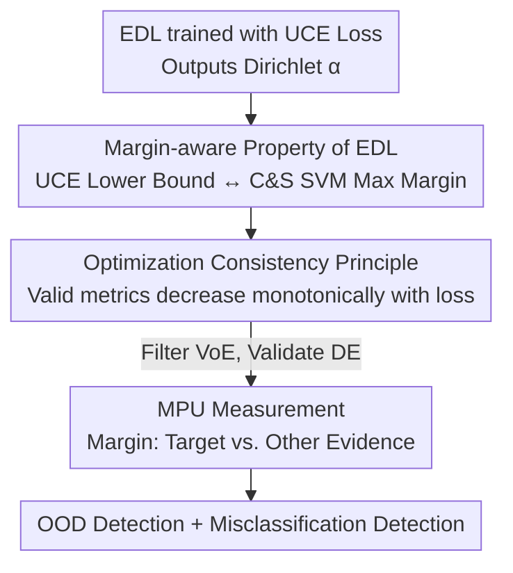

# Stop Guessing: Choosing the Optimization-Consistent Uncertainty Measurement for Evidential Deep Learning

**Conference**: ICLR 2026  
**OpenReview**: [https://openreview.net/forum?id=rGoJxYibgj](https://openreview.net/forum?id=rGoJxYibgj)  
**Code**: https://github.com/LinyeLi60/M-EDL  
**Area**: Learning Theory / Uncertainty Estimation / Evidential Deep Learning  
**Keywords**: Evidential Deep Learning, Uncertainty Measurement, Large Margin SVM, Optimization Consistency, OOD Detection  

## TL;DR
This paper revisits Evidential Deep Learning (EDL) from an optimization perspective, proving that training EDL with UCE loss is equivalent to implicitly maximizing inter-class margins (isomorphic to the Crammer–Singer multiclass SVM). Based on this, it proposes the "Optimization Consistency Principle" as a criterion for selecting uncertainty measurements and designs a simple, interpretable new metric, MPU (Margin-aware Predictive Uncertainty), which significantly outperforms traditional metrics in OOD and misclassification detection.

## Background & Motivation

**Background**: Evidential Deep Learning (EDL) is a class of efficient uncertainty estimation frameworks. It allows a deterministic network to directly output the parameters of a Dirichlet distribution $\alpha = e + 1$ (where $e = \sigma(z(x;\Theta))$ represents non-negative evidence). A single forward pass can simultaneously characterize aleatoric and epistemic uncertainty, making it much faster than Bayesian methods like MC-Dropout or Deep Ensembles that require multiple samplings or models. It is widely used in open-set recognition, trustworthy multi-view classification, and OOD detection.

**Limitations of Prior Work**: Almost all previous works analyze EDL solely from a **probabilistic perspective**—designing priors, utilizing Fisher information, or constraining Shannon entropy, treating EDL as a "universal probability estimator." However, EDL is essentially a deep learning model whose behavior is strongly shaped by the **optimization process** (loss design, gradient dynamics). Focusing only on the probabilistic properties of the Dirichlet distribution while ignoring optimization characteristics leads to an incomplete understanding of EDL.

**Key Challenge**: Various existing uncertainty measurements (Vacancy of Evidence VoE, Differential Entropy DE, Mutual Information MI) are derived directly from Dirichlet parameters. **None have been tested for consistency with the optimization direction of the training objective.** If a measurement yields higher uncertainty as a sample approaches the loss optimum, it contradicts the training objective and misleads the judgment of predictive reliability.

**Goal**: (1) Reveal what the UCE loss actually optimizes; (2) Provide an objective criterion to determine which uncertainty measurements are "compatible" with this loss; (3) Design a new measurement that is explicitly consistent with the optimization.

**Key Insight**: The authors discovered a phenomenon on toy datasets: the linear classifier of an EDL model trained with UCE loss almost overlaps with the optimal solution of a Crammer–Singer multiclass SVM (while being misaligned with One-vs-Rest SVMs). This suggests that the concept of "margin" **naturally emerges** from the EDL objective rather than being explicitly added.

**Core Idea**: Bind the validity of uncertainty measurements to optimization dynamics—a measurement is considered qualified only if "lower loss for a sample results in lower uncertainty" (Optimization Consistency). Based on this, MPU is proposed to directly characterize the margin between "target class evidence vs. other class evidence."

## Method

### Overall Architecture
This paper does not propose a new network but establishes a theoretical chain from "optimization properties → selection criteria → new measurement." The starting point is an EDL model trained with UCE loss (outputting Dirichlet parameters $\alpha$). The first step proves that the UCE loss has a **margin-aware lower bound**, where minimization is equivalent to maximizing the inter-class margin, isomorphic to the C&S multiclass SVM. The second step abstracts the **Optimization Consistency Principle** as an objective criterion to evaluate any uncertainty measurement, filtering out the unqualified VoE and validating DE. The third step follows this principle to design a new measurement **MPU** explicitly aligned with UCE loss. Finally, MPU is applied to OOD and misclassification detection.

### Key Designs

**1. Margin-aware Property of EDL: UCE Loss is Implicitly Equivalent to Max-Margin SVM**

This step addresses what the UCE loss is actually optimizing. The authors prove (Theorem 1) that for a sample $(x,y)$, the UCE loss has the following margin-aware lower bound:

$$L_{UCE}(x,y,W,\Psi) \geq \phi\Big(-M(x,y;W,\Psi)\Big),\quad \phi(t)=\log\big(1+(K-1)\min(1,\exp(t))\big)$$

where the margin $M(x,y)=\sum_{j\neq y}\big(w_y^\top\Psi(x)-w_j^\top\Psi(x)\big)$ compares the target class output $z_y$ against all other class outputs $z_j$ simultaneously. Since $\phi$ is monotonically increasing with respect to $t$, **minimizing UCE loss is equivalent to maximizing the margin** $(K-1)z_y-\sum_{j\neq y}z_j$. This encourages $z_y$ to take large positive values and $z_j$ to take small negative values, aligning with the objective of max-margin classification.

Furthermore (Proposition 1), the authors compare the gradient of UCE loss with respect to classifier weights to the structure of the C&S SVM optimal solution. When the target class Dirichlet intensity is high ($\alpha_{i,y_i}\gg 1$, common with exponential activation), the gradient can be approximated as:

$$\nabla_{w_j}L_{UCE}\approx\sum_{i=1}^{N}\big(\delta_{y_i,j}-b_{ij}\big)\Psi(x_i),\quad b_{ij}=\frac{\alpha_{ij}-1}{S_i}$$

The optimal solution for C&S SVM is $w_j=\beta^{-1}\sum_i(\delta_{y_i,j}-\eta_{ij})x_i$. The structures correspond perfectly: the belief mass $b_{ij}$ in EDL plays the role of the SVM dual coefficient $\eta_{ij}$. For the correct class ($j=y_i$), the term $(1-b_{i,y_i})$ lets the learning automatically focus on samples where the model is still uncertain. For incorrect classes ($j\neq y_i$), $-b_{ij}$ "pushes" the classifier away from wrongly activated sample embeddings. In other words, samples with high uncertainty or conflict act as "dynamic support vectors." This demonstrates that EDL gradient descent **dynamically** achieves the same effect as SVMs using fixed support vectors to define boundaries.

**2. Optimization Consistency Principle: Validating Measurements via the Loss Surface**

Given this connection, which uncertainty measurements are **compatible** with this optimization process? The authors propose the Optimization Consistency Principle (Theorem 2): A measurement $u(x;W,\Psi)$ is valid if and only if, for any two training samples, the sample with a lower loss also has lower uncertainty:

$$L_{UCE}(x,y,W,\Psi)\leq L_{UCE}(x',y',W,\Psi)\ \Rightarrow\ u(x;W,\Psi)\leq u(x';W,\Psi)$$

Intuitively, if loss is viewed as a surface, samples close to the "valley" (optimum) should yield lower uncertainty from a valid measurement. Otherwise, the measurement contradicts the training objective. This principle transforms the evaluation of "measurement quality" from subjective experience into a **falsifiable objective criterion**.

The authors use this to screen existing metrics. **Vacancy of Evidence** VoE $=K/\sum_j\exp(w_j^\top\Psi(x)+1)$ **fails**: a counterexample involves $K=3$ and two samples with the same label where $\alpha=(10,1,1)$ and $\alpha'=(10,10,1)$. The former has a lower loss, but VoE labels it with higher uncertainty ($3/12 > 3/21$), contradicting the optimization direction. Conversely, **Differential Entropy** DE **satisfies** this principle (Proposition 2)—reducing UCE loss reliably reduces DE. This explains why traditional VoE often performs poorly in OOD/misclassification detection.

**3. MPU: A New Measurement for "Target vs. Other Evidence" Margin**

While DE is valid, it has drawbacks: it is non-positive, lacks an intuitive scale, and has moderate sensitivity to distribution concentration. Following the principle and margin-aware property, the authors design **Margin-aware Predictive Uncertainty (MPU)** (Proposition 3):

$$\mathrm{MPU}(\alpha)=(K-1)\,\alpha_{\hat y}-\sum_{j\neq\hat y}\alpha_j$$

where $\hat y$ is the predicted class. It directly measures **the margin between the predicted class evidence and all other class evidence**. This is isomorphic to the margin $(K-1)z_y-\sum_{j\neq y}z_j$ maximized in Design 1, ensuring natural alignment with UCE loss. A larger MPU indicates higher certainty. Its advantages include: (1) **Interpretability**—it grows monotonically from 0 to large positive values; (2) **Sensitivity**—it responds sharply to distribution concentration; (3) **Generality**—it captures both evidence lack (OOD) and inter-class evidence conflict (misclassification).

## Key Experimental Results

### Main Results
On CIFAR-10, using VGG16 as the backbone and training solely with UCE loss (no posterior regularization), four uncertainty measurements were compared on the same model (AUPR, higher is better). The classification accuracy was 93.35%:

| Metric (Same UCE Model) | →SVHN | →CIFAR100 | →GTSRB | →Places365 | →Food101 | Misclassification |
|------|------|------|------|------|------|------|
| Ours /w VoE | 48.96 | 66.45 | 69.64 | 43.21 | 45.65 | 96.63 |
| Ours /w MI | 84.28 | 86.73 | 86.35 | 68.61 | 76.81 | 99.09 |
| Ours /w DE | 87.32 | 88.11 | 87.30 | 70.91 | 78.64 | 99.31 |
| **Ours /w MPU** | **87.36** | **88.92** | **88.71** | **72.82** | **79.79** | **99.41** |
| Δ(MPU vs VoE) | +38.40 | +22.47 | +19.06 | +29.69 | +34.14 | +2.78 |

Simply replacing VoE with MPU (keeping the model identical) resulted in AUPR gains up to +38.40 in OOD tasks and +2.78 in misclassification detection. This validates the decisive impact of optimization consistency on reliability.

### Ablation Study
Cross-scenario validation on CIFAR-100 and Video Open-Set Recognition (UCF-101→HMDB-51):

| Configuration | Key Metrics | Note |
|------|---------|------|
| Metric Ranking (under UCE) | MPU > DE > MI > VoE | Matches the hierarchy predicted by the consistency principle |
| CIFAR-100 Scaling | UCE+MPU Lead | Gain increases as class count grows |
| Video Open-Set UCF→HMDB | MPU: maF1 78.31 / AUC 77.67 | Outperforms DEAR (77.24/77.08) and w/DE |
| Noise Robustness | MPU Optimal | Best performance under 5 levels of Gaussian noise/blur/brightness |

### Key Findings
- **The ranking MPU > DE > MI > VoE holds specifically for UCE loss.** Using other losses changes the ranking, confirming the core thesis that measurements must be optimization-consistent with the specific loss used.
- **VoE is the worst partner**: It violates optimization consistency, showing significantly lower AUPR compared to MPU in OOD detection.
- **MPU gain increases with class count**: The advantage is more pronounced on CIFAR-100, as inter-class evidence conflicts provide richer information when there are more classes.

## Highlights & Insights
- **The Theoretical Bridge**: Proving that UCE loss has a margin-aware lower bound and a gradient structure isomorphic to C&S SVM provides a first-principles basis for selecting measurements.
- **Optimization Consistency as a Methodology**: Evaluating metrics shifts from empirical comparison to a falsifiable criterion ($L \downarrow \Rightarrow u \downarrow$). This methodology can be transferred to any uncertainty framework with a defined training objective.
- **Minimalist Design**: MPU is a one-line formula that requires no extra training or posterior regularization, yet it solves the inconsistency of VoE and the interpretability of DE simultaneously.

## Limitations & Future Work
- **Theoretical Scope**: The connection between optimization consistency and margins is built on static distribution assumptions and has not yet been analyzed for non-stationary scenarios like concept drift or continual learning.
- **Approximation Conditions**: The gradient isomorphism relies on the condition that the target class Dirichlet intensity is high, and the connection strength when this condition is violated requires further discussion.
- **Reliance on $\hat y$**: MPU uses the predicted class as a baseline. If the model prediction is severely wrong, the selection of "target evidence" might be distorted.
- **Scale**: Experiments were conducted on CIFAR and video benchmarks; performance on larger datasets like ImageNet remains to be verified.

## Related Work & Insights
- **vs. Traditional EDL Metrics**: Previous metrics were derived from Dirichlet parameters without considering optimization consistency. This work proves VoE is unqualified and DE is valid, providing MPU as a theoretically superior alternative.
- **vs. EDL Variants (I-EDL / PostN / NatPN)**: These methods often rely on redesigning priors or adding complex posterior regularizations. This work achieves higher AUPR by simply choosing a consistent metric without adding any regularization.
- **vs. SVM Theory**: This paper bridges Deep Evidential Learning with classical margin theory, revealing that EDL implicitly performs margin maximization of C&S multiclass SVMs.

## Rating
- Novelty: ⭐⭐⭐⭐⭐ 
- Experimental Thoroughness: ⭐⭐⭐⭐ 
- Writing Quality: ⭐⭐⭐⭐⭐ 
- Value: ⭐⭐⭐⭐⭐ 

<!-- RELATED:START -->

## Related Papers

- [\[ICLR 2026\] Variational Deep Learning via Implicit Regularization](variational_deep_learning_via_implicit_regularization.md)
- [\[ICLR 2026\] Non-Asymptotic Analysis of (Sticky) Track-and-Stop](non-asymptotic_analysis_of_sticky_track-and-stop.md)
- [\[ICML 2026\] Learning Credal Ensembles via Distributionally Robust Optimization](../../ICML2026/learning_theory/learning_credal_ensembles_via_distributionally_robust_optimization.md)
- [\[ICLR 2026\] Deep Learning with Learnable Product-Structured Activations](deep_learning_with_learnable_product-structured_activations.md)
- [\[ICLR 2026\] Online Inventory Optimization in Non-Stationary Environment](online_inventory_optimization_in_non-stationary_environment.md)

<!-- RELATED:END -->
