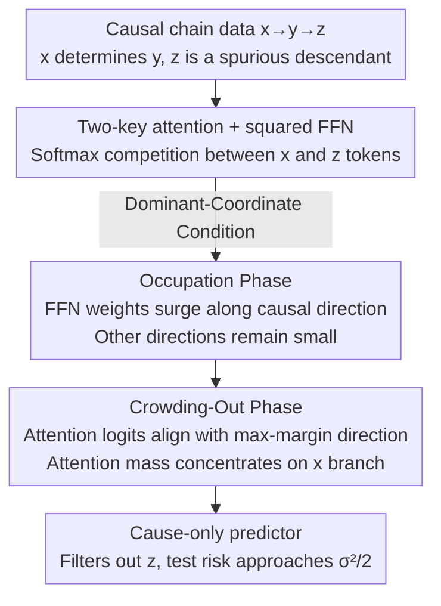

# Strong Correlations Induce Cause Only Predictions in Transformer Training

**Conference**: ICLR 2026  
**OpenReview**: [https://openreview.net/forum?id=z8xjWmyQSZ](https://openreview.net/forum?id=z8xjWmyQSZ)  
**Area**: Learning Theory / Training Dynamics Analysis  
**Keywords**: Causal Learning, Spurious Correlation, Implicit Regularization, Attention Mechanism, Training Dynamics

## TL;DR
This paper identifies and characterizes a new phenomenon in Transformer training termed **Correlation Crowding-Out (CCO)**: when a causal feature in the data has a correlation with the target strong enough to dominate all spurious features, gradient descent (GD) spontaneously filters out spurious cues without any invariance regularization or multi-environment labels. The model converges to a predictor relying almost exclusively on causal features. This is supported by theoretical proofs of a "Occupation-Crowding-Out" two-stage mechanism and validated through vision and language experiments.

## Background & Motivation
**Background**: Extracting causal invariance from observational data to achieve robust generalization is a core objective in AI. However, models trained with Empirical Risk Minimization (ERM) often exhibit "shortcut learning," indiscriminately utilizing any correlations, including spurious cues unrelated to the true causal mechanism. Transformers and LLMs amplify this contradiction, sometimes relying on low-level artifacts and other times providing seemingly logical and robust answers.

**Limitations of Prior Work**: Existing theories only provide fragmentary clues. One category focuses on in-context learning (ICL), showing that attention can reconstruct parent node sets or estimate transition probabilities from Markov chains, but these rely on hand-crafted ICL settings and fail to answer when spurious information is suppressed in general training with descendant features. Another category involving max-margin analysis shows that GD pushes query–key parameters toward a max-margin separating hyperplane but does not characterize whether this separation actually filters spurious features or provide cause-only risk guarantees.

**Key Challenge**: The dominant narrative in academia is that neural networks have a simplicity bias where spurious, easily-fitted features dominate early training, delaying or suppressing the learning of causal features. This paper explores the **mirror case**: what happens when causal features themselves dominate predictability? Intuitively, if a causal feature explains the target with overwhelming strength, the model should have little incentive to rely on weaker spurious cues. However, whether this intuition holds rigorously for Transformer architectures with softmax attention remains unproven.

**Key Insight**: The paper emphasizes that strong causal correlation in data does **not** automatically guarantee cause-only predictions. As shown in Example 25, even under dominance, Ordinary Least Squares (OLS) regression retains a constant proportion of spurious features to fit noise. Therefore, CCO is not a trivial consequence of data dominance; it relies on the implicit regularization brought by the optimization process (GD + Transformer structure).

**Core Idea**: Under the premise of "causal feature dominance," this study uses a simplified Transformer trained on a minimal causal chain $x \to y \to z$ to prove that the implicit regularization of GD spontaneously converges to a solution that relies only on causal $x$ and filters out spurious descendant $z$ through a coupled "occupation + crowding-out" mechanism.

## Method

### Overall Architecture
This is a mechanistic analysis paper. Instead of proposing a new algorithm, it **observes a phenomenon and proves the mechanism using an analytically tractable toy model**. The overall approach consists of three steps: (1) Compressing the "causal vs. spurious" tension into a minimal causal chain generative process $x \to y \to z$, where $x$ determines $y$ and $z$ is a spurious descendant induced by $y$; (2) Fitting this data with a simplified Transformer (two-key attention + squared-parameterized feed-forward layer) trained via standard GD; (3) Defining a "Dominant-Coordinate Condition" to prove that training dynamics necessarily pass through two coupled stages—"Occupation" and "Crowding-out"—culminating in a cause-only predictor with high-probability convergence and generalization guarantees.

The pipeline of the training dynamics is illustrated below:

### Key Designs

**1. Minimal Causal Chain Toy Model: Compressing $x \to y \to z$ into Two-Key Attention**

To rigorously analyze CCO, a carrier that is both analytical and non-linear is needed. This study uses a minimal Directed Acyclic Graph (DAG) $x \to y \to z$: covariates $x, z \in \mathbb{R}^d$, scalar response $y \in \mathbb{R}$ is a sparse quadratic signal $y = x^\top (w^*)^{\odot 2} + \epsilon$, where $w^*$ is a sparse binary vector ($w^*_1 = 1$, support size $\le r$). The spurious descendant $z = f(y) + \xi$ depends on $y$ via an $L$-Lipschitz function $f$. This extracts the common structure where $x$ carries the causal signal and $z$ is a downstream induced correlation (e.g., sentiment analysis).

The model uses **two-key attention**: fixed positional encodings $\tilde{x} = (s_1; x)$ and $\tilde{z} = (s_2; z)$ are added to tokens, and the query is a learnable gating vector $q^t = \tilde{v}^t$. Utilizing the translation invariance of softmax, the attention weight is a sigmoid of the difference vector:

$$p^t_i = \sigma\!\big((\tilde{v}^t)^\top(\tilde{x}_i - \tilde{z}_i)\big), \qquad \hat{h}_{i,t} = p^t_i\,\tilde{x}_i + (1-p^t_i)\,\tilde{z}_i.$$

The prediction head is a squared-parameterized diagonal FFN: $\hat{y}_{i,t} = \hat{h}_{i,t}^\top (\tilde{w}^t)^{\odot 2}$, with mean squared error loss. This module is essentially a single-head dot-product attention where $W_Q, W_K, W_V$ are identity projections—stripping away layers that obscure optimization while **fully preserving the softmax competition geometry and value-mixing mechanism** critical for CCO. Positional encodings $s_1 \ne s_2$ inject a sample-independent margin $(\tilde{v}^t)^\top(s_1 - s_2)$, preventing gating collapse early in training.

**2. Dominant-Coordinate Condition: Quantitative Boundaries for Crowding-Out**

CCO requires the data to satisfy quantifiable dominance. The paper defines the effective signal $s^{\mathrm{eff}}_j := s_j + \mu_j$, where $s_j = \mathbb{E}[(x^\top(w^*)^{\odot 2})(x_j + z_j)]$ measures the cross-moment and $\mu_j = \mathbb{E}[\epsilon(x_j+z_j)]$ corrects for noise leakage.

- **Condition 1 (Occupation Guarantee)**: The effective signal of the dominant coordinate must exceed all competitors by a consistent margin: $s^{\mathrm{eff}}_1 > \tfrac{2 m_1}{15} + \max_{j>1}\big(\tfrac{4 s^{\mathrm{eff}}_j + m_{1j}}{8}\big)$. This **allows** strong spurious correlations in other coordinates as long as they do not overwhelm the dominant causal direction.
- **Condition 2 (Crowding-Out Guarantee)**: There exist constants $\tau_1, \tau_2 > 0$ such that every sample satisfies a non-trivial margin $|x^i_1 - z^i_1| \ge \tau_1$, sign stability $\mathrm{sgn}(x^i_1 - z^i_1) = \mathrm{sgn}(x^i_1)$, and a lower bound on the dominant coordinate's margin $\tfrac{3}{4}|x^i_1| \ge (r-1)B'_x + B_\epsilon + \tau_2$.

Crucially, this condition **does not exclude** cases where some non-dominant causal coordinates have lower correlation with $y$ than spurious descendant coordinates.

**3. Occupation-Crowding-Out Dynamics: FFN First, Attention Second**

Under dominant conditions, training unfolds in two coupled stages, analyzed via a staged learning rate schedule:

- **Occupation Phase (Early Surge)**: In the FFN sub-layer, the weight $\tilde{w}_1$ aligned with the dominant causal coordinate grows rapidly to a stable large scale, while weights in other directions remain small. This makes the causal direction "visible" to the optimizer.
- **Crowding-Out Phase (Attention Selection)**: The attention query–key alignment gradually shifts toward the **max-margin separating direction** between the causal and spurious features (roughly $\tilde{x} - \tilde{z}$). Consequently, the attention weight $p^t_i$ concentrates almost entirely on the causal $x$ branch, gating out the spurious $z$ branch.

**4. Convergence and Generalization Guarantees**

**Theorem 1 (Mechanism)**: Under the specified conditions and schedule, with probability at least $1 - 1/d^2$, the FFN head converges to the ground truth with error $|w^{T^*}_i - w^*_i| \lesssim \sigma\sqrt{\log d}/\sqrt{n}$, while the attention gating vector $\tilde{v}^t$ follows a max-margin ray $\hat{u}$ with norm growing as $\log t$, ensuring $p^{T^*}_i \ge 1 - 1/d^2$. **Theorem 2 (Generalization)**: In testing, the gate still favors the causal branch, and the test loss approaches the "cause-only" noise floor $\sigma^2/2$ at a rate of $O(r\sigma^2 \log d / n)$. **Corollary 1** notes that even if the $y \to z$ mechanism changes at test time, the CCO predictor remains robust.

## Key Experimental Results

### Main Results (Simulation & Real Tasks)
Simulations use Algorithm 1: $x \to y \to z$ (where $z = Cy + \xi$), batch size 64, $d \in \{5, 10\}$. Results match theory—mean attention $\bar{p}^t_x$ jumps to 1 in the first 100 iterations (Occupation), while $\|w - w^*\|_2$ slowly reaches its minimum (Crowding-out).

| Task | Setting | Key Phenomenon |
|------|---------|----------------|
| Simulation | $d \in \{5, 10\}$, 5000 iter | $\bar{p}^t_x \to 1$ in 100 iter; $w_1$ fills in occupation, others converge in crowding-out |
| Vision (Waterbirds) | $p_{\mathrm{train}}=0.9$, left bird causal, right spurious | Attention surges on left bird (50 iter) and concentrates there by iter 500; right bird near zero |
| Vision (ViT vs CNN) | DeiT-Small vs ResNet34, 1000 epoch | Under high bias (0.9), DeiT-Small significantly outperforms CNN, catching causal signals better |
| Language (Amazon Sentiment) | Fine-tuned bert-base, 50k steps | Masking NOUN+VERB results in fast test loss drop; masking ADJ+VERB shows upward trend, indicating nouns were "crowded out" |

### Key Findings
- **Existence of a Bias Threshold**: CCO triggers and provides OOD robustness (>95%) when $p_{\mathrm{train}} \le 0.85$. If $\ge 0.9$, the model reverts to reliance on spurious cues.
- **Occupation Before Crowding-Out**: Across simulation, vision, and language, causal direction occupation precedes the suppression of spurious branches.
- **Transformer Superiority**: Softmax competition + value mixing makes ViT more likely to spontaneously select causal signals compared to CNNs of similar scale.

## Highlights & Insights
- **Mirroring Shortcut Learning**: While prior theories emphasize spurious features suppressing causal learning, this study shows that in causal-dominant regimes, GD's implicit regularization becomes an ally for causal learning.
- **Rigorous Logic**: By using Example 25 to show that "data dominance $\neq$ cause-only prediction" (linear regression fails), the paper specifically credits the Transformer + GD optimization-induced regularization.
- **Position Encoding's Role**: $s_1 \ne s_2$ is more than positional info; it acts as a catalyst by injecting a sample-independent margin to break symmetry early on.

## Limitations & Future Work
- **Reliance on Strong Dominance**: CCO requires a causal direction to dominate. If spurious cues are equally strong or numerous, standard ERM may still fail.
- **Simplified Toy Model**: The theory relies on a minimal causal chain and specific learning rate schedules, which may differ from the messy dynamics of deep, multi-head Transformers.
- **Verifiability**: Conditions involve population moments that are hard to verify directly in real-world data, relying instead on proxy variables like bias intensity.

## Related Work & Insights
- **vs. IRM/ICP**: While these methods require explicit invariance regularizers or multi-environment labels, this paper proves that standard GD can achieve cause-only results in causal-dominant regimes.
- **vs. Simplicity Bias**: Complements theories of shortcut learning by focusing on the dual phenomenon where causal features dominate.
- **vs. Attention Max-Margin**: Extends prior work by showing that the separating direction specifically aligns to filter out spurious descendants.

## Rating
- **Novelty**: ⭐⭐⭐⭐⭐ Identifies and names the CCO phenomenon as a mirror to shortcut learning with a solid theoretical-experimental loop.
- **Experimental Thoroughness**: ⭐⭐⭐⭐ Cross-validation via synthetic, vision, and NLP tasks, though it lacks validation on very large-scale LLMs.
- **Writing Quality**: ⭐⭐⭐⭐ Clear mechanical narrative, though the theoretical conditions are notation-heavy.
- **Value**: ⭐⭐⭐⭐ Provides practical intuition on when standard training can spontaneously debias models.

<!-- RELATED:START -->

## Related Papers

- [\[ICLR 2026\] Does Weak-to-strong Generalization Happen under Spurious Correlations?](does_weak-to-strong_generalization_happen_under_spurious_correlations.md)
- [\[ICLR 2026\] From Predictors to Samplers via the Training Trajectory](from_predictors_to_samplers_via_the_training_trajectory.md)
- [\[ICLR 2026\] Feature Compression is the Root Cause of Adversarial Fragility in Neural Networks](feature_compression_is_the_root_cause_of_adversarial_fragility_in_neural_network.md)
- [\[ICLR 2026\] On Smoothness Bounds for Non-Clairvoyant Scheduling with Predictions](on_smoothness_bounds_for_non-clairvoyant_scheduling_with_predictions.md)
- [\[ICLR 2026\] Resurfacing the Instance-only Dependent Label Noise Model through Loss Correction](resurfacing_the_instance-only_dependent_label_noise_model_through_loss_correctio.md)

<!-- RELATED:END -->
