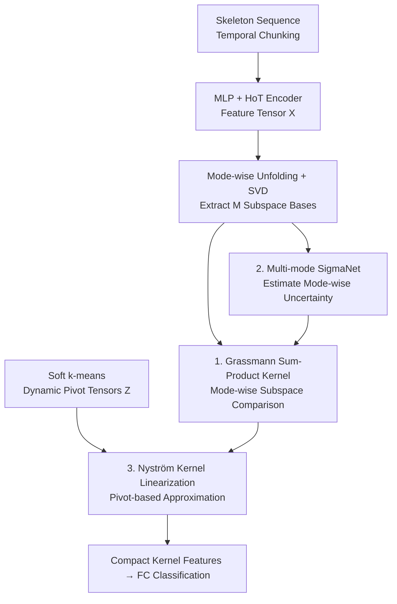

# Subspace Kernel Learning on Tensor Sequences

**Conference**: ICLR 2026  
**OpenReview**: [https://openreview.net/forum?id=kv22NbU2T2](https://openreview.net/forum?id=kv22NbU2T2)  
**Code**: None  
**Area**: Kernel Methods / Tensor Learning / Subspace Geometry  
**Keywords**: Tensor Kernels, Grassmann Manifolds, Nyström Approximation, Uncertainty Modeling, Skeleton Action Recognition

## TL;DR
This paper proposes UKTL (Uncertainty-driven Kernel Tensor Learning), which unfolds high-order tensors into subspaces along each mode, constructs learnable "sum-product" kernels on Grassmann manifolds to compare tensor sequences, utilizes Nyström approximation with soft k-means dynamic pivots for scalability, and adaptively down-weights noisy dimensions via mode-wise uncertainty. Trained end-to-end, it outperforms Graph Convolutional Networks (GCN), Hypergraphs, and Transformer-based methods on three skeleton action recognition benchmarks.

## Background & Motivation

**Background**: Multi-way data such as videos and biological signals are naturally high-order tensors (space × time × feature). Tensor decompositions (CP / Tucker / t-SVD) extract low-rank representations while preserving multi-mode structures, while kernel methods map data into RKHS for non-linear comparisons. Recent tensor subspace learning attempts to combine the advantages of both lines of research.

**Limitations of Prior Work**: ① Many kernel methods only accept vectorized inputs; "flattening" tensors destroys inter-mode structures, leading to inefficiency or insufficient expressiveness. ② Tensor decompositions are inherently linear, making them difficult to integrate with non-linear learning frameworks. ③ Kernels in existing tensor subspace methods are often **pre-defined and static** (e.g., handcrafted kernels or randomly selected dictionaries), remaining decoupled from the training process and failing to adapt to specific data distributions. ④ Nearly all methods **assume each mode is equally important**, applying a uniform regularization, whereas in reality, the signal-to-noise ratio and discriminative power vary significantly across spatial, temporal, and semantic modes.

**Key Challenge**: Achieving expressiveness requires non-linear kernels, but kernel matrices grow quadratically with the number of samples and are not scalable. Preserving structure requires maintaining multi-modality, but traditional tensor methods are linear and treat all modes as equivalent. It is difficult to simultaneously achieve expressiveness, scalability, and structural fidelity while accounting for mode importance imbalance.

**Goal**: To construct a kernel learning framework that preserves multi-mode structure, remains non-linear, and supports end-to-end scalable training, while explicitly modeling "which mode is more trustworthy."

**Key Insight**: The authors observe (Fig. 1) that after Tucker decomposition of action tensors, the factor matrices of each mode exhibit interpretable, mode-specific structural patterns. This implies that **subspaces unfolded from each mode are meaningful units of comparison themselves**. Instead of comparing raw tensors directly, the unfolded matrices of each mode are projected into low-dimensional subspaces and treated as points on Grassmann manifolds for robust comparison.

**Core Idea**: Replace "global tensor comparison" or "flattened vector comparison" with "mode-wise subspace kernels on Grassmann manifolds," then superimpose uncertainty weighting and Nyström linearization to make the kernel structure-aware, robust to noise, and scalable.

## Method

### Overall Architecture

UKTL handles "tensor sequence classification" tasks (e.g., skeleton action recognition). The input is a skeleton sequence, and the output is the action category. The pipeline segments the sequence into temporal blocks, encodes them into third-order feature tensors, then **unfolds along each mode and uses SVD to extract subspace bases**. These are compared using dynamic pivot tensors for Nyström kernel linearization. Simultaneously, a small network estimates the uncertainty of each mode's subspace to weight the kernels. Finally, compact kernel features are fed into a classifier. The entire process is trained end-to-end.

The skeleton sequence is first divided into $\tau$ temporal blocks. Each block passes through a 3-layer MLP for joint-wise embedding, then aggregates into triplet hyperedges through a Higher-order Transformer (HoT) to obtain a third-order feature tensor $\mathcal{X}_i \in \mathbb{R}^{d'\times N_\xi \times \tau}$ (where $N_\xi=\binom{J}{3}$ is the number of hyperedges). Here, "mode" refers to tensor dimensions (space, time, hyperedge). The core contribution lies in the three kernel modules following the encoder.

### Key Designs

**1. Grassmann Subspace Sum-Product Kernel: Subspace Geometry over Raw Comparison**

To address the destruction of structure by flattening and the noise sensitivity of direct tensor comparison, UKTL performs SVD on each mode-$m$ unfolding $X_{(m)} \in \mathbb{R}^{I_m\times \bar I_m}$ and extracts the top $p$ left singular vectors $U_{X(m)}\in\mathbb{R}^{I_m\times p}$. This spans a $p$-dimensional subspace, represented as a point on the Grassmann manifold $\mathcal{G}(p,I_m)$. Using the projection embedding $\mathrm{span}(U_{X(m)})\mapsto U_{X(m)}U_{X(m)}^\top$, differences between subspaces are measured via the Frobenius norm of projection matrices, defining a Gaussian-style factor kernel for each mode:

$$k(X_{i(m)}, X_{j(m)}) = \exp\!\left(-\frac{\lVert U_{X_i(m)}U_{X_i(m)}^\top - U_{X_j(m)}U_{X_j(m)}^\top\rVert_F^2}{2\sigma^2}\right)$$

To capture both "synergistic" and "independent" structural information, factors are combined into a **product kernel** $k=\prod_{m=1}^M k(X_{i(m)},X_{j(m)})$ (emphasizing joint interaction) and a **sum kernel** $k=\sum_{m=1}^M k(X_{i(m)},X_{j(m)})$ (emphasizing additive contributions). These are fused via a coefficient $\mu\in[0,1]$ into a **sum-product kernel**:

$$k(\mathcal{X}_i,\mathcal{X}_j) = \mu\sum_{m=1}^M k(X_{i(m)},X_{j(m)}) + (1-\mu)\prod_{m=1}^M k(X_{i(m)},X_{j(m)})$$

The product kernel is sensitive to any mode mismatch, while the sum kernel is more robust. Since $p \ll$ original dimensions, this is efficient and noise-resistant.

**2. Mode-wise Uncertainty Weighting (MSN): Adaptive Denoising**

UKTL uses a Multi-mode SigmaNet (MSN) to explicitly model the reliability of each mode's subspace. MSN has $M$ branches that take the projection matrix $U_{X_i(m)}U_{X_i(m)}^\top$ and output a bounded uncertainty vector $\sigma_{X_i(m)}\in\mathbb{R}^p$. This "whitens" the subspace bases:

$$\widetilde U_{X_i(m)} = U_{X_i(m)} / \sqrt{\sigma_{X_i(m)}}$$

Directions with high uncertainty are suppressed. Replacing $U$ with $\widetilde U$ in the kernels creates an uncertainty-aware version. A maximum likelihood-based uncertainty regularization ensures $\sigma$ does not collapse.

**3. Dynamic Pivot Nyström Kernel Linearization: Scalable Low-rank Features**

To solve the quadratic growth of the kernel matrix, UKTL uses Nyström low-rank approximation to produce explicit finite-dimensional features. Unlike traditional methods using static dictionaries, this paper employs **differentiable soft k-means clustering** in the tensor space to dynamically learn $C$ pivot tensors $\{\mathcal{Z}_j\}$:

$$\min_{[\mathcal{Z}_1,\dots,\mathcal{Z}_C]} \sum_{i=1}^N \Big\lVert \mathcal{X}_i - \sum_{j=1}^C \mathcal{Z}_j [\alpha_i]_j \Big\rVert_F^2$$

Calculating the data-pivot kernel matrix $K_{NC}$ and pivot-pivot matrix $K_{CC}$, the stabilized inverse square root $P^{-1}=U\Lambda^{-1/2}U^\top$ of $K_{CC}$ is used to obtain centralized Nyström embeddings $\widetilde G = K_{NC}P^{-1} - \bar G \in \mathbb{R}^{N\times C}$. These compact features are fed into the classifier.

### Loss & Training

The model $f(\mathcal{X};\mathcal{P}) = \mathrm{FC}(\mathrm{MSN}(\mathrm{HoT}(\mathrm{MLP}(\mathcal{X}))))$ is trained end-to-end. The loss combines cross-entropy with uncertainty regularization:

$$\ell^*(\mathcal{X},y;\mathcal{P}) = \sum_{i=1}^N\Big[\ell(f(\mathcal{X}_i;\mathcal{P}),y_i) + \beta\sum_{m=1}^M\sum_{k=1}^p \log\Big(\frac{\sigma_{k,X_i(m)}+1}{\frac{1}{P}\sum_j \sigma_{k,X_j(m)}+1}\Big)\Big]$$

Where $\beta$ regulates uncertainty. Optimization uses SGD; hyperparameters like $\mu$, $\beta$, and the number of pivots $C$ are tuned via HyperOpt. The framework is modality-agnostic.

## Key Experimental Results

### Main Results

On NTU-60, NTU-120, and Kinetics-Skeleton, UKTL outperforms GCN, hypergraph, and Transformer methods using the same backbone.

| Method | NTU-60 X-Sub | NTU-60 X-View | NTU-120 X-Sub | NTU-120 X-Setup | Kinetics Top-1 |
|------|------|------|------|------|------|
| DSDC-GCN (Graph) | 93.0 | 97.1 | 89.9 | 90.6 | 38.6 |
| CTR-GCN (Graph) | 92.6 | 96.7 | 89.6 | 91.0 | - |
| STST (Transformer) | 91.9 | 96.8 | - | - | 38.3 |
| Backbone (MLP+HoT) | 90.8 | 95.8 | 85.2 | 87.4 | 36.7 |
| + KPCA (Flattened) | 92.0 | 96.8 | 88.6 | 90.1 | 37.1 |
| + TPCA (Linear Tensor) | 91.6 | 96.8 | 88.2 | 90.0 | 38.0 |
| + KTL (Ours, no Unc.) | 92.5 | 97.1 | 88.8 | 90.3 | 38.9 |
| **+ UKTL (Ours Full)** | **93.1** | **97.3** | **90.0** | **91.4** | **39.2** |

UKTL demonstrates a significant gain over KTL (e.g., +1.2% on NTU-120 X-Sub) due to uncertainty modeling.

### Ablation Study

| Configuration | NTU-60 X-Sub | Notes |
|------|------|------|
| Sum-only Kernel | 81.6 | Weak performance |
| Product-only Kernel | 91.8 | Decent performance |
| **Sum-Product Kernel** | **93.1** | Best complementarity |
| Linear Kernel | 77.5 | Poor expressiveness |
| Nyström Pivots C=60 | 86.7 | Insufficient approximation |
| Nyström Pivots C=150 | 93.1 | Significant improvement |

### Key Findings
- **Complementarity of Sum and Product Kernels**: Combining kernels (93.1%) outperforms using them individually (81.6% and 91.8%).
- **Uncertainty is a Stable Gain**: UKTL consistently improves over KTL, indicating that modeling mode trustworthiness is effective for noisy skeleton data.
- **Low Subspace Dimension $p$ is Sufficient**: Optimal values (e.g., $p=8$ or $10$) suggest low-dimensional subspaces capture enough discriminative structure.
- **Pivot Sweet Spot**: Accuracy saturates after $C=180$, balancing approximation quality and computation.

## Highlights & Insights
- **Grassmann Geometry**: Comparing the "orientation" of mode subspaces rather than raw values provides robustness to noise and occlusions while ensuring efficiency.
- **Smart Kernel Fusion**: The sum-product design bridges the gap between strict mode coupling and additive robustness.
- **Intrinsic Uncertainty**: Uncertainty is injected by "whitening" the bases before kernel calculation, making it a part of the similarity measure rather than an after-the-fact weight.
- **Evolvable Approximation**: Learning Nyström pivots via soft k-means ensures the kernel approximation stays aligned with the evolving data distribution during training.

## Limitations & Future Work
- **Task Specificity**: Experiments are currently focused on skeleton action recognition; validation on other tensor sequences (e.g., biosignals) is needed.
- **High-order Scaling**: For $M > 3$, product kernels might become overly sensitive to noise; robustness under higher orders is untested.
- **Hyperparameter Dependency**: Values for $\mu$, $\beta$, $C$, and $p$ rely on HyperOpt and may require re-tuning for new datasets.

## Related Work & Insights
- **vs. Tensor Decomposition**: Unlike linear methods (e.g., Tucker) that treat modes equally, UKTL introduces non-linearity and adaptive mode weighting.
- **vs. Traditional Tensor Kernels**: UKTL is end-to-end learnable and scalable via Nyström, whereas prior kernels were often static and not scalable.
- **vs. GCN/Transformers**: UKTL proves that a structure-preserving tensor kernel framework can systematically outperform specialized graph architectures under the same backbone.

## Rating
- Novelty: ⭐⭐⭐⭐⭐ 
- Experimental Thoroughness: ⭐⭐⭐⭐ 
- Writing Quality: ⭐⭐⭐⭐⭐ 
- Value: ⭐⭐⭐⭐ 

<!-- RELATED:START -->

## Related Papers

- [\[ICLR 2026\] Understanding In-Context Learning on Structured Manifolds: Bridging Attention to Kernel Methods](understanding_in-context_learning_on_structured_manifolds_bridging_attention_to_.md)
- [\[ICLR 2026\] How to Square Tensor Networks and Circuits Without Squaring Them](how_to_square_tensor_networks_and_circuits_without_squaring_them.md)
- [\[ICLR 2026\] Understanding the Dynamics of Forgetting and Generalization in Continual Learning via the Neural Tangent Kernel](understanding_the_dynamics_of_forgetting_and_generalization_in_continual_learnin.md)
- [\[ICLR 2026\] Training-Free Determination of Network Width via Neural Tangent Kernel](training-free_determination_of_network_width_via_neural_tangent_kernel.md)
- [\[NeurIPS 2025\] Kernel Conditional Tests from Learning-Theoretic Bounds](../../NeurIPS2025/learning_theory/kernel_conditional_tests_from_learning-theoretic_bounds.md)

<!-- RELATED:END -->
