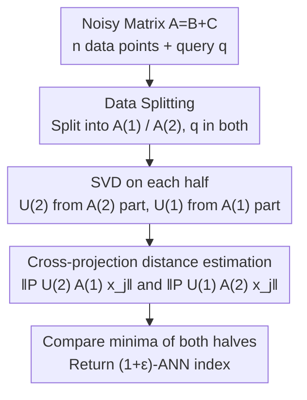

# SVD Provably Denoises Nearest Neighbor Data

**Conference**: ICLR 2026  
**OpenReview**: [https://openreview.net/forum?id=N1kiOll2EN](https://openreview.net/forum?id=N1kiOll2EN)  
**Code**: None  
**Area**: Learning Theory / High-dimensional Statistics / Spectral Methods  
**Keywords**: Nearest Neighbor Search, SVD Denoising, Subspace Perturbation, Semi-random Models, Information-theoretic Lower Bounds

## TL;DR
Under the semi-random model of "low-dimensional signal + high-dimensional Gaussian noise," this paper proves that performing SVD twice on noisy data and projecting points onto the top-$k$ singular subspace allows for accurate recovery of the noise-free nearest neighbors within a noise level $\sigma = O(1/k^{1/4})$, an interval **significantly wider** than previous work. It also provides a matching information-theoretic impossibility lower bound of $\sigma \gg 1/k^{1/4}$.

## Background & Motivation
**Background**: Nearest Neighbor Search (NNS) in high-dimensional spaces generally relies on data-oblivious dimensionality reduction like **Random Projections** (Johnson–Lindenstrauss Lemma), which led to the development of approximate algorithms with rigorous guarantees such as LSH. These methods are proven to be optimal in the worst-case.

**Limitations of Prior Work**: In practice, however, data-aware projections like **PCA / SVD** are preferred—PCA trees, spectral hashing, and semantic hashing often outperform random projections on real datasets. The issue is that these spectral methods have **almost no rigorous correctness guarantees**: theory suggests random projection is optimal, while practice suggests data-aware methods are superior. This gap between "theoretical guarantees vs. empirical success" remains an open challenge in large-scale data analysis.

**Key Challenge**: Since random projection is indeed optimal for worst-case inputs, it is **impossible** to demonstrate the theoretical advantage of data-aware methods within a worst-case framework. To explain why SVD performs better, one must adopt a model closer to real-world data—where data is not arbitrary but consists of a **low-dimensional structure + noise**.

**Goal**: Analyze SVD under the **semi-random model** proposed by Abdullah et al. (2014): $n$ points originate from an unknown $k$-dimensional subspace in $\mathbb{R}^d$ ($k \ll d$), with each coordinate independently corrupted by $\mathcal{N}(0,\sigma^2)$ Gaussian noise. Given only the noisy data, the goal is to recover the nearest neighbors of the **noise-free data**. The core sub-problem is: what is the maximum noise $\sigma$ that SVD can tolerate? Is this threshold optimal?

**Key Insight**: Data points, query points, and noise are arranged into a matrix $A = B + C$ (where $B$ is a rank-$k$ latent signal and $C$ is Gaussian noise). Since the true signals lie in a $k$-dimensional subspace, the top-$k$ singular subspace of $A$ should approximate this latent subspace. Projecting onto this subspace filters out the vast majority of noise energy, enabling accurate estimation of pairwise distances $\|p_i - q\|$.

**Core Idea**: Utilize a denoising NNS approach by "performing SVD on the noisy matrix and projecting onto the top-$k$ subspace," which improves the noise tolerance from an inverse polynomial of the **ambient dimension $d$** to $O(1/k^{1/4})$, depending only on the **intrinsic dimension $k$**. This threshold is proven to be information-theoretically optimal.

## Method

### Overall Architecture
The input to the algorithm is a noisy matrix $A \in \mathbb{R}^ {d \times (n+1)}$: the first $n$ columns are noisy data points, and the last column is the noisy query $q$. The output is the index of the $(1+\varepsilon)$-approximate nearest neighbor of the noise-free data. The entire pipeline consists of two steps: **Subspace Estimation** (SVD) and **Distance Comparison after Projection**.

A critical engineering technique used is **Data Splitting**: the $n$ data points are split into two halves $A^{(1)}$ and $A^{(2)}$ (with the query column included in both). Each half is used independently to calculate the top-$k$ singular subspaces $U^{(1)}$ and $U^{(2)}$. They are then used **cross-wise**—$U^{(2)}$ is used to project and recover distances for the first half of the data, while $U^{(1)}$ is used for the second half. The sole purpose of this is to ensure that the "subspace used for projection" and the "noise in the projected data" are probabilistically **independent**, making the concentration inequality arguments clean and controllable.

Specifically, let $x_j = e_j - e_{n/2+1}$ (the $j$-th column minus the query column). The algorithm estimates $\big\| P_{U^{(2)}} A^{(1)} x_j \big\|$ for each point in the first half and $\big\| P_{U^{(1)}} A^{(2)} x_j \big\|$ for the second half. It takes the minimum from each half, compares them, and returns the index of the overall minimum. This method requires only **two SVD calls**, which is much simpler than the iterative PCA approach of Abdullah et al. (2014).

### Key Designs

**1. SVD Subspace Projection Denoising: Blocking Gaussian noise using top-$k$ singular spaces**

This addresses the pain point where, in high dimensions, the expected magnitude of the noise vector $\sigma\sqrt{d}$ might be much larger than the true distance between points; direct comparison on noisy data would be dominated by noise. The mechanism here is that since all noise-free signal points and the query lie in the $k$-dimensional latent subspace $V$ (i.e., $P_V B^{(1)} = B^{(1)}$), and the top-$k$ singular subspace $U^{(2)}$ of the noisy matrix is a good estimate of $V$, the projected data follows the decomposition:
$$P_{U^{(2)}} A^{(1)} = B^{(1)} + (P_{U^{(2)}} - P_V) B^{(1)} + P_{U^{(2)}} C^{(1)}.$$
The first term is the desired true signal; the second is the "subspace estimation error," controlled by the $\sin\Theta$ (Davis–Kahan / Wedin) theorem via the $k$-th singular value $s_k(B)$; the third is the "residual noise in the $k$-dimensional subspace." Because the projection compresses the $d$-dimensional noise into $k$ dimensions, its energy drops from $\sigma^2 d$ to approximately $2k\sigma^2$. Lemma 2.1 quantifies this decomposition:
$$\big\|P_{U^{(2)}} A^{(1)} x_j\big\|^2 - 2k\sigma^2 - \big\|B^{(1)} x_j\big\|^2 \le \frac{100\sigma^2 n}{s_k^2(B^{(2)})}\|B^{(1)}x_j\|^2 + \frac{40\sigma\sqrt{n}}{s_k(B^{(2)})}\|B^{(1)}x_j\|^2 + 20\sigma\|B^{(1)}x_j\|\sqrt{\ln n} + 40\sigma^2\sqrt{k\ln n}.$$
By subtracting the deterministic noise bias $2k\sigma^2$, the projected distance becomes a $(1\pm O(\varepsilon))$ approximation of the true distance. This is effective because SVD narrows the " $d$-dimensionally dispersed energy" of the noise into the $k$ dimensions where the signal resides, acting as a form of variance reduction—the fundamental reason for the strong denoising capabilities of spectral methods in practice.

**2. Cross-Data Splitting: Decoupling projection subspaces from projected noise**

This addresses the issue where, if the same data $A^{(1)}$ is used for both calculating the subspace and projection, $P_{U^{(1)}}$ and the noise $C^{(1)}$ within $A^{(1)}$ are statistically correlated, leading to difficult cross-terms in concentration inequalities. This paper splits the data in half, using the subspace $U^{(2)}$ learned from **one half** to project $A^{(1)}$. Since $P_{U^{(2)}}$ depends only on noise in $A^{(2)}$ and is independent of $C^{(1)}$, terms like $P_{U^{(2)}} C^{(1)} x_j$ reduce to standard random Gaussian vectors, which can be bounded using random matrix theory (Rudelson–Vershynin spectral norm bounds) and chi-squared concentration.

The 50-50 split ratio is **minimax optimal**: the accuracy of the subspace estimation is determined by the number of points used (the bound on $\|P_{U^{(2)}} - P_V\|$ in Lemma 2.4 decreases as sample size increases), while the overall accuracy is limited by the **weaker of the two subspaces**. Without prior knowledge of the data structure, a half-split maximizes the size of the smaller half, providing the most robust guarantee. The authors acknowledge it is unclear if splitting is strictly necessary; simpler algorithms without splitting remain an open problem.

**3. $\sigma = O(1/k^{1/4})$ Noise Threshold and Matching Lower Bound: Characterizing the recovery boundary of NNS**

This is the primary theoretical result. Theorem 1.1 provides the sufficient condition for recovery—$\sigma$ must be smaller than the minimum of three terms (constraints derived from subspace dimension $k$, spectral gap $s_k(B)/\sqrt n$, and distance margin $\varepsilon$):
$$\sigma \le \min\!\Bigg( \frac{\sqrt{\varepsilon/240}\,\min(\|B^{(1)}x_j\|,\|B^{(2)}x_j\|)}{(k\ln n)^{1/4}},\ \frac{\varepsilon\,\min(s_k(B^{(1)}),s_k(B^{(2)}))}{75\sqrt n},\ \frac{\varepsilon\,\min(\|B^{(1)}x_j\|,\|B^{(2)}x_j\|)}{36\sqrt{\ln n}} \Bigg),$$
under which the algorithm returns the $(1+\varepsilon)$-approximate nearest neighbor with at least $1 - 1/n$ probability. The first term yields the signature $\sigma = O(1/k^{1/4})$, which **depends only on the intrinsic dimension $k$ and is independent of the ambient dimension $d$**—a key improvement over Abdullah et al. (who required $\sigma$ to be an inverse polynomial of $d$).

Furthermore, this threshold is proven **optimal**: Lemma 3.1 reduces NN recovery to the simpler hypothesis testing problem of "distinguishing $X\sim\mathcal{N}(0,\sigma^2 I_k)$ from $Y\sim\mathcal{N}(0,(\sigma^2+\tfrac1k)I_k)$," proving that when $\sigma \in \omega(1/k^{1/4})$, **no** algorithm can distinguish them with high probability, making noise-free NN recovery information-theoretically impossible. Combined with the observation $\sigma \gg 1/\sqrt k$ (where the noisy NN already differs from the noise-free NN), this work achieves a stronger conclusion than previous works: **SVD can still recover the noise-free NN in regimes where the noisy NN is already incorrect.** Lemma 3.2 provides a corresponding lower bound of $\sigma \in \omega(\varepsilon)$ for the distance margin $\varepsilon$.

### Loss & Training
This work is purely theoretical with a spectral algorithm, involving no training objectives. The algorithm execution time is dominated by two SVD calls: using iterative methods (Musco–Musco), each takes approximately $O(ndk/\min(1,\sqrt{\text{gap}}))$, where $\text{gap} = s_k/s_{k+1} - 1$. In the recovery regime, where $s_k(A)\sim s_k(B)$ and $s_{k+1}(A)\sim\sigma$, the gap is large, benefiting both recovery and speed. The algorithm requires pre-knowledge of the intrinsic dimension $k$ (choosing $k' > k$ results in $s_{k'}=0$, invalidating the bounds), though in practice, for full-rank real data with spectral decay, choosing a slightly larger $k'$ is an effective heuristic. This framework also extends to K-Nearest Neighbors: since the estimated distance $\hat d_j^2$ (after subtracting the noise bias $2k\sigma^2$) holds as a $(1\pm O(\varepsilon))$-approximation simultaneously for all $j$, the set of the smallest $K$ estimates provides a $(1+O(\varepsilon))$-approximate K-NN set while preserving order.

## Key Experimental Results

### Main Results
With $n=3000, k=30, \varepsilon=0.05$, success rates were calculated over 100 queries for varying $\sigma$, compared against a naive baseline (selecting $\arg\min_j \|A x_j\|$ directly on noisy data $A$ without denoising, sensitive to ambient dimension $d$). Abdullah et al. (2014) could not be used as a baseline due to its prohibitive time/space complexity at this scale.

| Dataset | Dimension $d$ | Ours (SVD) | Naive Baseline | Phenomenon |
|--------|---------|--------------|---------|------|
| GloVe (Twitter 27B) | 200 | Sig. higher failure threshold $\sigma$ | Lower failure threshold | Text Domain |
| MNIST (Digits) | 784 | Sig. higher failure threshold $\sigma$ | Lower failure threshold | Image Domain |

Both datasets were pre-processed with rank-$k$ approximations and re-scaled (setting the nearest neighbor distance to 1 and others to $\ge 1+\varepsilon$) to fit the theoretical model. Results show that between the "low noise (does not affect NN)" and "information-theoretically impossible" extremes, there exists a **middle regime** where the proposed algorithm consistently outperforms the baseline. The performance gap widens as the ambient dimension $d$ increases—consistent with the theory that the baseline depends on $d$, while this method depends only on $k$.

### Ablation Study
Synthetic data were constructed using SVD with controllable $s_k(B)$ to verify the linear dependence $\sigma = O(s_k(B))$ in Corollary 2.8. The noise threshold was defined as the $\sigma$ where the success rate first drops below 90%.

| Verified Dimension | Theoretical Prediction | Experimental Observation |
|----------|---------|---------|
| Dependence on $k$ | $\sigma = O(1/k^{1/4})$ (intrinsic only) | Threshold decreases with $k$ as predicted |
| Dependence on $s_k(B)$ | Linear $\sigma = O(s_k(B))$ | Clear linear relationship across $\sigma$ |
| Ambient dimension $d$ | Ours is independent of $d$, baseline degrades | Gap increases with $d$ |

### Key Findings
- **Denoising gain stems from $k$, not $d$**: The noise tolerance threshold of this algorithm depends only on the intrinsic dimension $k$, whereas the naive method depends on the ambient dimension $d$. Consequently, "high $d$, low $k$" real-world data (the standard scenario for NNS) yields the greatest benefits.
- **Cross-domain Robustness**: Qualitative conclusions are consistent across text (GloVe) and images (MNIST), indicating that SVD denoising is independent of specific data distributions.
- **Tightness of Theory**: Synthetic experiments confirmed linear dependence on $s_k(B)$ and $1/4$ power dependence on $k$, matching Theorem 1.1 / Corollary 2.8. However, the authors emphasize this only indicates the **analysis** is tight, not necessarily that the algorithm is optimal with respect to $s_k(B)$.

## Highlights & Insights
- **Theorizing "Data-Aware Projections"**: While PCA/spectral methods have long been empirically effective but lacked guarantees, this paper provides the first proof in a semi-random model that SVD can improve noise tolerance from an inverse polynomial of $d$ to $O(1/k^{1/4})$, explaining their empirical advantage.
- **Breakthrough in "Recovery vs. Preservation"**: Previous work (Abdullah et al.) functioned only in regimes where noise did not change the NN. This work can **reconstruct** the true NN even in the regime $\sigma \gg 1/\sqrt k$, where the noisy NN already differs from the truth—a qualitative leap.
- **Matching Upper and Lower Bounds**: By reducing the recovery problem to hypothesis testing between two Gaussian distributions, it cleanly proves that $\sigma = O(1/k^{1/4})$ is the information-theoretic limit.
- **Transferable Splitting Technique**: Using data splitting to trade for independence between "projection subspace $\perp$ projected noise" is a recurring "sample-splitting" idea in high-dimensional statistics, applicable to other spectral analyses.

## Limitations & Future Work
- **Requirement of intrinsic dimension $k$**: Choosing an incorrect $k'>k$ leads to $s_{k'}=0$, making the bounds invalid. For real data that is full-rank with spectral decay, $k'$ selection relies on heuristics.
- **Dependence on spectral gap $s_k(B)$**: The guarantee includes $s_k(B)/\sqrt n$, requiring well-conditioned data matrices; while the authors argue this ratio converges to a non-zero constant for well-conditioned data, the bounds degrade for ill-conditioned or degenerate data.
- **Necessity of splitting remains questionable**: The authors explicitly list whether simpler algorithms without data splitting are provable as an open problem.
- **Idealized Model**: I.i.d. isotropic Gaussian noise and signals strictly contained in a $k$-dimensional subspace are only approximations of real data (experiments required rank-$k$ projection + re-scaling).
- **Limited Experimental Scale**: Experiments involved $n=3000$ on a single-machine CPU; evaluation on billion-scale ANN benchmarks or direct efficiency comparisons with systems like LSH were not conducted.

## Related Work & Insights
- **vs. Abdullah et al. (2014) (Spectral NNS)**: They used iterative PCA and required $\sigma$ as an inverse polynomial of $d$, working only when noise does not change the NN. This work uses two SVDs, improves noise tolerance to $O(1/k^{1/4})$ (depending only on $k$), and recovers true NNs even after noisy NNs have changed. The cost is an introduced dependence on the spectral gap $s_k(B)$.
- **vs. Johnson–Lindenstrauss / LSH (Random Projections)**: JL uses data-oblivious projections to preserve distances, which is worst-case optimal but fails when $\sigma \gg 1/\sqrt d$ as noise distances are preserved, obscuring the true NN structure. This paper's data-aware SVD specifically denoises, proving recovery in high-noise regimes where JL must fail, provided $k = \Omega(\ln n/\varepsilon^2)$.
- **vs. Probabilistic Analysis of LSI (Papadimitriou et al., 2000)**: One of the earliest works using SVD to provide provable guarantees under noise models, though with stronger assumptions. This work provides guarantees under a more general semi-random model.

## Rating
- Novelty: ⭐⭐⭐⭐⭐ First to provide noise tolerance guarantees linked to intrinsic dimension $k$ for SVD denoising NNS, with matching lower bounds.
- Experimental Thoroughness: ⭐⭐⭐ Evaluation on real data (GloVe/MNIST) and synthetic data covers tightness, though scale is small and lacks comparison with practical ANN systems; sufficient for a theory paper.
- Writing Quality: ⭐⭐⭐⭐ Clear hierarchy of noise thresholds ($1/\sqrt d$ vs $1/k^{1/4}$), with a clean proof structure (decomposition + four lemmas + union bound).
- Value: ⭐⭐⭐⭐⭐ Provides rigorous theoretical support for the empirical advantage of spectral methods in NNS and characterizes the information-theoretic boundaries of recoverability.

<!-- RELATED:START -->

## Related Papers

- [\[ICLR 2026\] Two-Layer Convolutional Autoencoders Trained on Normal Data Provably Detect Unseen Anomalies](two-layer_convolutional_autoencoders_trained_on_normal_data_provably_detect_unse.md)
- [\[ICLR 2026\] T-Tamer: Provably Taming Trade-offs in ML Serving](t-tamer_provably_taming_trade-offs_in_ml_serving.md)
- [\[ICML 2026\] Provably Data-driven Multiple Hyper-parameter Tuning with Structured Loss Function](../../ICML2026/learning_theory/provably_data-driven_multiple_hyper-parameter_tuning_with_structured_loss_functi.md)
- [\[ICLR 2026\] Why Less is More (Sometimes): A Theory of Data Curation](why_less_is_more_sometimes_a_theory_of_data_curation.md)
- [\[ICLR 2026\] Diffusion Language Models are Provably Optimal Parallel Samplers](diffusion_language_models_are_provably_optimal_parallel_samplers.md)

<!-- RELATED:END -->
