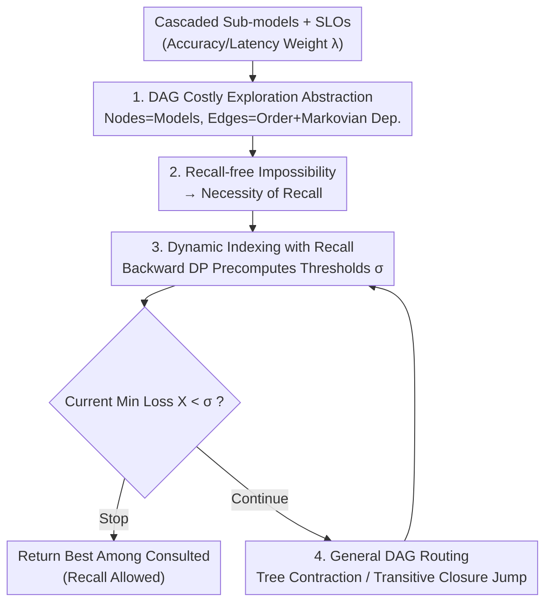

# T-Tamer: Provably Taming Trade-offs in ML Serving

**Conference**: ICLR 2026  
**OpenReview**: [https://openreview.net/forum?id=JFY9MZtWTu](https://openreview.net/forum?id=JFY9MZtWTu)  
**Area**: Learning Theory / Model Serving / LLM Efficiency  
**Keywords**: Cascaded Inference, Early Exit, Costly Exploration, Dynamic Indexing, Optimal Stopping

## TL;DR
The trade-offs in cascaded/early-exit inference—specifically "when to exit and which sub-model to invoke"—are unified as a costly exploration problem on a DAG. It is proven that "recall" (the ability to revisit and select a previously examined model) is a necessary and sufficient condition for provable optimality: recall-free strategies cannot achieve even a constant approximation ratio, whereas a dynamic indexing strategy with recall achieves online optimality in polynomial time.

## Background & Motivation
**Background**: As models grow larger, relying on a single massive model for all requests is neither economical nor necessary. The mainstream approach is cascaded inference: maintaining a set of sub-models with varying complexities and adaptively invoking them based on query difficulty. Simple samples are handled by lightweight models, while complex ones trigger larger models to balance service-level objectives (SLOs) like accuracy, latency, and cost. Layer-wise early-exit in neural networks is a special case of this paradigm.

**Limitations of Prior Work**: Existing exit/routing strategies are almost entirely heuristic and manually designed for specific scenarios. The most typical is the confidence threshold method: exit if the current sub-model's prediction confidence exceeds a threshold. This leads to two fundamental issues: (1) poor generalization, where a strategy tuned for one scenario fails in another; and (2) sub-optimality, resulting in strategies that are either inefficient or lack provable performance guarantees.

**Key Challenge**: There is an inherent trade-off between accuracy and latency (as well as accuracy–cost and latency–throughput), but the community lacks a unified routing and termination strategy that is applicable across scenarios with theoretical guarantees. A gap exists between heuristic practices and theoretical assurances.

**Goal**: To provide a general, provable theoretical framework for dual-objective trade-offs in cascaded inference and implement it as a "plug-and-play" component decoupled from sub-model training.

**Key Insight**: The authors identify a critical phenomenon often ignored by heuristics: larger models are not always better; they may "over-think," producing worse predictions than intermediate models. This implies the monotonic assumption—that exiting only allows the use of the most complex model consulted so far—is flawed. One must allow "recalling" and selecting an earlier, better-performing model.

**Core Idea**: Rewrite "routing + termination + selection" as a Markovian costly exploration on a DAG and partition the policy space by "whether recall is allowed." It is proven that recall is necessary and sufficient for provable optimality.

## Method

### Overall Architecture
T-Tamer formalizes the decision process of cascaded inference as a **multi-stage decision process**: given a query, decide "when to exit" and "which model to consult." Its theoretical core abstracts this into costly exploration on a Directed Acyclic Graph (DAG), where nodes represent sub-models with an associated random loss $R_i=\lambda\ell_i$, and edges encode two types of information: (1) precedence constraints (must consult $v_i$ before $v_j$) and (2) performance dependence (losses of adjacent models satisfy Markovian conditional independence $\ell_i \perp \ell_k \mid \ell_j$). Traversing an edge incurs a cost $(1-\lambda)c(i,j)$.

Under this abstraction, the authors first provide a "negative" result: **recall-free strategies** (where one must use the last model consulted, e.g., confidence thresholds) cannot achieve any constant approximation ratio. This is an information-theoretic impossibility that cannot be bypassed by more computation. This **implies** recall must be permitted. Subsequently, the authors present a provably optimal **dynamic index** algorithm for **strategies with recall**: thresholds $\sigma$ for each state are pre-calculated offline using backward dynamic programming. Online, the current minimum loss $X$ is compared against $\sigma$ to decide whether to stop or continue. Upon stopping, the model with the minimum loss among all consulted is returned (the "recall"). Finally, dynamic indexing on a single path is generalized to general DAGs (trees, transitive closures of paths), maintaining optimality and polynomial-time complexity.

### Key Designs

**1. Abstracting Cascaded Inference as Dual-Objective Costly Exploration on DAGs**

Addressing the pain point that "existing strategies are fragmented and non-unified," the authors express all trade-offs as a provable optimization problem using an additive dual-objective. For a single query and model invocation, the goal is $\theta_\lambda(x)=\lambda\ell_1(x)+(1-\lambda)\ell_2(x)$, where $\lambda\in[0,1]$ is a tunable weight and $\ell_1, \ell_2$ are proxy losses for conflicting objectives (e.g., accuracy loss and latency cost). This additive form offers two benefits: (i) flexibility, allowing standard ML losses to be used directly; and (ii) stability, as $\theta_\lambda$ is always well-defined, unlike "subtraction" targets which can be ill-posed.

With inputs from a fixed distribution $\mathcal{D}$, sub-model losses follow a joint dependent distribution. T-Tamer maps losses to nodes and edges, reducing "routing + termination + selection" to Markovian costly exploration on a DAG: a policy $\pi$ starts from a virtual root $v_0$ and adaptively selects edges to explore successors, deciding to stop or continue at each step. The goal is to minimize the weighted sum of node and edge losses: $\mathbb{E}[\lambda\cdot f([\ell_i]_{i\in O(\pi)})+(1-\lambda)\sum_{e\in E(\pi)}c(e)]$. Without recall, $f$ is the loss of the last visited node; with recall, $f=\min_{i\in O(\pi)}\ell_{1,i}$. The authors focus on three common topologies: directed lines (sequential cascades), their transitive closures (skipping allowed), and directed trees (decision tree structures).

**2. Information-Theoretic Impossibility of Recall-free Strategies: Recall is "Necessary"**

Regarding mainstream heuristics like confidence thresholds, the authors prove fundamental flaws. On a single line, recall-free exploration degenerates into an optimal stopping problem with Markovian dependence (Problem 3.1): observe non-negative losses $R_1, \dots, R_n$ sequentially; after seeing $R_i$, either stop and pay $R_i$ or discard it irreversibly and continue. The benchmark is the offline optimal (prophet) $\mathrm{OPT}=\mathbb{E}[\min_i R_i]$.

**Theorem 3.4 (Recall-free Impossibility)**: For recall-free costly exploration, no algorithm can achieve a bounded $\alpha$-approximation ratio, even for $n=2$ and bounded distributions. The proof uses a simple counter-example: $R_1=1/\alpha^2$ (deterministic), $R_2=0$ with probability $1-1/\alpha$, and $R_2=1/\alpha$ with probability $1/\alpha$. Any algorithm's expected cost is exactly $1/\alpha^2$, while the prophet's $\mathrm{OPT}=\mathbb{E}[\min(R_1,R_2)]=\tfrac{1}{\alpha}\cdot\tfrac{1}{\alpha^2}=1/\alpha^3$. The ratio is $\alpha$, which can be arbitrarily large. The key is that the algorithm always sees the same $R_1$ and cannot distinguish if $R_2$ will be smaller, and because of no recall, it cannot "go back" to a better option. This limitation is information-theoretic, not computational (it is not NP-hard), and cannot be resolved by more compute. Since confidence thresholding is a recall-free strategy, this theorem directly reveals its fundamental upper bound.

**3. Dynamic Indexing with Recall: Recall is "Sufficient" and Polynomial-Time Optimal**

This is the core positive result. With recall, the two losses can no longer be collapsed: pay $R_i=\lambda\ell_i$ at nodes and $c_i:=(1-\lambda)c(i-1,i)$ for the edge leading to the current node. Upon stopping, the total cost is $\min_{k\in[i]}R_k+\sum_{j\in[i]}c_j$ (selecting the best from consulted, embodying recall). The authors discretize the continuous Markovian dependence (similar to grid search) and use the Bellman optimality principle to solve via backward DP from the last node:

$$\Phi(X,R_{i-1},i)=\min\Big\{X,\; c_i+\mathbb{E}_{R_i\mid R_{i-1}}\big[\Phi(\min\{X,R_i\},R_i,i+1)\big]\Big\}$$

The first term is immediate stopping; the second is continuing using the optimal stopping rule for remaining nodes. This leads to a clean conclusion: for a fixed $R_{i-1}$ and $i$, there exists a maximum value $X$ where the decision-maker is indifferent between stopping and continuing. This value is the **dynamic index** $\sigma$ (Def 4.4), defined as the smallest solution to:

$$\mathbb{E}\Big[\big(\sigma-\min_{j=i}^{\tau^*}R_j\big)_+-\sum_{j=i}^{\tau^*}c_j\Big]=0$$

The algorithm (Alg. 1) is simple: maintain the current minimum loss $X$. If $X > \sigma$, pay $c_i$ to check the next node and update $X$ and $\sigma$; stop when $X \le \sigma$ and return the best node found. **Theorem 4.5** proves the index is well-defined, independent of current $X$ (denoted $\sigma(R_i, i+1)$), and achieves online optimality. Preprocessing takes $O(n\cdot|V|^2T)$ time and $O(n|V|^2)$ space; inference takes $O(1)$ per node and $O(n)$ per sample—both optimal and efficient. The intuition: stop/continue decisions for each state $(X,R_i,i{+1})$ are pre-stored in a table, requiring only $O(1)$ lookup online.

**4. Generalizing to General DAGs: Directed Trees and Transitive Closures**

A single path only requires a "stop/continue" choice; general DAGs require an additional **routing decision** (which node to check next). For **directed trees** (e.g., cost-aware binary search, human-in-the-loop RLHF), the authors design a **tree contraction** process: subtrees with children consisting only of single nodes or paths are contracted into a single node while maintaining equivalent loss tables and distributions. This iterates until it collapses into a line for the dynamic index to be applied. DP requires merging information from all children. **Theorem 5.1** proves it remains optimal with $O(n\cdot|V|^2T)$ complexity. For **transitive closures of lines** (allowing skips to save evaluation costs), the difference lies in enumerating all possible next nodes when calculating equivalent losses. **Theorem 5.2** proves optimality with an extra factor of $n$ in preprocessing ($O(n^2\cdot|V|^2T)$). Together, these cover most common cascading topologies.

### Loss & Training
T-Tamer is entirely decoupled from sub-model training—it does not modify the models but fits the theoretically optimal solution using input-output pairs from all sub-models, making it a plug-and-play component. Two standard assumptions: (2.1) all losses are strictly positive and edge costs $c_j$ are input-independent constants; (2.2) inputs are i.i.d. from a fixed distribution. To accelerate $1000\times1000$ matrix multiplications, the authors introduce Soft State Aggregation (SSA) to cluster states into $q$ meta-states as approximate proxies.

## Key Experimental Results

### Main Results
The dynamic indexing strategy (RECALL / T-Tamer) was evaluated on real-world CV/NLP early-exit workloads against an offline early-exit baseline that does not update policies at runtime. Metrics include error rate $\mathrm{Err}=1-\mathrm{Acc}$ (Acc bounded by backbone output) and latency normalized to the original backbone.

| Task | Backbone / Data | T-Tamer Performance |
|------|------------|--------------|
| Vision Classification | VGG-11/13, Video (Auburn/Oxford) | ~50% latency saved at ~95% Acc; e.g., VGG-13 Auburn latency reduced to 45% with <7% accuracy loss |
| NLP Classification | GPT-2/BERT (IMDB/Amazon) | ~90% latency saved at ~75% Acc |

| Baseline | Type | Comparison with T-Tamer |
|------|------|----------------|
| 1-Thr. (Confidence Threshold) | Score-based (Recall-free) | T-Tamer consistently superior in high-accuracy regimes; matches on GPT-2, slightly behind (<10%) in low-accuracy BERT regimes |
| Patience (K=1/K=2) | Rule-based (Exit after K consistent) | T-Tamer consistently outperforms across all NLP workloads |

### Ablation Study

| Configuration | Key Observation | Description |
|------|---------|------|
| BERT + 1-Thr. | Pareto front violates monotonicity | Deeper exits are not always better ("over-thinking"), validating the necessity of recall |
| SSA, $q>100$ | Accuracy within ±0.02 of exact matrix | Almost matches exact version at $q\approx300$ |
| SSA, $q=50{\sim}800$ | Accuracy stable w.r.t. meta-state count | SSA is an efficient proxy for large transition matrices |

### Key Findings
- **Value of Recall is most intuitive on BERT**: The Pareto front of 1-thresholding is non-monotonic, refuting the assumption that "deeper is always better." Allowing recall provides more effective signals, directly supporting the motivation for provable guarantees via recall.
- **High-accuracy regime is T-Tamer's forte**: It consistently hits the optimal points in these regions, which are precisely what actual services care about and where heuristics often fail.
- **SSA enables scalability**: Compressing $1000\times1000$ transition matrices into a few hundred meta-states results in negligible accuracy loss, making dynamic indexing computable even for large support sets.

## Highlights & Insights
- **"Recall = Necessary & Sufficient" is a clean dichotomy**: Using a unified costly exploration abstraction, the authors prove constant approximation is impossible without recall (necessity) while providing a polynomial-time optimal algorithm with recall (sufficiency), elevating an engineering phenomenon (thresholding limits) into an information-theoretic conclusion.
- **Bridging Cascaded Inference to Pandora's Box / Optimal Stopping**: The authors explicitly identify this work as a minimization version of the Markovian Pandora's Box, connecting ML serving with TCS costly exploration literature and reusing existing tools (dynamic indexing, DP).
- **Dynamic indices can be pre-stored as tables**: The $O(1)$ per-node online characteristic allows for true plug-and-play deployment.
- **Portability**: The DAG + Markovian dependence + Dynamic Indexing framework can be applied to any scenario involving "progressive exploration with costs and the ability to select the historical best" (e.g., cost-aware binary search, RLHF feedback, crowdsourcing).

## Limitations & Future Work
- **Strong Assumptions**: Edge costs $c_j$ are assumed to be input-independent constants, losses are strictly positive, and adjacent models satisfy Markovian independence. In real systems, latency depends on input and load, and dependence structures may not be Markovian.
- **Discretization Dependence**: Continuous Markovian distributions must be quantized to a discrete support $V$. $|V|$ enters the complexity as a squared term; very large supports may be challenging even with SSA.
- **Limited Topology Coverage**: Theoretical guarantees cover only directed lines, their transitive closures, and directed trees. More general DAGs (arbitrary skip-connections, multi-in-degree merges) remain unsolved for polynomial-time optimality.
- **Scale of Experiments**: Backbones are limited to early-exit versions of VGG / GPT-2 / BERT; not yet validated on large-scale LLM cascades or inter-model cascades. Comparison with strong runtime-adaptive baselines is limited.

## Related Work & Insights
- **vs. Confidence Thresholding / Early-Exit (Xin et al., Teerapittayanon et al.)**: These are recall-free; this paper proves they cannot achieve constant approximations. T-Tamer achieves online optimality via recall and dynamic indexing, serving as a "theoretical verdict + alternative" for these heuristics.
- **vs. Patience Method (Zhou et al.)**: Patience relies on "K consistent predictions" for exiting. T-Tamer consistently outperforms it on NLP workloads with provable guarantees.
- **vs. Pandora's Box / Costly Exploration (TCS Line)**: This paper is a minimization/ML systems perspective version of Markovian Pandora's Box, applying classic optimal stopping/search theory to cascaded inference.
- **vs. Inter-model Cascading (Varshney & Baral, Lebovitz et al.)**: Those explore joint training and system constraints but lack guarantees. T-Tamer fills the gap for "provably efficient routing and termination."

## Rating
- **Novelty**: ⭐⭐⭐⭐⭐ Refining cascaded inference trade-offs into DAG costly exploration and proving "Recall is necessary & sufficient" is a fresh perspective.
- **Experimental Thoroughness**: ⭐⭐⭐ Validates core claims (superiority in high-accuracy regimes, necessity of recall, SSA effectiveness), but the scale of backbones is small.
- **Writing Quality**: ⭐⭐⭐⭐ Clear theoretical narrative; problem formulation, theorems, and algorithms proceed logically.
- **Value**: ⭐⭐⭐⭐ Provides a rare provable theoretical foundation for early-exit/cascaded inference, guiding more reliable service policy designs.

<!-- RELATED:START -->

## Related Papers

- [\[ICLR 2026\] How hard is learning to cut? Trade-offs and sample complexity](how_hard_is_learning_to_cut_trade-offs_and_sample_complexity.md)
- [\[ICLR 2026\] Nonparametric Contextual Online Bilateral Trade](nonparametric_contextual_online_bilateral_trade.md)
- [\[ICLR 2026\] SVD Provably Denoises Nearest Neighbor Data](svd_provably_denoises_nearest_neighbor_data.md)
- [\[ICML 2025\] Near-Optimal Consistency-Robustness Trade-Offs for Learning-Augmented Online Knapsack Problems](../../ICML2025/learning_theory/near-optimal_consistency-robustness_trade-offs_for_learning-augmented_online_kna.md)
- [\[ICLR 2026\] Two-Layer Convolutional Autoencoders Trained on Normal Data Provably Detect Unseen Anomalies](two-layer_convolutional_autoencoders_trained_on_normal_data_provably_detect_unse.md)

<!-- RELATED:END -->
