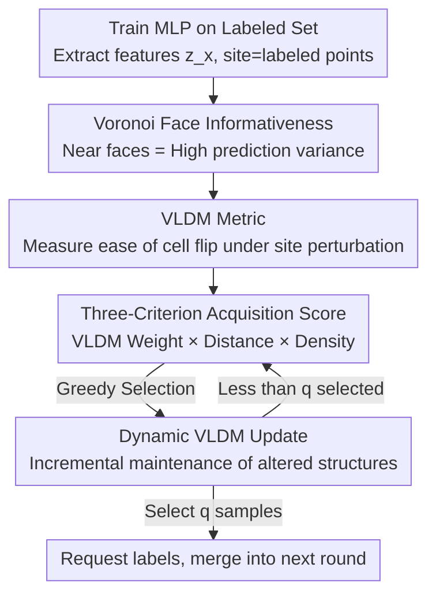

# TESSAR: Geometry-Aware Active Regression via Dynamic Voronoi Tessellation

**Conference**: ICLR 2026  
**OpenReview**: [https://openreview.net/forum?id=mhfbu9von5](https://openreview.net/forum?id=mhfbu9von5)  
**Area**: Active Learning / Regression Theory  
**Keywords**: Active Learning, Regression, Voronoi Tessellation, Geometric Sampling, Prediction Variance

## TL;DR
For active learning in regression tasks, this paper proposes using the geometric structure of Voronoi tessellation to select samples. The core is VLDM (Voronoi-based Least Disagree Metric), which measures how easily a sample's "Voronoi cell membership" flips after perturbing labeled sites, thereby locating high-variance interior regions. By compounding this with a distance term (covering the periphery) and a density term (reflecting representativeness), the three factors form the TESSAR acquisition score, which achieves or exceeds current state-of-the-art results on 14 tabular regression benchmarks.

## Background & Motivation

**Background**: Active learning reduces costs by requesting labels only for the "most informative" samples. In classification, this is intuitive—highly informative samples often lie near decision boundaries where uncertainty is highest. Consequently, strategies based on uncertainty sampling or query-by-committee have been highly successful.

**Limitations of Prior Work**: However, regression lacks the concept of "decision boundaries." All labeled samples influence the model globally rather than through local decision boundaries; thus, informativeness is dispersed throughout the data space. A common practice in active learning for regression is distance-based sampling—selecting samples farthest from labeled points to promote diversity and coverage. The problem is that distance sampling is **overly biased toward the periphery**: marginal points are inherently far from all labeled points and receive naturally high scores, leading to repeated sampling. Conversely, dense interior regions sandwiched between multiple labeled points are ignored, despite having significant informativeness.

**Key Challenge**: Regression active learning must simultaneously account for three factors: informativeness, diversity, and representativity. Distance sampling only addresses "diversity/peripheral coverage" and is largely ineffective for "interior informativeness." Existing density correction methods (such as cluster-based LCMD) offer only limited control over interior exploration, and cluster centroids may not necessarily align with truly informative locations.

**Goal**: To identify a geometric mechanism that can actively locate **interior** regions where the influences of multiple labeled points intersect and compete, and to unify this with peripheral coverage and density representativeness into a single acquisition criterion.

**Key Insight**: The authors leverage Voronoi tessellation—partitioning the input space into cells centered at each labeled point (site). The boundaries between cells are called Voronoi faces. Points on a Voronoi face are equidistant to at least two sites, meaning no single labeled point "dominates" their local geometry. The authors' key observation is that points near these faces fall exactly within interior regions and play a role similar to decision boundaries in classification-based "disagreement sampling." While classification assumes samples that flip labels under slight perturbations are most informative, the same logic applies in regression for samples that flip their cell assignment under site perturbations.

**Core Idea**: Use the "ease of flipping Voronoi cell membership under site perturbation" as a regression-based uncertainty measure (VLDM). By multiplying this with distance and density terms, a combined acquisition score is formed that covers the interior, periphery, and representativeness simultaneously.

## Method

### Overall Architecture

TESSAR (TESsellation-based Sampling for Active Regression) is an iterative active learning loop. In each round $t$: a 2-layer MLP is trained on the labeled set $L_t$, and its final layer representation $z_x$ is used to map unlabeled pool samples $P \subseteq U_t$ into feature space; features of labeled samples serve as the Voronoi site set $S^{(0)}$. For each candidate $x$ in the pool, the VLDM value $L_x$ (measuring interior informativeness) is estimated via perturbation, alongside its distance to the nearest site $D_x$ (measuring the periphery) and the density score $S_x$ of its Voronoi cell (measuring representativeness). These three are multiplied to obtain the acquisition score, and a sample is selected greedily. Since selecting a sample alters the Voronoi structure, TESSAR employs a **dynamic update** subroutine to maintain these values incrementally rather than recalculating from scratch, reducing the computational overhead within a batch. Once $q$ samples are selected, labels are requested, they are merged into $L_{t+1}$, and the process enters the next round.

### Key Designs

**1. Informativeness of Voronoi Faces: Linking "Proximity to Faces" and "High Uncertainty" via Variance Upper Bounds**

Beyond the geometric diversity of samples near faces, this paper provides theoretical support demonstrating their inherent uncertainty. Assume the trained predictor $\hat f$ and the true function $f^\star$ are both $L$-Lipschitz, noise is zero-mean, and a high-probability "good event" ensures $|\hat f(\tilde x_k) - f^\star(\tilde x_k)| \le \epsilon$ (where statistical error $\epsilon$ decays with the number of labels as $|S|^{-\beta}$ and can be considered small). For any unlabeled point $x'$ and site $\tilde x_k$, using the triangle inequality and Lipschitz property:

$$\big|\hat f(x') - f^\star(x')\big| \le 2L\|x' - \tilde x_k\|_2 + \epsilon,$$

By Popoviciu's inequality:

$$\mathrm{Var}[\hat f(x')] \le \big(2L\|x' - \tilde x_k\|_2 + \epsilon\big)^2.$$

Since $\epsilon$ does not depend on $k$, taking the minimum over all sites shows that the prediction variance at $x'$ is controlled by the "distance to the nearest site." To maximize variance (i.e., uncertainty), one should select points that are **not close to any site**—which are precisely points near Voronoi faces. Each Voronoi cell can be seen as a region where labels vary within bounded limits; points on the face are where these bounded variations are shared by multiple sites. A slight movement of a site may cause Voronoi partitioning to assign these points to a different cell. This "instability" corresponds to disagreement-based sampling in classification—while regression has no discrete boundaries, Voronoi faces play an equivalent role.

**2. VLDM: Replacing Explicit Face Distance with "Ease of Cell Membership Flip Under Perturbation"**

Directly determining how close a point is to a Voronoi face requires constructing a Voronoi diagram, which has a complexity of $O(S\log S + S^{\lfloor d/2\rfloor})$ for $S$ sites in $\mathbb R^d$, making it infeasible in high dimensions. The authors avoid explicit construction by proposing VLDM as a proxy. Each site configuration $S$ is associated with a Voronoi hypothesis $h_S(x) := \arg\min_{k} \|z_x - z_{\tilde x_k}\|_2$ (labeling $x$ with the index of its nearest site). Disagreement between two hypotheses is measured by $\rho(h_{S'}, h_S) = \Pr_{X}(h_S(X) \ne h_{S'}(X))$. VLDM is defined as the minimum disagreement from the original hypothesis among all hypotheses that assign $x_0$ to a different cell:

$$L(h_S, x_0) := \inf_{h_{S'} \in H_{h_S, x_0}} \rho(h_{S'}, h_S),$$

where $H_{h_S,x_0} = \{h_{S'} : h_S(x_0) \ne h_{S'}(x_0)\}$. The intuition is: if only a small perturbation of sites is needed to flip the membership of $x_0$, then $x_0$ must be near a face, resulting in a low VLDM and high informativeness. Conversely, points deep inside a cell require large perturbations to flip, resulting in a high VLDM. Leveraging the property that Voronoi cells change slightly under small perturbations (stability in the Hausdorff sense), site labels remain largely unchanged, eliminating the need to explicitly solve for the alignment permutation $\pi_{S,S'}$.

Practical computation uses two layers of approximation (following Cho et al. 2024): ① Replacing the infinite set with a finite number of perturbed hypotheses—adding Gaussian noise $z_{\tilde x'} \sim \mathcal N(z_{\tilde x}, \sigma_v^2 I)$ to site features to obtain perturbed configurations $S'$. Any configuration that flips $x_0$'s membership is included as a candidate. Multiple variance scales $\{\sigma_v^2\}$ allow VLDM to capture flipping difficulty across different perturbation magnitudes. ② Estimating $\rho$ using $M$ Monte Carlo samples: $\rho_M(h_{S'}, h_S) = \frac1M \sum_i \mathbb I[h_{S'}(X_i) \ne h_S(X_i)]$. Empirically, VLDM decreases monotonically as the number of perturbations $N$ increases but **maintains rank order**, making it reliable for sample ranking.

**3. Three-Criterion Acquisition Score: Unifying Interior, Periphery, and Representativeness**

VLDM alone covers the interior, and distance alone covers the periphery. The authors multiply three geometric criteria. The first is a weight derived from VLDM, giving exponentially higher weight to samples with low VLDM (near faces):

$$\gamma_x = \frac{e^{-\eta_x}}{\sum_{x_j \in P} e^{-\eta_{x_j}}}, \quad \eta_x = \frac{(L_x - L_q)_+}{L_q},$$

where $L_q$ is the $q$-th smallest VLDM value in the pool and $(\cdot)_+ = \max\{0,\cdot\}$. The second is DIST—the shortest feature distance from a sample to any site $D_x = \min_{\tilde x \in S} \|z_x - z_{\tilde x}\|_2$, encouraging exploration of under-sampled peripheral areas. The third is BIN—a representativeness score:

$$S_x = \sum_{x' \in P:\, h_S(x') = h_S(x)} D_{x'}^2,$$

which is shared among all samples in the same Voronoi cell, reflecting the local density (the larger the sum of distances within a cell, the denser or more distributionally important the area), thereby aligning the query strategy with the underlying data distribution. The final acquisition score is the product $\gamma_x \cdot D_x^{(0)} \cdot S_x$, selected greedily. Using multiplication rather than addition ensures a selected sample must be **simultaneously** informative, spatially diverse, and representative—any low value in one category suppresses the overall score. This is a fundamental difference from LCMD, which uses clustering peaks that often select points on the outer edges of clusters; VLDM specifically targets Voronoi faces and avoids regions where "outer boundaries have no face," reliably directing sampling toward the informative interior.

**4. Dynamic Update of VLDM: Incremental Batch Maintenance**

In batch sampling, every newly selected sample changes the Voronoi structure, shifting face positions and VLDM values. Recalculating VLDM from scratch for each selection requires $N\cdot|P|\cdot q\cdot(|L| + (q+1)/2)$ distance calculations, which is costly. TESSAR’s UPDATEVLDM subroutine adopts an incremental strategy: first, distances from all pool samples to initial sites are calculated. Subsequently, for each newly selected sample $\tilde x_{new}$, only distances involving this new site (and its perturbed copies) are updated. The distance from the new site to pool data is compared with existing minimum distances to update the nearest distance $D_x^{(n)}$ and corresponding cell index $K_x^{(n)}$. If a cell index change occurs under any perturbation configuration ($K_x^{(n)} \ne K_x^{(0)}$), $L_x$ is refreshed accordingly. This reduces the total computation to $O(N\cdot|P|\cdot(|L|+q))$, effectively removing a factor of $q$. The authors also note that a "margin variant" (using the distance difference between the first and second nearest Voronoi centers) is cheaper but significantly weaker than the VLDM version, and a static variant without updates also shows substantial performance drops—validating the necessity of dynamic maintenance.

### Loss & Training
TESSAR itself does not modify the regression model's training objective—it standardly trains a 2-layer MLP with 512 hidden units on the current labeled set in each round. The innovation lies entirely in "which samples to label." Key hyperparameters include the number of perturbation variance scales $V$, the number of perturbation configurations $N$, the number of Monte Carlo samples $M$, and the per-round query size $q$.

## Key Experimental Results

Experiments were conducted on 14 tabular regression datasets using a 2-layer 512-unit MLP, with results averaged over 20 runs.

### Main Results

The table below shows the RMSE difference relative to Random (averaged over all steps); negative values indicate better performance than random sampling. Bold-underlined indicates the best; bold indicates the second best (selected from Table 1 of the paper).

| Dataset | TESSAR | LCMD | BADGE | BAIT | Coreset |
|--------|--------|------|-------|------|---------|
| CT slices | **-0.0679** | **-0.0679** | -0.0395 | -0.0565 | -0.0504 |
| KEGG undir | **-0.1615** | -0.1598 | -0.1297 | -0.1214 | -0.1435 |
| MLR kNN | **-0.1201** | -0.1182 | -0.0925 | -0.0872 | -0.0192 |
| Online video | **-0.1183** | -0.1130 | -0.0991 | -0.0946 | -0.1000 |
| Protein | **-0.0082** | -0.0054 | -0.0075 | 0.0016 | 0.0110 |
| SARCOS | **-0.0215** | -0.0188 | -0.0133 | -0.0149 | -0.0080 |

Overall, TESSAR achieves the best or second-best performance on most datasets, demonstrating stable and comprehensive leadership. The closest competitor is LCMD, which is also based on diversity/density. In performance profile comparisons, TESSAR maintains the highest $R_A(\delta)$ across all $\delta$, with $R_{\text{TESSAR}}(0) = 41\%$, significantly higher than LCMD's $29\%$. The penalty matrix shows TESSAR's row outperforms all others, with a maximum penalty relative to TESSAR of only 0.3.

### Ablation Study

The table below shows the effects of different combinations of VLDM ($\gamma_x$), DIST ($D_x$), and BIN ($S_x$) criteria (qualitative conclusions based on log-RMSE for Protein/Road/Stock):

| Configuration | Effect | Explanation |
|------|------|------|
| VLDM only | Limited gain | Only covers interior face regions |
| DIST only | Limited gain | Only covers the periphery |
| VLDM + DIST | Significant gain | Interior + periphery complementarity; the primary source of improvement |
| VLDM + DIST + BIN (Full) | Best | Adds density alignment; further improves sampling in dense regions |

### Key Findings
- **Complementarity is Core**: VLDM and DIST each cover only a subset of the input space when used alone, yielding limited gains. Their combination (interior via VLDM, periphery via DIST) leads to a significant performance jump, showing that the "interior + periphery" geometric complementarity is the main driver of TESSAR.
- **BIN as the Finishing Touch**: Adding the density term BIN onto VLDM+DIST further aligns sampling with dense areas of the data distribution, providing additional but relatively minor improvements.
- **Stable VLDM Ranking**: Empirical evidence shows VLDM decreases monotonically with higher $N$ while maintaining rank order, ensuring that ranking for sample selection is reliable even with approximate computation.
- **Dynamic Updates are Necessary**: Both the margin variant and the static variant perform significantly worse than the full dynamic VLDM-TESSAR, verifying the necessity of maintaining the Voronoi structure within a batch.

## Highlights & Insights
- **Geometric Migration of Classification "Disagreement Sampling" to Regression**: In classification, samples where "hypotheses flip labels" are considered informative. This paper uses "sites where perturbation flips Voronoi cell membership" to find the regression equivalent. VLDM quantifies this intuition into a computable metric, representing an elegant cross-task migration.
- **Alignment of Theory and Acquisition Criteria**: Proving "far from sites ⇒ high prediction variance" using Lipschitzness + Popoviciu's inequality provides a variance-based justification for "selecting points near Voronoi faces." The theory serves as the design basis rather than just decoration.
- **Multiplicative Multi-Criterion Fusion**: Multiplying informativeness, diversity, and representativity instead of a weighted sum forces selected samples to excel in all three—any weakness is penalized. This "bottleneck-suppression" fusion can be migrated to other multi-criteria acquisition scenarios.
- **Avoiding Voronoi Construction**: Using perturbations and cell membership flips to estimate face proximity avoids the $O(S^{\lfloor d/2\rfloor})$ complexity of high-dimensional Voronoi construction, a key engineering insight for enabling geometric methods.

## Limitations & Future Work
- **Still Computationally Expensive**: Despite dynamic updates saving a factor of $q$, runtime still grows linearly with the perturbation budget $N$ and pool size $|P|$. Further optimization for large-scale scenarios is needed; the authors list more scalable TESSAR variants as a priority.
- **Homoskedastic Assumption**: The method implicitly assumes homoskedastic noise, which the variance upper bound derivation depends on. Whether Voronoi-style principles hold in heteroskedastic settings remains an open question.
- **Validated Only on Tabular Data**: All experiments focus on 14 tabular regression benchmarks with 2-layer MLPs. The effectiveness of VLDM's geometric intuition in image or higher-dimensional deep regression has not been tested, leaving generalizability unverified.
- **Feature Space Dependence**: Voronoi cells are defined in the network's final layer representation. The effectiveness of the geometric mechanism depends on the quality of these features; if features are poor, the "informativeness" of faces is weakened (a point the authors do not discuss in depth).

## Related Work & Insights
- **vs LCMD (Holzmüller et al., 2023)**: Both use diversity + density components, but LCMD is cluster-based and tends to select points at cluster peripheries. VLDM in TESSAR targets Voronoi faces (interior), avoiding the "no face at external boundaries" degradation and reliably directing sampling to informative interior regions—this is the fundamental difference from the strongest baseline.
- **vs Distance/Greedy Sampling (Wu et al., 2019; Coreset)**: These promote peripheral coverage and diversity but over-sample the periphery and ignore the interior. TESSAR retains the distance term as one of its three criteria while using VLDM to fill the interior informative gap.
- **vs LDM-S and other Classification Disagreement Methods (Cho et al., 2024)**: Classification versions rely on label-defined decision boundaries and require supervision. TESSAR relies purely on geometric relationships between input instances (Voronoi faces) and requires no label boundaries, making it naturally suited for regression.
- **vs QBC / Model Change Methods**: These depend on ensemble prediction disagreement or gradient-estimated model changes, requiring repeated training and high costs. TESSAR uses a single model + geometric metrics, avoiding ensemble costs.

## Rating
- Novelty: ⭐⭐⭐⭐⭐ Bringing Voronoi tessellation + disagreement sampling intuition to active regression is groundbreaking; VLDM is an original and theoretically grounded geometric uncertainty metric.
- Experimental Thoroughness: ⭐⭐⭐⭐ 14 datasets + 20 repetitions + performance profile/penalty matrix comparison; 3-criterion ablation is solid. Limited to tabular data; lacks high-dimensional deep regression validation.
- Writing Quality: ⭐⭐⭐⭐ Theory-intuition-algorithm progression is logical; figures are clear. Some approximation details and hyperparameter sensitivity discussions are slightly brief.
- Value: ⭐⭐⭐⭐ Provides a unified geometric framework for interior/periphery/representativeness in active regression; the mindset is transferable to geometric sampling in semi-supervised/pseudo-labeling settings.

<!-- RELATED:START -->

## Related Papers

- [\[ICLR 2026\] Characterizing the Discrete Geometry of ReLU Networks](characterizing_the_discrete_geometry_of_relu_networks.md)
- [\[ICLR 2026\] Data-Aware and Scalable Sensitivity Analysis for Decision Tree Ensembles](data-aware_and_scalable_sensitivity_analysis_for_decision_tree_ensembles.md)
- [\[ICLR 2026\] Beyond Spectra: Eigenvector Overlaps in Loss Geometry](beyond_spectra_eigenvector_overlaps_in_loss_geometry.md)
- [\[ICLR 2026\] Splat Regression Models](splat_regression_models.md)
- [\[ICLR 2026\] Revisiting Active Sequential Prediction-Powered Mean Estimation](revisiting_active_sequential_prediction-powered_mean_estimation.md)

<!-- RELATED:END -->
