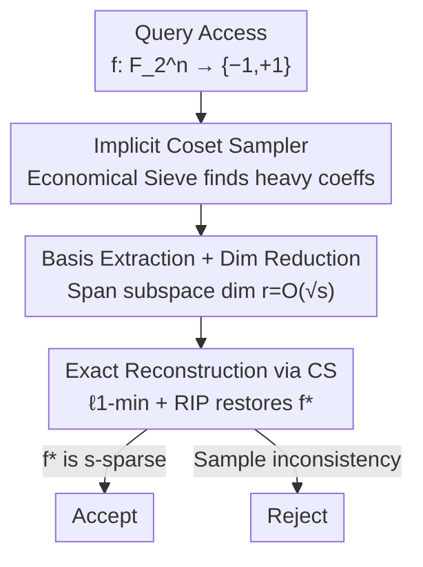

# Testing Fourier Sparsity via Implicit Sensing

**Conference**: ICLR 2026  
**OpenReview**: [https://openreview.net/forum?id=upsp6XeJpN](https://openreview.net/forum?id=upsp6XeJpN)  
**Code**: None  
**Area**: Learning Theory / Sparse Fourier / Property Testing  
**Keywords**: Fourier Sparsity, Property Testing, Compressed Sensing, Communication Complexity, Boolean Functions

## TL;DR
This paper investigates the property testing problem of whether a Boolean function is Fourier sparse. Given query access to $f:\mathbb{F}_2^n\to\{-1,+1\}$, the goal is to determine if $f$ is $s$-Fourier sparse or far from any $s$-sparse function in Hamming distance. The authors provide a non-adaptive tester with query complexity $\tilde O(s^4)$ (independent of dimension $n$) and prove a lower bound of $\Omega(s)$. Both results significantly improve the $\tilde O(s^{14})$ upper bound and $\Omega(\sqrt s)$ lower bound established by Gopalan et al. (2011).

## Background & Motivation

**Background**: Boolean functions are central objects in machine learning and theoretical computer science. **Fourier sparsity**—the number of non-zero coefficients in the Fourier expansion—is a natural measure of structural simplicity. For $f:\mathbb{F}_2^n\to\{-1,+1\}$, its expansion is $f(x)=\sum_{\alpha\in\mathbb{F}_2^n}\hat f(\alpha)\chi_\alpha(x)$, where $\chi_\alpha(x)=(-1)^{\langle x,\alpha\rangle}$. $f$ is $s$-Fourier sparse if $|\mathrm{supp}(\hat f)|\le s$. Learning such functions has been a core problem for decades, primarily through sparse Hadamard transforms and compressed sensing.

**Limitations of Prior Work**: Existing exact reconstruction algorithms almost always **assume the sparsity $s$ is known a priori**, which is often not the case in practice. More importantly, compressed sensing based on $\ell_1$-minimization **only succeeds when the function is truly (or very close to) $s$-sparse**—usually requiring the Hamming distance to the nearest $s$-sparse function to be as small as $o(1/s)$. Consequently, "testing Fourier sparsity" becomes a necessary independent precursor to reconstruction.

**Key Challenge**: Testing sparsity under **Hamming distance** is significantly harder than under Euclidean ($\ell_2$) distance. While $\ell_2$ versions (Yaroslavtsev & Zhou 2020; Ghosh & Roy 2025) can be solved with $\tilde O(s)$ queries, they accept two types of functions: "clean" functions with exactly $k$ large coefficients, and functions that have $k$ large coefficients but **also a long tail of small coefficients**. A Hamming distance tester must **only accept the former**, requiring it to confirm both the presence of $k$ heavy coefficients and the **absence of a Fourier tail**, which is inherently more difficult. This explains why the Hamming tester by Gopalan et al. (2011) has a high complexity of $\tilde O(s^{14})$.

**Goal**: To lower the upper bound from $\tilde O(s^{14})$ and raise the lower bound from $\Omega(\sqrt s)$ under Hamming distance, narrowing the gap while ensuring the upper bound is **independent of the ambient dimension $n$**.

**Key Insight & Core Idea**: While Gopalan et al. used a "hashing to locate heavy coefficients" approach, this work adopts the **testing-via-implicit-learning** paradigm—reducing sparsity testing to **reconstructing a compressed low-dimensional version of the function**. By using a structural theorem from Sanyal (2019) to compress the $n$-dimensional problem to $O(\sqrt s)$ dimensions, and then using compressed sensing for exact reconstruction, the dependence on $n$ is eliminated. The lower bound is achieved by **reduction to communication complexity** via the approximate matrix rank problem, utilizing the Fourier structure of cryptographic hard functions to reach $\Omega(s)$.

## Method

### Overall Architecture

This is a theoretical paper consisting of two independent technical threads: the **upper bound** (designing an efficient tester) and the **lower bound** (proving the inherent query cost).

The upper bound tester follows a clear pipeline. Intuitively, for an $s$-Fourier sparse function, the non-zero coefficients are not scattered across the entire $n$-dimensional space. Sanyal (2019) proved that the linear subspace spanned by these coefficients has dimension at most $O(\sqrt s)$. Thus, every $s$-sparse function can be written as $f=f^\ast\circ L$, where $L:\mathbb{F}_2^n\to\mathbb{F}_2^r$ is a linear map and $r=O(\sqrt s)$. The tester implicitly reconstructs this low-dimensional "sketch" $f^\ast$ and verifies its sparsity: query $f$ $\to$ use Economical Sieve to implicitly find all "heavy" coefficients $\to$ extract the basis of their span (dimension $r$) $\to$ generate uniform samples of $f^\ast$ via coset sampling $\to$ exactly reconstruct the spectrum of $f^\ast$ using $\ell_1$-minimization.

The lower bound side uses combinatorial-algebraic arguments: it employs Maiorana–McFarland functions and treats "checking if $f$ is $s$-sparse" as "checking if the rank of the sum of two matrices is $r$ or $r/4$," utilizing the known $\Omega(r^2)$ communication complexity bound.

### Key Designs

**1. Implicit Learning + Dimension Reduction: Compressing $n$-dim Testing to $O(\sqrt s)$-dim Reconstruction**

A direct $\ell_1$-minimization reconstruction of an $s$-sparse function requires $O(s\log^2 s\cdot n)$ uniform random samples, which **scales linearly with dimension $n$**. Property testing, however, seeks $n$-independent complexity. The authors eliminate $n$ using two components. First, Sanyal's theorem reduces the problem to $f=f^\ast\circ L$ where $f^\ast:\mathbb{F}_2^r\to\{-1,+1\}$ and $r=O(\sqrt s)$. Second, the RIP (Restricted Isometry Property) results from Haviv & Regev (2017) show that $f^\ast$ can be **exactly** recovered with $O(s^{3/2}\log^2 s)$ random samples using an $\ell_1$-minimization approach that **no longer depends on $n$**. This differs from standard junta testing as Fourier sparse functions are strictly broader than juntas.

**2. Implicit Coset Sampler: Generating Uniform Samples from $f\circ A$ with Minimal Queries**

To reduce dimensions, one must "see" heavy coefficients, which are hidden in $f$'s queries. The authors designed the Implicit Coset Sampler (Algorithm 3), generalizing the junta extractor of Chakraborty et al. (2011). It uses the **Economical Sieve** (Datta et al., 2026), which requires $\tilde O\!\big(\max\{1/\theta^4,\,\lambda/\theta^2\}\big)$ queries to output a matrix $Q$ representing heavy coefficients. While the explicit coordinates of these coefficients $\alpha$ remain unknown, the values of $Q$'s columns on random points reveal their linear dependencies. By extracting a basis for the span of heavy coefficients and using coset sampling, the tester generates uniform samples on $\mathbb{F}_2^r$. With threshold $\theta=\Theta(1/s)$ and samples $\lambda=\max\{1/\varepsilon,\tilde O(s^2)\}$, the total query complexity is:

$$\tilde O\!\left(\frac{1}{\theta^4}+\max\!\Big\{\frac{1}{\theta^2},\lambda\Big\}\cdot\frac{1}{\theta^2}\right)=\tilde O\!\Big(s^4+\max\{s^2,1/\varepsilon\}\cdot s^2\Big),$$

resulting in the overall $\tilde O(s^4)$ upper bound.

**3. Communication Complexity Reduction: Forcing the $\Omega(s)$ Lower Bound**

The authors reduce the testing problem to the **approximate matrix rank problem** in communication complexity. Alice and Bob hold matrices $A, B \in \mathbb{F}_2^{r \times r}$ with the promise that $\mathrm{rank}(A+B) \in \{r, r/4\}$. Sherstov & Storozhenko (2024) proved the communication complexity for this is $\Omega(r^2)$. By constructing $f=f_{A+B}$ using Maiorana–McFarland functions, the Fourier sparsity is tied to the rank. If $\mathrm{rank}(A+B)=r$, sparsity is $r^2$; if $r/4$, sparsity is at most $r^2/4$. Since a tester with $q(s, 1/4)$ queries would imply a protocol with $2q$ bits of communication, the $\Omega(r^2)$ bound forces $q(s, 1/4) = \Omega(s)$.

## Key Experimental Results

As a theoretical work, there are **no empirical experiments**. Contributions are presented as theorems.

### Main Results: Query Complexity Comparison

| Problem / Metric | Upper Bound | Lower Bound | Source |
|------------|------|------|------|
| Fourier Sparsity Testing (Hamming) | $\tilde O(s^{14})$ | $\Omega(\sqrt s)$ | Gopalan et al. (2011) |
| Fourier Sparsity Testing (Hamming) | $\tilde O(s^{4})$ | $\Omega(s)$ | **Ours** |
| Fourier Sparsity Testing (Euclidean $\ell_2$) | $\tilde O(s)$ | $\Omega(s)$ | Ghosh & Roy (2025) |

The upper bound is more precisely $\tilde O\big(\max\{s^2,1/\varepsilon\}\cdot s^2\big)$ and is **independent of $n$**.

### Key Technical Indicators

| Stage | Key Value | Function |
|------|--------|------|
| Sanyal (2019) Reduction | Dimension $r=O(\sqrt s)$ | Compresses $n$-dim problem |
| Naive $\ell_1$ Reconstruction | $O(s\log^2 s\cdot n)$ samples | Dependent on $n$ (unused) |
| RIP Reconstruction | $O(s^{3/2}\log^2 s)$ samples | $n$-independent |
| Economical Sieve | $\tilde O(\max\{1/\theta^4,\lambda/\theta^2\})$ queries | Implicitly retrieves heavy coeffs |

### Key Findings
- **Dimension independence stems from dimension reduction**: The primary lever for removing $n$-dependence is Sanyal's $O(\sqrt s)$ subspace theorem rather than the sampling technique itself.
- **Hamming vs. Euclidean gap**: The necessity to reject "small coefficient tails" accounts for the complexity gap between the Hamming tester ($\tilde O(s^4)$) and the $\ell_2$ tester ($\tilde O(s)$).
- **Lower bound proof**: Cryptographic Maiorana–McFarland functions serve as effective "adversarial instances" for sparsity testing.

## Highlights & Insights
- **"Implicit Sensing" is literal**: The tester never explicitly obtains any Fourier coefficient. It only infers linear relationships between heavy coefficients, effectively transforming "reconstructing the spectrum" into "sensing the subspace structure."
- **Coupling Property Testing with Compressed Sensing**: The combination of Sanyal's reduction, Haviv-Regev's RIP, and $\ell_1$-minimization provides a robust, dimension-independent reconstruction paradigm.
- **Lower Bounds via Matrix Rank**: Linking Fourier sparsity to the rank of matrix sums allows the use of mature results from communication complexity to establish strong lower bounds.

## Limitations & Future Work
- **Polynomial Gap**: There remains a gap between $\Omega(s)$ and $\tilde O(s^4)$. Whether a $\tilde \Theta(s)$ Hamming tester exists is an open question.
- **Strong Dependence on External Theorems**: The upper bound relies heavily on Sanyal (2019) and Datta et al. (2026).
- **Exact vs. Tolerant Testing**: The main focus is on the exact setting ($\varepsilon$-far from $s$-sparse). While a tolerant version ($\varepsilon$ vs. $2\varepsilon$) is mentioned, its full characterization is less detailed.

## Related Work & Insights
- **Comparison with Gopalan et al. (2011)**: Improved the upper bound from $s^{14}$ to $s^4$ and the lower bound from $\sqrt s$ to $s$ by swapping hashing-based localization for implicit learning and compressed sensing.
- **Comparison with Ghosh & Roy (2025)**: While $\ell_2$ testing is nearly settled at $\tilde \Theta(s)$, this work addresses the strictly harder Hamming distance version.
- **Extension of Datta et al. (2026)**: Leverages the "Economical Sieve" and linear isomorphism tools to handle functions that are sparse under unknown linear transformations.

## Rating
- Novelty: ⭐⭐⭐⭐ 
- Experimental Thoroughness: ⭐⭐⭐ (Theoretical completeness)
- Writing Quality: ⭐⭐⭐⭐ 
- Value: ⭐⭐⭐⭐ 

<!-- RELATED:START -->

## Related Papers

- [\[ICLR 2026\] On the Benefits of Weight Normalization for Overparameterized Matrix Sensing](on_the_benefits_of_weight_normalization_for_overparameterized_matrix_sensing.md)
- [\[ICLR 2026\] Variational Deep Learning via Implicit Regularization](variational_deep_learning_via_implicit_regularization.md)
- [\[ICLR 2026\] Efficient Testing for Correlation Clustering: Improved Algorithms and Optimal Bounds](efficient_testing_for_correlation_clustering_improved_algorithms_and_optimal_bou.md)
- [\[ICLR 2026\] Testing Most Influential Sets](testing_most_influential_sets.md)
- [\[ICLR 2026\] Expressive Power of Implicit Models: Rich Equilibria and Test-Time Scaling](expressive_power_of_implicit_models_rich_equilibria_and_test-time_scaling.md)

<!-- RELATED:END -->
