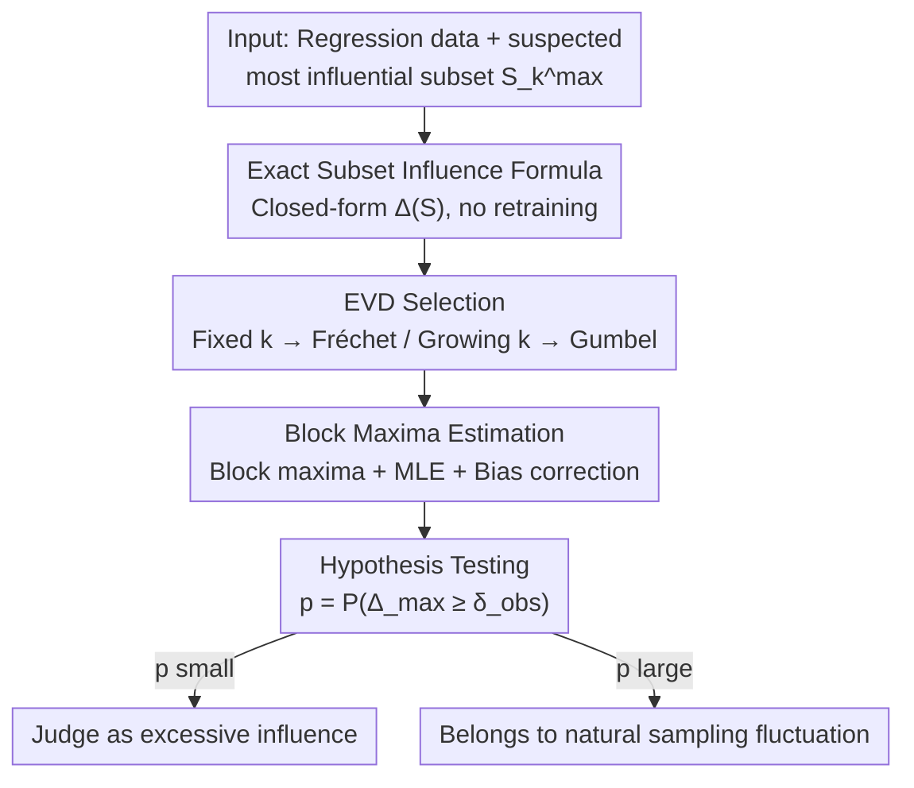

# Testing Most Influential Sets

**Conference**: ICLR 2026  
**OpenReview**: [https://openreview.net/forum?id=1a9daUteZn](https://openreview.net/forum?id=1a9daUteZn)  
**Code**: https://github.com/konradld/testingMIS  
**Area**: Statistical Learning Theory / Robustness / Interpretability  
**Keywords**: Most influential subsets, extreme value theory, influence testing, least squares, Fréchet/Gumbel distributions

## TL;DR
Addressing the phenomenon where "a few samples can overturn model conclusions," this paper derives an exact closed-form formula for subset influence in linear least squares and characterizes the asymptotic distribution of the "maximum influence" using extreme value theory (heavy-tailed Fréchet for fixed-size subsets and light-tailed Gumbel for growing subsets). This transforms empirical heuristics about whether "this influence is too outrageous" into a rigorous hypothesis test with p-values.

## Background & Motivation
**Background**: In economics, biology, and machine learning, model conclusions are often highly sensitive to a tiny minority of samples—two small island nations can make the "impact of geography on development" lose significance, or a single outlier can flip the sign of a treatment effect. Consequently, the academic community has developed methods to **find** these "most influential sets," i.e., the $k$ samples that, when removed, change an estimator the most.

**Limitations of Prior Work**: While these sets can be found, no one knows "what to do after finding them." Current practice relies entirely on domain experts, empirical thresholds (e.g., sign flips, loss of significance), and ad-hoc sensitivity checks to judge if a subset's influence is "problematic." These heuristics both misclassify robust results as fragile and miss truly anomalous influence. Furthermore, the common tool—influence functions—is merely a first-order linear approximation at $\epsilon=0$, which **systematically underestimates** the influence of subsets and high-leverage points because first-order approximations fail to capture interactions between samples and differences in leverage scores.

**Key Challenge**: What is missing is not a "tool to calculate influence," but a **yardstick**—how large would the maximum influence naturally be under random sampling? Only by knowing the distribution of this "normal fluctuation" can one determine whether an observed influence falls within the normal range or represents "excessive influence."

**Goal**: Establish a statistically significant evaluation framework for the "most influential set," specifically: (1) provide an exact, fast-to-calculate formula for subset influence; (2) characterize the probability distribution of the maximum influence $\Delta_{\max}$; (3) construct hypothesis tests for "excessive influence."

**Key Insight**: Focus on **linear regression**, an analytical, interpretable, and ubiquitous setting. $\Delta_{\max}$ is obtained by "taking the maximum over all $\binom{N}{k}$ subsets," which is inherently an extreme value. Its distribution should be governed by **extreme value theory** (EVT) rather than the classical Central Limit Theorem.

**Core Idea**: Use EVT to find the null distribution for "maximum influence"—translating the vague concern "is this influence too large?" into "how unlikely is the observed $\Delta_{\max}$ under the null distribution provided by EVT," thereby enabling rigorous inference with p-values.

## Method

### Overall Architecture
The problem addressed is: given a regression task and a subset $S_k^{\max}$ suspected of "excessive influence," how to determine if its influence exceeds natural sampling fluctuations? The approach follows a three-step pipeline: use an **exact closed-form formula** to calculate the influence of any subset (avoiding retraining for every candidate), use **extreme value theory** to determine which family of extreme value distributions the maximum influence follows and estimate its parameters, and finally **calculate p-values for hypothesis testing** based on this null distribution.

A supervised learning task is defined as: minimizing loss on training data $\{(x_n,y_n)\}_{n=1}^N$ to obtain $\hat\theta$, with the estimate after removing subset $S$ denoted as $\hat\theta_{-S}$. The influence of subset $S$ on a scalar target function $\varphi$ (e.g., a coefficient $\theta_1$) is defined as $\Delta(S;\varphi)=\varphi(\hat\theta)-\varphi(\hat\theta_{-S})$, and the $k$-most influential set is:

$$S_k^{\max}:=\arg\max_{S\subset[N],\,|S|=k}\Delta(S;\varphi),\qquad \Delta_{\max}=\Delta(S_k^{\max};\varphi).$$

The core research question is the distribution of $\Delta_{\max}$. The testing process is a clear three-stage pipeline:

### Key Designs

**1. Exact Subset Influence Formula: Replacing retraining with a single closed-form calculation**

Classical results provide single-point influence as $\Delta(\{i\})=(X'X)^{-1}\frac{x_i r_i}{1-h_i}$ (where $h_i$ is the leverage score and $r_i$ is the residual), but this only holds for a single point; naive extension to subsets ignores coupling between points. This paper's Proposition 1 extends it to any subset $S$ and incorporates ridge penalty:

$$\Delta(S)=\big(X'_{-S}X_{-S}+\lambda I_P\big)^{-1}X'_S r_S,$$

where $\lambda\ge 0$ is an optional penalty and $r_S$ are the residuals of subset $S$ under the **full-sample fit**. The proof strategy: partition the full normal equations into $S$ and $-S$, subtract the leave-out normal equations, and rearrange. This formula has two implications: the numerator $X'_S r_S$ reflects the **additive structure** of individual contributions, while the inverse $(X'_{-S}X_{-S}+\lambda I)^{-1}$ in the denominator reflects the **multiplicative adjustment** brought by the design matrix after removal. Its value lies in requiring only one matrix operation per candidate subset **without re-fitting the model**, which is crucial for the adaptive greedy search used to evaluate $\Delta_{\max}$ at scale.

**2. Distribution of Maximum Influence: Two regimes (Fréchet vs. Gumbel) based on subset size**

Since $\Delta_{\max}$ is an extreme value taken over all subsets, the paper uses EVT to characterize its asymptotic distribution, finding it depends on how $k$ scales with $N$, presenting two distinct regimes. The key to the proof is writing influence as $\Delta(S)=C\cdot D_{-S}^{-1}$, where the numerator $C=\sum_{i\in S}X_i R_i$ and the denominator $D=\sum_n X_n^2$ are asymptotically independent.

- **Fixed-size Subsets** ($k$ fixed, $N\to\infty$): If the heavier tail of $X_i$ or $R_i$ decays at a polynomial rate with tail index $\min\{\xi_x,\xi_r\}<\infty$, then (Theorem 1):

$$\lim_{N\to\infty}\Delta_{\max}\sim \mathrm{Fréchet}(a,b,\xi),\qquad \xi=\min\{\xi_x,\xi_r\}.$$

  Intuitively, the upper tail of numerator $C$ behaves like $\max\{X_iR_i\}$, thus inheriting the polynomial heavy tail and falling into the Fréchet domain of attraction. As a special case (Corollary 1), if both $X_i$ and $R_i$ have infinite tail indices (i.e., non-heavy-tailed), it degenerates to Gumbel.

- **Growing Subsets** ($k\to\infty$ but $k/N\to0$, i.e., $o(N)$): When the subset grows "slowly enough," the Central Limit Theorem begins to dominate—the numerator $C$ is a partial sum of $m_k=|S_k^{\max}|$ terms, $(C-\mathbb E[C])/\sqrt{m_k}\xrightarrow{d}\mathcal N(\mu,\sigma^2)$, thus (Theorem 2):

$$\lim_{N\to\infty}\Delta_{\max}\sim \mathrm{Gumbel}(a,b),$$

  which is **independent of the specific distributions of $X$ and $R$**, provided $X_i R_i$ has finite variance.

These results reveal a core insight: **fixed-size subsets are dominated by the heaviest tails (potentially arbitrarily large and dangerous), while growing subsets converge to the "well-behaved" Gumbel distribution with exponential decay**. This explains why "conclusion-flipping by small sets" is particularly alarming—it falls exactly into the heavy-tailed Fréchet regime.

**3. Three-step Hypothesis Testing Workflow: Grounding the distribution into a computable p-value**

With the distribution characterized, the paper provides an operational workflow. **Step 1: EVD family selection**. Based on the assumed subset size and tail behavior of $X,R$, choose between Gumbel and Fréchet—estimate the tail index via MLE; if $1/\xi$ is close to 0, default to Gumbel, otherwise use Fréchet with shape parameter $\xi$. **Step 2: Parameter estimation**. Use the block maxima method: divide the sample (excluding $S_k^{\max}$ for robustness) into $M$ blocks of size $N/M$, calculate $\Delta_{\max}$ for each block, and fit via MLE. Since taking the maximum over $N/M$ observations is smaller than the expected maximum of the full sample, a location bias correction $\tilde a=\hat a+b\log(M)$ is applied for Gumbel. **Step 3: Testing**. The null hypothesis $H_0$ is "the observed influence is natural fluctuation"; the alternative $H_1$ is "excessive influence." The p-value is calculated as $P(\Delta_{\max}\ge\delta_{\mathrm{obs}})$. Importantly, EVT already accounts for the multiple comparisons issue inherent in searching for the maximum over $\binom{N}{k}$ subsets.

### Training Strategy
The method does not require model training. The primary computational cost comes from approximating $\Delta_{\max}$ to obtain $M$ block maxima. The authors use an adaptive greedy algorithm with $O(Mk)$ complexity to search for the most influential set, leveraging the closed-form formula from Proposition 1. MLE for the Gumbel case optimizes only two parameters, making it simple and numerically stable.

## Key Experimental Results

### Convergence Verification (Simulation)
The authors simulated 1,000 datasets for combinations of Normal and $t(5)$ distributions across $N=20\sim1000$.

| Scenario ($X$–$R$) | Predicted $\xi^{-1}$ | Convergence |
|------|------|------|
| Normal–Normal | 0 (Gumbel) | No significant difference from Gumbel at $N\ge50$ |
| $t(5)$–$t(5)$ | 0.2 (Fréchet) | Stable convergence at moderate sample sizes |
| $t(5)$–Normal | — | Slower convergence due to $(X'X)_S^{-1}$ instability |
| Normal–$t(5)$ | — | Slower convergence than pure heavy-tailed scenarios |

Bias-corrected MLE for location parameters performed well; scale parameters were consistent but showed a slight downward bias that disappeared with larger samples.

### Economic Case: "The Blessing of Rugged Terrain"
Re-testing the controversial conclusion by Nunn & Puga (2012) regarding "rugged terrain benefiting African economies." Kuschnig et al. (2021) found Seychelles plus a few small nations could make the coefficient insignificant.

| Influential Subset | $\Delta(S)$ | p-value | Conclusion |
|------|------|------|------|
| Seychelles | 0.077 | $<1\mathrm{e}{-16}$ | Excessive influence |
| Seychelles + Lesotho | 0.046 | 0.216 | Not excessive |
| Seychelles + Rwanda | 0.070 | 0.001 | Excessive |
| Seychelles + Eswatini | 0.091 | $<1\mathrm{e}{-16}$ | Excessive |

Seychelles, alone or with most combinations, was judged to have excessive influence, corroborating suspicions of "country size confounding."

### ML Fairness Audit
Identifying influential subsets across four regression benchmarks:

| Dataset | Coefficient of Interest | Key Findings |
|------|------|------|
| Law School ($N{=}20{,}800$) | 'Other' race | A large set of 77 points fell within normal fluctuations; a small set of 17 was **excessive** (p=0.019). |
| Adult Income ($N{=}32{,}561$) | 'Male' indicator | Top-1% (325 points) moved the coefficient significantly but was **not excessive**. |
| Boston Housing ($N{=}506$) | Crime rate vs Price | 6 points removed significance; because crime is heavy-tailed, EVD is Fréchet ($\xi^{-1}=0.29$), **highly excessive** (p=0.001). |

### Key Findings
- **Subset size determines the regime**: Small fixed-size sets follow the heavy-tailed Fréchet distribution, making them the most dangerous source of "conclusion flipping." Growing sets converge to a well-behaved Gumbel.
- **Tail behavior determines danger**: Boston Housing follows a Fréchet distribution because of heavy-tailed crime variables, leading to high-risk scenarios for influence.
- **Conservative Testing**: The test prioritizes controlling Type I errors (false alarms for excessive influence), reflecting the view that influential subsets are often natural data features.
- **Clarifying Empirical Thresholds**: Heuristics like $2/\sqrt N$ are asymptotically accurate for *randomly* selected observations but too strict for the *most influential* ones.

## Highlights & Insights
- **Turning Influence Diagnosis from Art to Science**: The core contribution is finding a null distribution for maximum influence, allowing "is this influence excessive?" to be answered with a p-value for the first time.
- **Practical Closed-form Formula**: Proposition 1's formula allows evaluating influence without retraining, serving as the engineering cornerstone for large-scale application.
- **Illuminating Dual Regimes**: Using the three types of EVD (Gumbel/Fréchet/Weibull) explains why small sets are uniquely dangerous—they stem from the heavy-tailed Fréchet regime.
- **Epistemological Reframing of "Influence"**: The authors argue for viewing influence as a natural data feature rather than a flaw to be erased, suggesting "documenting subsets → investigating mechanisms → transparent reporting" over blind trimming.

## Limitations & Future Work
- **Linear Regression Only**: The theory is built on least squares; extension to GLMs, tree models, or non-parametric estimators is needed.
- **Dependency Assumptions**: Asymptotic arguments assume independence between features and residuals; validity may be limited when complex dependency structures exist.
- **EVD Parameter Estimation**: Practicality depends on accurately estimating the null distribution; finite-sample tail behavior and MLE bias are subtle areas for improvement.

## Related Work & Insights
- **vs. Influence Functions (Koh & Liang 2017)**: Influence functions are first-order approximations that systematically underestimate influence for high-leverage points; this paper uses exact formulas + EVT to focus on where first-order approximations fail most.
- **vs. Finding Methods (Broderick et al. 2023)**: Prior work solves "how to find" but lacks theory for "is it excessive." This paper provides the missing theoretical foundation.
- **vs. Empirical Thresholds (Belsley et al. 1980)**: Empirical thresholds are too strict for maxima; this paper clarifies that the selection process must be characterized by extreme value theory.

## Rating
- Novelty: ⭐⭐⭐⭐⭐ 
- Experimental Thoroughness: ⭐⭐⭐⭐ 
- Writing Quality: ⭐⭐⭐⭐⭐ 
- Value: ⭐⭐⭐⭐⭐ 

<!-- RELATED:START -->

## Related Papers

- [\[ICLR 2026\] Testing Fourier Sparsity via Implicit Sensing](testing_fourier_sparsity_via_implicit_sensing.md)
- [\[ICLR 2026\] Online Decision Making with Generative Action Sets](online_decision_making_with_generative_action_sets.md)
- [\[ICLR 2026\] The Softmax Bottleneck Does Not Limit the Probabilities of the Most Likely Tokens](the_softmax_bottleneck_does_not_limit_the_probabilities_of_the_most_likely_token.md)
- [\[ICLR 2026\] Efficient Testing for Correlation Clustering: Improved Algorithms and Optimal Bounds](efficient_testing_for_correlation_clustering_improved_algorithms_and_optimal_bou.md)
- [\[ICML 2026\] Sequential Kernel-based Conditional Independence Testing via Adaptive Betting](../../ICML2026/learning_theory/sequential_kernel-based_conditional_independence_testing_via_adaptive_betting.md)

<!-- RELATED:END -->
