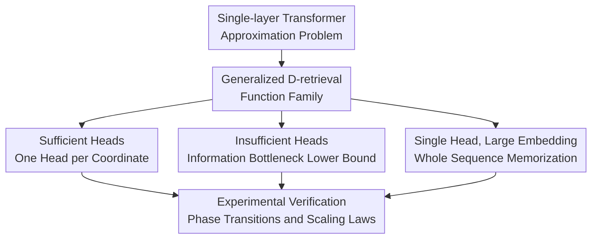

# The Effect of Attention Head Count on Transformer Approximation

**Conference**: ICLR2026  
**OpenReview**: [https://openreview.net/forum?id=RJXwuAMUiI](https://openreview.net/forum?id=RJXwuAMUiI)  
**Code**: None  
**Area**: Learning Theory  
**Keywords**: Transformer Approximation Theory, Number of Attention Heads, Expressive Power Lower Bound, Retrieval Tasks, Sequence Modeling  

## TL;DR

This paper proves from an approximation theory perspective that the number of attention heads in a Transformer is not merely an engineering hyperparameter. When the head count $h$ reaches the intrinsic task dimension $D$, generalized retrieval functions can be efficiently approximated. However, when $h < D$, the parameter count must deteriorate exponentially with the sequence length $T$. These phase transition phenomena are observed in synthetic retrieval, MS MARCO, and CIFAR-10 experiments.

## Background & Motivation

**Background**: The Transformer has become the foundational architecture for sequence modeling, language models, Vision Transformers, and multimodal models. In practice, large models often use large head counts like 32, 64, or 128, but these choices are primarily based on empirical recipes rather than theoretical criteria regarding "how many heads a task actually needs." Existing expressive power research mostly proves that Transformers possess universal approximation or Turing completeness. Some work analyzes low-rank attention, single-head approximation rates, or sparse attention settings, but these usually focus on upper bounds or simplified linear/local models.

**Limitations of Prior Work**: Upper bounds stating "sufficient heads can represent many functions" do not explain the specific price paid when heads are insufficient. One head essentially extracts one representation from a sequence via softmax weighted averaging. If a target function requires identifying multiple independent salient features simultaneously, a few heads might compress different features into the same representation. Past theories often bypassed this bottleneck by linearizing the attention matrix, studying only the attention block itself, or allowing a single head to use an extremely large embedding dimension, making it difficult to provide rigorous lower bounds in realistic non-linear settings.

**Key Challenge**: The empirical effectiveness of multi-head attention may not just be about "diversity from multiple subspaces" in a broad sense, but rather related to the number of independent coordinates the task needs to retrieve simultaneously. If a task has $D$ intrinsic retrieval coordinates and the model only has $h < D$ heads, at least one head must assume multiple retrieval roles; this compression makes the attention output nearly indistinguishable for certain different inputs, forcing the subsequent FFN to compensate with a massive number of parameters.

**Goal**: The authors aim to answer three specific questions. First, can a family of target functions be constructed that is general enough yet exposes the head count bottleneck? Second, is there a provable separation in approximation complexity between $h \ge D$ and $h < D$ for this function family? Third, what is the theoretical difference between a "memorize the whole sequence" scheme using a single head with a massive embedding dimension and a multi-head specialization scheme?

**Key Insight**: The paper introduces the generalized $D$-retrieval task, writing the sequence-to-vector target function as a form where "minimum features are first taken from several sets of positions and then combined by an outer function." This family resembles retrieval problems, but the authors further prove it is dense in the space of continuous functions, ensuring it does not serve only a toy task. Consequently, $D$ can be interpreted as the intrinsic retrieval dimension of the target, making the relationship between head count $h$ and $D$ a subject for analysis.

**Core Idea**: Use the generalized retrieval task to formalize whether "each head can be dedicated to one target coordinate," and prove that insufficient heads compress different sequences into nearly identical attention representations, forcing the FFN parameter count to grow at the $\Omega(1/\epsilon^{cT})$ level.

## Method

### Overall Architecture

This paper does not propose a new Transformer model but establishes an approximation theory analysis framework. It first defines the hypothesis class for single-layer, multi-head, sequence-to-vector Transformers, then constructs a family of generalized $D$-retrieval target functions, and subsequently proves three regimes: efficient approximation via multi-head specialization when $h = D$, a rigorous parameter lower bound when $h < D$, and bypassing head insufficiency via "whole sequence memorization" when $h = 1$ but the embedding dimension $n \ge Td$.

Formally, the input is a sequence $X_T=\{x^{(s)}\in[0,1]^d:s\in[T]\}$ of length $T$, and the output is a vector independent of $T$. Each token is first mapped by a trainable encoder $P_\phi(x,s)$ to $E=nh$ dimensions, where $n$ is the embedding dimension per head and $h$ is the number of heads. The model appends a classification token $\hat c_0$, processes the sequence with single-layer multi-head attention, and finally reads the output at the classification token position for the FFN $\hat F$.

The core form of the generalized $D$-retrieval target function is:

$$
\bar z_i(X_T)=\min_{t\in S_i} f_i(x^{(t)}),\quad i=1,\ldots,D,
$$

$$
H(X_T)=F_0(\bar z_1(X_T),\ldots,\bar z_D(X_T)).
$$

Here, each $f_i$ is a smooth function over input tokens, $S_i\subseteq[T]$ is the set of positions involved in the $i$-th retrieval coordinate, and $F_0$ is the outer composition function. Intuitively, $\bar z_i$ represents "extracting the $i$-th type of most salient feature from a group of candidate positions," while $F_0$ synthesizes these features into a final answer. The paper also requires that each $f_i$ has a unique non-degenerate minimum, the minima for different coordinates are distinct, and $F_0$ is truly sensitive to each coordinate to exclude degenerate cases like constant functions or redundant coordinates.

### Key Designs

**1. Generalized D-retrieval Objective Family: Turning "Required Retrieval Coordinates" into Provable Intrinsic Dimension**

The most critical modeling action of the paper is not directly establishing a lower bound for arbitrary continuous functions, but first constructing a target family that is both structured and general enough. Each target coordinate $\bar z_i$ depends only on the minimum over some position set $S_i$, a form simple enough to be approximated by softmax attention as a hardmax/hardmin; however, when multiple coordinates are combined via an outer function $F_0$, it can represent a quite broad range of sequence-to-vector mappings. The authors prove that $\{\mathcal F_D\}_{D=1}^{\infty}$ is dense in $C(X_T)$, meaning for any continuous target $F$ and any precision $\epsilon$, one can always find some $D$ and a generalized retrieval function $f\in\mathcal F_D$ such that $\|F-f\|_\infty\le\epsilon$.

This density conclusion lends more weight to the subsequent lower bounds: the authors are not analyzing an isolated "max and min" toy function, but a retrieval skeleton capable of approximating general continuous sequence functions. Furthermore, the paper provides a uniqueness conclusion for intrinsic dimension: under regularity conditions and scale constraints like $D_1^2+D_2^2\le T/50$, if the same task can be written using two generalized retrieval representations, the $D$ for both must be identical. That is, $D$ is not an arbitrary parameter but the amount of "independent retrieval roles required" carried by the target function itself.

**2. Sufficient Head Upper Bound: Specialized Approximation per Coordinate to Avoid Cross-coordinate Compression**

When $h = D$, the authors construct a direct Transformer approximation scheme: the $i$-th head is responsible only for the $i$-th retrieval coordinate $\bar z_i$. The encoder first uses a small FFN $\Psi_{i, \delta}$ to approximate $f_i(x)$, while using a positional gate $r_i(t)$ to distinguish between $t \in S_i$ and $t \notin S_i$; attention logits are taken in a form similar to $-\Psi_{i,\delta}(x^{(t)})+r_i(t)$. When the softmax temperature $\beta$ is sufficiently large, the weighted average of this head concentrates on the position within $S_i$ where $f_i$ is minimal, approximating $\min_{t\in S_i}f_i(x^{(t)})$.

This construction shows the role of multi-head can be very specific: instead of abstractly "providing multiple attention patterns," it splits $D$ retrieval coordinates among $D$ heads, each performing a hard retrieval. After obtaining $\tilde z=(\tilde z_1,\ldots,\tilde z_D)$, the final FFN only needs to approximate the outer $F_0$. If both $F_0$ and $f_i$ satisfy standard two-layer network approximation assumptions, the parameter upper bound is $M\le C_{d,D,T}/\epsilon^\gamma$. Although the constant can depend on $T$, the precision exponent no longer contains terms that explode with sequence length, reflecting the efficiency advantage of "splitting difficulty into $D$ local retrievals" once the head count is sufficient.

**3. Insufficient Head Lower Bound: Constructing Sequences with Nearly Identical Attention Outputs but Different Target Values**

The most valuable part is the lower bound for $h=s<D$. The proof strategy can be understood as an "adversarial compression test" for a model with few heads: since there are only $s$ heads but $D$ distinct retrieval basins, there always exists a local region of a target coordinate not covered by the peak response point of any head. The paper discretizes a large number of candidate subsequences on this insufficiently attended local segment $G_i$, then uses the Pigeonhole Principle to find two different subsequences $Z_1, Z_2$ such that, for every head, their attention-weighted value averages are nearly the same, with a gap of only $O(\epsilon^{k+1})$.

However, these two subsequences are different from the perspective of the target function. Because $f_i$ has a local slope on $G_i$ guaranteed by a positive definite Hessian, two different points result in at least a linear difference in $f_i$; since the partial derivative of $F_0$ with respect to the $i$-th coordinate is non-zero, this difference propagates to the final target value. Thus, the authors embed $Z_1, Z_2$ into complete sequences $W_1, W_2$, making the target function separate them by at least $3\epsilon$, while the attention block maps them to nearly indistinguishable representations. If the model is to achieve $\epsilon$-approximation, the final FFN must produce significant output differences over tiny input distances, which is equivalent to requiring high Lipschitz capacity; in a two-layer FFN with bounded weights and 1-Lipschitz activations, this translates into a parameter count lower bound.

The lower bound provided in the paper is: when $h=s<D$,

$$
\min\{M:\mathcal H(h,n,d,T,M)\ \epsilon\text{-approximates}\ H\}=\Omega(1/\epsilon^k),
$$

where

$$
k=\frac{(T/4-s-D+1)}{(n+1)s+1}-1.
$$

When $d, D, n, h$ are relatively fixed and $T$ grows, this exponent increases linearly with $T$, thus deteriorating as parameter complexity $\Omega(1/\epsilon^{cT})$. This is the strongest theoretical message of the work: insufficient heads do not just lack a constant; they trigger an expressive bottleneck that amplifies with length in long-sequence retrieval tasks.

**4. Single-Head Large Embedding Dimension: Bypassing Head Bottlenecks via "Whole Input Memorization" at a Cost to Representation Dimension and FFN**

The authors also analyze a seemingly counter-intuitive case: a single head can also approximate generalized retrieval tasks, provided the per-head embedding dimension $n \ge Td$. The construction involves putting the $t$-th token into the $t$-th block of $RTd$, e.g., $P_\phi(x^{(t)},t)=e_t\otimes x^{(t)}$. In this case, even with a trivial attention average, the classification token obtains $\frac1T(x^{(1)},\ldots,x^{(T)})$, effectively preserving the information of the entire sequence. A subsequent five-layer ReLU FFN then handles approximating all $f_i$, calculating min/max operations, and approximating $F_0$.

This conclusion does not encourage single-head architectures but distinguishes between two mechanisms: when multi-head is sufficient, the attention layer itself completes structured retrieval; with a single head and large dimension, attention merely moves the entire input in front of the FFN, shifting the true computational complexity to the FFN and the $Td$-dimensional representation. The parameter upper bound given is $M>C_{d,D,T}/\epsilon^{1+\gamma}$, where the extra $1/\epsilon$ comes from approximating max/min operations with shallow ReLU networks. This regime is theoretically feasible but impractical for long sequences, explaining why "single-head universal approximation" is not equivalent to "efficiency with few heads."

### A Complete Example

The three cases can be understood using the toy task at the beginning of the paper. Let the input be a sequence of scalars $x^{(1)},\dots,x^{(T)}\in[0,1]$, with the target

$$
H(X_T)=\max_{1\le t\le T}x^{(t)}+\min_{1\le t\le T}x^{(t)}.
$$

This task requires retrieving both the maximum and minimum, so it can be seen as a $D=2$ retrieval problem. If there are two heads, one head's logit can be designed to favor the maximum position, and the other head's logit to favor the minimum position. The final FFN only needs to add the two. Here, increasing sequence length does not force one head to carry two types of extreme information simultaneously.

If there is only one head, the softmax weighted average can only output one mixed representation. It must preserve both the maximum and minimum; as $T$ grows, there are more choices for extreme positions, causing many different sequences to become very similar in this single-head output. Yet the target function can still distinguish these sequences because the maximum or minimum has changed. If the final FFN wants to separate these near-neighbor inputs, it must be extremely "steep," which, given bounded weights, can only be achieved with a large number of hidden units—this is the intuition behind the lower bound proof.

If there is only one head but the embedding dimension expands to the $T$ level, it can place the value of each position into independent coordinates, effectively handing the full sequence to the FFN. This naturally allows calculating max and min, but at the cost of an embedding dimension that grows linearly with $T$, and the attention layer no longer provides effective retrieval specialization.

### Loss & Training

The theoretical part contains no training objective; the experimental part uses standard supervised training to verify scaling trends. In synthetic tasks, the target is $y=\sum_{i=1}^4\max_{1\le t\le T}a_i^\top x^{(t)}$, with intrinsic dimension $D=4$. Inputs $x^{(t)}\sim\mathcal N(0,I_4)$, sequence lengths $T\in\{8,16,32,64,128\}$, with 8,000 training and 2,000 validation samples. The model is a single-layer multi-head Transformer without residual or layer norm, with fixed per-head embedding dimensions, and uses a two-layer GELU MLP to regress a scalar. The evaluation metric is NMSE (MSE divided by target variance) to prevent variance changes of the max-of-Gaussian target under different $T$ from affecting comparisons.

The MS MARCO experiment is retrieval-style classification: each query is paired with one positive passage and $T-1$ hard negatives, $T\in\{8,16,32,64\}$. The authors freeze the BERT tokenizer and word/position/segment embeddings, training only the projection layer and a two-layer Transformer encoder, observing training top-1 accuracy and MRR as head count varies. The CIFAR-10 experiment uses a four-layer ViT with patch size $8\times8$, varying sequence length by extending image boundaries, fixing per-head dimension at 16, and varying head count to observe training/validation accuracy.

## Key Experimental Results

### Main Results

Synthetic tasks most closely align with theoretical settings, with an intrinsic dimension $D=4$. When the hidden dimension is fixed at $N=32$, a clear phase transition occurs as the head count increases from 1 to 4; when $h \ge 4$, NMSE drops to the $10^{-5}$ to $10^{-6}$ range, and the deterioration with sequence length practically vanishes.

| Task / Dataset | Key Settings | Observed Phase Transition Heads | Representative Results | Description |
|--------|------|------|----------|------|
| Synthetic $D=4$ Retrieval | $T=8\sim128$, $h=1\sim5$ | $h=4$ | $h=3, T=128$ NMSE $1.58\times10^{-3}$; $h=4, T=128$ NMSE $5.23\times10^{-6}$ | Error drops sharply when head count reaches intrinsic dimension |
| MS MARCO Retrieval | $T=8,16,32,64$, 2-layer Transformer | Approx. $h=12$ | $h=8, T=64$ train acc $0.932$; $h=12, T=64$ train acc $0.991$ | Long sequences are harder with few heads; curve flattens with sufficient heads |
| CIFAR-10 ViT | Extend image boundaries for sequence length | Approx. $h=10$ | $h=8$ train acc approx. $90\%\sim95\%$; $h=10+$ near $96\%\sim98\%$ | Similar transition appears in real vision tasks |

In the synthetic task error table, at $h=1$, NMSE increases from $7.01\times10^{-2}$ at $T=8$ to $1.45\times10^{-1}$ at $T=128$; at $h=2$, it drops to the $10^{-2}$ level but still worsens with $T$; at $h=3$, it further drops to the $10^{-3}$ level. The true turning point occurs at $h=4$: $6.10\times10^{-5}$ for $T=8$ and $5.23\times10^{-6}$ for $T=128$, approaching perfect fit. Further improvement from $h=5$ is limited, indicating diminishing returns after exceeding the intrinsic dimension.

### Ablation Study

Multiple additional settings were tested to confirm the phase transition is not an implementation detail, including fixing the total embedding dimension $E=nh=32$, changing the synthetic task to $D=3$, and using a two-layer Transformer. All results retained the trend of "phase transition appearing near the intrinsic dimension."

| Configuration | Key Metric | Description |
|------|---------|------|
| $D=4$ synthetic task with fixed total embedding $E=32$ | $h=3, T=128$ NMSE $4.77\times10^{-4}$; $h=4, T=128$ NMSE $5.70\times10^{-7}$ | Significant jump at $h=4$ even if total dimension doesn't grow with heads |
| $D=3$ synthetic task | $h=2, T=128$ NMSE $1.11\times10^{-3}$; $h=3, T=128$ NMSE $2.11\times10^{-7}$ | Phase transition moved from $h=4$ to $h=3$ with task dimension |
| 2-layer Transformer, $D=4$, NoPE/NoLN | $h=1, T=128$ NMSE $4.28\times10^{-4}$; $h=2, T=128$ NMSE $3.83\times10^{-6}$ | Supports the conjecture $L\cdot h \ge D$ for multi-layer cases, but not a strict proof |
| MS MARCO Val Accuracy | Val set overall drops as $T$ grows; more heads don't necessarily improve generalization | Train accuracy better reflects expressive power; val performance is affected by hard negatives and overfitting |
| CIFAR-10 Val Accuracy | Clear train transition; val accuracy might drop with large head counts | In real vision tasks, expressive power gains involve trade-offs with optimization/generalization |

### Key Findings

- When heads are insufficient, longer sequence lengths lead to higher errors under equal parameters; this aligns with the $\Omega(1/\epsilon^{cT})$ lower bound.
- The phase transition in synthetic tasks aligns precisely with $D=4$, and shifts to $h=3$ when $D=3$, proving "intrinsic dimension" is not a post-hoc explanation.
- Transition points for MS MARCO and CIFAR-10 are not pre-defined by a known $D$, but curve shapes match theoretical predictions: long sequences are harder for few heads, and length dependence weakens with enough heads.
- Simply increasing head count is not always better; on real tasks, training accuracy increases, but validation accuracy may decrease due to optimization, overfitting, or parameter allocation factors.
- Two-layer synthetic experiments suggest multi-layer models might use $L\cdot h$ effective retrieval roles to compensate for single-layer head insufficiency, though this remains at the level of conjecture and experimental observation.

## Highlights & Insights

- This paper moves the question of "why multiple heads are needed" from empirical intuition to a provable proposition of approximation complexity. It doesn't just say multi-head is stronger, but points out where: when a task has multiple independent retrieval coordinates, multi-head allows specialization, while few heads create an information bottleneck.
- The lower bound proof construction is inspiring: find two sequences with distinct target values but nearly identical attention representations, pushing the difficulty to the FFN. This idea of "unseparable attention fronts leading to large Lipschitz/parameter costs in the backend" can be ported to analyze expressive costs of sparse attention, GQA/MQA, or head pruning.
- The definition of the generalized $D$-retrieval task balances analyzability and generality. It abstracts max/min retrieval, hard negative retrieval, and patch/token selection into "extreme value extraction across several coordinates," which exposes Transformer structural bottlenecks more effectively than studying arbitrary continuous functions.
- The single-head large embedding result reminds us that universal approximation alone is insufficient. Being able to represent a function doesn't mean an architecture can do so efficiently with reasonable dimensions and parameters; many theoretical debates should focus on approximation efficiency rather than pure representability.
- While the experimental section doesn't strictly prove a clear $D$ for real tasks, it provides a practical diagnostic: by varying head count and sequence length, one can observe if error curves transition from "deteriorating with $T$" to "stable with $T$" at a certain head count, thus inferring the effective retrieval dimension of the task or model.

## Limitations & Future Work

- Theoretical main results are limited to single-layer, sequence-to-vector Transformers, omitting layer normalization and part of the residual connections. While authors suspect critical lower bounds still hold with layer norm, no strict proof is provided.
- Although generalized $D$-retrieval is dense, the head count bottleneck is most visible in retrieval and extreme-value tasks. Defining intrinsic dimensions for purely local combinations, smooth averaging, or strongly generative language modeling targets remains non-trivial.
- Lower bounds depend on conditions like bounded weights, two-layer FFNs, and 1-Lipschitz activations. Variants like Heaviside activations, parameters growing with $T, 1/\epsilon$, and five-layer FFNs are discussed, but normalization, residuals, and optimization dynamics in real large models are more complex.
- Multi-layer scenarios are only proposed as a Conjecture: efficient approximation might require $L\cdot h \ge D$. This is highly valuable but remains the most significant theoretical gap for future work, as actual Transformers rely on deep stacking.
- Experiments primarily examine training accuracy or minimum error across seeds to isolate expressive power, which remains distanced from real generalization performance. MS MARCO and CIFAR-10 results show expressive gains from head counts don't automatically translate to generalization gains.
- Suggestions for actual model design remain qualitative. If "effective retrieval dimension" could be estimated as a measurable early-training metric, it would more directly guide head count selection, head pruning, or GQA grouping strategies.

## Related Work & Insights

- **vs Yun et al. 2020 universal approximation**: Yun et al. proved Transformers can approximate broad sequence-to-sequence functions ("can they represent"); Ours asks "how many heads/parameters are needed to represent efficiently" and provides lower bounds for insufficient heads.
- **vs Jiang & Li 2024 single-head approximation rate**: Jiang & Li analyzed single-layer single-head Transformer rates, favoring single-head feasibility; Ours interprets single heads within the large-embedding memory regime, emphasizing they are feasible but not necessarily efficient or a substitute for multi-head specialization.
- **vs Amsel et al. 2024 quality over quantity in attention layers**: Amsel et al. focused on attention matrix rank and nearest-neighbor targets, noting adding heads isn't always beneficial; Ours focuses on parameter lower bounds related to head count and sequence length, showing specific bottlenecks for insufficient heads on non-linear retrieval families.
- **vs Bhojanapalli et al. 2020 low-rank bottleneck**: Bhojanapalli et al. discussed expressive bottlenecks from low-rank attention; the bottleneck in Ours is not simple matrix rank but rather the exponential separation cost required by the FFN when multiple target coordinates are compressed into few heads.
- **vs Mahdavi et al. 2023 memorization capacity**: Mahdavi et al. studied how many samples multi-head attention can memorize; the single-head large embedding conclusion in Ours is not training set memorization but "sequence content memorization" where FFNs compute target relations after encoding the full sequence into a representation.

## Rating

- Novelty: ⭐⭐⭐⭐⭐ Linking head count to intrinsic retrieval dimension and providing a non-linear approximation lower bound for $h < D$ is a precise theoretical framing.
- Experimental Thoroughness: ⭐⭐⭐⭐ Synthetic experiments fit the theory well, and real tasks show phase transition trends; a limitation is that multi-layer real models only receive empirical support.
- Writing Quality: ⭐⭐⭐⭐ Clear main line and well-explained theorems; the proof section is notation-heavy, and notation for max/min and appendix details requires a strong mathematical background.
- Value: ⭐⭐⭐⭐⭐ Insightful for Transformer architecture choices, head pruning, GQA/MQA design, and long-context retrieval tasks, particularly as a reminder not to use universal approximation alone to judge architecture capability.

<!-- RELATED:START -->

No specific related papers provided.

<!-- RELATED:END -->

## Related Papers

- [\[ICLR 2026\] On the Interpolation Effect of Score Smoothing in Diffusion Models](on_the_interpolation_effect_of_score_smoothing_in_diffusion_models.md)
- [\[ICLR 2026\] Poly-attention: a general scheme for higher-order self-attention](poly-attention_a_general_scheme_for_higher-order_self-attention.md)
- [\[ICLR 2026\] Strong Correlations Induce Cause Only Predictions in Transformer Training](strong_correlations_induce_cause_only_predictions_in_transformer_training.md)
- [\[ICLR 2026\] Subquadratic Algorithms and Hardness for Attention with Any Temperature](subquadratic_algorithms_and_hardness_for_attention_with_any_temperature.md)
- [\[ICLR 2026\] Critical Attention Scaling in Long-Context Transformers](critical_attention_scaling_in_long-context_transformers.md)

<!-- RELATED:END -->
