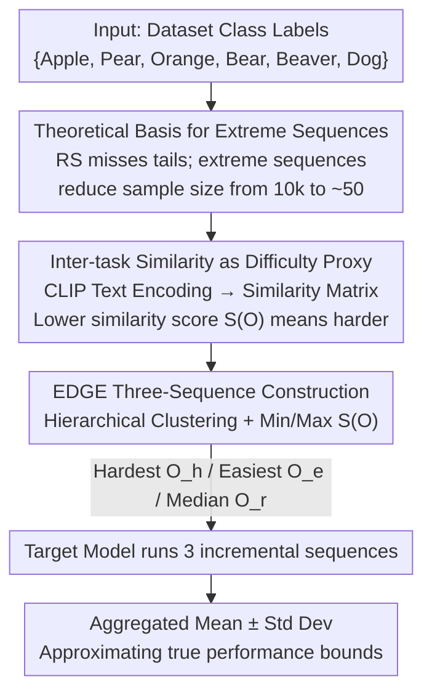

# The Lie of the Average: How Class Incremental Learning Evaluation Deceives You?

**Conference**: ICLR 2026  
**OpenReview**: [https://openreview.net/forum?id=19LHXi9uLw](https://openreview.net/forum?id=19LHXi9uLw)  
**Code**: https://github.com/AIGNLAI/EDGE  
**Area**: Learning Theory / Continual Learning Evaluation  
**Keywords**: Class-Incremental Learning, Evaluation Protocols, Extreme Sequences, Inter-task Similarity, Performance Distribution Estimation  

## TL;DR
This paper points out that the common "randomly sample 3-5 class sequences and report mean/variance" evaluation method in Class-Incremental Learning (CIL) systematically overestimates the mean and severely underestimates the variance, fundamentally missing extreme sequences. The authors theoretically prove the infeasibility of random sampling and propose the EDGE protocol—utilizing CLIP text encoders to calculate inter-class semantic similarity and constructing "Hardest/Easiest/Median" extreme sequences to approximate the true performance distribution, thereby providing more reliable model selection and robustness assessment.

## Background & Motivation
**Background**: Class-Incremental Learning requires models to continuously learn new classes from a sequence of tasks without forgetting old ones. While substantial work focuses on architectures and algorithms, "how to evaluate a CIL model" has long been neglected. The mainstream approach is to fix ~3 random seeds (e.g., 0, 42, 1993) to sample 3-5 class arrival orders, run the full incremental process, and report the sample mean and standard deviation of the average accuracy $A(O)$ at the end of these sequences—the authors term this the **Random Sampling (RS) protocol**.

**Limitations of Prior Work**: Final performance in CIL is extremely sensitive to the order in which classes arrive. The authors conducted an exhaustive control experiment: 6 classes divided into 3 tasks, resulting in 90 possible arrival sequences. Running every sequence revealed the true distribution. Results showed that the accuracy gap between the easiest and hardest sequences can reach up to 20% (Hide-Prompt on CIFAR-100), while the true distribution approximates a Gaussian. Comparing the Gaussian fitted from RS (3 samples) to the true distribution, RS systematically **overestimates the mean and drastically underestimates the variance**, failing entirely to capture the upper and lower bounds. A model reported as "safe with 85% mean" by RS might have a true lower bound of only 70%—such omissions are fatal in scenarios like autonomous driving where class arrival order is uncontrollable.

**Key Challenge**: The number of possible class sequences explodes factorially with the number of classes ($O(N!)$), yet only a few sequences can be sampled. Relying on uniform random sampling to approximate the entire performance distribution is statistically infeasible due to the required sample size. Worse, random sampling almost certainly fails to capture the extreme sequences in the tails, which are precisely what determine deployment risk.

**Goal**: (1) Theoretically clarify why RS is unreliable and how many samples are actually needed; (2) Find an evaluation protocol that can characterize the distribution bounds using very few samples.

**Key Insight**: The authors observed a stable positive correlation—**the lower the inter-task similarity, the worse the model performance** (tasks that are more dissimilar lead to larger parameter jumps during task switching, increasing forgetting). Since similarity can predict difficulty, it can be used to "directionally construct" hardest and easiest sequences rather than sampling blindly.

**Core Idea**: Instead of pursuing "enough random samples to approximate the distribution," **use inter-class semantic similarity to directly construct extreme sequences** (Hardest + Easiest). By adding a median sequence, these three points can "pin down" the center and the bounds of the true performance distribution.

## Method

### Overall Architecture
EDGE (Extreme case-based Distribution & Generalization Evaluation) is an **evaluation protocol** that changes not the model, but "which class sequences are fed to the model and how results are aggregated." Its input is a set of class labels for a dataset, and its output is a three-point estimation of the model's true performance distribution (mean ± std + upper/lower bounds). The process is: encode all class labels into semantic vectors using a pre-trained CLIP text encoder $\rightarrow$ compute a cosine similarity matrix between classes $\rightarrow$ perform hierarchical clustering on this matrix and search for task partitions/orders that minimize/maximize inter-task similarity $\rightarrow$ obtain the hardest sequence $O_h$, the easiest sequence $O_e$, and a random median sequence $O_r$ $\rightarrow$ run the target model through the full incremental process on these three sequences $\rightarrow$ aggregate the three final accuracies to approximate the true distribution.

### Key Designs

**1. Extreme Sequence Sampling: Compressing "10k samples" to dozens**

The pain point stems from combinatorial explosion. Lemma 1 gives the total number of sequences $|\Omega| = \frac{N!}{(M!)^K}$ ($N$ classes in $K$ tasks of size $M$), proving that under $K=\Theta(N)$ scaling, $|\Omega|$ grows factorially as $\Omega((N/e)^N)$. For $N=100, K=10$, there are $\approx 10^{92}$ sequences; sampling 3 provides coverage of less than $10^{-90}$. Theorem 1 shows that for the empirical mean $\hat A_L$ to fall within an $\varepsilon$-neighborhood of the true mean with probability $1-\delta$, the required sample size $L$ is $\Omega\!\left(\frac{N\ln N}{\varepsilon^2}\right)$—even for $N=100, \varepsilon=0.1, \delta=0.05$, $L \gtrsim 2\times 10^4$ sequences are needed, making random sampling impractical.

Critically, for the distribution tails: the probability that $L$ random sequences miss the deviation set $E_t=\{\omega:|A(\omega)-\mathbb{E}[A]|>t\sqrt{\mathrm{Var}[A]}\}$ is roughly $\exp(-(|E_t|/|\Omega|)L)$. Thus, random sampling **almost certainly misses extreme cases**. Theorem 2 provides the solution: if we can identify two extreme sequences satisfying $A(\omega_+)-\mu\ge\sigma$ and $\mu-A(\omega_-)\ge\sigma$ and force them into the sample, the required random sample size $L$ drops significantly, becoming proportional to $R(\sigma)^2=(A(\omega_+)-A(\omega_-))^2$; when $R(\sigma)\approx0.1$ (common in practice), $L$ drops to $\approx 50$. This is the foundation of EDGE: **instead of 10,000 blind samples, construct two extreme sequences and one median.**

**2. Inter-task Similarity: Calculating a proxy for sequence difficulty**

To construct extreme sequences, a metric to predict difficulty is needed. The authors anchor this to **inter-task semantic similarity**, defining a sequence similarity score:

$$S(O)=\frac{K}{(K-1)N}\sum_{1\le i\le K-1}\sum_{c\in C_i}\sum_{c'\in C_{i+1}}\mathrm{Sim}(c,c'),$$

which sums and normalizes the semantic similarity $\mathrm{Sim}(c,c')$ of all cross-task class pairs for neighboring tasks. Theorem 3 proves a monotonic relationship with generalization error: for hardest $O_h$, easiest $O_e$, and random $O_r$, similarity scores follow $S(O_h)\le S(O_r)\le S(O_e)$, corresponding to generalization errors $\epsilon_g(O_h)\ge\epsilon_g(O_r)\ge\epsilon_g(O_e)$. Intuition: the more dissimilar adjacent tasks are, the larger the parameter shift during task transitions, leading to higher forgetting and error bounds. Figure 2c validates this across all enumerable sequences—most methods show a stable positive correlation (Pearson $R$ between 0.12–0.31). Finding the extreme sequences thus becomes equivalent to minimizing/maximizing $S(O)$.

**3. EDGE Protocol: CLIP text encoding + Hierarchical clustering**

Since image instances are unavailable during evaluation setup, EDGE uses a pre-trained CLIP **text encoder** $\Phi$ to encode each class name into a $d$-dimensional vector $L_i=\Phi(y_i)$, then computes a cosine similarity matrix $D\in\mathbb{R}^{N\times N}$ where $d_{ij}=\frac{L_i\cdot L_j}{\|L_i\|\|L_j\|}$. To generate the **hardest sequence**: hierarchical clustering is used to put semantically similar classes into **the same task** as much as possible, minimizing cross-task similarity. An Inter-Task Similarity (ITS) matrix is then computed, and tasks are connected greedily starting from those with lowest global similarity. To generate the **easiest sequence**: similar classes are dispersed across **different tasks**, connecting tasks with the highest similarity. For fair comparison with RS (which uses 3 samples), a random sequence is added as the median $O_r$. Evaluating on these three sequences and aggregating results approximates the true distribution.

### Loss & Training
EDGE does not introduce any training loss or modify model parameters—it is a protocol at the evaluation level. Target CIL models are trained normally; EDGE only determines on which class sequences they are tested and how results are aggregated.

## Key Experimental Results

Experiments consist of: **Exhaustive experiments** (top 6 classes of a dataset, 3 tasks, 90 permutations as true distribution $D_{true}$) to quantitatively compare RS and EDGE; and analysis under **standard CIL settings** to visualize the ability to capture extremes. Distance to the true distribution is measured by JSD divergence ($\mathrm{JSD}$) and Wasserstein distance ($W$).

### Main Results

Boundary estimation for pre-trained methods in exhaustive settings (selected; gray represents target true values; lower JSD/W is better):

| Dataset | Method | True Min minA | RS Min | EDGE Min | JSD(RS) | JSD(EDGE) | W(RS) | W(EDGE) |
|--------|------|------|------|------|------|------|------|------|
| CIFAR-100 | L2P | 71.83 | 83.83 | **72.83** | 0.44 | **0.30** | 2.81 | **2.00** |
| CIFAR-100 | Hide-Prompt | 72.50 | 79.67 | **73.00** | 0.34 | **0.22** | 3.89 | **1.42** |
| ImageNet-R | CODA-Prompt | 18.72 | 39.04 | **21.93** | 0.65 | **0.20** | 9.85 | **2.37** |
| ImageNet-R | RanPAC | 90.91 | 93.05 | 93.05 | 0.57 | **0.36** | 2.25 | **1.07** |

Conclusions for non-pre-trained methods are consistent: on CIFAR-100, the true lower bound for EWC is 12.50%, RS estimates it at 26.17% (over double), while EDGE estimates it at 12.50% (exact hit). EDGE consistently exhibits lower JSD and $W$ than RS.

### Ablation Study

| Configuration | Key Finding |
|------|---------|
| RS vs EDGE Bound | RS estimates EWC's lower bound as 26.17% while the true value is 12.50%. RS systematically overestimates bounds, leading to incorrect model rankings. |
| EDGE Backbone | Performance remains close to true distribution across ResNet50/101, ViT-B/16, ViT-B/32, ViT-L/14. The protocol is robust to the scale of the CLIP text encoder (Figure 4). |
| Stability vs Variance | For stable models like EASE/MOS/RanPAC, JSD/W are near 0; the gap between protocols widens for high-fluctuation methods. EDGE's advantage is most pronounced for unstable models. |

### Key Findings
- **RS causes unfair comparisons**: On CIFAR-100, DER's true lower bound (16.83%) is superior to EWC's (12.50%), but RS estimates them as 24.17% and 26.17% respectively, wrongly concluding that "EWC has a better lower bound." EDGE provides accurate bounds, avoiding this misjudgment.
- **Multiple methods converge to similar worst-case performance**: On the harder ImageNet-R, true worst-case accuracies for multiple non-pre-trained methods cluster in a narrow band (10.06%–12.85%), suggesting **task difficulty** is the bottleneck rather than architecture—an insight RS misses entirely.
- **Boundary estimation accuracy correlates with model stability**: Both protocols work for low-variance models, but EDGE is essential for high-fluctuation ones.

## Highlights & Insights
- **Formalizing evaluation reliability as a falsifiable statistical problem**: The authors move beyond the intuition that "random sampling is bad" to prove precisely how many samples are needed ($\Omega(N\ln N/\varepsilon^2)$) and show how extreme sequences reduce complexity.
- **Solving the "no images at evaluation setup" problem with CLIP**: Sequence difficulty requires only class-level semantic similarity, which can be constructed offline before training with minimal overhead.
- **The "Hardest/Easiest/Median" three-point estimation** is transferable to any evaluation scenario where performance is sensitive to input order/partitioning but full enumeration is impossible (e.g., client arrival order in Federated Learning).

## Limitations & Future Work
- **The Similarity $\rightarrow$ Difficulty assumption is not universal**: Theorem 3 and Figure 2c show a positive correlation for "most methods," but some exhibit weak correlation (Pearson $R \approx 0.12$). If a model is insensitive to inter-task similarity, EDGE's estimation may degrade.
- **Semantic similarity as a proxy for visual/data difficulty**: CLIP text similarity reflects linguistic distances, which may not always align with feature space or pixel-level separability, potentially failing in cross-domain datasets.
- **Gaussian distribution assumption**: The work approximates the true distribution as $N(\mu_A,\sigma_A^2)$. If the real performance distribution is multi-modal or heavy-tailed, the three-point Gaussian fit will be inaccurate.
- **Exhaustive validation size**: Exhaustive checks were only performed on small scales (6 classes). Accuracy on large-scale CIL (e.g., 100 classes) can only be argued indirectly.

## Related Work & Insights
- **vs Random Sampling (RS) Protocol**: RS provides point estimates and misses tails; EDGE uses the same number of samples (3) but targets extremes to capture both the center and bounds of the distribution.
- **vs Dynamic Task Allocation (Chen et al. 2025)**: While both look for lower bounds, EDGE is distribution-oriented, using extreme-aware samples to estimate the whole distribution with theoretical sample complexity support.
- **vs Multi-dimensional Benchmarks (Farquhar & Gal 2018)**: Rather than adding new metric dimensions, EDGE improves the underlying sampling mechanism of class sequences, making it orthogonal to existing metrics.

## Rating
- Novelty: ⭐⭐⭐⭐⭐ Formalizes the neglected CIL evaluation protocol problem and provides a provable solution using extreme sequences and similarity proxies.
- Experimental Thoroughness: ⭐⭐⭐⭐ Solid quantitative comparisons in exhaustive settings; comprehensive across model types, though large-scale true distributions cannot be verified directly.
- Writing Quality: ⭐⭐⭐⭐⭐ Logical flow between theory and motivation; the "illusion of safety" narrative is compelling.
- Value: ⭐⭐⭐⭐⭐ Directly addresses a flawed default practice in the CIL community with significant implications for model selection and safe deployment.

## Related Papers

- [\[ICLR 2026\] Quantum Machine Learning Advantages Beyond Hardness of Evaluation](quantum_machine_learning_advantages_beyond_hardness_of_evaluation.md)
- [\[ICLR 2026\] Towards Persistent Noise-Tolerant Active Learning of Regular Languages with Class Query](towards_persistent_noise-tolerant_active_learning_of_regular_languages_with_clas.md)
- [\[ICLR 2026\] Why Ask One When You Can Ask k? Learning-to-Defer to the Top-k Experts](why_ask_one_when_you_can_ask_k_learning-to-defer_to_the_top-k_experts.md)
- [\[ICLR 2026\] Physics-informed learning under mixing: How physical knowledge speeds up learning](physics-informed_learning_under_mixing_how_physical_knowledge_speeds_up_learning.md)
- [\[ICLR 2026\] How hard is learning to cut? Trade-offs and sample complexity](how_hard_is_learning_to_cut_trade-offs_and_sample_complexity.md)

<!-- RELATED:END -->

<!-- RELATED:START -->

## Related Papers

- [\[ICLR 2026\] Towards Persistent Noise-Tolerant Active Learning of Regular Languages with Class Query](towards_persistent_noise-tolerant_active_learning_of_regular_languages_with_clas.md)
- [\[ICLR 2026\] Physics-informed learning under mixing: How physical knowledge speeds up learning](physics-informed_learning_under_mixing_how_physical_knowledge_speeds_up_learning.md)
- [\[ICLR 2026\] Transformers Trained via Gradient Descent Can Provably Learn a Class of Teacher Models](transformers_trained_via_gradient_descent_can_provably_learn_a_class_of_teacher_.md)
- [\[ICLR 2026\] Quantum Machine Learning Advantages Beyond Hardness of Evaluation](quantum_machine_learning_advantages_beyond_hardness_of_evaluation.md)
- [\[ICLR 2026\] Two Failure Modes of Deep Transformers and How to Avoid Them: A Unified Theory of Signal Propagation at Initialisation](two_failure_modes_of_deep_transformers_and_how_to_avoid_them_a_unified_theory_of.md)

<!-- RELATED:END -->
