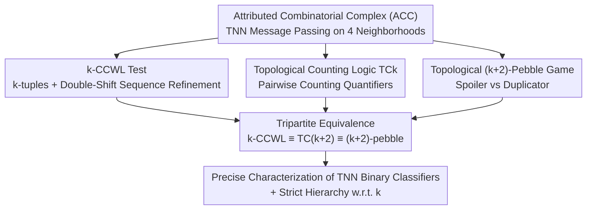

# The Logical Expressiveness of Topological Neural Networks

**Conference**: ICLR 2026  
**OpenReview**: [https://openreview.net/forum?id=8w8jzJXjhj](https://openreview.net/forum?id=8w8jzJXjhj)  
**Code**: Not provided  
**Area**: Learning Theory / Graph & Topological Representation Learning  
**Keywords**: Topological Neural Networks, Expressive Power, Weisfeiler-Leman, Counting Logic, Pebble Games

## TL;DR
This paper establishes the first "algorithm–logic–game" tripartite characterization for Topological Neural Networks (TNNs). It proposes the $k$-CCWL, a higher-order WL test on combinatorial complexes; the topological counting logic $\text{TC}_k$ with pairwise counting quantifiers; and the topological $(k{+}2)$-pebble game. The authors strictly prove the equivalence: $k\text{-CCWL} \equiv \text{TC}_{k+2} \equiv$ topological $(k{+}2)$-pebble game, thereby precisely defining the binary classifiers that TNNs can represent.

## Background & Motivation

**Background**: Graph Neural Networks (GNNs) are the dominant paradigm for learning on graphs, but their expressive power is known to be upper-bounded—most message-passing GNNs are at most as strong as 1-WL (color refinement), failing to distinguish certain non-isomorphic graphs or structural properties like cycles and connected components. Importantly, Barceló et al. (2020) provided a **precise characterization** of node-level binary classifiers expressible by GNNs using first-order logic.

**Limitations of Prior Work**: To break the 1-WL bound, Topological Neural Networks (TNNs) have emerged. They perform message passing on "combinatorial complexes" (CC), transmitting info not just between nodes but across higher-order cells (edges, faces) via boundary, coboundary, upper-adjacency, and lower-adjacency neighborhoods. While naturally stronger than GNNs, a fundamental question remains: **What is the logical expressiveness of TNNs?** While logical characterizations for GNNs and their higher-order variants are mature, they are nearly non-existent for TNNs.

**Key Challenge**: Classical graph theory features a tripartite correspondence: $k\text{-WL} \leftrightarrow C_{k+1}$ counting logic $\leftrightarrow (k{+}1)$-pebble game (Cai et al., 1992), where the three define equivalent expressive power. However, this machinery **cannot be directly ported to TNNs**. In graphs, an edge connects two points directly, whereas in complexes, relations between two cells are often **mediated by a third cell** (e.g., two edges are adjacent because they share a vertex or belong to the same face). Standard counting quantifiers count single variables and cannot capture these "pairwise, mediated" high-order interactions.

**Goal**: To lift the classical "$k\text{-WL} \leftrightarrow C_{k+1} \leftrightarrow (k{+}1)$-pebble" correspondence to **Attributed Combinatorial Complexes (ACC)** and use it to analyze TNN expressiveness. Specifically: ① Design a WL-style refinement matching TNN aggregation; ② Design a logical fragment describing its distinguishing power; ③ Design an aligned game; ④ Prove their strict equivalence.

**Key Insight**: TNN aggregation essentially processes **pairwise relational signals** (updating a cell requires both its neighbor $y$ and the mediating cell $\delta$). Thus, the logic side must introduce a **pairwise counting quantifier** $\exists^{N}(x_i,x_j)\,\varphi$, which counts pairs of cells $(x_i,x_j)$ satisfying $\varphi$. This is the "correct logical abstraction" for high-order interactions and is the root cause for shifting the game from $k{+}1$ to $k{+}2$ pebbles.

## Method

### Overall Architecture

Ours does not propose a new model but rather **builds a theoretical framework** to characterize TNN expressiveness. The starting point is the Attributed Combinatorial Complex (ACC) $\Gamma=(S,X,\text{rk},c)$, where $S$ is the vertex set, $X$ is the set of cells, $\text{rk}$ assigns a rank to each cell, and $c$ provides binary labels. Four neighborhoods are defined: boundary $N_B$, coboundary $N_C$, upper-adjacency $N_\uparrow$, and lower-adjacency $N_\downarrow$. A general TNN performs message passing on this structure, where updating a cell involves aggregating neighbor and mediating cell $\delta$ information.

To address which non-isomorphic ACCs a TNN can distinguish, the paper constructs tools from three perspectives: **Algorithmically**, the $k$-CCWL (lifting $k$-WL to CCs); **Logically**, $\text{TC}_k$ (counting logic with pairwise quantifiers); and **Gametically**, the topological $(k{+}2)$-pebble game. The main result proves $k\text{-CCWL} \equiv \text{TC}_{k+2} \equiv$ topological $(k{+}2)$-pebble game, with expressiveness strictly increasing with $k$.

### Key Designs

**1. $k$-CCWL: Lifting WL Refinement to Combinatorial Complexes via "Double-Shift Sequences"**

Classical $k$-WL refines colorings of $k$-tuples of vertices. $k$-CCWL operates on $k$-tuples of **cells** $\mathbf{x}=(x_1,\dots,x_k)$. Initial labels are **atomic types** $\text{atp}_k(\mathbf{x})$, encoding rank sequences, initial colors $c(x_i)$, and five binary vectors describing pairwise relations (equality + 4 adjacency types). The key innovation is the update step:

$$\chi^{(t)}_k(\mathbf{x}) = \text{HASH}\Big(\chi^{(t-1)}_k(\mathbf{x}),\ D^{(t)}_k(\mathbf{x})\Big),\quad D^{(t)}_k(\mathbf{x}) = \Big\{\!\!\Big\{\big(\text{atp}_{k+2}(\mathbf{x}\alpha\beta),\ \Delta^{(t-1)}_k(\mathbf{x};\alpha,\beta)\big)\ \big|\ \alpha,\beta\in X\Big\}\!\!\Big\}$$

Each refinement step probes **two simultaneous substitutions $(\alpha,\beta)$** using double-shift sequences $\Delta^{(t-1)}_k(\mathbf{x};\alpha,\beta)=\big\langle\big(\chi^{(t-1)}_k(\mathbf{x}[\alpha/i]),\chi^{(t-1)}_k(\mathbf{x}[\beta/i])\big)\big\rangle_{i=1}^{k}$. This "double-shift" is the algorithmic counterpart of TNN aggregation (neighbor $y$ + mediator $\delta$). It explains why the logic side requires $k{+}2$ variables and the game requires $k{+}2$ pebbles. $1$-CCWL covers most cell-complex TNNs (CW Networks/CIN, MPSN, UniGCN/UniGIN). Complexity is $O(n^{2k+2})$ time and $O(n^{\max(2,k)})$ space ($n=|X|$).

**2. Topological Counting Logic $\text{TC}_k$: Capturing High-Order Relations via "Pairwise Counting Quantifiers"**

Standard counting logic $C_k$ quantifiers $\exists^N x_i\,\psi$ only count single elements. $\text{TC}_k$ introduces:

$$\Gamma,\mu \models \exists^{N}(x_i,x_j)\,\psi \iff \big|\{(c_1,c_2)\in X^2 \mid \Gamma,\mu[x_i\mapsto c_1, x_j\mapsto c_2]\models\psi\}\big| \ge N$$

This means "at least $N$ pairs of cells $(c_1,c_2)$ satisfy $\psi$." Atomic predicates include rank $R_r(x_i)$, color $P_s(x_i)$, and binary adjacency $E_N(x_i,x_j)$. Since TNN updates involve mediating cells, they aggregate "pairwise signals"—making pairwise quantifiers the correct logical abstraction. Ours proves $\text{TC}_{k+2}$ refines $k$-CCWL (Theorem 4.1): each $k$-CCWL step corresponds to a quantifier layer in $\text{TC}_{k+2}$ using $k$ variables for the tuple and 2 for the $(\alpha,\beta)$ pair. Note: $\text{TC}_k$ is still local and cannot express global properties like connectivity or homology for fixed $k$.

**3. Topological $(k+2)$-Pebble Game: Translating Logic into Spoiler/Duplicator Dynamics**

This game provides a game-theoretic characterization of $\text{TC}_k$. Played on ACCs $A,B$ by Spoiler and Duplicator, the state consists of partial assignments $\mu_A,\mu_B$. The core rule for pairwise quantifiers: **① Spoiler chooses a complex and a set of ordered pairs $P_A\subseteq X_A^2$; ② Duplicator must respond with an equally sized $P_B\subseteq X_B^2$; ③ Spoiler picks a pair from $P_B$ to pebble; ④ Duplicator pebbles a pair in the other complex.** Duplicator wins by maintaining $k$-dimensional structural similarity (matching ranks, colors, and adjacencies). Ours proves: Duplicator has a winning strategy in the $k$-pebble game $\Rightarrow \text{TC}_k$ equivalence (Theorem 5.1); $k$-CCWL coloring identity $\Rightarrow$ Duplicator winning strategy in the $(k+2)$-pebble game (Theorem 5.2).

**4. Tripartite Equivalence and Strict Hierarchy**

By combining Theorem 4.1, 5.1, and 5.2, Corollary 5.3 is obtained: stable $k$-CCWL coloring identity $\Leftrightarrow$ Duplicator winning strategy in $(k+2)$-pebble game $\Leftrightarrow \text{TC}_{k+2}$ formula equivalence. Theorem 3.2 establishes that expressiveness strictly increases with $k$. This anchors TNN distinguishability—previously an empirical intuition—into a framework of precise logical formulas and intuitive games.

### Example: Distinguishing Simplicial Complexes with $\text{TC}_4$

Consider two non-isomorphic simplicial complexes $A,B$ (Figure 2), where $A$ consists of two $C_4$ cycles joined by an edge. 1-CCWL/SWL fails to distinguish them. However, with $k=2$ (corresponding to $\text{TC}_4$), the formula:

$$\phi = \exists^{16}(x_1,x_2)\,\exists^{1}(x_3,x_4)\ \text{CYCLE}(x_1,x_2,x_3,x_4)$$

where $\text{CYCLE}$ requires a 4-cycle via $N_\downarrow$, distinguishes them because $A \models \phi$ while $B \not\models \phi$. On the game side, Spoiler forces a win by selecting pairs that Duplicator cannot match while maintaining local CC-isomorphism.

## Key Experimental Results

### Main Theoretical Results

| Conclusion | Source | Content |
|------|------|------|
| Main Equivalence | Corollary 5.3 | $k\text{-CCWL} \equiv \text{TC}_{k+2} \equiv$ topological $(k{+}2)$-pebble game |
| Strict Hierarchy | Theorem 3.2 | For any $k$, there exist non-ismorphic ACCs distinguishable by $k$-CCWL but not $(k{-}1)$-CCWL |
| Logic Refines Algorithm | Theorem 4.1 | $\text{TC}_{k+2}$ equivalence $\Rightarrow k$-CCWL coloring equivalence |
| Game $\Rightarrow$ Logic | Theorem 5.1 | Duplicator winning $k$-pebble game $\Rightarrow \text{TC}_k$ equivalence |
| Algorithm $\Rightarrow$ Game | Theorem 5.2 | $k$-CCWL coloring equivalence $\Rightarrow$ Duplicator winning $(k{+}2)$-pebble game |
| Binary Property | Proposition 3.1 | For uniform ACC with a broadcast anchor, global colors are either identical or disjoint |
| Coverage | Section 3 | $1$-CCWL covers most existing TNNs (CIN, MPSN, UniGIN, etc.) |

### Mapping from Graphs to Complexes

| Aspect | On Graphs (Classical) | On Complexes (Ours) | Key Extension |
|------|------------------------------|----------------|----------|
| Algorithm | $k$-WL | $k$-CCWL | Double-shift sequence, 4 adjacency types |
| Logic | $C_{k+1}$ counting logic | $\text{TC}_{k+2}$ | Pairwise quantifier $\exists^N(x_i,x_j)$ |
| Game | $(k{+}1)$-pebble game | $(k{+}2)$-pebble game | Selecting pairs of cells |

### Key Findings
- **"Pairwise" is the central theme**: Double-shifting in algorithms, pairwise quantifiers in logic, and cell-pair selection in games all stem from high-order interactions mediated by a third cell.
- **Strict Hierarchy**: Fixed $k$ models have clear upper bounds, but increasing $k$ strictly expands the class of distinguishable complexes.
- **Fundamental Boundaries**: $\text{TC}_k$ is local. Global topological invariants (connectivity, homology) require unbounded variables and cannot be expressed at fixed $k$.

## Highlights & Insights
- **Formalizing "TNN is stronger"**: This work converts empirical observations into provable theorems, allowing us to describe exactly what TNNs can compute using logic.
- **Unified Abstraction**: The pairwise counting quantifier $\exists^N(x_i,x_j)$ elegantly explains the algorithmic double-shift and the increase in pebble count.
- **Transferable Insight**: The shift from $k{+}1$ to $k{+}2$ pebbles suggests that the number of "spare variables" needed for logical characterization depends on the arity of the aggregation mechanism (n-ary interactions).

## Limitations & Future Work
- **Ours' Constraints**: As a finite variable logic, $\text{TC}_k$ cannot capture connectivity, Hamiltonian paths, or homology, which require unbounded quantification.
- **Theoretical Nature**: No empirical experiments were conducted. The actual benefit of increasing $k$ on generalization or sample complexity remains unexplored.
- **Future Directions**: Extending this to node-level classification characterization (similar to Barceló et al.); studying restricted $\text{TC}_k$ fragments for efficiency; combining with global invariants to address logical "blind spots."

## Related Work & Insights
- **Cai et al. (1992)**: Established the graph-based $k\text{-WL} \leftrightarrow C_{k+1} \leftrightarrow (k{+1})$ correspondence; ours lifts this to complexes via pairwise mechanisms.
- **Barceló et al. (2020)**: Characterized GNN binary classifiers; ours provides the topological prerequisite by defining distinguishability limits.
- **Bodnar et al. (2021)**: Proposed CIN/MPSN; ours proves these models fall within 1-CCWL expressiveness.
- **Eitan et al. (2025)**: Identified blind spots in high-order message passing; ours provides the logical basis for these limitations (properties needing unbounded $k$).

## Rating
- Novelty: ⭐⭐⭐⭐⭐ (First tripartite characterization for TNNs; pairwise quantifier is a clean abstraction)
- Experimental Thoroughness: ⭐⭐⭐ (Purely theoretical; rigorous proofs but no empirical validation)
- Writing Quality: ⭐⭐⭐⭐ (Unified "pairwise" theme; clear explanation of the $k{+}2$ shift)
- Value: ⭐⭐⭐⭐ (Foundational for topological representation learning theory)

<!-- RELATED:START -->

## Related Papers

- [\[ICLR 2026\] From Neural Networks to Logical Theories: The Correspondence between Fibring Modal Logics and Fibring Neural Networks](from_neural_networks_to_logical_theories_the_correspondence_between_fibring_moda.md)
- [\[ICLR 2026\] Reducing Symmetry Increase in Equivariant Neural Networks](reducing_symmetry_increase_in_equivariant_neural_networks.md)
- [\[ICLR 2026\] Random Spiking Neural Networks are Stable and Spectrally Simple](random_spiking_neural_networks_are_stable_and_spectrally_simple.md)
- [\[ICLR 2026\] A New Initialization to Control Gradients in Sinusoidal Neural Networks](a_new_initialization_to_control_gradients_in_sinusoidal_neural_networks.md)
- [\[ICLR 2026\] On the Expressiveness of State Space Models via Temporal Logics](on_the_expressiveness_of_state_space_models_via_temporal_logics.md)

<!-- RELATED:END -->
