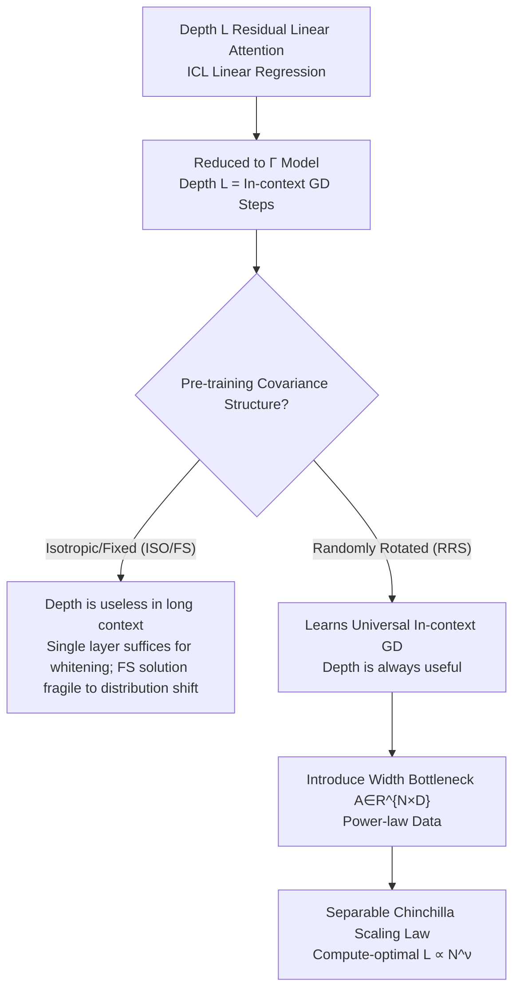

# Theory of Scaling Laws for In-Context Regression: Depth, Width, Context and Time

**Conference**: ICLR 2026  
**OpenReview**: [https://openreview.net/forum?id=qA42mWsnbl](https://openreview.net/forum?id=qA42mWsnbl)  
**Code**: To be confirmed  
**Area**: Learning Theory / In-Context Learning / Scaling Law  
**Keywords**: In-context learning, linear attention, neural scaling laws, depth and width, solvable models

## TL;DR
This paper provides a **solvable theoretical model** for deep linear self-attention in in-context linear regression (ICL). By analyzing the joint limit where data dimension, context length, and residual stream width scale proportionally, the authors precisely determine the asymptotic behavior of risk. They reveal that "when depth is useful" depends entirely on the covariance structure of pre-training tasks, deriving a Chinchilla-style scaling law encompassing width, depth, time, and context length with a compute-optimal shape of $L \propto N^\nu$.

## Background & Motivation

**Background**: Empirical scaling laws for Transformers (Kaplan, Chinchilla) suggest "bigger is better," with scaling strategies typically increasing width $N$ and depth $L$ at a fixed aspect ratio $L/N$. However, existing scaling law theories primarily characterize the role of **width** (or equivalent pre-training data/time), abstracting models into one or two layers and introducing "finite model size" via a random projection to $N$ dimensions. This essentially represents a width-based scaling law that fails to distinguish the individual contributions of depth and width.

**Limitations of Prior Work**: Consequently, no theory currently explains how to distribute width and depth under a fixed compute budget, nor can it determine if "scaling at a fixed aspect ratio" is compute-optimal. Furthermore, the architectural requirements for In-Context Learning (ICL)—specifically how deep a model needs to be—lack a solvable theoretical characterization.

**Key Challenge**: The role of depth in Transformers is fundamentally different from width. Depth provides the capacity for "iterative computation / multi-step algorithms," which is erased by theories that compress models into a single layer. To discuss the value of depth, a **truly deep** solvable model is required, and the gains from depth must be coupled with the statistical structure of the task.

**Goal**: This is decomposed into two open questions—Q1: What determines the optimal Transformer shape and scaling law? Do depth and width only act through total parameter count? Q2: How does the statistical structure of ICL tasks influence the learned solution?

**Key Insight**: The authors construct a **residual linear attention** model of depth $L$ for ICL linear regression and reduce it to a looped model governed by a single matrix $\Gamma$. The gradient flow of this reduced model corresponds exactly to "$L$ steps of in-context gradient descent (in-context GD) with a step size." Thus, "depth = number of iterations" is explicitly encoded, allowing the dynamics to be solved precisely using random matrix theory.

**Core Idea**: Using a solvable toy model of **deep linear attention + three types of covariance data models**, the ICL scaling law is decomposed into four separable power-law terms: width, depth, time, and context. It is proven that the utility of depth is determined by whether the covariance varies across contexts.

## Method

### Overall Architecture

The most general model is a residual linear attention network $f$ of depth $L$. $P$ labeled context pairs $\{(x_\mu,y_\mu)\}$ and $K$ query points $\{x^\star_\mu\}$ are concatenated into a data matrix $D$ (with query targets masked to 0). Each layer performs a **linear attention** update (using $q_\mu\cdot k_\nu$ instead of softmax):

$$h^{\ell+1}_\mu = h^\ell_\mu + \frac{1}{LP}\sum_{\nu=1}^{P} M_{\mu\nu}\,\big((k^\ell_\nu)^\top q^\ell_\mu\big)\,v^\ell_\nu,\qquad f_\mu = w_o\cdot h^L_\mu,$$

where $q,k,v$ are generated linearly by shared or layer-wise weights $W_q,W_k,W_v$. The loss is the mean squared error on query points.

The key step is **reduction**: following the simplest reparameterization for linear regression ICL (where the residual stream places $x$ information in a subspace orthogonal to $w_y=w_o$) and assuming weight-tying (looped/universal transformer), the model collapses into a predictor determined by a $D\times D$ matrix $\Gamma$:

$$f(x^\star) = \frac{1}{LP}\,x_\star^\top \Gamma \sum_{\ell=0}^{L-1}\big(I - L^{-1}\hat\Sigma\Gamma\big)^\ell X^\top y,\qquad \hat\Sigma=\tfrac{1}{P}XX^\top.$$

This expression is the expansion of "$L$ steps of preconditioned gradient descent with step size $1/L$." Thus, **depth $L$ directly equals the number of iterations in in-context GD**. The analytical framework involves solving the gradient flow dynamics of $\Gamma$ under the joint limit $P,K,B,D\to\infty$ with proportional ratios $P/D=\alpha,\ K/D=\kappa,\ B/D=\tau$, and extracting the precise asymptotics and power laws.

### Key Designs

**1. Γ Reduced Model: Translating "Depth" into "In-context GD Iterations"**

Directly analyzing the weight dynamics of multi-layer attention is nearly intractable. This work utilizes a minimal reparameterization of ICL linear regression to collapse the entire stack into a single matrix $\Gamma\equiv (w_o^\top W_v w_y)\,W_x^\top W_k^\top W_q W_x$. The predictor becomes $f(x^\star)=\frac{1}{LP}x_\star^\top\Gamma\sum_{\ell=0}^{L-1}(I-L^{-1}\hat\Sigma\Gamma)^\ell X^\top y$. The physical meaning of this geometric series is clear: it represents $L$ steps of gradient descent using the preconditioner $\Gamma$ to fit the regression problem in the context. Consequently, "network depth" is mapped one-to-one to the "number of GD iterations in context." This is the pivot for all subsequent conclusions—because depth is explicitly modeled, one can discuss when depth is useful, unlike single-layer theories that equate depth with width. The authors also prove that unbinding the layers ($\Gamma_\ell$) and scaling the learning rate by depth $\eta=\eta_0 L$ yields dynamics **completely equivalent** to the looped model under noise-free RRS (Result 9).

**2. Three Covariance Data Models: Making "Depth Utility" a Function of Covariance Structure**

Three ICL data distributions with increasing levels of generalization are designed, with the core variable being **whether covariance varies across contexts**. ① ISO: Isotropic $x\sim\mathcal N(0,I)$ and isotropic task vectors. ② FS (fixed structured): All contexts share a fixed but structured covariance $\langle xx^\top\rangle=\Sigma$ and task relation $\langle\beta\beta^\top\rangle=\Omega$. ③ RRS (randomly rotated structured): The covariance of each context $c$ is rotated by a Haar random orthogonal matrix $\Sigma_c=O_c\Lambda O_c^\top$. The motivation for RRS is specific: under ISO/FS, the model can "memorize" the whitening transform $\Sigma^{-1}$ directly into $\Gamma$, achieving zero loss in a single step ($L=1$) for long contexts $\alpha\to\infty$. Random rotations **prohibit** encoding a fixed whitening transform, forcing the model to learn a **universal in-context GD algorithm** effective for any covariance. Such an algorithm naturally requires multiple iterations, ensuring depth provides continuous gains even with infinite context.

**3. Width Bottleneck + DMFT: Combining Width, Depth, Time, and Context**

To discuss "compute-optimal shape," width must be an independent resource. The authors introduce a projection matrix $A\in\mathbb R^{N\times D}$ to project inputs to $N$-dimensional features $\tilde x=Ax$, restricting $\Gamma(t)=\gamma(t)(AA^\top)$ to rank $N$. In the RRS + power-law feature setting, the driving matrix $M=O(A^\top A)^2O^\top\hat\Sigma$ is non-symmetric, rendering standard random matrix methods ineffective. The authors employ **Dynamical Mean Field Theory (DMFT)**—a technique from spin-glass physics—alongside two-point deterministic equivalents to solve the loss landscape (Result 7). This mechanism eventually expresses the risk as an explicitly calculable deterministic function where width $N$, depth $L$, time $t$, and context $P$ each occupy a separable power-law term.

### Loss & Training

Training occurs via online SGD/gradient flow minimizing the query point squared loss $L=\langle \frac1K\sum_{\mu=P+1}^{P+K}(f_\mu-y_\mu)^2\rangle_D$. After reduction, this is equivalent to gradient flow on the scalar $\gamma(t)$ (or matrix $\Gamma$). For example, under ISO, $\Gamma(t)=\gamma(t)I$ and $\frac{d}{dt}\gamma=-\partial_\gamma L(\gamma,\alpha)$; under RRS, $\frac{d}{dt}\gamma=\mathrm{tr}[\Lambda^2\Omega(I-L^{-1}\gamma\Lambda)^{2L-1}]$. The authors demonstrate that successful pre-training requires a total of $Bt=\Theta(D)$ contexts, each of size $P=\Theta(D)$, saving a factor of $D$ in compute and data compared to previous work.

## Key Experimental Results

Experiments consist of "Theory vs. Numerical Simulation" verification: training linear/softmax Transformers with small dimensions (e.g., $D=32$) to verify the loss curves and power-law exponents predicted by asymptotic formulas.

### Main Results: The Role of Depth across Covariance Types

| Data Setting | Covariance varies across context | Depth useful as $\alpha\to\infty$ | Learned Solution |
|--------------|-----------------------------------|-----------------------------------|------------------|
| ISO (Isotropic) | No | No, $L=1$ is optimal (zero loss if $\sigma^2=0$) | Scalar $\Gamma=\gamma I$ |
| FS (Fixed Structured) | No | No, $\Gamma=L\Sigma^{-1}$ gives zero loss | Memorizes $\Sigma^{-1}$, **fragile to shift** |
| RRS (Randomly Rotated) | **Yes** | **Yes**, depth continuously reduces loss | Universal in-context GD |

At finite context $\alpha$, a clear gap between shallow and deep models is observed: under ISO with $\sigma^2=0$, $L=1$ loss saturates at $L^\star=(1+\alpha)^{-2}$, while $L\to\infty$ yields $L^\star=[1-\alpha]_+$. The gap at finite $\alpha$ indicates that **depth is only useful for ISO/FS when context length is limited**.

### Chinchilla-style Scaling Law and Compute-Optimal Shape

Under RRS + power-law data (source/capacity indices $\beta,\nu$, where $\lambda_k\sim k^{-\nu}$), the risk decomposes into four separable power-law terms (Result 8):

$$L(t,N,L,P)\approx c_t\,t^{-\frac{\beta}{2+\beta}} + c_N\,N^{-\nu\beta} + c_L\,L^{-\beta} + c_P\,P^{-\nu\beta}.$$

Given a fixed compute budget $C=tP^2N^2L$, the compute-optimal width and depth satisfy $L\propto N^\nu$. The aspect ratio is determined by the spectral decay index $\nu$ of the data, rather than being a universal constant.

| Scaling Dimension | Exponent | Meaning |
|-------------------|----------|---------|
| Pre-training Time $t$ | $\beta/(2+\beta)$ | Training steps |
| Width $N$ | $\nu\beta$ | Feature dimension bottleneck |
| Depth $L$ | $\beta$ | Iteration count bottleneck |
| Context $P$ | $\nu\beta$ | Samples per context |

### Key Findings
- **The value of depth is not universal, but a function of task statistical structure**: If covariance is homogeneous across contexts (ISO/FS), depth is useless in long contexts as a single layer can perform whitening. If covariance is heterogeneous (RRS), depth remains useful. This transforms "when to add depth" from an empirical question to a decidable theoretical proposition.
- **Fragility of FS Solutions**: Solutions pre-trained on fixed covariance "memorize" $\Sigma^{-1}$ rather than learning a universal algorithm. Once the test covariance $\Sigma'=\exp(\theta S)\Sigma\exp(-\theta S)$ deviates, the OOD loss $L_{\text{OOD}}$ rises monotonically with $\theta$ across all depths.
- **Bottlenecks in scaling only one dimension**: Figure 5 shows that increasing only width with fixed depth (or vice versa) leads to a performance floor. Monotonic decrease with compute is only achieved when both $N$ and $L$ are increased.
- **Robustness to model form**: Conclusions hold for unbinding layers (Result 9), performing gradient flow on full attention weights $\{W_k,W_q,W_v\}$ (Result 10), and even for Adam-trained softmax attention with multi-head and MLP.

## Highlights & Insights
- **The mapping "Depth = In-context GD Steps" is the soul of the paper**: It translates abstract network depth into a physically meaningful algorithm iteration count, allowing the utility of depth to be derived precisely. This perspective is transferable to the analysis of looped/universal transformers and "thinking longer" reasoning models.
- **Using RRS (Randomly Rotated Covariance) as a switch to "force the model to learn universal algorithms" is ingenious**: By prohibiting the model from memorizing a fixed whitening transform, the authors separate "memorization" from "algorithmic" solutions, providing a clean solvable example of "task diversity $\to$ generalized algorithms."
- **First solvable neural scaling law including both width and depth**: The four separable power laws and the $L\propto N^\nu$ optimal shape provide quantitative answers for compute allocation based on the data spectrum, offering direct insights for architectural selection.
- The use of DMFT and two-point deterministic equivalents to handle non-symmetric driving matrices $M=O(A^\top A)^2O^\top\hat\Sigma$ provides a reusable toolset for high-dimensional non-symmetric dynamics.

## Limitations & Future Work
- **Limited to linear regression + linear attention**: The authors acknowledge that the primary limitation is the linearity of both the task and attention. Whether these conclusions hold for non-linear function approximation or non-linear attention remains unproven (softmax experiments are only phenomenological evidence).
- **Online learning focus**: The effects of over-fitting due to repeated tasks/contexts are not characterized.
- **Covariance heterogeneity limited to RRS**: More complex forms of heterogeneity, such as distribution shift, variable label noise, or hierarchical structures, are not covered.
- Training strategies closer to practice, such as large learning rate effects or dynamically increasing loop steps to save compute, are left for future research.

## Related Work & Insights
- **vs. Lu et al. (2025)**: While they analyze asymptotic scaling for single-layer linear attention ICL, this paper generalizes it to arbitrary depth $L$ and improves compute efficiency by a factor of $D$ through proportional scaling of $P,K,B,D$.
- **vs. Lyu et al. (2025)**: They provide scaling laws for ICL in time and context length, but their model is essentially 1-2 layers with random projections, functioning more as a width scaling law. This paper distinguishes the functions and bottlenecks of width vs. depth.
- **vs. Gatmiry et al. (2024)**: They suggested that solving ICL with high condition numbers requires sufficient residual steps (depth or loops). This paper quantifies "why depth is needed" as "covariance variation across contexts $\to$ requirement for multi-step universal GD."
- **vs. µP / Depth residual scaling theories (Yang, Bordelon, etc.)**: Those works establish stable infinite width/depth limits but cannot compare the relative benefits of width vs. depth under a fixed budget; this paper fills that gap for "compute-optimal shape."

## Rating
- Novelty: ⭐⭐⭐⭐⭐ First solvable ICL neural scaling law for both width and depth; the "depth=ICL GD" view is powerful.
- Experimental Thoroughness: ⭐⭐⭐⭐ Theoretical and numerical verifications are rigorous, though limited to small dimensions and synthetic data.
- Writing Quality: ⭐⭐⭐⭐ Conclusions are clearly organized via Results; balances physical intuition with formal proofs, though the DMFT sections are technically demanding.
- Value: ⭐⭐⭐⭐⭐ Transforms the choice between width and depth from an empirical trial-and-error process into a decidable problem governed by the data spectrum.

<!-- RELATED:START -->

## Related Papers

- [\[ICLR 2026\] Critical Attention Scaling in Long-Context Transformers](critical_attention_scaling_in_long-context_transformers.md)
- [\[ICLR 2026\] Intrinsic Entropy of Context Length Scaling in LLMs](intrinsic_entropy_of_context_length_scaling_in_llms.md)
- [\[ICLR 2026\] Pretrain–Test Task Alignment Governs Generalization in In-Context Learning](pretraintest_task_alignment_governs_generalization_in_in-context_learning.md)
- [\[ICLR 2026\] On learning linear dynamical systems in context with attention layers](on_learning_linear_dynamical_systems_in_context_with_attention_layers.md)
- [\[ICLR 2026\] In-Context Algorithm Emulation in Fixed-Weight Transformers](in-context_algorithm_emulation_in_fixed-weight_transformers.md)

<!-- RELATED:END -->
